# 2.1 定义函数

> 原文：[`introcs.cs.princeton.edu/python/21function`](https://introcs.cs.princeton.edu/python/21function)

从本书站点的开始，您一直在编写调用 Python 函数的代码。在本节中，您将学习如何定义和调用自己的函数。函数支持一个关键概念，从现在开始将贯穿您的编程方法：*每当您可以清晰地将计算中的任务分开时，您都应该这样做*。

* * *

## 使用和定义函数

调用 Python 函数的效果很容易理解。例如，当您在程序中放置`math.sqrt(a-b)`时，效果就好像您用 Python 的`math.sqrt()`函数传递表达式`a-b`作为参数时替换了该代码的返回值。如果您考虑系统为实现此效果所必须做的工作，您将看到它涉及更改程序的*控制流*。

您可以使用`def`语句定义函数，该语句指定函数签名，后跟构成函数的一系列语句。例如，harmonicf.py 定义了一个名为`harmonic()`的函数，该函数接受一个参数`n`并计算第`n`个调和数（如第 1.3 节中所述）。它还说明了 Python 程序的典型结构，包括三个组件：

+   一系列`import`语句

+   一系列*函数定义*

+   任意*全局代码*，或程序的主体

当我们在命令行上键入`python harmonicf.py`调用程序时，Python 执行全局代码；该全局代码调用了先前定义的`harmonic()`函数。（为了说明，我们使程序的用户交互部分比第 1.3 节中更复杂。���

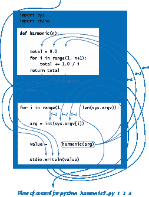

### 控制流程。

右侧显示的图表说明了命令`python harmonicf.py 1 2 3`的控制流程。首先，Python 处理`import`语句，从而使程序中定义的`sys`和`stdio`模块中的所有功能可用。接下来，Python 处理了第 4 到 8 行中`harmonic()`函数的定义，但不执行该函数 — Python 只有在调用函数时才执行函数。然后，Python 执行函数定义后全局代码中的第一条语句，即`for`语句，直到 Python 开始执行语句`value = harmonic(arg)`，从`arg`为 1 开始正常进行。为此，它将控制传递给`harmonic()`函数 — 控制流程传递到函数定义中的代码。Python 将“参数”变量`n`初始化为 1，将“局部”变量`total`初始化为 0.0，然后执行`harmonic()`中的`for`循环，该循环在一次迭代后终止，总和等于 1.0。然后，Python 执行`harmonic()`定义末尾的`return`语句，导致控制流跳回到调用语句`value = harmonic(arg)`，从离开的地方继续，但现在表达式`harmonic(arg)`被替换为 1.0。因此，Python 将 1.0 赋给`value`并将其写入标准输出。然后，Python 再次迭代循环，并第二次调用`harmonic()`函数，其中`n`初始化为 2，结果为 1.5。然后，该过程再次重复，`arg`（然后`n`）等于 4，结果为 2.083333333333333。最后，`for`循环终止，整个过程完成。正如图表所示，简单的代码掩盖了相当复杂的控制流程。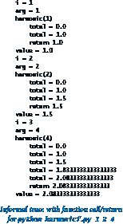

### 非正式函数调用/返回跟踪。

通过函数调用跟踪控制流的一个简单方法是想象每个函数在被调用时写下其名称和参数，以及在返回之前写下其返回值，调用时增加缩进，返回时减少缩进。这个结果通过写入变量的值来增强程序的追踪过程，我们从第 1.2 节开始一直在使用。我们的示例的非正式追踪如右侧所示。

### 基本术语。

数学函数的概念中包含了几个概念，对应于每个概念在 Python 中都有相应的构造，如下表所总结的：

> 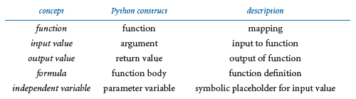

当我们在定义数学函数的公式中使用符号名称（例如*f*(*x*) = 1 + *x* + *x*²）时，符号*x*是某个输入值的占位符，将被替换到公式中以确定输出值。在 Python 中，我们使用*参数变量*作为符号占位符，并将要评估函数的特定输入值称为*参数*。

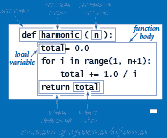

### 函数定义。

函数定义的第一行，也称为*签名*，为函数和每个参数变量赋予名称。签名由关键字`def`、函数名称、由逗号分隔并括在括号中的零个或多个参数变量名称序列以及冒号组成。缩进的语句跟在签名后面定义函数体。函数体可以包含我们在第一章讨论过的各种语句。它还可以包含一个返回语句，将控制转移到调用函数的地方，并返回计算结果或返回值。函数体还可以定义*局部变量*，这些变量仅在定义它们的函数内部可用。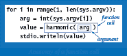

### 函数调用。

正如我们一直看到的，Python 函数调用只是函数名称后跟其参数，用逗号分隔并括在括号中。每个参数可以是一个表达式，它被评估并将结果值作为输入传递给函数。当函数完成时，返回值取代函数调用的位置，就像它是一个变量的值（可能在表达式中）。

### 多个参数。

像数学函数一样，Python 函数可以有多个参数变量，因此可以用多个参数调用它。

### 多个函数。

您可以在一个.py 文件中定义任意数量的函数。这些函数是独立的，除非它们通过调用相互引用。但是，函数的定义必须出现在调用它的任何全局代码之前。这就是典型的 Python 程序包含（1）`import`语句，（2）函数定义和（3）任意全局代码的原因，按照这个顺序。

### 多个返回语句。

您可以在函数中放置`return`语句，无论何时需要它们：一旦到达第一个`return`语句，控制就会返回到调用程序。

### 单个返回值。

Python 函数仅向调用者提供一个返回值（或更准确地说，它返回一个对象的引用）。这一政策并不像看起来那么严格，因为 Python 数据类型可以包含比单个数字、布尔值或字符串更多的信息。例如，您将在本节后面看到，您可以将数组用作返回值。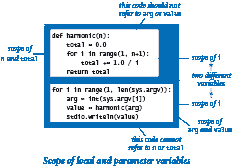

### 作用域。

变量的*作用域*是可以直接引用该变量的语句集合。函数的局部和参数变量的作用域仅限于该函数；在全局代码中定义的变量的作用域（称为全局变量）仅限于包含该变量的`.py`文件。因此，全局代码不能引用函数的局部或参数变量。一个函数也不能引用另一个函数中定义的局部或参数变量。当一个函数使用与全局变量相同名称的局部（或参数）变量定义变量时（例如`harmonicf.py`中的`i`），函数中的变量名称指的是局部（或参数）变量，而不是全局变量。虽然函数中的代码可以引用全局变量，但不应该这样做：调用者到函数的所有通信应该通过函数的参数变量进行，函数到调用者的所有通信应该通过函数的返回值进行。

### 默认参数。

Python 函数可以通过为该参数指定默认值来指定一个参数为可选。如果在函数调用中省略了可选参数，则 Python 会用默认值替换该参数。我们已经遇到了这个特性的几个例子。您可以通过在函数签名中的参数变量后面放置一个等号，然后是默认值，来在用户定义的函数中指定一个带有默认值的可选参数。您可以在函数签名中指定多个可选参数，但所有可选参数必须在所有必选参数之后。下表中的`harmonic()`函数使用了一个默认参数。

### 副作用。

*纯函数*是一个函数，给定相同的参数，总是返回相同的值，而不产生任何可观察的*副作用*，如消耗输入、产生输出或以其他方式改��系统的状态。在计算机编程中，定义产生副作用的函数也是有用的。事实上，我们经常定义的函数的唯一目的是产生副作用。在这样的函数中，显式的返回语句是可选的：在 Python 执行函数的最后一个语句后，控制返回给调用者。没有指定返回值的函数实际上返回特殊值`None`，通常被忽略。下表中的`drawTriangle()`函数具有副作用，并且不返回值。

### 类型检查。

在数学中，函数的定义同时指定了定义域和值域。例如，对于调和数，定义域是正整数，值域是正实数。在 Python 中，我们不需要指定参数变量的类型或返回值的类型。只要 Python 可以在函数内执行所有操作，Python 就会执行该函数并返回一个值。如果 Python 无法对给定对象执行操作，因为它的类型不正确，Python 会引发运行时错误以指示无效类型。这种灵活性是 Python 的一个受欢迎特性（称为*多态性*），因为它允许我们为不同类型的对象定义一个单一函数来使用。

下表总结了我们的讨论，提供了函数定义的示例。

> 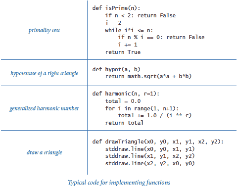

* * *

## 实现数学函数

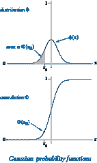

现在我们考虑两个在科学、工程和金融中起重要作用的重要函数。高斯（正态）分布函数以熟悉的钟形曲线为特征，并由以下公式定义：

> 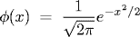

累积高斯分布函数Φ(z)被定义为在由上述 x 轴和左侧垂直线*x* = *z*定义的曲线下的面积。计算φ和Φ的函数在 Python 的`math`模块中不可用，因此我们开发自己的实现。

### 闭式形式。

在最简单的情况下，我们有一个闭式数学公式，用 Python 的`math`模块中实现的函数来定义我们的函数。这是φ的情况，因此很容易实现与数学定义对应的函数`pdf()`。为了方便起见，gauss.py 使用默认参数μ = 0 和σ = 1，并实际计算φ(*x*, μ, σ) = φ((*x* - μ) / σ) / σ

### 没有闭式形式。

如果没有已知的公式，我们可能需要一个更复杂的算法来计算函数值。这种情况适用于Φ —— 该函数没有闭式表达式。Φ的泰勒级数逼近比率结果是评估函数的有效基础：

> 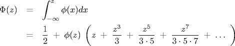

这个公式很容易转换为 Python 代码中的函数`cdf()`，在 gauss.py 中。对于小（分别大）的*z*，该值非常接近 0（分别 1），因此代码直接返回 0（分别 1）；否则，它使用泰勒级数添加项，直到总和收敛。同样，为了方便起见，gauss.py 实际计算Φ(*z*, μ, σ) = Φ((*z* - μ) / σ)，使用默认值μ = 0 和σ = 1。

* * *

## 使用函数来组织代码

通过定义函数的能力，我们可以在适当时在程序中定义函数来更好地组织程序。例如，coupon.py 是 couponcollector.py（来自第 1.4 节）的一个版本，更好地分离了计算的各个组件：

+   给定*n*，计算一个随机优惠券价值。

+   给定*n*，进行优惠券收集实验。

+   从命令行获取*n*，然后计算并写入结果。

*无论何时你可以清晰地在计算中分离任务，你都应该这样做。*

* * *

## 传递参数和返回值

接下来，我们将研究 Python 传递参数和从函数返回值的具体机制。

### 对象引用调用。

你可以在函数体中的任何地方使用参数变量，就像使用局部变量一样。参数变量和局部变量之间唯一的区别是，Python 会用调用代码提供的相应参数初始化参数变量。我们称这种方法为*对象引用调用*。这种方法的一个后果是，如果参数变量引用可变对象，并且在函数内部更改了该对象的值，那么这也会在调用代码中更改对象的值（因为它是同一个对象）。接下来，我们将探讨这种方法的后果。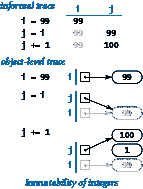

### 不可变性和别名。

如第 1.4 节所讨论的，数组是*可变*数据类型，因为我们可以更改数组元素。相比之下，如果无法更改该类型对象的值，则数据类型是*不可变*的。我们一直在使用的其他数据类型（`int`、`float`、`str`和`bool`）都是不可变的。在不可变数据类型中，可能看起来会更改值的操作实际上会导致创建一个新对象，如右侧简单示例所示。首先，语句`i = 99`创建一个整数 99，并将引用分配给`i`。然后`j = i`将`i`（一个对象引用）分配给`j`，因此`i`和`j`都引用相同的对象——整数 99。引用同一对象的两个变量称为*别名*。接下来，`j += 1`导致`j`引用一个值为 100 的对象，但它并没有通过更改现有整数从 99 更改为 100！实际上，由于`int`对象是不可变的，没有语句可以更改现有整数的值。相反，该语句创建一个新整数 1，将其添加到整数 99 以创建另一个新整数 100，并将引用分配给`j`。但`i`仍然引用原始的 99。请注意，新整数 1 最终没有引用它——这是系统的问题，不是我们的问题。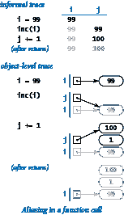

### 整数、浮点数、布尔值和字符串作为参数。

每当您将参数传递给函数时，参数和函数的参数变量成为别名。在实践中，这是 Python 中别名的主要用法。为了说明，假设我们需要一个增加整数的函数（我们的讨论也适用于任何更复杂的函数）。一个刚接触 Python 的程序员可能尝试这样定义：

```py
def inc(j):
    j += 1

```

然后期望使用调用`inc(i)`来增加整数`i`。这样的代码在某些编程语言中可以工作，但在 Python 中没有效果，如右侧的图所示。

要增加变量`i`，我们可以使用以下定义

```py
def inc(j):
    j += 1
    return j

```

并使用赋值语句`i = inc(i)`调用该函数。

对于任何不可变类型也是如此。函数无法更改整数、浮点数、布尔值或字符串的值。

### 数组作为参数。

当函数将数组作为参数时，它实现了一个操作任意数量对象的函数。例如，以下函数计算浮点数或整数数组的平均值：

```py
def mean(a):
    total = 0.0
    for v in a:
        total += v
    return total / len(a)

```

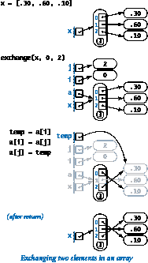

### 使用数组时的副作用。

由于数组是可变的，通常情况下，接受数组作为参数的函数的目的是产生副作用（例如更改数组元素的顺序）。这样一个函数的典型例子是一个在给定数组中交换两个给定索引处的元素的函数。我们可以调整我们在第 1.4 节开头检查的代码：

```py
def exchange(a, i, j):
   temp = a[i]
   a[i] = a[j]
   a[j] = temp

```

此函数调用的正式跟踪显示在右侧。

第二个典型的例子是一个接受数组参数并产生副作用的函数，该函数随机打乱数组中的元素，使用我们在第 1.4 节中检查的算法版本（以及刚刚定义的`exchange()`函数）：

```py
def shuffle(a):
    n = len(a)
    for i in range(n):
        r = random.randrange(i, n)
        exchange(a, i, r)

```

### 作为返回值的数组。

函数可以返回一个数组。例如，考虑以下函数，它返回一个随机浮点数数组：

```py
def randomarray(n):
    a = stdarray.create1D(n, 0.0)
    for i in range(n):
        a[i] = random.random()
    return a

```

下表总结了我们对数组作为函数参数的讨论，突出了一些典型的数组处理函数。

> 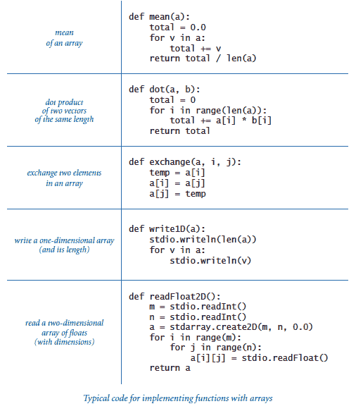

* * *

## 声波的叠加

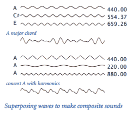

像协奏 A 音这样的音符具有纯净的声音，不太具有音乐性，因为你习惯听到的声音有许多其他成分。大多数乐器会产生谐波（不同八度的相同音符，但不那么响亮），或者你可能演奏和弦（同时演奏多个音符）。为了合并多个声音，我们使用叠加：简单地将它们的波形相加并重新调整比例，以确保所有值保持在-1 和+1 之间。

程序 playthattunedeluxe.py 是 playthattune.py（来自第 1.5 节）的一个版本，封装了声波计算并添加了谐波。尝试反复运行 playthattunedeluxe.py，并将其标准输入重定向到这些数据文件中的每一个（由不同学生创建）：elise.txt、ascale.txt、stairwaytoheaven.txt、entertainer.txt、firstcut.txt、freebird.txt 和 looney.txt。

> 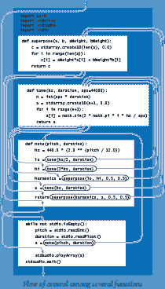

* * *

#### Q & A

**Q.** 我能在函数中使用没有指定值的 return 语句吗？

**A.** 是的。从技术上讲，它返回`None`对象，这是`NoneType`类型的唯一值。

**Q.** 如果一个函数有一个控制流导致`return`语句返回一个值，但另一个控制流达到函数体的末尾会发生什么？

**A.** 定义这样一个函数是不良风格的，因为这会给函数的调用者带来严重负担：调用者需要知道在哪些情况下函数返回一个值，在哪些情况下返回`None`。

**Q.** 如果我在函数体中的代码出现在`return`语句之后会发生什么？

**A.** 一旦到达`return`语句，控制权将返回给调用者。因此，在 return 语句之后出现的函数体中的任何代码都是无效的；它永远不会被执行。在 Python 中，这是不良风格，但并非非法定义这样的函数。

**Q.** 如果我在同一个`.py`文件中定义了两个同名函数（但可能参数个数不同）会发生什么？

**A.** 这被称为*函数重载*，许多编程语言都支持。然而，Python 不是其中之一：第二个函数定义将覆盖第一个函数。通常可以通过使用默认参数来实现相同的效果。

**Q.** 如果我在不同文件中定义了同名的两个函数会发生什么？

**A.** 没问题。例如，在 gauss.py 中有一个名为`pdf()`的函数，用于计算高斯概率密度函数，另一个名为`pdf()`的函数在`cauchy.py`中用于计算柯西概率密度函数。在第 2.2 节中，你将学习如何调用在不同`.py`文件中定义的函数。

**Q.** 一个函数能改变参数变量绑定的对象吗？

**A.** 是的，你可以在赋值语句的左侧使用参数变量。然而，许多 Python 程序员认为这样做是不良风格的。请注意，这样的赋值语句对客户端没有影响。

**Q.** 副作用和可变对象的问题很复杂。这真的那么重要吗？

**A.** 是的。正确控制副作用是程序员在大型系统中最重要的任务之一。花时间确保你理解传递数组（可变的）和传递整数、浮点数、布尔值和字符串（不可变的）之间的区别肯定是值得的。同样的机制也适用于所有其他类型的数据，你将在第三章中学到。

**Q.** 我如何安排将数组传递给函数，以使函数无法更改数组中的元素？

**答：** 没有直接的方法。在第 3.3 节中，您将看到如何通过构建包装数据类型并传递该类型的对象来实现相同的效果。您还将看到如何使用 Python 的内置`tuple`数据类型，它表示一组不可变的对象。

**问：** 我可以使用可变对象作为可选参数的默认值吗？

**答：** 可以，但可能会导致意外行为。Python 只在函数定义时评估默认值一次（而不是每次调用函数时）。因此，如果函数体修改了默认值，后续函数调用将使用修改后的值。如果通过调用不纯函数来初始化默认值，也会出现类似的困难。例如，在 Python 执行代码片段后

```py
def append(a=[], x=random.random()):
    a += [x]
    return a
b = append()
c = append()

```

`b[]`和`c[]`是长度为 2 的相同数组的别名（而不是 1），其中包含一个浮点数重复两次（而不是两个不同的浮点数）。

* * *

#### 练习

1.  组合一个函数`max3()`，它接受三个`int`或`float`参数，并返回最大的一个。

    *解决方案*：

    > ```py
    > def max3(a, b, c)
    >     max = a
    >     if b > max:
    >         max = b
    >     if c > max:
    >         max = c
    >    return max
    > 
    > ```

1.  组合一个函数`odd()`，它接受三个`bool`参数，并在奇数个参数为`True`时返回`True`，否则返回`False`。

1.  组合一个函数`majority()`，它接受三个`bool`参数，并在至少两个参数为`True`时返回`True`，否则返回`False`。不要使用`if`语句。

    *解决方案*：这里有两个解决方案。第一个简洁。第二个愚蠢，但遵守规则。

    ```py
    def majority(a, b, c):
        return (a and b) or (a and c) or (b and c)

    def majority(a, b, c):
        while a and b:
            return True
        while a and c:
            return True
        while b and c:
            return True
        return False

    ```

1.  组合一个函数`areTriangular()`，它以三个数字作为参数，并在它们可能是三角形的边（没有一个大于或等于另外两个的和）时返回`True`，否则返回`False`。

1.  组合一个函数`sigmoid()`，它接受一个`float`参数`x`，并返回从公式得到的`float`：1 / (1 - *e*^(-*x*))。

1.  组合函数`lg()`，它以整数`n`作为参数，并返回`n`的以 2 为底的对数。您可以使用 Python 的`math`模块。

1.  组合一个函数`lg()`，它以整数`n`作为参数，并返回不大于`n`的以 2 为底的对数的最大整数。不要使用标准的 Python`math`模块。

1.  组合一个函数`signum()`，它接受一个`float`参数`n`，如果`n`小于 0，则返回-1，如果`n`等于 0，则返回 0，如果`n`大于 0，则返回+1。

1.  考虑这个函数`duplicate()`：

    ```py
    def duplicate(s):
        t = s + s

    ```

    以下代码片段写了什么？

    ```py
    s = 'Hello'
    s = duplicate(s)
    t = 'Bye'
    t = duplicate(duplicate(duplicate(t)))
    stdio.writeln(s + t)

    ```

1.  考虑这个函数`cube()`：

    > ```py
    > def cube(i):
    >     i = i * i * i
    > 
    > ```

    以下`while`循环迭代了多少次？

    > ```py
    > i = 0
    > while i < 1000:
    >     cube(i)
    >     i += 1
    > 
    > ```

    *解决方案*：只有 1000 次。对`cube()`的调用对客户端代码没有影响。它改变了其本地参数变量`i`的值，但这种改变对`while`循环中的`i`没有影响，因为那是一个不同的变量。如果您用语句`i = i * i * i`替换对`cube(i)`的调用（也许这是您想的），那么循环将迭代五次，`i`在五次迭代开始时分别取值 0、1、2、9 和 730。

1.  以下代码片段写了什么？

    ```py
    for i in range(5):
        stdio.write(i)
    for j in range(5):
        stdio.write(i)

    ```

    *解决方案*：0123444444。请注意，第二次调用`stdio.write()`使用的是`i`，而不是`j`。与许多其他编程语言中的类似循环不同，当第一个 for 循环终止时，变量`i`为 4，并且仍然在作用域内。

1.  下面的*校验和*公式被银行和信用卡公司广泛用于验证合法的账号号码：

    > | *d*[0] + *f*(*d*[1]) + *d*[2] + *f*(*d*[3]) + *d*[4] + *f*(*d*[5]) + *d*[6] + ... = 0 (mod 10) |
    > | --- |

    *d[i]*是账号数字的小数位，*f*(*d*)是 2*d*的小数位之和（例如，*f*(7) = 5，因为 2 × 7 = 14，1 + 4 = 5）。例如，17327 是有效的，因为 1 + 5 + 3 + 4 + 7 = 20，这是 10 的倍数。实现函数*f*并组合一个程序，以一个 10 位整数作为命令行参数，并打印一个有效的 11 位数字，其中给定整数作为前 10 位数字，校验和作为最后一位数字。

1.  给定两颗星的赤纬和赤经角度(*d*1, *a*1)和(*d*2, *a*2)，它们所夹角度由[Haversine formula](http://en.wikipedia.org/wiki/Haversine_formula)给出：

    > | 2 arcsin((sin²(*d*/2) + cos(*d*[1]) cos(*d*[2]) sin²(*a*/2))^(1/2)) |
    > | --- |

    其中*a*[1]和*a*[2]是在-180 到 180 度之间的角度，*d*[1]和*d*[2]是在-90 到 90 度之间的角度，*a* = *a*[2] - *a*[1]，*d* = *d*[2] - *d*[1]。编写一个程序，接受两颗星的赤纬和赤经作为命令行参数，并写��它们所夹角度。 *提示*：在将度数转换为弧度时要小心。

    参见第 1.2 节中类似的练习。纬度对应于赤纬，经度对应于赤经。

1.  编写一个`readBoolean2D()`函数，将一个由 0 和 1 值组成的二维矩阵（带有维度）读入一个布尔数组中。

    *解决方案*：该函数的主体与本页早期表中给出的浮点数二维数组的相应函数几乎相同：

    ```py
    def readBool2D():
        m = stdio.readInt()
        n = stdio.readInt()
        a = stdarray.create2D(m, n, False)
        for i in range(m):
            for j in range(n):
                a[i][j] = stdio.readBool()
        return a

    ```

1.  编写一个函数，以一个严格正浮点数数组`a[]`作为参数，并重新调整数组，使每个元素介于 0 和 1 之间（通过从每个元素中减去最小值，然后将每个元素除以最小值和最大值之间的差异）。使用内置的`max()`和`min()`函数。

1.  编写一个`histogram()`函数，以一个整数数组`a[]`和一个整数`m`作为参数，并返回一个长度为`m`的数组，其第`i`个条目是参数数组中整数`i`出现的次数。假设`a[]`中的值都在 0 和`m`-1 之间，因此返回数组中值的总和应等于`len(a)`。

1.  在本节和第 1.4 节中组装代码片段，开发一个程序，从命令行接受一个整数`n`，并写入`n`个五张卡牌的手，用空行分隔，从一个随机洗牌的卡牌牌组中抽取，每行一张卡牌，使用`Ace of Clubs`等卡牌名称。

1.  编写一个函数`multiply()`，它以两个相同维度的方阵作为参数，并返回它们的乘积（另一个相同维度的方阵）。 *额外加分*：使您的程序在第一个矩阵的列数等于第二个矩阵的行数时也能工作。

1.  编写一个函数`any()`，它以一个布尔数组作为参数，并在数组中的任何条目为`True`时返回`True`，否则返回`False`。编写一个函数`all()`，它以一个布尔数组作为参数，并在数组中的所有条目都为`True`时返回`True`，否则返回`False`。请注意，`all()`和`any()`是 Python 内置函数；这个练习的目的是通过创建自己的版本来更好地理解它们。

1.  开发一个更好地模拟当其中一个优惠券稀有时的`getCoupon()`版本：随机选择一个值，以 1/(1000*n*)的概率返回该值，并以相等概率返回所有其他值。 *额外加分*：这种变化如何影响优惠券收集函数的平均值？

1.  修改 playthattune.py（来自第 1.5 节），添加每个音符两个八度的谐波，权重为一个八度谐波的一半。

* * *

#### 创意练习

1.  **生日问题。** 编写一个适当的程序来研究生日问题（参见第 1.4 节中相关的练习）。

1.  **欧拉函数。** 欧拉函数是数论中的一个重要函数：φ(*n*)被定义为小于或等于*n*且与*n*互质（除了 1 以外没有其他公因数）的正整数的数量。编写一个函数，接受一个整数参数*n*并返回φ(*n*)。包括从命令行接受一个整数、调用该函数并写入结果的全局代码。

1.  **调和数。** 编写一个名为`harmonic.py`的程序，定义三个函数`harmonic()`、`harmonicSmall()`和`harmonicLarge()`来计算调和数。`harmonicSmall()`函数应该只计算总和（如 harmonic.py 中所示），`harmonicLarge()`函数应该使用近似公式 H[*n*] = log*e* + γ + 1/(2*n*) - 1/(12*n*²) + 1/(120*n*⁴)（其中γ = .577215664901532...被称为*欧拉常数*），而`harmonic()`函数应该在*n* < 100 时调用`harmonicSmall()`，否则调用`harmonicLarge()`。

1.  **高斯随机值。** 尝试使用以下函数生成高斯分布的随机变量，该函数基于在单位圆内生成随机点并使用一种形式的[Box-Muller 变换](http://en.wikipedia.org/wiki/Box-Muller_transform)。（请参阅第 1.2 节末尾的“高斯随机数”练习。）

    ```py
    def gaussian():
        r = 0.0
        while (r >= 1.0) or (r == 0.0):
            x = random.uniform(-1.0, 1.0)
            y = random.uniform(-1.0, 1.0)
            r = x*x + y*y
        return x * math.sqrt(-2.0 * math.log(r) / r)

    ```

    接受一个命令行参数`n`，并生成`n`个随机数，使用一个包含 20 个整数的数组`a[]`来计算生成的落在`i*.05`和`(i+1)*.05`之间的数字，其中`i`从 0 到 19。然后使用`stddraw`来绘制数值，并将结果与正态钟形曲线进行比较。*备注*：这种方法比第 1.2 节中描述的“高斯随机数”练习中的方法更快更准确。尽管涉及循环，但平均只执行循环 4/π（约 1.273）次。这减少了对超越函数的整体预期调用次数。

1.  **二分查找。** 我们在第 4.2 节中详细研究的一种通用方法是用于计算类似`cdf()`的累积概率密度函数的逆函数。这些函数是连续的，从(0, 0)到(1, 1)是非递减的。要找到*f*(*x*[0]) = *y*[0]的值*x*[0]，检查*f*(.5)的值。如果它大于*y*[0]，那么*x*[0]必须在 0 和.5 之间；否则，它必须在.5 和 1 之间。无论哪种方式，我们都将已知包含*x*[0]的区间的长度减半。通过迭代，我们可以在给定的容差内计算*x*[0]。在 gauss.py 中添加一个使用二分查找来计算逆函数的函数`cfdInverse()`。

    *解决方案*：请参阅 gaussinv.py。

1.  **Black-Scholes 期权定价。** [Black Scholes](http://en.wikipedia.org/wiki/Black-Scholes)公式提供了不支付股息的股票上的欧式看涨期权的理论价值，给定当前股价*s*，行权价*x*，连续复利无风险利率*r*，股票回报的标准差σ（波动率）和到期时间（年）*t*。该价值由公式*s*Φ(*a*) - *x**e*^(-rt)φ(*b*)给出，其中Φ(*z*)是高斯累积分布函数，*a* = (ln(*s*/*x*) + (*r* + σ²/2)*t*)/(σ*t*^(1/2))，*b* = *a* - σ*t*^(1/2)。编写一个程序，从命令行获取`s`、`x`、`r`、`sigma`和`t`，并输出 Black-Scholes 值。目前，将`phi()`和`Phi()`函数的定义从 gauss.py 复制到您的程序中。在网站的下一部分，您将学习如何在一个`.py`文件中定义一个函数，以便可以被另一个`.py`文件中的代码调用。

    Myron Scholes 因[Black-Scholes 论文](http://www.cs.princeton.edu/courses/archive/fall02/cs323/links/blackscholes.pdf)而获得了 1997 年的诺贝尔经济学奖。

    *解决方案*：请参阅 blackscholes.py。

1.  **隐含波动率。** 通常波动率是 Black-Scholes 公式中的未知值。编写一个程序，从命令行读取`s`、`x`、`r`、`t`和期权的当前价格，并使用二分查找（请参阅本节中的先前练习）来计算σ。

1.  **霍纳方法。** 编写一个带有函数`evaluate(x, a)`的程序，该函数评估多项式*a*(*x*)，其系数是数组`a[]`中的元素：

    > | *a*[0] + *a*[1]*x*¹ + *a*[2]*x*² + ... + *a*[*n*-2]*x*^(*n*-2) + *a*[*n*-1]*x*^(*n*-1) |
    > | --- |

    使用 *霍纳法*，这是一种执行计算的高效方法，建议按照以下括号化：

    > | *a*[0] + *x* (*a*[1] + *x*( *a*[2] + ... + *x*(*a*[*n*-2] + *x**a*[*n*-1]))...) |
    > | --- |

    然后编写一个函数 `exp()`，调用 `evaluate()` 来计算 *e^x* ���近似值，使用泰勒级数展开的前 *n* 项 *e^x* = 1 + *x* + *x*²/2! + *x*³/3! + ... 从命令行获取参数 `x`，并将您的结果与由 `math.exp(x)` 计算的结果进行比较。

    包括代码来检查您的答案与由 `math.exp()` 计算的答案是否一致。

    *解决方案*：参见 horner.py。

1.  **本福德定律。** 美国天文学家西蒙·纽康布观察到一本编制对数表的书中的一个怪现象：开始的页面比结束的页面脏得多。他怀疑科学家们使用以 1 开头的数字进行的计算比使用以 8 或 9 开头的数字进行的计算要多，并假设了第一位数字定律，该定律表明在一般情况下，领先数字更有可能是 1（大约 30%）而不是数字 9（不到 4%）。这种现象被称为[本福德定律](http://mathworld.wolfram.com/BenfordsLaw.html)，现在经常被用作统计测试。例如，美国国税局的法务会计师依靠它来发现税务欺诈。编写一个程序，从标准输入读取一系列整数，并制表显示数字 1-9 每个数字作为领先数字的次数，将计算分解为一组适当的函数。使用您的程序在计算机或网络上的一些信息表上测试该定律。然后，编写一个程序通过生成从 $1.00 到 $1,000.00 的随机金额，使 IRS 无法发现。

    文件普林斯顿文件.txt 是普林斯顿公共 Unix 机器上文件大小的列表。尝试在该文件上运行您的程序。

    *解决方案*：参见 benford.py。

1.  **二项分布。** 编写一个接受整数 `n`、整数 `k` 和浮点数 `p` 的函数 `binomial()`，并计算在进行 `n` 次有偏向正面概率为 `p` 的硬币翻转时恰好获得 `k` 次正面的概率，使用公式

    > | *f*(*k*, *n*, *p*) = *p*^(*k*)(1 - *p*)^(*n*-*k*)*n*! / (*k*!(*n*-*k*)!) |
    > | --- |

    *提示*：为了避免使用巨大的整数进行计算，计算 *x* = ln *f*(*k*, *n*, *p*)，然后返回 *e^x*。在全局代码中，从命令行获取 `n` 和 `p`，并检查在 0 到 `n` 之间的所有 `k` 值的总和是否（大约）为 1。还要将计算的每个值与正态近似进行比较。

    > | *f*(*k*, *n*, *p*) ≈ Φ(*k* + 1/2, *np*, (*np*(1-*p*)^(1/2)) - Φ(*k* - 1/2, *np*, (*np*(1-*p*)^(1/2)) |
    > | --- |

1.  **从二项分布中收集优惠券。** 编写一个使用前一个练习中的 `binomial()` 返回符合 *p* = 1/2 的二项分布的优惠券值的 `getCoupon()` 版本。*提示*：生成一个介于 0 和 1 之间的均匀分布的随机数 *x*，然后返回所有 *j* < *k* 的 *f*(*n*, *j*, *p*) 的总和超过 *x* 的最小值 *k*。*额外学分*：为描述在此假设下优惠券收集函数的行为开发一个假设。

1.  **弦。** 编写一个版本的 playthattunedeluxe.py，可以处理包含和弦（包括谐波）的歌曲。开发一种输入格式，允许您为每个和弦指定不同的持续时间和每个音符内的不同振幅权重。创建测试文件，用各种和弦和谐波测试您的程序，并创建一个使用它们的 *Elise 之歌* 版本。

1.  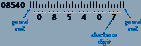

    **邮政条形码。** 美国邮政系统用于路由邮件的[POSTNET 条形码](http://en.wikipedia.org/wiki/POSTNET)定义如下：邮政编码中的每个十进制数字都使用三个半高和两个全高的条形码进行编码。条形码以全高的条作为起始和结束（保护栏），并包括一个校验和数字（在五位邮政编码或 ZIP+4 之后），通过对原始数字取模 10 来计算。实现以下函数：

    +   在`stddraw`上绘制半高或全高的条形码。

    +   给定一个数字，绘制其条形码序列。

    +   计算校验和数字。

    以及一个测试客户端，读取一个五位（或九位）数字的 ZIP 码作为命令行参数，并绘制相应的邮政条形码。

    > | 值 | 0 | 1 | 2 | 3 | 4 | 5 | 6 | 7 | 8 | 9 |
    > | --- | --- | --- | --- | --- | --- | --- | --- | --- | --- | --- |
    > | 编码 | `&#124;&#124;╷╷╷` | `╷╷╷&#124;&#124;` | `╷╷&#124;╷&#124;` | `╷╷&#124;&#124;╷` | `╷&#124;╷╷&#124;` | `╷&#124;╷&#124;╷` | `╷&#124;&#124;╷╷` | `&#124;╷╷╷&#124;` | `&#124;╷╷&#124;╷` | `&#124;╷&#124;╷╷` |

1.  **日历。** 编写一个程序，接受两个命令行参数`m`和`y`，并为年份`y`的第`m`个月写出月历，如下例所示：

    ```py
       February 2009
     S  M Tu  W Th  F  S
     1  2  3  4  5  6  7
     8  9 10 11 12 13 14
    15 16 17 18 19 20 21
    22 23 24 25 26 27 28

    ```

    *提示*：参见 leapyear.py 和第 1.2 节中的“星期几”练习。

    *解决方案*：参见 calendar.py。

1.  **傅里叶尖峰。** 编写一个程序，接受一个命令行参数*n*，并绘制函数：

    > | (cos(*t*) + cos(2*t*) + cos(3*t*) + cos(4*t*) + ... + cos(*nt*)) / *n* |
    > | --- |

    对于从-10 到 10（以弧度为单位）均匀间隔的 500 个样本的*t*。运行你的程序，*n* = 5 和*n* = 500。*注意*：你会发现总和收敛到一个尖峰（除了一个单一值外，其他地方都是 0）。这个性质是证明任何光滑函数都可以表示为正弦波的和的基础。
