# 2.4 案例研究：渗流

> 译文：[`introcs.cs.princeton.edu/python/24percolation`](https://introcs.cs.princeton.edu/python/24percolation)

我们通过考虑一个有趣的科学问题的案例研究来结束我们对函数和模块的研究：一个用于研究一种名为*渗流*的自然模型的*蒙特卡罗*模拟。

* * *

## 渗流

我们将系统建模为一个*n*×*n*站点网格。每个站点都是*阻塞*或*开放*的；开放站点最初是*空的*。一个*满*站点是一个可以通过一系列相邻（左、右、上、下）开放站点连接到顶行开放站点的开放站点。如果底行有一个满站点，那么我们说系统*渗流*。如果站点独立设置为以*空缺概率**p*开放，那么系统渗流的概率是多少？对于这个问题还没有数学解决方案。我们的任务是编写计算机程序来帮助研究这个问题。

> 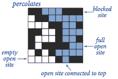 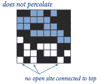

* * *

## 脚手架

我们的第一步是选择数据的表示。我们使用一个布尔矩阵表示哪些站点是开放的，另一个布尔矩阵表示哪些站点是满的。我们将设计一个`flow()`函数，该函数以二维布尔数组`isOpen`作为参数，该数组指定哪些站点是开放的，并返回另一个二维布尔数组`isFull`，指定哪些站点是满的。我们还将包括一个`percolates()`函数，检查`flow()`返回的数组是否在底部有任何满的站点。

* * *

## 垂直渗流

给定表示开放站点的布尔矩阵，我们如何确定它是否代表一个渗流系统？目前，我们将考虑问题的一个简化版本，我们称之为*垂直渗流*。简化是将注意力限制在垂直连接路径上。

> 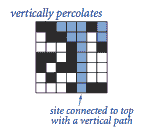 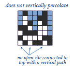

确定通过某些与顶部垂直连接的路径填充的站点是一个简单的计算。

> 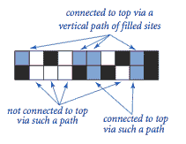

程序 percolationv.py 是解决仅垂直渗流问题的解决方案。尝试将其标准输入重定向到 test5.txt 或 text8.txt

* * *

## 蒙特卡罗模拟

我们希望我们的代码对任何布尔矩阵都能正常工作。此外，感兴趣的科学问题涉及随机布尔矩阵。为此，我们编写一个函数`random()`，它接受两个参数`n`和`p`，并生成一个随机的`n`×`n`布尔数组，其中每个元素为`True`的概率为`p`。该函数在 percolationio.py 中定义。

* * *

## 数据可视化

如果我们使用`stddraw`进行输出，我们可以处理更大的问题实例。因此，我们开发一个`draw()`函数来可视化布尔矩阵的内容。该函数，连同前述的`random()`函数和一个测试`main()`函数，在 percolationio.py 中定义。

> | `% python percolationio.py 10 0.8` |
> | --- |
> |  |

程序 visualizev.py 是 percolationv.py 的测试客户端，通过调用`percolationio.random()`生成随机布尔矩阵，并通过调用`percolationio.draw()`将其绘制到标准绘图中。它生成如下输出：

> | `% python visualizev.py 20 0.95 1` | `% python visualizev.py 20 0.95 1` |
> | --- | --- |
> | 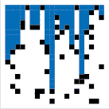 |  |

* * *

## 估计概率

我们程序开发过程中的下一步是编写代码来估计随机系统（大小为*n*，站点空缺概率为*p*）渗透的概率。我们将这个数量称为*渗透概率*。为了估计其值，我们只需运行一些实验。程序 estimatev.py 将这个计算封装在一个`evaluate()`函数中。

* * *

## 渗透的递归解决方案

在一般情况下，我们如何测试系统是否渗透，即从顶部开始并以底部结束的任何路径（不仅仅是垂直路径）都可以完成任务？令人惊讶的是，我们可以通过一个基于经典递归方案的紧凑程序来解决这个问题，该方案被称为*深度优先搜索*。程序 percolation.py 包含一个计算流数组的`flow()`实现。尝试将其标准输入重定向到 test5.txt 然后再到 text8.txt 运行它

程序 visualize.py 和 estimate.py 与 visualizev.py 和 estimatev.py 完全相同，只是它们是 percolation.py 的客户端，而不是 percolationv.py。visualize.py 程序生成如下输出：

> 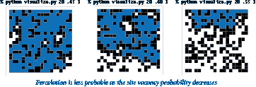

* * *

## 自适应绘图

为了更深入地了解渗透，程序开发的下一步是编写一个程序，根据给定的*n*值，绘制渗透概率作为站点空缺概率*p*的函数。立即，我们面临着许多决策。我们应该为多少个*p*值计算渗透概率的估计？我们应该选择哪些*p*值？程序 percplot.py 实现了一种递归方法，以相对较低的成本产生一个外观良好的曲线。

> | `% python percplot.py 20` | `% python percplot.py 100` |
> | --- | --- |
> | 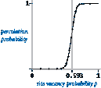 | 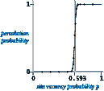 |

曲线支持这样的假设，即存在一个*阈值*值（约为 0.593）：如果*p*大于阈值，则系统几乎肯定会渗透；如果*p*小于阈值，则系统几乎肯定不会渗透。随着*n*的增加，曲线逐渐接近一个在阈值处从 0 变为 1 的阶跃函数。这种现象被称为*相变*，在许多物理系统中都存在。

* * *

## 教训

+   *期望出现错误。* 您编写的每个有趣的代码片段都将至少有一个或两个错误，如果不是更多。通过在您理解的小测试案例上运行小代码片段，您可以更容易地隔离任何错误，然后在找到错误时更容易地修复它们。

+   *保持模块小。* 您一次最多只能关注几十行代码，因此最好在编写代码时将其分解为小模块。

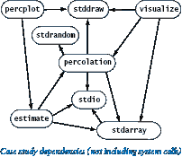

+   *限制交互。* 在设计良好的模块化程序中，大多数模块应该只依赖于少数其他模块。特别是，调用大量其他模块的模块需要分成更小的部分。被大量其他模块调用的模块（您应该只有少数）需要特别注意，因为如果您需要更改模块的 API，您必须在所有客户端中反映这些更改。

+   *逐步开发代码。* 在实现每个小模块时，您应该运行和调试它。这样，您永远不会一次处理超过几十行不可靠代码。

+   *解决一个更简单的问题。* 通常开始时，你会尽可能简单地组合解决给定问题的代码，就像我们在仅垂直渗透的情况下所做的那样。

+   *考虑一个递归解决方案。* 递归是现代编程中不可或缺的工具，你应该学会信任它。如果你还没有被 percolation.py 中`flow()`方法的简单和优雅所说服，你可能希望尝试开发一个非递归版本。

+   *在适当的时候构建工具。* 我们的可视化函数`draw()`和随机布尔矩阵生成函数`random()`对许多其他应用程序都很有用，就像 percplot.py 中的自适应绘图函数一样。将这些函数合并到适当的模块中将会很简单。

+   *在可能的情况下重用软件。* 我们的`stdio`、`stdrandom`和`stddraw`模块都简化了本节中代码的开发过程。

* * *

#### 问答

**Q.** 编辑 visualize.py 和 estimate.py 以将每个`percolation`重命名为`percolationv`（或者我们想要研究的任何模块）似乎很麻烦。有没有办法避免这样做？

**A.** 是的。最直接的方法是在不同的子目录中保留多个名为`percolation.py`的文件。然后从一个子目录中复制所需的`percolation.py`文件到你的工作目录，从而选择一个特定的实现。另一种方法是使用 Python 的`import as`语句来定义一个标识符来引用模块：

```py
import percolationv as percolation

```

现在，任何对`percolation.percolates()`的调用都使用 percolationv.py 中定义的函数，而不是 percolation.py 中定义的函数。在这种情况下，更改实现只涉及编辑源代码的一行。

**Q.** 那个递归的`flow()`函数让我感到紧张。我如何更好地理解它在做什么？

**A.** 运行自己制作的小例子，附带写一个函数调用跟踪的指令。几次运行后，你会对它总是填充与起始点连接的站点感到自信。

**Q.** 有没有一个简单的非递归方法？

**A.** 有几种已知的方法执行相同的基本计算。我们将在本书末尾的第 4.5 节重新讨论这个问题。同时，如果你感兴趣，致力于开发`flow()`的非递归实现肯定是一个有益的练习。

**Q.** percplot.py 程序似乎需要大量计算才能得到一个简单的函数图。有没有更好的方法？

**A.** 最好的策略是对阈值进行数学证明，但这个推导一直困扰着科学家。

**Q.** 不同晶格的渗透阈值是多少？

**A.** [渗透阈值](http://mathworld.wolfram.com/PercolationThreshold.html)概率 p*，如果 p < p*，则不存在跨越的集群，如果 p >= p*，则存在一个跨越的集群。

**Q.** 有相关的论文吗？

**A.** 参见 Newman 和 Ziff 的[A Fast Monte Carlo Algorithm for Site or Bond Percolation](http://www.santafe.edu/media/workingpapers/01-02-010.pdf)。

* * *

#### 练习

1.  编写一个程序，接受一个命令行参数*n*，并创建一个*n*乘以*n*的矩阵，其中第*i*行和第*j*列的条目设置为`True`，如果`i`和`j`是互质的，则在标准绘图上显示 n 乘以 n 的布尔数组（参见第 1.4 节中的“互质”练习）。然后，编写一个类似的程序来绘制阶为*n*的 Hadamard 矩阵（参见第 1.4 节中的“Hadamard 矩阵”创意练习），以及另一个程序来绘制矩阵，其中第*i*行和第*j*列的元素设置为`True`，如果(1+*x*)^(*i*)（二项式系数）中*x^j*的系数是奇数（参见第 1.4 节中的“随机漫步者”创意练习）。您可能会对后者形成的模式感到惊讶。

1.  为 percolationio.py 编写一个`write()`函数，将阻塞站点写为 1，开放站点写为 0，满站点写为*。

1.  给出以下输入时 percolation.py 的递归调用：

    ```py
    3 3
    1 0 1
    0 0 0
    1 1 0

    ```

1.  编写一个类似于 visualize.py 的 percolation.py 的客户端程序，对命令行参数*n*进行一系列实验，其中站点空缺概率*p*从 0 逐渐增加到 1，增量也从命令行中获取。

1.  编写一个程序`percolationd.py`，测试*有向*渗透（通过在递归的`_flow()`函数中省略最后一个递归调用）。然后使用 percplot.py（适当修改）绘制有向渗透概率作为站点空缺概率的函数的图。

1.  编写一个客户端程序，使用 percolation.py 和`percolationd.py`，从命令行获取站点空缺概率*p*，并写入一个系统渗透但不向下渗透的概率估计。进行足够的实验以获得精确到三位小数的估计。

1.  描述在没有阻塞站点的系统上使用 percolation.py 时标记站点的顺序。最后一个标记的站点是哪个？递归的深度是多少？

1.  修改 percolation.py 以动画显示流计算，逐个显示填充站点。检查您对上一个练习的答案。

1.  尝试使用 percplot.py 绘制各种数学函数的图形（只需将`estimate.evaluate()`的调用替换为评估函数的表达式）。尝试函数`sin(x) + cos(10*x)`，看看图形如何适应振荡曲线，并为您自己选择的三四个函数想出有趣的图形。

1.  修改 percolation.py 以动画显示��计算，逐个显示填充站点。检查您对上一个练习的答案。

1.  修改 percolation.py 以计算流计算中使用的递归的最大深度。绘制该数量的期望值作为站点空缺概率*p*的函数。如果递归调用的顺序被颠倒，您的答案会如何改变？

1.  修改 estimate.py 以产生类似于 bernoulli.py（来自第 2.2 节）产生的输出。*额外加分*：使用您的程序验证数据是否符合高斯（正态）分布的假设。

1.  修改 percolationio.py、estimate.py、percolation.py 和 visualize.py 以处理*m*乘以*n*的网格和*m*乘以*n*的布尔矩阵。使用可选参数，如果只指定两个维度中的一个，则*m*默认为*n*。

* * *

#### 创意练习

1.  **垂直渗透。**证明具有站点空缺概率*p*的*n*乘以*n*渗透系统在垂直方向上渗透的概率为 1 - (1 - *p*^(*n*))^(*n*)，并使用 estimate.py 验证您对各种*n*值的分析。

1.  **矩形渗透系统。** 修改本节中的代码，以便你可以研究矩形系统中的渗透。比较宽高比为 2:1 和 1:2 的系统的渗透概率图。

1.  **自适应绘图。** 修改 percplot.py，从命令行获取其控制参数（间隙容差、误差容差和试验次数）。尝试不同参数值，了解它们对曲线质量和计算成本的影响。简要描述你的发现。

1.  **渗透阈值。** 编写一个 percolation.py 客户端，使用二分查找来估计阈值（参见第 2.1 节中的“二分查找”创意练习）。

1.  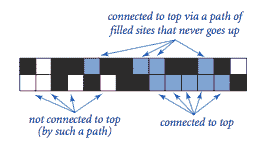

    **非递归定向渗透。** 编写一个非递归程序，通过从顶部到底部移动来测试定向渗透，就像我们的垂直渗透代码一样。基于以下计算来构建你的解决方案：如果当前行中一组连续的开放站点中的任何站点与前一行中的某个满站点相连，则该子行中的所有站点都变为满的。

1.  **快速渗透测试。** 修改 percolation.py 中递归的`_flow()`函数，使其在找到底部一行的站点后立即返回（不再填充更多站点）。*提示*：使用一个参数`done`，如果到达底部则为`True`，否则为`False`。当运行 percplot.py 时，给出这种改变的性能改进因子的粗略估计。使用*n*的值，使得程序运行至少几秒钟但不超过几分钟。请注意，除非`_flow()`中的第一个递归调用是当前站点下方的站点，否则改进是无效的。

1.  

    **键合渗透。** 编写一个用于研究在网格的边提供连接性的情况下的渗透的模块化程序。也就是说，一条边可以是空的或者是满的，如果存在一条由满边组成的路径从顶部到底部，则系统渗透。*注意*：这个问题已经被解析，因此你的模拟应该验证这样一个假设，即随着*n*的增大，渗透阈值趋近于 1/2。

1.  

    **三角形格点上的键合渗透。** 编写一个用于研究三角形格点上键合渗透的模块化程序，其中系统由 2*n*²个等边三角形组成，这些三角形在一个*n*×*n*的菱形网格中紧密排列，如前一个练习中所述，网格的边提供了连接性。每个内部点有六个键合；每个边上的点有四个；每个角点有两个。

1.  **三维渗透。** 实现模块`percolation3d.py`和`percolation3dio.py`（用于 I/O 和随机生成），以研究三维立方体中的渗透，将本章中研究的二维情况进行泛化。一个渗透系统是一个*n*×*n*×*n*的立方体，其中每个单元立方体以概率*p*开放，以概率 1-*p*阻塞。路径可以连接一个开放的立方体与任何共享公共面的开放立方体（六个邻居之一，除了边界）。如果存在一条路径连接底部平面上的任何开放站点和顶部平面上的任何开放站点，则系统渗透。使用类似于 percolation.py 中的递归版本的`_flow()`，但是有六个递归调用而不是四个。绘制渗透概率与站点空缺概率的图，尽可能使用大的*n*值。确保逐步开发你的解决方案，正如本节中所强调的那样。

1.  **生命游戏。** 实现一个模块 `life.py` 来模拟*康威的生命游戏*。考虑一个对应于细胞系统的布尔矩阵，我们称之为活着或死亡。游戏包括检查并可能更新每个细胞的值，取决于其邻居的值（每个方向的相邻细胞，包括对角线）。活细胞保持活着，死细胞保持死亡，但有以下例外：

    +   一个有三个活着的邻居的死细胞会变成活细胞。

    +   一个有一个活着的邻居的活细胞会变成死细胞。

    +   一个有超过三个活着的邻居的活细胞会变成死细胞。

    用一个*滑翔机*测试你的程序，这是一个著名的图案，每四代向下和向右移动一次，如下图所示。然后尝试两个相撞的滑翔机。然后尝试一个随机的布尔矩阵。这个游戏已经被广泛研究，与计算机科学的基础有关。

    > 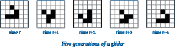
