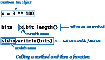
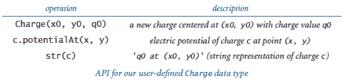

# 3.1 使用数据类型

> 原文：[`introcs.cs.princeton.edu/python/31datatype`](https://introcs.cs.princeton.edu/python/31datatype)

在本书站点的前两章中，我们的程序仅��于对数字、布尔值和字符串的操作。当然，原因是到目前为止我们遇到的 Python 数据类型 —— `int`、`float`、`bool`和`str` —— 使用熟悉的操作操作数字、布尔值和字符串。在本章中，我们开始考虑其他数据类型。

在本节中，我们专注于使用现有数据类型的客户端程序，为您提供一些具体的参考点，以便理解这些新概念并展示它们的广泛应用。我们介绍构造函数以从数据类型创建对象，并介绍操作其值的方法。我们考虑操作电荷、颜色、图像、文件和网页的程序 —— 这与我们在前几章中使用的内置数据类型相比是一个很大的飞跃。

* * *

## 方法

*方法*是与指定对象（以及该对象的类型）相关联的函数。也就是说，方法对应于数据类型操作。



我们可以通过使用变量名，后跟*点运算符*（.），后跟方法名，后跟由逗号分隔并括在括号中的参数列表来*调用*（或*调用*）方法。举个简单的例子，Python 的内置`int`类型有一个名为`bit_length()`的方法，因此您可以如下确定`int`值的二进制表示中的位数：

```py
x = 3 ** 100
bits = x.bit_length()
stdio.writeln(bits)

```

这段代码将 159 写入标准输出，告诉您 3¹⁰⁰（一个巨大的整数）在二进制表示中有 159 位。

方法调用的语法和行为几乎与函数调用的语法和行为相同。例如，方法可以接受任意数量的参数，这些参数通过对象引用传递，并且方法将一个值返回给其调用者。类似于函数调用，方法调用也是一个表达式。主要区别在于语法：您使用指定对象和点运算符调用方法。在面向对象编程中，我们通常更喜欢方法调用语法而不是函数调用语法，因为它强调了对象的作用。

函数和方法之间的关键区别在于方法与指定对象相关联。您可以将这个指定对象视为传递给函数的一个额外参数，除了普通的方法参数。

> 

* * *

## 字符串处理

通过使用`str`的经验表明，您不需要知道数据类型是如何实现的才能使用它。您知道`str`值是字符序列，并且您可以执行连接两个`str`值的操作以产生一个`str`结果。

Python 的`str`数据类型包括许多其他操作，如下所示的 API 中所述。

> 

`str` API 中的操作可以分为三类：

+   *内置运算符* `+`, `+=`, `[]`, `[:]`, `in`, `not in`，以及特殊符号和语法特征的比较运算符

+   一个带有标准函数调用语法的*内置函数* `len()`

+   *方法* `upper()`、`startswith()`、`find()`等，在 API 中用变量名后跟点运算符区分开来

从现在开始，我们可能考虑的任何 API 都将具有这些操作。接下来，我们依次考虑每一个。

### 内置运算符。

可以应用于多种数据类型的运算符（或函数）称为*多态*。您已经在使用`+`运算符，用于数字，进行字符串连接。API 告诉您，您可以使用`[]`运算符，用于数组，从字符串中提取单个字符，并使用`[:]`运算符从字符串中提取子字符串。

### 内置函数。

Python 还内置了许多多态函数，例如`len()`函数。多态函数类似于多态运算符，但没有特殊的语法。

### 方法。

我们包含内置运算符和内置函数以方便使用（并符合 Python 规范），但我们在创建数据类型时的大部分工作都是开发操作对象值的方法，例如`upper()`，`startswith()`，`find()`和`str` API 中的其他方法。

下表给出了几个简单的字符串处理应用程序示例，展示了 Python 的`str`数据类型中各种操作的实用性。

> 

程序 potentialgene.py 是一个更为实质性的字符串处理示例。该程序接受 DNA 序列作为命令行参数，并确定它是否对应于一个潜在的基因。教科书提供了详细信息。

* * *

## 用户定义数据类型

作为用户定义数据类型的一个运行示例，我们将考虑一个用于带电粒子的数据类型`Charge`。特别地，我们感兴趣的是一个使用*Coulomb 定律*的二维模型，该定律告诉我们，由给定带电粒子引起的某点的电势由*V* = *kq*/*r*表示，其中*q*是电荷值，*r*是点到电荷的距离，*k* = 8.99 × 10⁹ N m²/C²是一个称为静电常数或*Coulomb 常数*的常数。为了保持一致性，我们使用国际单位制（SI）：在这个公式中，N 代表牛顿（力），m 代表米（距离），C 代表库仑（电荷）。当存在多个带电粒子时，任意点的电势是由每个电荷引起的电势之和。

### 应用程序编程接口。

我们通过在 API 中列出其操作来指定`Charge`数据类型的行为，将实现的讨论推迟到第 3.2 节。

> 

API 中的第一个条目，与数据类型同名，被称为`构造函数`。每次调用`Charge`构造函数都会创建一个新的`Charge`对象。另外两个条目定义了数据类型的操作。第一个是一个名为`potentialAt()`的方法，用于计算并返回给定点（`x`，`y`）处电荷引起的电势。第二个是内置函数`str()`，用于返回带电粒子的字符串表示。

### 文件约定。

定义用户定义数据类型的代码位于`.py`文件中。按照惯例，我们在不同的`.py`文件中定义每个数据类型，文件名与数据类型相同（但不大写）。因此，`Charge`数据类型在名为`charge.py`的文件中找到。为了编写一个使用`Charge`数据类型的客户端程序，我们将以下`import`语句放在客户端`.py`文件的顶部：

```py
from charge import Charge

```

请注意，我们与用户定义数据类型一起使用的`import`语句的格式与我们与函数一起使用的格式不同。

### 创建对象。

要创建一个来自用户定义数据类型的对象，您调用其构造函数，该构造函数指示 Python 创建一个新的独立对象。您调用构造函数就像调用函数一样，使用数据类型的名称，后跟构造函数的参数，括号括起来，用逗号分隔。例如，`Charge(x0, y0, q0)`创建一个具有位置(`x0`, `y0`)和电荷值`q0`的新`Charge`对象，并返回对新对象的引用。

您可以创建任意数量的相同数据类型的对象。回想一下第 1.2 节，每个对象都有自己的标识、类型和值。因此，虽然任何两个对象都驻留在计算机内存中的不同位置，但它们可能是相同类型并存储相同值。

### 调用方法。

如本节开头所讨论的，我们通常使用变量名来标识要与我们打算调用的方法关联的对象。对于我们的示例，方法调用`c1.potentialAt(.20, .50)`返回一个浮点数，表示由`c1`引用的`Charge`对象在查询点(0.20, 0.50)处的电势。查询点与电荷位置之间的距离为 0.34，因此该电势为 8.99 × 10⁹ × 21.3 / 0.34 = 5.63 × 10¹¹。

### 字符串表示。

在任何数据类型的实现中，通常值得包括一个将对象值转换为字符串的操作。Python 有一个内置函数`str()`用于此目的，您从一开始就一直在使用它将整数和浮点数转换为字符串进行输出。由于我们的`Charge` API 有一个`str()`实现，任何客户端都可以调用`str()`来获取`Charge`对象的字符串表示。对于我们的示例，调用`str(c1)`返回字符串`'21.3 at (0.51, 0.63)'`。

这些机制在客户端 chargeclient.py 中总结，该客户端创建两个`Charge`对象，并计算从命令行中取出的查询点处两个电荷的总电势。

接下来我们考虑几个用户定义数据类型的更多示例。

* * *

## 颜色

颜色是眼睛中由电磁辐射引起的感觉。由于我们经常希望在计算机上查看和操作彩色图像，颜色在计算机图形学中被广泛使用。

为了表示颜色值，我们定义了一个`Color`数据类型。

> 

`Color`使用 RGB 颜色模型，其中颜色由三个整数定义，每个整数介于 0 和 255 之间，分别表示颜色的红色、绿色和蓝色（分别）分量的强度。通过混合红色、绿色和蓝色分量获得其他颜色值。`Color`有一个构造函数，它接受三个整数参数，因此您可以组成代码

```py
red  = Color(255,   0,   0) 
blue = Color(  0,   0, 255)

```

创建代表纯红色和纯蓝色的对象。自第 1.5 节以来，我们一直在`stddraw`中使用颜色，但一直受限于一组预定义颜色，如`stddraw.BLACK`、`stddraw.RED`和`stddraw.PINK`。现在您可以使用数百万种颜色。

程序 alberssquares.py 是一个`Color`和`stddraw`客户端，允许您对颜色进行实验。该程序从命令行接受两种颜色，并以 20 世纪 60 年代由色彩理论家约瑟夫·阿尔伯斯开发的格式显示颜色，彻底改变了人们对颜色的看法。

> | `% python alberssquares.py 9 90 166 100 100 100` |  |
> | --- | --- |
> | `% python alberssquares.py 0 174 239 147 149 252` |  |

### 亮度。

现代显示器（如 LCD��示器、LED 电视和手机屏幕）上图像的质量取决于一种称为*单色亮度*或有效亮度的颜色属性的理解。亮度的标准公式源自眼睛对红色、绿色和蓝色的敏感性。它是三种强度的线性组合：如果颜色的红色、绿色和蓝色值分别为*r*、*g*和*b*，则其亮度由以下公式定义：

> | *Y* = 0.299*r* + 0.587*g* + 0.114*b* |
> | --- |

### 灰度。

RGB 颜色模型具有这样的特性，当三种颜色强度相同时，所得颜色位于从黑色（全 0）到白色（全 255）的灰度范围内。要在黑白报纸（或书籍）上打印彩色照片，我们需要一个将彩色转换为灰度的函数。将彩色转换为灰度的简单方法是用其单色亮度等于其红色、绿色和蓝色值的新颜色替换该颜色。

### 颜色兼容性。

亮度值在确定两种颜色是否兼容方面也至关重要，即在另一种颜色的背景上打印文本是否可读。一个广泛使用的经验法则是前景和背景颜色之间的亮度差应至少为 128。例如，黑色文本在白色背景上的亮度差为 255，但黑色文本在（书籍）蓝色背景上的亮度差仅为 74。

程序 luminance.py 是一个模块，我们可以用它将颜色转换为灰度，并测试两种颜色是否兼容，例如，当我们在`stddraw`应用程序中使用颜色时。luminance.py 中的函数说明了使用数据类型组织信息的实用性。使用`Color`数据类型并将对象作为参数传递使得这些实现比传递三个强度值更简单。如果没有`Color`数据类型，从函数返回多个值也会变得笨拙且更容易出错。

* * *

## 数字图像处理

我们一直在使用`stddraw`在计算机屏幕上的窗口中绘制几何对象（点、线、圆、正方形）。计算机显示的基本抽象与数字照片相同，非常简单：*数字图像*是*像素*（图片元素）的矩形网格，每个像素的颜色都是单独定义的。数字图像有时被称为*光栅*或*位图*图像。

我们在`picture.py`模块中定义的`Picture`数据类型实现了数字图像抽象。值集合只不过是`Color`值的二维数组，操作由此 API 描述：

> 


按照惯例，(0, 0)是最左上角的像素，因此图像的布局与数组的常规顺序相同（相比之下，`stddraw`的约定是将点(0,0)放在左下角，使得图形的方向与笛卡尔坐标的常规方式相同）。

使用`Picture`构造函数，您可以通过从`.png`或`.jpg`文件中读取图像来创建`Picture`对象。使用`save()`方法，您可以将创建的图像保存为`.png`或`.jpg`格式；随后可以以查看照片或其他图像的方式查看您创建的图像。此外，`stddraw`模块支持一个`picture()`函数，允许您在标准绘图窗口中绘制给定的`Picture`对象以及线条、矩形、圆等。

> 

### 灰度。

程序 grayscale.py 是一个过滤器，它从命令行接受一个文件名，并生成该图像的灰度版本。它创建一个新的`Picture`对象，初始化为彩色图像，然后将每个像素的颜色设置为通过在 luminance.py 中应用`toGray()`函数计算的灰度值的新`Color`。尝试在文件 mandrill.jpg、mandrill.png、darwin.jpg 和 darwin.png 上运行它。

> | `% python grayscale.py mandrill.jpg` |  |
> | --- | --- |
> | `% python grayscale.py darwin.jpg` |  |

### 缩放。

最常见的图像处理任务之一是使图像变小或变大。

> |  |  |
> | --- | --- |

程序 scale.py 接受文件名和目标图像的宽度和高度作��命令行参数，并将图像重新缩放到指定大小。尝试在 mandrill.jpg、mandrill.png、darwin.jpg 和 darwin.png 上运行它。

> | `% python scale.py mandrill.jpg 200 200` |  |
> | --- | --- |
> | `% python scale.py mandrill.jpg 200 100` |  |
> | `% python scale.py mandrill.jpg 100 200` |  |

### 渐变效果。

程序 fade.py 是一个`Picture`、`Color`和`stddraw`客户端，使用线性插值策略实现*淡入淡出效果*。它计算*n* - 1 个中间图像，其中第*t*个图像中的每个像素都是源图像和目标图像中对应像素的加权平均值。函数`blend()`实现了插值：源颜色按 1-*t*/*n*的因子加权，目标颜色按*t*/*n*的因子加权（当*t*为 0 时，我们有源颜色；当*t*为*n*时，我们有目标颜色）。请注意，fade.py 假定图像具有相同的宽度和高度；如果您有宽度和高度不同的图像，可以使用 scale.py 为 fade.py 创建一个或两个图像的缩放版本。尝试在 mandrill.jpg、mandrill.png、darwin.jpg 和 darwin.png 的各种排列上运行它。

> | `% python fade.py mandrill.png darwin.png 5` |  |  |  |
> | --- | --- | --- | --- |
> |  |  |  |  |

### 潜在价值可视化。

图像处理在科学可视化中也很有帮助。程序 potential.py 可视化了一组电荷产生的电位值。它依赖于数据文件 charges.txt。方法的核心计算非常简单：对于每个像素，我们在单位正方形中计算相应的(*x*, *y*)值，然后为每个电荷调用`potentialAt()`来找到由于所有电荷而在该点产生的电位，将返回的值相加。

> | `% python potential.py < charges.txt` |  |
> | --- | --- |

* * *

## 输入和输出再次访问


在第 1.5 节中，您学会了如何使用我们的`stdio`模块读取和写入数字和文本。在使用`stdio`时，我们依赖于操作系统的管道和重定向机制来访问文件，任何一个程序只能使用一个输入文件和一个输出文件。

在这一部分中，我们定义了数据类型`InStream`和`OutStream`，分别用于输入流和输出流。与仅限于一个输入流和一个输出流不同，我们可以轻松地创建多个每种数据类型的对象，将流连接到各种来源和目的地。我们还可以灵活地设置变量来引用这些对象，将它们作为参数传递给函数或方法，或从函数或方法返回值，并创建它们的数组，就像我们操作任何数据类型的对象一样。

### 输入流数据类型。

我们的数据类型`InStream`，定义在模块`instream.py`中，是`stdio`读取方面的更通用版本，支持从文件和网站以及标准输入流读取数字和文本。这是它的 API：

> 

当您使用带有字符串参数的`InStream`构造函数时，构造函数首先尝试在本地计算机上找到具有该名称的文件。如果无法找到文件，则假定参数是网站名称，并尝试连接到该网站。（如果不存在这样的网站，它会在运行时引发`IOError`。）在任一情况下，指定的文件或网站将成为创建的`InStream`对象的输入源，并且`read*()`方法将从该流读取输入。

### 输出流数据类型。

同样，我们的数据类型`OutStream`，定义在模块`outstream.py`中，是`stdio`写入方面的更通用版本，支持将字符串写入各种输出流，包括标准输出和文件。同样，API 指定了与其`stdio`对应物相同的方法。

> 

通过使用文件名作为参数的单参数构造函数来指定要用于输出的文件。`OutStream`将此字符串解释为本地计算机上新文件的名称，并将其输出发送到那里。

### 文件连接和过滤。

程序 cat.py 是`InStream`和`OutStream`的一个示例客户端，使用多个输入流将多个输入文件连接成单个输出文件。例如，此命令将文件 in1.txt 和 in2.txt 连接起来创建文件`out.txt`：

```py
python cat.py in1.txt in2.txt out.txt

```

### 屏幕抓取。

程序 stockquote.py 是`str`和`InStream`数据类型的客户端。它查询一个网页，提取一些信息，并报告结果 —— 这个过程称为*屏幕抓取*。具体来说，程序接受一个纽约证券交易所股票符号作为命令行参数，并将其当前交易价格写入标准输出。例如，如果命令行参数是`goog`（谷歌的纽约证券交易所符号），程序使用`InStream`构造函数读取网页`http://finance.yahoo.com/q?s=goog`，使用`str`方法识别谷歌的股价，并将股价写入标准输出。该程序依赖于 Yahoo 网页的格式；如果 Yahoo 更改其网页格式，我们将需要更改我们的程序。尽管如此，这可能比自己维护数据更方便。

### 提取数据。

程序 split.py 使用一个`InStream`对象和多个`OutStream`对象将 CSV（逗号分隔值）文件拆分为单独的文件，每个文件对应一个逗号分隔的字段。例如，命令

```py
python split.py djia 3

```

将文件 djia.csv 拆分为文件`djia1.txt`，`djia2.txt`和`djia3.txt`。

* * *

## 内存管理

在 Python 中，我们通过调用构造函数来创建对象。每次创建对象时，Python 都会为该对象保留计算机内存。但是何时以及如何销毁对象，以便其中的内存可以被释放以供重用？我们将简要讨论这个问题。

### 孤立对象。

 将变量绑定到不同对象的能力会导致程序可能创建一个无法再引用的对象。例如，考虑右侧图中的三个赋值语句。在第三个赋值语句之后，`c1`和`c2`不仅指向相同的`Charge`对象（位于(.51, .63)，电荷值为 21.3），而且不再有对初始化`c2`时创建和使用的`Charge`对象的引用。这样的对象被称为*孤立对象*。当变量超出范围时，对象也可能成为孤立对象。

### 对象的内存管理。

程序往往会创建大量的对象，但在任何给定时间只需要其中很���一部分。因此，编程语言和系统需要机制来创建对象（和分配内存），以及在对象成为孤立对象时销毁对象（和释放内存）。大多数编程系统在变量产生时负责为*变量*分配内存，并在变量超出范围时释放该内存。对象的内存管理更为复杂：Python 在创建对象时知道要为对象分配内存，但无法准确知道何时释放与对象关联的内存，因为程序执行的动态决定了何时对象成为孤立对象，因此应该被销毁。系统无法预测程序将做什么，因此必须监视程序正在做什么并相应采取行动。

在许多语言（如 C 和 C++）中，程序员负责分配和释放内存。这样做既繁琐又容易出错。Python 最重要的特性之一是其自动管理内存的能力。其思想是通过跟踪孤立对象并将它们使用的内存返回到空闲内存池中，使程序员免除管理内存的责任。以这种方式回收内存被称为*垃圾回收*，Python 的类型系统使其能够高效自动执行此操作。

* * *

#### 问与答

**Q.** 如果我调用一个给定对象未定义的方法会发生什么？

**A.** Python 在运行时引发`AttributeError`。

**Q.** 为什么我们可以使用`stdio.writeln(x)`而不是`stdio.writeln(str(x))`来写入一个不是字符串的对象`x`？

**A.** 为了方便起见，`stdio.writeln()`函数在需要字符串对象时会自动调用内置的`str()`函数。

**Q.** 我注意到 potential.py 调用`stdarray.create1D()`来创建一个`Charge`对象数组，但只提供了一个参数（所需元素的数量）。难道`stdarray.create1D()`不需要我提供两个参数吗：所需元素的数量和元素的初始值？

**A.** 如果未指定初始值，`stddarray.create1D()`和`stdarray.create2D()`都使用特殊值`None`，它不指向任何对象。在调用`stdarray.create1D()`后，potential.py 会将每个数组元素更改为指向一个新的`Charge`对象。

**Q.** 我可以用文字或其他表达式调用一个方法吗？

**A.** 是的，从客户端的角度来看，您可以使用任何表达式来调用方法。当 Python 执行方法调用时，它会评估表达式并在结果对象上调用方法。例如，`'python'.upper()`返回`'PYTHON'`，`(3 ** 100).bit_length()`返回 159。然而，您需要小心处理整数字面量 - 例如，`1023.bit_length()`会引发`SyntaxError`，因为 Python 将`1023.`解释为浮点数字面量；相反，您可以使用`(1023).bit_length()`。

**Q.** 我可以在一个表达式中链接多个字符串方法调用吗？

**A.** 是的。例如，表达式`s.strip().lower()`按预期工作。也就是说，它计算为一个新字符串，该字符串是`s`的副本，去除了前导和尾随空格，并将所有剩余字符转换为小写。它之所以有效是因为（1）每个方法将其结果作为字符串返回，（2）点运算符是左结合的，因此 Python 从左到右调用方法。

**Q.** 为什么是红色、绿色和蓝色，而不是红色、黄色和蓝色？

**A.** 理论上，任何包含每种原色一定量的三种颜色都可以使用，但已经发展出了两种不同的颜色模型：RGB 在电视屏幕、计算机显示器和数码相机上产生良好的颜色，而 CMYK 通常用于印刷页面（请参见第 1.2 节中的“颜色转换练习”）。CMYK 包括黄色（青色、品红色、黄色和黑色）。两种不同的方案是合适的，因为印刷油墨吸收颜色；因此，当有两种不同的油墨时，吸收的颜色更多，反射的颜色更少。相反，视频显示器发射颜色；因此，当有两种不同的彩色像素时，发射的颜色更多。

**Q.** 创建成千上万个`Color`对象是否会有问题，就像 grayscale.py 中那样？看起来很浪费。

**A.** 所有编程语言结构都有一定的成本。在这种情况下，成本是合理的，因为创建`Color`对象所需的时间与实际绘制图片所需的时间相比微不足道。

**Q.** 一个数据类型是否可以有两个方法（或构造函数）具有相同的名称，但参数数量不同？

**A.** 不可以，就像函数一样，不能有两个方法（或构造函数）具有相同的名称。与函数一样，方法（和构造函数）可以使用具有默认值的可选参数。这就是`Picture`数据类型如何创建具有两个构造函数的幻觉。

**Q**. 在使用线性滤波器时，每个像素变为其 8 个邻居的加权平均值。当像素由于靠近边界而具有少于 8 个邻居时，我该怎么办？

**A**. 您可以假设图像是环形的（周期性边界条件），使左边界环绕到右边界，顶部边界环绕到底部边界。

**Q**. 我在哪里可以下载一些用于图像处理的测试文件？

**A**. [USC SIPI](http://sipi.usc.edu/services/database/database.cgi?volume=misc)包含标准测试图像（包括 Mandrill）。

* * *

#### 练习

1.  编写一个程序，接受一个浮点命令行参数`w`，创建四个`Charge`对象（每个对象的电荷值为 1.0），每个对象距离`(0.5, 0.5)`在四个基本方向上各为`w`，并在`(0.25, 0.5)`处写入电势。

    *解决方案*：参见 fourchargeclient.py。

1.  编写一个程序，从命令行获取三个介于 0 和 255 之间的整数，表示颜色的红色、绿色和蓝色值，然后创建并显示一个 256x256 的`Picture`颜色。

1.  修改 alberssquares.py，以获取指定三种颜色的九个命令行参数，然后绘制六个方块，显示所有具有大方块的 Albers 方块，每个颜色一个，小方块每个颜色不同。

1.  编写一个程序，该程序将以灰度图片文件的名称作为命令行参数，并使用`stddraw`绘制每个 256 个灰度强度的频率直方图。

1.  编写一个程序，以图片文件的名称作为命令行参数，并水平翻转图像。

1.  编写一个程序，以图片文件的名称作为命令行输入，并创建三个图像——一个只有红色分量，一个只有绿色分量，一个只有蓝色分量。

1.  编写一个程序，该程序以图片文件的名称作为命令行参数，并写入包含所有非白色像素的最小边界框（与*x*和*y*轴平行的矩形）的左下角和右上角的像素坐标。

1.  编写一个程序，以图片文件的名称和图像内矩形的像素坐标作为命令行参数；从标准输入中读取`Color`值的列表（表示为整数三元组）；并作为过滤器，打印出那些矩形中所有像素都是背景/前景兼容的`Color`值。（这样的过滤器可用于选择用于标记图像文本的颜色。）

1.  编写一个名为`isValidDNA()`的函数，以字符串作为输入，并仅当它完全由字符 A、C、T 和 G 组成时返回`True`。

1.  编写一个名为`complementWC()`的函数，以 DNA 字符串作为参数，并返回其*沃森-克里克互补*：将 A 替换为 T，C 替换为 G，反之亦然。

1.  编写一个名为`palindromeWC()`的函数，以 DNA 字符串作为参数，并在该字符串是沃森-克里克互补回文时返回`True`，否则返回`False`。*沃森-克里克互补回文*是一个等于其沃森-克里克互补的字符串的反转的 DNA 字符串。

1.  编写一个程序来检查 ISBN 号码是否有效（参见第 1.3 节中的“校验和”练习），考虑到 ISBN 号码可以在任意位置插入连字符。

1.  以下代码片段写入什么内容？

    ```py
    s = 'Hello World'
    s.upper()
    s[6:11]
    stdio.writeln(s)

    ```

    *解决方案*：'Hello World'。字符串对象是不可变的 —— 字符串方法返回一个具有适当值的新`str`对象，但不会更改用于调用它的对象的值。此代码忽略了返回的对象，只是写入原始字符串。要更新`s`，请写入`s = s.upper()`和`s = s[6:11]`。

1.  如果字符串`s`是字符串`t`的*循环移位*，则当字符按任意位置进行循环移位时它们匹配。例如，ACTGACG 是 TGACGAC 的循环移位，反之亦然。检测这种条件在基因组序列研究中很重要。编写一个函数，检查两个给定的字符串`s`和`t`是否彼此的循环移位。*提示*：解决方案是使用`in`运算符和字符串连接的一行代码。

1.  给定表示网站 URL 的字符串 site，编写一个代码片段来确定其域类型。例如，字符串`http://introcs.cs.princeton.edu/python`的域类型是`edu`。

1.  编写一个函数，以域名作为参数，并返回反向域（反转句点之间的字符串顺序）。例如，`introcs.cs.princeton.edu`的反向域是`edu.princeton.cs.introcs`。这种计算对于网络日志分析很有用（参见第 4.2 节中的“反向域”创意练习）。

1.  以下递归函数返回什么内容？

    > ```py
    > def mystery(s):
    >     n = len(s)
    >     if n <= 1:
    >         return s
    >     a = s[0, n//2]
    >     b = s[n//2, n]
    >     return mystery(b) + mystery(a)
    > 
    > ```

1.  编写 potentialgene.py 的一个版本，找出长 DNA 字符串中包含的所有潜在基因。添加一个命令行参数，允许用户指定潜在基因的最小长度。

1.  编写一个程序，以起始字符串和停止字符串作为命令行参数，并写入给定字符串的所有子字符串，这些子字符串以第一个字符串开头，以第二个字符串结尾，否则不包含这两个字符串。*注意*：特别注意重叠！

1.  编写一个过滤器，从输入流中读取文本并将其打印到输出流中，删除任何仅由空白组成的行。

1.  修改 potential.py，从命令行接受一个整数*n*，并在单位正方形中生成*n*个随机的`Charge`对象，其电位值从均值为 50、标准差为 10 的高斯分布中随机抽取。

1.  修改 stockquote.py 以在命令行上接受多个符号。

1.  用于 split.py 的示例文件`djia.csv`列出了自有记录以来每天道琼斯股市平均价格的日期、最高价格、成交量和最低价格。从书站下载这个文件，并编写一个程序，根据命令行中的速率绘制价格和成交量。

1.  编写一个名为`merge.py`的程序，它接受一个分隔符字符串，后跟任意数量的文件名作为命令行参数，将每个文件的相应行连接起来，用分隔符分隔，然后将结果写入标准输出，从而执行与 split.py 相反的操作。

1.  找一个发布你所在地当前温度的网站，并编写一个名为`weather.py`的屏幕抓取程序，这样输入`python weather.py`后跟上你的邮政编码，就能给你一个天气预报。

* * *

#### 创意练习

1.  **图片过滤**。编写一个名为`rawpicture.py`的模块，其中包含用于标准输入和标准输出的`read()`和`write()`函数。`write()`函数以`Picture`作为参数，并将图片写入标准输出，使用以下格式：如果图片是*w*-by-*h*，则写入*w*，然后*h*，然后*w*h*个整数三元组，表示像素颜色值，按行主要顺序。`read()`函数不带参数，并返回一个`Picture`，它通过从标准输入读取图片来创建，格式如上所述。*注意*：图片过滤将使用比图片更多的磁盘空间 — 标准格式*压缩*这些信息，以便不会占用太多空间。

1.  **卡玛苏特拉密码**。编写一个过滤器，它以两个字符串作为命令行参数（*密钥*字符串），然后读取标准输入，按照密钥字符串指定的方式替换每个字母，并将结果写入标准输出。这个操作是已知的最早的密码系统之一的基础。密钥字符串的条件是它们必须具有相同的长度，并且标准输入中的任何字母必须在其中一个字符串中。例如，如果输入都是大写字母，密钥是 THEQUICKBROWN 和 FXJMPSVRLZYDG，那么我们制作表格。

    > ```py
    > T H E Q U I C K B R O W N
    > F X J M P S V L A Z Y D G
    > 
    > ```

    告诉我们，当将输入复制到输出时，我们应该用 F 替换 T，T 替换 F，H 替换 X，X 替换 H，依此类推。消息通过用其对应的字母替换每个字母来编码。例如，消息 MEET AT ELEVEN 被编码为 QJJF BF JKJCJG。接收消息的人可以使用相同的密钥将消息还原。

    *解决方案*：参见 kamasutra.py。

1.  **安全密码验证**。编写一个函数，以字符串作为参数，并在满足以下条件时返回`True`，否则返回`False`：

    +   至少八个字符长

    +   至少包含一个数字（0-9）

    +   至少包含一个大写字母

    +   至少包含一个小写字母

    +   至少包含一个既不是字母也不是数字的字符

    这些检查通常用于网站上的密码。

1.  **色彩研究**。编写一个程序，显示下面显示的色彩研究，其中给出了与书中使用的 256 个蓝色级别（按行主要形式的蓝色到白色）和灰色级别（按列主要形式的黑色到白色）相对应的 Albers 方块。

    > 

    *解决方案*：参见 colorstudy.py。

1.  **熵**。*香农熵*度量输入字符串的信息内容，在信息理论和数据压缩中起着基石作用。给定一个包含*n*个字符的字符串，让*f[c]*表示字符*c*出现的频率。量*p[c] = f[c] / n*是字符*c*在字符串中出现的概率的估计，熵被定义为所有出现在字符串中的字符的数量-*p[c] log[2] p[c]*的总和。熵被认为是字符串的*信息内容*的度量：如果每个字符出现相同次数，熵将达到最小值。编写一个程序，计算并将字符串的熵写入标准输出。在您经常阅读的网页和您最近写的论文上运行您的程序。

1.  **最小化电势**。编写一个函数，该函数接受具有正电势的`Charge`对象数组作为参数，并找到一个点，使得该点的电势与单位正方形中任何位置的最小电势相差不超过 1%。使用`Charge`对象返回此信息。编写一个测试客户端，调用您的函数以写入文本中给定数据和本节中描述的随机电荷的点坐标和电荷值。

1.  **幻灯片放映**。编写一个程序，该程序以几个图像文件的名称作为命令行参数，并以幻灯片放映的方式显示它们（每两秒显示一个），在图片之间使用淡入淡出效果。

1.  **平铺**。编写一个程序，该程序以图像文件的名称和两个整数`m`和`n`作为命令行参数，并创建一个`m`×`n`的图片平铺。

1.  **旋转滤镜**。编写一个程序，该程序接受两个命令行参数（图像文件的名称和实数θ），并将图像逆时针旋转θ度。要进行旋转，将源图像中的每个像素(*s*[*i*], *s*[*j*])的颜色复制到由以下公式给出的目标像素(*t*[*i*], *t*[*j*）：

    > | *t*[*i*] = (*s*[*i*] - *c*[*i*])cos θ + (*s*[*j*] - *c*[*j*])sin θ + *c*[*i*] *t*[*j*] = (*s*[*i*] - *c*[*i*])sin θ + (*s*[*j*] - *c*[*j*])cos θ + *c*[*j*] |
    > | --- |

    其中(*c*[*i*], *c*[*j*])是图像的中心。例如，这些图像展示了 30 度的旋转：

    > |  |  |  |
    > | --- | --- | --- |

    *解决方案*: 请查看 rotation.py。

1.  **漩涡滤镜**。创建漩涡效果类似于旋转，只是角度随着到中心的距离而变化。使用与前一个练习中相同的公式，但将θ计算为(*s*[*i*], *s*[*j*])的函数，具体来说是π/256 乘以到中心的距离。例如：

    > |  |  |  |
    > | --- | --- | --- |

    *解决方案*: 请查看 swirl.py。

1.  **波浪滤镜**。编写一个类似于前两个练习中的滤镜，创建波浪效果，通过将源图像中的每个像素(*s*[*i*], *s*[*j*])的颜色复制到目标像素(*t*[*i*], *t*[*j*），其中*t*[*i*] = *s*[*i*]，*t*[*j*] = *s*[*j*] + 20 sin(2 π *s*[*j*]/64)。添加代码以将振幅（附图中的 20）和频率（附图中的 64）作为命令行参数。尝试不同的参数值。

    > |  |  |  |
    > | --- | --- | --- |

    *解决方案*: 请查看 wave.py。

1.  **玻璃滤镜**。编写一个程序，该程序以图像文件的名称作为命令行参数，并应用*玻璃滤镜*：将每个像素*p*设置为随机相邻像素的颜色（其像素坐标在*p*的坐标的 5 个像素内）。例如：

    > |  |  |  |
    > | --- | --- | --- |

    *解决方案*：参见 glass.py。

1.  **变形**。本节中显示的示例图像对于 fade.py 并不完全在垂直方向上对齐（猴面包树的嘴比达尔文的低得多）。修改 fade.py，在垂直维度上添加一个变换，使过渡更加平滑。

1.  **聚类**。编写一个程序，从命令行接受图片文件的名称，并生成并显示一个用填充圆覆盖兼容区域的图片。首先，扫描图像以确定背景颜色（在超过一半像素中找到的主导颜色）。使用深度优先搜索，如第 2.4 节所述，找到与背景兼容的前景像素的连续集。科学家可以使用这个程序来研究自然场景，如飞行中的鸟类或运动中的粒子。拍摄台球桌上的球的照片，并尝试让您的程序识别球和位置。

1.  **数字缩放**。编写一个名为`zoom.py`的程序，接受一个图像文件的名称和三个数字*s*、*x*和*y*作为命令行参数，并显示一个放大输入图片一部分的图片。这些数字都在 0 和 1 之间，*s*被解释为一个比例因子，(*x*, *y*)被解释为输出图像中心点的相对坐标。使用这个程序来放大您计算机上某个数字图像中的狗或朋友。
