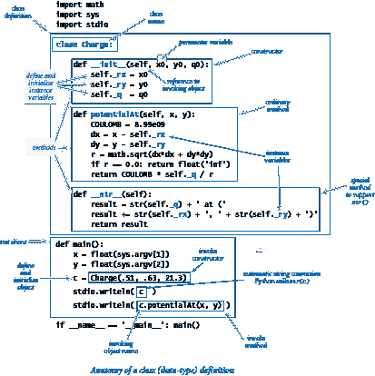
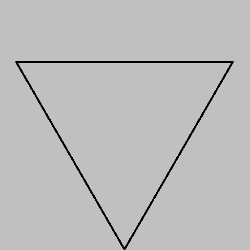

# 3.2 创建数据类型

> 原文：[`introcs.cs.princeton.edu/python/32class`](https://introcs.cs.princeton.edu/python/32class)
> 
> 译者：[飞龙](https://github.com/wizardforcel)
> 
> 协议：[CC BY-NC-SA 4.0](https://creativecommons.org/licenses/by-nc-sa/4.0/)


在上一节中，我们解释了如何在 Python 中*使用*我们自己的数据类型。在本节中，我们将解释如何*实现*它们。

在 Python 中，我们使用一个*类*来实现数据类型。将数据类型实现为 Python 类与将函数模块实现为一组函数并没有太大的不同。主要区别在于我们将值（以实例变量的形式）与方法关联起来，并且每个方法调用都与用于调用它的对象相关联。

* * *

## 数据类型的基本元素

为了说明将数据类型实现为 Python 类的过程，我们现在考虑第 3.1 节��`Charge`数据类型的实现。

### API。

我们在下面重复了 Charge API。我们已经看过 API 作为如何在客户端代码中使用数据类型的规范；现在看它们作为如何实现数据类型的规范。

> 

### 类。

在 Python 中，我们将数据类型实现为一个*类*。我们在名为 charge.py 的文件中定义了`Charge`类。要定义一个类，我们使用关键字`class`，后跟类名，然后是一个冒号，然后是一系列方法定义。我们的类定义了一个构造函数、实例变量和方法，我们将在接下来详细讨论。

### 构造函数。

构造函数创建指定类型的对象并返回对该对象的引用。对于我们的示例，客户端代码

```py
c = Charge(x0, y0, q0)

```

返回一个新的`Charge`对象，适当初始化。Python 提供了一个灵活和通用的对象创建机制，但我们采用了一个简单的子集，很好地服务于我们的编程风格。具体来说，在这本书站点中，每种数据类型都定义了一个特殊方法`__init__()`，其目的是定义和初始化实例变量，如下所述。名称前后的双下划线是你的线索，表明它是“特殊的” — 我们很快就会遇到其他特殊方法。

当客户端调用构造函数时，Python 的默认构造过程会创建指定类型的新对象，调用`__init__()`方法来定义和初始化实例变量，并返回对新对象的引用。在这本书站点中，我们将`__init__()`称为数据类型的*构造函数*，即使从技术上讲，它只是对象创建过程的相关部分。


右侧的代码是`Charge`的`__init__()`实现。它是一个方法，因此它的第一行是一个签名，由关键字`def`、它的名称(`__init__`)、一个参数变量列表和一个冒号组成。按照惯例，第一个参数变量被命名为`self`。*作为 Python 默认对象创建过程的一部分，当调用`__init()__`时，self 参数变量的值是对新创建对象的引用。*来自客户端的普通参数变量跟随特殊参数变量`self`。其余行组成构造函数的主体。本书中的惯例是，`__init()__`由初始化新创建对象的代码组成，通过定义和初始化实例变量。

### 实例变量。

数据类型是一组值和在这些值上定义的一组操作。在 Python 中，*实例变量*实现这些值。实例变量属于类的特定实例——即特定对象。在本书站点中，我们的约定是在构造函数中定义和初始化新创建对象的每个实例变量，并且仅在构造函数中。Python 程序的标准约定是实例变量名称以下划线开头。在我们的实现中，您可以检查构造函数以查看整套实例变量。例如，前一页上的`__init__()`实现告诉我们`Charge`有三个实例变量`_rx`、`_ry`和`_q`。当创建对象时，`__init__()`方法的`self`参数变量的值是对该对象的引用。就像我们可以使用`syntax c.potentialAt()`为电荷`c`调用方法一样，我们也可以使用`syntax self._rx`为电荷`self`引用实例变量。因此，`Charge`的`__init__()`构造函数中的三行定义和初始化了新对象的`_rx`、`_ry`和`_q`。

### 对象创建的细节。

右侧的内存图详细描述了当客户端使用代码创建新的`Charge`对象时发生的精确事件顺序

```py
c1 = Charge(0.51, 0.63, 21.3)

```

+   Python 创建对象并调用`__init__()`构造函数，将构造函数的`self`参数变量初始化为引用新创建对象的对象，将其`x0`参数变量初始化为引用 0.51，将其`y0`参数变量初始化为引用 0.63，将其`q0`参数变量初始化为引用 21.3。

+   构造函数在由 self 引用的新创建对象中定义和初始化`_rx`、`_ry`和`_q`实例变量。

+   构造函数完成后，Python 会自动将对新创建对象的 self 引用返回给客户端。

+   客户端将该引用分配给`c1`。

参数变量`x0`、`y0`和`q0`在`__init__()`完成时超出作用域，但它们引用的对象仍可通过新对象的实例变量访问。

### 方法。

要定义方法，我们编写的代码与我们在第二章学习的用于定义函数的代码非常相似，但（重要的是）方法还可以访问实例变量。例如，我们的`Charge`数据类型的`potentialAt()`方法的代码如下所示：

> 

第一行是方法的签名：关键字`def`、方法名称、括号中的参数变量名称和冒号。每个方法的第一个参数变量都命名为`self`。当客户端调用方法时，Python 会自动将`self`参数变量设置为引用要操作的对象——调用方法的对象。例如，当客户端使用`c.potentialAt(x, y)`调用我们的方法时，`potentialAt()`方法的`self`参数变量的值被设置为`c`。客户端的普通参数变量（在本例中为`x`和`y`）跟随特殊参数变量`self`。其余行构成`potentialAt()`方法的主体。

### 方法中的变量。

要理解方法的实现，非常重要的是要知道方法通常使用三种变量：

+   `self`对象的实例变量

+   方法的参数变量

+   局部变量

三种变量之间的差异是面向对象编程的关键，并在这个表格中总结如下：

> 

在我们的示例中，`potentialAt()`使用由`self`引用的对象的`_rx`、`_ry`和`_q`实例变量，参数变量`x`和`y`，以及局部变量`COULOMB`、`dx`、`dy`和`r`来计算并返回一个值。

### 方法就是函数。

方法是一种在类中定义并与对象关联的特殊类型的函数。函数和方法之间的关键区别在于方法与指定的对象相关联，并直接访问其实例变量。

### 内置函数。

`Charge` API 中的第三个操作是内置函数 `str(c)`。Python 的约定是自动将此函数调用转换为标准方法调用 `c.__str()__`。因此，为了支持这个操作，我们实现了特殊方法 `__str__()`，它使用与调用对象关联的实例变量将所需结果串在一起。

### 隐私。

客户端应该只通过 API 中的方法访问数据类型。有时，在实现中定义一些辅助方法是方便的，这些方法不打算由客户端直接调用。特殊方法 `__str__()` 就是一个典型的例子。正如我们在第 2.2 节中看到的私有函数一样，标准的 Python 约定是以下划线开头命名这些方法。下划线开头是一个强烈的信号，告诉客户端不要直接调用该私有方法。类似地，以下划线开头命名实例变量也告诉客户端不要直接访问这些私有实例变量。尽管 Python 没有语言支持来强制执行这些约定，但大多数 Python 程序员将其视为神圣不可侵犯。

charge.py 中 `Charge` 数据类型的实现展示了我们描述的所有特性，并定义了一个测试客户端。这个图表将 charge.py 中的代码与其特性相关联：

> 

在本节的其余部分，我们将这些基本步骤应用于创建许多有趣的数据类型和客户端。

* * *

## 秒表

程序 stopwatch.py 定义了一个 `Stopwatch` 类，实现了这个 API：

> 

`Stopwatch` 对象是一个简化版本的老式秒表。创建时开始计时，可以通过调用 `elapsedTime()` 方法询问它已经运行了多长时间。

* * *

## 直方图

程序 histogram.py 定义了一个 `Histogram` 类，用于以不同高度的条形图形式图形地表示数据的分布，这种图表称为*直方图*。这是它的 API：

> 

`Histogram` 对象维护一个给定区间内整数值出现频率的数组。它的 `draw()` 方法将绘图缩放，使最高的条形图紧密地适应画布，然后调用 `stdstats.plotBars()` 来显示值的直方图。

> | `% python histogram.py 50 .5 100000` |  |
> | --- | --- |

* * *

## 海龟图形

想象一个生活在单位正方形中并在移动时绘制线条的海龟。它可以沿直线移动指定的距离，或者可以向左旋转（逆时针）指定的角度。根据这个 API：

> 

当我们创建一个海龟时，我们将它放在指定的点，面向指定的方向。然后，通过给海龟一系列的 `goForward()` 和 `turnLeft()` 命令来创建绘图。

例如，要绘制一个三角形，我们在 (0, 0.5) 处创建一个海龟，面向从 *x* 轴逆时针旋转 60 度的角度，然后指示它向���迈一步，然后逆时针旋转 120 度，再向前迈一步，然后再逆时针旋转 120 度，最后再向前迈一步以完成三角形。

在 turtle.py 中定义的`Turtle`类是使用`stddraw`实现的 API，它维护三个实例变量：乌龟位置的坐标和当前面向的方向，以逆时针从*x*轴（*极角*）测量的角度。实现这两个方法需要*更新*这些变量的值，因此`Turtle`对象是可变的。必要的更新很简单：`turnLeft(delta)`将 delta 添加到当前角度，`goForward(step)`将步长乘以其参数的余弦值添加到当前*x*坐标，将步长乘以其参数的正弦值添加到当前*y*坐标。`Turtle`中的测试客户端将整数`n`作为命令行参数，并绘制具有`n`个边的正多边形。

> | `% python turtle.py 3` | `% python turtle.py 7` | `% python turtle.py 1000` |
> | --- | --- | --- |
> |  |  |  |

### 科赫曲线。

阶数为 0 的*科赫曲线*是一条直线。要形成阶数为*n*的科赫曲线，画一条阶数为*n* - 1 的科���曲线，左转 60 度，画第二条阶数为*n* - 1 的科赫曲线，右转 120 度（左转-120 度），画第三条阶数为*n* - 1 的科赫曲线，左转 60 度，画第四条阶数为*n* - 1 的科赫曲线。这些递归指令立即导致了在 koch.py 中显示的乌龟客户端代码。通过适当的修改，像这样的递归方案已被证明在模拟自然中发现的自相似模式，如雪花，中是有用的。

> | `% python koch.py 0` | `% python koch.py 1` |
> | --- | --- |
> |  |  |
> | `% python koch.py 2` | `% python koch.py 3` |
> |  |  |
> | `% python koch.py 4` |
> |  |

### 奇迹螺线。

想象一下，乌龟的步长每次前进时都会以微小的恒定因子（接近 1）衰减。我们的图形会发生什么变化？值得注意的是，修改 turtle.py 中的多边形绘制测试客户端以回答这个问题会导致一种被称为[对数螺线](https://en.wikipedia.org/wiki/Logarithmic_spiral)的图像，这是许多自然环境中都存在的曲线。程序 spiral.py 是这种曲线的实现。该脚本接受三个命令行参数，控制螺旋的形状和性质。

> | `% python spiral.py 3 1 1.0` | `% python spiral.py 3 10 1.2` |
> | --- | --- |
> |  |  |
> | `% python spiral.py 1440 10 1.00004` | `% python spiral.py 1440 10 1.0004` |
> |  |  |

对数螺线最早由勒内·笛卡尔于 1638 年描述。雅各布·伯努利对其数学特性感到惊讶，因此将其命名为*奇迹螺线*（miraculous spiral）。许多人也认为这个精确的曲线在各种自然现象中清晰可见是"奇迹"：

> | **鹦鹉螺壳** | **螺旋星系** | **暴风云** |
> | --- | --- | --- |
> |  |  |  |

### 布朗运动。

想象一只迷失方向的乌龟（再次按照其标准的交替转向和步进规则）在每一步之前随机转向。程序 drunk.py 绘制了这样一只乌龟所走过的路径。1827 年，植物学家罗伯特·布朗通过显微镜观察到浸泡在水中的花粉颗粒似乎以这种随机方式移动，后来被称为 [布朗运动](https://en.wikipedia.org/wiki/Brownian_motion)，并引发了阿尔伯特·爱因斯坦对物质原子性质的洞察。

> | `% python drunk.py 10000 .01` |
> | --- |
> |  |

程序 drunks.py 绘制了许多这样的乌龟，它们都在四处漫步。

> | `% python drunks.py 20 500 .005` | `% python drunks.py 20 1000 .005` |
> | --- | --- |
> |  |  |
> | `% python drunks.py 20 5000 .005` |
> |  |

乌龟图形最初是由麻省理工学院的西摩·帕帕特在 20 世纪 60 年代作为教育性编程语言 [Logo](https://en.wikipedia.org/wiki/Logo_%28programming_language%29) 的一部分开发的。但是乌龟图形并不是玩具，正如我们刚刚在许多科学示例中看到的那样。乌龟图形还有许多商业应用。例如，它是 [PostScript](https://en.wikipedia.org/wiki/PostScript) 的基础，这是一种用于创建大多数报纸、杂志和书籍的印刷页面的编程语言。

* * *

## 复数

复数是形式为 *x* + *yi* 的数，其中 *x* 和 *y* 是实数，*i* 是 -1 的平方根。数 *x* 被称为复数的 *实部*，数 *y* 被称为复数的 *虚部*。这个术语源于平方根 -1 必须是一个虚数的想法，因为没有实数可以具有这个值。复数是一个典型的数学抽象：无论一个人是否认为从物理上讲得通取 -1 的平方根，复数都帮助我们理解自然界。

Python 语言提供了一个 `complex`（小写 `c`）数据类型。在实际应用中，除非你发现自己需要更多的操作，否则你肯定应该利用 `complex`。然而，由于为复数开发数据类型是面向对象编程的一个典型练习，我们现在考虑自己的 `Complex`（大写 `C`）数据类型。这样做将使我们能够考虑围绕数学抽象的数据类型的一些有趣问题，在一个非平凡的环境中。

复数的基本计算所需的操作是通过应用代数的交换律、结合律和分配律（以及恒等式 i² = -1）来对它们进行加法和乘法运算；计算幅度；并根据以下方程式提取实部和虚部：

+   *加法*：(*x*+*yi*) + (*v*+*wi*) = (*x*+*v*) + (*y*+*w*)*i*

+   *乘法*：(*x* + *yi*) * (*v* + *wi*) = (*xv* - *yw*) + (*yv* + *xw*)*i*

+   *幅度*：|*x* + *yi*| = (*x*² + *y*²)^(1/2)

+   *实部*：Re(*x* + *yi*) = *x*

+   *虚部*：Im(*x* + *yi*) = *y*

通常，我们从规定数据类型操作的 API 开始。

> 

在 complex.py 中定义的 `Complex` 类实现了该 API。

### 特殊方法。

当 Python 在客户端代码中看到表达式`a + b`时，它将其替换为方法调用`a.__add__(b)`。类似地，Python 将`a * b`替换为方法调用`a.__mul__(b)`。因此，我们只需要为加法和乘法实现特殊方法`__add__()`和`__mul__()`，以使加法和乘法按预期运行。这个机制与我们用来支持 Python 内置的`str()`函数对`Charge`实现`__str__()`特殊方法的机制相同，只是算术运算符的特殊方法需要两个参数。上面的 API 包括一个额外的列，将客户端操作映射到特殊方法。我们通常在我们的 API 中省略这一列，因为这些名称是标准的，与客户端无关。Python 特殊方法的列表很广泛——我们将在第 3.3 节进一步讨论它们。

### 访问此类型对象中的实例变量。

`__add__()`和`__mul__()`的实现需要访问两个对象中的值：作为参数传递的对象和用于调用方法的对象（即，被`self`引用的对象）。当客户端调用`a.__add__(b)`时，参数变量`self`被设置为引用与参数`a`相同的对象，参数变量`other`被设置为引用与参数`b`相同的对象。我们可以像往常一样使用`self._re`和`self._im`访问 a 的实例变量。要访问`b`的实例变量，我们使用代码`other._re`和`other._im`。由于我们的约定是保持实例变量私有，我们不直接访问另一个类中的实例变量。在同一类中访问另一个对象中的实例变量不违反此隐私政策。

### 不可变性。

`Complex`中的两个实例变量在创建`Complex`对象时设置，并在对象的生命周期内不会更改。也就是说，`Complex`对象是不可变的。

### Mandelbrot 集合。

*Mandelbrot 集合*是由 Benoit Mandelbrot 发现的一组特定的复数，��有许多迷人的性质。它是一个与 Barnsley 蕨类、Sierpinski 三角形、Brownian 桥、Koch 曲线、醉龟等我们在本书中看到的递归（自相似）模式和程序相关的分形图案。Mandelbrot 集合中的点集不能用单个数学方程描述。相反，它由一个算法定义，因此是一个复杂客户端的完美候选者：我们通过编写一个程序来绘制它来研究这个集合。

<考虑复数序列>z[0]，*z*[1]，*z*[2]，...，*z*[t]，...，其中*z*[*t*]+1 = (*z*[*t*])² + *z*[0]。例如，这个表格显示了对应于*z*[0] = 1 + *i*的序列的前几个条目：</consider>

> 

现在，如果序列|*z[t]*|发散到无穷大，那么*z*[0]不在 Mandelbrot 集合中；如果序列有界，那么*z*[0]在 Mandelbrot 集合中。


要可视化 Mandelbrot 集合，我们对*复数*点进行采样，就像我们对实数点进行采样以绘制实值函数一样。每个复数*x* + *yi*对应于平面上的一个点（*x*，*y*），因此我们可以按照以下方式绘制结果：对于指定分辨率*n*，我们在指定的正方形内定义一个*n*乘*n*像素网格，并在相应点在 Mandelbrot 集合中时绘制黑色像素，在不在时绘制白色像素。

没有简单的测试可以让我们断定一个点肯定在集合中。但有一个简单的数学测试可以告诉我们肯定一个点*不*在集合中：如果序列中的任何数字的大小超过 2（例如 1 + 3*i*），那么该序列肯定会发散。程序 mandelbrot.py 使用这个测试来绘制 Mandelbrot 集的视觉表示。由于我们对该集合的了解并不十分黑白分明，因此在我们的视觉表示中使用灰度。计算的基础是函数`mandel()`，它接受一个复数参数`z0`和一个整数参数`limit`，并计算从`z0`开始的 Mandelbrot 迭代序列，返回在给定限制下保持大小小于（或等于）2 的迭代次数。即使在我们放大平面的一个小部分时，这个简单程序产生的图像的复杂性也是显著的。

> | `% python mandelbrot.py 512 -.5 0 2` | `% python mandelbrot.py 512 .1015 -.633 .01` |
> | --- | --- |
> |  |  |

使用 mandelbrot.py 生成图像需要对复数值进行数亿次操作。因此，我们使用 Python 的`complex`数据类型，这肯定比我们刚考虑的`Complex`数据类型更有效率。

* * *

## 商业数据处理

假设股票经纪人需要维护包含各种股票股份的客户账户。也就是说，经纪人需要处理的值集合包括客户姓名、持有的不同股票数量、每支股票的股票数量和股票代码，以及手头现金。为了处理一个账户，经纪人至少需要在此 API 中定义的操作：

> 

客户信息具有很长的生命周期，并且需要保存在文件或数据库中。为了处理一个账户，客户端程序需要从相应的文件中读取信息；适当处理信息；如果信息发生变化，则将其写回文件，保存以备后用。为了实现这种处理，我们需要一个文件格式和一个内部表示，或者账户信息的数据结构。

### 文件格式。

现代系统通常使用文本文件，即使是用于数据，以减少对任何一个程序定义的格式的依赖。为简单起见，我们使用直接表示，其中列出了账户持有人的姓名（字符串）、现金余额（浮点数）和持有的股票数量（整数），然后是每支股票的一行，列出了股票数量和股票代码。例如，文件 turing.txt 包含了这些数据：

```py
% more turing.txt
Turing, Alan
10.24
4
100 ADBE
 25 GOOG
 97 IBM
250 MSFT

```

### 数据结构。

要实现一个`StockAccount`，我们使用以下实例变量：

+   一个字符串用于账户名

+   一个浮点数用于手头现金

+   一个整数用于股票数量

+   一个字符串数组用于股票代码

+   一个整数数组用于股票数量

在 stockaccount.py 中定义的`StockAccount`类实现了这些设计决策。数组`_stocks[]`和`_shares[]`被称为*并行数组*。给定索引`i`，`_stocks[i]`给出股票代码，`_shares[i]`给出账户中该股票的股票数量。`valueOf()`方法使用 stockquote.py（来自第 3.1 节）从网络获取每支股票的价格。`buy()`和`sell()`的实现需要在第 4.4 节介绍的基本机制，因此我们将它们推迟到该部分的练习中。测试客户端接受一个文件名（例如前述的 turing.txt）作为命令行参数，并编写适当的报告。

* * *

#### 问答

**问：** 我可以在与类名无关的文件中定义一个类吗？我可以在一个.py 文件中定义多个类吗？

**A.** 是的，但出于风格考虑，我们在本章中没有这样做。在第四章中，我们将遇到一些适合使用这些特性的情况。

**Q.** 如果`__init__()`在技术上不是构造函数，那是什么？

**A.** 另一个特殊函数，`__new__()`。为了创建一个对象，Python 首先调用`__new__()`，然后调用`__init__()`。对于本书中的程序，`__new__()`的默认实现符合我们的目的，因此我们不讨论它。

**Q.** 每个类都必须有一个构造函数吗？

**A.** 是的，但如果你不定义构造函数，Python 会自动提供一个默认（无参数）构造函数。按照我们的约定，这样的数据类型将是无用的，因为它没有实例变量。

**Q.** 为什么在引用实例变量时需要显式使用`self`？

**A.** 在语法上，Python 需要一种方式来知道你是在为局部变量还是实例变量赋值。在许多其他编程语言（如 C++和 Java）中，你明确声明数据类型的实例变量，因此没有歧义。`self`变量还使程序员很容易知道代码是在引用局部变量还是实例变量。

**Q.** 假设我在我的数据类型中不包括`__str__()`方法。如果我使用该类型的对象调用`str()`或`stdio.writeln()`会发生什么？

**A.** Python 提供了一个默认实现，返回一个包含对象类型和其标识（内存地址）的字符串。这通常不太有用，所以你通常会想要定义自己的实现。

**Q.** 除了参数、局部和实例变量之外，类中还有其他种类的变量吗？

**A.** 是的。回想一下第一章，你可以在全局代码中定义*全局变量*，在任何函数、类或方法的定义之外。全局变量的作用域是整个`.py`文件。在现代编程中，我们专注于限制作用域，因此很少使用全局变量（除了不打算重用的小型脚本）。Python 还支持*类变量*，这些变量在类内部定义，但在任何方法之外。每个类变量在类中的所有对象之间共享；这与实例变量形成对比，实例变量每个对象一个。类变量有一些专门的用途，但我们在本书中不使用它们。

**Q.** 只有我觉得 Python 的命名约定很复杂吗？

**A.** 是的，但这也适用于许多其他编程语言。以下是我们在本书中遇到的命名约定的快速总结：

+   变量名以小写字母开头。

+   常量变量名由大写字母组成。

+   实例变量名以下划线和小写字母开头。

+   一个方法名以小写字母开头。

+   一个特殊方法名以双下划线和小写字母开头，以双下划线结尾。

+   一个用户定义的类名以大写字母开头。

+   一个内置类名以小写字母开头。

+   脚本或模块存储在以小写字母结尾的文件中，文件名以`.py`结尾。

大多数这些约定并不是语言的一部分，尽管许多 Python 程序员将其视为语言的一部分。你可能会想：如果它们如此重要，为什么不将其纳入语言中呢？好问题。然而，一些程序员对这些约定非常热衷，你很可能会在某一天遇到一个坚持让你遵循某种风格的老师、主管或同事，所以最好跟着大流。事实上，许多 Python 程序员使用下划线而不是大写字母来分隔多个单词的变量名，更喜欢`is_prime`和`hurst_exponent`而不是`isPrime`和`hurstExponent`。

**Q.** 我如何为`complex`数据类型指定文字？

**答：** 将字符`j`附加到数值文字产生一个虚数（其实部为零）。你可以将这个字符添加到数值文字中以产生一个复数，如`3 + 7j`。在某些工程学科中，选择`j`而不是`i`是常见的。请注意，`j`不是一个复数文字 —— 相反，你必须使用`1j`。

**问：** mandelbrot.py 程序创建了大量的`complex`对象。所有这些对象创建的开销会减慢速度吗？

**答：** 是的，但不至于使我们无法生成我们的图表。我们的目标是使我们的程序易于阅读、易于组合和易于维护。通过复数抽象限制范围有助于我们实现这一目标。如果出于某种原因需要显著加快 mandelbrot.py 的速度，你可以考虑绕过复数抽象，使用一个不是对象的低级语言。一般来说，Python 并不针对性能进行优化。我们将在第四章重新讨论这个问题。

**问：** 为什么在 complex.py 中的`__add__(self, other)`方法可以引用参数变量`other`的实例变量？这些实例变量不应该是私有的吗？

**答：** Python 程序员认为隐私是相对于特定类而不是特定对象的。因此，一个方法可以引用同一类中任何对象的实例变量。Python 没有“超级私有”命名约定，只能引用调用对象的实例变量。然而，访问其他对象的实例变量可能有点风险，因为一个粗心的客户端可能传递一个不是`Complex`类型的参数，这样我们就会（不知情地）访问另一个类中的实例变量！对于可变类型，我们甚至可能（不知情地）修改或创建另一个类中的实例变量！

**问：** 如果方法真的是函数，我可以使用函数调用语法调用一个方法吗？

**答：** 是的，你可以将类中定义的函数称为方法或普通函数调用。例如，如果`c`是`Charge`类型的对象，则函数调用`Charge.potentialAt(c, x, y)`等同于方法调用`c.potentialAt(x, y)`。在面向对象编程中，我们更喜欢方法调用语法，以突出所述对象的角色，并避免将类名硬编码到函数调用中。

* * *

#### 练习


1.  考虑下面显示的（轴对齐）矩形的数据类型实现，它用矩形的中心点坐标、宽度和高度表示每个矩形。组合一个这种数据类型的 API，并填写`perimeter()`、`intersects()`、`contains()`和`draw()`的代码。*注意*：将重合的线视为相交，因此，例如`a.intersects(a)`为 True，`a.contains(a)`为 True。

    ```py
    class Rectangle:

        # Construct self with center (x, y), width w, and height h.
        def __init__(self, x, y, w, h):
            self._x = x
            self._y = y
            self._width = w;
            self._height = h;

        # Return the area of self.
        def area(self):
            return self._width * self._height

        # Return the perimeter of self.
        def perimeter(self):
            ...

        # Return True if self intersects other, and False otherwise.
        def intersects(self, other):
            ...

        # Return True if other is completely inside of self, and False
        # otherwise.
        def contains(self, other):
            ...

        # Draw self on stddraw.
        def draw(self):
            ...

    ```

1.  为`Rectangle`编写一个测试客户端，接受三个命令行参数`n`、`lo`和`hi`；在单位正方形中生成宽度和高度均匀分布在`lo`和`hi`之间的`n`个随机矩形；将这些矩形绘制到标准绘图中；并将它们的平均面积和平均周长写入标准输出。

1.  将代码添加到你之前练习中的测试客户端代码中，计算相交并相互包含的矩形对的平均数量。

1.  开发一个实现你之前练习中的`Rectangle` API 的实现，表示矩形的坐标为它们的左下角和右上角的坐标。不要更改 API。

以下代码有什么问题？

```py
class Charge:
    def __init__(self, x0, y0, q0):
        _rx = x0  # Position
        _ry = y0  # Position
        _q = q0   # Charge
...

```

*解决方案*。构造函数中的赋值语句创建了本地变量`_rx`、`_ry`和`_q`，它们从参数变量中分配值，但从未被使用。它们在构造函数执行完毕时消失。相反，构造函数应该通过在每个变量前加上`self`后跟点运算符来创建实例变量，如下所示：

```py
class Charge:
    def __init__(self, x0, y0, q0):
        self._rx = x0  # Position
        self._ry = y0  # Position
        self._q = q0   # Charge
...

```

在 Python 中，下划线并不是严格要求的，但我们在本书中遵循这个标准 Python 约定，以表明我们的意图是将实例变量设为私有的。

1.  创建一个表示地球上位置的数据类型`Location`，使用纬度和经度。包括一个`distanceTo()`方法，使用大圆距离计算距离（参见第 1.2 节中的*大圆*练习）。

1.  Python 提供了一个数据类型`Fraction`，定义在标准模块`fractions.py`中，实现有理数。实现自己版本的该数据类型。具体地，为有理数数据类型开发以下 API 的实现：

    > 

    使用 euclid.py 中定义的`euclid.gcd()`（来自第 2.3 节）确保分子和分母永远没有任何公共因子。包括一个测试客户端，测试所有您的方法。

1.  *区间*被定义为一条线上大于等于`left`且小于等于`right`的所有点的集合。特别地，`right`小于`left`的区间为空。组合一个实现以下 API 的数据类型`Interval`。包括一个测试客户端，是一个过滤器，从命令行获取一个浮点数`x`，并将包含`x`的所有输入的区间（每个由一对浮点数定义）写入标准输出，并将相互交叉的所有区间对写入标准输出。

    > 

1.  开发一个实现您的`Rectangle` API（在本节的先前练习中）的实现，利用`Interval`（在本节的先前练习中）来简化和澄清代码。

1.  组合一个数据类型`Point`，实现以下 API。包括一个自己设计的客户端。

    > 

1.  添加到`Stopwatch`的方法，如 stopwatch.py 中定义的，允许客户端停止和重新启动秒表。

1.  使用`Stopwatch`比较使用`for`循环计算谐波数（如第 1.3 节所示）的成本，与使用第 2.3 节中给出的递归方法相比。

1.  修改 turtle.py 中的测试客户端，以便为奇数`n`生成星星。

1.  组合一个版本的 mandelbrot.py，使用`Complex`代替 Python 的`complex`。然后使用`Stopwatch`（如 stopwatch.py 中定义的）来计算两个程序的运行时间比率。

1.  修改 class `Complex`中的`__str__()`方法 ，使其以传统格式写出复数。例如，它应该将值 3 - *i*写为`3 - i`，而不是`3.0 + -1.0i`，将值 3 写为`3`，而不是`3.0 + 0.0i`，将值 3*i*写为`3i`，而不是`0.0 + 3.0i`。

1.  组合一个`Complex`客户端，从命令行获取三个浮点数*a*、*b*和*c*，并写出*ax*² + *bx* + *c*的复数根。

1.  编写一个`Complex`客户端`Roots`，从命令行获取两个浮点数*a*和*b*以及一个整数*n*，并写出*a* + *bi*的第*n*个根。*注意*：如果您不熟悉复数取根的操作，请跳过此练习。

1.  实现对`Complex` API 的以下添加：

    > 

    包括一个测试客户端，测试所有您的方法。

1.  找到一个`complex`数，使得`mandel()`（来自 mandelbrot.py）返回大于 100 的数，然后放大该数。

* * *

#### 创意练习

1.  **可变电荷**。修改 charge.py 中定义的`Charge`类，使得电荷值`q0`可以改变，通过添加一个接受浮点参数并将给定值加到`q0`的方法`increaseCharge()`。然后，编写一个客户端，初始化一个数组：

    ```py
    a = stdarray.create1D(3)
    a[0] = Charge(.4, .6, 50)
    a[1] = Charge(.5, .5, -5)
    a[2] = Charge(.6, .6, 50)

    ```

    然后显示通过将计算图片的代码包装在类似以下循环中，逐渐减少`a[1]`的电荷值的结果：

    ```py
    for t in range(100):
        # Compute the picture p.
        stddraw.clear()
        stddraw.picture(p)
        stddraw.show(0)
        a[1].increaseCharge(-2.0)

    ```

1.  **复杂计时**。编写一个`Stopwatch`客户端（参见 stopwatch.py），比较使用`complex`和直接操作两个浮点值的代码的成本，用于执行 mandelbrot.py 中的计算任务。具体来说，创建一个仅执行计算的 mandelbrot.py 版本（删除引用`Picture`的代码），然后创建一个不使用`complex`的程序版本，然后计算运行时间的比率。

1.  **四元数**。1843 年，威廉·哈密尔顿爵士发现了一种称为四元数的复数扩展。四元数是一个向量*a* = (*a*[0], *a*[1], *a*[2], *a*[3])，具有以下操作：

    +   *幅度*：|*a*| = (*a*[0]² + *a*[1]² + *a*[2]² + *a*[3]²)^(1/2)。

    +   *共轭*：*a*的共轭是(*a*[0], -*a*[1], -*a*[2], -*a*[3])。

    +   *逆*：*a*^(-1) = (*a*[0] /|*a*|, -*a*[1] /|*a*|, -*a*[2] /|*a*|, -*a*[3] /|*a*|)。

    +   *和*：*a* + *b* = (*a*[0] + *b*[0], *a*[1] + *b*[1], *a*[2] + *b*[2], *a*[3] + *b*[3])。

    +   *积*：*a* * *b* = (*a*[0] *b*[0] - *a*[1] *b*[1] - *a*[2] *b*[2] - *a*[3] *b*[3], *a*[0] *b*[1] - *a*[1] *b*[0] + *a*[2] *b*[3] - *a*[3] *b*[2], *a*[0] *b*[2] - *a*[1] *b*[3] + *a*[2] *b*[0] + *a*[3] *b*[1], *a*[0] *b*[3] + *a*[1] *b*[2] - *a*[2] *b*[1] + *a*[3] *b*[0])。

    +   *商*：*a* / *b* = *ab*^(-1)。

    创建一个四元数数据类型和一个测试客户端，测试所有你的代码。四元数将三维空间中的旋转概念扩展到四维空间。它们被用于计算机图形学、控制理论、信号处理和轨道力学。

1.  **龙曲线**。编写一个递归客户端`dragon.py`，使用`Turtle`（在 turtle.py 中定义）绘制龙曲线（参见第 1.2 和 1.5 节的练习）。这些曲线最初由三位 NASA 物理学家发现，后来在 20 世纪 60 年代由马丁·加德纳广泛传播，并在迈克尔·克莱顿的书籍和电影《侏罗纪公园》中使用。这个练习可以用非常紧凑的代码解决，基于一对直接从第 1.2 节练习中的定义派生的相互作用递归函数。其中一个函数`dragon()`应该按预期绘制曲线；另一个函数`nogard()`应该以*相反*顺序绘制曲线。

    > |  |  |  |  |  |
    > | --- | --- | --- | --- | --- |
    > |  |  |  |  |  |

1.  **希尔伯特曲线**。*填充空间*曲线是一个连续曲线，在单位正方形中通过每个点。组成`Turtle`的递归客户端（如 turtle.py 中定义的）来生成这些递归模式，这些模式接近 19 世纪末数学家大卫·希尔伯特定义的填充空间曲线。参见前一个练习。您需要一对方法：`hilbert()`，遍历希尔伯特曲线，和`treblih()`，以相反顺序遍历希尔伯特曲线。

    |  |  |  |  |  |
    | --- | --- | --- | --- | --- |

1.  **Gosper 岛**。组成一个`Turtle`的递归客户端（如 turtle.py 中定义的），生成这些递归模式。

    |  |  |  |  |  |
    | --- | --- | --- | --- | --- |

1.  **数据分析**。为运行实验而组成一种数据类型，其中控制变量是范围为 0, *n*)的整数，而因变量是浮点数。例如，研究接受整数参数的程序的运行时间将涉及这样的实验。Tukey 图是一种可视化此类数据统计的方法（请参阅第 2.2 节中的*Tukey 图*练习）。实现以下 API：

    > ![数据 API

    您可以使用`stdstats`中的函数进行统计计算和绘制图表。使用`stddraw`，以便客户端可以为`plot()`和`tukeyPlot()`使用不同的颜色（例如，所有点使用浅灰色，Tukey 图使用黑色）。编写一个测试客户端，绘制运行实验的结果（渗透概率），其中 percolation.py（来自第 2.4 节）的网格大小逐渐增加。

1.  **元素**。为元素周期表中的��目组成一个数据类型`Element`。包括元素、原子序数、符号和原子量的数据类型值，以及每个值的访问器方法。然后，创建一个数据类型`PeriodicTable`，从文件中读取值以创建`Element`对象数组，并响应标准输入上的查询，以便用户可以输入分子方程式如`H2O`，程序通过打印分子量来回应。为每种数据类型开发 API 和实现。

    文件 elements.csv 包含程序应该读取的数据。包括元素、原子序数、符号和原子量的字段。（忽略沸点、熔点、密度（kg/m3）、汽化热（`kJ/mol`）、熔化热（kJ/mol）、热导率（W/m/K）和比热容（J/kg/K）的字段，因为并非所有元素都知道这些值）。该文件采用 CSV 格式（字段由逗号分隔）。

1.  **股票价格**。文件 djia.csv 包含道琼斯工业平均指数历史上所有收盘股价，采用逗号分隔值格式。组成一个数据类型`Entry`，可以保存表中的一个条目，其中包括日期、开盘价、当日最高价、当日最低价、收盘价等值。然后，组成一个数据类型`Table`，读取文件以构建`Entry`对象数组，并支持计算不同时间段内的平均值的方法。最后，创建有趣的`Table`客户端来生成数据的图表。发挥创造力：这条路已经被走过很多次。

1.  **牛顿法的混沌**。多项式*f*(*z*) = *z*⁴ - 1 有四个根：1，-1，*i*和-*i*。我们可以在复平面上使用牛顿法找到这些根：*z*[*k*+1] = *z*[*k*] - *f*(*z*[*k*])/*f*'(*z*[*k*])。这里，*f*(*z*) = *z*⁴ - 1，*f*'(*z*) = 4*z*³。该方法收敛到四个根中的一个，取决于起始点*z*[0]。编写一个名为`Newton`的`Complex`客户端（如 complex.py 中定义的），它接受一个命令行参数*n*，通过将像素映射到以原点为中心、大小为 2 的正方形中的复平面上的复点，并根据相应点收敛到哪个四个根（如果 100 次迭代后没有收敛则为黑色）将*n*乘以*n*的`Picture`像素涂成白色、红色、绿色或蓝色。

    > 

1.  **等势面**。*等势面*是所有具有相同电势 V 的点的集合。给定一组点电荷，通过绘制等势面（也称为*等势线图*）来可视化电势是很有用的。编写一个名为`equipotential.py`的程序，通过计算每个像素点的电势并检查相应点的电势是否在 5V 的倍数的 1 像素范围内来绘制每 5V 一条线。*注意*：通过将分配给每个像素的颜色值混合，而不是让它们与灰度值成比例，可以很容易地近似解决这个练习，具体方法请参考这里（来自第 3.1 节）。例如，通过在创建`Color`之前插入上面的代码，可以创建附带的图像。解释为什么它有效，并尝试使用自己的版本进行实验。

    > |  |  |
    > | --- | --- |

1.  **彩色曼德博图**。创建一个包含 256 个整数三元组的文件，表示有趣的`Color`值，然后使用这些颜色而不是灰度值来绘制 mandelbrot.py 中的每个像素。读取值以创建一个包含 256 个`Color`值的数组，然后使用`mandel()`的返回值索引到该数组。通过在集合的各个位置尝试不同的颜色选择，可以产生令人惊叹的图像。mandel.txt 是一个示例。

    > | `% python mandelbrot.py -1.5 -1.0 2.0 2.0` | `% python mandelbrot.py 0.10259 -0.641 0.0086 0.0086` |
    > | --- | --- |
    > |  |  |

1.  **茱莉亚集**。对于给定的复数*c*，*茱莉亚集*是与曼德博函数相关的一组点。我们不��固定*z*而变化*c*，而是固定*c*而变化*z*。那些使修改后的曼德博函数保持有界的点属于茱莉亚集；那些使序列发散到无穷大的点不属于该集合。所有感兴趣的点*z*都位于以原点为中心的 4 乘 4 的方框内。对于*c*的茱莉亚集是连通的，当且仅当*c*在曼德博集中时！编写一个名为`colorjulia.py`的程序，它接受两个命令行参数*a*和*b*，并使用前面练习中描述的颜色表方法为*c* = *a* + *bi*绘制一个彩色版本的茱莉亚集。

    > | `python colorjulia.py -1.25 0.00` | `python colorjulia.py-0.75 0.10` |
    > | --- | --- |
    > |  |  |

1.  **最大赢家和最大输家**。编写一个`StockAccount`的客户端（如在 stockaccount.py 中定义），该客户端构建一个`StockAccount`对象数组，计算每个账户的总价值，并为价值最大和最小的账户编写报告。假设账户信息保存在一个文件中，该文件依次包含每个账户的信息，格式如本页前面描述的那样。
