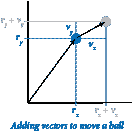
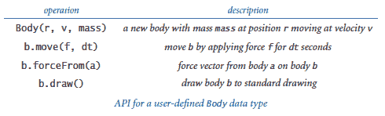
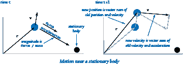
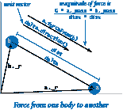
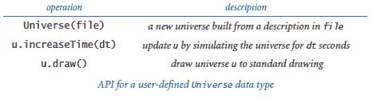
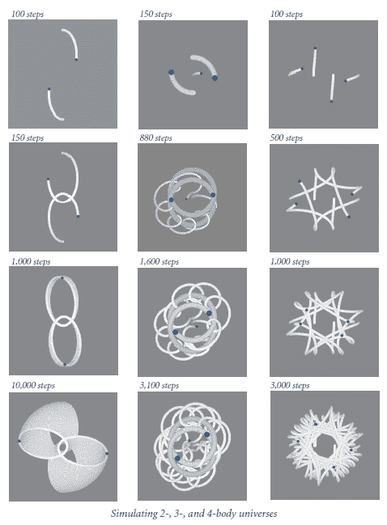

# 3.4 案例研究：N 体模拟

> 原文：[`introcs.cs.princeton.edu/python/34nbody`](https://introcs.cs.princeton.edu/python/34nbody)

在本节中，我们考虑一个展示面向对象编程的新程序。我们的任务是编写一个动态模拟*n*个物体在相互引力影响下的运动的程序。这个*n*体模拟问题是由艾萨克·牛顿在 350 多年前首次提出的，科学家们今天仍在密切研究。

这个问题是面向对象编程的一个引人入胜的例子的一个原因是，它在现实世界中的物理对象和我们在编程中使用的抽象对象之间呈现出直接而自然的对应关系。

* * *

## N-Body Simulation

第 1.5 节的弹球模拟基于*牛顿第一运动定律*：运动中的物体保持相同速度的运动，除非受到外力的作用。将该例子装饰以包括*牛顿第二运动定律*（解释外力如何影响速度）将我们引向一个迷住科学家多年的基本问题。给定一个由引力相互影响的*n*个物体系统，问题是描述它们的运动。

### 物体数据类型。

在 bouncingball.py（来自第 1.5 节），我们将与原点的位移保持在浮点数`rx`和`ry`中，将速度保持在浮点数`vx`和`vy`中，并用以下语句将球体在一个时间单位内移动的距离位移： 

```py
rx = rx + vx
ry = ry + vy

```



使用`Vector`，如在 vector.py（来自第 3.3 节）中定义的，我们可以将位置保持在`Vector` `r`中，将速度保持在`Vector` `v`中，然后用一条语句将物体在`dt`时间单位内移动的距离位移：

```py
r = r + v.scale(dt)

```

程序 body.py 实现了`Body`，一个用于移动物体的 Python 类。`Body`是一个`Vector`客户端 — 数据类型的值是`Vector`对象，携带了物体的位置和速度，以及一个携带了质量的浮点数。数据类型操作允许客户端移动和绘制物体（以及计算由另一个物体引起的引力吸引力的力向量），如此 API 所定义：

> 

从技术上讲，物体的位置（与原点的位移）不是一个向量（它是空间中的一个点，不是一个方向和大小），但将其表示为`Vector`是方便的，因为`Vector`操作导致我们需要移动物体的转换的紧凑代码。当我们移动一个`Body`时，我们不仅需要改变它的位置，还需要改变它的速度。

### 力和运动。

牛顿第二运动定律表明，物体上的力（一个向量）等于其质量和加速度（也是一个向量）的数量积：**F** = *m* **a**。换句话说，要计算物体的加速度，我们计算力，然后除以其质量。在`Body`中，力是传递给`move()`的`Vector`参数`f`，因此我们可以首先通过除以质量（作为浮点数保留在实例变量中）来计算加速度向量，然后通过添加这个向量在时间间隔内变化的量来计算速度的变化（就像我们使用速度来改变位置一样）。这个定律立即转化为以下代码，用于根据给定的力向量`f`和时间量`dt`更新物体的位置和速度：

```py
a = f.scale(1.0 / mass)
v = v + a.scale(dt)
r = r + v.scale(dt)

```

这段代码出现在`Body`的`move()`方法中，以调整其值以反映施加该力量的后果的时间量：物体移动，其速度改变。这个计算假定加速度在时间间隔内是恒定的。

> 

### 物体之间的力。

 一个天体对另一个天体施加的力的计算被封装在`Body`中的`forceFrom()`方法中，该方法以一个`Body`对象作为参数并返回一个`Vector`。牛顿的普遍引力定律是计算的基础：两个天体之间的引力大小等于它们的质量乘积除以它们之间距离的平方（乘以引力常数*G*，即 6.67 × 10^(-11) N m² / kg²），力的方向是两个粒子之间的连线。这个定律转化为以下代码来计算`a.forceFrom(b)`：

```py
G = 6.67e-11
delta = b._r - a._r
dist = abs(delta)
magnitude = G * a.mass * b.mass / (dist * dist)
f = delta.direction().scale(magnitude)

```

力矢量的*大小*是浮点数大小，力矢量的*方向*与两个天体位置之间的差矢量的方向相同。力矢量`f`是大小和方向的乘积。

### Universe 数据类型。

`Universe`，如在 universe.py 中定义的，是一个实现以下 API 的数据类型：

> 

其数据类型值定义了一个宇宙（其大小、天体数量和一个天体数组）和两个数据类型操作：`increaseTime()`，它调整所有天体的位置（和速度），以及`draw()`，它绘制所有天体。*n*-body 模拟的关键在于`Universe`中`increaseTime()`的实现。计算的第一部分是一个双重嵌套循环，计算每个天体对其他每个天体施加的引力矢量。它应用了叠加原理，即我们可以将影响一个天体的所有力矢量相加，得到代表总力的单一矢量。在计算了所有力之后，它调用每个天体的`move()`方法来应用计算出的力进行固定时间量的运动。

### 文件格式。

构造函数从一个文件中读取宇宙参数和天体描述，该文件包含以下信息：

+   天体数量

+   宇宙的半径

+   每个天体的位置、速度和质量

文件 2bodytiny.txt、2body.txt、3body.txt 和 4body.txt 包含了这种形式的数据。和往常一样，为了保持一致性，所有的测量单位都是标准国际单位制（请注意，引力常数*G*也出现在我们的代码中）。有了这种定义的文件格式，我们的`Universe`构造函数的代码就很简单了。每个`Body`由五个浮点数来描述：其位置的*x*和*y*坐标，初始速度的*x*和*y*分量，以及其质量。

下面显示的静态图像是通过修改`Universe`和`Body`来绘制白色的天体，然后在灰色背景上绘制黑色的天体制作的。相比之下，当你运行 universe.py 时，得到的动态图像给人一种天体相互轨道运行的真实感觉，这在固定图片中很难辨认。

> 

* * *

#### Q & A

**Q.** `Universe`的 API 确实很小。为什么不只是在`Body`的`main()`测试客户端中实现那些代码？

**A.** 我们的设计表达了许多人对宇宙的信念：它是被创造出来的，然后时间流逝。它澄清了代码，并允许在模拟宇宙中发生的事情时具有最大的灵活性。

**Q.** 为什么`forceFrom()`是一个方法？它不是作为一个接受两个`Body`对象作��参数的函数会更好吗？

**A.** 将`forceFrom()`实现为一个方法是几种可能的选择之一，而将一个函数作为参数接受两个`Body`对象显然是一个合理的选择。一些程序员更喜欢完全避免在数据类型实现中使用函数；另一个选择是将作用在每个`Body`上的力作为实例变量维护。我们的选择是这两个选项之间的折衷。

**Q.** body.py 中的`move()`方法应该使用旧速度而不是更新后的速度来更新位置吗？

**A.** 结果表明，使用更新后的速度（称为*跳跃法*）比使用旧速度（称为*欧拉法*）产生更准确的结果。如果你学习数值分析课程，你会明白为什么。

* * *

#### 练习

1.  开发一个面向对象的版本 bouncingball.py（来自第 1.5 节）。包括一个构造函数，以随机方向和随机速度（在合理范围内）启动每个球的运动，并编写一个测试客户端，从命令行获取一个整数`n`，并模拟`n`个弹跳球的运动。

1.  在 body.py 中添加一个`main()`函数，用于对 Body 数据类型进行单元测试。

1.  修改 body.py，使其绘制的圆的半径与其质量成比例。

1.  在没有引力作用的宇宙中会发生什么？这种情况对应于`Body`中的`forceFrom()`始终返回零向量。

1.  创建一个数据类型`Universe3D`来模拟三维宇宙。开发一个数据文件，模拟我们太阳系中行星围绕太阳的运动。

1.  编写一个测试客户端，模��两个不同宇宙的运动（由两个不同文件定义，并出现在标准绘图窗口的两个不同部分）。你还需要修改`Body`中的`draw()`方法。

1.  编写一个类`RandomBody`，它使用（精心选择的）随机值初始化其实例变量，而不是将它们作为参数传递。然后编写一个客户端，从命令行获取一个参数`n`，并在一个具有`n`个物体的随机宇宙中模拟运动。

1.  修改`Vector`（如第 3.3 节中定义的 vector.py）以包含一个方法`__iadd__(self, other)`来支持原地加法运算符`+=`，使客户端能够编写像`r += v.scale(dt)`这样的代码。使用这种方法，修改 body.py 和 universe.py。

1.  修改`Vector`构造函数（如第 3.3 节中定义的 vector.py）以便如果传递一个正整数`d`作为参数，则创建并返回维度为`d`的全零向量。使用这个修改后的构造函数，修改 universe.py 以便它可以处理三维（或更高维）宇宙。为简单起见，不要担心更改 body.py 中的`draw()`方法 - 它将位置投影到由第一个*x*和*y*坐标定义的平面上。

* * *

#### 创意练习

1.  **新宇宙**。设计一个具有有趣属性的新宇宙，并使用 universe.py 中定义的`Universe`来模拟其运动。这个练习真的是一个发挥创造力的机会！

1.  **渗透**。编写一个面向对象的版本 percolation.py（来自第 2.4 节）。在开始之前，请仔细考虑设计，并准备好为你的设计决策辩护。
