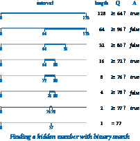
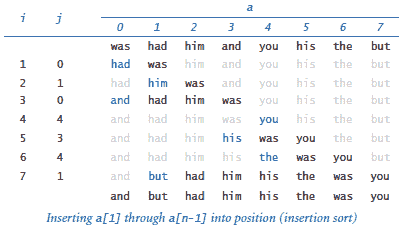
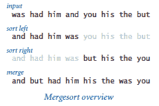
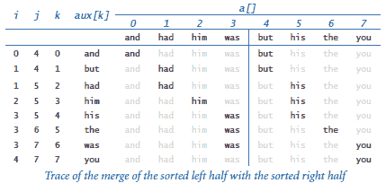
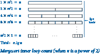

# 4.2 排序和搜索

> 原文：[`introcs.cs.princeton.edu/python/42sort`](https://introcs.cs.princeton.edu/python/42sort)

<title>排序和搜索</title>

排序问题是将一组项目按升序重新排列。它如此有用的一个原因是在排序列表中搜索比在未排序列表中搜索要容易得多。在本节中，我们将详细讨论两种经典的排序和搜索算法，以及它们的效率在几个关键应用中发挥作用的情况。

* * *

## 二分查找



在“二十个问题”游戏中，你的任务是猜测一个隐藏数字的值，该数字是 0 到*n*-1 之间的*n*个整数之一。（为简单起见，我们假设*n*是 2 的幂。）每次猜测时，你会被告知你的猜测是太高还是太低。一种有效的策略是维护一个包含隐藏数字的区间*lo*, *hi*)，猜测区间中间的数字，然后利用答案将区间大小减半。程序[questions.py 实现了这种策略，这是已知的一般问题解决方法*二分查找*的一个示例。

### 正确性证明。

首先，我们必须确信这种方法是正确的：它总是引导我们找到隐藏数字。我们通过建立以下事实来做到这一点：

+   区间始终包含隐藏数字。

+   区间大小是 2 的幂，从*n*减小。

这些事实是归纳证明方法运行如预期的基础。最终，区间大小变为 1，因此我们保证找到数字。

### 运行时间分析。

由于每次迭代间隔大小减少 2 倍（当*n*=1 时达到基本情况），二分查找的运行时间为 lg*n*。

### 线性对数鸿沟。

使用二分查找的替代方法是猜测 0，然后 1，然后 2，然后 3，依此类推，直到找到隐藏数字。我们将这样的算法称为*蛮力*算法：它似乎可以完成任务，但并不太关心成本（这可能会阻止它实际完成大问题的任务）。在这种情况下，蛮力算法的运行时间对输入值敏感，但如果输入值是随机选择的，则可能达到*n*，并且期望值为*n*/2。与此同时，二分查找保证不会超过 lg*n*步。

### 二进制表示。

如果你回顾一下 binary.py，你会发现二分查找几乎与将数字转换为二进制的计算相同！每次猜测确定答案的一个位。在我们的例子中，数字在 0 到 127 之间的信息表明其二进制表示中的位数为 7，第一个问题的答案（数字是否大于或等于 64？）告诉我们领先位的值，第二个问题的答案告诉我们下一个位的值，依此类推。例如，如果数字是 77，答案序列 true false, false, true, true, false, true 立即得到 77 的二进制表示 1001101。

### 反转函数。

作为科学计算中二分查找实用性的一个例子，我们重新讨论了在第 2.1 节练习中首次遇到的问题：反转一个递增函数。给定一个递增函数*f*和一个值*y*，以及一个开区间*lo*, *hi*)，我们的任务是找到区间内的一个值*x*，使得*f*(*x*) = *y*。在这种情况下，我们使用实数作为区间的端点，而不是整数，但我们使用了与猜测“二十个问题”问题中相同的基本方法：在每一步中将区间长度减半，保持*x*在区间内，直到区间足够小，我们可以在所需精度内确定*x*的值，这个精度作为函数的参数。这个图示了第一步。

> ![二分查找反转递增函数

程序 bisection.py 实现了这个策略。我们从一个已知包含*x*的区间(*lo*, *hi*)开始，并使用以下递归过程：

+   计算*mid* = (*hi* + *lo*) / 2。

+   *基本情况：*如果*hi* - *lo*小于δ，则将*mid*作为*x*的估计返回。

+   *递归步骤：*否则，测试*f*(*mid*) > *y*。如果是，查找(*lo*, *mid*)中的*x*；如果不是，查找(*mid*, *hi*)中的*x*。

这种方法的关键在于函数是递增的——对于任意值*a*和*b*，知道*f*(*a*) < *f*(*b*)告诉我们*a* < *b*，反之亦然。在这种情况下，二分查找通常被称为*二分查找*，因为我们在每个阶段将区间二等分。

### 在有序数组中进行二分查找。

在上个世纪的大部分时间里，人们会使用一种称为*字典*的出版物来查找单词的定义。条目按照一个标识它的键（单词）排序，以顺序出现。想想你会如何在字典中查找一个单词。一种蛮力的解决方案是从头开始，逐个检查每个条目，直到找到单词。没有人会使用这种方法：相反，你会打开字典的某个内部页面，然后在该页面上查找单词。如果找到了，你就完成了；否则，你要么排除当前页面之前的部分，要么排除当前页面之后的部分，并重复这个过程。

### 异常过滤器。

我们现在使用二分查找来解决*存在问题*：给定键是否在已排序键的数据库中？例如，在检查单词拼写时，你只需要知道你的单词是否在字典中，而不关心定义。在计算机搜索中，我们将信息保存在一个数组中，按照键的顺序排序。binarysearch.py 中的二分查找代码在两个细节上与我们的其他应用不同。首先，数组长度*n*不必是 2 的幂。其次，它必须允许所寻找的项不在数组中的可能性。客户程序实现了一个*异常过滤器*：它从文件中读取一个按照键排序的字符串列表，我们称之为*白名单*（例如，white.txt），以及从标准输入读取一系列任意字符串（例如，emails.txt），并将那些不在白名单中的字符串按顺序写入。

* * *

## 插入排序

二分查找要求数组已排序，并且排序有许多其他直接应用，因此我们现在转向排序算法。我们首先考虑一个蛮力算法，然后考虑一个可以用于大型数组的复杂算法。

我们考虑的蛮力算法称为*插入排序*。它基于人们经常用来整理扑克牌的简单方法——也就是，逐个考虑卡片并将每张卡片插入到已考虑的卡片中的适当位置（保持它们排序）。

程序 insertion.py 包含一个`sort()`函数的实现，模拟这个过程来对长度为`n`的数组`a[]`中的元素进行排序。测试客户端从标准输入读取所有字符串，将它们放入数组中，调用`sort()`函数对它们进行排序，然后将排序后的结果写入标准输出。尝试运行它来对小型 tiny.txt 文件进行排序。还尝试运行它来对更大的 tomsawyer.txt 文件进行排序，但要准备等待很长时间！

外部循环对数组中的前`i`个条目进行排序；内部循环可以通过将`a[i]`放入数组中的正确位置来完成排序。

> 

### 数学分析。

`sort()`函数包含一个嵌套在`for`循环中的`while`循环，这表明运行时间是二次的。然而，我们不能立即得出这个结论，因为`while`循环在`a[j]`大于或等于`a[j-1]`时终止。

+   *最佳情况.* 当输入数组已经按顺序排序时，内部循环仅仅是一个比较（学习`a[j-1]`小于或等于`a[j]`），因此总运行时间是线性的。

+   *最坏情况.* 当输入是逆序排序时，内部循环直到*j*等于 0 才终止。因此，内部循环中指令的执行频率为 1 + 2 + ... + *n*-1 ~ *n*²/2。

+   *平均情况.* 当输入是*随机*排序时，我们期望每个要插入的新元素等可能地落入任何位置，因此该元素平均向左移动一半。因此，我们期望运行时间为 1/2 + 2/2 + ... + (*n*-1)/2 ~ *n*²/2。

### 实证分析。

程序 timesort.py 实现了对排序函数的倍增测试。我们可以使用它来确认我们的假设，即插入排序对随机排序的文件是二次的：

```py
% python
>>> import insertion
>>> import timesort
>>> timesort.doublingTest(insertion.sort, 128, 100)
    128 3.67
    256 3.73
    512 4.21
   1024 4.19
   2048 4.11

```

### 对输入的敏感性。

请注意，timesort.py 中的`doublingTest()`函数接受参数`m`并为每个数组大小运行`m`个实验，而不仅仅是一个。这样做的一个原因是插入排序的运行时间对其输入值很敏感。直接预测插入排序的运行时间将是二次的是不正确的，因为您的应用可能涉及其运行时间为线性的输入。

### 可比较的键。

我们希望能够对具有自然顺序的任何类型的数据进行排序。令人高兴的是，我们的插入排序和二分查找函数不仅适用于字符串，还适用于任何可比较的数据类型。您可以通过实现对应于`==`、`!=`、`<`、`<=`、`>`和`>=`运算符的六个特殊方法来使用户定义的类型可比较。实际上，我们的插入排序和二分查找函数仅依赖于`<`运算符，但最好实现所有六个特殊方法。

* * *

## 归并排序



为了开发一个更快的排序算法，我们使用了*分而治之*的算法设计方法，每个程序员都需要理解这个术语。这个术语指的是解决问题的一种方法是*将*问题分解为独立的部分，独立*解决*它们，然后使用这些部分的解决方案来开发完整问题的解决方案。为了使用这种策略对数组进行排序，我们将其分成两半，独立对两半进行排序，然后合并结果以对整个数组进行排序。这种方法被称为*归并排序*。对于排序 alo, hi)，我们使用以下递归策略：

+   *基本情况*: 如果子数组大小为 0 或 1，则已经排序。

+   *递归步骤*: 否则，计算*mid* = (*hi* + *lo*)/2，对两个子数组*a*[*lo*, *mid*)和*a*[*mid*, *hi*)进行排序（递归），然后合并它们。

程序[merge.py 是一个实现。与 insert.py 一样，测试客户端从标准输入中读取所有字符串，将它们放入数组中，调用`sort()`函数对它们进行排序，然后将排序后的结果写入标准输出。尝试运行它来对小的 tiny.txt 文件和更大的 tomsawyer.txt 文件进行排序。

和往常一样，理解合并过程的最简单方法是研究合并过程中数组内容的跟踪。

> 

### 数学分析。

 归并排序的内部循环集中在辅助数组上。`for`循环涉及*n*次迭代，因此内部循环中指令的执行频率与递归函数的所有调用中子数组长度的总和成比例。当我们根据大小将调用排列在不同级别时，这个数量的值就出现了。为简单起见，假设*n*是 2 的幂，即*n* = 2^(*k*)。在第一级别上，我们有一个大小为*n*的调用；在第二级别上，我们有两个大小为*n*/2 的调用；在第三级别上，我们有四个大小为*n*/4 的调用；依此类推，直到最后一个大小为 2 的*n*/2 调用的级别。总共有*k* = lg *n*个级别，使得归并排序内部循环中指令的执行频率总共为*n* lg *n*。这个方程证明了归并排序的运行时间是线性对数的假设。

当*n*不是 2 的幂时，每个级别上的子数组不一定都是相同大小，但级别的数量仍然是对数的，因此对于所有*n*，线性对数的假设都是合理的。

### 实证分析。

我们可以运行程序 timesort.py 进行一个加倍测试，以确认我们的假设，即归并排序对于随机排序的文件具有*n* lg *n*的运行时间：

```py
% python
>>> import merge
>>> import timesort
>>> timesort.doublingTest(merge.sort, 128, 100)
    128 1.84
    256 2.15
    512 2.22
   1024 2.17
   2048 2.13
   4096 2.12
   8192 2.14

```

### 二次线性对数的鸿沟。

*n*²和*n* lg *n*之间的差异在实际应用中有很大差别。理解这种巨大差异是理解算法设计和分析的重要性的另一个关键步骤。对于许多重要的计算问题，从二次到线性对数的加速使得能否解决涉及大量数据的问题成为可能，而不是根本无法有效解决。

* * *

## Python 系统排序

Python 包括两种排序操作。内置`list`数据类型中的`sort()`方法将底层列表中的项目重新排列为升序，类似于`merge.sort()`。相比之下，内置函数`sorted()`不会改变底层列表；相反，它返回一个包含���升序排列的项目的新列表。右侧的这个交互式 Python 脚本演示了这两种技术。

```py
% python
>>> a = [3, 1, 4, 1, 5]
>>> b = sorted(a)
>>> a
[3, 1, 4, 1, 5]
>>> b
[1, 1, 3, 4, 5]
>>> a.sort()
>>> a
[1, 1, 3, 4, 5]
>>>

```

Python 系统排序使用归并排序的一个版本。它可能比 merge.py 快得多（10-20×），因为它使用了一个低级别的实现，而不是由 Python 组成的，从而避免了 Python 对自身施加的重大开销。与我们的排序实现一样，您可以使用系统排序与任何可比较的数据类型，例如 Python 的内置`str`、`int`和`float`数据类型。

* * *

## 应用：频率计数

程序 frequencycount.py 从标准输入读取一系列字符串，然后按照频率降序写入找到的不同值和每个值找到的次数的表格。我们通过两次排序来实现这一点。

### 计算频率。

我们的第一步是对标准输入中的字符串进行排序。在这种情况下，我们更感兴趣的不是字符串被排序，而是排序将相同的字符串放在一起。如果输入是

```py
to be or not to be to

```

那么排序的结果是

```py
be be not or to to to

```

将相同的字符串（如数组中的三个`to`出现）放在一起。现在，将所有相同的字符串放在数组中，我们可以通过数组进行单次遍历来计算所有频率。在第 3.3 节中定义的`Counter`类，是这项工作的完美工具。

### 对频率进行排序。

接下来，我们按频率对`Counter`对象进行排序。我们可以通过在`Counter`数据类型中增加六个比较方法来在客户端代码中这样做，以比较`Counter`对象的计数。因此，我们只需对`Counter`对象数组进行排序，以按频率升序重新排列它们！接着，我们反转数组，使元素按频率降序排列。最后，我们将每个`Counter`对象写入标准输出。

### 齐普夫定律。

frequencycount.py 中突出显示的应用是基本的语言分析：文本中哪些单词出现频率最高？一种被称为[齐普夫定律](http://en.wikipedia.org/wiki/Zipf's_law)的现象表明，文本中第*i*个最常见单词的频率与 1/*i*成比例。尝试在大型文件 leipzig100k.txt、leipzig200k.txt 和 leipzig1m.txt 上运行 frequencycount.py，观察这种现象。

* * *

#### 问与答

**Q.** 为什么我们需要如此费力地证明程序的正确性？

**A.** 为了避免自己遭受相当大的痛苦。二分查找是一个显著的例子。例如，现在你理解了二分查找；一个经典的编程练习是编写一个使用`while`循环而不是递归的版本。尝试在不回头查看书中代码的情况下解决本节的前三个练习。在一次著名的实验中，乔恩·本特利曾要求几位专业程序员这样做，他们大多数的解决方案都是不正确的。

**Q.** Python 提供了一个在`list`数据类型中定义的高效`sort()`方法，为什么要介绍归并排序算法？

**A.** 和我们学习过的许多主题一样，如果你了解它们背后的背景，就能更有效地使用这些工具。

**Q.** 在已经排序的数组上运行以下版本的插入排序的运行时间是多少？

```py
def sort(a):
    n = len(a)
    for i in range(1, n):
        for j in range(i, 0, -1):
            if a[j] < a[j-1]: exchange(a, j, j-1)
            else:             break

```

**A.** 在 Python 2 中为二次时间；在 Python 3 中为线性时间。原因是，在 Python 2 中，`range()`是一个返回整数数组的函数，其长度等于范围的长度（如果循环因`break`或`return`语句而提前终止，可能会浪费）。在 Python 3 中，`range()`返回一个迭代器，只生成所需的整数。

**Q.** 如果我尝试对不全是相同类型的元素数组进行排序会发生什么？

**A.** 如果元素是兼容类型（如`int`和`float`），一切都能正常工作。例如，混合数值类型根据其数值进行比较，因此 0 和 0.0 被视为相等。如果元素是不兼容类型（如`str`和`int`），那么 Python 3 在运行时会引发`TypeError`。Python 2 支持一些混合类型比较，使用类名确定哪个对象较小。例如，Python 2 将所有整数视为小于所有字符串，因为`'int'`在字典顺序上小于`'str'`。

**Q.** 在使用诸如`==`和`<`等运算符比较字符串时使用哪种顺序？

**A.** 非正式地，Python 使用 *字典顺序* 来比较两个字符串，就像书目录或字典中的单词一样。例如 `'hello'` 和 `'hello'` 相等，`'hello'` 和 `'goodbye'` 不相等，`'goodbye'` 小于 `'hello'`。更正式地，Python 首先比较每个字符串的第一个字符。如果这些字符不同，则整个字符串比较为这两个字符的比较。否则，Python 比较每个字符串的第二个字符。如果这些字符不同，则整个字符串比较为这两个字符的比较。以此类推，如果 Python 同时到达两个字符串的末尾，则认为它们相等。否则，它认为较短的字符串较小。Python 使用 Unicode 进行逐字符比较。我们列出了一些最重要的属性：

+   `'0'` 小于 `'1'`，依此类推。

+   `'A'` 小于 `'B'`，依此类推。

+   `'a'` 小于 `'b'`，依此类推。

+   十进制数字（`'0'` 到 `'9'`）小于大写字母（`'A'` 到 `'Z'`）。

+   大写字母（`'A'` 到 `'Z'`）小于小写字母（`'a'` 到 `'z'`）。

* * *

#### 练习

1.  开发一个实现 questions.py 的程序，将最大数 `n` 作为命令行参数（不必是 2 的幂）。证明你的实现是正确的。

1.  编写 binarysearch.py 的非递归版本。

1.  修改 binarysearch.py，使得如果搜索键在数组中，则返回最小的索引 `i`，使得 `a[i]` 等于 `key`，否则返回最大的索引 `i`，使得 `a[i]` 小于 `key`（如果不存在这样的索引则返回 `-1`）。

1.  描述将二分查找应用于无序数组会发生什么。为什么在每次调用二分查找之前不应检查数组是否已排序？你能检查二分查找检查的元素是否按升序排列吗？

1.  描述为什么在二分查找中使用不可变键是可取的。

1.  设 *f*() 是一个单调递增函数，满足 *f*(*a*) < 0 且 *f*(*b*) > 0。编写一个计算值 *x* 的程序，使得 *f*(*x*) = 0（在给定误差容限内）。

1.  在 insertion.py 中添加代码以生成上述轨迹。

1.  在 merge.py 中添加代码以生成上述轨迹。

1.  以上述示例的方式给出插入排序和归并排序的轨迹，输入为 `it was the best of times it was`。

1.  编写一个名为 `dedup.py` 的程序，从标准输入读取字符串，并将它们写入标准输出，删除所有重复项（并按排序顺序排列）。

1.  编写一个归并排序的版本，如 merge.py 中定义的那样，在每次递归调用 `_merge()` 中创建一个辅助数组，而不是仅在 `sort()` 中创建一个辅助数组并将其作为参数传递。这种改变对性能有什么影响？

1.  编写 merge.py 中定义的归并排序的非递归版本。

1.  找出你最喜欢的书中单词的频率分布。它是否遵循 Zipf 定律？

* * *

#### 创意练习

*以下练习旨在让您体验开发解决典型问题的快速解决方案。考虑使用二分查找、归并排序或设计自己的分治算法。实现并测试您的算法。*

1.  **中位数**。研究 `stdstats.py` 中的函数 `median()`。它以线性对数时间计算给定数字数组的中位数。请注意，它通过将问题简化为排序来工作。

1.  **众数**。在 `stdstats.py` 中添加一个函数 `mode()`，以线性对数时间计算一系列 *n* 个整数的众数（出现频率最高的值）。*提示*：简化��排序。

1.  **整数排序**。编写一个线性时间过滤器，从标准输入读取介于 0 和 99 之间的整数序列，并按排序顺序将整数写入标准输出。例如，给定输入序列

    ```py
    98 2 3 1 0 0 0 3 98 98 2 2 2 0 0 0 2

    ```

    你的程序应该输出序列

    ```py
    0 0 0 0 0 0 1 2 2 2 2 2 3 3 98 98 98

    ```

1.  **下界和上界**。给定一个已排序的 n 个可比较键的数组，编写`floor()`和`ceiling()`函数，以对数时间返回不大于（或不小于）参数键的最大（或最小）键的索引。

1.  **双峰最大值**。如果一个数组由一个递增序列的键紧接着一个递减序列的键组成，则该数组是双峰的。给定一个双峰数组，设计一个对数时间的算法来找到最大键的索引。

1.  **在双峰数组中搜索**。给定一个包含*n*个不同整数的双峰数组，设计一个对数时间的算法来确定给定整数是否在数组中。

1.  **最接近的一对**。给定一个*n*个浮点数的数组，编写一个函数，在线性对数时间内找到数值最接近的一对浮点数。

1.  **最远的一对**。给定一个*n*个浮点数的数组，编写一个函数，在线性时间内找到数值上最远的一对整数。

1.  **两数之和**。编写一个函数，该函数以*n*个整数数组作为参数，并在线性对数时间内确定是否有*两个*数相加等于 0。

1.  **三数之和**。编写一个函数，以*n*个整数数组作为参数，并确定是否有*三个*数相加等于 0。你的程序应该在时间上与*n*² log *n*成比例。*额外加分*：开发一个能在二次时间内解决问题的程序。

1.  **多数派**。给定一个包含*n*个元素的数组，如果一个元素出现超过*n*/2 次，则该元素是*多数派*。编写一个函数，将一个包含*n*个字符串的数组作为参数，并在线性时间内识别多数派（如果存在）。

1.  **公共元素**。编写一个函数，该函数以三个字符串数组作为参数，确定是否有任何一个字符串在这三个数组中都存在，并如果有，则返回其中一个字符串。你的函数的运行时间应该与字符串的总数成线性对数关系。

1.  **最大空闲区间**。给定*n*个请求文件的时间戳，找到在没有请求文件的最长时间间隔。编写一个程序，在线性对数时间内解决这个问题。

1.  **前缀自由编码**。在数据压缩中，如果一组字符串是*前缀自由*的，那么没有一个字符串是另一个字符串的前缀。例如，字符串集合`01`、`10`、`0010`和`1111`是前缀自由的，但字符串集合`01`、`10`、`0010`、`1010`不是前缀自由的，因为`10`是`1010`的前缀。编写一个程序，从标准输入中读取一组字符串，并确定该集合是否是前缀自由的。

1.  **分区**。编写一个函数，对已知最多有两个不同值的数组进行排序。*提示*：保持两个指针，一个从左端开始向右移动，另一个从右端开始向左移动。保持不变的是，左指针左侧的所有元素都等于两个值中较小的值，右指针右侧的所有元素都等于两个值中较大的值。

1.  **荷兰国旗**。编写一个函数，对已知最多有三个不同值的数组进行排序。（Edsgar Dijkstra 将这称为*荷兰国旗*问题，因为结果是三个值的“条纹”，就像国旗中的三条条纹一样。）*提示*：通过首先将数组分成两部分，第一部分中的所有元素具有最小值，第二部分中的所有其他元素，然后对第二部分进行分区，将问题简化为前一个问题。

1.  **快速排序**。编写一个递归程序，对一个随机排序的不同元素数组进行排序。*提示*：使用类似前一个练习中描述的方法。首先，将数组分成一个左部分，其中所有元素都小于*v*，然后是*v*，然后是一个右部分，其中所有元素都大于*v*。然后，递归地对这两部分进行排序。*额外加分*：修改你的方法（如果需要），使其在元素不一定不同的情况下也能正常工作。

1.  **反向域名**。编写一个程序，从标准输入中读取域名列表，并按排序顺序写出反向域名。例如，`cs.princeton.edu`的反向域名是`edu.princeton.cs`。这种计算对于网络日志分析很有用。为此，创建一个实现特殊比较方法的数据类型`Domain`，使用反向域名顺序。

1.  **数组中的局部最小值**。给定一个包含*n*个浮点数的数组，编写一个函数以对数时间找到一个*局部最小值*（一个索引`i`，满足`a[i] < a[i-1]`且`a[i] < a[i+1]`）。

1.  **离散分布**。设计一个快速算法，重复地从离散分布中生成数字。给定一个非负浮点数数组`p[]`，其总和为 1，目标是以概率`p[i]`返回索引`i`。形成一个累积和数组`s[]`，使得`s[i]`是`p[]`的前`i`个元素的和。现在，生成一个介于 0 和 1 之间的随机浮点数`r`，并使用二分查找返回索引`i`，满足`s[i] ≤ r < s[i+1]`。

1.  **押韵单词**。制表一个列表，您可以使用它来查找押韵的单词。使用以下方法：

    +   将单词字典读入字符串数组中。

    +   反转每个单词中的字母（例如，`confound`变为`dnuofnoc`）。

    +   对结果数组进行排序。

    +   将每个单词中的字母恢复到原始顺序。

    例如，`confound`在结果列表中与`astound`和`surround`等单词相邻。
