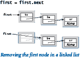

# 4.3 栈和队列

> 原文：[`introcs.cs.princeton.edu/python/43stack`](https://introcs.cs.princeton.edu/python/43stack)

<title>4.3 栈和队列</title>

在本节中，我们介绍了两种密切相关的数据类型，用于操作任意大的对象集合：*栈*和*队列*。每种类型都由两个基本操作定义：*插入*一个新项和*移除*一个项。当我们插入一个项时，我们的意图是明确的。但当我们移除一个项时，我们应该选择哪一个？队列使用的规则是始终移除在集合中存在时间*最长*的项。这个策略被称为*先进先出*或*FIFO*。栈使用的规则是始终移除在集合中存在时间*最短*的项。这个策略被称为*后进先出*或*LIFO*。

* * *

## 推入栈


一个*推入栈*（或简称*栈*）是基于后进先出（LIFO）策略的集合。当你点击一个超链接时，你的浏览器会显示新页面（并将其插入到栈中）。你可以继续点击超链接访问新页面。你可以通过点击返回按钮（从栈中移除）来重新访问上一页。推入栈提供了你期望的行���。

按照传统，我们将栈的*插入*操作称为*push*，将栈的*移除*操作称为*pop*。我们还包括一个方法来测试栈是否为空。以下 API 总结了这些操作：

> 

* * *

## Python 列表（调整大小数组）实现的栈

用 Python 列表表示栈是一个自然的想法，但在继续阅读之前，值得你花一点时间考虑如何实现。


自然地，你需要一个实例变量`a[]`来在 Python 列表中保存栈项。为了效率，我们按照插入顺序存储项，因为在 Python 列表的末尾插入和删除每次操作都需要恒定的摊销时间（而在开头插入和删除每次操作都需要线性时间）。

我们几乎无法希望有比 arraystack.py 更简单的栈 API 实现了 — 所有的方法都是一行代码！实例变量是一个 Python 列表`_a[]`，按照插入顺序保存栈中的项。要推入一个项，我们使用`+=`运算符将其附加到列表的末尾；要弹出一个项，我们调用`pop()`方法，它会从列表的末尾移除并返回该项；要确定栈的大小，我们调用内置的`len()`函数。这些操作保持以下属性：

+   栈包含`len(_a)`项。

+   当`len(_a)`为 0 时，栈为空。

+   列表`_a[]`包含栈项，按照插入顺序排列。

+   栈中最近插入的项（如果非空）是`_a[len(_a) - 1]`。

arraystack.py 中的测试客户端允许使用任意序列的操作进行测试：对于标准输入中的每个字符串，它执行一个`push()`操作，除了由减号组成的字符串，对于该字符串，它执行一个`pop()`操作。右侧的图表是测试文件 tobe.txt 的跟踪。

> 

这种实现的主要特点是它使用的空间与栈中的项数成线性关系，并且*推入和弹出操作需要恒定的摊销时间*。

* * *

## 使用链表实现的栈

接下来，我们考虑一种完全不同的实现栈的方式，使用一种称为*链表*的基本数据结构。在这里重复使用“列表”这个词有点令人困惑，但我们别无选择 — 链表比 Python 存在的时间更长。

链表是一种递归数据结构，定义如下：它要么为空（null），要么是一个指向具有指向链表的节点的引用。在这个定义中，节点是一个抽象实体，除了表征其在构建链表中的角色的节点引用外，还可能包含任何类型的数据。

利用面向对象编程，实现链表并不困难。我们从节点抽象的类开始：

```py
class Node:
    def __init__(self, item, next):
        self.item = item 
        self.next = next

```

类型为`Node`的对象有两个实例变量：`item`（指向一个项目的引用）和`next`（指向另一个`Node`对象的引用）。`next`实例变量表征了数据结构的链式特性。为了强调我们只是使用`Node`类来组织数据，我们除了构造函数外不定义任何方法。我们还从实例变量的名称中省略了前导下划线，这表明允许外部代码（但仍在我们的 Stack 实现内部）访问这些实例变量。

现在，根据递归定义，我们可以用一个指向`Node`对象的引用来表示一个链表，该对象包含一个指向项目的引用和另一个`Node`对象的引用，该对象包含一个指向项目的引用和另一个`Node`对象的引用，依此类推。链表中的最后一个`Node`对象必须指示它确实是最后一个 Node 对象。在 Python 中，我们通过将最后一个`Node`对象的`next`实例变量赋值为`None`来实现这一点。请记住，`None`是 Python 的一个关键字 — 赋值为`None`的变量不引用任何对象。


例如，要构建一个包含项目`'to'`、`'be'`和`'or'`的链表，我们执行以下代码：

```py
third  = Node('or', None)
second = Node('be', third)
first  = Node('to', second)

```

为了简洁起见，我们使用术语*link*来指代`Node`引用。为了简单起见，当项目是一个字符串时（如我们的示例中），我们将其放在节点矩形内（而不是使用更准确的表达方式，即节点持有对外部字符串对象的引用）。这种视觉表示让我们可以专注于链接。



假设你想要从���表中*删除*第一个节点。这个操作很简单：只需将`first`赋值为`first.next`。通常，在执行此赋值之前，你会先检索项目（通过将其赋值给某个变量），因为一旦更改变量`first`，你可能会失去对先前引用的节点的任何访问权限。通常，`Node`对象变成孤立的，Python 的内存管理系统最终会回收它。


现在，假设你想要在链表中*插入*一个新节点。最容易的地方是在链表的开头插入。例如，要在第一个节点为`first`的给定链表中的开头插入字符串`'not'`，我们将`first`保存在变量`oldFirst`中；创建一个新的`Node`，其`item`实例变量为`'not'`，`next`实例变量为`oldFirst`；然后将`first`指向该新的`Node`。

这两个操作的时间复杂度是常数时间；它们的效率与链表的长度无关。

### 使用链表实现栈。

 程序 linkedstack.py 使用链表来实现栈。该实现基于一个私有的`_Node`类，该类与我们一直在使用的`Node`类相同。我们将该类设为私有，因为`Stack`数据类型的客户端不需要知道链表的任何细节。通常，我们给类名加上前导下划线以强调`Stack`客户端不应直接访问`_Node`类。

### 链表遍历。

许多链表应用需要遍历链表中的项目。为此，我们首先初始化一个循环索引变量`cur`，引用链表的第一个`Node`。接下来，我们通过访问`cur.item`获取与`cur`关联的项目，然后更新`cur`以引用链表中的下一个`Node`，将`cur.next`的值赋给它，并重复此过程，直到`cur`为`None`（表示已到达链表的末尾）。这个过程称为*遍历列表*。在 linkedstack.py 中定义的`__str__()`方法执行列表遍历。

对于栈来说，链表很重要，因为它们允许我们在最坏情况下以常数时间实现`push()`和`pop()`方法，同时仅使用很小的额外空间常数因子（用于链接）。然而，Python 程序员通常更喜欢 Python 列表（调整大小的数组），主要是因为用户定义类型（如我们的链表`Node`）的 Python 开销很大。

* * *

## 栈应用

推入栈在计算中起着至关重要的作用。一些示例进行说明。

### 算术表达式。

在第一章中考虑的一些最初的程序涉及计算类似于这样的算术表达式的值：

```py
( 1 + ( ( 2 + 3 ) * ( 4 * 5 ) ) )

```

Python 如何进行这种计算？我们可以通过编写一个 Python 程序来解决基本思想，该程序可以接受字符串作为输入（表达式）并将表达式表示的数字作为输出。为简单起见，我们从以下明确的递归定义开始：算术表达式是一个数字或一个左括号，后跟一个算术表达式，后跟一个运算符，后跟另一个算术表达式，后跟一个右括号。为简单起见，此定义适用于完全括号化的算术表达式，其中明确指定了哪些运算符适用于哪些操作数。为了具体性，我们支持熟悉的二元运算符*、+和-，以及一个仅接受一个参数的平方根运算符`sqrt`。

### 算术表达式求值。

我们如何将算术表达式（一串字符）转换为它表示的值？Edsgar Dijkstra 在 1960 年代开发的一个非常简单的算法使用两个推入栈（一个用于操作数，一个用于运算符）来执行此任务。表达式由括号、运算符和操作数（数字）组成。从左到右进行，并逐个处理这些实体，我们根据四种可能情况操作栈，如下所示：

+   将*操作数*推送到操作数栈上。

+   将*运算符*推送到运算符栈上。

+   忽略*左*括号。

+   遇到*右*括号时，弹出一个运算符，弹出所需数量的操作数，并将将该运算符应用于这些操作数的结果推送到操作数栈上。

处理完最后一个右括号后，栈上有一个值，即表达式的值。程序 evaluate.py 是此算法的实现。尝试使用 expression1.txt 和 expression2.txt 运行它。

### 基于栈的编程语言。

令人惊讶的是，Dijkstra 的双栈算法也计算出与我们示例中此表达式相同的值：

```py
( 1 ( ( 2 3 + ) ( 4 5 * ) * ) + )

```

换句话说，我们可以将每个运算符放在其两个操作数之后，而不是在它们之间。在这种表达式中，每个右括号紧跟在一个运算符后面，因此我们可以忽略这两种括号，将表达式写成如下形式：

```py
1 2 3 + 4 5 * * +

```

这种表示法称为*逆波兰表示法*，或*后缀*。要评估后缀表达式，我们使用一个栈。从左到右进行，逐个处理这些实体，我们根据只有两种可能情况操作栈：

+   将操作数推送到操作数栈上。

+   遇到运算符时，弹出所需数量的操作数，并将应用运算符到这些操作数的结果推送到操作数栈上。

再次，这个过程在栈上留下一个值，这个值是表达式的值。这种表示方法是如此简单，以至于一些编程语言，比如 Forth（一种科学编程语言）和 PostScript（一种用于大多数打印机的页面描述语言）使用显式栈。

### 函数调用抽象。

当控制流进入函数时，Python 会在可能已经存在的其他变量之上创建函数的参数变量。随着函数的执行，Python 会创建函数的局部变量 — 再次在可能已经存在的其他变量之上。当控制流从函数返回时，Python 会销毁该函数的局部和参数变量。从这个意义上说，Python 以类似栈的方式创建和销毁参数和局部变量。事实上，大多数程序隐式使用栈，因为它们支持实现函数调用的自然方式

* * *

## FIFO 队列

一个 FIFO 队列（或者只是一个队列）是基于先进先出（FIFO）策略的集合。队列是如此多日常现象的自然模型，以至于在计算机出现之前就已经详细研究了它们的属性。

和往常一样，我们首先明确 API。再次按照传统，我们将队列插入操作命名为*enqueue*，将移除操作命名为*dequeue*，如下所示的 API。

> 

应用我们从栈中学到的知识，我们可以使用 Python 列表（调整大小的数组）或链表来开发实现，其中操作需要常数时间，与队列中的元素数量一起增长和缩小的内存。

### 链表实现。

要使用链表实现队列，我们按照它们到达的顺序保留项目（与我们在 linkedstack.py 中使用的顺序相反）。`dequeue()`的实现与 linkedstack.py 中的`pop()`实现相同（保存第一个节点中的项目，从队列中移除第一个节点，并返回保存的项目）。然而，实现`enqueue()`会更具挑战性：我们如何将一个节点添加到链表的末尾？为此，我们需要一个链接到链表中最后一个节点的链接，因为该节点的链接必须更改为引用包含要插入的项目的新节点。因此，我们维护第二个实例变量，它始终引用链表中的最后一个节点。

程序 linkedqueue.py 是一个`Queue`的链表实现，具有与`Stack`相同的性能特性：所有方法都是常数时间操作，并且空间使用量与队列中的项目数量成线性关系。

### 调整大小的数组实现。

也可以开发一个基于显式��整大小数组表示的 FIFO 队列实现，其性能特征与我们在 arraystack.py 中为栈开发的性能特征相同。这种实现是一个值得的经典编程练习，鼓励您在本节末尾的练习中进一步探索。可能会诱人地使用 Python `list`方法的一行调用，就像在 arraystack.py 中一样。然而，在 Python 列表的前端插入或删除项目的方法不符合要求，因为它们需要线性时间。

### 随机队列。

尽管它们具有广泛的适用性，但 FIFO 和 LIFO 规则并非神圣不可侵犯。考虑其他规则来移除项目是完全有道理的。其中最重要的之一是考虑一个数据类型，其中`dequeue()`移除一个*随机*项目（无替换抽样），而`sample()`返回一个随机项目而不从队列中移除它（有替换抽样）。这些操作在许多应用中被精确调用，其中一些我们已经考虑过，从第 1.4 节开始，例如 sample.py。使用 Python 列表（调整大小的数组）表示，实现`sample()`是直接的，我们可以使用与 sample.py 相同的思路来实现`dequeue()`（在删除之前将一个随机项目与最后一个项目交��）。我们使用名称`RandomQueue`来引用这种数据类型（请参阅本节末尾的“随机队列”创意练习）。

* * *

## 队列应用

在过去的一个世纪里，先进先出队列被证明是准确和有用的模型，在各种应用中广泛使用。一个被称为*排队理论*的数学领域已被广泛成功地用于帮助理解和控制各种复杂系统。理解和控制这样一个复杂系统涉及对队列抽象的坚实实现，应用排队理论的数学结果以及涉及两者的模拟研究。接下来我们考虑一个经典示例，以了解这个过程的味道。

### M/M/1 队列。

最重要的排队模型之一被称为*M/M/1 队列*，已被证明可以准确地模拟许多现实情况，例如一条汽车排队进入收费站或患者进入急诊室。 *M*代表*马尔可夫*或*无记忆*，表示到达和服务都是*泊松过程*：到达时间和服务时间都服从指数分布（参见练习 2.2.12），而 1 表示只有一个服务器。 M/M/1 队列由到达率λ（例如，每分钟到达收费站的汽车数量）和服务率μ（例如，每分钟可以通过收费站的汽车数量）参数化，并具有三个特性：

+   有一个服务器 — 先进先出队列。

+   进入队列的到达时间服从每分钟率为λ的指数分布。

+   非空队列的服务时间服从每分钟率为μ的指数分布。

到达之间的平均时间为 1/λ分钟，服务之间的平均时间（当队列非空时）为 1/μ分钟。因此，除非μ > λ，否则队列将无限增长；否则，顾客将以有趣的动态过程进入和离开队列。

在实际应用中，人们对参数λ和μ对队列各种属性的影响感兴趣。对于 M/M/1 队列，已知系统中平均顾客数*L*为λ / (μ - λ)，顾客在系统中平均等待时间*W*为 1 / (μ - λ)。这些公式证实，当λ接近μ时，等待时间（和队列长度）会无限增长。它们还遵守一个被称为[利特尔定律](https://en.wikipedia.org/wiki/Little%27s_law)的一般规则：系统中平均顾客数是λ乘以顾客在系统中平均等待时间（*L* - λ*W*）对于许多类型的队列。

程序 mm1queue.py 是一个`Queue`客户端，您可以使用它来验证这些数学结果。这是一个*基于事件的模拟*的简单示例：我们生成在特定时间发生的*事件*，并相应地调整我们的数据结构以进行事件，模拟它们发生时发生的情况。有关详细信息，请参阅教科书。从实际角度来看，您可以通过运行 mm1queue.py 来发现参数λ和μ的各种值时，过程的最重要特征之一是，当服务速率接近到达速率时，顾客在系统中的平均停留时间（以及系统中的平均顾客数量）可能会急剧增加。

> | `% python mm1queue.py .167 .25` | `% python mm1queue.py .167 .20` |
> | --- | --- |
> |  |  |

### 资源分配。

一个*资源共享系统*涉及大量松散合作的服务器，它们希望共享资源。每个服务器同意维护一个用于共享的项目队列，一个中央机构将项目分发给服务器（并告知用户它们可以在哪里找到）。我们将考虑中央机构可能用来分发项目的程序类型，忽略从系统中删除项目的动态，添加和删除服务器等等。

中央机构通常使用*随机*策略，其中分配基于随机选择。一个更好的策略是选择一组服务器的随机样本，并将新项目分配给具有最少项目数量的服务器。但我们应该取多大的样本呢？

程序 loadbalance.py 是一个采样策略的模拟，我们可以用来研究这个问题。这个程序很好地利用了`RandomQueue`数据类型（请参阅本节末尾的“随机队列”创意练习），提供了一个易于理解的程序，我们可以用来进行实验。该模拟维护一个随机队列的队列，并围绕一个内部循环构建计算，在该循环中，每个新的服务请求都放在一个队列样本中最小的队列上，使用`RandomQueue`的`sample()`方法随机抽样队列。令人惊讶的最终结果是，大小为 2 的样本导致几乎完美的平衡，因此没有必要进行更大的样本。

> | `% python loadbalance.py 50 500 1` | `% python loadbalance.py 50 500 2` |
> | --- | --- |
> |  |  |

* * *

#### 问答

**Q.** 何时应该调用`_Node`构造函数？

**A.** 就像任何其他类一样，当你想要创建一个新的`_Node`对象（链表中的新节点）时，应该调用`_Node`构造函数。你不应该用它来创建对现有`_Node`对象的新引用。例如，下面的代码

```py
oldfirst = _Node(item, next)
oldfirst = first

```

创建一个新的`_Node`对象，然后立即失去对它唯一引用的跟踪。这段代码不会导致错误，但是没有理由创建孤立的对象有点凌乱。

**Q.** 为什么不将`Node`定义为一个独立的类，在名为`node.py`的单独文件中？

**A.** 通过在 linkedstack.py 或 linkedqueue.py 中定义`_Node`，并以下划线开头的名称，我们鼓励`Stack`或`Queue`类的客户端不直接使用`_Node`类。我们的意图是，`_Node`对象仅���linkedstack.py 或 linkedqueue.py 实现中使用，而不在其他客户端中使用。

**Q.** 客户是否允许将项目`None`插入堆栈或队列？

**A.** 在 Python 中实现集合时，这个问题经常出现。我们的实现允许插入任何对象，包括`None`。

**Q.** 是否有用于栈和队列的标准 Python 模块？

**A.** 实际上并没有。正如本节前面提到的，Python 内置的`list`数据类型具有使得使用列表轻松实现栈的操作。但`list`数据类型还需要许多额外的方法，这些方法通常与栈不相关，比如索引访问和删除任意项目。将自己限制在我们需要的操作集合（仅限于这些操作）的优势在于，它使���更容易开发一个可以为这些操作提供最佳性能保证的实现。Python 还包括一个名为`collections.deque`的数据类型，它实现了一个可变序列，具有向前或向后高效插入和删除的功能。

**Q.** 为什么不使用一个单一的数据类型来实现插入项目、删除最近插入的项目、删除最近插入的项目、删除随机项目、遍历项目、返回集合中项目数量以及我们可能需要的其他操作的方法？然后我们可以将它们全部实现在一个类中，可以被许多客户端使用。

ts。

**A.** 这是一个*宽接口*的示例，正如我们在第 3.3 节中指出的那样，应该避免使用。正如刚才提到的，避免使用宽接口的一个原因是很难构建对所有操作都有效率的实现。更重要的原因是窄接口对程序施加了一定的纪律，使客户端代码更容易理解。如果一个客户端使用`Stack`，另一个使用`Queue`，我们可以很好地了解到 LIFO 纪律对第一个客户端很重要，而 FIFO 纪律对第二个客户端很重要。另一种方法是使用继承来尝试封装所有集合共有的操作。然而，这样的实现最好留给专家，而任何程序员都可以学会构建`Stack`和`Queue`等实现。

**Q.** 是否有办法编写一个客户端，同时在同一个程序中使用 arraystack.py 和 linkedstack.py？

**A.** 是的，最简单的方法是在`import`语句中添加一个`as`子句，如下所示。实际上，这种类型的`import`语句为类的名称创建了一个别名，然后你的代码可以使用该别名而不是类的名称。

```py
from arraystack  import Stack as ArrayStack
from linkedstack import Stack as LinkedStack
...
stack1 = ArrayStack()
stack2 = LinkedStack()

```

* * *

#### 练习

1.  给出 arraystack.py 对以下输入的输出：

    ```py
    it was - the best - of times - - - it was - the - -

    ```

1.  给出 arraystack.py 在以下输入的每个操作后的数组内容和长度：

    ```py
    it was - the best - of times - - - it was - the - -

    ```

1.  假设一个客户端在`Stack`上执行一系列交错的*push*和*pop*操作。push 操作按顺序将整数 0 到 9 放入栈中；pop 操作写入返回值。以下哪个序列可能不会发生？

    > 1.  `4 3 2 1 0 9 8 7 6 5`
    > 1.  
    > 1.  `4 6 8 7 5 3 2 9 0 1`
    > 1.  
    > 1.  `2 5 6 7 4 8 9 3 1 0`
    > 1.  
    > 1.  `4 3 2 1 0 5 6 7 8 9`
    > 1.  
    > 1.  `1 2 3 4 5 6 9 8 7 0`
    > 1.  
    > 1.  `0 4 6 5 3 8 1 7 2 9`
    > 1.  
    > 1.  `1 4 7 9 8 6 5 3 0 2`
    > 1.  
    > 1.  `2 1 4 3 6 5 8 7 9 0`

1.  编写一个名为`reverse.py`的栈客户端，从标准输入读取字符串，并以相反顺序写入标准输出。编写一个名为`parentheses.py`的栈客户端，从标准输入读取文本流，并使用栈来确定其括号是否正确平衡。例如，你的程序应该对`[()]{}{[()()]()}`写入`True`，对`[(])`写入`False`。

1.  在 linkedstack.py 的`Stack`类中添加方法`__len__()`。

1.  在 arraystack.py 的`Stack`类中添加一个名为`peek()`的方法，该方法返回栈上最近插入的项目（不弹出）。

1.  当`n`为 50 时，以下代码片段会写入什么？为给定的正整数`n`提供代码片段的高级描述。

    ```py
    stack = Stack()
    while n > 0:
        stack.push(n % 2)
        n /= 2
    while not stack.isEmpty():
        stdio.write(stack.pop())
    stdio.writeln()

    ```

    *解决方案*：它写出`n`的二进制表示（当`n`为 50 时为`110010`）。

1.  以下代码片段对队列`queue`做了什么？

    ```py
    stack = Stack()
    while not queue.isEmpty(): stack.push(queue.dequeue())
    while not stack.isEmpty(): queue.enqueue(stack.pop())

    ```

1.  为介绍本节中链表的三节点示例绘制一个对象级别的跟踪图。

1.  编写一个程序，从标准输入接收一个没有左括号的表达式，并将插入了等效中缀表达式的括号的结果写入。例如，给定输入

    ```py
    1 + 2 ) * 3 - 4 ) * 5 - 6 ) ) )

    ```

    您的程序应该写

    ```py
    ( ( 1 + 2 ) * ( ( 3 - 4 ) * ( 5 - 6 ) )

    ```

1.  编写一个过滤器`infixtopostfix.py`，将完全括号化的中缀算术表达式从中缀转换为后缀。

1.  编写一个程序`evaluatepostfix.py`，从标准输入读取后缀表达式，对其进行评估，并将值写入标准输出。（将上一个练习的程序输出通过管道传递给此程序，可以实现与 evaluate.py 相同的行为。）

1.  假设客户端对`Queue`执行一系列交错的*enqueue*和*dequeue*操作。*enqueue*操作按顺序将整数 0 到 9 放入队列；*dequeue*操作写入返回值。以下序列中哪个序列不能发生？

    > 1.  `0 1 2 3 4 5 6 7 8 9`
    > 1.  
    > 1.  `4 6 8 7 5 3 2 9 0 1`
    > 1.  
    > 1.  `2 5 6 7 4 8 9 3 1 0`
    > 1.  
    > 1.  `4 3 2 1 0 5 6 7 8 9`

1.  编写一个`Queue`客户端，它接受一个命令行参数`k`，并将从标准输入中找到的倒数第`k`个字符串写入。

1.  给出以下`Queue`类中每个操作的运行时间，其中最近插入的项位于`_a[0]`。

    ```py
    class Queue:
        def __init__(self):      self._a = []
        def isEmpty(self):       return len(self._a) == 0
        def __len__(self):       return len(self._a)
        def enqueue(self, item): self._a += [item]
        def dequeue(self):       return self._a.pop(0)

    ```

1.  给出以下`Queue`类中每个操作的运行时间，其中最近插入的项位于`_a[0]`。

    ```py
    class Queue:
        def __init__(self):      self._a = []
        def isEmpty(self):       return len(self._a) == 0
        def __len__(self):       return len(self._a)
        def enqueue(self, item): self._a.insert(0, item)
        def dequeue(self):       return self._a.pop()

    ```

1.  修改 mm1queue.py 以创建一个程序`md1queue.py`，该程序模拟服务时间固定（确定性）为速率μ的队列。通过这个模型经验性地验证 Little's 定律。

* * *

#### 链表练习

*以下练习旨在让您熟练处理链表。解决它们的最简单方法是使用文本中描述的可视化表示法进行绘图。*

1.  假设`x`是一个链表节点。以下代码片段的效果是什么��

    ```py
    x.next = x.next.next

    ```

    *解决方案*：删除列表中紧随`x`之后的节点。

1.  编写一个函数`find()`，它以链表中的第一个节点和对象`key`作为参数，并在列表中的某个节点的项字段为`key`时返回`True`，否则返回`False`。

1.  编写一个函数`delete()`，它以链表中的第一个节点和整数`k`作为参数，并删除链表中的第`k`个元素（如果存在）。

1.  假设`x`是一个链表节点。以下代码片段的效果是什么？

    ```py
    t.next = x.next
    x.next = t

    ```

    *解决方案*：在节点`x`之后立即插入节点`t`。

1.  为什么以下代码片段的效果与上一个问题中的代码片段不同？

    ```py
    x.next = t
    t.next = x.next

    ```

    *解决方案*：当更新`t.next`时，`x.next`不再是跟在`x`后面的原始节点，而是`t`本身！

1.  编写一个函数`removeAfter()`，它以链表节点作为参数，并删除给定节点后面的节点（如果参数或参数节点中的下一个字段为`None`，则不执行任何操作）。

1.  编写一个函数`copy()`，它以一个链表节点作为参数，并创建一个具有相同项目序列的新链表，而不破坏原始链表。

1.  编写一个函数`remove()`，它以链表节点和对象项作为参数，并删除列表中每个项目为项的节点。

1.  编写一个函数`listmax()`，它以链表中的第一个节点作为参数，并返回列表中最大项目的值。假设项目是可比较的，并且如果列表为空，则返回`None`。

1.  开发一个递归解决方案来回答上一个问题。

1.  编写一个函数，它以链表中的第一个节点作为参数，并反转列表，返回结果中的第一个节点。

    *迭代解决方案*：为了完成这个任务，我们在链表中保持对三个连续节点的引用：`reverse`、`first`和`second`。在每次迭代中，我们从原始链表中提取节点`first`，并将其插入到反转列表的开头。我们保持不变的是`first`是原始列表剩余部分的第一个节点，`second`是原始列表剩余部分的第二个节点，`reverse`是结果反转列表的第一个节点。

    ```py
    def reverse(first):    
        reverse = None
        while first is not None:
            second = first.next
            first.next = reverse
            reverse = first
            first = second
        return reverse

    ```

    在编写涉及链表的代码时，我们必须始终小心处理异常情况（当链表为空时，当列表只有一个或两个节点时）和边界情况（处理第一个或最后一个项目）。这通常比处理正常情��要困难得多。

1.  编写一个递归函数，以相反的顺序写出链表的元素。不要修改任何链接。*简单*：使用二次时间，常数额外空间。*同样简单*：使用线性时间，线性额外空间。*不那么简单*：开发一个分治算法，其时间复杂度为线性对数级，使用对数额外空间。

    *二次时间，常数空间解决方案*：我们递归地反转从第二个节点开始的列表部分，然后小心地将第一个元素附加到末尾。

    ```py
    def reverse(first):
        if first is None:
            return None
        if first.next is None:
            return first
        second = first.next
        rest = reverse(second)
        second.next = first
        first.next = None
        return rest

    ```

1.  编写一个递归函数，通过修改链接来随机洗牌链表的元素。*简单*：使用二次时间，常数额外空间。*不那么简单*：开发一个分治算法，其时间复杂度为线性对数级，使用对数额外内存。对于“合并”步骤，请参见第 1.4 节末尾的“Riffle shuffle”创意练习。

* * *

#### 创意练习

1.  **Deque.** 双端队列或*deque*（发音为“deck”）是栈和队列的结合体。编写一个使用链表实现此 API 的类`Deque`：

    > 

1.  **Josephus 问题。** 在古代的 Josephus 问题中，*n*个人处于困境，并同意采取以下策略来减少人口。他们排成一个圆圈（位置编号从 0 到*n*-1），并沿着圆圈进行，每隔*m*个人就淘汰一个人，直到只剩下一个人为止。传说中 Josephus 找到了一个位置，可以避免被淘汰。编写一个`Queue`客户端`josephus.py`，从命令行获取*n*和*m*，并写出人们被淘汰的顺序（从而向 Josephus 展示在圆圈中应该坐在哪里）。

    ```py
    % python josephus.py 7 2
    1 3 5 0 4 2 6

    ```

1.  **合并两个排序队列。** 给定两个按升序排列的队列，将所有字符串移动到第三个队列中，使得第三个队列中的字符串按升序排列。

1.  **非递归归并排序。** 给定*n*个字符串，创建*n*个队列，每个队列包含一个字符串。创建一个包含*n*个队列的队列。然后，重复应用排序合并操作到前两个队列，并将合并后的队列重新插入到末尾。重复此过程，直到队列中只剩下一个队列。

1.  **删除第 i 个元素。** 实现一个支持以下 API 的类：

    > 

    首先，开发一个使用 Python 列表（调整大小的数组）实现的方法，然后开发一个使用链表实现的方法。（查看第 4.4 节末尾的“广义队列”创意练习，以获得使用二叉搜索树的更有效实现。）

1.  **使用两个栈实现队列。** 展示如何使用两个栈（仅使用恒定额外内存）实现队列，以便每个队列操作使用恒定的摊销栈操作次数。

1.  **环形缓冲区。** 环形缓冲区，或循环队列，是一个固定容量为*n*的 FIFO 数据结构。它对于在异步进程之间传输数据或存储日志文件非常有用。当缓冲区为空时，消费者等待直到数据被存入；当缓冲区满时，生产者等待存入数据。为环形缓冲区开发一个 API，并使用数组表示（带有循环环绕）的实现。

1.  **移至前端。** 从标准输入读取一系列字符，并在不重复的情况下将字符维护在一个链表中。当读取到以前未见过的字符时，在列表的前面插入它。当读取到重复的字符时，从列表中删除它并重新插入到开头。将你的程序命名为`movetofront.py`：它实现了众所周知的*移至前端*策略，这对于缓存、数据压缩以及许多其他应用程序非常有用，其中最近访问的项目更有可能被重新访问。

1.  **随机队列。** 随机队列按照以下 API 存储一组项目：

    > 

    编写一个实现此 API 的类`RandomQueue`。*提示*：使用 Python 列表（调整大小的数组）表示，就像 arraystack.py 中一样。要删除一个项目，将一个随机位置（从 0 到*n*-1 索引）的项目与最后一个位置（索引*n*-1）的项目交换。然后删除并返回最后一个对象。编写一个客户端，使用`RandomQueue`以随机顺序写入一副卡牌。

    *解决方案*：参见 randomqueue.py。

1.  **拓扑排序。** 你需要对服务器上编号从 0 到`n`-1 的`n`个作业的顺序进行排序。有些作业必须在其他作业开始之前完成。编写一个程序`topologicalsorter.py`，它接受`n`作为命令行参数，并在标准输入上接受作业`i j`的有序对序列，然后写入一系列整数，使得对于输入中的每对`i j`，作业`i`出现在作业`j`之前。使用以下算法：首先，从输入中为每个作业构建（1）必须在其后执行的作业的队列和（2）其入度（必须在其之前执行的作业数）。然后，构建一个所有入度为 0 的节点的队列，并重复删除一些入度为零的作业，同时维护所有数据结构。这个过程有许多应用；例如，你可以用它来模拟专业课程的先修课程，以便找到一系列要修的课程，以便毕业。

1.  **文本编辑器缓冲区。** 为文本编辑器中的缓冲区开发一个数据类型，实现以下 API：

    > 

    *提示*：使用两个栈。

1.  **复制栈。** 为栈的链表实现创建一个`copy()`方法，以便

    ```py
    stack2 = stack1.copy()

    ```

    使`stack2`成为栈`stack1`的一个新的独立副本的引用。你应该能够从`stack1`或`stack2`中推入和弹出，而不会影响另一个。

1.  **复制队列。** 为队列的链表实现创建一个`copy()`方法，以便

    ```py
    queue2 = queue1.copy()

    ```

    使`queue2`成为队列`queue1`的一个新的独立副本的引用。*提示*：删��`queue1`中的所有项目，并将这些项目添加到`queue1`和`queue2`中。

1.  **使用显式调整大小数组的栈。** 使用显式调整大小数组实现一个栈：通过使用长度为 1 的数组作为实例变量来初始化一个空栈；当数组变满时将数组长度加倍，当数组变为四分之一满时将数组长度减半。

    *解决方案*：

    ```py
    class Stack:
        def __init__(self):
            self._a = [None]
            self._n = 0
        def isEmpty(self):
            return self._n == 0
        def __len__(self):
            return self._n
        def _resize(self, capacity):
            temp = stdarray.create1D(capacity)
            for i in range(self._n):
                temp[i] = self._a[i]
            self._a = temp
        def push(self, item):
            if self._n == len(self._a):
                self._resize(2 * self._n)
            self._a[self._n] = item
            self._n += 1
        def pop(self):
            self._n -= 1
            item = self._a[self._n]
            self._a[self._n] = None
            if (self._n > 0) and (self._n == len(self._a) // 4):
                self._resize(self._n // 2)
            return item

    ```

1.  **使用显式调整大小数组的队列。** 使用显式调整大小数组实现一个队列，以便所有操作都需要恒定的摊销时间。*提示*：挑战在于随着项目被添加到队列和从队列中移除，项目将在数组中“爬行”。使用模运算来维护队列前后项目的数组索引。

    > | stdin | stdout | n | lo | hi | a[0] | a[1] | a[2] | a[3] | a[4] | a[5] | a[6] | a[7] |
    > | --- | --- | --- | --- | --- | --- | --- | --- | --- | --- | --- | --- | --- |
    > |  |  | 0 | 0 | 0 | 无 |  |  |  |  |  |  |  |
    > | 是 |  | 1 | 0 | 1 | 是 | 无 |  |  |  |  |  |  |
    > | 是 |  | 2 | 0 | 2 | 是 | 是 |  |  |  |  |  |  |
    > | 或 |  | 3 | 0 | 3 | 是 | 或 | 或 | 无 |  |  |  |  |
    > | 不 |  | 4 | 0 | 4 | 是 | 或 | 不 | 不 |  |  |  |  |
    > | 是 |  | 5 | 0 | 5 | 是 | 或 | 不 | 是 | 是 | 无 | 无 | 无 |
    > | - | 是 | 4 | 1 | 4 | 无 | 或 | 不 | 是 | 是 | 无 | 无 | 无 |
    > | 是 |  | 5 | 1 | 6 | 无 | 是 | 或 | 不 | 是 | 是 | 无 | 无 |
    > | - | 是 | 4 | 2 | 6 | 无 | 无 | 或 | 不 | 是 | 无 | 无 |
    > | - | 或 | 3 | 3 | 6 | 无 | 无 | 无 | 不 | 是 | 无 | 无 |
    > | 那 |  | 4 | 3 | 7 | 无 | 无 | 无 | 不 | 是 | 是 | 那 | 无 |

    *解决方案*：参见 arrayqueue.py。

1.  **队列模拟。** 研究当您修改 mm1queue.py 以使用堆栈而不是队列时会发生什么。Little 定律成立吗？对于随机队列，回答相同的问题。绘制直方图并比较等待时间的标准差。

1.  **负载平衡模拟。** 修改 loadbalance.py 以写入平均队列长度和最大队列长度，而不是绘制直方图，并使用它在 100000 个队列上运行 100 万个项目的模拟。对于每个样本大小为 1、2、3 和 4 的 100 次试验，写下最大队列长度的平均值。您的实验是否验证了文本中关于使用样本大小为 2 的结论？

1.  **列出文件。** 文件夹是文件和子文件夹的列表。编写一个程序，将文件夹的名称作为命令行参数，并将该文件夹中包含的所有文件名写入，每个文件夹的内容递归列在该文件夹的名称下（缩进）。*提示*：使用队列，并查看 Python 的`os`模块中定义的`listdir()`函数。
