# 4.4 符号表

> 原文：[`introcs.cs.princeton.edu/python/44st`](https://introcs.cs.princeton.edu/python/44st)
> 
> 译者：[飞龙](https://github.com/wizardforcel)
> 
> 协议：[CC BY-NC-SA 4.0](https://creativecommons.org/licenses/by-nc-sa/4.0/)


<title>4.4\. 符号表</title>

*符号表*是一种数据类型，我们用它来将*值*与*键*关联起来。客户端可以通过指定键值对将条目存储（*put*）到符号表中，然后可以从符号表中检索（*get*）与特定键对应的值。

在本章中，我们考虑符号表数据类型的基本 API。我们的 API 增加了*put*和*get*操作的能力，以测试是否已将任何值与给定键关联（*contains*），以及在键上*迭代*的能力。我们还考虑了一个扩展 API，用于可比较键的情况，这允许许多有用的操作。

我们还考虑了两种经典的实现。第一种使用称为*哈希*的操作，将键转换为我们可以用来访问值的数组索引。第二种基于一种称为*二叉搜索树*（*BST*）的数据结构。

* * *

## API

符号表是一组键值对的集合 — 每个符号表条目将一个值与一个键关联，如下所示：

> 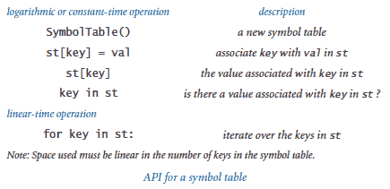

该 API 与 Python 内置的`dict`数据类型的 API 一致，我们稍后在本节中讨论。API 已经反映了几个设计决策，我们现在列举如下。

### 关联数组。

我们为两个基本操作*put*和*get*重载了`[]`运算符。在客户端代码中，这意味着我们可以将符号表视为一个*关联数组*，其中我们可以使用标准数组语法，方括号内可以是任何类型的数据，而不是介于 0 和长度之间的整数，就像数组一样。因此，我们可以将密码子与氨基酸名称关联起来，客户端代码如下：

```py
amino['TTA'] = 'Leucine'

```

我们稍后可以通过客户端代码访问与给定密码子关联的名称

```py
stdio.writeln(amino['TTA'])

```

也就是说，关联数组引用是一个*获取*操作，除非它在赋值语句的左侧，那时它是一个*放置*操作。我们可以通过实现特殊方法`__getitem__()`和`__setitem__()`来支持这些操作。

### 替换旧值策略。

如果要将值与已经关联值的键关联起来，我们采用新值替换旧值的约定（就像数组赋值语句一样）。同样，这是从关联数组抽象中所期望的。由特殊方法`__contains__()`支持的`key in st`操作，给予客户端灵活性，如果需要的话可以避免这样做。

### 未找到。

调用`st[key]`会在表中未关联键的情况下引发`KeyError`。另一种设计是在这种情况下返回`None`。

### 无键和值。

客户端可能使用`None`作为键或值，尽管他们通常不这样做。另一种设计是不允许`None`键和/或值。

### 可迭代的。

为了支持`for key in st`的构造，Python 的约定是我们需要实现一个特殊方法`__iter__()`，它返回一个*迭代器*，这是一种特殊的数据类型，包括在`for`循环的开始和每次迭代时调用的方法。我们将在本节末尾考虑 Python 的迭代机制。

### 移除。

我们基本的 API 不包括从符号表中删除键的方法。一些应用程序确实需要这样的方法，Python 提供了特殊语法`del st[key]`，可以通过实现特殊方法`__delitem__()`来支持。我们将实现留作练习，或者用于更高级的算法课程。

### 不可变的键。

我们假设键在符号表中不会更改其值。最简单且最常用的键类型（整数、浮点数和字符串）是不可变的。如果你仔细想一想，你会发现这是一个非常合理的假设！如果客户端更改了一个键，符号表的实现如何跟踪这个事实呢？

### 变体。

计算机科学家已经确定了符号表上许多其他有用的操作，并且基于它们的各种子集的 API 已经得到广泛研究。我们将在本节中以及特别是最后的练习中考虑其中的几个操作。

### 可比较的键。

在许多应用程序中，键可以是整数、浮点数、字符串或其他具有自然顺序的数据类型。在 Python 中，如第 3.3 节所讨论的，我们期望这些键是*可比较*的。具有可比较键的符号表有两个重要原因。首先，我们可以利用键的顺序来开发*put*和*get*的实现，以保证 API 中的性能规范。其次，有许多新的操作（并且可以支持）与可比较的键相关。客户端可能想要最小的键，或最大的键，或中位数，或按排序顺序迭代键。这个主题的全面覆盖更适合于算法和数据结构的书籍，但我们稍后在本节中会检查一个典型的客户端和这种数据类型的实现。这是一个部分 API：

> 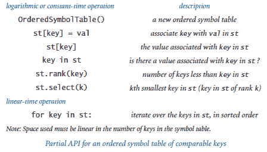

* * *

## 符号表客户端

我们从两个原型示例开始，每个示例在许多重要且熟悉的实际应用程序中都会出现。

### 字典查找。

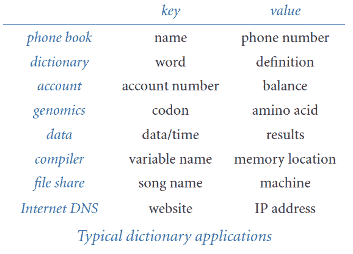 最基本的符号表客户端通过连续的*put*操作构建符号表，以支持*get*请求。程序 lookup.py 从命令行指定的逗号分隔值文件中构建一组键值对，然后写入与从标准输入读取的键对应的值。命令行参数是文件名和两个整数，一个指定用作键的字段，另一个指定用作值的字段。

本书站点提供了许多逗号分隔值（.csv）文件，您可以将其用作 lookup.py 的输入，包括 amino.csv（密码子到氨基酸编码）、djia.csv（股市平均开盘价、成交量和收盘价，历史上的每一天）、elements.csv（元素周期表）、ip.csv（DNS 数据库中的条目选择）、ip-by-country.csv（IP 地址按���家）、morse.csv（摩尔斯电码）和 phone-na.csv（电话区号）。在选择要用作键的字段时，请记住每个键必须唯一确定一个值。如果有多个*put*操作将值与键关联，表将仅记住最近的一个（考虑关联数组）。接下来我们将考虑希望将多个值与一个键关联的情况。

### 索引。

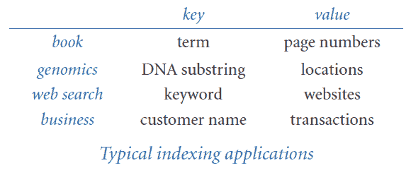 程序 index.py 是一个用于可比较键的符号表客户端的原型示例。它从标准输入中读取一组字符串，并写入所有不同字符串的排序表，以及为每个字符串指定出现在输入中的位置的整数列表。在这种情况下，我们似乎将多个值与每个键关联起来，但实际上我们只关联了一个值：一个 Python 列表。

为了减少输出量，index.py 接受三个命令行参数：一个文件名和两个整数。第一个整数是要包含在符号表中的最小字符串长度，第二个是要包含在打印索引中的出现次数最少的单词数。尝试在文件 tale.txt 和 mobydick.txt 上运行 index.py。

* * *

## 哈希表

符号表实现已经得到广泛研究，为此已经发明了许多不同的算法和数据结构，并且现代编程环境（包括 Python）提供直接支持。通常情况下，了解基本实现的工作原理将帮助您欣赏、选择并更有效地使用高级实现，或者帮助您为可能遇到的某些专门情况实现自己的版本。

实现符号表的一种方法是作为*哈希表*。哈希表是一种数据结构，我们将键分成可以快速搜索的小组。基本思想很简单。我们选择一个参数*m*，将键分成*m*组，我们希望这些组的大小大致相等。对于每个组，我们将键保留在一个列表中，并使用顺序搜索。

为了将键分成小组，我们使用一个称为*哈希函数*的函数，将每个可能的键映射到一个哈希值——一个介于 0 和*m*-1 之间的整数。这使我们能够将符号表建模为一个固定长度的列表数组，并使用哈希值作为数组索引来访问所需的列表。在 Python 中，我们可以使用内置的`list`数据类型来实现固定长度数组和列表。

哈希是非常有用的，因此许多编程语言都包含对其的直接支持。正如我们在第 3.3 节中看到的，Python 提供了内置的`hash()`函数，用于此目的，它接受一个可哈希对象作为参数并返回一个整数哈希码。为了将其转换为 0 到*m*-1 之间的哈希值，我们使用表达式

```py
hash(x) % m

```

请记住，如果对象满足以下三个属性，则对象是可哈希的：

+   对象可以与其他对象进行相等比较。

+   每当两个对象比较相等时，它们具有相同的哈希码。

+   对象的哈希码在其生命周期内不会更改。

不相等的对象可能具有相同的哈希码。但是，为了获得良好的性能，我们希望哈希函数将我们的键分成大约相等长度的*m*组。

使用哈希实现高效的符号表是直截了当的。对于键，我们维护一个包含*m*个列表的数组，其中元素`i`包含一个 Python 列表，其中包含哈希值为`i`的键。对于值，我们维护一个平行数组，也包含*m*个列表，这样当我们定位到一个键时，我们可以使用相同的索引访问相应的值。程序 hashst.py 是一个完整的实现，使用固定数量的*m*个列表（默认为 1024）。

hashst.py 的效率取决于*m*的值和哈希函数的质量。假设哈希函数合理地分布键，性能大约比顺序搜索快*m*倍，代价是*m*额外的引用和列表。这是一个经典的时空权衡：*m*值越高，我们使用的空间就越多，但花费的时间就越少。

哈希表的主要缺点是它们不利用键的顺序，因此无法按排序顺序提供键或支持像查找最小值或最大值这样的操作的高效实现。例如，在 index.py 中，键将以任意顺序出现，而不是所要求的排序顺序。接下来，我们考虑一种符号表实现，当键可比较时，可以支持这些操作，而不会牺牲太多性能。

* * *

## 二叉搜索树

*二叉树*是在信息高效组织中起着核心作用的数学抽象。对于符号表实现，我们使用一种特殊类型的二叉树来组织数据，并为符号表的*put*操作和*get*请求提供高效实现的基础。二叉搜索树（BST）将可比较的键与值关联在一起，以递归定义的结构。BST 是以下之一：

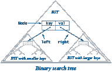

+   空（`None`)

+   一个具有键-值对和两个指向 BSTs 的引用的节点，一个具有较小键的左 BST 和一个具有较大键的右 BST

键必须可通过<运算符进行比较。

要实现二叉搜索树（BSTs），我们首先从一个节点抽象的类开始，该类具有对键、值以及左右 BSTs 的引用：

```py
class Node:
    def __init__(self, key, val):
        self.key   = key
        self.val   = val
        self.left  = None
        self.right = None

```

这个定义类似于我们对链表节点的定义，只是它有两个链接，而不只是一个。从 BSTs 的递归定义中，我们可以通过确保其值为`None`或引用到左右实例变量为 BSTs 的`Node`的引用，并确保满足排序条件（左 BST 中的键小于键，右 BST 中的键大于键）来表示类型为`Node`的变量的 BST。

在讨论 BSTs 时，我们经常使用基于树的术语。我们将顶部的节点称为树的*根*，由其左链接引用的 BST 称为*左子树*，由其右链接引用的 BST 称为*右子树*。传统上，计算机科学家将树倒置绘制，根在顶部。两个链接都为 null 的节点称为*叶*节点。树的*高度*是从根节点到叶节点的任意路径上的最大链接数。

假设你想要在 BST 中*搜索*具有给定键的节点（或在符号表中获取具有给定键的值）。有两种可能的结果：搜索可能成功（我们在 BST 中找到键；在符号表实现中，我们返回相关联的值）或者可能不成功（在 BST 中没有具有给定键的键；在符号表实现中，我们引发运行时错误）。

递归搜索算法很简单：给定一个 BST（一个指向`Node`的引用），首先检查树是否为空（引用为`None`）。如果是，则将搜索终止为不成功（在符号表实现中，引发运行时错误）。如果树不为空，则检查节点中的键是否等于搜索键。如果是，则将搜索终止为成功（在符号表实现中，返回与键关联的值）。如果不是，则将搜索键与节点中的键进行比较。如果较小，则在左子树中搜索（递归）；如果较大，则在右子树中搜索（递归）。

假设你想要在 BST 中*插入*一个新节点（在符号表实现中，将一个新的键-值对放入数据结构中）。逻辑与搜索键类似，但实现更加棘手。理解它的关键是意识到只有一个链接必须更改为指向新节点，而且该链接恰好是在对该节点的键进行不成功搜索时发现为`None`的链接。

如果 BST 为空，我们创建并返回一个包含键-值对的新`Node`；如果搜索键小于根节点的键，我们将左链接设置为将键-值对插入左子树的结果；如果搜索键大于根节点的键，我们将右链接设置为将键-值对插入右子树的结果；否则，如果搜索键相等，我们用新值覆盖现有值。在递归调用后以这种方式重置左或右链接通常是不必要的，因为链接只有在子树为空时才会更改，但设置链接与测试以避免设置它一样容易。

程序 bst.py 是基于这两个递归算法的符号表实现。与 linkedstack.py 和 linkedqueue.py（来自第 4.3 节）一样，我们使用一个私有的`_Node`类来强调`OrderedSymbolTable`的客户端不需要知道二叉搜索树表示的任何细节。

* * *

## BST 的性能特征

BST 算法的运行时间最终取决于树的形状，而树的形状取决于插入关键字的顺序。

### 最佳情况。

在最佳情况下，树是完全平衡的（每个`Node`恰好有两个不是`None`的子���点，除了底部的节点，它们恰好有两个是`None`的子节点），根节点和每个叶节点之间有 lg *n*个节点。在这样的树中，很容易看出无法成功搜索的成本是对数级的，因为该成本满足与二分查找成本相同的递归关系（参见第 4.2 节），因此每个*put*操作和*get*请求的成本与 lg *n*成正比或更少。在实践中，通过逐个插入关键字来获得这样的完全平衡树是相当幸运的，但了解最佳性能特征是值得的。

> 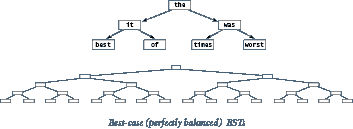

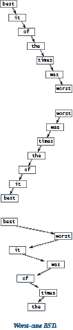

### 平均情况。

如果我们插入随机关键字，我们可能期望搜索时间也是对数级的，因为第一个关键字成为树的根节点，并且应该将关键字大致分为两半。将相同的论点应用于子树，我们期望得到与最佳情况大致相同的结果。

> 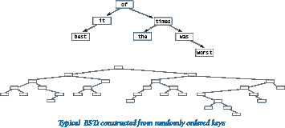

### 最坏情况。

在最坏的情况下，每个节点都有一个`None`链接，因此 BST 就像是一个带有额外浪费链接的链表，其中*put*操作和*get*请求需要线性时间。不幸的是，在实践中这种最坏情况并不罕见 — 例如，当我们按顺序插入关键字时就会出现这种情况。

因此，基本 BST 实现的良好性能取决于关键字与随机关键字足够相似，以使树不太可能包含许多长路径。如果您不确定这种假设是否合理，请不要使用简单的 BST。值得注意的是，有一些 BST 变体可以消除这种最坏情况，并保证每次操作的对数性能，方法是使所有树几乎完全平衡。其中一种流行的变体被称为[红黑树](https://en.wikipedia.org/wiki/Red%E2%80%93black_tree)。

* * *

## 遍历 BST

或许最基本的树处理函数被称为*树遍历*：给定一个（对）树的引用，我们希望系统地处理树中的每个键-值对。为了处理 BST 中的每个关键字，我们使用这种递归方法：

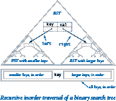

+   处理左子树中的每个关键字。

+   在根节点处理关键字。

+   处理右子树中的每个关键字。

这种方法被称为*中序*树遍历，以区别于*前序*（先处理根）和*后序*（最后处理根），这些在其他应用中出现。例如，以下方法按键排序顺序写入其参数根节点的 BST 中的键：

```py
def inorder(x):
    if x is None: return
    inorder(x.left)
    stdio.writeln(x.key)
    inorder(x.right)

```

* * *

## 可迭代对象

正如您在第 1.3 节和第 1.4 节中学到的，您可以使用`for`循环来迭代范围中的整数或数组`a[]`中的元素。

```py
for i in range(n):        for v in a:
    stdio.writeln(i)          stdio.writeln(v)

```

`for`循环不仅适用于整数范围和数组 — 您可以将其与任何*可迭代*对象一起使用。可迭代对象是一种能够逐个返回其*项*的对象。Python 的所有序列类型 — 包括`list`、`tuple`、`dict`、`set`和`str` — 都是可迭代的，内置`range()`函数返回的对象也是可迭代的。

现在，我们的目标是使`SymbolTable`可迭代，这样我们就可以使用`for`循环来遍历其键（并使用索引来获取相应的值）：

```py
st = SymbolTable()
 ...
for key in st:
    stdio.writeln(str(key) + ' ' + str(st[key]))

```

要使用户定义的数据类型可迭代，必须实现特殊方法`__iter__()`，以支持内置函数`iter()`。`iter()`函数创建并返回一个*迭代器*，它包括一个特殊方法`__next__()`，Python 在每次`for`循环迭代开始时调用该方法。

尽管这看起来复杂，但我们可以使用一个基于 Python 列表可迭代的快捷方式：如果`a`是一个 Python 列表，那么`iter(a)`会返回一个迭代器，遍历其项。因此，我们可以通过将键收集到 Python 列表中并返回该列表的迭代器，使我们的哈希表和二叉搜索树实现可迭代。

要使 hashst.py 可迭代，我们将所有键累积到一个 Python 列表中，然后返回该列表上的迭代器；hashst.py 中的`__iter__()`方法正是这样做的。要使 bst.py 可迭代，我们修改上面显示的递归`inorder()`方法，以收集 Python 列表中的键而不是写入它们。然后我们可以为该列表返回一个迭代器。bst.py 中的`_inorder()`和`__iter__()`方法使用了这种方法。

二叉搜索树的灵活性和比较键的能力使得我们能够实现许多有用的操作，超出了哈希表能够高效支持的操作范围。例如，使用二叉搜索树，我们可以高效地找到最小或最大键，找到指定范围内的所有键，并找到第*k*小的键。我们将这些操作的实现留给练习，并将它们的性能特征和应用的进一步研究留给算法和数据结构课程。

* * *

## 字典数据类型

现在您了解了符号表的工作原理，可以开始使用 Python 的工业强度版本。内置的`dict`数据类型遵循与`SymbolTable`相同的基本 API，但具有更丰富的操作，包括删除；一个返回默认值的版本，如果键不在字典中；以及遍历键-值对。这是一个部分 API：

> 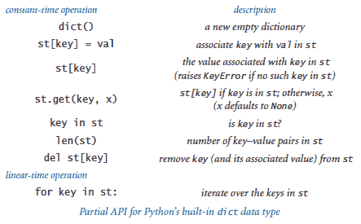

底层实现是哈希表，因此不支持有序操作。通常情况下，由于 Python 使用低级语言并且不对所有用户施加其施加的开销，如果有序操作不重要，那么该实现将更有效，并且是首选的。

作为一个简单的例子，以下`dict`客户端从标准输入读取一系列字符串，计算每个字符串出现的次数，并写入字符串及其频率。这些字符串不按排序顺序输出。

```py
import stdio
st = dict()
while not stdio.isEmpty():
    word = stdio.readString()
    st[word] = 1 + st.get(word, 0)
for word, frequency in st.iteritems():
    stdio.writef('%s %4d\n', word, frequency)

```

在本节末尾的练习中出现了几个`dict`客户端的示例。

* * *

## 集合数据类型

最后一个例子，我们考虑一个比符号表更简单、仍然广泛有用且易于使用哈希或二叉搜索树实现的数据类型。*集合*是一个包含不同键的集合，类似于没有值的符号表。例如，我们可以通过删除 hashst.py 或 bst.py 中的值引用来实现一个集合。同样，Python 提供了一个用低级语言实现的`set`数据类型。这是一个部分 API：

> 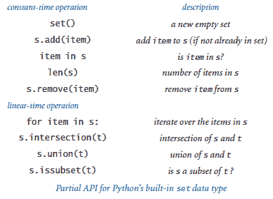

例如，考虑从标准输入读取一系列字符串并写入每个字符串的第一次出现（从而删除重复项）的任务。我们可以使用一个`set`，就像以下客户端代码中所示：

```py
import stdio
distinct = set()
while not stdio.isEmpty():
    key = stdio.readString()
    if key not in distinct:
        distinct.add(key)
        stdio.writeln(key)

```

在本节末尾的练习中，您可以找到几个其他集合客户端的示例。

你应该使用 Python 的内置`dict`和`set`数据类型吗？当然，如果它们支持你需要的操作，因为它们是用低级语言编写的，不受 Python 对用户代码施加的开销影响，因此可能比你自己实现的任何东西都要快。但是，如果你的应用程序需要基于顺序的操作，如查找最小值或最大值，你可能需要考虑二叉搜索树。

* * *

#### Q &amp A

**Q.** 我可以将数��（或 Python 列表）用作`dict`或`set`中的键吗？

**A.** 不，内置的`list`数据类型是可变的，因此你不应该将数组用作符号表或集合中的键。事实上，Python 列表不可哈希，因此你不能将它们用作`dict`或`set`中的键。内置的`tuple`数据类型是不可变的（且可哈希的），所以你可以使用它。

**Q.** 为什么我的用户定义数据类型不能与`dict`或`set`一起使用？

**A.** 默认情况下，用户定义的类型是可哈希的，`hash(x)`返回`id(x)`，`==`测试引用相等性。虽然这些默认实现满足了可哈希的要求，但它们很少提供你想要的行为。

**Q.** 为什么我不能直接在特殊方法`__iter__()`中返回 Python 列表？为什么我必须调用内置的`iter()`函数，并将 Python 列表作为参数？

**A.** Python 列表是可迭代对象（因为它有一个返回迭代器的`__iter__()`方法），但它不是迭代器。

**Q.** Python 使用哪种数据结构来实现`dict`和`set`？

**A.** Python 使用*开放寻址*哈希表，这是我们在本节中考虑的分离链接哈希表的近亲。Python 的实现经过高度优化，并用低级编程语言编写。

**Q.** Python 是否提供了用于指定`set`和`dict`对象的语言支持？

**A.** 是的，你可以通过用花括号括起逗号分隔的项目列表来指定一个`set`。你可以通过用花括号括起逗号分隔的键值对列表，并在每个键和其关联值之间使用冒号来指定一个`dict`。

```py
stopwords = {'and', 'at', 'of', 'or', on', 'the', 'to'}
grades = {'A+':4.33, 'A':4.0, 'A-':3.67, 'B+':3.33, 'B':3.0} 

```

**Q.** Python 是否提供了一个内置的有序符号表（或有序集合）的数据类型，支持有序迭代、顺序统计和范围搜索？

**A.** 不是的。如果你只需要有序迭代（具有可比较的键），你可以使用 Python 的`dict`数据类型并对键进行排序（并为排序付出性能损失）。例如，如果你在 index.py 中使用`dict`而不是二叉搜索树，你可以通过类似以下代码来按排序顺序编写键

```py
for word in sorted(st):

```

如果你需要其他有序符号表操作（如范围搜索或顺序统计），你可以使用我们的二叉搜索树实现（并为使用 Python 实现的数据类型付出性能损失）。

* * *

#### 练习

1.  修改 lookup.py 以创建一个名为`lookupandput.py`的程序，允许在标准输入上指定*put*操作。使用约定，加号表示接下来输入的两个字符串是要插入的键值对。

1.  修改 lookup.py 以创建一个名为`lookupmultiple.py`的程序，通过将具有相同键的多个值放入数组（如 index.py 中），然后在*get*请求时将它们全部写出，如下所示：

    ```py
    % python lookupmultiple.py amino.csv 3 0
    Leucine
    TTA TTG CTT CTC CTA CTG

    ```

1.  修改 index.py 以创建一个名为`indexbykeyword.py`的程序，从命令行获取文件名，并仅使用该文件中的关键字从标准输入创建索引。*注意*：使用相同的文件进行索引和关键字应该会产生与 index.py 相同的结果。

1.  修改 index.py 以创建一个程序`indexlines.py`，仅将连续的字母序列视为键（没有标点符号或数字），并使用行号而不是单词位置作为���。这个功能对于程序很有用：当以 Python 程序作为输入时，`indexlines.py`应该写出一个显示程序中每个关键字或标识符以及其出现行号的索引。

1.  开发一个实现符号表 API 的`OrderedSymbolTable`实现，它维护键和值的并行数组，并按键排序顺序保持它们。对于*get*使用二分查找，对于*put*将较大的元素向右移动一个位置（使用调整数组大小以使数组长度与表中键值对的数量成线性关系）。使用 index.py 测试您的实现，并验证使用这样的实现对 index.py 进行操作所需的时间与输入中字符串数量和不同字符串数量的乘积成正比的假设。

1.  开发符号表 API 的`LinkedSymbolTable`实现，维护包含键和值的节点的链表，保持它们以任意顺序。使用 index.py 测试您的实现，并验证使用这样的实现对 index.py 进行操作所需的时间与输入中字符串数量和不同字符串数量的乘积成正比的假设。

1.  计算单字符键的`hash(x) % 5`

    ```py
    E A S Y Q U E S T I O N

    ```

    绘制当这个序列中的第`i`个键与值`i`相关联时创建的哈希表，`i`从 0 到 11。

1.  以下`__hash__()`实现有什么问题？

    ```py
    def __hash__(self):
        return -17

    ```

    *解决方案*：虽然从技术上讲它满足数据类型可哈希的条件（如果两个对象相等，则它们具有相同的哈希值），但这会导致性能不佳，因为我们期望`hash(x) % m`将键均匀地分成大约相等大小的 m 组。

1.  扩展`Complex`（在第 3.2 节中定义的 complex.py）和`Vector`（在第 3.3 节中定义的 vector.py）使它们通过实现特殊方法`__hash__()`和`__eq__()`成为可哈希的。

1.  修改 hashst.py 以使用调整大小的数组，以便与每个哈希值关联的列表的平均长度在 1 和 8 之间。

1.  绘制可以表示键序列的所有不同 BST。

    ```py
    best of it the time was

    ```

1.  插入具有键的项目后绘制的 BST

    ```py
    E A S Y Q U E S T I O N

    ```

    将这些键按照顺序插入一个初始为空的树中。结果 BST 的高度是多少？

1.  假设我们在 BST 中有 1 到 1000 之间的整数键，并搜索 363。以下哪个序列不可能是检查的键序列？

    ```py
    2 252 401 398 330 363
    399 387 219 266 382 381 278 363
    3 923 220 911 244 898 258 362 363
    4 924 278 347 621 299 392 358 363
    5 925 202 910 245 363

    ```

1.  假设以下 31 个键（以某种顺序）出现在高度为 5 的 BST 中：

    ```py
    10 15 18 21 23 24 30 31 38 41 42 45 50 55 59
    60 61 63 71 77 78 83 84 85 86 88 91 92 93 94 98

    ```

    绘制树的前三个节点（根节点及其两个子节点）。

1.  描述如果您在 lookup.py 中用 bst.py 替换 hashst.py 对性能的影响。为了防止最坏情况，调用`stdrandom.shuffle(database)`在填充符号表之前。

1.  真或假：给定一个 BST，让*x*是一个叶子节点，*p*是它的父节点。那么要么（i）*p*的键是大于*x*的 BST 中最小的键，要么（ii）*p*的键是小于*x*的 BST 中最大的键。

1.  修改 hashst.py 中的`SymbolTable`类，使其成为一个实现了 Python 内置`set`数据类型部分 API 中的常量时间操作的`Set`类。

1.  修改 bst.py 中的`OrderedSymbolTable`类，使其成为一个实现了 Python 内置`set`数据类型部分 API 中的常量时间操作的`OrderedSet`类，假设键是可比较的。

1.  修改 hashst.py 以支持客户端代码`del st[key]`，通过添加一个接受键参数并从符号表中删除该键（以及相应的值）的方法`__delitem__()`。使用调整大小的数组来确保与每个哈希值关联的列表的平均长度在 1 到 8 之间。

1.  为 bst.py 实现`__str__()`，使用递归辅助方法。通常，由于字符串连接的成本，可以接受二次性能。*额外加分*：为 bst.py 组成一个使用数组和 Python 内置`str`数据类型的`join()`方法的线性时间`__str__()`方法。

1.  *词汇表*是文本中单词的按字母顺序排列的列表，显示每个单词出现的所有位置。因此，`python index.py 0 0`生成一个词汇表。在一个著名的事件中，一组研究人员试图在向其他人保密死海古卷的细节的同时建立可信度，通过公开一个词汇表。编写一个程序`invertconcordance.py`，它接受一个命令行参数`n`，从标准输入读取一个词汇表，并在标准输出上写入相应文本的前`n`个单词。

1.  运行实验来验证文本中关于使用具有调整大小数组的 hashst.py 时*put*操作和*get*请求是常数时间操作的说法，如前面的练习所述。开发测试客户端，生成随机键，并对各种数据集进行测试，可以是来自本书站点或您自己选择的数据集。

1.  运行实验来验证文本中关于使用 bst.py 时*put*操作和*get*请求与符号表大小的对数关系的说法。开发测试客户端，生成随机键，并对各种数据集进行测试，可以是来自本书站点或您自己选择的数据集。

1.  修改 bst.py 以添加返回表中最小（或最大）键的方法`min()`和`max()`（如果表为空，则返回`None`）。

1.  修改 bst.py 以添加`floor()`和`ceiling()`方法，接受一个键作为参数，并返回集合中不大于（不小于）给定键的最大（最小）键。

1.  修改 bst.py 以支持特殊的`len()`函数，通过实现一个返回符号表中键值对数量的特殊方法`__len__()`来实现。使用在每个`_Node`中存储根节点下子树中节点数量的方法。

1.  修改 bst.py 以添加一个`rangeSearch()`方法，接受两个键`lo`和`hi`作为参数，并返回所有位于`lo`和`hi`之间的键的迭代器。运行时间应与高度加上范围内键的数量成比例。

1.  修改 bst.py 以添加一个`rangeCount()`方法，接受键作为参数，并返回 BST 中两个给定键之间的键的数量。您的方法应该花费与树的高度成比例的时间。*提示*：首先完成前一个练习。

1.  修改 bst.py 以支持客户端代码`del st[key]`，通过添加一个接受键参数并从符号表中删除该键（以及相应的值）的方法`__delitem__()`来实现。*提示*：这个操作比看起来更困难。用 BST 中下一个最大键及其相关值替换键及其相关值；然后从 BST 中删除包含下一个最大键的节点。

1.  修改符号表 API，通过使`get()`返回具有给定键的值的迭代器来处理具有重复键的值。根据此 API 重新实现 hashst.py 和 bst.py。讨论这种方法与文本中给出的方法的优缺点。

1.  假设`a[]`是一个可散列对象的数组。以下语句的效果是什么？

    ```py
    a = list(set(a))

    ```

1.  重新编写 lookup.py 和 index.py，使用`dict`代替分别使用 hashst.py 和 bst.py。比较性能。

1.  编写一个`dict`客户端，创建一个将字母等级映射到数字分数的符号表，然后从标准输入读取一个字母等级列表并计算它们的平均值（GPA）。

    ```py
     A+   A    A-   B+   B    B-   C+   C    C-   D    F
    4.33 4.00 3.67 3.33 3.00 2.67 2.33 2.00 1.67 1.00 0.00

    ```

1.  在 stockaccount.py（来自第 3.2 节）中实现`buy()`和`sell()`方法。使用一个`dict`来存储每只股票的股数。

* * *

#### 二叉树练习

*以下练习旨在让您熟练处理不一定是 BST 的二叉树。它们都假设一个具有三个实例变量的 Node 类：一个正的双精度值和两个 Node 引用。与链表一样，使用文本中显示的可视表示进行绘图会很有帮助。*

1.  实现以下函数，每个函数以一个作为参数的`Node`作为二叉树的根。

    +   `size(node)`:节点为根的树中的节点数

    +   `leaves(node)`:节点为根的树中链接都为`None`的节点数

    +   `total(node)`:节点为根的树中所有节点键值的总和

    您的方法应该都在线性时间内运行。

1.  实现一个线性时间函数`height()`，返回从根到叶节点的任意路径上的节点数的最大值（空树的高度为 0；一个节点的树的高度为 1）。

1.  如果根节点的键大于其所有后代节点的键，则二叉树是*堆有序*的。实现一个线性时间函数`heapOrdered()`，如果树是堆有序的则返回`True`，否则返回`False`。

1.  给定一个二叉树，*单值*子树是包含相同数值的最大子树。设计一个线性时间算法，计算二叉树中单值子树的数量。

1.  如果一个二叉树的两个子树都是平衡的，并且两个子树的高度最多相差 1，则该二叉树是*平衡*的。实现一个线性时间方法`balanced()`，如果树是平衡的则返回`True`，否则返回`False`。

1.  如果只有它们的键值不同（即它们具有相同的形状），则两个二叉树是*同构*的。实现一个线性时间函数`isomorphic()`，它以两个树引用作为参数，并在它们引用同构树时返回`True`，否则返回`False`。然后，实现一个线性时间函数`eq()`，它以两个树引用作为参数，并在它们引用相同的树（具有相同键值的同构树）时返回`True`，否则返回`False`。

1.  编写一个函数`levelOrder()`，按层次顺序写入 BST 键：首先写入根；然后从左到右写入根下一级的节点；然后从左到右写入根下两级的节点；依此类推。*提示*：使用一个`Queue`。

1.  实现一个线性时间函数`isBST()`，如果二叉树是 BST 则返回`True`，否则返回`False`。

    *解决方案*：这个任务比看起来要困难一些。使用一个递归辅助函数`_inRange()`，它接受两个额外参数`lo`和`hi`，如果二叉树是 BST 且所有值都在`lo`和`hi`之间，则返回`True`，使用`None`表示最小可能键和最大可能键。

    ```py
    def _inRange(node, lo, hi):
        if node is None: return True
        if (lo is not None) and (node.item <= lo):  return False
        if (hi is not None) and (hi <= node.item):  return False
        if not _inRange(node.left, lo, node.item):  return False
        if not _inRange(node.right, node.item, hi): return False    
        return True
    def _isBST(node):
        return _inRange(node, None, None)

    ```

    我们注意到这个实现同时使用了<和<=运算符，而我们的二叉搜索树代码只使用<运算符。

1.  计算`mystery()`在一些示例二叉树上返回的值，然后提出一个关于该值的假设并加以证明。

    ```py
    def mystery(node):
        if node is None: return 1
        return mystery(node.left) + mystery(node.right)

    ```

* * *

#### 创意练习

1.  **拼写检查。** 编写一个`set`客户端`spellchecker.py`，以一个包含单词字典的文件名作为命令行参数，然后从标准输入读取字符串，并写入任何不在字典中的字符串。使用文件 words.utf-8.txt。*额外加分*：增强程序以处理常见后缀，如-ing 或-ed。

1.  **拼写校正。** 编写一个`dict`客户端`spellcorrector.py`，作为一个过滤器，用建议的替换词替换标准输入中常见拼写错误的单词，并将结果写入标准输出。将一个包含常见拼写错误和更正的文件作为命令行参数。使用文件 misspellings.txt，其中包含许多常见拼写错误。

1.  **网页过滤器。** 编写一个`set`客户端`webblocker.py`，以一个包含不良网站列表的文件名作为命令行参数，然后从标准输入读取字符串，并仅写入不在列表中的网站。

1.  **集合操作。** 将`union()`和`intersection()`方法添加到`OrderedSet`（请参见本节中的先前练习），每个方法接受两个集合作为参数，并返回这两个集合的并集和交集。

1.  **频率符号表。** 开发一个支持以下操作的数据类型`FrequencyTable`：`click()`和`count()`，两者都接受字符串参数。数据类型值是一个整数，用于跟踪使用给定字符串调用`click()`操作的次数。`click()`操作将计数增加 1，`count()`操作返回该值，可能为 0。此数据类型的客户端可能包括 Web 流量分析器，计算每首歌曲播放次数的音乐播放器，用于计算通话次数的电话软件等。

1.  **1D 范围搜索。** 开发一个支持以下操作的数据类型：插入日期，搜索日期，并计算数据结构中位于特定区间内的日期数量。使用 Python 的`datetime.Date`数据类型。

1.  **非重叠区间搜索。** 给定一个整数的非重叠区间列表，编写一个函数，接受一个整数参数，并确定该值位于哪个（如果有）区间中。例如，如果区间是 1643-2033，5532-7643，8999-10332 和 5666653-5669321，则查询点 9122 位于第三个区间，8122 不在任何区间中。

1.  **按国家查找 IP。** 编写一个`dict`客户端，使用数据文件 ip-by-country.csv 来确定给定 IP 地址来自哪个国家。数据文件有五个字段：IP 地址范围的开始，IP 地址范围的结束，两个字符的国家代码，三个字符的国家代码和国家名称。IP 地址不重叠。这样的数据库工具可用于信用卡欺诈检测，垃圾邮件过滤，网站上语言的自动选择以及 Web 服务器日志分析。

1.  **具有单词查询的网页倒排索引。** 给定一个网页列表，创建包含网页中包含的单词的符号表。将每个单词与出现该单词的网页列表关联起来。编写一个程序，读取网页列表，创建符号表，并支持通过返回包含查询单词的网页列表来支持单词查询。

1.  **具有多词查询的网页倒排索引。** 扩展上一个练习，以支持多词查询。在这种情况下，输出包含每个查询单词至少出现一次的网页列表。

1.  **多词搜索（无序）。** 编写一个程序，从命令行获取`k`个关键字，从标准输入读取一系列单词，并识别包含所有`k`个关键字的最小文本间隔（不一定按照相同顺序）。不需要考虑部分单词。

1.  **多词搜索（有序）。** 重复上一个练习，但现在假设关键字必须按指定的顺序出现。

1.  **在国际象棋中的重复抽取。** 在国际象棋中，如果一个棋盘位置连续三次出现相同的一方移动，则该方可以宣布平局。描述如何使用计算机程序测试此条件。

1.  **注册调度。** 东北一所知名大学的注册处最近安排一名教师在完全相同的时间上教授两门不同的课程。通过描述一种检查此类冲突的方法来帮助注册处避免未来的错误。为简单起见，假设所有课程都持续 50 分钟，并且从 9 点、10 点、11 点、1 点、2 点或 3 点开始。

1.  **熵。** 我们定义一个包含*n*个单词的文本语料库的*相对熵*，其中有*k*个是不同的，如下所示

    *E* = 1 / (*n* lg *n*) (*p*[0] lg(*k*/*p*[0]) + *p*[1] lg(*k*/*p*[1]) + ... + *p*[*k*-1] lg(*k*/*p*[*k*-1]))

    其中*p[i]*是单词*i*出现的次数的分数。编写一个程序，读取文本语料库并写入相对熵。将所有字母转换���小写，并将标点符号视为空格。

1.  **顺序统计。** 在 bst.py 中添加一个名为`select()`的方法，该方法接受一个整数参数`k`并返回 BST 中第`k`个最小的键。在每个节点中维护子树大小。运行时间应与树的高度成比例。

1.  **排名查询。** 在 bst.py 中添加一个名为`rank()`的方法，该方法以一个键作为参数并返回 BST 中严格小于该键的键的数量。在每个节点中维护子树大小。运行时间应与树的高度成比例。

1.  **随机元素。** 在 bst.py 中添加一个名为`random()`的方法，该方法返回一个随机键。在每个节点中维护子树大小。运行时间应与树的高度成比例。

1.  **无重复项的队列。** 创建一个数据类型，它是一个队列，但是在任何给定时间一个元素最多只能出现在队列中一次。如果已经在队列中，则忽略插入项的请求。

1.  **给定长度的唯一子字符串。** 编写一个程序，从标准输入中读取文本并计算其包含的给定长度`k`的唯一子字符串的数量。例如，如果输入是`CGCGGGCGCG`，则长度为 3 的唯一子字符串有五个：`CGC`、`CGG`、`GCG`、`GGC`和`GGG`。这种计算在数据压缩中很有用。*提示*：使用字符串切片`s[i:i+k]`提取第`i`个子字符串并插入符号表中。在包含π的前 1000 万位数字的文件 pi-10million.txt 上测试您的程序。

1.  **广义队列。** 实现一个支持以下 API 的类：

    > 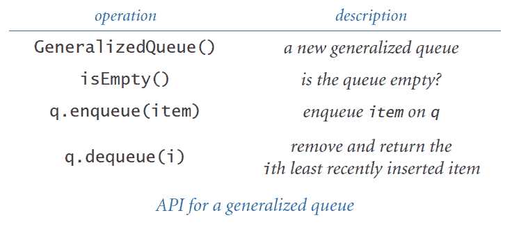

    使用 BST 将插入的第*k*个元素与键*k*关联，并在每个节点中维护以该节点为根的子树中的总节点数。要找到最近添加的第*i*个项，搜索 BST 中第*i*个最小的元素。

1.  **动态离散分布。** 创建一个支持以下两个操作的数据类型：`add()`和`random()`。`add()`方法应在数据结构中插入一个新项（如果之前没有看到过）；否则，应将其频率计数增加 1。`random()`方法应按每个元素的频率加权的概率返回一个元素。使用与项数成比例的空间。

1.  **密码检查器。** 编写一个程序，该程序将一个字符串作为命令行参数，并从标准输入中获取一个单词字典，然后检查该字符串是否是一个“好”密码。在这里，假设“好”意味着它（1）至少有八个字符长，（2）不是字典中的一个词，（3）不是字典中的一个词后跟一个数字 0-9（例如，hello5），（4）不是字典中的两个单词连接在一起（例如，helloworld），以及（5）字典中的单词的反转不满足（2）到（4）中的任何一个。文件 words.utf-8.txt 包含一个单词字典。

1.  **随机电话号码。** 编写一个程序，该程序接受一个命令行参数*n*，并写入*n*个形式为(xxx) xxx-xxxx 的随机电话号码。使用`set`来避免多次选择相同的号码。仅使用合法的区号，如文件 phone-na.csv 中所示。

1.  **稀疏向量。** 如果一个*n*维向量的非零值数量很少，则称其为*稀疏*。您的目标是用与其非零值数量成比例的空间表示一个向量，并且能够在时间上与总非零值数量成比例地添加两个稀疏向量。实现支持以下 API 的类：

    > 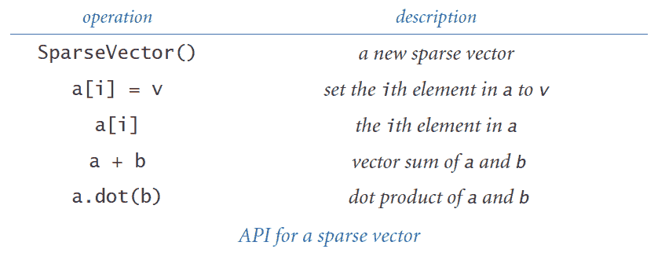

1.  **稀疏矩阵。** 如果一个*n*×*n*矩阵的非零值数量与*n*成比例（或更少），则称其为*稀疏*。您的目标是用与*n*成比例的空间表示一个矩阵，并且能够在时间上与总非零值数量成比例地添加和乘以两个稀疏矩阵（可能有额外的对数*n*因子）。实现支持以下 API 的类：

    > 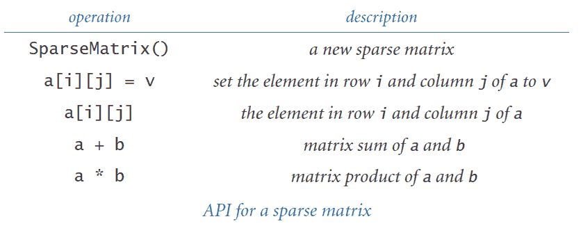

1.  **可变字符串。** 创建一个名为`MutableString`的数据类型，它与 Python 的`str`数据类型相同，但是可变的。它应该支持以下操作：

    +   `ms[i]`: 返回`MutableString`对象`ms`的第`i`个字符

    +   `ms[i] = c`: 将`MutableString`对象`ms`的第`i`个字符更改为`c`。

    +   `ms.insert(i, c)`: 在索引`i`之前将字符`c`插入`MutableString`对象`ms`中。

    +   `del ms[i]`: 删除`MutableString`对象`ms`的第`i`个字符

    使用 BST 以对数时间实现这些操作。然后编写其他方法 —— 构造函数、`__str__()`方法、比较方法、`__contains__()`方法、`__iter__()`方法等 —— 使数据类型相对完整。

1.  **赋值语句。** 编写一个程序来解析和评估由完全括号化的算术表达式组成的赋值和写入语句的程序（参见第 4.3 节的 evaluate.py）。例如，给定输入

    ```py
    A = 5
    B = 10
    C = A + B
    D = C * C
    write(D)

    ```

    你的程序应该写入值为 225。假设所有变量和值都是浮点数。使用符号表来跟踪变量名。

1.  **密码子使用表。** 编写一个程序，使用符号表为从标准输入中获取的基因组中的每个密码子编写摘要统计信息（每千个的频率），如下所示：

    ```py
    UUU 13.2  UCU 19.6  UAU 16.5  UGU 12.4
    UUC 23.5  UCC 10.6  UAC 14.7  UGC  8.0
    UUA  5.8  UCA 16.1  UAA  0.7  UGA  0.3
    UUG 17.6  UCG 11.8  UAG  0.2  UGG  9.5
    CUU 21.2  CCU 10.4  CAU 13.3  CGU 10.5
    CUC 13.5  CCC  4.9  CAC  8.2  CGC  4.2
    CUA  6.5  CCA 41.0  CAA 24.9  CGA 10.7
    CUG 10.7  CCG 10.1  CAG 11.4  CGG  3.7
    AUU 27.1  ACU 25.6  AAU 27.2  AGU 11.9
    AUC 23.3  ACC 13.3  AAC 21.0  AGC  6.8
    AUA  5.9  ACA 17.1  AAA 32.7  AGA 14.2
    AUG 22.3  ACG  9.2  AAG 23.9  AGG  2.8
    GUU 25.7  GCU 24.2  GAU 49.4  GGU 11.8
    GUC 15.3  GCC 12.6  GAC 22.1  GGC  7.0
    GUA  8.7  GCA 16.8  GAA 39.8  GGA 47.2

    ```
