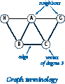
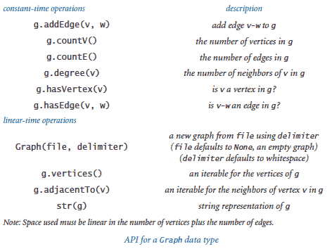
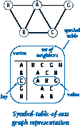
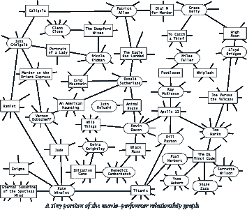
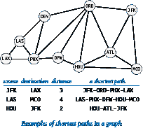
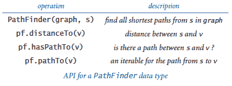
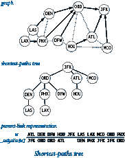
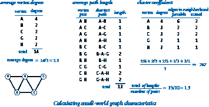

# 4.5 一个案例研究：小世界现象

> 原文：[`introcs.cs.princeton.edu/python/45graph`](https://introcs.cs.princeton.edu/python/45graph)

<title>一个案例研究：小世界现象</title>

我们用于研究实体之间成对连接性质的数学模型称为*图*。图对于研究自然界很重要，也有助于我们更好地理解和完善我们创建的网络。

一些图表展示了一种特定属性，被称为*小世界现象*。你可能熟悉这个属性，有时也被称为*六度分隔*。这基本上是一个想法，即尽管我们每个人的熟人相对较少，但我们之间存在着一个相对较短的熟人链（六度分隔）将我们彼此分开。科学家对小世界图表感兴趣，因为它们模拟了自然现象，工程师对构建利用小世界图表的自然属性的网络感兴趣。

在本节中，我们探讨了围绕研究小世界图表的基本计算问题。

* * *

## 图数据类型



我们从一些基本定义开始。*图*由一组*顶点*和一组*边*组成。每条边表示��个顶点之间的连接。如果两个顶点通过一条边连接，则它们是*邻居*，顶点的*度*是其邻居的数量。

图处理算法通常首先通过添加边来构建图的内部表示，然后通过遍历顶点和与顶点相邻的边来处理它。这个 API 支持这样的处理。

> 

程序 graph.py 实现了这个 API。它的内部表示是一个符号表的集合：键是顶点，值是邻居的集合——与键相邻的顶点。右侧展示了一个小例子。为了实现这种表示，我们使用了我们在第 4.4 节介绍的两种内置数据类型`dict`和`set`。



一种自然的写法是将`Graph`的顶点一个接一个地放在一行上，每个顶点后面跟着其直接邻居的列表。因此，我们通过实现`__str__()`来支持内置函数`str()`，如 graph.py 所示。生成的字符串包括每条边的两种表示，一种是我们发现`w`是`v`的邻居的情况，另一种是我们发现`v`是`w`的邻居的情况。许多图算法都基于这种基本的处理每条边的范式（两次）。这种实现仅适用于小图，因为在某些系统上，运行时间与字符串长度的平方成正比。

`str()`的输出格式还定义了一个合理的输入文件格式。`__init__()`方法支持从这种格式的文件创建图（每行是一个顶点名称，后面是该顶点的邻居的名称，用空格分隔）。为了灵活性，我们允许使用除空格之外的分隔符（例如，顶点名称可能包含空格），如 graph.py 所示。

* * *

## 图表客户端示例

作为第一个图处理客户端，我们考虑社会关系的一个例子——这对你来说肯定很熟悉，并且有大量数据可用。

在这个书站上，你可以找到文件 movies.txt，其中包含一系列电影及出演其中的演员。每行给出一部电影的名称，后面是演员名单（出现在该电影中的演员的名称列表）。由于名字中有空格和逗号，我们使用“/”字符作为分隔符。

使用`Graph`，我们可以构建一个简单方便的客户端，从 movies.txt 中提取信息。我们首先构建一个`Graph`来更好地组织信息。顶点和边应该如何建模？我们选择为电影和表演者都有顶点，每部电影与其中的每个表演者连接一条边。正如你将看到的，处理这个图的程序可以回答我们许多有趣的问题。

> 

程序 invert.py 是一个第一个例子。它是一个`Graph`客户端，接受查询，比如电影的名称，并写出出现在该电影中的表演者列表。invert.py 的一个更有趣的特点是，你可以输入表演者的名称，然后得到该表演者出现在哪些电影中的列表。为什么会这样？尽管数据库似乎将电影连接到表演者而不是反过来，但图中的边是连接，也将表演者连接到电影。

所有连接一种顶点到另一种顶点的图被称为*二部图*。正如这个例子所示，二部图有许多自然属性，我们经常可以以有趣的方式利用这些属性。

值得反思的是，构建一个二部图提供了一种简单的方式来自动反转任何索引！这种反转索引的功能是图*数据结构*的直接好处。接下来，我们将研究一些从处理数据结构的*算法*中获得的附加好处。

* * *

## 图中的最短路径



在图中给定两个顶点，*路径*是由边连接的顶点序列。*最短路径*是所有这样的路径中边的最小数量（可能存在多个最短路径）。在图中找到连接两个顶点的最短路径是计算机科学中的一个基本问题。

根据应用程序的不同，客户端对于最短路径有各种需求。我们的选择是从以下 API 开始：

> 

在庞大的图中或对于大量查询，我们必须特别关注 API 设计，因为计算路径的成本可能是禁止性的。通过这种设计，客户端可以为给定的图和给定的顶点创建一个`PathFinder`对象，然后使用该对象来查找最短路径的长度或迭代最短路径上的顶点到图中的任何其他顶点。这些方法的实现被称为*单源最短路径算法*。一个被称为*广度优先搜索*的经典算法提供了一个直接而优雅的解决方案，其中构造函数需要线性时间，`distanceTo()`需要常数时间，而`pathTo()`需要与路径长度成比例的时间。在检查我们的实现之前，我们将考虑一些客户端。

### 单源客户端。

假设你有你的廉价航空公司航线图的顶点和连接的图。然后，使用你的家乡作为源，你可以编写一个客户端，在任何时候你想去旅行时写出你的路线。程序 separation.py 是一个`PathFinder`客户端，为任何图提供这种功能。你被鼓励通过在我们的示例输入 routes.txt 上运行`PathFinder`或任何你选择的输入模型来探索最短路径的属性。

### 分离度。

最短路径算法的一个经典应用是在社交网络中找到个人之间的分离度。为了明确概念，我们讨论这个应用，以最近流行的一种名为*凯文·贝肯游戏*的消遣为例，该游戏使用我们刚刚考虑的电影-表演者图。凯文·贝肯是一位多产的演员，出演了许多电影。我们为每个出演过电影的表演者分配一个贝肯数：贝肯本人是 0，任何与贝肯同台演出过的表演者的贝肯数为 1，任何其他表演者（除了贝肯）与贝肯数为 1 的表演者同台演出过的表演者的贝肯数为 2，依此类推。例如��梅丽尔·斯特里普的贝肯数为 1，因为她与凯文·贝肯在《狂野河流》中演出。妮可·基德曼的数为 2：尽管她没有与凯文·贝肯一起出演过任何电影，但她与唐纳德·萨瑟兰在《冷山》中演出，而萨瑟兰与凯文·贝肯在《动物屋》中演出。给定一个表演者的名字，游戏的最简单版本是找到一些交替的电影和表演者序列，将其连接回凯文·贝肯。值得注意的是，pathfinder.py 正是你需要找到建立任何表演者在 movies.txt 中的贝肯数的最短路径的程序：任何表演者的贝肯数恰好是凯文·贝肯与该表演者之间的*距离*的一半。

### 最短路径距离。

我们定义两个顶点之间的*距离*为它们之间最短路径的长度。理解广度优先搜索的第一步是考虑计算源和每个顶点之间距离的问题（在 PathFinder 中实现 distanceTo()）。我们的方法是在构造函数中计算并存储所有距离，然后当客户调用 distanceTo()时，只需返回请求的值。为了将整数距离与每个顶点名称关联起来，我们使用一个符号表：

```py
_distTo = dict()

```

这个符号表的目的是将每个顶点与该顶点和`s`之间的最短路径长度（距离）关联起来。为了做到这一点，我们按照它们到`s`的距离的顺序考虑顶点，忽略那些到`s`的距离已知的顶点。为了组织计算，我们使用一个 FIFO 队列。从队列中的`s`开始，我们执行以下操作，直到队列为空：

+   出队一个顶点 v。

+   将 v 的所有未知邻居的距离设为比 v 的距离大 1。

+   将所有未知邻居入队。

这个方法按照它们到源`s`的距离的非递减顺序出队顶点。

### 最短路径树。

我们不仅需要源到目的地的距离，还需要路径。为了实现 pathTo()，我们使用一个称为*最短路径树*的子图，定义如下：

+   将源顶点 s 放在树的根上。

+   如果顶点 v 的邻居被添加到队列中，将它们放入树中，并用一条边将每个邻居连接到 v。

由于我们每次只将每个顶点入队一次，这个结构是一棵正确的树：它由一个根（源）连接到源的每个邻居的一个子树。研究这样一棵树，你可以立即看到树中每个顶点到根的距离与图中到源的最短路径距离相同。更重要的是，树中的每条路径都是图中的最短路径。这一观察很重要，因为它为我们提供了一种向客户提供最短路径本身的简单方法（在 PathFinder 中实现 pathTo()）。

首先，我们维护一个符号表，将每个顶点与在最短路径上离源一步的顶点关联起来：

```py
_edgeTo = dict()

```

对于每个顶点`w`，我们希望将最短路径从源点到`w`的前一个停靠点关联起来。将最短距离方法扩展到计算这些信息也很容易：当我们因为首次发现`w`是`v`的邻居而将其入队时，正是因为`v`是从源点到`w`的最短路径上的前一个停靠点，所以我们可以赋值`_edgeTo[w] = v`。`_edgeTo`数据结构实际上只是最短路径树的表示：它为树中的每个节点提供了到其父节点的链接。然后，为了响应客户端对从源点到`v`的路径的请求（在`PathFinder`中调用`pathTo(v)`），我们沿着树从`v`向上遍历这些链接，以相反的顺序遍历路径。当我们遇到顶点时，我们将它们收集到一个数组中，然后反转数组，这样客户端在使用从`pathTo()`返回的迭代器时就能得到从`s`到`v`的路径。

### 广度优先搜索。

这个过程被称为广度优先搜索，因为它在图中广泛搜索。相比之下，另一种重要的图搜索方法称为*深度优先搜索*，它基于递归方法，就像我们在第 2.4 节的 percolation.py 中使用的方法一样，并且深入搜索图。深度优先搜索倾向于找到长路径；广度优先搜索保证找到最短路径。

* * *

## 小世界图

科学家们已经确定了一类特别有趣的图，在自然科学和社会科学的许多应用中出现。小世界图具有以下三个特性：

+   它们是*稀疏*的：顶点数远小于边数。

+   它们具有*短平均路径长度*：如果你随机选择两个顶点，它们之间的最短路径长度很短。

+   它们表现出*局部聚类*：如果两个顶点是第三个顶点的邻居，则这两个顶点很可能也是彼此的邻居。

我们将具有这三个特性的图统称为表现出*小世界现象*。术语*小世界*指的是绝大多数顶点既具有局部聚类又与其他顶点之间存在短路径的想法。修饰语*现象*指的是这样一个意外的事实，即实践中出现的许多图都是稀疏的，具有局部聚类，并且具有短路径。

在这样的研究中一个关键问题是：给定一个图，我们如何判断它是否是一个小世界图？为了回答这个问题，我们首先要设定图不是小的（比如，有 1000 个或更多个顶点），并且它是连通的（存在一条连接每对顶点的路径）。然后，我们需要为每个小世界属性设定具体的阈值：

+   通过*稀疏*，我们指的是平均顶点度数小于 20 lg *V*。

+   通过*短平均路径长度*，我们指的是两个顶点之间最短路径的平均长度小于 10 lg *V*。

+   通过*局部聚类*，我们指的是一个称为*聚类系数*的特定数量应该大于 10%。

局部聚类的定义比稀疏性和平均路径长度的定义要复杂一些。直观地说，一个顶点的聚类系数表示如果你随机选择它的两个邻居，它们之间也会通过一条边相连的概率。更准确地说，如果一个顶点有*t*个邻居，那么连接这些邻居的可能边数为*t*(*t*-1)/2；它的局部聚类系数是图中存在的这些边的比例（如果顶点的度为 0 或 1，则为 0）。图的聚类系数是其顶点的局部聚类系数的平均值。如果这个平均值大于 10%，我们说这个图是局部聚类的。下面的图示计算了一个小图的这三个量。

> 

为了更好地让你熟悉这些定义，接下来我们定义一些简单的图模型，并考虑它们是否描述了小世界图，通过检查它们是否具有三个必要属性。


### 完全图。

一个具有*V*个顶点的完全图有*V*（*V*-1）/ 2 条边，每对顶点之间都有一条边相连。完全图不是小世界图。它们具有短平均路径长度（每条最短路径的长度为 1），并且表现出局部聚类（聚类系数为 1），但它们不是稀疏的（平均顶点度为*V*-1，远远大于对于大*V*的 20 lg *V*）。

### 环图。

环图是一组*V*个顶点均匀分布在圆周上，每个顶点与其两侧的邻居相连。在一个*k*-环图中，每个顶点与其两侧的*k*个最近邻相连。右侧的图示例展示了一个具有 16 个顶点的 2-环图。环图也不是小世界图。例如，2-环图是稀疏的（每个顶点的度为 4）并且表现出局部聚类（聚类系数为 1/2），但它们的平均路径长度不短。

### 随机图。

Erdos-Renyi 模型是一个用于生成随机图的研究充分的模型。在这个模型中，我们通过概率*p*包含每条可能的边来构建一个具有*V*个顶点的随机图。具有足够数量的边的随机图很可能是连通的并且具有短平均路径长度，但它们不是小世界图，因为它们没有局部聚类。

这些例子说明，开发一个同时满足这三个属性的图模型是一个令人困惑的挑战。花点时间尝试设计一个你认为可能做到这一点的图模型。在思考了这个问题之后，你会意识到你可能需要一个程序来帮助计算。此外，你可能会同意它们在实践中经常被发现是相当令人惊讶的。实际上，你可能会想知道是否有任何图是小世界图！

选择将聚类阈值设为 10%而不是其他固定百分比有些是任意的，就像选择 20 lg *V*作为稀疏阈值和 10 lg *V*作为短路径阈值一样，��我们通常不会接近这些边界值。例如，考虑网页图，其中每个网页都有一个顶点，如果两个网页通过链接相连，则它们之间有一条边。科学家估计从一个网页到另一个网页的点击次数很少会超过 30 次。由于有数十亿个网页，这个估计意味着两个顶点之间路径的平均长度非常短，远低于我们的 10 lg *V*阈值（对于 10 亿个顶点，这将约为 300）。

在确定了定义之后，测试一个图是否是小世界图仍然可能是一个重要的计算负担。正如你可能已经怀疑的那样，我们一直在考虑的图处理数据类型正好提供了我们需要的工具。程序 smallworld.py 是一个`Graph`和`PathFinder`客户端，实现了这些测试。如果没有我们一直在考虑的高效数据结构和算法，这种计算的成本将是不可承受的。即便如此，对于大型图（例如 movies.txt），我们必须借助统计抽样来估计平均路径长度和聚类系数，以在合理的时间内完成，因为函数`averagePathLength()`和`clusteringCoefficient()`需要二次时间。

### 一个经典的小世界图。

我们的电影-演员图不是一个小世界图，因为它是二部图，因此具有聚类系数为 0。此外，一些演员对之间没有连接路径。然而，通过连接出现在同一部电影中的两个演员定义的更简单的演员-演员图是小世界图的经典示例（在丢弃未与凯文·贝肯相连的演员后）。下面的图示展示了与一个小电影演员文件相关联的电影演员和演员-演员图。

> 

程序 performer.py 是一个脚本，从我们的电影-演员输入格式的文件中创建一个演员-演员图。回想一下，电影-演员文件中的每一行都包含一部电影，后面跟着出现在该电影中的所有演员，用斜杠分隔。该脚本通过添加连接每对演员的边来连接该电影中的所有演员。对输入中的每部电影执行此操作会产生一个连接演员的图。

由于演员-演员图通常比相应的电影-演员图具有更多的边，我们暂时使用从文件 moviesg.txt 中导出的较小的演员-演员图，其中包含 1261 部 G 级电影和 19044 名演员（所有演员都与凯文·贝肯相连）。现在，performer.py 告诉我们，与 moviesg.txt 相关联的演员-演员图有 19044 个顶点和 1415808 条边，因此平均顶点度为 148.7（约为 20 lg *V* = 284.3 的一半），这意味着它是稀疏的；其平均路径长度为 3.494（远小于 10 lg *V* = 142.2），因此具有短路径；其聚类系数为 0.911，因此具有局部聚类。我们找到了一个小世界图！这些计算验证了这种类型的社交关系图表现出小世界现象的假设。

这个案例研究是书站的一个适当结束点，因为我们考虑的程序只是一个起点，而不是一个完整的研究。这个书站也是你在科学、数学或工程领域进一步学习的起点。你在这里学到的编程方法和工具应该能够很好地为你解决任何计算问题做好准备。

* * *

#### 问答

**问：** 有多少个具有给定顶点数 *V* 的不同图形？

**答：** 没有自环或平行边，有 *V*(*V*-1)/2 条可能的边，每条边可以存在也可以不存在，因此总数为 2^(*V*(*V*-1)/2)。这个数字增长得非常快，如下表所示：

> | *V* | 1 | 2 | 3 | 4 | 5 | 6 | 7 | 8 | 9 |
> | --- | --- | --- | --- | --- | --- | --- | --- | --- | --- |
> | 2^(*V*(*V*-1)/2) | 1 | 2 | 8 | 64 | 1024 | 32768 | 2097152 | 268435456 | 68719476736 |

这些巨大的数字为我们提供了一些关于社交关系复杂性的见解。例如，如果你只考虑在街上看到的下一个九个人，那么存在超过 68 万亿种相互熟识的可能性！

**问：** 一个图可以有一个顶点，它与任何其他顶点都没有边连接吗？

**答：** 很好的问题。这样的顶点被称为*孤立顶点*。我们的实现不允许它们。另一个实现可能选择通过包含一个显式的`addVertex()`方法来允许孤立顶点进行添加顶点操作。

**问：** 为什么`countV()`和`countE()`查询方法需要具有常数时间的实现？大多数客户端只会调用这样的方法一次吗？

**答：** 看起来是这样，但是像这样的代码

```py
while i < g.countE(): 
    ...
    i += 1

```

如果你使用一个懒惰的实现来计算边的数量而不是维护一个包含边数的实例变量，那么将需要二次时间。

**问：** 为什么`Graph`和`PathFinder`在单独的类中？将`PathFinder`方法包含在`Graph`API 中会更有意义吗？

**A.** 寻找最短路径只是众多图处理算法中的一个。在单个接口中包含所有这些算法将是糟糕的软件设计。请重新阅读第 3.3 节中有关宽接口的讨论。

* * *

#### 练习

1.  找出在 movies.txt 中出现次数最多的表演者。

1.  修改`Graph`中的`__str__()`方法，使其按顶点的排序顺序返回顶点（假设顶点是可比较的）。*提示*：使用内置的`sorted()`函数。

1.  修改`Graph`中的`__str__()`方法，使其在最坏情况下以顶点数和边数为线性时间运行。*提示*：使用 str 数据类型中的`join()`方法。

1.  在`Graph`中添加一个名为`copy()`的方法，创建并返回图的一个新的、独立的副本。对原始图的任何未来更改不应影响新创建的图（反之亦然！）。

1.  编写一个支持显式顶点创建并允许自环、平行边和孤立顶点（度为 0 的顶点）的`Graph`版本。

1.  在`Graph`中添加一个名为`removeEdge()`的方法，该方法接受两个字符串参数，并从图中删除指定的边（如果存在）。

1.  在`Graph`中添加一个名为`subgraph()`的方法，该方法接受一个字符串集合作为参数，并返回*诱导子图*（仅由原始图中连接任意两个顶点的那些顶点和边组成的图）。

1.  描述使用数组或链表代表顶点的邻居而不是使用集合的优缺点。

1.  编写一个`Graph`客户端，从文件中读取一个`Graph`，然后将图中的边逐行写出。

1.  修改`Graph`，使其支持任何可散列类型的顶点。

1.  实现一个`PathFinder`客户端`allshortestpaths.py`，���接受图文件的名称和分隔符作为命令行参数，为每个顶点构建一个`PathFinder`，然后重复从标准输入中获取两个顶点的名称（在一行上，由分隔符分隔），并写出连接它们的最短路径。注意：对于 movies.txt，顶点名称可以都是表演者、都是电影，或者是表演者和电影。

1.  *真或假*：在广度优先搜索的某个时刻，队列可以包含两个顶点，一个距离源点的距离为 7，另一个距离源点的距离为 9。

    *解答*：错误。队列最多可以包含两个不同距离*d*和*d*+1 的顶点。广度优先搜索按照从源点距离递增的顺序检查顶点。在检查距离为*d*的顶点时，只有距离为*d*+1 的顶点可以入队。

1.  通过对访问的顶点集合进行归纳，证明`PathFinder`能够找到从源点到每个顶点的最短路径距离。

1.  假设在`PathFinder`中使用栈而不是队列进行广度优先搜索。它仍然能找到一条路径吗？它仍然能正确计算最短路径吗？在每种情况下，证明它能够或者给出反例。

1.  编写一个程序，绘制平均路径长度与随机添加到具有 1000 个顶点的 2 环图中的随机快捷方式数量之间的关系。

1.  在模块 smallworld.py 中的`clusterCoefficient()`中添加一个可选参数`k`，以便根据存在的总边和在每个顶点距离`k`内的顶点集合之间可能的总边来计算图的局部簇系数。使用默认值`k`=1，使得您的函数产生与 smallworld.py 中同名函数相同的结果。

1.  证明*k*环图中的簇系数为(2*k*-2) / (2*k*-1)。推导出*k*环图在*V*个顶点上的平均路径长度的公式，作为*V*和*k*的函数。

1.  证明在具有*V*个顶点的 2 环图中直径为~*V*/4。证明如果添加一条连接两个对脚顶点的边，则直径减小到~*V*/8。

1.  进行计算实验，验证 V 个顶点的环图中的平均路径长度约为~ 1/4 *V*。重复此过程，但向环图添加一条随机边，并验证平均路径长度减少到约~ 3/16 *V*。

1.  在 smallworld.py 中添加一个名为`isSmallWorld()`的函数，该函数接受一个图作为参数，并在图符合特定阈值（文本中给出的定义）时返回`True`，否则返回`False`。

1.  编写一个 smallworld.py 和`Graph`客户端，生成*k*环图，并测试它们是否表现出小世界现象（首先完成前一个练习）。

1.  在一个*网格图*中，顶点按*n*乘*n*的网格排列，边连接每个顶点与网格中上、下、左、右的邻居。编写一个 smallworld.py 和`Graph`客户端，生成网格图，并测试它们是否表现出小世界现象（首先在 smallworld.py 中添加一个`isSmallWorld()`方法，如前一个练习中所述）。

1.  将你对前两个练习的解决方案扩展到还接受一个命令行参数*m*，并向图中添加*m*条随机边。通过实验，找出具有相对较少边的约 1000 个顶点的小世界图。

1.  编写一个`Graph`和`PathFinder`客户端，接受电影演员表文件的名称和分隔符作为参数，并写出一个新的电影演员表文件，但删除所有与凯文·贝肯没有联系的电影。

* * *

#### 创意练习

1.  **大的贝肯数。** 找出 movies.txt 中具有最大但有限的凯文·贝肯数的表演者。

1.  **直方图。** 编写一个名为`baconhistorgram.py`的程序，写出凯文·贝肯数的直方图，指示来自 movies.txt 的表演者中有多少人的贝肯数为 0、1、2、3，... 包括那些贝肯数为无穷大的人（与凯文·贝肯完全没有联系）。

1.  **表演者-表演者图。** 计算凯文·贝肯数的另一种方法是构建一个图，其中每个表演者都有一个顶点（但不是每部电影），如果两个表演者在一部电影中一起出现，则它们通过一条边相连。通过在表演者-表演者图上运行广度优先搜索来计算凯文·贝肯数。将此方法的运行时间与 movies.txt 上的运行时间进行比较。解释为什么这种方法要慢得多。还解释一下如果要包含路径上的电影，就像我们的实现自动完成的那样，你需要做什么。

1.  **连通分量。** 在无向图中，一个*连通分量*是一个互相可达的顶点的最大集合。编写一个数据类型`ConnectedComponents`，计算图的连通分量。包括一个以`Graph`为参数的构造函数，使用广度优先搜索计算所有连通分量。还包括一个方法`areConnected(v, w)`，如果`v`和`w`在同一个连通分量中则返回`True`，否则返回`False`。还添加一个方法`components()`，返回连通分量的数量。

1.  **泛洪填充。** 一个`Picture`是一个代表像素的`Color`值的二维数组（参见第 3.1 节）。一个*blob*是相邻像素的集合，颜色相同。编写一个`Graph`客户端，其构造函数从给定图像构建一个网格图（参见本节中的一个先前练习），并支持*泛洪填充*操作。给定像素坐标`col`和`row`以及颜色`c`，将该像素及同一 blob 中的所有像素的颜色更改为`c`。

1.  **单词阶梯。** 编写一个程序`wordladder.py`，从命令行接受两个 5 个字母的字符串，从标准输入读取一个 5 个字母单词列表，并使用标准输入上的单词连接这两个字符串的最短[word ladder](https://en.wikipedia.org/wiki/Word_ladder)。如果存在的话，两个单词可以在单词阶梯链中连接，如果它们只有一个字母不同。例如，以下单词阶梯连接了 green 和 brown：

    ```py
    green greet great groat groan grown brown

    ```

    编写一个简单的过滤器，从系统字典中获取 5 个字母的单词作为标准输入，或下载 words5.txt。你也可以尝试在 words6.txt 上运行你的程序，这是一个 6 个字母单词的列表。（这个游戏最初被称为*doublet*，是刘易斯·卡罗尔发明的。）

1.  **所有路径。** 编写一个`Graph`客户端类`AllPaths`，其构造函数接受一个`Graph`作为参数，并支持在图中两个给定顶点`s`和`t`之间计算或写入所有简单路径的操作。*简单*路径不会多次访问任何顶点。在二维网格中，这样的路径被称为避免自身的行走（参见第 1.4 节）。在统计物理学和理论化学中，这是一个基本问题，例如，用于模拟溶液中线性聚合物分子的空间排列。*警告*：可能存在指数多条路径。

1.  **渗透阈值。** 为渗透开发一个图模型，并编写一个执行与 percolation.py（来自第 2.4 节）相同计算的`Graph`客户端。估计三角形、正方形和六边形网格的渗透阈值。

1.  **地铁图。** 在东京地铁系统中，路线用字母标记，车站用数字标记，例如 G-8 或 A-3。允许换乘的车站是一组车站。在网上找到东京地铁地图，开发一个简单的数据库格式，并编写一个`Graph`客户端，用于读取文件并可以回答东京地铁系统的最短路径查询。如果你愿意，也可以选择巴黎地铁系统，那里的路线是名称序列，当两个车站有相同名称时可以换乘。

1.  **好莱坞宇宙的中心。** 我们可以通过计算每个表演者的*好莱坞数*或平均路径长度来衡量凯文·贝肯的中心性。凯文·贝肯的好莱坞数是所有表演者的平均贝肯数（在其连通分量中）。另一个表演者的好莱坞数计算方式相同，只是将该表演者作为源而不是凯文·贝肯。计算凯文·贝肯的好莱坞数，并找到一个比凯文·贝肯好的好莱坞数的表演者。找到（与凯文·贝肯在同一连通分量中的）好莱坞数最好和最差的表演者。

1.  **直径。** 一个顶点的*离心率*是它与任何其他顶点之间的最大距离。图的*直径*是任意两个顶点之间的最大距离（任何顶点的最大离心率）。编写一个`Graph`客户端`diameter.py`，可以计算顶点的离心率和图的直径。使用它来找到由 movies.txt 表示的图的直径。

1.  **有向图。** 实现一个表示*有向*图的`Digraph`数据类型，其中边的方向很重要：`addEdge(v, w)`表示从`v`到`w`添加一条边，但不是从`w`到`v`。用两种方法替换`adjacentTo()`：`adjacentFrom()`，给出具有从参数顶点指向它们的边的顶点集，以及`adjacentTo()`，给出具有从它们指向参数顶点的边的顶点集。解释如何修改`PathFinder`以在有向图中找到最短路径。

1.  **随机冲浪者。** 修改你之前练习中的`Digraph`类，制作一个允许平行边的`MultiDigraph`类。作为一个测试客户端，运行一个与 randomsurfer.py（来自第 1.6 节）相匹配的随机冲浪者模拟。

1.  **传递闭包**。编写一个 `Digraph` 客户端类 `TransitiveClosure`，其构造函数接受一个 `Digraph` 作为参数，其方法 `isReachable(v, w)` 如果在有向图中从 `v` 到 `w` 有一条路径，则返回 `True`，否则返回 `False`。*提示*: 从每个顶点运行广度优先搜索，就像在 `allshortestpaths.py` 中一样（来自之前的练习）。

1.  **统计抽样。** ��用统计抽样来估计图的平均路径长度和聚类系数。例如，要估计聚类系数，选择 *t* 个随机顶点，并计算这些顶点的聚类系数的平均值。你的函数的运行时间应该比 smallworld.py 中相应函数的运行时间快几个数量级。

1.  **覆盖时间。** 在一个连通的无向图中，*随机游走* 从一个顶点移动到其邻居之一，每个邻居被等概率选择。（这个过程是无向图的随机冲浪者类比。）编写程序运行实验，支持对访问图中每个顶点所需步数的假设的发展。完全图的覆盖时间是多少？你能找到一个图族，其中覆盖时间与 *V*³ 或 2^(*V*) 成比例增长吗？

1.  **Erdos-Renyi 随机图模型。** 在经典随机图模型中，我们通过以概率 *p* 独立地包含每条可能的边来构建具有 *V* 个顶点的随机图。编写一个 `Graph` 客户端来验证以下属性:

    +   *连接阈值:* 如果 *p* < 1/*V* 且 *V* 很大，则大多数连接组件很小，最大的组件大小对数级别。如果 *p* > 1/*V*，则几乎肯定存在一个包含几乎所有顶点的巨型组件。如果 *p* < ln *V* / *V*，则图几乎肯定是不连通的；如果 *p* > ln *V* / *V*，则图几乎肯定是连通的。

    +   *度的分布:* 度的分布遵循二项分布，以平均值为中心，因此大多数顶点具有相似的度。顶点连接到 *k* 其他顶点的概率按 *k* 指数下降。

    +   *无中心枢纽:* 当 *p* 是一个常数时，最大顶点度数至多对数级别。

    +   *无局部聚类:* 如果图稀疏且连通，则聚类系数接近于 0。随机图不是小世界图。

    +   *短路径长度:* 如果 *p* > ln *V* / *V*，那么图的直径（请参见本节前面的 *直径* 创意练习）是对数的。

1.  **网络链接的幂律。** 网页的入度和出度遵循幂律，可以通过 *优选附加* 过程来建模。假设每个网页只有一个外链。每个页面逐个创建，从指向自身的单个页面开始。以概率 *p* < 1，它链接到现有页面之一，随机选择。以概率 1-*p*，它链接到现有页面的概率与该页面的入链数成正比。这一规则反映了新网页指向热门页面的普遍倾向。编写一个程序来模拟这个过程，并绘制入链数量的直方图。

    *部分解:* 入度为 *k* 的页面比例与 *k*^(-1/(1-*p*)) 成正比。

1.  **全局聚类系数。** 在 smallworld.py 中添加一个计算图的全局聚类系数的函数。*全局聚类系数* 是两个共同顶点的随机顶点是彼此的邻居的条件概率。找到局部和全局聚类系数不同的图。

1.  **瓦茨-斯特罗加茨图模型。**（见练习 4.5.24 和 4.5.25。）瓦茨和斯特罗加茨提出了一个混合模型，其中包含了顶点之间相邻的典型链接（人们知道他们的地理邻居），以及一些随机的远程连接链接。在一个*n*×*n*的网格图上添加随机边的效果（如本节中先前练习中描述的），对于*n* = 100，对平均路径长度和聚类系数进行绘图。对于*V*个顶点的*k*环图，对于*V* = 10000 和不同值的*k*，最多到 10 log *V*。

1.  **博洛巴斯-钟图模型。** 博洛巴斯和钟提出了一个混合模型，结合了一个*V*个顶点的 2 环（*V*为偶数），加上一个*随机匹配*。一个*匹配*是一个每个顶点度为 1 的图。要生成一个随机匹配，打乱*V*个顶点并在打乱顺序中在顶点*i*和顶点*i*+1 之间添加一条边。确定该模型中每个顶点的度。使用 smallworld.py，估计根据这个模型生成的随机图的平均路径长度和聚类系数，对于*V* = 1000。

1.  **克莱因伯格图模型。** 在瓦茨-斯特罗加茨模型中，参与者无法在分散网络中找到短路径。但米尔格拉姆的实验也有一个引人注目的算法组成部分 — 个体可以找到短路径！乔恩·克莱因伯格建议使快捷方式的分布服从幂律，概率与距离（在*d*维度中）的*d*次幂成比例。每个顶点有一个远程邻居。编写一个程序根据这个模型生成图形，使用 smallworld.py 的测试客户端来测试它们是否表现出小世界现象。绘制直方图以显示图形在所有距离尺度上均匀（在距离 1-10 处具有相同数量的链接，如在距离 10-100 或 100-1000 处）。编写一个程序来计算通过取将路径尽可能接近目标的边缘（以格点距离为准）而获得的路径的平均长度，并测试这个平均值是否与(log *V*)²成比例的假设。
