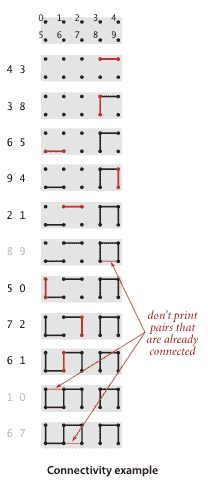
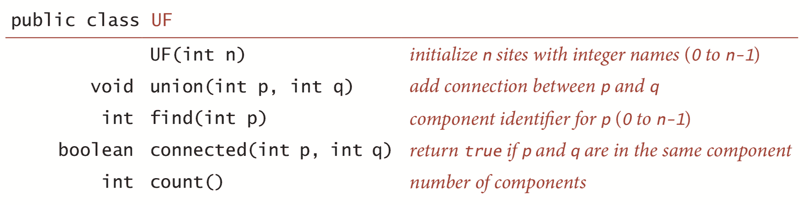
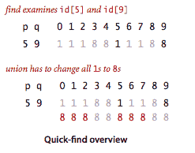
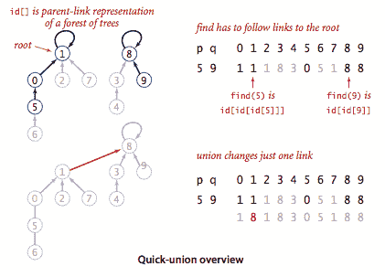
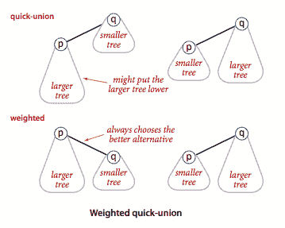
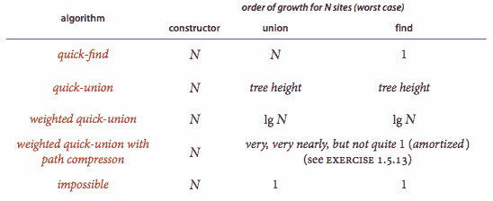

# 1.5   案例研究：并查集

> 原文：[`algs4.cs.princeton.edu/15uf`](https://algs4.cs.princeton.edu/15uf)



## 动态连通性。

输入是一系列整数对，其中每个整数表示某种类型的对象，我们将解释对`p q`为`p`连接到`q`。我们假设“连接到”是一个*等价关系*：

+   *对称性*：如果`p`连接到`q`，那么`q`连接到`p`。

+   *传递性*：如果`p`连接到`q`且`q`连接到`r`，那么`p`连接到`r`。

+   *自反性*：`p`连接到`p`。

等价关系将对象划分为*等价类*或*连通分量*。

我们的目标是编写一个程序来过滤序列中的多余对：当程序从输入中读取一对`p q`时，只有当它到目前为止看到的对不意味着`p`连接到`q`时，它才将这对写入输出。如果之前的对确实意味着`p`连接到`q`，那么程序应忽略这对`p q`并继续读取下一对。

## 并查集 API。

以下 API 封装了我们需要的基本操作。

为了测试 API 的实用性，UF.java 中的`main()`解决了动态连通性问题。我们还准备了测试数据：文件 tinyUF.txt 包含我们小例子中使用的 11 个连接，文件 mediumUF.txt 包含 900 个连接，文件 largeUF.txt 是一个包含数百万连接的示例。

## 实现。

我们现在考虑几种不同的实现方式，都基于使用一个站点索引数组`id[]`来确定两个站点是否在同一个组件中。

+   *快速查找.* QuickFindUF.java 维护了这样一个不变量：当且仅当`id[p]`等于`id[q]`时，`p`和`q`连接。换句话说，组件中的所有站点在`id[]`中必须具有相同的值。

+   *快速联合.* QuickUnionUF.java 基于相同的数据结构——站点索引`id[]`数组，但它使用了不同的值解释，导致更复杂的结构。具体来说，每个站点的`id[]`条目将是同一组件中另一个站点的名称（可能是它自己）。为了实现`find()`，我们从给定站点开始，沿着它的链接到另一个站点，再沿着那个站点的链接到另一个站点，依此类推，一直沿着链接直到到达一个根节点，一个有链接指向自身的站点。只有当这个过程将它们导向相同的根节点时，两个站点才在同一个组件中。为了验证这个过程，我们需要`union()`来维护这个不变量，这很容易安排：我们沿着链接找到与每个给定站点相关联的根节点，然后通过将其中一个根节点链接到另一个根节点来重命名一个组件。

+   *加权快速联合.* 在快速联合算法中，为了`union()`将第二棵树任意连接到第一棵树，我们跟踪每棵树的大小，并始终将较小的树连接到较大的树。程序 WeightedQuickUnionUF.java 实现了这种方法。

+   *带路径压缩的加权快速联合.* 有许多简单的方法可以进一步改进加权快速联合算法。理想情况下，我们希望每个节点直接链接到其树的根节点，但我们不想付出改变大量链接的代价。我们可以通过使我们直接检查的所有节点直接链接到根节点来接近理想状态。

## 并查集成本模型。

在研究并查集算法时，我们计算*数组访问次数*（访问数组条目的次数，用于读取或写入）。

### 定义。

树的*大小*是其节点数。树中节点的*深度*是从节点到根的路径上的链接数。树的*高度*是其节点中的最大深度。

### 命题。

快速查找算法对每次`find()`调用使用一个数组访问，并且对于每次将两个组件合并的`union()`调用，数组访问次数在*n* + 3 和 2*n* + 1 之间。

### 命题。

在快速联合中，`find()`所使用的数组访问次数为 1 加上节点深度的两倍，该节点对应给定站点。`union()`和`connected()`所使用的数组访问次数为两个`find()`操作的成本（如果给定站点在不同树中，则`union()`还需加 1）。

### 命题。

由加权快速联合构建的森林中任何节点的深度最多为 lg *n*。

### 推论。

对于具有*n*个站点的加权快速联合，`find()`、`connected()`和`union()`的最坏情况成本增长顺序为 log *n*。

#### 问与答

**Q.** 是否有一种有效的数据结构，支持边的插入和删除？

**A.** 是的。然而，用于图连接性的已知最佳*完全动态*数据结构比我们考虑的*增量*版本复杂得多。此外，它的效率也不如增量版本。参见 Mikkel Thorup 的[Near-optimal fully-dynamic graph connectivity](http://www.cs.princeton.edu/courses/archive/spr10/cos423/handouts/NearOpt.pdf)。

#### 练习

1.  开发类 QuickUnionUF.java 和 QuickFindUF.java，分别实现快速联合和快速查找。

1.  给出一个反例，说明快速查找的`union()`的这种直观实现是不正确的：

    ```java
    public void union(int p, int q) {
       if (connected(p, q)) return;
       for (int i = 0; i < id.length; i++)
          if (id[i] == id[p]) id[i] = id[q];
       count--;
    }

    ```

    *答案.* 在 for 循环中，`id[p]`的值会改变为`id[q]`。因此，任何`r` > `p`且`id[r]`等于`id[p]`的对象都不会被更新为等于`id[q]`。

1.  在加权快速联合实现中，假设我们将`id[root(p)]`设置为`q`而不是`id[root(q)]`。得到的算法是否正确？

    *答案.* 是的。然而，这会增加树的高度，因此性能保证将无效。

#### 创意问题

1.  **带路径压缩的快速联合。** 修改 QuickUnionUF.java 以包括*路径压缩*，通过在`find()`中添加一个循环，将从 p 到根的路径上的每个站点连接起来。给出一系列输入对，使得该方法产生长度为 4 的路径。*注意*：该算法的摊销成本每次操作已知为对数级别。

    *解决方案.* QuickUnionPathCompressionUF.java。

1.  **带路径压缩的加权快速联合。** 修改 WeightedQuickUnionUF.java 以实现路径压缩，如练习 1.5.12 所述。给出一系列输入对，使得该方法产生高度为 4 的树。

    *注意*：该算法的摊销成本每次操作已知受到称为*反阿克曼函数*的函数的限制，对于实践中出现的任何可想象的*n*值，该函数均小于 5。

    *解决方案.* WeightedQuickUnionPathCompressionUF.java。

1.  **按高度加权快速联合。** 开发一个实现 WeightedQuickUnionByHeightUF.java 的算法，该算法使用与加权快速联合相同的基本策略，但跟踪树高度并始终将较短的树链接到较高的树。证明对于*n*个站点，您的算法对树的高度有对数上界。

    *解决方案.* 不同树中元素之间的联合操作要么保持高度不变（如果两棵树的高度不同），要么增加一次高度（如果两棵树的高度相同）。你可以通过归纳证明树的大小至少为 2^高度。因此，高度最多可以增加 lg *n*次。

1.  **随机连接**。开发一个`UF`客户端 ErdosRenyi.java，接受一个整数命令行参数*n*���在 0 到*n*之间生成随机整数对，调用`connected()`确定它们是否连接，如果没有连接则调用`union()`（与我们的开发客户端相同），循环直到所有站点连接，并打印生成的连接数。将程序打包为一个以*n*为参数的静态方法`count()`，返回连接数和一个从命令行获取*n*的`main()`，调用`count()`，并打印返回的值。

#### 网页练习

1.  真或假。在快速联合实现中，假设我们将`parent[p]`设置为`parent[root(q)]`而不是将`parent[root(p)]`设置为`parent[root(q)]`，得到的算法是否正确？

    *答案*。不。

1.  在执行带路径压缩的加权快速联合时，以下哪个数组不可能出现：

    1.  0 1 2 3 4 5 6 7 8 9

    1.  7 3 8 3 4 5 6 8 8 1

    1.  6 3 8 0 4 5 6 9 8 1

    1.  0 0 0 0 0 0 0 0 0 0

    1.  9 6 2 6 1 4 5 8 8 9

    1.  9 8 7 6 5 4 3 2 1 0

    *解决方案*。B、C、E 和 F。

1.  **递归路径压缩**。使用递归实现路径压缩。

    *解决方案*：

    ```java
    public int find(int p) {
       if (p != parent[p])
           parent[p] = find(parent[p]);
       return parent[p];

    ```

1.  **路径减半**。编写一个数据类型 QuickUnionPathHalvingUF.java，实现一种更简单的策略，称为*路径减半*，使得查找路径上的每个其他节点都链接到其祖父节点。*备注*：该算法每次操作的摊销成本被限制在一个称为*反阿克曼函数*的函数中。

1.  **路径分裂**。编写一个数据类型 WeightedQuickUnionPathSplittingUF.java，实现一种称为*路径分裂*的替代策略，使得查找路径上的每个节点都链接到其祖父节点。*备注*：该算法每次操作的摊销成本被限制在一个称为*反阿克曼函数*的函数中。

1.  **随机快速联合**。实现以下版本的快速联合：将整数 0 到 n-1 均匀随机分配给 n 个元素。在链接两个根时，始终将具有较小标签的根链接到具有较大标签的根。添加路径压缩。*备注*：没有路径压缩版本的每次操作的期望成本是对数级的；具有路径压缩版本的每次操作的期望摊销成本被限制在一个称为*反阿克曼函数*的函数中。

1.  **3D 位置渗透**。对 3D 晶格重复。阈值约为 0.3117。

1.  **键合渗透**。与位置渗透相同，但是随机选择边而不是位置。真实阈值恰好为 0.5。

1.  给定一组 N 个元素，创建一个 N 个联合操作的序列，使得带权重的快速联合的高度为 Theta(log N)。对带路径压缩的带权重快速联合重复。

1.  **六角形**。六角形游戏在一个梯形六边形网格上进行...描述如何检测白色或黑色何时赢得游戏。使用并查集数据结构。

1.  **六角形**。证明游戏不可能以平局结束。*提示*：考虑从棋盘左侧可达的单元格集合。

1.  **六角形**。证明第一个玩家可以通过完美的游戏获胜。*提示*：如果第二个玩家有一个获胜策略，你可以最初选择一个随机单元格，然后只需复制第二个玩家的获胜策略。这被称为*策略窃取*。

1.  **在网格上标记聚类。** 物理学家将其称为[Hoshen–Kopelman 算法](https://en.wikipedia.org/wiki/Hoshen–Kopelman_algorithm)，尽管它只是在栅格图上进行的并查集算法，按照栅格扫描顺序进行。 应用包括模拟渗透和电导。 绘制站点占用概率与聚类数量的关系（比如 100x100，p 在 0 到 1 之间，聚类数量在 0 到 1500 之间）或聚类分布。（似乎 DFS 在这里就足够了）Matlab 在图像处理工具箱中有一个名为`bwlabel`的函数，用于执行聚类标记。
