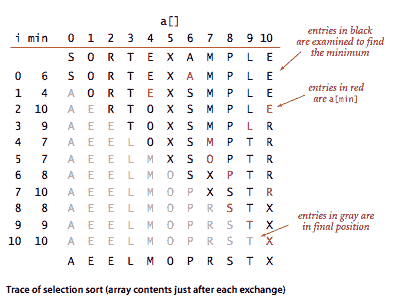
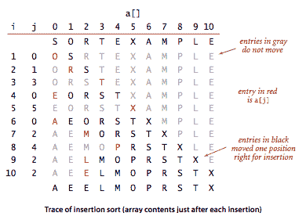
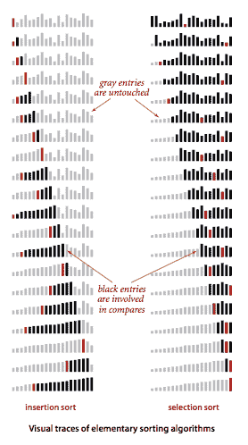
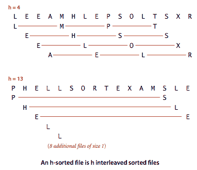
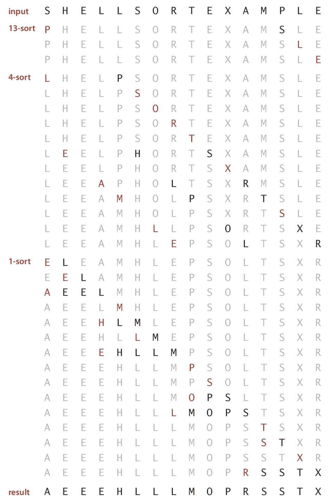
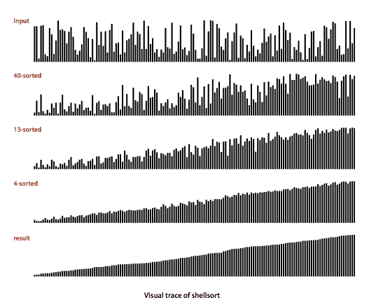
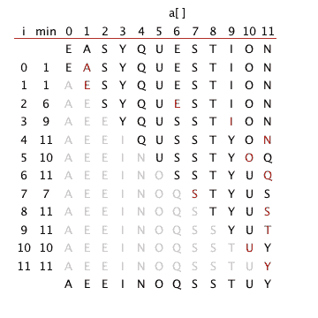
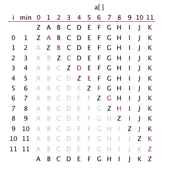
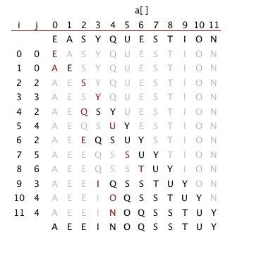
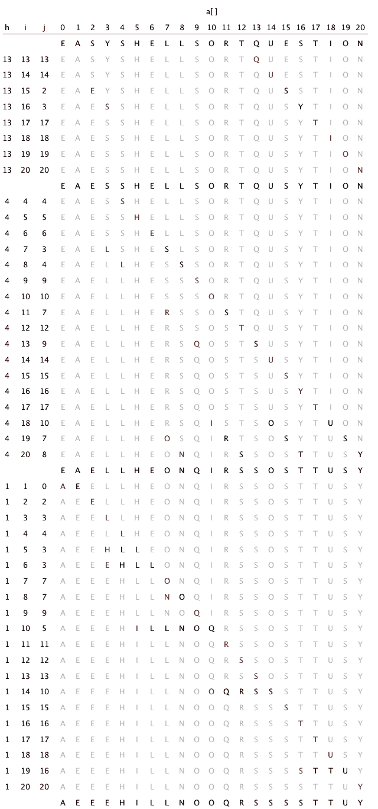

# 2.1   基本排序

> 原文：[`algs4.cs.princeton.edu/21elementary`](https://algs4.cs.princeton.edu/21elementary)
> 
> 译者：[飞龙](https://github.com/wizardforcel)
> 
> 协议：[CC BY-NC-SA 4.0](https://creativecommons.org/licenses/by-nc-sa/4.0/)


在本节中，我们将学习两种基本的排序方法（选择排序和插入排序）以及其中一种的变体（希尔排序）。

## 游戏规则。

我们的主要关注点是重新排列包含*关键字*的项目数组的算法，目标是重新排列项目，使它们的关键字按升序排列。在 Java 中，关键字的抽象概念在内置机制中���现为`Comparable`接口。除了少数例外，我们的排序代码只通过两个操作引用数据：比较对象的方法`less()`和交换它们的方法`exch()`。

```java
private static boolean less(Comparable v, Comparable w) {
   return (v.compareTo(w) < 0);
}

private static void exch(Comparable[] a, int i, int j) {
   Comparable swap = a[i];
   a[i] = a[j];
   a[j] = swap;
} 

```

+   *排序成本模型。*在研究排序算法时，我们计算*比较*和*交换*。对于不使用交换的算法，我们计算*数组访问*。

+   *额外内存。*我们考虑的排序算法分为两种基本类型：一种是*原地*排序（除了可能需要一小段函数调用堆栈或常数数量的实例变量外，不需要额外内存），另一种是需要足够额外内存来保存另一个要排序的数组的副本。

+   *数据类型。*我们的排序代码适用于实现 Java 的[Comparable 接口](http://download.oracle.com/javase/6/docs/api/java/lang/Comparable.html)的任何数据类型。这意味着存在一个`compareTo()`方法，其中`v.compareTo(w)`在 v < w 时返回负整数，在 v = w 时返回零，在 v > w 时返回正整数。该方法必须实现*全序*：

    +   *自反性：*对于所有的 v，v = v。

    +   *反对称性：*对于所有的 v 和 w，如果(v < w)，那么(w > v)；如果(v = w)，那么(w = v)。

    +   *传递性：*对于所有的 v、w 和 x，如果(v ≤ w)且(w ≤ x)，那么 v ≤ x。

    此外，如果`v`和`w`是不兼容类型或其中任何一个为`null`，`v.compareTo(w)`必须抛出异常。

    Date.java 演示了如何为用户定义的类型实现`Comparable`接口。

## 选择排序。

最简单的排序算法之一的工作方式如下：首先，在数组中找到最小的项，并将其与第一个条目交换。然后，找到下一个最小的项并将其与第二个条目交换。继续这样做，直到整个数组排序完成。这种方法被称为*选择排序*，因为它通过重复选择剩余的最小项来工作。Selection.java 是这种方法的实现。

### 命题。

选择排序使用~n²/2 次比较和 n 次交换来对长度为 n 的数组进行排序。

## 插入排序。

人们经常用来排序桥牌的算法是逐个考虑卡片，将每张卡片插入到已考虑的卡片中的适当位置（保持它们排序）。在计算机实现中，我们需要为当前项目腾出空间，通过将较大的项目向右移动一个位置，然后将当前项目插入到空出的位置。Insertion.java 是这种方法的实现，称为*插入排序*。

### 命题。

对于具有不同键的长度为 N 的随机排序数组，插入排序平均使用~N²/4 次比较和~N²/4 次交换。最坏情况下，使用~N²/2 次比较和~N²/2 次交换，最佳情况下是 N-1 次比较和 0 次交换。

插入排序对于某些在实践中经常出现的非随机数组非常有效，即使它们很大。*逆序对*是数组中顺序不正确的一对关键字。例如，E X A M P L E 有 11 个逆序对：E-A、X-A、X-M、X-P、X-L、X-E、M-L、M-E、P-L、P-E 和 L-E。如果数组中的逆序对数量小于数组大小的常数倍，则称该数组是*部分排序*的。

### 命题。

插入排序使用的交换次数等于数组中的逆序数，比较次数至少等于逆序数，最多等于逆序数加上数组大小。

### 属性。

对于具有不同值的随机排序数组，插入排序和选择排序的运行时间是二次的，并且彼此之间相差一个小的常数因子。

SortCompare.java 使用命令行参数中命名的类中的`sort()`方法执行给定数量的实验（对给定大小的数组进行排序），并打印算法观察运行时间的比率。

## 可视化排序算法。

我们使用简单的可视化表示来描述排序算法的属性。我们使用垂直条形图，按其高度排序。SelectionBars.java 和 InsertionBars.java 生成这些可视化效果。

## 希尔排序。

希尔排序是插入排序的简单扩展，通过允许远离的条目进行交换，以产生部分排序的数组，最终可以通过插入排序高效地排序。其思想是重新排列数组，使其具有这样的属性：取每个第 h 个条目（从任何位置开始）会产生一个排序序列。这样的数组称为*h-排序*。通过对一些大的 h 值进行 h-排序，我们可以将数组中的条目移动到较远的距离，从而使得对较小的 h 值进行 h-排序更容易。对于以 1 结尾的任何增量序列的值使用这种过程将产生一个排序的数组：这就是希尔排序。Shell.java 是这种方法的实现。

ShellBars.java 生成希尔排序的可视化效果。



### 属性。

使用增量为 1、4、13、40、121、364 的希尔排序所使用的比较次数受到 N 的倍数限制，与使用的增量数量成正比。

### 命题。

使用增量为 1、4、13、40、121、364 的希尔排序所使用的比较次数为 O(N^(3/2))。

#### 问与答

**Q.** 当我编译 Insertion.java 时，编译器会发出警告。有没有办法避免这种情况？

```java
Insertion.java:73: warning: [unchecked] unchecked call to compareTo(T)
                   as a member of the raw type java.lang.Comparable
        return (v.compareTo(w) < 0);

```

**A.** 是的，如果使用静态泛型，就像 InsertionPedantic.java 一样。这会导致笨拙（但无警告）的代码。

#### 练习

1.  以选择排序示例跟踪的方式展示选择排序如何对数组进行排序。

    ```java
    E A S Y Q U E S T I O N

    ```

    *解决方案。*

    > 

1.  在选择排序中涉及任何特定项目的最大交换次数是多少？涉及特定项目 x 的平均交换次数是多少？

    *解决方案。* 平均交换次数恰好为 2，因为总共有 n 次交换和 n 个项目（每次交换涉及两个项目）。最大交换次数为 n，如下例所示。

    > 

1.  以插入排序示例跟踪的方式展示插入排序如何对数组进行排序。

    ```java
    E A S Y Q U E S T I O N

    ```

    *解决方案。*

    > 

1.  对于所有键相同的数组，选择排序和插入排序哪个运行速度更快？

    *解决方案。* 当所有键相等时，插入排序运行时间为线性时间。

1.  假设我们在一个随机排序的数组上使用插入排序，其中项目只有三个键值之一。运行时间是线性的、二次的还是介于两者之间的？

    *解决方案。* 二次的。

1.  以希尔排序示例跟踪的方式展示希尔排序如何对数组进行排序。

    ```java
    E A S Y S H E L L S O R T Q U E S T I O N

    ```

    *解决方案。*

    > 

1.  为什么在希尔排序的*h*排序中不使用选择排序？

    *解决方案。* 插入排序在部分排序的输入上更快。

#### 创意问题

1.  **昂贵的交换。** 一家运输公司的职员负责按照要运出的时间顺序重新排列一些大箱子。因此，相对于交换的成本（移动箱子），比较的成本非常低（只需查看标签）。仓库几乎满了：有足够的额外空间来容纳任何一个箱子，但不能容纳两个。职员应该使用哪种排序方法？

    *解决方案。* 使用选择排序，因为它最小化了交换的次数。

1.  **可视化跟踪。** 修改你对上一个练习的解决方案，使 Insertion.java 和 Selection.java 产生类似本节中所示的可视化跟踪。

    *解决方案。* TraceInsertion.java、TraceSelection.java 和 TraceShell.java。

1.  **可比较的交易。** 扩展你的 Transaction.java 实现，使其实现`Comparable`，使得交易按金额顺序排列。

1.  **交易排序测试客户端。** 编写一个类 SortTransactions.java，其中包含一个静态方法`main()`，从标准输入读取一系列交易，对其进行排序，并在标准输出上打印结果。

#### 实验

1.  **带哨兵的插入排序。** 开发一个插入排序的实现 InsertionX.java，通过首先将最小的项目放入位置来消除内部循环中的 j > 0 测试。使用 SortCompare.java 来评估这样做的有效性。*注意*：通常可以通过这种方式避免索引越界测试——使测试能够被消除的项目称为*哨兵*。

1.  **无交换的插入排序。** 开发一个插入排序的实现 InsertionX.java，将较大的项目向右移动一个位置，而不是进行完整的交换。使用 SortCompare.java 来评估这样做的有效性。

#### 网络练习

1.  **排序网络。** 编写一个程序 Sort3.java，其中有三个`if`语句（没有循环），从命令行读取三个整数*a*、*b*和*c*，并按升序打印它们。

    ```java
    if (a > b) swap a and b
    if (a > c) swap a and c
    if (b > c) swap b and c

    ```

1.  **无视排序网络。** 说服自己，以下代码片段重新排列存储在变量 A、B、C 和 D 中的整数，使得 A <= B <= C <= D。

    ```java
    if (A > B) { t = A; A = B; B = t; }
    if (B > C) { t = B; B = C; C = t; }
    if (A > B) { t = A; A = B; B = t; }
    if (C > D) { t = C; C = D; D = t; }
    if (B > C) { t = B; B = C; C = t; }
    if (A > B) { t = A; A = B; B = t; }
    if (D > E) { t = D; D = E; E = t; }
    if (C > D) { t = C; C = D; D = t; }
    if (B > C) { t = B; B = C; C = t; }
    if (A > B) { t = A; A = B; B = t; }

    ```

    设计一系列语句，可以对 5 个整数���行排序。你的程序使用了多少个`if`语句？

1.  **最佳的无视排序网络。** 创建一个程序，使用仅 5 个`if`语句对四个整数进行排序，以及使用仅 9 个上述类型的`if`语句对五个整数进行排序？无视排序网络对于在硬件中实现排序算法很有用。如何检查你的程序对所有输入都有效？

    *答案：* Sort4.java 使用 5 个比较交换对 4 个项目进行排序。Sort5.java 使用 9 个比较交换对 5 个项目进行排序。

    [0-1 原则](http://en.wikipedia.org/wiki/Sorting_network)说，你可以通过检查一个（确定性的）排序网络是否正确地对由 0 和 1 组成的输入进行排序来验证其正确性。因此，要检查`Sort5.java`是否有效，你只需要在 32 个可能的由 0 和 1 组成的输入上测试它。

1.  **最佳的无视排序（具有挑战性）。** 找到一个针对 6、7 和 8 个输入的最佳排序网络，分别使用 12、16 和 19 个上一个问题中形式的`if`语句。

    答案：Sort6.java 是对 6 个项目进行排序的解决方案。

1.  **最佳非盲目排序。** 编写一个程序，仅使用 7 次比较对 5 个输入进行排序。*提示*：首先比较前两个数字，然后比较后两个数字，以及两组中较大的数字，并标记它们，使得 a < b < d 和 c < d。其次，将剩余的项目 e 插入到链 a < b < d 中的适当位置，首先与 b 进行比较，然后根据结果与 a 或 d 进行比较。第三，以与插入 e 相同的方式将 c 插入到涉及 a、b、d 和 e 的链中的适当位置（知道 c < d）。这使用了 3（第一步）+ 2（第二步）+ 2（第三步）= 7 次比较。这种方法最初是由 H.B. Demuth 在 1956 年发现的。

1.  **Stupidsort。** 分析以下排序算法的运行时间（最坏情况和最佳情况）、正确性和稳定性。从左到右扫描数组，直到找到两个连续的位置不正确的项。交换它们，并从头开始。重复直到扫描到数组的末尾。

    ```java
    for (int i = 1; i < N; i++) {
       if (less(a[i], a[i-1])) {
          exch(i, i-1);
          i = 0;
       }
    }

    ```

    考虑以下递归变体并分析最坏情况下的内存使用情况。

    ```java
    public static void sort(Comparable[] a) {
       for (int i = 1; i < a.length; i++) {
          if (less(a[i], a[i-1])) {
             exch(i, i-1);
             sort(a);
          }
       }
    }

    ```

1.  **Stoogesort。** 分析以下递归排序算法的运行时间和正确性：如果最左边的项大于最右边的项，则交换它们。如果当前子数组中有 2 个或更多项，(i) 递归地对数组的前两个三分之一进行排序，(ii) 对数组的最后两个三分之一进行排序，(iii) 再次对数组的前两个三分之一进行排序。

1.  **猜测排序。** 随机选择两个索引 i 和 j；如果 a[i] > a[j]，则交换它们。重复直到输入排序。分析此算法的预期运行时间。*提示*：每次交换后，逆序的数量会严格减少。如果有 m 个坏对，那么找到一个坏对的预期时间为 Theta(n²/m)。从 m = 1 到 n² 求和得到 O(N² log N)的总体时间，类似于收集优惠券。这个界限是紧的：考虑输入 1 0 3 2 5 4 7 6 ...

1.  **Bogosort。** Bogosort 是一种随机算法，通过将 N 张卡片抛起来，收集它们，并检查它们是否以递增顺序排列。如果没有，重复直到它们排好序。使用第 1.4 节中的洗牌算法实现 bogosort。估计运行时间作为 N 的函数。

1.  **慢速排序。** 考虑以下排序算法：随机选择两个整数 i 和 j。如果 i < j，但 a[i] > a[j]，则交换它们。重复直到数组按升序排列。论证该算法最终会完成（概率为 1）。作为 N 的函数，它需要多长时间？*提示*：在最坏情况下，它会进行多少次交换？

1.  **对数组进行排序的最小移动次数。** 给定一个包含 N 个键的列表，*移动操作*包括从列表中移除任意一个键并将其附加到列表的末尾。不允许其他操作。设计一个算法，使用最少的移动次数对给定列表进行排序。

1.  **猜测排序。** 考虑以下基于交换的排序算法：随机选择两个索引；如果 a[i]和 a[j]是一个逆序，交换它们；重复。证明对大小为 N 的数组进行排序的预期时间最多为 N² log N。参见[此论文](http://www.sciencedirect.com/science/article/pii/S0166218X04001131?np=y)进行分析，以及称为 Fun-Sort 的相关排序算法。

1.  **交换一个逆序。** 给定一个包含 N 个键的数组，设 a[i]和 a[j]是一个逆序（i < j 但 a[i] > a[j]）。证明或证伪：交换 a[i]和 a[j]会严格减少逆序的数量。

1.  **二进制插入排序。** 开发一个实现 BinaryInsertion.java 的插入排序，该排序使用二分查找来找到插入点 j 以便将条目 a[i]插入，然后将所有条目 a[j]到 a[i-1]向右移动一个位置。在最坏情况下，对长度为 n 的数组进行排序的比较次数应该约为~ n lg n。请注意，在最坏情况下，数组访问次数仍然是二次的。使用 SortCompare.java 来评估这样做的有效性。
