# 2.3   快速排序

> 原文：[`algs4.cs.princeton.edu/23quicksort`](https://algs4.cs.princeton.edu/23quicksort)

快速排序很受欢迎，因为它不难实现，适用于各种不同类型的输入数据，并且在典型应用中比任何其他排序方法都要快得多。它是原地排序（仅使用一个小型辅助栈），平均需要时间与 N log N 成正比来对 N 个项进行排序，并且具有极短的内部循环。

## 基本算法。

快速排序是一种分而治之的排序方法。它通过*分区*数组为两部分，然后独立对这两部分进行排序。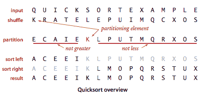方法的关键在于分区过程，该过程重新排列数组以满足以下三个条件：

+   条目`a[j]`在数组中处于最终位置，对于某个`j`。

+   `a[lo]`到`a[j-1]`中没有任何条目大于`a[j]`。

+   `a[j+1]`到`a[hi]`中没有任何条目小于`a[j]`。

我们通过分区实现完整排序，然后递归地将该方法应用于子数组。这是一种*随机化*算法，因为它在对数组进行排序之前对数组进行随机洗牌。

### 分区。

要完成实现，我们需要实现分区方法。我们采用以下一般策略：首先，我们任意选择`a[lo]`作为分区项—即将进入最终位置的项。接下来，我们从数组的左端开始扫描，直到找到一个大于（或等于）分区项的条目，然后我们从数组的右端开始扫描，直到找到一个小于（或等于）分区项的条目。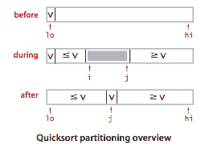停止扫描的两个条目在最终分区数组中是不正确的，因此我们交换它们。当扫描索引交叉时，为了完成分区过程，我们只需将分区项`a[lo]`与左子数组的最右边的条目（`a[j]`）交换并返回其索引`j`。

### 快速排序。

Quick.java 是一个使用上述分区方法的快速排序实现。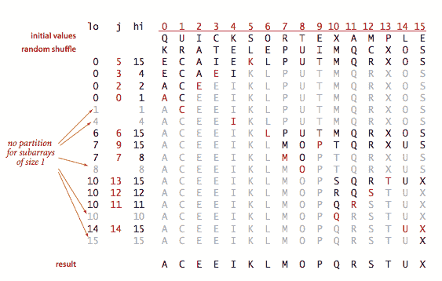

### 实现细节。

在实现快速排序方面存在一些微妙的问题，这些问题反映在这段代码中，并值得一提。

+   *原地分区。* 如果我们使用额外的数组，分区就很容易实现，但并不比将分区版本复���回原始数组的额外成本值得。

+   *保持边界。* 如果数组中最小项或最大项是分区项，我们必须注意指针不要跑到数组的左端或右端。

+   *保持随机性。* 随机洗牌使数组处于随机顺序。由于它均匀对待子数组中的所有项，Quick.java 具有其两个子数组也处于随机顺序的特性。这一事实对算法的可预测性至关重要。保持随机性的另一种方法是在`partition()`中选择一个随机项进行分区。

+   *终止循环。* 正确测试指针是否交叉比起初看起来要棘手一些。一个常见的错误是忽略了数组可能包含其他与分区项相同值的键。

+   *处理具有与划分项目键相等的键的项目。* 最好停止扫描具有大于或等于划分项目键的键的项目的左扫描，以及停止扫描具有小于或等于划分项目键的键的项目的右扫描。尽管这种策略似乎会导致涉及具有与划分项目键相等的键的项目的不必要的交换，但这对于避免在某些典型应用程序中出现二次运行时间至关重要。

+   *终止递归。* 在实现快速排序时的一个常见错误是没有确保始终将一个项目放在正确位置，然后当划分项目恰好是数组中最大或最小的项目时，陷入无限递归循环。

### 命题。

快速排序平均使用~2 N ln N 次比较（和其中六分之一的交换）来对具有不同键的长度为 N 的数组进行排序。

### 命题。

快速排序在最坏情况下使用~N²/2 次比较，但随机洗牌可以防止这种情况发生。

运行时间的标准偏差约为 0.65 N，因此随着 N 的增长，运行时间趋于平均值，并且不太可能远离平均值。在您的计算机上对大数组进行排序时，快速排序使用二次比较的概率远小于您的计算机被闪电击中的概率！

### 改进。

快速排序是由 C. A. R. Hoare 于 1960 年发明的，并自那时以来一直被许多人研究和完善。

+   *切换到插入排序。* 与归并排序一样，对于微小数组，切换到插入排序是值得的。截断的最佳值取决于系统，但在大多数情况下，任何值在 5 到 15 之间可能都能很好地工作。

+   *三取样划分。* 改进快速排序性能的另一种简单方法是使用从数组中取出的一小部分项目的中位数作为划分项目。这样做将给出一个稍微更好的划分，但需要计算中位数的成本。事实证明，大部分可用的改进来自选择大小为 3 的样本（然后在中间项目上进行划分）。

## 可视化。

QuickBars.java 使用三取样划分和对小子数组进行截断的快速排序进行可视化。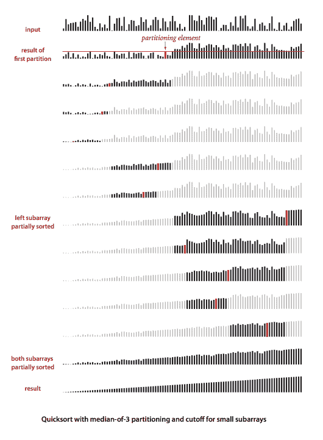

## 熵最优排序。

在应用程序中经常出现具有大量重复排序键的数组。在这种应用程序中，有可能将排序时间从线性对数减少到线性。

一个直接的想法是将数组划分为三部分，分别用于具有小于、等于和大于划分项目键的项目。完成这种划分是一个经典的编程练习，由 E. W. Dijkstra 推广为*荷兰国旗问题*，因为它类似于对具有三种可能键值的数组进行排序，这可能对应于国旗上的三种颜色。

Dijkstra 的解决方案基于数组的单向左到右遍历，维护指针`lt`，使得`a[lo..lt-1]`小于`v`，指针`gt`，使得`a[gt+1..hi]`大于`v`，指针`i`，使得`a[lt..i-1]`等于 v，`a[i..gt]`尚未检查。

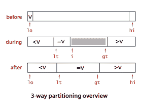

从`i`等于`lo`开始，我们使用`Comparable`接口给出的 3 路比较来处理`a[i]`，以处理三种可能的情况：

+   `a[i]`小于`v`：交换`a[lt]`和`a[i]`，并同时增加`lt`和`i`

+   `a[i]`大于`v`：交换`a[i]`和`a[gt]`，并减少`gt`

+   `a[i]`等于`v`：增加`i`

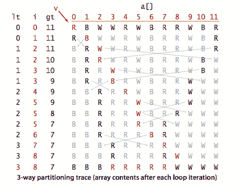

Quick3way.java 是这种方法的一个实现。

### 命题。

三路划分的快速排序是熵最优的。

## 可视化。

Quick3wayBars.java 可视化了使用三向切分的快速排序。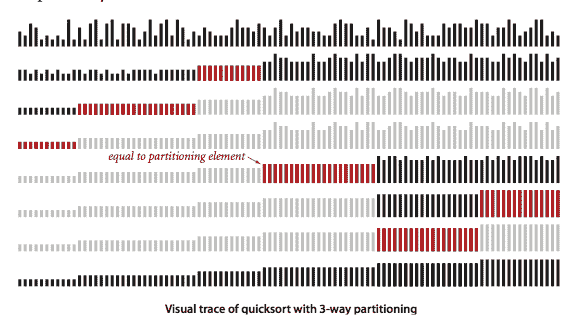

#### 练习

1.  展示`partition()`如何以`E A S Y Q U E S T I O N`数组进行划分的跟踪风格。

    > 

1.  展示快速排序如何对数组`E A S Y Q U E S T I O N`进行排序的快速排序跟踪风格。（在这个练习中，忽略初始洗牌。）

    > 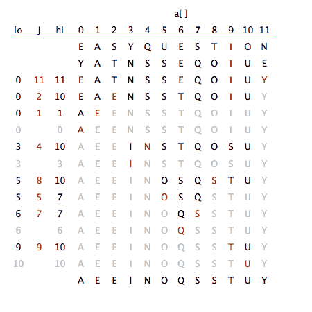

1.  编写一个程序 Sort2distinct.java，对已知只包含两个不同关键值的数组进行排序。

1.  当对一个包含 N 个相同项的数组进行排序时，`Quick.sort()`会进行多少次比较？

    *解决方案。* 〜 N lg N 次比较。每个划分将数组分成两半，加上或减去一个。

1.  展示熵最优排序如何首先对数组`B A B A B A B A C A D A B R A`进行划分的跟踪风格。

    > 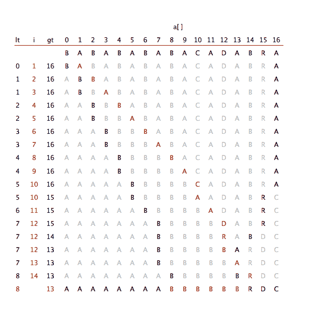

#### 创造性问题

1.  **螺母和螺栓。**（G. J. E. Rawlins）。你有一堆混合的 N 个螺母和 N 个螺栓，需要快速找到相应的螺母和螺栓配对。每个螺母恰好匹配一个螺栓，每个螺栓恰好匹配一个螺母。通过将螺母和螺栓配对，你可以看出哪个更大。但不能直接比较两个螺母或两个螺栓。给出一个解决问题的高效方法。

    *提示*：根据问题定制快速排序。顺便说一句：对于这个问题，已知只有一个非常复杂的确定性 O(N log N)算法。

1.  **最佳情况。** 编写一个程序 QuickBest.java，为`Quick.sort()`生成一个最佳情况数组（无重复项）：一个包含 N 个不同键的数组，具有每个划分产生的子数组大小最多相差 1 的特性（与 N 个相等键的数组产生相同子数组大小的情况相同）。在这个练习中，忽略初始洗牌。

    > 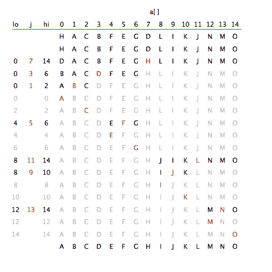

1.  **快速三向切分。**（J. Bentley 和 D. McIlroy）。实现一个基于保持相等键在子数组的左右两端的熵最优排序 QuickBentleyMcIlroy.java。维护索引 p 和 q，使得 a[lo..p-1]和 a[q+1..hi]都等于 a[lo]，一个索引 i，使得 a[p..i-1]都小于 a[lo]，一个索引 j，使得 a[j+1..q]都大于 a[lo]。在内部划分循环代码中添加代码，如果 a[i]等于 v，则交换 a[i]和 a[p]（并增加 p），如果 a[j]等于 v，则交换 a[j]和 a[q]（并减少 q），然后再进行通常的 a[i]和 a[j]与 v 的比较。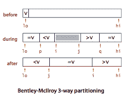在划分循环结束后，添加代码将相等的键交换到正确位置。

#### 网络练习

1.  QuickKR.java 是最简单的快速排序实现之一，并出现在 K+R 中。说服自己它是正确的。它将如何执行？所有相等的键呢？

1.  **随机化快速排序。** 修改`partition()`，使其总是从数组中均匀随机选择划分项（而不是最初对数组进行洗牌）。与 Quick.java 比较性能。

1.  **Antiquicksort.** Java 6 中用于对原始类型进行排序的算法是由 Bentley 和 McIlroy 开发的 3 路快速排序的变体。对于实践中出现的大多数输入，包括已经排序的输入，它非常高效。然而，使用 M. D. McIlroy 在 A Killer Adversary for Quicksort 中描述的巧妙技术，可以构造使系统排序在二次时间内运行的病态输入。更糟糕的是，它会溢出函数调用堆栈。要看到 Java 6 中的排序库崩溃，请尝试一些不同大小的致命输入：10,000, 20,000, 50,000, 100,000, 250,000, 500,000, 和 1,000,000。您可以使用程序 IntegerSort.java 进行测试，该程序接受一个命令行输入 N，从标准输入读取 N 个整数，并使用系统排序对它们进行排序。

1.  **糟糕的分区。** 当所有键相等时，不停止在相等键上会使快速排序变为二次的原因是什么？

    *解决方案。* 这是在我们在相等键上停止时对 AAAAAAAAAAAAAAA 进行分区的结果。它将数组不均匀地分成了一个大小为 0 的子问题和一个大小为 14 的子问题。

    > 

    这是在我们在相等键上停止时对 AAAAAAAAAAAAAAA 进行分区的结果。它将数组均匀地分成了两个大小为 7 的子问题。

    > 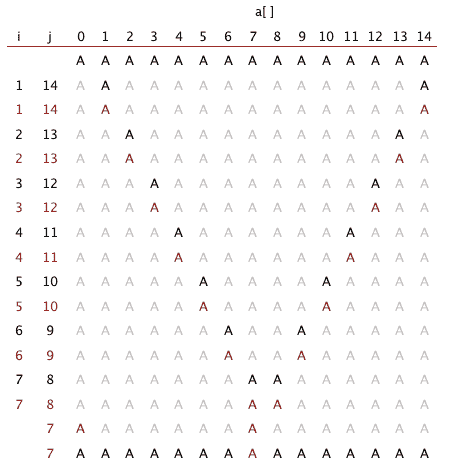

1.  **将项目与自身进行比较。** 展示我们的快速排序实现可以将项目与自身进行比较，即对某个索引 `i` 调用 `less(i, i)`。修改我们的实现，使其永远不会将项目与自身进行比较。

1.  **霍尔原始快速排序。** 实现霍尔原始快速排序算法的一个版本。它类似于我们的两路分区算法，只是枢轴不会交换到其最终位置。相反，枢轴留在两个子数组中的一个，没有元素固定在其最终位置，指针交叉的两个子数组会递归排序。

    *解决方案。* HoareQuick.java。我们注意到，虽然这个版本非常优雅，但它不会保留子数组中的随机性。根据 [Sedgewick 的博士论文](https://sedgewick.io/wp-content/themes/sedgewick/papers/1975Quicksort.pdf)，“这种偏差不仅使方法的分析几乎不可能，而且还会显著减慢排序过程。”

1.  **双轴快速排序。** 实现 Yaroslavskiy 的双轴快速排序的版本。

    *解决方案。* QuickDualPivot.java 是一个非常类似于 Quick3way.java 的实现。

1.  **三轴快速排序。** 实现类似 [Kushagra-Ortiz-Qiao-Munro](http://epubs.siam.org/doi/abs/10.1137/1.9781611973198.6) 的三轴快速排序的版本。

1.  **比较次数。** 给出一个长度为 n 的数组族，使得标准快速排序分区算法进行 (i) n + 1 次比较，(ii) n 次比较，(iii) n - 1 次比较，或者证明不存在这样的数组族。

    *解决方案*：升序；降序；无。
