# 2.4 优先队列

> 原文：[`algs4.cs.princeton.edu/24pq`](https://algs4.cs.princeton.edu/24pq)
> 
> 译者：[飞龙](https://github.com/wizardforcel)
> 
> 协议：[CC BY-NC-SA 4.0](https://creativecommons.org/licenses/by-nc-sa/4.0/)


许多应用程序要求我们按顺序处理具有键的项目，但不一定是完全排序的顺序，也不一定一次处理所有项目。通常，我们收集一组项目，然后处理具有最大键的项目，然后可能收集更多项目，然后处理具有当前最大键的项目，依此类推。在这种环境中，一个适当的数据类型支持两个操作：*删除最大*和*插入*。这样的数据类型称为*优先队列*。

## API。

优先队列的特点是*删除最大*和*插入*操作。按照惯例，我们将仅使用`less()`方法比较键，就像我们对排序所做的那样。因此，如果记录可以具有重复的键，*最大*意味着具有最大键值的*任何*记录。为了完善 API，我们还需要添加构造函数和*测试是否为空*操作。为了灵活性，我们使用一个实现了`Comparable`的通用类型`Key`的通用实现。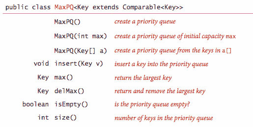

程序 TopM.java 是一个优先队列客户端，它接受一个命令行参数*M*，从标准输入读取交易，并打印出*M*个最大的交易。

## 基本实现。

我们在第 1.3 节中讨论的基本数据结构为我们提供了四个立即的实现优先队列的起点。

+   *数组表示（无序）。* 也许最简单的优先队列实现是基于我们的推入栈代码。优先队列中*插入*的代码与栈中的*推入*相同。要实现*删除最大*，我们可以添加类似于选择排序的内部循环的代码，将最大项与末尾的项交换，然后删除那个，就像我们对栈的`pop()`所做的那样。程序 UnorderedArrayMaxPQ.java 使用这种方法实现了一个优先队列。

+   *数组表示（有序）。* 另一种方法是添加*插入*的代码，将较大的条目向右移动一个位置，从而保持数组中的条目有序（就像插入排序一样）。因此，最大的项始终在末尾，优先队列中*删除最大*的代码与栈中的*弹出*相同。程序 OrderedArrayMaxPQ.java 使用这种方法实现了一个优先队列。

+   *链表表示（无序和反向有序）。* 类似地，我们可以从我们的推入栈的链表代码开始，修改`pop()`的代码以找到并返回最大值，或者修改`push()`的代码以保持项目以相反顺序，并修改`pop()`的代码以取消链接并返回列表中的第一个（最大）项目。

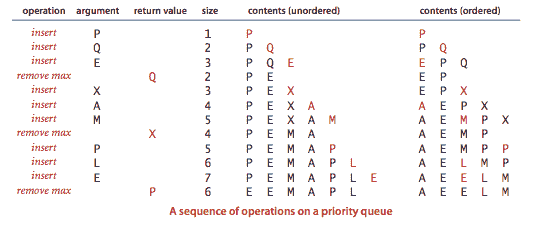

所有刚讨论的基本实现都具有*插入*或*删除最大*操作在最坏情况下需要线性时间的特性。找到一个保证两个操作都快速的实现是一个更有趣的任务，也是本节的主要内容。

## 堆定义。

*二叉堆*是一种数据结构，可以高效支持基本的优先队列操作。在二叉堆中，项目存储在一个数组中，使得每个键都保证大于（或等于）另外两个特定位置的键。反过来，这两个键中的每一个必须大于另外两个键，依此类推。如果我们将键视为在具有从每个键到已知较小键的两个键的边的二叉树结构中，这种排序是很容易看到的。

**定义。** 如果每个节点中的键大于（或等于）该节点的两个子节点（如果有的话）中的键，则二叉树是*堆有序*的。

**命题。** 堆有序二叉树中最大的键位于根节点。

我们可以对任何二叉树施加堆排序限制。然而，使用像下面这样的*完全*二叉树特别方便。

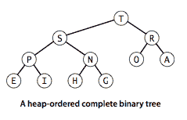我们通过*层级顺序*在数组中顺序表示完全二叉树，根位于位置 1，其子节点位于位置 2 和 3，它们的子节点位于位置 4、5、6 和 7，依此类推。

**定义。** *二叉堆*是一组按照完全堆排序的二叉树中的键排列的节点集合，在数组中按层级顺序表示（不使用第一个条目）。

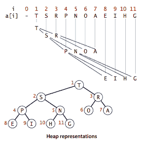

在堆中，位置为 k 的节点的父节点在位置 k/2；反之，位置为 k 的节点的两个子节点在位置 2k 和 2k + 1。我们可以通过对数组索引进行简单算术来上下移动：从 a[k] 向上移动树，我们将 k 设置为 k/2；向下移动树，我们将 k 设置为 2*k 或 2*k+1。

### 堆上的算法。

我们在长度为 *n* + 1 的私有数组 `pq[]` 中表示大小为 *n* 的堆，其中 `pq[0]` 未使用，堆在 `pq[1]` 到 `pq[n]` 中。我们仅通过私有辅助函数 `less()` 和 `exch()` 访问键。我们考虑的堆操作通过首先进行可能违反堆条件的简单修改，然后通���遍历堆，根据需要修改堆以确保堆条件在任何地方都得到满足来工作。我们将这个过程称为*重新堆化*，或*恢复堆顺序*。

+   *自底向上重新堆化（上浮）*。如果堆顺序被违反，因为一个节点的键变大于该节点的父节点的键，那么我们可以通过将节点与其父节点交换来向修复违规迈进。交换后，节点比其两个子节点都大（一个是旧父节点，另一个比旧父节点小，因为它是该节点的子节点），但节点可能仍然比其父节点大。我们可以以相同的方式修复该违规，依此类推，向上移动堆，直到到达具有较大键的节点，或根节点。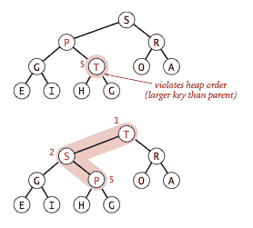

    ```java
    private void swim(int k) {
       while (k > 1 && less(k/2, k)) {
          exch(k, k/2);
          k = k/2;
       }
    }

    ```

+   *自顶向下堆化（下沉）*。如果堆顺序被违反，因为一个节点的键变小于一个或两个子节点的键，那么我们可以通过将节点与其两个子节点中较大的一个交换来向修复违规迈进。这种交换可能导致子节点违规；我们以相同的方式修复该违规，依此类推，向下移动堆，直到到达两个子节点都较小或底部的节点。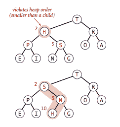

    ```java
    private void sink(int k) {
       while (2*k <= N) {
          int j = 2*k;
          if (j < N && less(j, j+1)) j++;
          if (!less(k, j)) break;
          exch(k, j);
          k = j;
       }
    }

    ```

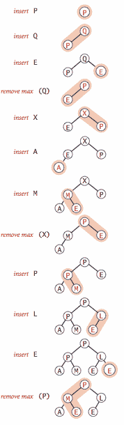

### 基于堆的优先队列。

这些 `sink()` 和 `swim()` 操作为优先队列 API 的高效实现提供了基础，如下图所示，并在 MaxPQ.java 和 MinPQ.java 中实现。

+   *插入*。我们在数组末尾添加新项，增加堆的大小，然后通过该项向上游走以恢复堆的条件。

+   *移除最大值*。我们将顶部的最大项取出，将堆的末尾项放在顶部，减少堆的大小，然后通过该项向下沉入堆中以恢复堆的条件。

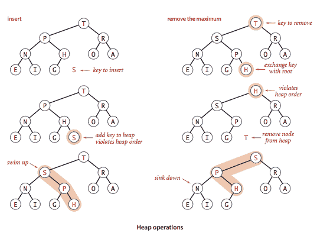

**命题。** 在一个包含 *n* 项的优先队列中，堆算法对*插入*最多需要 1 + lg *n* 次比较，对*移除最大值*最多需要 2 lg *n* 次比较。

### 实际考虑。

我们以几个实际考虑结束对堆优先队列 API 的研究。

+   *多路堆*。修改我们的代码以构建基于完整堆排序三元或*d*元树的数组表示并不困难。在降低树高度的较低成本和在每个节点找到三个或*d*个子节点中最大成本��间存在权衡。

+   *数组调整*。我们可以添加一个无参数构造函数，在`insert()`中添加数组加倍的代码，在`delMax()`中添加数组减半的代码，就像我们在第 1.3 节中为堆栈所做的那样。当优先队列的大小是任意的且数组被调整大小时，对数时间界是*摊销的*。

+   *键的不可变性*。优先队列包含由客户端创建的对象，但假设客户端代码不会更改键（这可能会使堆的不变性无效）。

+   *索引优先队列*。在许多应用中，允许客户端引用已经在优先队列中的项目是有意义的。一种简单的方法是为每个项目关联一个唯一的整数索引。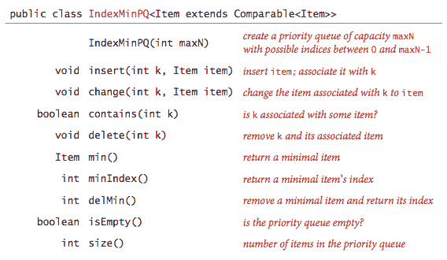

    IndexMinPQ.java 是这个 API 的基于堆的实现；IndexMaxPQ.java 类似，但用于面向最大的优先队列。Multiway.java 是一个客户端，将几个排序的输入流合并成一个排序的输出流。

## 堆排序。

我们可以使用任何优先队列来开发排序方法。我们将所有要排序的键插入到面向最小的优先队列中，然后重复使用*删除最小值*按顺序删除它们。当使用堆作为优先队列时，我们获得*堆排序*。

着眼于排序任务，我们放弃了隐藏优先队列的堆表示的概念，并直接使用`swim()`和`sink()`。这样做允许我们在不需要任何额外空间的情况下对数组进行排序，通过在要排序的数组内维护堆。堆排序分为两个阶段：*堆构造*，在这个阶段我们将原始数组重新组织成堆，和*sortdown*，在这个阶段我们按递减顺序从堆中取出项目以构建排序结果。

+   *堆构造*。我们可以在时间上按比例完成这项任务*n* lg *n*，通过从数组的左侧到右侧进行，使用`swim()`来确保扫描指针左侧的条目组成一个堆排序完整树，就像连续的优先队列插入一样。一个更有效的巧妙方法是从右到左进行，使用`sink()`来随着我们的前进制作子堆。数组中的每个位置都是一个小子堆的根；`sink()`也适用于这样的子堆。如果一个节点的两个子节点是堆，那么在该节点上调用`sink()`会使根在那里的子树成为堆。

+   *Sortdown*。在堆排序期间，大部分工作是在第二阶段完成的，在这个阶段我们从堆中移除剩余的最大项目，并将其放入数组位置中，随着堆的缩小而腾出。

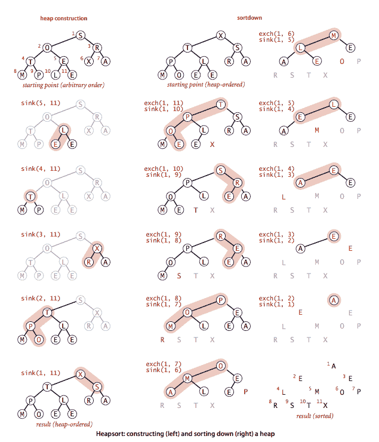

Heap.java 是堆排序的完整实现。下面是每次下沉后数组内容的跟踪。

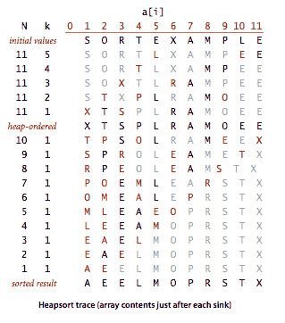

**命题。** 基于 sink 的堆构造是线性时间的。

**命题。** 堆排序使用少于 2 *n* lg *n* 次比较和交换来对 n 个项目进行排序。

在 sortdown 期间重新插入堆中的大多数项目都会一直到底部。因此，我们可以通过避免检查项目是否已到达其位置来节省时间，简单地提升两个子节点中较大的一个，直到到达底部，然后沿着堆向上移动到正确的位置。这个想法通过增加额外的簿记来减少了比较次数。

#### 练习

1.  假设序列

    ```java
    P R I O * R * * I * T * Y * * * Q U E * * * U * E

    ```

    （其中字母表示*插入*，星号表示*删除最大值*）应用于最初为空的优先队列。给出*删除最大值*操作返回的值序列。

    *解决方案*。R R P O T Y I I U Q E U（PQ 上剩下 E）

1.  批评以下想法：为了在常数时间内实现*查找最大值*，为什么不跟踪迄今为止插入的最大值，然后在*查找最大值*时返回该值？

    *解决方案*。在*删除最大值*操作后，需要从头开始更新最大值。

1.  提供支持*插入*和*删除最大值*的优先队列实现，每种实现对应一个基础数据结构：无序数组、有序数组、无序链表和有序链表。给出您在上一个练习中四种实现的每个操作的最坏情况下界的表格。

    *部分解决方案*。OrderedArrayMaxPQ.java 和 UnorderedArrayMaxPQ.java

1.  排序为降序的数组是否是面向最大值的堆。

    *答案*。是的。

1.  假设您的应用程序将有大量*插入*操作，但只有少量*删除最大值*操作。您认为哪种优先队列实现最有效：堆、无序数组、有序数组？

    *答案*。无序数组。插入是常数时间。

1.  假设您的应用程序将有大量*查找最大值*操作，但相对较少的*插入*和*删除最大值*操作。您认为哪种优先队列实现最有效：堆、无序数组、有序数组？

    *答案*。有序数组。在常数时间内找到最大值。

1.  在一个没有重复键的大小为*n*的堆中，*删除最大值*操作期间必须交换的最小项数是多少？给出一个大小为 15 的堆，使得最小值得以实现。对连续两次和三次*删除最大值*操作，回答相同的问题。

    *部分答案*：(a) 2。

1.  设计一个线性时间的认证算法来检查数组`pq[]`是否是一个面向最小值的堆。

    *解决方案*。参见 MinPQ.java 中的`isMinHeap()`方法。

1.  证明基于下沉的堆构建最多使用 2*n*次比较和最多*n*次交换。

    *解决方案*。只需证明基于下沉的堆构建使用的交换次数少于*n*次，因为比较次数最多是交换次数的两倍。为简单起见，假设二叉堆是*完美*的（即每一层都完全填满的二叉树）且高度为*h*。

    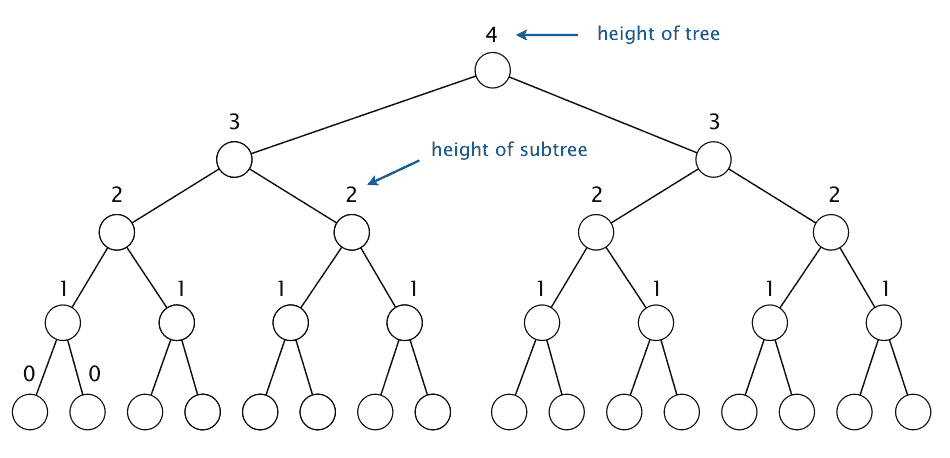

    我们定义树中节点的*高度*为以该节点为根的子树的高度。当一个高度为*k*的键被下沉时，它最多可以与其下面的*k*个键交换。由于在高度*k*处有 2^(*h*−*k*)个节点，总交换次数最多为：$$ \begin{eqnarray*} h + 2(h-1) + 4(h-2) + 8(h-3) + \ldots + 2^h (0) & = & 2^{h+1} - h - 2 \\ & = & n - (h+1) \\ & \le & n \end{eqnarray*} $$

    第一个等式是针对非标准求和的，但通过数学归纳法很容易验证该公式成立。第二个等式成立是因为高度为*h*的完美二叉树有 2^(*h*+1) − 1 个节点。

    证明当二叉树不完美时结果成立需要更加小心。您可以使用以下事实来证明：在具有*n*个节点的二叉堆中，高度为*k*的节点的数量最多为 ceil(*n* / 2^(*k*+1))。

    *替代解决方案*。我们定义树中节点的*高度*为以该节点为根的子树的高度。

    +   首先，观察到一个具有*n*个节点的二叉堆有*n* − 1 个链接（因为每个链接是一个节点的父节点，每个节点都有一个父链接，除了根节点）。

    +   下沉一个高度为*k*的节点最多需要*k*次交换。

    +   我们将对每个高度为*k*的节点收取*k*个链接，但不一定是在下沉节点时所采取的路径上的链接。相反，我们对从节点沿着左-右-右-右-...路径的*k*个链接收费。例如，在下图中，根节点收取 4 个红色链接；蓝色节点收取 3 个蓝色链接；依此类推。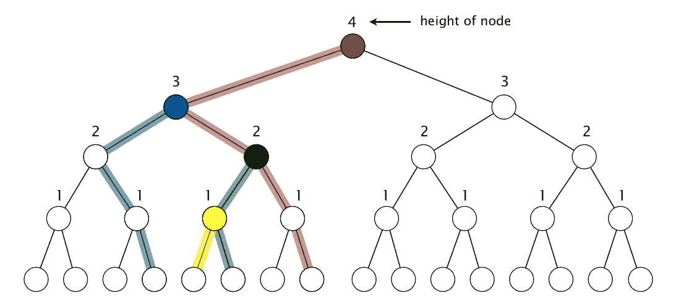

    +   注意，没有链接会被收费超过一个节点。（仅通过从根节点向右链接获得的链接不会被收费给任何节点。）

    +   因此，总交换次数最多为*n*。由于每次交换最多有 2 次比较，因此比较次数最多为 2*n*。

#### 创意问题

1.  **计算数论。** 编写一个程序 CubeSum.java，打印出所有形式为\(a³ + b³\)的整数，其中\(a\)和\(b\)是介于 0 和\(n\)之间的整数，按排序顺序打印，而不使用过多的空间。也就是说，不要计算一个包含\(n²\)个和并对它们进行排序的数组，而是构建一个最小导向的优先队列，最初包含\((0³, 0, 0), (1³ + 1³, 1, 1), (2³ + 2³, 2, 2), \ldots, (n³ + n³, n, n)\)。然后，在优先队列非空时，移除最小项\(i³ + j³,\; i, \; j)\)，打印它，然后，如果\(j < n\)，插入项\((i³ + (j+1)³,\; i,\; j+1)\)。使用这个程序找到所有介于 0 和\(10⁶\)之间的不同整数\(a, b, c\)和\(d\)，使得\(a³ + b³ = c³ + d³\)，例如\(1729 = 9³ + 10³ = 1³ + 12³\)。

1.  **查找最小值。** 在 MaxPQ.java 中添加一个`min()`方法。你的实现应该使用恒定的时间和额外的空间。

    *解决方案*：添加一个额外的实例变量，指向最小项。在每次调用`insert()`后更新它。如果优先队列变为空，则将其重置为`null`。

1.  **动态中位数查找。** 设计一个数据类型，支持对数时间的*插入*，常数时间的*查找中位数*，以及对数时间的*删除中位数*。

    *解决方案。* 将中位数键保留在 v 中；对于小于 v 键的键，使用一个最大导向的堆；对于大于 v 键的键，使用一个最小导向的堆。要插入，将新键添加到适当的堆中，用从该堆中提取的键替换 v。

1.  **下界。** 证明不可能开发一个 MinPQ API 的实现，使得插入和删除最小值都保证使用~*n* log log *n*比较。

    *解决方案。* 这将产生一个*n* log log *n*比较排序算法（插入*n*个项目，然后重复删除最小值），违反了第 2.3 节的命题。

1.  **索引优先队列实现。** 通过修改 MaxPQ.java 来实现 IndexMaxPQ.java：将`pq[]`更改为保存索引，添加一个数组`keys[]`来保存键值，并添加一个数组`qp[]`，它是`pq[]`的逆——`qp[i]`给出`i`在`pq[]`中的位置（索引`j`，使得`pq[j]`是`i`）。然后修改代码以维护这些数据结构。使用约定，如果`i`不在队列中，则`qp[i]`为`-1`，并包括一个测试此条件的方法`contains()`。您需要修改辅助方法`exch()`和`less()`，但不需��修改`sink()`或`swim()`。

#### 网络练习

1.  **堆排序的最佳、平均和最差情况。** 对于对长度为*n*的数组进行堆排序，最佳情况、平均情况和最差情况的比较次数分别是多少？

    *解决方案。* 如果允许重复项，最佳情况是线性时间（*n*个相等的键）；如果不允许重复项，最佳情况是~*n* lg *n*比较（但最佳情况输入是非平凡的）。平均情况和最差情况的比较次数是~2 *n* lg *n*比较。详细信息请参阅堆排序的分析。

1.  **堆化的最佳和最差情况。** 对于*n*个项目的数组进行堆化所需的最少和最多比较/交换次数是多少？

    *解决方案。* 对包含*n*个项目的数组进行降序堆化需要 0 次交换和*n* − 1 次比较。对包含*n*个项目的数组进行升序堆化需要~ *n*次交换和~ *2n*次比较。

1.  **出租车数。** 找到可以用两种不同方式的整数立方和表示的最小整数（1,729），三种不同方式（87,539,319），四种不同方式（6,963,472,309,248），五种不同方式（48,988,659,276,962,496），以及六种不同方式（24,153,319,581,254,312,065,344）。这样的整数被命名为[出租车数](http://mathworld.wolfram.com/TaxicabNumber.html)以纪念著名的拉马努金故事。目前尚不清楚可以用七种不同方式表示为整数立方和的最小整数。编写一个程序 Taxicab.java，该程序读取一个命令行参数 N，并打印出所有非平凡解 a³ + b³ = c³ + d³，其中 a、b、c 和 d 小于或等于 N。

1.  **计算数论。** 找到方程 a + 2b² = 3c³ + 4d⁴的所有解，其中 a、b、c 和 d 小于 100,000。*提示*：使用一个最小堆和一个最大堆。

1.  **中断处理。** 在编写可以被中断的实时系统时（例如，通过鼠标点击或无线连接），需要立即处理中断，然后再继续当前活动。如果中断应按照到达的顺序处理，则 FIFO 队列是适当的数据结构。然而，如果不同的中断具有不同的优先级（例如，），则需要优先级队列。

1.  **排队网络的模拟。** M/M/1 队列用于双并行队列等。数学上难以分析复杂的排队网络。因此使用模拟来绘制等待时间分布等。需要优先级队列来确定下一个要处理的事件。

1.  **Zipf 分布。** 使用前面练习的结果从具有参数 s 和*n*的[Zipf 分布](http://en.wikipedia.org/wiki/Zipf's_law)中进行抽样。该分布可以取 1 到*n*之间的整数值，并以概率 1/k^s / sum_(i = 1 to *n*) 1/i^s 取值 k。例如：莎士比亚的戏剧《哈姆雷特》中的单词，s 约等于 1。

1.  **随机过程。** 从*n*个箱子开始，每个箱子包含一个球。随机选择其中一个*n*个球，并将球随机移动到一个箱���中，使得球被放置在具有*m*个球的箱子中的概率为*m*/*n*。经过多次迭代后，结果是什么样的球分布？使用上述描述的随机抽样方法使模拟更有效率。

1.  **最近邻。** 给定长度为*m*的*n*个向量 x[1]、x[2]、...、x[N]和另一个相同长度的向量*x*，找到距离*x*最近的 20 个向量。

1.  **在一张图纸上画圆。** 编写一个程序来找到以原点为中心，与整数 x 和 y 坐标的 32 个点相切的圆的半径。提示：寻找一个可以用几种不同方式表示为两个平方和的数字。答案：有两个勾股三元组的斜边为 25：15² + 20² = 25²，7² + 24² = 25²，得到 20 个这样的格点；有 22 个不同的斜边为 5,525 的勾股三元组；这导致 180 个格点。27,625 是比 64 更多的最小半径。154,136,450 有 35 个勾股三元组。

1.  **完美幂。** 编写一个程序 PerfectPower.java 来打印所有可以表示为 64 位`long`整数的完美幂：4, 8, 9, 16, 25, 27, .... 完美幂是可以写成 a^b 的数字，其中 a 和 b ≥ 2 为整数。

1.  **浮点加法。** 添加*n*个浮点数，避免舍入误差。删除最小的两个：将它们相加，然后重新插入。

1.  **首次适应装箱。** 17/10 OPT + 2, 11/9 OPT + 4（递减）。使用最大锦标赛树，其中选手是 N 个箱子，值=可用容量。

1.  **具有最小/最大值的栈。** 设计一个数据类型，支持推入、弹出、大小、最小值和最大值（其中最小值和最大值是栈上的最小和最大项目）。所有操作在最坏情况下应该花费常数时间。

    *提示：*将每个栈条目与当前栈上的最小和最大项目关联起来。

1.  **具有最小/最大值的队列。** 设计一个数据类型，支持入队、出队、大小、最小值和最大值（其中最小值和最大值是队列上的最小和最大项目）。所有操作应该在常摊时间内完成。

    *提示：*完成前面的练习，并模拟使用两个栈的队列。

1.  **2^i + 5^j。** 按升序打印形式为 2^i * 5^j 的数字。

1.  **最小-最大堆。** 设计一个数据结构，通过将项目放入大小为*n*的单个数组中，支持常数时间内的最小值和最大值，以及对数时间内的插入、删除最小值和删除最大值，具有以下属性：

    +   数组表示一个完全二叉树。

    +   偶数级别节点中的键小于（或等于）其子树中的键；奇数级别节点中的键大于（或等于）其子树中的键。请注意，最大值存储在根节点，最小值存储在根节点的一个子节点中。

    *解决方案。* [最小-最大堆和广义优先队列](http://cg.scs.carleton.ca/~morin/teaching/5408/refs/minmax.pdf)

1.  **范围最小查询。** 给定一个包含*n*个项目的序列，从索引 i 到 j 的[范围最小查询](http://en.wikipedia.org/wiki/Range_Minimum_Query)是 i 和 j 之间最小项目的索引。设计一个数据结构，在线性时间内预处理*n*个项目的序列，以支持对数时间内的范围最小查询。

1.  证明具有*n*个节点的完全二叉树恰好有*ceiling(n/2)*个叶节点（没有子节点的节点）。

1.  **具有最小值的最大导向优先队列。** 在最大导向的二叉堆中查找*最小*键的运行时间增长顺序是什么。

    *解决方案：*线性—最小键可能在任何一个*ceiling(n/2)*个叶节点中。

1.  **具有最小值的最大导向优先队列。** 设计一个数据类型，支持对数时间内的*插入*和*删除最大值*，以及常数时间内的*最大值*和*最小值*。

    *解决方案。* 创建一个最大导向的二叉堆，并存储迄今为止插入的最小键（除非此堆变为空，否则永远不会增加）。

1.  **大于 x 的第 k 个最大项目。** 给定一个最大导向的二叉堆，设计一个算法来确定第 k 个最大项目是否大于或等于 x。你的算法应该在与 k 成比例的时间内运行。

    *解决方案：*如果节点中的键大于或等于 x，则递归搜索左子树和右子树。当探索的节点数等于 k 时停止（答案是是），或者没有更多节点可探索时（否）。

1.  **最小导向二叉堆中的第 k 个最小项目。** 设计一个 k log k 算法，找到包含*n*个项目的最小导向二叉堆 H 中的第 k 个最小项目。

    *解决方案。* 构建一个新的最小导向堆 H'。我们不会修改 H。将 H 的根插入 H'中，同时插入其堆索引 1。现在，重复删除 H'中的最小项目 x，并将 x 的两个子项从 H 插入 H'。从 H'中删除的第 k 个项目是 H 中第 k 小的项目。

1.  **随机队列。** 实现一个`RandomQueue`，使得每个操作都保证最多花费对数时间。*提示：*不能承受数组加倍。使用链表无法以 O(1)时间定位随机元素。相反，使用具有显式链接的完全二叉树。

1.  **具有随机删除的 FIFO 队列。** 实现一个支持以下操作的数据类型：*插入一个项目*，*删除最近添加的项目*，和*删除一个随机项目*。每个操作在最坏情况下应该花费（最多）对数时间。

    *解决方案：*使用具有显式链接的完全二叉树；为添加到数据结构中的第 i 个项目分配长整型优先级*i*。

1.  **两个排序数组的前 k 个和。** 给定两个长度为*n*的排序数组 a[]和 b[]，找到形式为 a[i] + b[j]的最大 k 个和。

    *提示*：使用优先队列（类似于出租车问题），您可以实现一个 O(*k* log *n*)算法。令人惊讶的是，可以在 O(*k*)时间内完成，但是[算法](http://www.sciencedirect.com/science/article/pii/0022000082900484)比较复杂。

1.  **堆构建的实证分析。** 通过实证比较线性时间的自底向上堆构建和朴素的线性对数时间的自顶向下堆构建。一定要在一系列*n*值上进行比较。[LaMarca 和 Ladner](http://www.lamarca.org/anthony/pubs/heaps.pdf)报告称，由于缓存局部性，对于大*n*值（当堆不再适合缓存时），朴素算法在实践中可能表现更好，即使后者执行的比较和交换要少得多。

1.  **多路堆的实证分析。** 实证比较 2-、4-和 8 路堆的性能。[LaMarca 和 Ladner](http://www.lamarca.org/anthony/pubs/heaps.pdf)提出了几种优化方法，考虑了缓存效果。

1.  **堆排序的实证分析。** 实证比较 2-、4-和 8 路堆排序的性能。[LaMarca 和 Ladner](http://www.lamarca.org/anthony/pubs/heaps.pdf)提出了几种优化方法，考虑了缓存效果。他们的数据表明，经过优化（并调整内存）的 8 路堆排序可以比经典堆排序快两倍。

1.  **通过插入堆化。** 假设您通过反复将下一个键插入二叉堆来在*n*个键上构建二叉堆。证明总比较次数最多为~ *n* lg *n*。

    *答案*：比较次数最多为 lg 1 + lg 2 + ... + lg *n* = lg (*n*!) ~ *n* lg *n*。

1.  **堆化下界。（Gonnet 和 Munro）**证明任何基于比较的二叉堆构建算法在最坏情况下至少需要~1.3644 N 次比较。

    *答案*：使用信息论论证，类似于排序下界。对于 n 个不同键的 n!个可能堆（N 个整数的排列），但有许多堆对应于相同的排序。例如，有两个堆（c a b 和 c b a），对应于 3 个元素 a < b < c。对于完美堆（n = 2^h - 1），有 A(h) = n! / prod((2^k-1)^(2^(h-k)), k=1..h)个堆对应于*n*个元素 a[0] < a[1] < ... < a[n-1]。（参见[Sloane 序列 A056971](https://oeis.org/A056971)。）因此，任何算法必须能够输出 P(h) = prod((2^k-1)^(2^(h-k)), k=1..h)可能的答案之一。使用一些花哨的数学，��可以证明 lg P(h) ~ 1.3644 *n*。

    *注意*：通过对手论证，下界可以改进为~ 3/2 *n*（Carlsson–Chen）；该问题的最佳已知算法在最坏情况下需要~ 1.625 *n*次比较（Gonnet 和 Munro）。

1.  **股票交易撮合引擎。** 连续限价订单簿：交易员不断发布买入或卖出股票的竞价。限价订单意味着买方（卖方）以指定价格或以下（或以上）的价格下达购买（出售）一定数量给定股票的订单。订单簿显示买单和卖单，并按价格然后按时间对其进行排名。匹配引擎匹配兼容的买家和卖家；如果存在多个可能的买家，则通过选择最早下单的买家来打破平局。为每支股票使用两个优先队列，一个用于买家，一个用于卖家。

    [金融市场电子交易](http://faculty.haas.berkeley.edu/hender/ITpro.pdf)。

1.  **随机二叉堆。** 假设您用 1 到 n 的整数的随机排列填充长度为 n 的数组。对于 n = 5 和 6，生成的数组是最小定向二叉堆的概率是多少？

    *解决方案*：分别为 1/15 和 1/36。这里有一个[很好的讨论](http://11011110.livejournal.com/326418.html)。
