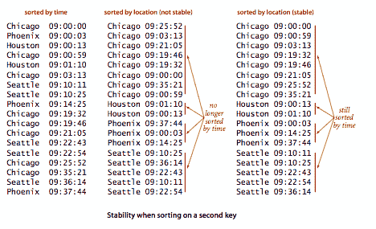
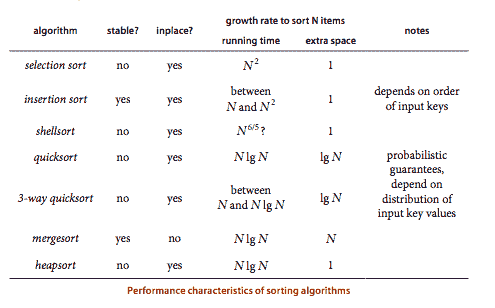
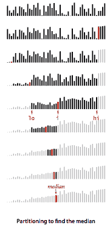
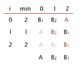

# 2.5   排序应用

> 原文：[`algs4.cs.princeton.edu/25applications`](https://algs4.cs.princeton.edu/25applications)

排序算法和优先队列在各种应用中被广泛使用。本节的目的是简要概述其中一些应用。

## 对各种类型的数据进行排序。

我们的实现对`Comparable`对象的数组进行排序。这种 Java 约定允许我们使用 Java 的*回调*机制对实现了`Comparable`接口的任何类型的对象数组进行排序。

+   *事务示例。* 程序 Transaction.java 基于事务发生时间实现了事务数据类型的`Comparable`接口。

+   *指针排序。* 我们正在使用的方法在经典文献中被称为*指针排序*，因为我们处理的是对键的引用，而不是移动数据本身。

+   *键是不可变的。* 如果允许客户在排序后更改键的值，那么数组可能不会保持排序。在 Java 中，通过使用不可变键来确保键值不变是明智的。

+   *交换成本低廉。* 使用引用的另一个优点是我们避免了移动完整项的成本。引用方法使得交换的成本在一般情况下大致等于比较的成本。

+   *备用排序。* 有许多应用程序，我们希望根据情况使用两种不同的顺序对我们正在排序的对象。Java 的`Comparator`接口有一个名为`compare()`的公共方法，用于比较两个对象。如果我们有一个实现了此接口的数据类型，我们可以将`Comparator`传递给`sort()`（它传递给`less()`）如 Insertion.java 中所示。

+   *具有多个键的项。* 在典型应用中，项具有多个可能需要用作排序键的实例变量。在我们的事务示例中，一个客户可能需要按帐号号码对事务列表进行排序；另一个客户可能需要按地点对列表进行排序；其他客户可能需要使用其他字段作为排序键。我们可以定义多个比较器，如 Transaction.java 中所示。

+   *具有比较器的优先队列。* 使用比较器的灵活性对于优先队列也很有用。MaxPQ.java 和 MinPQ.java 包括一个以`Comparator`作为参数的构造函数。

+   *稳定性。* 如果排序方法在数组中保留相等键的相对顺序，则称其为*稳定*。例如，在我们的互联网商务应用中，我们按照事务到达的顺序将其输入到数组中，因此它们按照数组中的时间字段顺序排列。现在假设应用程序要求将事务按位置分开以进行进一步处理。一个简单的方法是按位置对数组进行排序。如果排序是不稳定的，那么每个城市的事务在排序后可能不一定按时间顺序排列。我们在本章中考虑的一些排序方法是稳定的（插入排序和归并排序）；许多排序方法则不是（选择排序、希尔排序、快速排序和堆排序）。

## 我应该使用哪种排序算法？

确定哪种算法是最佳的取决于应用和实现的细节，但我们已经研究了一些通用方法，它们在各种应用中几乎与最佳方法一样有效。下表是一个概括我们在本章中研究的排序算法的重要特征的一般指南。

**性质。** 快速排序是最快的通用排序方法。

在大多数实际情况下，快速排序是首选方法。如果稳定性很重要且有空间可用，则归并排序可能是最佳选择。在一些性能关键的应用中，重点可能仅仅是对数字进行排序，因此可以避免使用引用的成本，而是对原始类型进行排序。

+   *排序原始类型。* 我们可以通过将`Comparable`替换为原始类型名称，并将对`less()`的调用替换为类似`a[i] < a[j]`的代码，为原始类型开发更高效的排序代码。但是，对于浮点类型，需要注意处理-0.0 和 NaN。

+   *Java 系统排序。* Java 的主要系统排序方法`Arrays.sort()`在`java.util`库中表示一组重载方法：

    +   每种原始类型的不同方法。

    +   一种用于实现`Comparable`的数据类型的方法。

    +   一种使用`Comparator`的方法。

    Java 的系统程序员选择使用快速排序（带有 3 路分区）来实现原始类型方法，并使用归并排序来实现引用类型方法。这些选择的主要实际影响是在速度和内存使用（对于原始类型）与稳定性和性能保证（对于引用类型）之间进行权衡。

## 缩减。

我们可以使用排序算法来解决其他问题的想法是算法设计中一种基本技术的例子，称为*缩减*。缩减是一种情况，其中为一个问题开发的算法用于解决另一个问题。我们从一些排序的基本示例开始。

+   *重复项。* 在一个包含`Comparable`对象的数组中是否有重复的键？数组中有多少个不同的键？哪个值出现最频繁？通过排序，您可以在线性对数时间内回答这些问题：首先对数组进行排序，然后通过排序后的数组进行一次遍历，注意在有序数组中连续出现的重复值。

+   *排名。* 一个*排列*（或*排名*）是一个包含 N 个整数的数组，其中 0 到 N-1 之间的每个整数恰好出现一次。两个排名之间的*Kendall tau 距离*是在两个排名中顺序不同的对数。例如，`0 3 1 6 2 5 4`和`1 0 3 6 4 2 5`之间的 Kendall tau 距离是四，因为在两个排名中，对 0-1、3-1、2-4、5-4 的顺序不同，但所有其他对的顺序相同。

+   *优先队列缩减。* 在第 2.4 节中，我们考虑了两个问题的示例，这些问题可以简化为对优先队列的一系列操作。TopM.java 在输入流中找到具有最高键的 M 个项目。Multiway.java 将 M 个排序的输入流合并在一起，以生成一个排序的输出流。这两个问题都可以通过大小为 M 的优先队列轻松解决。

+   *中位数和顺序统计。*  与排序相关的一个重要应用是找到一组键的*中位数*（具有一半键不大于它，一半键不小于它的值）。这个操作在统计学和其他各种数据处理应用中是一个常见的计算。找到中位数是*选择*的一个特殊情况：找到一组数字中第 k 小的数字。通过排序，可以很容易在线性对数时间内解决这个问题。方法`select()`

    我们描述了一种在*线性*时间内解决问题的方法：维护变量`lo`和`hi`来限定包含要选择的项目的索引`k`的子数组，并使用快速排序分区来缩小子数组的大小，如下所示：

    +   如果`k`等于`j`，那么我们完成了。

    +   否则，如果`k < j`，那么我们需要继续在左子数组中工作（通过将`hi`的值更改为`j-1`）

    +   否则，如果`k > j`，那么我们需要继续在右子数组中工作（通过将`lo`更改为`j+1`）。

    区间收缩，直到只剩下`k`。终止时，`a[k]`包含第(k+1)小的条目，`a[0]`到`a[k-1]`都小于（或等于）`a[k]`，而`a[k+1]`到数组末尾都大于（或等于）`a[k]`。

    `select()` 方法在 Quick.java 中实现了这种方法，但在客户端需要进行类型转换。QuickPedantic.java 中的`select()`方法是更加严谨的代码，避免了需要进行类型转换。

## 对排序应用的简要调查。

+   *商业计算。* 政府机构、金融机构和商业企业通过对信息进行排序来组织大部分信息。无论信息是按名称或编号排序的账户、按时间或地点排序的交易、按邮政编码或地址排序的邮件、按名称或日期排序的文件，还是其他任何信息，处理这些数据肯定会涉及到某种排序算法。

+   *搜索信息。* 将数据保持有序可以通过经典的*二分搜索*算法高效地搜索数据。

+   *运筹学。* 假设我们有 N 个工作要完成，其中第 j 个工作需要 t[j]秒的处理时间。我们需要完成所有工作，但希望通过最小化工作的平均完成时间来最大化客户满意度。*最短处理时间优先*规则，即按处理时间递增顺序安排工作，已知可以实现这一目标。另一个例子是*负载平衡问题*，其中我们有 M 个相同的处理器和 N 个工作要完成，我们的目标是在处理器上安排所有工作，以便最后一个工作完成的时间尽可能早。这个具体问题是 NP 难题（参见第六章），因此我们不指望找到一个实际的方法来计算最佳的安排。已知一种能够产生良好安排的方法是*最长处理时间优先*规则，即按处理时间递减顺序考虑工作，将每个工作分配给最先可用的处理器。

+   *事件驱动模拟。* 许多科学应用涉及模拟，计算的目的是模拟现实世界的某个方面，以便更好地理解它。进行这种模拟可能需要适当的算法和数据结构。我们在第 6.1 节中考虑了一个粒子碰撞模拟，说明了这一点。

+   *数值计算。* 科学计算通常关注准确性（我们距离真实答案有多接近？）。当我们进行数百万次计算时，准确性非常重要，特别是在使用计算机上常见的浮点数表示实数时。一些数值算法使用优先队列和排序来控制计算中的准确性。

+   *组合搜索。* 人工智能中的一个经典范例是定义一组*配置*，其中每个配置都有从一个配置到下一个配置的明确定义的移动和与每个移动相关联的优先级。还定义了一个*起始*配置和一个*目标*配置（对应于已解决问题）。*A*算法*是一个问题解决过程，其中我们将起始配置放在优先队列中，然后执行以下操作直到达到目标：移除优先级最高的配置，并将可以通过一次移动到达的所有配置添加到队列中（不包括刚刚移除的配置）���

+   *普里姆算法和迪杰斯特拉算法*是处理图的经典算法。优先队列在组织图搜索中起着基础性作用，实现高效的算法。

+   *Kruskal 算法*是另一��经典的图算法，其边具有权重，取决于按权重顺序处理边。其运行时间由排序的成本主导。

+   *赫夫曼压缩*是一种经典的数据压缩算法，它依赖于通过将具有整数权重的一组项目组合起来，以产生一个新的项目，其权重是其两个组成部分的和。使用优先队列立即实现此操作。

+   *字符串处理*算法通常基于排序。例如，我们将讨论基于首先对字符串后缀进行排序的算法，用于查找一组字符串中的最长公共前缀以及给定字符串中的最长重复子字符串。

#### 练习

1.  考虑`String`的`compareTo()`方法的以下实现。第三行如何提高效率？

    ```java
    public int compareTo(String t) {
       String s = this;
       if (s == t) return 0;  // this line
       int n = Math.min(s.length(), t.length());
       for (int i = 0; i < n; i++) {
          if      (s.charAt(i) < t.charAt(i)) return -1;
          else if (s.charAt(i) > t.charAt(i)) return +1;
       }
       return s.length() - t.length();
    }

    ```

    *解决方案*：如果`s`和`t`是对同一字符串的引用，则避免直接比较单个字符。

1.  批评下面的类实现，该类旨在表示客户账户余额。为什么`compareTo()`是`Comparable`接口的一个有缺陷的实现？

    ```java
    public class Customer implements Comparable<Customer> {
        private String name;
        private double balance;

        public int compareTo(Customer that) {
            if (this.balance < that.balance - 0.005) return -1;
            if (this.balance > that.balance + 0.005) return +1; 
            return 0;
       }
    }

    ```

    *解决方案*：它违反了`Comparable`合同。可能`a.compareTo(b)`和`b.compareTo(c)`都为 0，但`a.compareTo(c)`为正（或负）。

1.  解释为什么选择排序不稳定。

    *解决方案。* 它交换非相邻元素。在下面的示例中，第一个 B 被交换到第二个 B 的右侧。

    > 

1.  编写一个程序 Frequency.java，从标准输入读取字符串，并按频率降序打印每个字符串出现的次数。

#### 创造性问题

1.  **调度。** 编写一个程序 SPT.java，从标准输入读取作业名称和处理时间，并打印一个最小化平均完成时间的调度，如文本中所述。

1.  **负载平衡。** 编写一个程序 LPT.java，将整数 M 作为命令行参数，从标准输入读取 N 个作业名称和处理时间，并打印一个调度分配作业给 M 个处理器，以近似最小化最后一个作业完成的时间，如文本中所述。

    *备注。* 结果解决方案保证在最佳解决方案的 33%之内（实际上为 4/3 - 1/(3N)）。

1.  **按反向域排序。** 编写一个数据类型 Domain.java，表示域名，包括一个适当的`compareTo()`方法，其中自然顺序是*反向*域名顺序。例如，`cs.princeton.edu`的反向域是`edu.princeton.cs`。这对于 Web 日志分析很有用。编写一个客户端，从标准输入读取域名，并按排序顺序打印反向域。

1.  **垃圾邮件活动。** 要发起非法的垃圾邮件活动，您有一个来自各种域的电子邮件地址列表（即在@符号后面的电子邮件地址部分）。为了更好地伪造寄件人地址，您希望从同一域的另一个用户发送电子邮件。例如，您可能想要伪造从 wayne@princeton.edu 发送到 rs@princeton.edu 的电子邮件。您将如何处理电子邮件列表以使此成为一个高效的任务？

    *解决方案。* 首先按照反向域排序。

1.  **公正选举。** 为了防止对字母表末尾出现的候选人产生偏见，加利福尼亚州通过以下顺序对其 2003 年州长选票上出现的候选人进行排序：

    ```java
    R W Q O J M V A H B S G Z X N T C I E K U P D Y F L

    ```

    创建一个数据类型 California.java，其中这是自然顺序。编写一个客户端，根据此顺序对字符串进行排序。假设每个字符串仅由大写字母组成。

1.  **肯德尔距离。** 编写一个程序 KendallTau.java，以线性对数时间计算两个排列之间的肯德尔距离。

1.  **稳定的优先队列。**开发一个*稳定的*优先队列实现 StableMinPQ.java（返回以插入顺序返回重复键）。

1.  **平面上的点。**为 Point2D.java 数据类型编写三个`static`静态比较器，一个按照它们的 x 坐标比较点，一个按照它们的 y 坐标比较点，一个按照它们与原点的距离比较点。为 Point2D 数据类型编写两个非静态比较器，一个按照它们到指定点的距离比较，一个按照它们相对于指定点的极角比较。

1.  **一维区间数据类型。**为 Interval1D.java 编写三个`static`比较器，一个按照它们的左端点比较区间，一个按照它们的右端点比较区间，一个按照它们的长度比较区间。

1.  **按名称对文件进行排序。**编写一个程序 FileSorter.java，该程序接受一个目录名称作为命令行输入，并按文件名打印出当前目录中的所有文件。*提示*：使用[java.io.File](http://docs.oracle.com/javase/6/docs/api/java/io/File.html)数据类型。

1.  **博纳定理。**真或假：如果对矩阵的每一列进行排序，然后对每一行进行排序，那么列仍然是有序的。解释你的答案。

    *答案*。正确。

1.  **不同值。**编写一个程序 Distinct.java，它接受整数 M、N 和 T 作为命令行参数，然后使用文本中给出的代码执行以下实验的 T 次试验：生成 0 到 M-1 之间的 N 个随机整数值，并计算生成的不同值的数量。将程序运行 T = 10 和 N = 10³、10⁴、10⁵ 和 10⁶，其中 M = 1/2 N、N 和 2N。概率论表明，不同值的数量应该约为 M(1 - e^(-alpha))，其中 alpha = N/M—打印一个表格来帮助您确认您的实验验证了这个公式。

#### Web 练习

1.  **计数器数据类型。**修改 Counter.java，使其实现`Comparable`接口，通过计数比较计数器。

1.  **成绩数据类型。**编写一个程序 Grade.java 来表示成绩的数据类型（A、B+等）。它应该使用 GPA 对成绩进行自然排序，实现`Comparable`接口。

1.  **学生数据类型。**编写一个数据类型 Student.java，表示大学课程中的学生。每个学生应该有一个登录名（String）、一个部分号（整数）和一个成绩（Grade）。

1.  **不区分大小写的顺序。**编写一个代码片段，读取一系列字符串并按升序排序，忽略大��写。

    ```java
    String[] a = new String[N];
    for (int i = 0; i < N. i++) {
       a[i] = StdIn.readString();
    }
    Arrays.sort(a, String.CASE_INSENSITIVE_ORDER);

    ```

1.  **不区分大小写的比较器。**实现自己版本的比较器`String.CASE_INSENSITIVE_ORDER`。

    ```java
    public class CaseInsensitive implements Comparator<String> {
       public int compare(String a, String b) {
          return a.compareToIgnoreCase(b);
       }
    }

    ```

1.  **降序字符串比较器。**实现一个比较器，按降序而不是升序对字符串进行排序。

    ```java
    public class Descending implements Comparator<String> {
       public int compare(String a, String b) {
          return b.compareToIgnoreCase(a);
       }
    }

    ```

    或者，您可以使用`Collections.reverseOrder()`。它返回一个`Comparator`，它施加实现`Comparable`接口的对象的自然顺序的反向排序。

1.  **按非英语字母表排序字符串。**编写一个程序，根据非英语字母表对字符串进行排序，包括重音符号、分音符号和像西班牙语中的 ch 这样的预组合字符。

    *提示*：使用 Java 的[java.text.Collator](http://docs.oracle.com/javase/6/docs/api/java/text/Collator.html) API。例如，在 UNICODE 中，`Rico`在`Réal`之前按字典顺序出现，但在法语中，`Réal`首先出现。

    ```java
    import java.util.Arrays;
    import java.text.Collator;
    ...
    Arrays.sort(words, Collator.getInstance(Locale.FRENCH));

    ```

1.  **史密斯规则。** 在供应链管理中出现了以下问题。你有一堆工作要在一台机器上安排。（给出例子。）工作 j 需要 p[j]单位的处理时间。工作 j 有一个正权重 w[j]，表示其相对重要性 - 将其视为存储原材料的库存成本为工作 j 存储 1 个时间单位。如果工作 j 在时间 t 完成处理，那么它的��本为 t * w[j]美元。目标是安排工作的顺序，以最小化每个工作的加权完成时间之和。编写一个程序`SmithsRule.java`，它从命令行参数 N 和由它们的处理时间 p[j]和权重 w[j]指定的 N 个工作列表中读取，并输出一个最佳的处理工作顺序。*提示：* 使用*史密斯规则*：按照处理时间与权重比率的顺序安排工作。这种贪婪规则事实证明是最优的。

1.  **押韵的词。** 对于你的诗歌课程，你想要列出一张押韵词的列表。完成这个任务的一种简单方法如下：

    +   将一个单词字典读入一个字符串数组中。

    +   将每个单词的字母倒转，例如，`confound`变为`dnuofnoc`。

    +   对结果数组中的单词进行排序。

    +   将每个单词的字母倒转回原始状态。

    现在单词`confound`将会与`astound`和`compound`等单词相邻。编写一个程序 Rhymer.java，从标准输入中读取一系列单词，并按照上述指定的顺序打印它们。

    现在重复一遍，但使用一个自定义的`Comparator`，按从右到左的字典顺序排序。

1.  **众数。** 给出一个 O(N log N)的算法，用于计算序列 N 个整数中出现最频繁的值。

1.  **最接近的 1 维对。** 给定一个包含 N 个实数的序列，找到值最接近的整数对。给出一个 O(N log N)的算法。

1.  **最远的 1 维对。** 给定一个包含 N 个实数的序列，找到值最远的整数对。给出一个 O(N)的算法。

1.  **具有许多重复项的排序。** 假设你有一个包含 N 个元素的序列，其中最多有 log N 个不同的元素。描述如何在 O(N log log N)时间内对它们进行排序。

1.  **几乎有序。** 给定一个包含 N 个元素的数组，每个元素最多离其目标位置 k 个位置，设计一个能在 O(N log k)时间内排序的算法。

1.  **对链表进行排序。** 给定一个包含 N 个元素的单链表，如何在保证 O(N log N)时间内、稳定地、且只使用 O(1)额外空间的情况下对其进行排序？

1.  **Goofysort（Jim Huggins）。** 论证 Goofy.java 按升序对数组进行排序。作为要排序的项目数量 N 的函数，最佳情况运行时间是多少？作为要排序的项目数量 N 的函数，最坏情况运行时间是多少？

1.  **令人愉悦的区间。** 给定一个包含 N 个非负整数的数组（代表一个人每天的情感值），一个区间的幸福度是该区间中值的总和乘以该区间中最小的整数。设计一个 O(N log N)的分治算法来找到最幸福的区间。

    *解决方案。* 这里是一个归并排序风格的解决方案。

    +   将元素分为中间部分：a[l..m-1]，a[m]，a[m+1..r]

    +   递归地计算左半部分中的最佳区间

    +   递归地计算右半部分中的最佳区间

    +   计算包含 a[m]的最佳区间

    +   返回三个区间中最佳的一个为了效率的关键步骤是在线性时间内计算包含`a[m]`的最佳区间。这里是一个贪婪的解决方案：如果包含`a[m]`的最佳区间只包含一个元素，那就是`a[m]`。如果包含多于一个元素，那么必须包含`a[m-1]`和`a[m+1]`中较大的一个，所以将其添加到区间中。重复这个过程，以此类推。返回通过这个过程构建的任何大小的最佳区间。

1.  **Equality detector.** 假设你有 N 个元素，并且想确定至少有 N/2 个元素相等。假设你只能执行相等性测试操作。设计一个算法，在 O(N log N) 次相等性测试中找到一个代表元素（如果存在的话）。*提示*：分治法。注意：也可以在 O(N) 次测试中完成。

1.  **Maxima.** 给定平面上的 n 个点集，点 (xi, yi) 支配点 (xj, yj) 如果 xi > xj 并且 yi > yj。极大值是一个不被集合中任何其他点支配的点。设计一个 O(n log n) 的算法来找到所有极大值。应用：在 x ��上是空间效率，在 y 轴上是时间效率。极大值是有用的算法。提示：根据 x 坐标升序排序；从右到左扫描，记录迄今为止看到的最高 y 值，并将其标记为极大值。

1.  **Min and max.** 给定一个包含 N 个元素的数组，尽可能少地比较找到最小值和最大值。暴力法：找到最大值（N-1 次比较），然后找到剩余元素的最小值（N-2 次比较）。

    *Solution 1.* 分治法：在每一半中找到最小值和最大值（2T(N/2) 次比较），返回 2 的最小值和 2 的最大值（2 次比较）。T(1) = 0，T(2) = 1，T(N) = 2T(N/2) + 2。递归解：T(N) = ceil(3N/2) - 2。

    *Solution 2.* 将元素分成一对一对，并比较每对中的两个元素。将最小的元素放在 A 中，最大的元素放在 B 中。如果 n 是奇数，将元素 n 放在 A 和 B 中。这需要 floor(n/2) 次比较。现在直接计算 A 中的最小值（ceil(n/2) - 1 次比较）和 B 中的最大值（ceil(N/2) - 1 次比较）。[事实上，这是最佳的解决方案。]

1.  **Sorting by reversals.** [ [Mihai Patrascu](http://people.csail.mit.edu/mip/probs.html)] 给定一个数组 a[1..n]，使用以下类型的操作进行排序：选择两个索引 i 和 j，并反转 a[i..j] 中的元素。这个操作的成本为 j-i+1。目标：O(n log² n)。

1.  **L1 norm.** 平面上有 N 个电路元件。你需要沿电路运行一根特殊的导线（平行于 x 轴）。每个电路元件必须连接到特殊导线。你应该把特殊导线放在哪里？*提示*：中位数最小化 L1 范数。

1.  **Median given two sorted arrays.** 给定大小为 N[1] 和 N[2] 的两个已排序数组，以 O(log N) 时间找到所有元素的中位数，其中 N = N[1] + N[2]。或者在 O(log k) 时间内找到第 k 大的元素。

1.  **Three nearby numbers in an array.** 给定一个浮点数数组 `a[]`，设计一个线性对数时间复杂度的算法，找到三个不同的整数 i, j, 和 k，使得 |a[i] - a[j]| + |a[j] - a[k]| + |a[k] - a[i]| 最小。

    *Hint:* 如果 a[i] <= a[j] <= a[k]，那么 |a[i] - a[j]| + |a[j] - a[k]| + |a[k] - a[i]| = 2 (a[k] - a[i])。

1.  **Three nearby numbers in three arrays.** 给定三个浮点数数组 `a[]`, `b[]`, 和 `c[]`，设计一个线性对数时间复杂度的算法，找到三个整数 i, j, 和 k，使得 |a[i] - b[j]| + |b[j] - c[k]| + |c[k] - a[i]| 最小。

1.  **Minimum dot product.** 给定相同长度的两个向量，找到两个向量的点积尽可能小的排列。

1.  **Two-sum.** 给定一个包含 N 个整数的数组，设计一个线性对数时间复杂度的算法，找到一对整数，使它们的和最接近零。

    *Solution*: 按绝对值排序，最佳对现在是相邻的。

1.  **3-sum in quadratic time.** 3-sum 问题是在整数数组中找到和最接近零的三元组。描述一个使用线性空间和二次时间的解决方案。

    *Hint*：解决以下子问题。给定 N 个整数的排序列表和目标整数 x，在线性时间内确定最接近 x 的两个整数。

1.  **Bandwidth.** 给定带宽要求的区间，找到最大带宽需求（以及需要该最大带宽的区间）。

    *解决方案。* 按开始时间对区间进行排序；按照这个顺序将区间插入 PQ，但使用结束时间作为键。在插入下一个区间之前，比较其开始时间与 PQ 上最小区间的结束时间：如果大于，删除 PQ 上的最小区间。始终跟踪 PQ 上的累积带宽。

1.  **时间戳。** 给定 N 个时间戳，当文件从 Web 服务器请求时，找到没有文件到达的最长时间间隔。*解决方案*：按时间戳排序。扫描排序列表以识别最大间隙。 （与空闲时间相同。）

1.  **票务范围。** 给定一个形式为 A1、A2、A11、A10、B7、B9、B8、B3 的票务座位列表，找到最大的非空相邻座位块，例如，A3-A9。 （与空闲时间相同。）

1.  **十进制主导。** 给定一个具有 N 个可比较键的数组，设计一个算法来检查是否有一个值出现的次数超过 N/10 次。你的算法应该在期望的线性时间内运行。

    *解决方案。* 使用快速选择找到第 N/10 大的值；检查它是否是主导值；如果不是，在具有 9N/10 个值的子数组中递归。

    或者，使用 9 个计数器。

1.  **局部最小和最大。** 给定 N 个不同的可比较项，重新排列它们，使得每个内部项要么大于其前后两项，要么小于其前后两项。

    *提示*：对前半部分和后半部分进行排序和交错。

1.  **h 指数。** 给定一个由 N 个正整数组成的数组，它的[h 指数](http://en.wikipedia.org/wiki/H-index)是最大的整数*h*，使得数组中至少有*h*个条目大于或等于*h*。设计一个算法来计算数组的*h*指数。

    *提示*：中位数或类似快速排序的分区和分治。

1.  **软件版本号。** 定义一个比较器，比较两个版本号（例如 1.2.32 和 1.2.5）的时间顺序。假设版本号是仅由十进制数字和.字符组成的字符串。.字符分隔字段；它不是小数点。

1.  **稳定的选择排序。** 你需要做什么修改才能使选择排序稳定？

    *解决方案*：首先，在找到最小剩余键时，始终选择最左边的条目；其次，不是用一次交换将最小键移动到最前面，而是将所有大于它的元素向右移动一个位置。

1.  **最大数。** 给定 n 个正整数，将它们连接起来，使它们形成最大的数。例如，如果数字是 123、12、96 和 921，则结果应该是 9692112312。

    *解决方案。* 定义一个比较器，通过将两个数字连接在一起（例如，对于 96 和 921，比较 96921 与 92196），看哪个字符串在字典顺序上最大。

1.  **最大数。** 给定三个长度为 n 的数组 A、B 和 C，确定有多少个三元组 a 在 A 中，b 在 B 中，c 在 C 中，使得 a < b < c？
