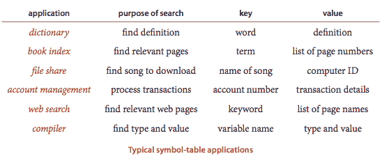
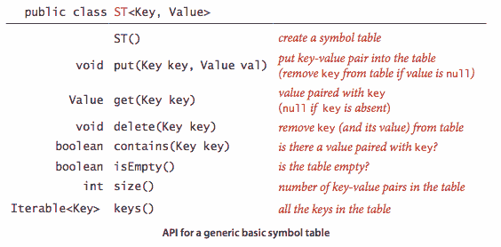
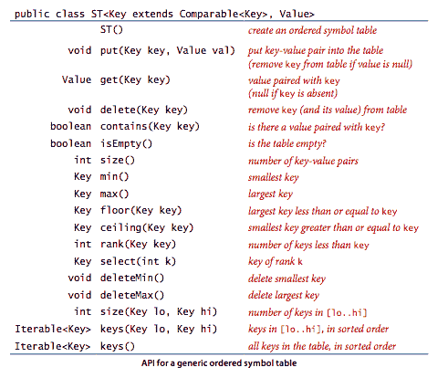
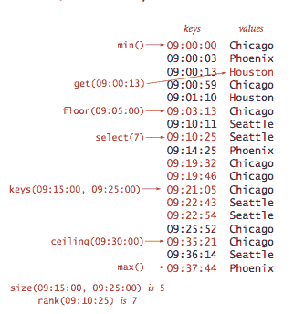
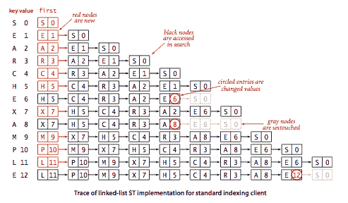
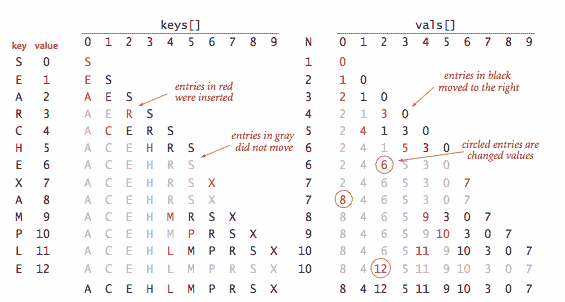
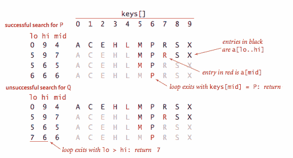

# 3.1   基本符号表

> 原文：[`algs4.cs.princeton.edu/31elementary`](https://algs4.cs.princeton.edu/31elementary)
> 
> 译者：[飞龙](https://github.com/wizardforcel)
> 
> 协议：[CC BY-NC-SA 4.0](https://creativecommons.org/licenses/by-nc-sa/4.0/)


## 符号表。

*符号表* 的主要目的是将 *值* 与 *键* 关联起来。客户端可以将键值对插入符号表，并期望以后能够搜索与给定键关联的值。

## API。

这是 API。我们考虑了几种设计选择，以使我们的实现代码一致、紧凑和有用。

+   *泛型.* 我们考虑在不指定正在处理的键和值类型的情况下使用泛型的方法。

+   *重复键.* 每个键只关联一个值（表中没有重复键）。当客户端将一个包含该键（和关联值）的键值对放入已经包含该键的表中时，新值将替换旧值。这些约定定义了*关联数组抽象*，您可以将符号表视为类似于数组的结构，其中键是索引，值是数组条目。

+   *空值.* 没有键可以与值 `null` 关联。这个约定直接与我们在 API 中规定的 `get()` 应该对不在表中的键返回 `null` 相关。这个约定有两个（预期的）后果：首先，我们可以通过测试 `get()` 是否返回 `null` 来测试符号表是否定义了与给定键关联的值。其次，我们可以使用调用 `put()` 时将 `null` 作为第二个（值）参数来实现删除。

+   *删除.* 符号表中的删除通常涉及两种策略之一：*惰性*删除，其中我们将表中的键与 `null` 关联，然后可能在以后的某个时间删除所有这些键，以及*急切*删除，其中我们立即从表中删除键。正如刚才讨论的，代码 `put(key, null)` 是 `delete(key)` 的一个简单（惰性）实现。当我们给出一个（急切）`delete()` 的实现时，它旨在替换此默认值。

+   *迭代器.* `keys()` 方法返回一个 `Iterable<Key>` 对象，供客户端用于遍历键。

+   *键相等性.* Java 要求所有对象实现一个 `equals()` 方法，并为标准类型（如 `Integer`、`Double` 和 `String`）以及更复杂类型（如 `Date`、`File` 和 `URL`）提供实现。对于涉及这些类型数据的应用程序，您可以直接使用内置实现。例如，如果 `x` 和 `y` 是 `String` 值，则 `x.equals(y)` 为 `true` 当且仅当 `x` 和 `y` 长度相同且在每个字符位置上都相同。在实践中，键可能更复杂，如 Person.java。对于这样的客户定义键，您需要重写 `equals()`。Java 的约定是 `equals()` 必须实现一个*等价关系*:

    +   *自反性*: `x.equals(x)` 为 `true`。

    +   *对称性*: `x.equals(y)` 当且仅当 `y.equals(x)` 为 `true` 时，`true`。

    +   *传递性*: 如果 `x.equals(y)` 和 `y.equals(z)` 为 `true`，那么 `x.equals(z)` 也是 `true`。

    此外，`equals()` 必须以 `Object` 作为参数，并满足以下属性:

    +   *一致性*: 多次调用 `x.equals(y)` 一致地返回相同的值，前提是没有修改任何对象

    +   *非空*: `x.equals(null)` 返回 `false`。

    最佳实践是使 `Key` 类型不可变，因为否则无法保证一致性。

## 有序符号表。

在典型应用中，键是`Comparable`对象，因此存在使用代码`a.compareTo(b)`来比较两个键`a`和`b`的选项。几个符号表实现利用`Comparable`暗示的键之间的顺序来提供`put()`和`get()`操作的高效实现。更重要的是，在这种实现中，我们可以将符号表视为按顺序保留键，并考虑一个定义了许多自然和有用的涉及相对键顺序的操作的显著扩展 API。对于键是`Comparable`的应用程序，我们实现以下 API：

+   *最小值和最大值*。对于一组有序键来说，可能最自然的查询是询问最小和最大的键。我们已经在第 3.4 节讨论优先队列时遇到了这些操作的需求。

+   *下界和上界*。给定一个键，通常有必要执行*下界*操作（找到小于或等于给定键的最大键）和*上界*操作（找到大于或等于给定键的最小键）。这个命名法来自于实数上定义的函数（实数 x 的下界是小于或等于 x 的最大整数，实数 x 的上界是大于或等于 x 的最小整数）。

+   *排名和选择*。确定新键在顺序中的位置的基本操作是*排名*操作（找到小于给定键的键数）和*选择*操作（找到具有给定排名的键）。我们已经在第 2.5 节讨论排序应用时遇到了这些操作的需求。

+   *范围查询*。有多少个键落在给定范围内？哪些键在给定范围内？回答这些问题的两个参数为`size()`和`keys()`方法在许多应用中非常有用，特别是在大型数据库中。

+   *删除最小值和删除最大值*。我们的有序符号表 API 添加了基本 API 方法来删除最大和最小键（及其关联的值）。

+   *异常情况*。当一个方法应该返回一个键，而表中没有符合描述的键时，我们的约定是抛出异常。

+   *键相等性（重新审视）*。在 Java 中的最佳实践是使`compareTo()`与所有`Comparable`类型中的`equals()`一致。也就是说，对于任何给定`Comparable`类型中的对象对`a`和`b`，应该满足`(a.compareTo(b) == 0)`和`a.equals(b)`具有相同的值。

## 示例客户端。

我们考虑两种客户端：一个测试客户端，用于跟踪算法在小输入上的行为，以及一个性能客户端。

+   *测试客户端*。我们符号表实现中的`main()`客户端从标准输入中读取一系列字符串，通过将值 i 与输入中的第 i 个键关联来构建符号表，然后打印表。

+   *频率计数器*。程序 FrequencyCounter.java 是一个符号表客户端，它在标准输入中找到每个字符串（至少具有给定阈值长度的字符）的出现次数，然后遍历键以找到出现最频繁的键。

## 无序链表中的顺序搜索。

程序 SequentialSearchST.java 实现了一个包含键和值的节点链表的符号表。要实现`get()`，我们通过列表扫描，使用`equals()`将搜索键与列表中每个节点中的键进行比较。如果找到匹配项，则返回相关值；如果没有，则返回`null`。要实现`put()`，我们也通过列表扫描，使用`equals()`将客户键与列表中每个节点中的键进行比较。如果找到匹配项，则将与该键关联的值更新为第二个参数中给定的值；如果没有，则创建一个具有给定键和值的新节点，并将其插入列表开头。这种方法称为*顺序搜索*。

### 命题 A.

在（无序）链表符号表中，不成功的搜索和插入都使用 N 次比较，在最坏情况下成功的搜索使用 N 次比较。特别是，将 N 个键插入到最初为空的链表符号表中使用 ~N²/2 次比较。

## 在有序数组中进行二分查找

. 程序 BinarySearchST.java 实现了有序符号表 API。底层数据结构是两个并行数组，键按顺序保存。实现的核心是`rank()`方法，它返回小于给定键的键数。对于`get()`，rank 告诉我们如果键在表中，则键应该被找到的确切位置（如果不在表中，则不在表中）。对于`put()`，rank 告诉我们当键在表中时精确更新值的位置，当键不在表中时精确放置键的位置。我们将所有较大的键向后移动一个位置以腾出空间（从后向前工作），并将给定的键和值插入到各自数组中的适当位置。

+   *二分查找.* 我们将键保持在有序数组中的原因是为了可以使用数组索引来显著减少每次搜索所需的比��次数，使用一种著名的经典算法称为*二分查找*。基本思想很简单：我们维护索引到排序键数组的指示符，限定可能包含搜索键的子数组。要搜索，我们将搜索键与子数组中间的键进行比较。如果搜索键小于中间键，则在子数组的左半部分搜索；如果搜索键大于中间键，则在子数组的右半部分搜索；否则中间键等于搜索键。

+   *其他操作.* 由于键保持在有序数组中，大多数基于顺序的操作都是紧凑且简单的。

### 命题 B.

在具有 N 个键的有序数组中进行二分查找，在最坏情况下搜索（成功或失败）不会超过 lg N + 1 次比较。

### 命题 C.

将新键插入有序数组中在最坏情况下使用 ~ 2N 个数组访问，因此将 N 个键插入到最初为空的表中在最坏情况下使用 ~ N² 个数组访问。

#### 练习

1.  编写一个客户端程序 GPA.java，创建一个将字母等级映射到数字分数的符号表，如下表所示，然后从标准输入读取字母等级列表，并计算并打印 GPA（对应等级的数字分数的平均值）。

    ```java
    A+    A     A-    B+    B     B-    C+    C     C-    D     F
    4.33  4.00  3.67  3.33  3.00  2.67  2.33  2.00  1.67  1.00  0.00

    ```

1.  开发一个符号表实现 ArrayST.java，它使用（无序）数组作为底层数据结构来实现我们的基本符号表 API。

1.  为 SequentialSearchST.java 实现`size()`、`delete()`和`keys()`。

1.  为 BinarySearchST.java 实现`delete()`方法。

1.  为 BinarySearchST.java 实现`floor()`方法。

#### 创意问题

1.  **测试客户端。**编写一个测试客户端 TestBinarySearchST.java，用于测试`min()`、`max()`、`floor()`、`ceiling()`、`select()`、`rank()`、`deleteMin()`、`deleteMax()`和`keys()`的实现。

1.  **认证。**在 BinarySearchST.java 中添加`assert`语句，以检查每次插入和删除后的算法不变性和数据结构完整性。例如，每个索引`i`应始终等于`rank(select(i))`，并且数组应始终保持有序。

#### 网页练习

1.  **电话号码数据类型。**编写一个实现美国电话号码的数据类型 PhoneNumber.java，包括一个`equals()`方法。

1.  **学生数据类型。**编写一个实现具有姓名和班级的学生的数据类型 Student.java，包括一个`equals()`方法。
