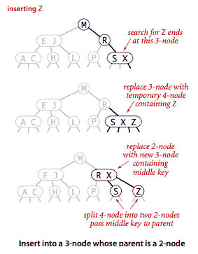

# 3.3   平衡搜索树

> 原文：[`algs4.cs.princeton.edu/33balanced`](https://algs4.cs.princeton.edu/33balanced)
> 
> 译者：[飞龙](https://github.com/wizardforcel)
> 
> 协议：[CC BY-NC-SA 4.0](https://creativecommons.org/licenses/by-nc-sa/4.0/)

本节正在大力施工中。

我们在本节介绍了一种类型的二叉搜索树，其中成本*保证*为对数。我们的树几乎完美平衡，高度保证不会大于 2 lg N。

## 2-3 搜索树。

获得我们需要保证搜索树平衡的灵活性的主要步骤是允许我们树中的节点保存多个键。

### 定义。

一个*2-3 搜索树*是一棵树，要么为空，要么：

+   一个*2 节点*，带有一个键（和相关值）和两个链接，一个指向具有较小键的 2-3 搜索树的左链接，一个指向具有较大键的 2-3 搜索树的右链接

+   一个*3 节点*，带有两个键（和相关值）和三个链接，一个指向具有较小键的 2-3 搜索树的左链接，一个指向具有节点键之间的键的 2-3 搜索树的中间链接，一个指向具有较大键的 2-3 搜索树的右链接。

一个*完美平衡*的 2-3 搜索树（或简称 2-3 树）是指其空链接与根之间的距离都相同。

+   *搜索。* 要确定 2-3 树中是否存在一个键，我们将其与根处的键进行比较：如果它等于其中任何一个键，则有一个搜索命中；否则，我们跟随从根到对应于可能包含搜索键的键值区间的子树的链接，然后在该子树中递归搜索。

+   *插入到 2 节点中。* 要在 2-3 树中插入新节点，我们可能会进行一次不成功的搜索，然后挂接到底部的节点，就像我们在二叉搜索树中所做的那样，但新树不会保持完美平衡。如果搜索终止的节点是一个 2 节点，要保持完美平衡很容易：我们只需用包含其键和要插入的新键的 3 节点替换该节点。

+   *插入到由单个 3 节点组成的树中。* 假设我们想要插入到一个仅由单个 3 节点组成的微小 2-3 树中。这样的树有两个键，但在其一个节点中没有新键的空间。为了能够执行插入操作，我们暂时将新键放入一个*4 节点*中，这是我们节点类型的自然扩展，具有三个键和四个链接。创建 4 节点很方便，因为很容易将其转换为由三个 2 节点组成的 2-3 树，其中一个带有中间键（在根处），一个带有三个键中最小的键（由根的左链接指向），一个带有三个键中最大的键（由根的右链接指向）。

+   *插入到父节点为 2 节点的 3 节点中。* 假设搜索在底部结束于其父节点为 2 节点的 3 节点。在这种情况下，我们仍然可以为新键腾出空间，同时保持树的完美平衡，方法是制作一个临时的 4 节点，然后按照刚才描述的方式拆分 4 节点，但是，而不是创建一个新节点来保存中间键，将中间键移动到节点的父节点。

+   *插入到父节点为 3 节点的 3 节点中。* 现在假设搜索结束于父节点为 3 节点的节点。同样，我们制作一个临时的 4 节点，然后将其拆分并将其中间键插入父节点。父节点是 3 节点，所以我们用刚刚拆分的临时新 4 节点替换它，其中包含来自 4 节点拆分的中间键。然后，我们对该节点执行完全相同的转换。也就是说，我们拆分新的 4 节点并将其中间键插入其父节点。扩展到一般情况很明显：我们沿着树向上移动，拆分 4 节点并将它们的中间键插入它们的父节点，直到达到一个 2 节点，我们用一个不需要进一步拆分的 3 节点替换它，或者直到达到根节点处的 3 节点。

+   *拆分根节点。* 如果从插入点到根节点沿着整个路径都是 3 节点，我们最终会在根节点处得到一个临时的 4 节点。在这种情况下，我们将临时的 4 节点拆分为三个 2 节点。

+   *局部转换。* 2-3 树插入算法的基础是所有这些转换都是纯粹*局部*的：除了指定的节点和链接之外，不需要检查或修改 2-3 树的任何部分。每次转换更改的链接数量受到小常数的限制。这些转换中的每一个都将一个键从 4 节点传递到树中的父节点，然后相应地重构链接，而不触及树的任何其他部分。

+   *全局属性。* 这些局部转换保持了树是有序和平衡的*全局*属性：从根到任何空链接的路径上的链接数量是相同的。

### 命题。

在具有 N 个键的 2-3 树中，搜索和插入操作保证最多访问 lg N 个节点。

然而，我们只完成了实现的一部分。虽然可以编写代码来对表示 2 和 3 节点的不同数据类型执行转换，但我们描述的大部分任务在这种直接表示中实现起来很不方便。

## 红黑 BST。

刚刚描述的 2-3 树插入算法并不难理解。我们考虑一种简单的表示法，称为*红黑 BST*，可以自然地实现。

+   *编码 3 节点。* 红黑 BST 背后的基本思想是通过从标准 BST（由 2 节点组成）开始，并添加额外信息来编码 3 节点，从而对 2-3 树进行编码。我们认为链接有两种不同类型：*红色*链接，将两个 2 节点绑在一起表示 3 节点，以及*黑色*链接，将 2-3 树绑在一起。具体来说，我们将 3 节点表示为由单个向左倾斜的红色链接连接的两个 2 节点。我们将以这种方式表示 2-3 树的 BST 称为红黑 BST。

    使用这种表示的一个优点是，它允许我们在不修改的情况下使用我们的`get()`代码进行标准 BST 搜索。

    

+   *1-1 对应关系。* 给定任何 2-3 树，我们可以立即推导出相应的红黑 BST，只需按照指定的方式转换每个节点即可。反之，如果我们在红黑 BST 中水平绘制红色链接，所有空链接距离根节点的距离相同，然后将由红色链接连接的节点合并在一起，结果就是一个 2-3 树。

    红黑 BST 和 2-3 树](../Images/2a82ce5ba078c8217adc45ad5e5d7a47.png)

+   *颜色表示。* 由于每个节点只被一个链接（从其父节点）指向，我们通过在*节点*中添加一个`boolean`实例变量颜色来编码链接的颜色，如果来自父节点的链接是红色，则为`true`，如果是黑色，则为`false`。按照惯例，空链接为黑色。

+   *旋转。* 我们将考虑的实现可能允许右倾斜的红链接或操作中连续两个红链接，但它总是在完成之前纠正这些条件，通过巧妙使用称为*旋转*的操作来切换红链接的方向。首先，假设我们有一个需要旋转以向左倾斜的右倾斜红链接。这个操作称为*左旋转*。实现将左倾斜的红链接转换为右倾斜的*右旋转*操作等同于相同的代码，左右互换。

+   *翻转颜色。* 我们将考虑的实现也可能允许黑色父节点有两个红色子节点。*颜色翻转*操作将两个红色子节点的颜色翻转为黑色，并将黑色父节点的颜色翻转为红色。

    > |  |                |                 |  |
    > | --- | --- | --- | --- |

+   *插入到单个 2 节点中。*

+   *在底部插入到 2 节点。*

+   *在具有两个键的树中（在 3 节点中）插入。*

+   *保持根节点为黑色。*

+   *在底部插入到 3 节点。*

+   *将红链接向上传递树。*

## 实现。

程序 RedBlackBST.java 实现了一个左倾斜的红黑 BST。程序 RedBlackLiteBST.java 是一个更简单的版本，只实现了 put、get 和 contains。

## 删除。

### 命题。

具有 N 个节点的红黑 BST 的高度不超过 2 lg N。

### 命题。

在红黑 BST 中，以下操作在最坏情况下需要对数时间：搜索、插入、查找最小值、查找最大值、floor、ceiling、rank、select、删除最小值、删除最大值、删除和范围计数。

### 属性。

具有 N 个节点的红黑 BST 中从根到节点的平均路径长度约为~1.00 lg N。

## 可视化。

以下可视化展示了 255 个键按随机顺序插入到红黑 BST 中。

#### 练习

1.  哪些是合法的平衡红黑 BST？

    *解决方案。* (iii) 和 (iv)。 (i) 不平衡，(ii) 不是对称顺序或平衡的。

1.  真或假：如果您将键按递增顺序插入到红黑 BST 中，则树的高度是单调递增的。

    *解决方案。* 真的，请看下一个问题。

1.  描述当按升序插入键构建红黑 BST 时，插入字母`A`到`K`时产生的红黑 BST。然后，描述当按升序插入键构建红黑 BST 时通常会发生什么。

    *解决方案。* 以下可视化展示了 255 个键按升序插入到红黑 BST 中。

1.  回答前两个问题，当键按降序插入时的情况。

    *解决方案。* 错误。以下可视化展示了 255 个键按降序插入到红黑 BST 中。

1.  创建一个测试客���端 TestRedBlackBST.java。

#### 创造性问题

1.  **认证.** 在 RedBlackBST.java 中添加一个方法`is23()`，以检查没有节点连接到两个红链接，并且没有右倾斜的红链接。 添加一个方法`isBalanced()`，以检查从根到空链接的所有路径是否具有相同数量的黑链接。 将这些方法与`isBST()`结合起来创建一个方法`isRedBlackBST()`，用于检查树是否是 BST，并且满足这两个条件。

1.  **旋转的基本定理.** 证明任何 BST 都可以通过一系列左旋和右旋转变换为具有相同键集的任何其他 BST。

    *解决方案概述*: 将第一个 BST 中最小的键旋转到根节点沿着向左的脊柱；然后对结果的右子树进行递归，直到得到高度为 N 的树（每个左链接都为 null）。 对第二个 BST 执行相同的操作。 备注：目前尚不清楚是否存在一种多项式时间算法，可以确定将一个 BST 转换为另一个 BST 所需的最小旋转次数（即使对于至少有 11 个节点的 BST，旋转距离最多为 2N - 6）。

1.  **删除最小值.** 通过保持与文本中给出的向树的左脊柱下移的转换的对应关系，同时保持当前节点不是 2 节点的不变性，为 RedBlackBST.java 实现`deleteMin()`操作。

1.  **删除最大值.** 为 RedBlackBST.java 实现`deleteMax()`操作。 请注意，涉及的转换与前一个练习中的转换略有不同，因为红链接是向左倾斜的。

1.  **删除.** 为 RedBlackBST.java 实现`delete()`操作，将前两个练习的方法与 BST 的`delete()`操作结合起来。

#### 网络练习

1.  给定一个排序的键序列，描述如何在线性时间内构建包含这些键的红黑 BST。

1.  假设在红黑 BST 中进行搜索，在从根节点开始跟踪 20 个链接后终止，以下划线填写下面关于任何不成功搜索的最佳（整数）界限，您可以从这个事实中推断出来

    +   从根节点至少要遵循 ______ 条链接

    +   从根节点最多需要遵循 _______ 条链接

1.  使用每个节点 1 位，我们可以表示 2、3 和 4 节点。 我们需要多少位来表示 5、6、7 和 8 节点。

1.  **子串反转.** 给定长度为 N 的字符串，支持以下操作：select(i) = 获取第 i 个字符，并且 reverse(i, j) = 反转从 i 到 j 的子串。

    *解决方案概述.* 在平衡搜索树中维护字符串，其中每个节点记录子树计数和一个反转位（如果从根到节点的路径上存在奇数个反转位，则交换左右子节点的角色）。 要实现 select(i)，从根节点开始进行二分搜索，使用子树计数和反转位。 要实现 reverse(i, j)，在 select(i)和 select(j)处拆分 BST 以形成三个 BST，反转中间 BST 的位，并使用连接操作将它们重新组合在一起。 旋转时维护子树计数和反转位。

1.  **BST 的内存.** BST、RedBlackBST 和 TreeMap 的内存使用情况是多少？

    *解决方案.* MemoryOfBSTs.java.

1.  **随机化 BST.** 程序 RandomizedBST.java 实现了一个随机化 BST，包括删除操作。 每次操作的预期 O(log N)性能。 期望仅取决于算法中的随机性； 它不依赖于输入分布。 必须在每个节点中存储子树计数字段； 每次插入生成 O(log N)个随机数。

    *命题.* 树具有与按随机顺序插入键时相同的分布。

1.  **连接.** 编写一个函数，该函数以两个随机化 BST 作为输入，并返回包含两个 BST 中元素并集的第三个随机化 BST。 假设没有重复项。

1.  **伸展 BST。** 程序 SplayBST.java 实现了一个[伸展树](http://en.wikipedia.org/wiki/Splay_tree)。

1.  **随机队列。** 实现一个 RandomizedQueue.java，使得所有操作在最坏情况下都需要对数时间。

1.  **具有许多更新的红黑色 BST。** 当在红黑色 BST 中执行具有已经存在的键的`put()`时，我们的 RedBlackBST.java 会执行许多不必要的`isRed()`和`size()`调用。优化代码，以便在这种情况下跳过这些调用。
