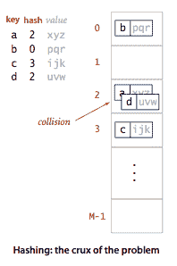
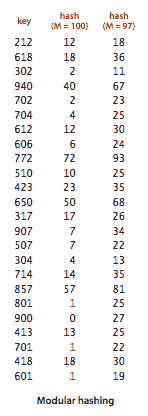
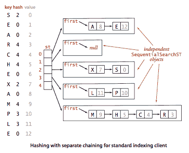
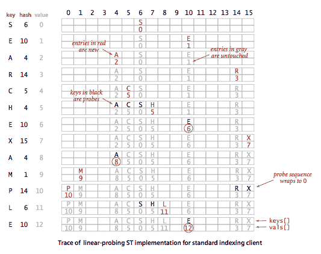

# 3.4   哈希表

> 原文：[`algs4.cs.princeton.edu/34hash`](https://algs4.cs.princeton.edu/34hash)
> 
> 译者：[飞龙](https://github.com/wizardforcel)
> 
> 协议：[CC BY-NC-SA 4.0](https://creativecommons.org/licenses/by-nc-sa/4.0/)


如果键是小整数，我们可以使用数组来实现符号表，通过将键解释为数组索引，以便我们可以将与键 i 关联的值存储在数组位置 i 中。在本节中，我们考虑*哈希*，这是一种处理更复杂类型键的简单方法的扩展。我们通过进行算术运算将键转换为数组索引来引用键值对。



使用哈希的搜索算法由两个独立部分组成。第一步是计算*哈希函数*，将搜索键转换为数组索引。理想情况下，不同的键将映射到不同的索引。这种理想通常超出我们的能力范围，因此我们必须面对两个或更多不同键可能哈希到相同数组索引的可能性。因此，哈希搜索的第二部分是处理这种情况的*冲突解决*过程。

## 哈希函数。

如果我们有一个可以容纳 M 个键值对的数组，则需要一个函数，可以将任何给定的键转换为该数组的索引：在范围[0, M-1]内的整数。我们寻求一个既易于计算又均匀分布键的哈希函数。

+   *典型例子。* 假设我们有一个应用程序，其中键是美国社会安全号码。例如，社会安全号码 123-45-6789 是一个分为三个字段的 9 位数。第一个字段标识发放号码的[地理区域](http://cpsr.org/prevsite/cpsr/privacy/ssn/ssn.structure.html/)（例如，第一个字段为 035 的号码来自罗德岛，第一个字段为 214 的号码来自马里兰），其他两个字段标识个人。有十亿个不同的社会安全号码，但假设我们的应用程序只需要处理几百个键，因此我们可以使用大小为 M = 1000 的哈希表。实现哈希函数的一种可能方法是使用键中的三位数。使用右侧字段中的三位数可能比使用左侧字段中的三位数更可取（因为客户可能不均匀地分布在地理区域上），但更好的方法是使用所有九位数制成一个整数值，然后考虑下面描述的整数的哈希函数。

+   *正整数。* 用于哈希整数的最常用方法称为*模块化哈希*：我们选择数组大小 M 为素数，并且对于任何正整数键 k，计算 k 除以 M 的余数。这个函数非常容易计算（在 Java 中为 k % M），并且在 0 和 M-1 之间有效地分散键。

+   *浮点数。* 如果键是介于 0 和 1 之间的实数，我们可能只需乘以 M 并四舍五入到最接近的整数以获得 0 和 M-1 之间的索引。尽管这是直观的，但这种方法有缺陷，因为它给予键的最高有效位更多权重；最低有效位不起作用。解决这种情况的一种方法是使用键的二进制表示进行模块化哈希（这就是 Java 所做的）。

+   *字符串。* 模块化哈希也适用于长键，如字符串：我们只需将它们视为巨大的整数。例如，下面的代码计算了一个 String s 的模块化哈希函数，其中 R 是一个小素数（Java 使用 31）。

    ```java
    int hash = 0;
    for (int i = 0; i < s.length(); i++)
        hash = (R * hash + s.charAt(i)) % M;

    ```

+   *复合键。* 如果键类型具有多个整数字段，我们通常可以像刚才描述的`String`值一样将它们混合在一起。例如，假设搜索键的类型为 USPhoneNumber.java，其中包含三个整数字段：区域（3 位区号）、交换（3 位交换）和分机（4 位分机）。在这种情况下，我们可以计算数字

    ```java
    int hash = (((area * R + exch) % M) * R + ext) % M; 

    ```

+   *Java 约定。* Java 帮助我们解决了每种数据类型都需要一个哈希函数的基本问题，要求每种数据类型必须实现一个名为`hashCode()`的方法（返回一个 32 位整数）。对象的`hashCode()`实现必须与`equals`一致。也就是说，如果`a.equals(b)`为真，则`a.hashCode()`必须与`b.hashCode()`具有相同的数值。如果`hashCode()`值相同，则对象可能相等也可能不相等，我们必须使用`equals()`来确定哪种情况成立。

+   *将`hashCode()`转换为数组索引。* 由于我们的目标是一个数组索引，而不是 32 位整数，因此我们在实现中将`hashCode()`与模块化哈希结合起来，以产生 0 到 M-1 之间的整数，如下所示：

    ```java
    private int hash(Key key) {
       return (key.hashCode() & 0x7fffffff) % M;
    }

    ```

    该代码掩盖了符号位（将 32 位整数转换为 31 位非负整数），然后通过除以 M 来计算余数，就像模块化哈希一样。

+   *用户定义的`hashCode()`。* 客户端代码期望`hashCode()`在可能的 32 位结果值中均匀分散键。也就是说，对于任何对象`x`，你可以编写`x.hashCode()`，并且原则上期望以相等的可能性获得 2³² 个可能的 32 位值中的任何一个。Java 为许多常见类型（包括`String`、`Integer`、`Double`、`Date`和`URL`）提供了渴望实现此功能的`hashCode()`实现，但对于您��己的类型，您必须自己尝试。程序 PhoneNumber.java 演示了一种方法：从实例变量中生成整数并使用模块化哈希。程序 Transaction.java 演示了一种更简单的方法：使用实例变量的`hashCode()`方法将每个转换为 32 位`int`值，然后进行算术运算。

在为给定数据类型实现良好的哈希函数时，我们有三个主要要求：

+   它应该是*确定性的*—相同的键必须产生相同的哈希值。

+   计算效率应该*高*。

+   它应该*均匀分布键*。

为了分析我们的哈希算法并对其性能提出假设，我们做出以下理想化假设。

## 假设 J（均匀哈希假设）。

我们使用的哈希函数在 0 和 M-1 之间的整数值之间均匀分布键。

## 使用分离链接进行哈希。

哈希函数将键转换为数组索引。哈希算法的第二个组成部分是冲突解决：处理两个或更多个要插入的键哈希到相同索引的情况的策略。冲突解决的一个直接方法是为 M 个数组索引中的每一个构建一个键-值对的链表，这些键的哈希值为该索引。基本思想是选择足够大的 M，使得列表足够短，以便通过两步过程进行有效搜索：哈希以找到可能包含键的列表，然后顺序搜索该列表以查找键。

程序 SeparateChainingHashST.java 实现了一个带有分离链接哈希表的符号表。它维护了一个 SequentialSearchST 对象的数组，并通过计算哈希函数来选择哪个`SequentialSearchST`可以包含键，并然后使用`SequentialSearchST`中的`get()`和`put()`来完成工作。程序 SeparateChainingLiteHashST.java 类似，但使用了一个显式的`Node`嵌套类。

**命题 K。** 在具有 M 个列表和 N 个键的分离链接哈希表中，假设 J 下，列表中键的数量在 N/M 的小常数因子范围内的概率极其接近 1。N/M 的小常数因子范围内的概率极其接近 1。 （假设一个理想的哈希函数。）

这个经典的数学结果很有说服力，但它完全依赖于假设 J。然而，在实践中，相同的行为发生。

**性质 L.** 在具有 M 个列表和 N 个键的分离链接哈希表中，搜索和插入的比较次数（相等测试）与 N/M 成正比。

## 使用线性探测进行哈希。

实现哈希的另一种方法是将 N 个键值对存储在大小为 M > N 的哈希表中，依赖表中的空条目来帮助解决冲突。这种方法称为*开放寻址*哈希方法。最简单的开放寻址方法称为*线性探测*：当发生冲突（当我们哈希到已经被不同于搜索键的键占据的表索引时），我们只需检查表中的下一个条目（通过增加索引）。有三种可能的结果：

+   键等于搜索键：搜索命中

+   空位置（索引位置处的空键）：搜索未命中

+   键不等于搜索键：尝试下一个条目



程序 LinearProbingHashST.java 是使用这种方法实现符号表 ADT 的实现。

与分离链接一样，开放寻址方法的性能取决于比率 α = N/M，但我们对其进行了不同的解释。对于分离链接，α 是每个列表的平均项目数，通常大于 1。对于开放寻址，α 是占用的表位置的百分比；它*必须*小于 1。我们将 α 称为哈希表的*负载因子*。

**命题 M.** 在大小为 M 的线性探测哈希表中，N = α M 个键，平均探测次数（在假设 J 下）对于搜索命中约为 ~ 1/2 (1 + 1 / (1 - α))，对于搜索未命中或插入约为 ~ 1/2 (1 + 1 / (1 - α)²)。

#### 问与答。

1.  为什么 Java 在 `String` 的 `hashCode()` 中使用 31？

1.  它是质数，因此当用户通过另一个数字取模时，它们没有公共因子（除非它是 31 的倍数）。31 也是梅森素数（如 127 或 8191），是一个比某个 2 的幂少 1 的素数。这意味着如果机器的乘法指令很慢，那么取模可以通过一次移位和一次减法完成。

1.  如何从类型为`double`的变量中提取位以用��哈希？

1.  `Double.doubleToLongBits(x)`返回一个 64 位的`long`整数，其位表示与`double`值`x`的浮点表示相同。

1.  使用`(s.hashCode() % M)`或`Math.abs(s.hashCode()) % M`进行哈希到 0 到 M-1 之间的值有什么问题？

1.  如果第一个参数为负数，则`%`运算符返回一个非正整数，这将导致数组索引越界错误。令人惊讶的是，绝对值函数甚至可以返回一个负整数。如果其参数为`Integer.MIN_VALUE`，那么由于生成的正整数无法用 32 位的二进制补码整数表示，这种情况就会发生。这种错误将非常难以追踪，因为它只会发生 40 亿分之一的时间！[字符串"polygenelubricants"的哈希码为-2³¹。]

#### 练习

1.  下面的`hashCode()`实现是否合法？

    ```java
    public int hashCode() {
       return 17;
    }

    ```

    *解决方案。* 是的，但这将导致所有键都哈希到相同的位置，这将导致性能不佳。

1.  分析使用分离链接、线性探测和二叉搜索树（BSTs）处理`double`键的空间使用情况。将结果呈现在类似第 476 页上的表中。

    *解决方案。*

    +   *顺序搜索。* 24 + 48N. `SequentialSearch` 符号表中的 `Node` 占用 48 字节的内存（16 字节开销，8 字节键，8 字节值，8 字节下一个，8 字节内部类开销）。`SequentialSearch` 对象占用 24 字节（16 字节开销，8 字节第一个）加上节点的内存。

        请注意，booksite 版本每个`SequentialSearch`对象额外使用 8 字节（4 用于 N，4 用于填充）。

    +   *分离链接。* 56 + 32M + 48N。`SeparateChaining`符号表消耗 8M + 56 字节（16 字节开销，20 字节数组开销，8 字节指向数组，每个数组条目的引用 8 字节，4 字节 M，4 字节 N，4 字节填充），再加上 M 个`SequentialSearch`对象的内存。

#### 创意练习

1.  **哈希攻击。** 找到 2^N 个长度为 N 的字符串，它们具有相同的`hashCode()`值，假设`String`的`hashCode()`实现（如[Java 标准](http://docs.oracle.com/javase/6/docs/api/java/lang//String.html#hashCode())中指定的）如下：

    ```java
    public int hashCode() {
       int hash = 0;
       for (int i = 0; i < length(); i++)
          hash = (hash * 31) + charAt(i);
       return hash;
    }

    ```

    *解决方案。* 很容易验证`"Aa"`和`"BB"`哈希到相同的`hashCode()`值（2112）。现在，任何由这两个字符串以任何顺序连接在一起形成的长度为 2N 的字符串（例如，BBBBBB，AaAaAa，BBAaBB，AaBBBB）将哈希到相同的值。这里是一个具有相同哈希值的 10000 个字符串的列表。

1.  **糟糕的哈希函数。** 考虑以下用于早期 Java 版本的`String`的`hashCode()`实现：

    ```java
    public int hashCode() {
       int hash = 0;
       int skip = Math.max(1, length() / 8);
       for (int i = 0; i < length(); i += skip)
          hash = (hash * 37) + charAt(i);
       return hash;
    }

    ```

    解释为什么你认为设计者选择了这种实现，然后为什么你认为它被放弃，而选择了上一个练习中的实现。

    *解决方案。* 这样做是希望更快地计算哈希函数。确实，哈希值计算得更快，但很可能许多字符串哈希到相同的值。这导致在许多真实输入（例如，长 URL）上性能显著下降，这些输入都哈希到相同的值，例如，`http://www.cs.princeton.edu/algs4/34hash/*****java.html`。

#### 网络练习

1.  假设我们希望重复搜索一个长度为 N 的链表，每个元素都包含一个非常长的字符串键。在搜索具有给定键的元素时，我们如何利用哈希值？ *解决方案*：预先计算列表中每个字符串的哈希值。在搜索键 t 时，将其哈希值与字符串 s 的哈希值进行比较。只有在它们的哈希值相等时才比较字符串 s 和 t。

1.  为以下数据类型实现`hashCode()`和`equals()`。要小心，因为很可能许多点的 x、y 和 z 都是小整数。

    ```java
    public class Point2D {
        private final int x, y;
        ...
    }

    ```

    *答案*：一个解决方案是使哈希码的前 16 位是 x 的前 16 位和 y 的后 16 位的异或，将哈希码的后 16 位是 x 的后 16 位和 y 的前 16 位的异或。因此，如果 x 和 y 只有 16 位或更少，那么不同点的 hashCode 值将不同。

1.  以下点的`equals()`实现有什么问题？

    ```java
    public boolean equals(Point q) {
        return x == q.x && y == q.y;
    }

    ```

    `equals()`的错误签名。这是`equals()`的重载版本，但它没有覆盖从`Object`继承的版本。这将破坏任何使用`Point`与`HashSet`的代码。这是更常见的错误之一（与在覆盖`equals()`时忽略覆盖`hashCode()`一样）。

1.  以下代码片段将打印什么？

    ```java
    import java.util.HashMap;
    import java.util.GregorianCalendar;

    HashMap st = new HashMap<gregoriancalendar string="">();
    GregorianCalendar x = new GregorianCalendar(1969, 21, 7);
    GregorianCalendar y = new GregorianCalendar(1969, 4, 12);
    GregorianCalendar z = new GregorianCalendar(1969, 21, 7);
    st.put(x, "human in space");
    x.set(1961, 4, 12);
    System.out.println(st.get(x));
    System.out.println(st.get(y));
    System.out.println(st.get(z));</gregoriancalendar> 
    ```

    它将打印 false，false，false。日期 7/21/1969 被插入到哈希表中，但在哈希表中的值被更改为 4/12/1961。因此，尽管日期 4/12/1961 在哈希表中，但在搜索 x 或 y 时，我们将在错误的桶中查找，找不到它。我们也找不到 z，因为日期 7/21/1969 不再是哈希表中的键。

    这说明在哈希表的键中只使用不可变类型是一个好习惯。Java 设计者可能应该使`GregorianCalendar`成为一个不可变对象，以避免出现这样的问题。

1.  **密码检查器。** 编写一个程序，从命令行读取一个字符串和从标准输入读取一个单词字典，并检查它是否是一个“好”密码。在这里，假设“好”意味着它（i）至少有 8 个字符长，（ii）不是字典中的一个单词，（iii）不是字典中的一个单词后跟一个数字 0-9（例如，hello5），（iv）不是由一个数字分隔的两个单词（例如，hello2world）。

1.  **反向密码检查器。** 修改前一个问题，使得（ii）-（v）也适用于字典中单词的反向（例如，olleh 和 olleh2world）。*巧妙的解决方案*：将每个单词及其反向插入符号表。

1.  **镜像网站。** 使用哈希来确定哪些文件需要更新以镜像网站。

1.  **生日悖论。** 假设您的音乐点播播放器随机播放您的 4000 首歌曲（带替换）。您期望等待多久才能听到一首歌曲第二次播放？

1.  **布隆过滤器。** 支持插入、存在。通过允许一些误报来使用更少的空间。应用：ISP 缓存网页（特别是大图像、视频）；客户端请求 URL；服务器需要快速确定页面是否在缓存中。解决方案：维护一个大小为 N = 8M（M = 要插入的元素数）的位数组。从 0 到 N-1 选择 k 个独立的哈希函数。

1.  **CRC-32。** 哈希的另一个应用是计算*校验和*以验证某个数据文件的完整性。要计算字符串 `s` 的校验和，

    ```java
    import java.util.zip.CRC32;
    ...
    CRC32 checksum = new CRC32();
    checksum.update(s.getBytes());
    System.out.println(checksum.getValue());

    ```

1.  **完美哈希。** 另请参见 GNU 实用程序 gperf。

1.  **密码学安全哈希函数。** SHA-1 和 MD5。可以通过将字符串转换为字节或每次读取一个字节时计算它。程序 OneWay.java 演示了如何使用 `java.security.MessageDigest` 对象。

1.  **指纹。** 哈希函数（例如，MD5 和 SHA-1）也可用于验证文件的完整性。将文件哈希为一个短字符串，将字符串与文件一起传输，如果传输文件的哈希与哈希值不同，则数据已损坏。

1.  **布谷鸟哈希。** 在均匀哈希的最大负载下为 log n / log log n。通过选择两者中负载最小的来改进为 log log n。（如果选择 d 中负载最小的，则仅改进为 log log n / log d。）[布谷鸟哈希](http://mybiasedcoin.blogspot.com/2007/06/cuckoo-hashing-theory-and-practice-part.html) 实现了常数平均插入时间和常数最坏情况搜索：每个项目有两个可能的插槽。如果空，则放入两个可用插槽中的任一个；如果不是，则将另一个插槽中的另一个项目弹出并移动到其另一个插槽中（并递归）。"这个名字来源于一些布谷鸟物种的行为，母鸟将蛋推出另一只鸟的巢来产卵。"如果进入重新定位循环，则重新散列所有内容。

1.  **协变等于。** CovariantPhoneNumber.java 实现了一个协变的 `equals()` 方法。

1.  **后来者先服务线性探测。** 修改 LinearProbingHashST.java，使得每个项目都插入到它到达的位置；如果单元格已经被占用，则该项目向右移动一个条目（规则重复）。

1.  **罗宾汉线性探测。** 修改 LinearProbingHashST.java，使得当一个项目探测到已经被占用的单元格时，当前位移较大的项目（两者中的一个）获得单元格，另一个项目向右移动一个条目（规则重复）。

1.  **冷漠图。** 给定实线上的 V 个点，其[冷漠图](https://en.wikipedia.org/wiki/Indifference_graph)是通过为每个点添加一个顶点并在两个顶点之间添加一条边形成的图，当且仅当两个对应点之间的距离严格小于一时。设计一个算法（在均匀哈希假设下），以时间比��于 V + E 计算一组 V 点的冷漠图。

    *解决方案.* 将每个实数向下取整到最近的整数，并使用哈希表来识别所有向同一整数取整的点。现在，对于每个点 p，使用哈希表找到所有向 p 的取整值内的整数取整的点，并为距离小于一的每对点添加一条边(p, q)。参见[此参考链接](http://11011110.livejournal.com/287956.html)以了解为什么这需要线性时间。
