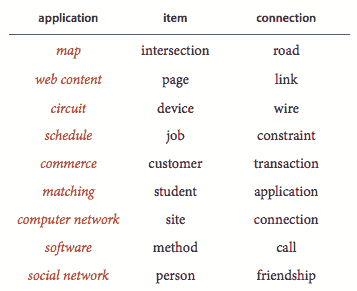

# 4\.   图

> 原文：[`algs4.cs.princeton.edu/40graphs`](https://algs4.cs.princeton.edu/40graphs)

## 概述。

项目之间的成对连接在大量计算应用程序中起着至关重要的作用。这些连接所暗示的关系引发了一系列自然问题：是否有一种方法可以通过遵循这些连接将一个项目连接到另一个项目？有多少其他项目连接到给定项目？这个项目和另一个项目之间的连接的最短链是什么？下表展示了涉及图处理的各种应用程序的多样性。

我们逐步介绍了四种最重要的图模型：无向图（具有简单连接），有向图（其中每个连接的方向很重要），带权重的图（其中每个连接都有一个相关联的权重），以及带权重的有向图（其中每个连接都有方向和权重）。

+   *4.1 无向图*介绍了图数据类型，包括深度优先搜索和广度优先搜索。

+   *4.2 有向图*介绍了有向图数据类型，包括拓扑排序和强连通分量。

+   *4.3 最小生成树*描述了最小生成树问题以及解决它的两种经典算法：Prim 算法和 Kruskal 算法。

+   *4.4 最短路径*介绍了最短路径问题以及解决它的两种经典算法：Dijkstra 算法和 Bellman-Ford 算法。

## 本章中的 Java 程序。

下面是本章中的 Java 程序列表。单击程序名称以访问 Java 代码；单击参考号以获取简要描述；阅读教科书以获取详细讨论。

> | REF | 程序 | 描述 / JAVADOC |
> | --- | --- | --- |
> | - | Graph.java | 无向图 |
> | - | GraphGenerator.java | 生成随机图 |
> | - | DepthFirstSearch.java | 图中的深度优先搜索 |
> | - | NonrecursiveDFS.java | 图中的 DFS（非递归） |
> | 4.1 | DepthFirstPaths.java | 图中的路径（DFS） |
> | 4.2 | BreadthFirstPaths.java | 图中的路径（BFS） |
> | 4.3 | CC.java | 图的连通分量 |
> | - | Bipartite.java | 二分图或奇环（DFS） |
> | - | BipartiteX.java | 二分图或奇环（BFS） |
> | - | Cycle.java | 图中的环 |
> | - | EulerianCycle.java | 图中的欧拉回路 |
> | - | EulerianPath.java | 图中的欧拉路径 |
> | - | SymbolGraph.java | 符号图 |
> | - | DegreesOfSeparation.java | 分离度 |
> | - | Digraph.java | 有向图 |
> | - | DigraphGenerator.java | 生成随机有向图 |
> | 4.4 | DirectedDFS.java | 有向图中的深度优先搜索 |
> | - | NonrecursiveDirectedDFS.java | 有向图中的深度优先搜索（非递归） |
> | - | DepthFirstDirectedPaths.java | 有向图中的路径（深度优先搜索） |
> | - | BreadthFirstDirectedPaths.java | 有向图中的路径（广度优先搜索） |
> | - | DirectedCycle.java | 有向图中的环 |
> | - | DirectedCycleX.java | 有向图中的环（非递归） |
> | - | DirectedEulerianCycle.java | 有向图中的欧拉回路 |
> | - | DirectedEulerianPath.java | 有向图中的欧拉路径 |
> | - | DepthFirstOrder.java | 有向图中的深度优先顺序 |
> | 4.5 | Topological.java | 有向无环图中的拓扑排序 |
> | - | TopologicalX.java | 拓扑排序（非递归） |
> | - | TransitiveClosure.java | 传递闭包 |
> | - | SymbolDigraph.java | 符号有向图 |
> | 4.6 | KosarajuSharirSCC.java | 强连通分量（Kosaraju–Sharir 算法） |
> | - | TarjanSCC.java | 强连通分量（Tarjan 算法） |
> | - | GabowSCC.java | 强连通分量（Gabow 算法） |
> | - | EdgeWeightedGraph.java | 加权边图 |
> | - | Edge.java | 加权边 |
> | - | LazyPrimMST.java | 最小生成树（延时 Prim 算法） |
> | 4.7 | PrimMST.java | 最小生成树（Prim 算法） |
> | 4.8 | KruskalMST.java | 最小生成树（Kruskal 算法） |
> | - | BoruvkaMST.java | 最小生成树（Boruvka 算法） |
> | - | EdgeWeightedDigraph.java | 加权有向图 |
> | - | DirectedEdge.java | 加权有向边 |
> | 4.9 | DijkstraSP.java | 最短路径（Dijkstra 算法） |
> | - | DijkstraUndirectedSP.java | 无向图的最短路径（Dijkstra 算法） |
> | - | DijkstraAllPairsSP.java | 全局最短路径 |
> | 4.10 | AcyclicSP.java | 有向无环图中的最短路径 |
> | - | AcyclicLP.java | 有向无环图中的最长路径 |
> | - | CPM.java | 关键路径法 |
> | 4.11 | BellmanFordSP.java | 最短路径（贝尔曼-福特算法） |
> | - | EdgeWeightedDirectedCycle.java | 加权有向图中的环 |
> | - | Arbitrage.java | 套汇检测 |
> | - | FloydWarshall.java | 全局最短路径（稠密图） |
> | - | AdjMatrixEdgeWeightedDigraph.java | 加权图（稠密图） |
