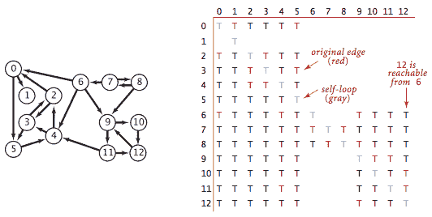

# 4.2   有向图

> 原文：[`algs4.cs.princeton.edu/42digraph`](https://algs4.cs.princeton.edu/42digraph)
> 
> 译者：[飞龙](https://github.com/wizardforcel)
> 
> 协议：[CC BY-NC-SA 4.0](https://creativecommons.org/licenses/by-nc-sa/4.0/)

## 有向图。

一个*有向图*（或*有向图*）是一组*顶点*和一组*有向边*，每条边连接一个有序对的顶点。我们说一条有向边*从*该对中的第一个顶点*指向*该对中的第二个顶点。对于 V 个顶点的图，我们使用名称 0 到 V-1 来表示顶点。

## 术语表。

这里是我们使用的一些定义。

+   *自环* 是连接顶点到自身的边。

+   如果两条边连接相同的顶点对，则它们是*平行*的。

+   一个顶点的*outdegree*是指指向它的边的数量。

+   一个顶点的*indegree*是指指向它的边的数量。

+   *子图*是构成有向图的一部分边（和相关顶点）的子集。

+   在有向图中，*有向路径*是一个顶点序列，其中每个顶点到其后继顶点有一条（有向）边，且没有重复的边。

+   一个有向路径是*简单*的，如果它没有重复的顶点。

+   一个*有向循环*是一条有向路径（至少有一条边），其第一个和最后一个顶点相同。

+   如果一个有向循环没有重复的顶点（除了第一个和最后一个顶点的必要重复），那么它是*简单*的。

+   一条路径或循环的*长度*是指它的边数。

+   我们说一个顶点 `w` 是*从*顶点 `v` *可达*的，如果存在一条从 `v` 到 `w` 的有向路径。

+   如果两个顶点 `v` 和 `w` 是*强连通*的，那么它们是相互可达的：从 `v` 到 `w` 有一条有向路径，从 `w` 到 `v` 也有一条有向路径。

+   如果每个顶点到每个其他顶点都有一条有向路径，那么有向图是*强连通*的。

+   一个非强连通的有向图由一组*强连通分量*组成，这些分量是最大的强连通子图。

+   一个*有向无环图*（或 DAG）是一个没有有向循环的有向图。

     

## 有向图数据类型。

我们实现了以下有向图 API。

关键方法 `adj()` 允许客户端代码遍历从给定顶点邻接的顶点。

我们使用以下输入文件格式准备测试数据 tinyDG.txt。

## 图的表示。

我们使用*邻接表表示法*，其中我们维护一个以顶点为索引的列表数组，其中包含与每个顶点通过边连接的顶点。

Digraph.java 使用邻接表表示法实现了有向图 API。AdjMatrixDigraph.java 使用邻接矩阵表示法实现了相同的 API。

## 有向图中的可达性。

深度优先搜索和广度优先搜索是基本的有向图处理算法。

+   *单源可达性:* 给定一个有向图和源 `s`，是否存在一条从 s 到 v 的有向路径？如果是，找到这样的路径。DirectedDFS.java 使用深度优先搜索来解决这个问题。

+   *多源可达性:* 给定一个有向图和一组源顶点，是否存在一条从集合中的*任意*顶点到 v 的有向路径？DirectedDFS.java 使用深度优先搜索来解决这个问题。

+   *单源有向路径:* 给定一个有向图和源 `s`，是否存在一条从 s 到 v 的有向路径？如果是，找到这样的路径。DepthFirstDirectedPaths.java 使用深度优先搜索来解决这个问题。

+   *单源最短有向路径*：给定一个有向图和源点`s`，是否存在从 s 到 v 的有向路径？如果有，找到一条最短的这样的路径。BreadthFirstDirectedPaths.java 使用广度优先搜索来解决这个问题。

## 循环和 DAG。

在涉及处理有向图的应用中，有向循环尤为重要。输入文件 tinyDAG.txt 对应于以下 DAG：

+   *有向环检测*：给定一个有向图，是否存在有向环？如果有，找到这样的环。DirectedCycle.java 使用深度优先搜索来解决这个问题。

+   *深度优先顺序*：深度优先搜索每个顶点恰好一次。在典型应用中，有三种顶点排序是感兴趣的：

    +   *前序*：在递归调用之前将顶点放入队列。

    +   *后序*：在递归调用后将顶点放入队列。

    +   *逆后序*：在递归调用后将顶点放入栈。

    DepthFirstOrder.java 计算这些顺序。

    

+   *拓扑排序*：给定一个有向图，按顶点顺序排列，使得所有的有向边都从顺序中较早的顶点指向顺序中较晚的顶点（或报告无法这样做）。Topological.java 使用深度优先搜索来解决这个问题。值得注意的是，在 DAG 中的逆后序提供了一个拓扑顺序。

### 命题。

有向图具有拓扑顺序当且仅当它是 DAG。

### 命题。

DAG 中的逆后序是拓扑排序。

### 命题。

使用深度优先搜索，我们可以在时间上将 DAG 进行拓扑排序，时间复杂度为 V + E。

## 强连通性。

强连通性是顶点集合上的等价关系：

+   *自反性*：每个顶点 v 与自身强连通。

+   *对称性*：如果 v 与 w 强连通，则 w 也与 v 强连通。

+   *传递性*：如果 v 与 w 强连通，且 w 与 x 强连通，则 v 也与 x 强连通。

强连通性将顶点划分为等价类，我们简称为*强连通分量*。我们试图实现以下 API：

令人惊讶的是，KosarajuSharirSCC.java 仅通过在 CC.java 中添加几行代码就实现了该 API，如下所示：

+   给定一个有向图 G，使用 DepthFirstOrder.java 来计算其反向图 G^R 的逆后序。

+   在 G 上运行标准 DFS，但考虑刚刚计算的顺序中的未标记顶点，而不是标准的数字顺序。

+   从构造函数中对递归`dfs()`的调用到达的所有顶点都在一个强连通分量中（！），因此像在 CC 中一样识别它们。

### 命题。

Kosaraju-Sharir 算法使用预处理时间和空间与 V + E 成比例，以支持有向图中的常数时间强连通性查询。

## 传递闭包。

有向图 G 的*传递闭包*是另一个有向图，具有相同的顶点集，但如果且仅当在 G 中从 v 到 w 可达时，有一条从 v 到 w 的边。

TransitiveClosure.java 通过从每个顶点运行深度优先搜索并存储结果来计算有向图的传递闭包。这种解决方案非常适合小型或密集的有向图，但不适用于我们在实践中可能遇到的大型有向图，因为构造函数使用的空间与 V² 成比例，时间与 V (V + E) 成比例。

#### 练习

1.  为 Digraph 创建一个复制构造函数，该函数以有向图 G 作为输入，并创建和初始化有向图的新副本。客户端对 G 所做的任何更改都不应影响新创建的有向图。

1.  有向图在第 591 页上有多少个强连通分量？

    *解决方案*: 10\. 输入文件是 mediumDG.txt。

1.  有向无环图（DAG）的强连通分量是什么？

    *解决方案*: 每个顶点都是自己的强连通分量。

1.  真或假：有向图的反向的逆后序与有向图的逆后序相同。

    *解决方案*: 假。

1.  真或假：如果我们修改 Kosaraju-Sharir 算法，在有向图 G 中运行第一个深度优先搜索（而不是反向有向图 G^R），并在 G^R 中运行第二个深度优先搜索（而不是 G），那么它仍然会找到强连通分量。

    *解决方案.* 是的，有向图的强连通分量与其反向的强连通分量相同。

1.  真或假：如果我们修改 Kosaraju-Sharir 算法，用广度优先搜索替换第二次深度优先搜索，那么它仍然会找到强连通分量。

    *解决方案.* 真。

1.  计算具有 V 个顶点和 E 条边的`Digraph`的内存使用情况，根据第 1.4 节的内存成本模型。

    *解决方案.* 56 + 40V + 64E。MemoryOfDigraph.java 根据经验计算，假设没有缓存`Integer`值—Java 通常会缓存-128 到 127 之间的整数。

#### 创造性问题

1.  **有向欧拉回路。** 有向欧拉回路是一个包含每条边恰好一次的有向循环。编写一个有向图客户端 DirectedEulerianCycle.java 来查找有向欧拉回路或报告不存在这样的回路。

    *提示*: 证明一个有向图 G 有一个有向欧拉回路当且仅当 G 中的每个顶点的入度等于出度，并且所有具有非零度的顶点属于同一个强连通分量。

1.  **强连通分量。** 描述一个计算包含给定顶点 v 的强连通分量的线性时间算法。基于该算法，描述一个简单的二次时间算法来计算有向图的强连通分量。

    *部分解决方案*: 计算包含 s 的强连通分量

    +   找到从 s 可达的顶点集

    +   找到可以到达 s 的顶点集

    +   取两个集合的交集，使用这个作为子程序，你可以在时间比例为 t（E + V）的情况下找到所有强连通分量，其中 t 是强连通分量的数量。

1.  **DAG 中的哈密顿路径。** 给定一个 DAG，设计一个线性时间算法来确定是否存在一个访问每个顶点恰好一次的有向路径。

    *解决方案*: 计算一个拓扑排序，并检查拓扑顺序中每对连续顶点之间是否有边。

1.  **唯一拓扑排序。** 设计一个算法来确定一个有向图是否有唯一的拓扑排序。

    *提示*: 一个有向图有一个唯一的拓扑排序当且仅当拓扑排序中每对连续顶点之间存在一个有向边（即，有向图有一个哈密顿路径）。如果有向图有多个拓扑排序，那么可以通过交换一对连续顶点来获得第二个拓扑排序。

1.  **2-可满足性。** 给定一个布尔公式，其合取范式中有 M 个子句和 N 个文字，每个子句恰好有两个文字，找到一个满足的赋值（如果存在）。

    *解决方案草图*: 用 2N 个顶点（每个文字及其否定一个）形成*蕴含有向图*。对于每个子句 x + y，从 y'到 x 和从 x'到 y 包括边缘。声明：如果没有变量 x 与其否定 x'在同一个强连通分量中，则公式是可满足的。此外，核心 DAG 的拓扑排序（将每个强连通分量缩减为单个顶点）产生一个满足的赋值。

1.  **基于队列的拓扑排序算法。** 开发一个非递归的拓扑排序实现 TopologicalX.java，该实现维护一个顶点索引数组，用于跟踪每个顶点的入度。在一次遍历中初始化数组和源队列，就像练习 4.2.7 中那样。然后，执行以下操作，直到源队列为空：

    +   从队列中移除一个源并标记它。

    +   减少入度数组中与已移除顶点的边的目标顶点对应的条目。

    +   如果减少任何条目使其变为 0��则将相应的顶点插入源队列。

1.  **最短有向循环。** 给定一个有向图，设计一个算法来找到具有最少边数的有向循环（或报告图是无环的）。你的算法在最坏情况下的运行时间应该与*E V*成正比。

    *应用：* 给出一组需要肾移植的患者，每个患者都有一个愿意捐赠肾脏但类型不匹配的家庭成员。愿意捐赠给另一个人，前提是他们的家庭成员得到肾脏。然后医院进行“多米诺手术”，所有移植同时进行。

    *解决方案：* 从每个顶点 s 运行 BFS。通过 s 的最短循环是一条边 v->s，再加上从 s 到 v 的最短路径。ShortestDirectedCycle.java。

1.  **奇数长度的有向循环。** 设计一个线性时间算法，以确定一个有向图是否有一个奇数长度的有向循环。

    *解决方案。* 我们声称，如果一个有向图 G 有一个奇数长度的有向循环，那么它的一个（或多个）强连通分量作为无向图时是非二分的。

    +   如果有向图 G 有一个奇数长度的有向循环，则此循环将完全包含在一个强连通分量中。当强连通分量被视为无向图时，奇数长度的有向循环变为奇数长度的循环。回想一下，无向图是二分的当且仅当它没有奇数长度的循环。

    +   假设 G 的一个强连通分量是非二分图（当作无向图处理时）。这意味着在强连通分量中存在一个奇数长度的循环 C，忽略方向。如果 C 是一个有向循环，那么我们完成了。否则，如果边 v->w 指向“错误”的方向，我们可以用指向相反方向的奇数长度路径替换它（这保留了循环中边数的奇偶性）。要了解如何做到这一点，请注意存在一条从 w 到 v 的有向路径 P，因为 v 和 w 在同一个强连通分量中。如果 P 的长度为奇数，则我们用 P 替换边 v->w；如果 P 的长度为偶数，则这条路径 P 与 v->w 组合在一起就是一个奇数长度的循环。

1.  **DAG 中可达的顶点。** 设计一个线性时间算法，以确定一个 DAG 是否有一个顶点可以从每个其他顶点到达。

    *解决方案。* 计算每个顶点的出度。如果 DAG 有一个出度为 0 的顶点 v，那么它可以从每个其他顶点到达。

1.  **有向图中可达的顶点。** 设计一个线性时间算法，以确定有向图是否有一个顶点可以从每个其他顶点到达。

    *解决方案。* 计算强连通分量和核 DAG。将练习 4.2.37 应用于核 DAG。

1.  **网络爬虫。** 编写一个程序 WebCrawler.java，使用广度优先搜索来爬取网络有向图，从给定的网页开始。不要显式构建网络有向图。

#### 网络练习

1.  **符号有向图。** 修改 SymbolGraph.java 以创建一个实现符号有向图的程序 SymbolDigraph.java。

1.  **组合电路。** 给定输入，确定组合电路的真值是一个图可达性问题（在有向无环图上）。

1.  **权限提升。** 如果 A 可以获得 B 的权限，则在用户类 A 到用户类 B 之间包含一个数组。找出所有可以在 Windows 中获得管理员访问权限的用户。

1.  **Unix 程序 tsort。**

1.  **跳棋。** 将跳棋规则扩展到一个 N×N 的跳棋棋盘。展示如何确定一个跳棋在当前移动中是否可以变成国王。（使用 BFS 或 DFS。）展示如何确定黑方是否有获胜的着法。（找到一个有向欧拉路径。）

1.  **优先附着模型。** 网络具有无标度特性，并遵循幂律。新页面倾向于*优先附着*到受欢迎的页面上。从指向自身的单个页面开始。每一步中，一个新页面出现，出度为 1。以概率 p，页面指向一个随机页面；以概率(1-p)，页面指向一个现有页面，概率与页面的入度成比例。

1.  **子类型检查。** 给定单继承关系（一棵树），检查 v 是否是 w 的祖先。提示：v 是 w 的祖先当且仅当 pre[v] <= pre[w]且 post[v] >= post[w]。

1.  **子类型检查。** 重复上一个问题，但使用有向无环图而不是树。

1.  **有根树的 LCA。** 给定一个有根树和两个顶点 v 和 w，找到顶点 v 和 w 的*最低共同祖先*（lca）。顶点 v 和 w 的 lca 是离根最远的共同祖先。根树上最基本的问题之一。可以在 O(1)的查询时间内解决，预处理时间为线性时间（Harel-Tarjan，[Bender-Coloton](http://www.ics.uci.edu/~eppstein/261/BenFar-LCA-00.pdf)）。

    找到一个有向无环图，其中最短的祖先路径通向一个不是 LCA 的共同祖先 x。

1.  **九个字母的单词。** 找到一个九个字母的英文单词，使得在适当的顺序中依次删除每个字母后仍然是一个英文单词。使用单词和顶点构建一个有向图，如果一个单词可以通过添加一个字母形成另一个单词，则在两个单词之间添加一条边。

    *答案*：一个解决方案是 startling -> starting -> staring -> string -> sting -> sing -> sin -> in -> i。

1.  **电子表格重新计算。** 希望没有循环依赖。使用公式单元格图的拓扑排序来确定更新单元格的顺序。

1.  **嵌套箱子。** 一个维度为 d 的箱子，其尺寸为(a1, a2, ..., ad)，如果第二个箱子的坐标可以重新排列，使得 a1 < b1, a2 < b2, ..., ad < bd，则该箱子嵌套在第二个箱子内。

    +   给出一个有效的算法，用于确定一个 d 维箱子嵌套在另一个箱子内的位置。提示：排序。

    +   证明嵌套是传递的：如果箱子 i 嵌套在箱子 j 内部，箱子 j 又嵌套在箱子 k 内部，那么箱子 i 也嵌套在箱子 k 内部。

    +   给定一组 n 个 d 维箱子，给出一个有效的算法，找到可以同时嵌套最多箱子的方法。

    *提示*：创建一个有向图，如果箱子 i 嵌套在箱子 j 内部，则从箱子 i 到箱子 j 添加一条边。然后运行拓扑排序。

1.  **Warshall 的传递闭包算法。** WarshallTC.java 算法适用于稠密图。依赖于 AdjMatrixDigraph.java。

1.  **暴力强连通分量算法。** BruteSCC.java 通过首先计算传递闭包来计算强连通分量。时间复杂度为 O(EV)，空间复杂度为 O(V²)。

1.  **Tarjan 的强连通分量算法。** TarjanSCC.java 实现了 Tarjan 算法来计算强连通分量。

1.  **Gabow 的强连通分量算法。** GabowSCC.java 实现了 Gabow 算法来计算强连通分量。

1.  **有向图生成器。** DigraphGenerator.java 生成各种有向图。

1.  **有限马尔可夫链.** 回归状态：一旦在状态开始，马尔可夫链将以概率 1 返回。瞬时状态：有些概率它永远不会返回（某个节点 j，i 可以到达 j，但 j 无法到达 i）。不可约马尔可夫链=所有状态都是回归的。马尔可夫链是不可约的当且仅当它是强连通的。回归组件是核 DAG 中没有离开边的组件。马尔可夫链中的通信类是强连通分量。

    定理. 如果 G 是强连通的，则存在唯一的稳态分布 pi。此外，对于所有 v，pi(v) > 0。

    定理. 如果 G 的核 DAG 具有单个没有离开边的超节点，则存在唯一的稳态分布 pi。此外，对于所有回归的 v，pi(v) > 0 且对于所有瞬时的 v，pi(v) = 0。

1.  **后代引理.** [R. E. Tarjan] 将 pre[v]和 post[v]分别表示为 v 的前序和后序编号，nd[v]表示 v 的后代数（包括 v）。证明以下四个条件是等价的。

    +   顶点 v 是顶点 w 的祖先。

    +   pre[v] <= pre[w] < pre[v] + nd(v).

    +   post[v] - nd [v] < post[w] <= post[v]

    +   pre[v] <= pre[w]且 post[v] >= post[w]（嵌套引理）

1.  **边引理.** [R. E. Tarjan] 证明边(v, w)是以下四种之一：

    +   w 是 v 的子节点：(v, w)是一条*树边*。

    +   w 是 v 的后代但不是子节点：(v, w)是一条*前向边*。

    +   w 是 v 的祖先：(v, w)是一条*后向边*

    +   w 和 v 无关且 pre[v] > pre[w]：(v, w)是一条*交叉边*。

1.  **路径引理.** [R. E. Tarjan] 证明从 v 到 w 的任何路径，其中 pre[v] < pre[w]，都包含 v 和 w 的共同祖先。

1.  证明如果(v, w)是一条边且 pre[v] < pre[w]，则 v 是 DFS 树中 w 的祖先。

1.  **后序引理.** [R. E. Tarjan] 证明如果 P 是一条路径，最后一个顶点 x 在后序中最高，则路径上的每个顶点都是 x 的后代（因此与 x 有一条路径）。

    *解.* 证明通过对 P 的长度进行归纳（或通过反证法）。设(v, w)是一条边，其中 w 是 x 的后代且 post[v] < post[x]。由于 w 是 x 的后代，我们有 pre[w] >= pre[x]。

    +   如果 pre[v] >= pre[x]，那么 v 是 x 的后代（通过嵌套引理）。

    +   如果 pre[v] < pre[x]，那么 pre[v] < pre[w]，这意味着（通过前一个练习）v 是 w 的祖先，因此与 x 有关。但是 post[v] < post[x]意味着 v 是 x 的后代。

1.  **前拓扑排序.** 设计一个线性时间算法来找到一个*前拓扑排序*：一种顶点的排序，使得如果从 v 到 w 有一条路径且 w 在排序中出现在 v 之前，则从 w 到 v 也必须有一条路径。

    *提示*：反向后序是一种前拓扑排序。这是 Kosaraju-Sharir 算法正确性证明的关键。

1.  **Wordnet.** [使用 WordNet 测量形容词的语义取向](http://staff.science.uva.nl/~kamps/publications/2004/kamp:usin04.pdf).

1.  **垃圾收集.** 在像 Java 这样的语言中进行自动内存管理是一个具有挑战性的问题。分配内存很容易，但发现程序何时完成对内存的使用（并回收它）更加困难。引用计数：不适用于循环链接结构。标记-清除算法。根=局部变量和静态变量。从根运行 DFS，标记所有从根引用的变量，依此类推。然后，进行第二遍：释放所有未标记的对象并取消标记所有标记的对象。或者复制垃圾收集器将所有标记的对象移动到单个内存区域。每个对象使用一个额外的位。JVM 在进行垃圾收集时必须暂停。碎片化内存。

    应用：C 泄漏检测器（泄漏=不可达的，未释放的内存）。

1.  **有向循环检测应用。** 应用：检查非法继承循环，检查死锁。目录是文件和其他目录的列表。符号链接是对另一个目录的引用。在列出目录中的所有文件时，需要小心避免跟随符号链接的循环！

1.  **拓扑排序应用。** 应用：课程先修条件、大型计算机程序组件的编译顺序、因果关系、类继承、死锁检测、时间依赖性、计算作业的管道、检查符号链接循环、电子表格中的公式求值。

1.  **强连通分量应用。** 应用于 CAD、马尔可夫链（不可约）、蜘蛛陷阱和网络搜索、指针分析、垃圾回收。

1.  **单向街定理。** 实现一个算法来定向无向图中的边，使其成为强连通图。[罗宾斯定理](http://en.wikipedia.org/wiki/Robbins_theorem)断言，当且仅当无向图是双边连通的（没有桥）时，这是可能的。在这种情况下，一种解决方案是运行深度优先搜索（DFS），并将 DFS 树中的所有边定向远离根节点，将所有剩余的边定向朝向根节点。

1.  **定向混合图中的边以使其无环。** 混合图是具有一些有向边和一些无向边的图。设计一个线性时间算法来确定是否可以定向无向边，使得结果有向图是无环的。

    应用：老城区的狭窄道路希望使每条道路单向通行，但仍允许城市中的每个交叉口可从其他城市到达。

1.  **定向混合图中的边以形成有向循环。** 混合图是具有一些有向边和一些无向边的图。设计一个线性时间算法来确定是否可以定向无向边，使得结果有向图具有有向循环。

    应用：确定最大流是否唯一。

    *解决方案*：[一个算法](https://cstheory.stackexchange.com/questions/32332/reference-for-mixed-graph-acyclicity-testing-algorithm)。

1.  **后序引理变种。** 设 S 和 T 是有向图 G 中的两个强连通分量。证明如果存在一条从 S 中的一个顶点到 T 中的一个顶点的边 e，则 S 中顶点的最高后序编号高于 T 中顶点的最高后序编号。

1.  **DAG 中路径的数量。** 给定一个有向无环图（DAG）和两个特定顶点 s 和 t，设计一个线性时间算法来计算从 s 到 t 的有向路径数量。

    *提示*：拓扑排序。

1.  **DAG 中长度为 L 的路径。** 给定一个有向无环图（DAG）和两个特定顶点 s 和 t，设计一个算法来确定是否存在一条从 s 到 t 的路径，其中恰好包含 L 条边。

1.  **核心顶点。** 给定一个有向图 G，如果从顶点 v 可以到达 G 中的每个顶点，则顶点 v 是一个*核心*顶点。设计一个线性时间算法来找到所有核心顶点。

    *提示*：创建 G 的强连通分量并查看核心 DAG。

1.  **强连通分量和二分图匹配。** 给定一个二分图 G，一个[未匹配边](http://trueshelf.com/exercise/136/unmatchable-edges-of-bipartite-graphs)是指不出现在任何完美匹配中的边。设计一个算法来找到所有未匹配边。

    *提示*：证明以下算法可以胜任。在 G 中找到一个完美匹配；将匹配中的边从双分区的一侧定向到另一侧；将剩余的边定向到相反方向；在不在完美匹配中的边中，返回那些端点在不同强连通分量中的边。

1.  **有向图的传递闭包。** 有向图的[传递闭包](http://en.wikipedia.org/wiki/Transitive_reduction)是具有与原始有向图相同传递闭包的边数最少的有向图。设计一个 V（E + V）算法来计算有向图的传递闭包。请注意，有向图中的传递闭包不一定是唯一的，也不一定是原始有向图的子图。（有向无环图中的传递闭包是唯一的且是原始有向图的子图。）

1.  **奇长度路径。** 给定一个有向图 G 和一个源顶点 s，设计一个线性时间算法，确定通过具有*奇数*边数的路径（不一定简单）从 s 可达的所有顶点。

    *解决方案*：为 G 中的每个顶点 v 创建一个新的有向图 G'，其中包含两个顶点 v 和 v'。对于 G 中的每条边 v->w，包括两条边：v->w'和 w->v'。现在，在 G'中从 s 到 v'的任何路径对应于 G 中从 s 到 v 的奇长度路径。运行 BFS 或 DFS 以确定从 s 可达的顶点。

1.  找到一个有向无环图（DAG）的拓扑排序，无论深度优先搜索（DFS）以何种顺序选择起始顶点，都无法计算为 DFS 的逆后序。展示出 DAG 的每一个拓扑排序都可以被计算为 DFS 的逆后序，只要 DFS 可以任意选择构造函数中起始顶点的顺序。

1.  **非递归 DFS。** 编写一个��序 NonrecursiveDirectedDFS.java，使用显式栈而不是递归来实现深度优先搜索。编写一个程序 NonrecursiveDirectedCycle.java，在不使用递归的情况下找到一个有向环。

1.  **非递归拓扑排序。** 将基于队列的拓扑排序算法 TopologicalX.java 从练习 4.2.39 扩展到在有向图存在有向环时找到该有向环。将程序命名为 DirectedCycle.java。

1.  **Cartalk 难题。** 在字典中找到一个具有以下特性的最长单词：您可以一次删除一个字母（从任一端或中间），结果字符串也是字典中的单词。例如，STRING 是一个具有此特性的 6 字母单词（STRING -> STING -> SING -> SIN -> IN -> I）。

1.  **逆后序与前序。** 真或假：有向图的逆后序与有向图的前序相同。

1.  **Kosaraju–Sharir 算法中的逆后序与前序。** 假设您在 Kosaraju–Sharir 算法中使用有向图的前序而不是逆后序。它是否仍会产生强连通分量？

    *答案*：不会，运行 KosarajuSharirPreorderSCC.java 在`tinyDG.txt`上。
