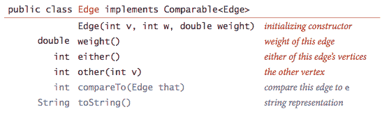
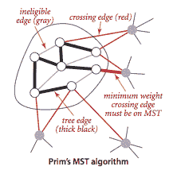

# 4.3   最小生成树

> 原文：[`algs4.cs.princeton.edu/43mst`](https://algs4.cs.princeton.edu/43mst)

## 最小生成树。

*带权重的图* 是一种我们为每条边关联*权重*或*成本*的图。带权重图的*最小生成树（MST）*是其边权重之和不大于任何其他生成树的生成树。

## 假设。

为了简化演示，我们采用以下约定：

+   *图是连通的。* 我们定义的生成树条件意味着图必须是连通的才能存在 MST。如果图不连通，我们可以调整算法以计算其每个连通分量的 MST，统称为*最小生成森林*。

+   *边的权重不一定是距离。* 几何直觉有时是有益的，但边的权重可以是任意的。

+   *边的权重可能为零或负数。* 如果边的权重都是正数，则定义最小生成树为连接所有顶点的总权重最小的子图即可。

+   *边的权重都不同。* 如果边可以具有相同的权重，则最小生成树可能不唯一。做出这种假设简化了我们一些证明，但我们的所有算法即使在存在相同权重的情况下也能正常工作。

## 基本原理。

我们回顾树的两个定义性质：

+   添加连接树中两个顶点的边会创建一个唯一的循环。

+   从树中移除一条边会将其分成两个独立的子树。

        

图的*切割*是将其顶点划分为两个不相交集合。*跨越边*是连接一个集合中的顶点与另一个集合中的顶点的边。我们假设为简单起见，所有边的权重都是不同的。在此假设下，MST 是唯一的。定义切割和循环。以下性质导致多种 MST 算法。

### 命题。（切割性质）

在带权重图中的任何切割中（所有边权重不同），最小权重的跨越边在图的 MST 中。

切割性质是��们考虑 MST 问题的算法的基础。具体来说，它们是*贪心算法*的特例。

### 命题。（贪心 MST 算法）

以下方法将所有连接的带权重图的 MST 中的所有边涂黑：从所有边都涂灰色开始，找到没有黑色边的切割，将其最小权重的边涂黑，继续直到涂黑 V-1 条边。

最小生成树问题](../Images/fce4a44e5b52cd8391fb6ea99f7fa182.png)

## 带权重图数据类型。

我们使用以下 API 表示带权重的边：

`either()` 和 `other()` 方法用于访问边的顶点；`compareTo()` 方法通过权重比较边。Edge.java 是一个直接的实现。

我们使用以下 API 表示带权重的图：

我们允许平行边和自环。EdgeWeightedGraph.java 使用邻接表表示法实现 API。

## MST API.

我们使用以下 API 计算带权重图的最小生成树：

我们准备了一些测试数据：

+   tinyEWG.txt 包含 8 个顶点和 16 条边

+   mediumEWG.txt 包含 250 个顶点和 1,273 条边

+   1000EWG.txt 包含 1,000 个顶点和 8,433 条边

+   10000EWG.txt 包含 10,000 个顶点和 61,731 条边

+   largeEWG.txt 包含一百万个顶点和 7,586,063 条边

## Prim 算法。

Prim 算法通过在每一步将新边附加到单个增长树上来工作：从任何顶点开始作为单个顶点树；然后向其添加 V-1 条边，始终取下一个（着色为黑色）连接树上顶点与尚未在树上的顶点的最小权重边（对于由树顶点定义的切割的跨越边）。

Prim 算法的一句描述留下了一个关键问题：我们如何（高效地）找到最小权重的跨越边？

+   *懒惰实现.* 我们使用优先队列来保存跨越边并找到最小权重的边。每次我们将一条边添加到树中时，我们也将一个顶点添加到树中。为了维护跨越边的集合，我们需要将从该顶点到任何非树顶点的所有边添加到优先队列中。但我们必须做更多的事情：连接刚刚添加的顶点到已经在优先队列中的树顶点的任何边现在变得*不合格*（它不再是跨越边，因为它连接了两个树顶点）。懒惰实现将这样的边留在优先队列中，推迟不合格测试到我们删除它们时。

    LazyPrimMST.java 是这种懒惰方法的实现。它依赖于 MinPQ.java 优先队列。

     

+   *急切实现.* 为了改进 Prim 算法的懒惰实现，我们可以尝试从优先队列中删除不合格的边，以便优先队列只包含跨越边。但我们可以消除更多的边。关键在于注意到我们唯一感兴趣的是从每个非树顶点到树顶点的*最小*边。当我们将顶点 v 添加到树中时，与每个非树顶点 w 相关的唯一可能变化是，添加 v 使 w 比以前更接近树。简而言之，我们不需要在优先队列中保留所有从 w 到树顶点的边 - 我们只需要跟踪最小权重的边，并检查是否添加 v 到树中需要我们更新该最小值（因为边 v-w 的权重更低），我们可以在处理 s 邻接列表中的每条边时做到这一点。换句话说，我们只保留优先队列中的一条边用于每个非树顶点：连接它与树的最短边。

    PrimMST.java 是这种急切方法的实现。它依赖于 IndexMinPQ.java 索引优先队列来执行*减少键*操作。
    
### 命题。

Prim 算法计算任何连通的边权重图的最小生成树。Prim 算法的懒惰版本使用空间与 E 成比例，时间与 E log E 成比例（在最坏情况下）来计算具有 E 条边和 V 个顶点的连通边权重图的最小生成树；急切版本使用空间与 V 成比例，时间与 E log V 成比例（在最坏情况下）。

## Kruskal 算法。

Kruskal 算法按照它们的权重值（从小到大）的顺序处理边，每次添加不与先前添加的边形成循环的边作为 MST（着色为黑色），在添加 V-1 条边后停止。黑色边形成逐渐演变为单一树 MST 的树林。

要实现 Kruskal 算法，我们使用优先队列按权重顺序考虑边，使用并查集数据结构标识导致循环的边，使用队列收集最小生成树边。程序 KruskalMST.java 按照这些方式实现了 Kruskal 算法。它使用了辅助的 MinPQ.java、UF.java 和 Queue.java 数据类型。

### 命题。

Kruskal 算法使用额外空间与 E 成正比，时间与 E log E 成正比（在最坏情况下）来计算具有 E 条边和 V 个顶点的任何连通边权图的最小生成树。

#### 练习

1.  证明，通过给所有权重加上一个正常数或将它们全部乘以一个正常数，不会影响最小生成树。

    *解决方案.* Kruskal 算法只通过 `compareTo()` 方法访问边权重。给每个权重添加一个正常数（或乘以一个正常数）不会改变 `compareTo()` 方法的结果。

1.  证明，如果一个图的边都有不同的权重，那么最小生成树是唯一的。

    *解决方案.* 为了推导矛盾，假设图 G 有两个不同的最小生成树，称为 T1 和 T2。设 e = v-w 是 G 中在 T1 或 T2 中的最小权重边，但不在两者中都存在。假设 e 在 T1 中。将 e 添加到 T2 中会创建一个循环 C。C 中至少有一条边，假设为 f，不在 T1 中（否则 T1 就是循环的）。根据我们选择的 e，w(e) ≤ w(f)。由于所有边的权重都不同，w(e) < w(f)。现在，在 T2 中用 e 替换 f 会得到一棵权重小于 T2 的新生成树（与 T2 的最小性相矛盾）。

1.  如何找到边权图的最大生成树？

    *解决方案.* 反转每条边的权重（或在 `compareTo()` 方法中反转比较的意义）。

1.  为 EdgeWeightedGraph.java 实现从输入流读取边权图的构造函数。

1.  确定 EdgeWeightedGraph.java 用于表示具有 V 个顶点和 E 条边的图所使用的内存量，使用第 1.4 节的内存成本模型。

    *解决方案.* 56 + 40V + 112E。MemoryOfEdgeWeightedGraph.java 通过假设没有缓存 `Integer` 值来进行经验计算—Java 通常会缓存 -128 到 127 的整数。

1.  给定边权图 G 的最小生成树，假设删除一个不会使 G 断开的边。描述如何在与 E 成正比的时间内找到新图的最小生成树。

    *解决方案.* 如果边不在最小生成树中，则旧的最小生成树是更新后图的最小生成树。否则，从最小生成树中删除边会留下两个连通分量。添加一个顶点在每个连通分量中的最小权重边。

1.  给定边权图 G 的最小生成树和一个新边 e，描述如何在与 V 成正比的时间内找到新图的最小生成树。

    *解决方案.* 将边 e 添加到最小生成树会创建一个唯一的循环。删除此循环上的最大权重边。

1.  为 EdgeWeightedGraph.java 实现 `toString()`。

1.  假设你实现了 Prim 算法的急切版本，但是不使用优先队列来找到下一个要添加到树中的顶点，而是扫描 `distTo[]` 数组中的所有 `V` 个条目，找到具有最小值的非树顶点。在具有 V 个顶点和 E 条边的图上，Prim 算法的急切版本的最坏情况运行时间的增长顺序是多少？如果有的话，什么时候这种方法是合适的？为什么？请解释你的答案。

    *解决方案.* Prim 算法的运行时间将与 V² 成正比，这对于稠密图是最佳的。

1.  为 PrimMST.java 实现 `edges()`。

#### 创意问题

1.  **最小生成森林。** 开发 Prim 和 Kruskal 算法的版本，计算不一定连通的边权图的最小生成*森林*。

    *解决方案。* PrimMST.java 和 KruskalMST.java 实现了这一点。

1.  **认证。** 编写一个名为`check()`的方法，使用以下*割优化条件*来验证提议的边集是否实际上是最小生成树（MST）：如果一组边是一棵生成树，并且每条边都是通过从树中移除该边定义的割的最小权重边，则这组边就是 MST。你的方法的运行时间增长率是多少？

    *解决方案。* KruskalMST.java。

#### 实验

1.  **Boruvka 算法。** 开发 Boruvka 算法的实现 BoruvkaMST.java：通过将边添加到不断增长的树森林中来构建 MST，类似于 Kruskal 算法，但是分阶段进行。在每个阶段，找到将每棵树连接到另一棵树的最小权重边，然后将所有这样的边添加到 MST 中。假设边的权重都不同，以避免循环。*提示*：维护一个顶点索引数组，以标识连接每个组件到其最近邻居的边，并使用并查集数据结构。

    *备注。* 由于每个阶段树的数量至少减少一半，所以最多有 log V 个阶段。这种方法高效且可以并行运行。

#### 网页练习

1.  **最小瓶颈生成树。** 图 G 的最小瓶颈生成树是 G 的一棵生成树，使得生成树中任意边的最大权重最小化。设计一个算法来找到最小瓶颈生成树。

    *解决方案。* 每个 MST 都是最小瓶颈生成树（但不一定反之）。这可以通过割性质来证明。

1.  **最小中位数生成树。** 图 G 的最小中位数生成树是 G 的一棵生成树，使得其权重的中位数最小化。设计一个高效的算法来找到最小中位数生成树。

    *解决方案。* 每个 MST 都是最小中位数生成树（但不一定反之）。

1.  **迷宫生成。** [使用随机化的 Kruskal 或 Prim 算法创建迷宫](http://en.wikipedia.org/wiki/Maze_generation_algorithm)。

1.  **唯一 MST。** 设计一个算法来确定给定图 G 的 MST 是否唯一。

1.  **随机生成树。** 给定图 G，均匀随机生成 G 的一棵生成树。使用 Aldous 和 Broder 的以下显著定理：从任意顶点 s 开始，并进行随机游走，直到每个顶点都被访问过（在所有相邻边中均匀随机选择一条出边）。如果一个顶点以前从未被访问过，则将边添加到该顶点以形成生成树 T。那么 T 是图 G 的均匀随机生成树。预期的运行时间受限于 G 的*覆盖时间*，最多与 EV 成比例。

1.  **最小权重反馈边集。** 图的*反馈边集*是包含图中每个循环中至少一条边的子集。如果删除反馈边集的边，则结果图将是无环的。设计一个高效的算法，在具有正边权的加��图中找到最小权重的反馈边集。

1.  **两个 MST 中边权重的分布。** 假设加权有向图有两个 MST T1 和 T2。证明如果 T1 有权重为 w 的 k 条边，则 T2 也有权重为 w 的 k 条边。

1.  **美国计算奥林匹克问题。** 在一个城市中有 N 栋房子，每栋房子都需要供水。在第 i 栋房子建造井的成本为 w[i]美元，在第 i 和第 j 栋房子之间建造管道的成本为 c[i][j]。如果一栋房子建有井或者有一条管道路径通向有井的房子，那么这栋房子就可以接收水。设计一个算法来找到供应每栋房子所需的最小金额。

    *解决方案.*: 创建一个带有 N+1 个顶点的边权图（每个房子一个顶点加上一个源顶点 x）。包括每对顶点 i 和 j 之间的成本 c[i][j] 的边（表示潜在的管道）。包括源 s 和每个房子 i 之间成本为 w[i] 的边（表示潜在的开放井）。在这个边权图中找到一个最小生成树。

1.  **恰好有 k 条橙色边的生成树。** 给定一个边缘着色为橙色或黑色的图，设计一个线性对数算法来找到一个包含恰好 k 条橙色边的生成树（或报告不存在这样的生成树）。

1.  **最小方差生成树。** 给定一个连通的边权重图，找到一个最小生成树，使其边权重的方差最小化。
