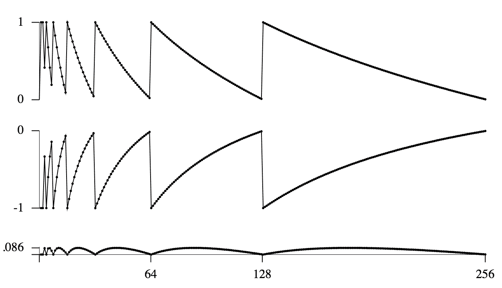

# 2\.   递归关系

> 原文：[`aofa.cs.princeton.edu/20recurrence`](https://aofa.cs.princeton.edu/20recurrence)

本章重点讨论各种类型的*递归关系*的基本数学性质，这些关系在通过将程序的递归表示直接映射到描述其属性的函数的递归表示时经常出现。

## 2.1 基本性质。

递归按照项的组合方式、涉及的系数性质以及使用的先前项的数量和性质进行分类。

|     递归类型 | 典型示例 |
| --- | --- |
|     一阶 |  |
|         线性 | $a_n=na_{n-1}-1$ |
|         非线性 | $a_n=1/(1+a_{n-1})$ |
|     二阶 |  |
|         线性 | $a_n=a_{n-1}+2a_{n-2}$ |
|         非线性 | $a_n=a_{n-1}a_{n-2}+\sqrt{a_{n-2}}$ |
|         变量系数    | $a_n=na_{n-1}+(n-1)a_{n-2}+1$ |
|     第$t$阶 | $a_n=f(a_{n-1},a_{n-2},\ldots,a_{n-t})$ |
|     完全历史 | $a_n=n+a_{n-1}+a_{n-2}\ldots + a_1$ |
|     分治法 | $a_n=a_{\lfloor{n/2}\rfloor}+a_{\lceil{n/2}\rceil}+n$ |

*计算数值。* 通常，递归提供了计算所需数量的有效方法。特别是，攻击任何递归的第一步是使用它来计算小值，以了解它们的增长方式。对于小值，可以手动完成，或者通常可以轻松实现一个程序来计算更大的值，就像我们在第一章中已经看到的那样。您可以在讲义幻灯片中找到所提到的 Java 代码这里。

## 2.2 一阶递归。

我们经常可以通过乘以一个积分因子然后积分的方式解决递归关系，类似于解决微分方程。相反，我们使用一个*求和因子*将递归关系变换为一个求和。适当选择求和因子使得能够解决实践中出现的许多递归关系。 $$\eqalign{ NC_N &= (N+1)C_{N-1} + 2N {\quad\rm for\quad} N > 1 {\quad\rm with\quad} C_1 = 2\\ {C_N\over N+1} &= {C_{N-1}\over N} + {2\over N+1} \quad({\rm 求和因子 \ }{1\over N(N+1)})\\ &= {C_{N-2}\over N-1} + {2\over N} + {2\over N+1}\\ &= 2H_{N+1} - 2\\ }$$

任何具有常数或非常数系数的一阶线性递归都可以通过这种方式转换为一个求和。解决递归的问题被简化为求解求和的问题。

## 2.3 非线性一阶递归。

## 2.4 高阶递归

## 2.5 解决递归的方法

## 2.6 二进制分治递归和二进制数。

对于各种问题，通过应用以下基本算法设计范式已经开发出了良好的算法："将问题分解为两个大小相等的子问题，递归求解，然后利用这些解来解决原始问题。" 归并排序是这类算法的原型。 归并排序使用的比较次数由递归方程的解给出 $$C_N=C_{\lfloor N/2\rfloor} +C_{\lceil N/2\rceil}+N \quad{\rm for}\ N>1{\rm \ with\ } C_1=0.$$ 这种递归方程以及类似的其他方程在分析具有与归并排序相同基本结构的各种算法时会出现。 通常可以确定满足这些递归方程的函数的渐近增长，但是在推导精确结果时需要特别小心，主要是因为问题的"大小"为 $N$ 时，如果 $N$ 是奇数，则无法将问题分解为大小相等的子问题：最好的方法是使问题大小相差一个。 对于大的 $N$，这是可以忽略的，但对于小的 $N$，这是明显的，并且通常情况下，递归结构确保会涉及许多小的子问题。 最终结果是确切解通常具有周期性，有时甚至有严重的不连续性，并且通常无法用平滑函数来描述。 对于归并排序，比较次数为 $$C_N = N\lfloor\lg N\rfloor+2N-2^{\lfloor\lg N\rfloor+1}$$ 可以写成 $$ C_N = N\lg N + N\theta({1-\{\lg N\}}),$$ 其中 $\theta(x)=1+x-2^x$ 是一个满足 $\theta(0)=\theta(1)=0$ 和 $0

> 

顶部曲线是 $1-\{\lg N\}$，中间曲线是 $1-2^{1-\{\lg N\}}$。将它们相加得到 $$2-\{\lg N\}-2^{1-\{\lg N\}} = \theta({1-\{\lg N\}}),$$ 一个连续但周期性的函数。 在算法分析中经常出现这种情况，这个结果表明准确描述某些算法性能的挑战，因为这种周期性行为是固有的。

## 2.7 一般的分治递归方程。

更一般地，高效的算法和复杂度研究中的上界往往通过扩展分治算法设计范式得出，其思路如下："将问题分解为更小（可能重叠）的子问题，递归求解，然后利用这些解来解决原始问题。" 会出现各种"分治"递归方程，这些方程取决于子问题的数量和相对大小，它们之间的重叠程度，以及重新组合它们以解决问题的成本。通常可以确定满足这些递归方程的函数的渐近增长，但是，正如上文所述，所涉及的函数的周期性和分形性质使得有必要仔细说明细节。

#### 选定练习

## 2.11

解决递归方程 $$na_n = (n-2)a_{n-1} + 2\quad{\rm for}\ n>1{\rm \ with\ } a_1=1.$$ *解法.* 使用求和因子 $n-1$: $$\eqalign{ n(n-1)a_n &= (n-1)(n-2)a_{n-1} + 2(n-1)\\ &= (n-2)(n-3)a_{n-2} + 2(n-2) + 2(n-1)\\ &= 2(1 + 2 + \ldots + n-1)\\ &= n(n-1)\\ a_n &= 1\quad{\rm for}\ n\ge 1\\ }$$

*更简单的解法.* 计算 $a_2=1$，思考片刻，然后通过归纳证明对所有 $n\ge 1$ 都有 $a_n=1$。

## 2.12

解决递归方程 $$a_n = 2a_{n-1} + 1\quad{\rm for}\ n>1{\rm \ with\ } a_1=1.$$ *提示.* 将两边除以 $2^n$。

## 2.13

解决递归方程 $$a_n = {n\over n+1}a_{n-1} + 1\quad{\rm for}\ n>0{\rm \ with\ } a_0=1.$$

## 2.15

解决递归方程 $$na_n = (n+1)a_{n-1} + 2n\quad{\rm for}\ n>0{\rm \ with\ } a_0=0.$$

## 2.17

[姚] ("2-3 树的边缘分析") 解决递归关系式 $$A_N = A_{N-1}-{2A_{N-1}\over N} + 2\Bigl(1-{2A_{N-1}\over N}\Bigr) \quad{\rm for}\ N>1{\rm \ with\ } A_1=1.$$ 这个递归描述了以下随机过程：一组 $N$ 个元素聚集成"2-节点"和"3-节点"。在每一步中，每个 2-节点有可能以 $2/N$ 的概率变成 3-节点，每个 3-节点有可能以 $3/N$ 的概率变成两个 2-节点。经过 $N$ 步后，平均有多少个 2-节点？

## 2.69

绘制递归解的周期部分 $$a_N = 3a_{\lfloor N/3\rfloor} + N \quad{\rm for}\ N>3{\rm \ with\ } a_1=a_2=a_3=1.$$ 对于 $1\le N\le 972$。

## 2.71

给出递归关系的渐近解 $$a(x) = \alpha a_{x/\beta} + 2^x \quad{\rm for}\ x>1{\rm \ with\ } a(x)=0{\rm \ for\ } x\le 1.$$

## 2.73

给出递归关系式的渐近解 $$a_N = a_{N/2} + a_{N/4} + N \quad{\rm for}\ N>2{\rm \ with\ } a_1=a_2=a_3=1.$$

#### 复习问题

## Q2.1

解决递归关系式 $na_n = (n-3)a_{n-1} + n\quad{\rm for}\ n\ge 3{\rm \ with\ } a_0=a_1=a_2=0.$

## Q2.2

以下哪项关于归并排序用于排序 $N$ 个项目时所需的比较次数是正确的？ (*a*) 增长阶为 $N lg N$ (*b*) 当 $N$ 是 2 的幂时恰好为 $N lg N$ (*c*) 等于小于 $N$ 的数字的二进制表示中的 1 的数量 (*d*) 具有周期性行为 (*e*) 对于所有 $N$ 都小于 $N lg N + N/4$

## Q2.3

考虑以下递归关系：

**A. **$(n+1)a_{n+1} = (n-2)a_n + n $

**B. **$a_{n+1} = 4a_{n-1} + (n+1)(n+2) $

**C. **$na_n = 4a_{n-1} + (n+1)(n+2) $

**D. **$na_{n+1} = (n+4)a_{n-1} + n+4 $

**E. **$(n+1)a_{n+1} = (n+2)a_n + n $

将每个递归关系与此列表中可用于使其变为望远镜的表达式进行匹配：$(n+1)(n+2)(n+3) $, $n(n+2)(n+4) $, $2^{n+1} $, $(n+1)! $, $(n-1)!/4^n $, $n(n-1) $, $(n+1)(n+2) $.

## Q2.4

(R. Brott) 考虑递归族 $a_n = ba_{n-1} - a_{n-2}$，其中 $n>1$，$a_0=0$，$a_1=1$。对于哪些整数值的 $b$，这个序列会振荡？
