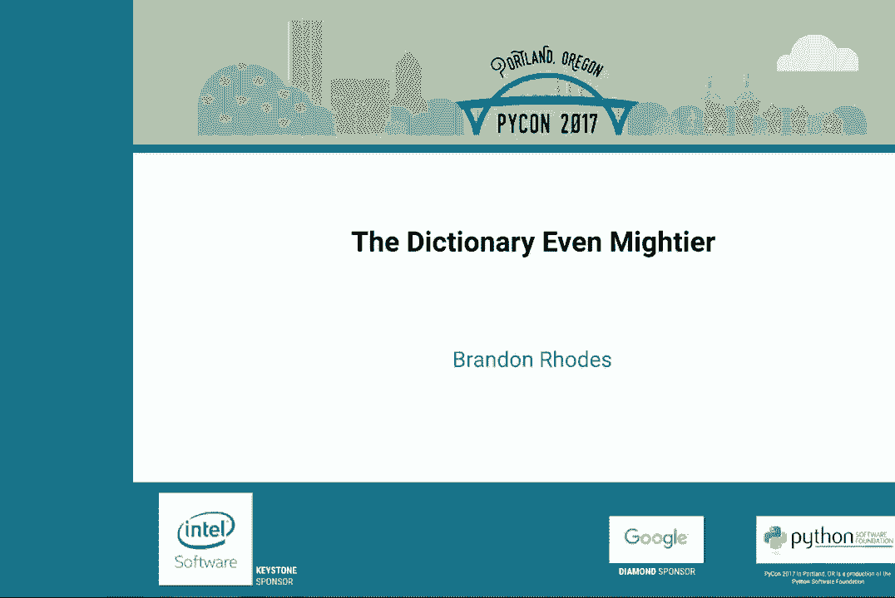
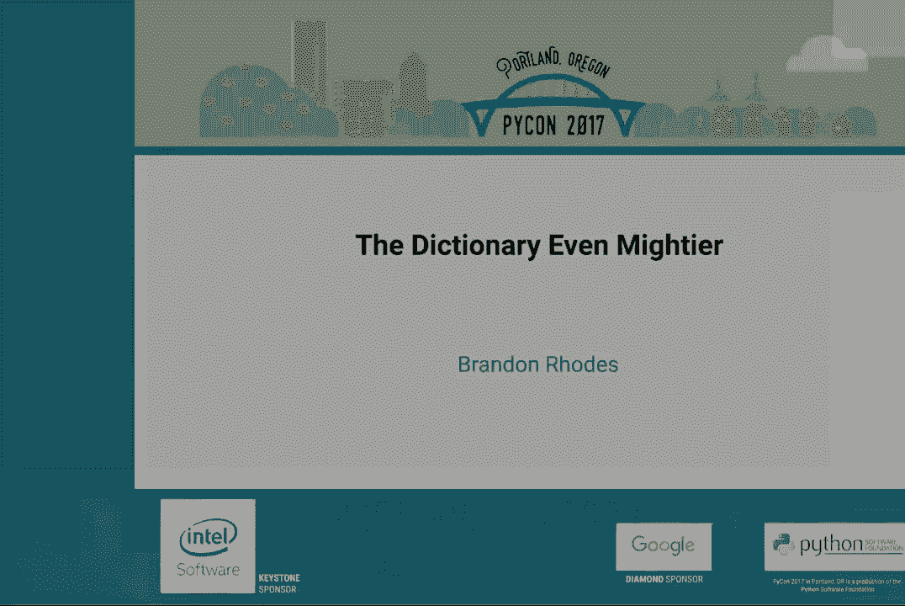
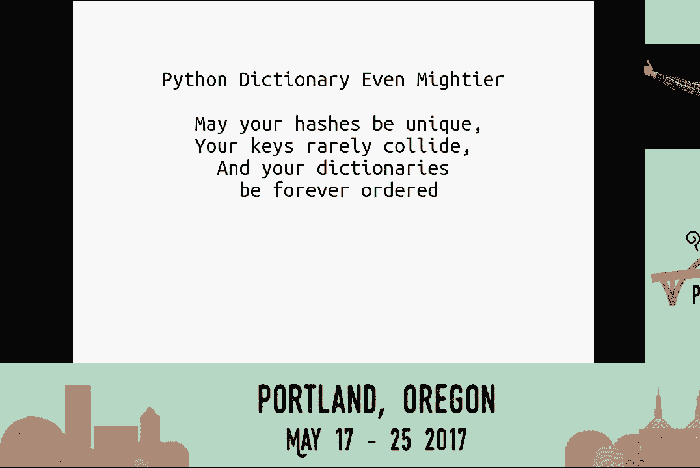

# P1：布兰登·罗兹   字典更强大   PyCon 2017 - 哒哒哒儿尔 - BV1Ms411H7jG

[空音频]，[空音频]，[空音频]，[空音频]。

女士们，先生们，正如我们所知，字典在 Python 中对我们非常强大且有用。在 Python 0.3.6 中，添加了许多新特性。它非常强大，甚至比你想象的还要强大。让我们欢迎布兰登·罗兹来发表他的演讲，字典更强大。

\>\> [掌声]， \>\> 好的，谢谢大家，正如你们中的许多人猜测的，这是我 2010 年演讲的后续。几年前，在 PyCon 的演讲中，我试图向 PyCon 观众解释哈希表的操作优势和危险。自那以来发生了很多事情，没有一件让我想继续演讲，直到 Python 3.6。

雷蒙德·赫廷格曾著名地说，3.6.1 是他特别提到的第一个版本，比 2.7 更好。所以显然是时候谈谈字典在过去几年中的发展。我选择了一个有趣的时刻来做原来的强大字典演讲，即 2010 年 2 月，正好在 2.7 最终发布的几个月之前。

这意味着我原来的演讲纯粹关注于哈希表的动态，并没有谈论即将到来的改进。在 PyCon 2.7 中，两个系列的最后一次欢呼迅速引入了来自 PyCon 3 系列的几项创新，使它们在最后时刻可以在 2 的最后一个版本中使用。

所以这些内容在我原来的演讲中没有覆盖，现在将会覆盖。我们将讨论几项被移植到 2.7 的内容。然后我们将继续查看一些你无法在 2.7 中利用的内容，而你必须拥有现代版本的 Python 才能利用这些内容。

你们中的许多人可能已经看到，我相信在会议上已经有讨论过。字典推导改变了这一点，获得了一次 PEP，经过辩论后得以解决。列表推导自 Python 2 开始就存在。这是 Python 从 1.6（我认为是最后一个）到 2.0 的创新。这是个大事件，你总是需要创建一个空列表。

先用笔写，再写，再写，最后才产生一个完整的列表。借助于从其他几种语言中借用的列表推导，你可以把循环逻辑放在方括号内，这样就可以为你创建列表。这对列表来说很棒，也给我们提供了构建字典的方式。

但这种方式有点绕。你需要构建元组。键和值，看起来并不像字典，当然也更慢，因为你需要为每个项目创建一个元组，然后再丢弃它。一旦它们被插入字典，生成器在 Python 2.4 中出现。

至少你可以去掉尖括号，但你是在用一种低效交换另一种低效。生成器，你不需要创建中间数据结构列表，但你不断需要在运行另一段字节码或 C 代码和在其逻辑中运行字典的小段之间反复切换，以逐项吸收生成的元组。

你仍然在创建和释放元组，并且你有在两个不同调用栈之间切换的劣势。因此，经常没有真正更快，尽管它在概念上更方便并节省了一对尖括号。当然，一旦你引入字典推导，你就没有这些问题。它看起来像一个字典，有一个冒号，正如人们所期望的那样。

它不创建任何这种中间数据结构，列表或元组，易读性强。更小，更快。我认为它最大的特点很少被提及。它给 Python 带来了很大的对称性。如果你教过 Python 2.6，且我曾经专业教授 Python，当学生学习列表推导时。

有些学生有想象力。我们会突然想到，等一下。如果你可以把四放在方括号内，你能把它放在尖括号内吗？而 Python 2.6 会当头一棒说不，列表是特殊的。正如你所知道的，语言中一切特殊和不同的东西都是学习者的障碍。

这意味着旧的 2.6 语法，不允许这样。这意味着 Python 在这个领域不是一种语言，你可以通过推断学习。我前几天做了这件事。我为自己感到自豪，我推断出了一个我从未想过或见过的对象。春天来了，树篱开始生长。所以我面对着从车库里拿出来的一大卷电源线。

把它插上，然后以某种方式环绕自己，以便我可以修剪树篱而不切断电线或电击自己。突然我知道我有一把无绳电钻。我有一台有绳树篱修剪机。我突然非常确定我生活的宇宙里包括无绳树篱修剪机。你知道，我绝对确定它们存在。就在那一刻。

那是一个时刻，你想，我已经内省了宇宙，并通过我的思维能力推导出了一个事实。那是一个伟大的时刻，这就是 QED，进行亚马逊搜索并开始阅读确实存在的电池驱动树篱修剪机的评论。

当语言、系统、API 被设置得很好时，真是太棒了。在某些行为中可以推测其他行为，例如，方括号让你在列表中获取项目。哦，同样的方括号也让你获取字典中的项目。我最喜欢字典推导式的是，它们让我们的学习者能够推测出语言的某个角落，他们可能会突然在那儿猜到。

的确，在经过几年的反对之后，最终将其加入了语言中。它在 3.0 版本中添加，并回溯到 2.7，真是一个美丽的构造。然后，作为最后一项，正当 Python 3 被发明时，字典视图出现了。这再次是在 Python 3.0 中首次引入，并添加到 2.7 版本。之前，我们最初只拥有键。

值和项目构建了附加的数据结构列表。内部键，内部值，内部项目是在迭代器引入时添加到语言中的。它们不会创建一个单独的列表，而是让你在字典的顺序中获取所有键或所有值，而不需要将它们复制到一个中间结构中。老实说，我对 Python 3 的过渡并没有太多关注，因为我在工作中仍然无法使用它。

那么，谁在做呢？我曾经想，当我看到我们检查键时，它不再是一个列表，值也不是一个列表。我以为他们只是改变了迭代版本并将其重命名为键、值和项目。如果我想，如果我们想要一个列表在 Python 3 中，你就要求一个列表。这非常 Pythonic，因为你在明确地要求你想要的东西。

结果发现，他们并没有那样做。他们提出了一个有趣的问题。如果你只想问某个东西是否存在于键中或值中，该怎么办？

字典可以快速遍历值来回答，这个值是否存在于值中？

但是没有办法获取该信息而不创建值的列表并查看，或者创建一个集合，如果那合适的话。因此，他们想，难道不应该有一个对象可以实现键、值和项目的包含，能够回答那个问题吗？X 和 Y 是否存在？

通过直接查看字典的内部结构。实际上，如果我们有这样的对象，为什么只停留在包含上？我们可以让它执行键的所有基本集合操作。你可以问这样的问题，这个字典和这个字典是否有任何共同的键？

它们之间是否有任何键在不相交的集合中？同时，你当然可以添加调用的能力，下面，触发她。同时还可以添加遍历字典的能力，这正是我们所做的。这是受 Java 集合框架的启发。这些被称为视图。

这就是我在那里使用 V 作为占位符的原因。当你现在调用 keys、values、items 时，你得到的是一个没有自己存储的小对象。它只有类型的地址和字典的地址，用于回答你的问题。当你在视图上进行类似集合或成员资格的操作时，keys 和 values。

Python 3 中的项目是视图对象。这是我当时完全错过的三种方法之一，并且从未见过使用。视图键、视图值和视图项目。一方面，它们使迭代变得更进一步，通常你想做的事情。你不能再说“iter items”。现在你必须说“dot items”，你会得到这个小对象，它是视图。

然后你必须说：“对它进行循环”，然后调用“iter”，创建第二个对象。这个迭代器知道它已经遍历了字典多远。因此，一方面，你真正想要做的事情是更进一步。这在概念上是如此干净，并且启用了许多否则不可能的操作。因此，--被决定了。

这将通过--工作，那里有两个层次。首先，你通过说 keys 或 values 获取视图。然后如果你想要，你可以尝试迭代来获取一个迭代器。这是回溯到 2.7，但又是不同的方法名称，以便在你的代码准备好之前不会自动选择不同的行为。

我会在有序字典上做个幻灯片。它在 PEP 372 中被提议并接受，但直到 3.1 才被添加，所以我们在这里稍微向历史前进了一些，回溯到 2.7。它保持插入顺序。实际上，它更大、更慢。我相信，在 3.4 之前，它是在 Python 中实现的一个链表，当时有人在 3.5 中重新编写了它。

恰好是时候，几乎要过时了。这很有趣。从 3.1 版本起，如果你需要，它提供了一个有序字典。但它从未让我们决定关闭两个涉及字典顺序的开放 PEP。一个 PEP 说：“关键字不应该以它们写入时的顺序传递给 Kali 吗？”

类字典难道不应该有自然顺序吗？这两个 PEP 都要求某种高性能的有序字典类型，因为你不想减慢关键字参数的速度。我是说，这些参数是经常被传递的。你也不想减慢作为类命名空间的字典，或者作为对象属性背后的双下划线字典。

所以我们在字典中有顺序，但即使在语言中，我们也没有将其用于任何严肃的事情。我们保持了传统的任意排序字典，因为我们只需要速度。因此，它存在，但只用于那些人们知道关心顺序的特殊情况。好了，我们现在要超越 Python 2 中可用的内容。

我们现在正进入现在和原始演讲之间的中间年。首先。我们将讨论在 PEP 412 中提出的密钥共享字典，添加到 Python 3.3 语言中。这回答了空间的问题。想象一个小类，其 dunder 接受名称、端口和协议，并将它们各自保存为属性。

所以坐在对象背后的小 dunder 字典必须存储名称。对象必须在这三个键下存储一些值。在这里。来自我在 2010 年关于字典的演讲，我们的哈希表朋友，一个数组。所有数组在 RAM 中都是通过整数索引进行索引的。

规则是因为我们得到的键不是整数。如果它们是整数，可能也不是连续整数，或者得到一些无意义的东西，比如字符串名称，我该如何找到内存中名为字符串名称的地方？好吧，哈希表得到那个值，无论是什么，然后它进行哈希。

这有点像一种暴力行为，你将值砸成一堆位。32 位，无论值有多大或多小，在 32 位平台和 64 位平台上都输出 32 位。如果你需要一个整数索引，就有尽可能多的位来形成一个。这种简单的字典在这里并不可见，是不是？嗯。

如果我想现场编码，我可能会在一分钟内修复它。正如你所见，我们有八个槽位准备填充，因此需要三个比特来区分它们。我们选择 1.0.0 槽作为存储键名称及其值的槽。

所以这就写入字典。我们现在到了第二个。将键端口的哈希计算为 101，所以它占用槽，发生在隔壁。现在，这是原始演讲中的一个大主题，如果第三个键恰好有一个已经被使用的哈希，1.0.0 在这种情况下会发生什么？你会记得，当我们尝试存储 proto 并碰到名称已经占用该槽时，这种情况被称为碰撞。

所以我们进行一些数学运算，涉及其他部分，并选择一个应急备份槽让它存放在那里。接下来，我们将尝试存储 proto，因此它必须去其他地方。现在查找或重置的成本比其他值稍高。名称和端口。你会在你寻找它们的地方找到，proto 会在每次寻找时出现。

事实是，它并没有坐在你期望的槽位上。现在想象你有第二个这种类型的对象。你存储名称，你存储端口。proto 进来，发生碰撞，必须移动到它的独立槽。有人叫马克·香农看到了这个图，并说，哇，左边那里。

第一列和第二列是绝对相同的。它们看起来完全相同。我们在这两个字典下的对象中存储的五个空白位置和三个哈希以及五个空白位置和三个键完全相同。

我应该提到字符串并不真的在字典内部，整数 53 也不在字典中，但字典确实存储。如果你能想象你在看矩阵，所有内容变成代码。它实际上存储的是字符串对象的地址，比如说名称或端口，或者整数对象的地址，比如说 53。

所以每当我在字典中放一个小字符串或整数时，我真正指的是八个字节。始终是来自 64 位机器的相同大小，告诉你在内存中哪里找到对象。但无论原型是字符串还是它的地址，都是上下相同。马克·香农考虑过这个，类刚刚被创建。

如果我们等待第一次调用该类的 init 呢？

它会创建一个看起来像这样的对象实例。如果我们然后将哈希和键分开并存储在内存的不同区域，永远保持它们呢？

而在字典下的对象中，只存储值。因为第一个创建的对象可能会消失，但我们永远保持与类的链接，那个冻结的哈希和键的集合，这样当有人创建第二个对象实例时，或者当有人创建第三个对象实例时。

你只在存储值上消耗空间。你只消耗三分之一的空间，并获得三分之二的节省，因为你并不是在每个对象中一遍又一遍地重复哈希，重复键，尤其是在许多类中，它们每次都是完全相同的。内存节省，即使在一个适合八个条目的微小对象中。

其中五个可以填充，Python 字典，每个对象节省 128 字节。如果有成千上万或者数百万个，这将累积成实际可测量的节省。你确实会浪费一点空间，因为每个字典现在都需要额外的八个字节，以便在分割存储时知道如何访问与键分开的值数组。但是在测量时，额外的八个字节很容易通过常见对象的节省来弥补。

实际上，面向对象的程序，我是说，普通的列表和字典对此并不在乎。因此，如果一个程序使用大量 NumPy 数组或列表，它不会受益。但具有大量对象的面向对象程序通常会因为这一创新而减少 10% 到 20% 的内存。关键共享，Python 3.3，你关心什么？因为当然你不能打开或关闭这个功能。

这将会发生。只有在你使用 3.3 或更高版本时，你需要注意的是，在你的对象中，确保 `DunderInIt` 为你将要使用的每个属性分配值。如果需要，可以将它们设置为 None、空字符串或其他合适的值，但一定要包含这些属性，因为如果你不这样做，在对象的生命周期内，如果尝试使用新的属性，其值将不得不被丢弃。

一个完整的 `Dunderdict`，传统字典必须为其分配，并将其所有属性复制过来。如果添加了一个不在原始原型键集合中的单个键或单个属性，那么你就失去了共享。但是，这是一种你应该已经养成的习惯。Pi Pi 如果属性随机出现和消失，无法进行很多优化。他们还建议在 `DunderInIt` 中将它们全部设置。这也是良好的文档。

我可以阅读你的 `DunderInIt` 函数，并了解所有的属性，当我在方法中间看到一个出现时不会感到惊讶。所以这已经是一种最佳实践。这一最佳实践在 Python 3.3 中现在有了额外的好处：键共享。好吧，在接下来的几分钟里，我们将深入探讨计算机安全的精彩世界，处理那些想要破坏你应用程序的人。这下一件事，随机种子哈希，并不是一个推荐。

这仅仅引发了 Python bug tracker 中的一个问题。它与这个有关。字典通常填充的速度有多快？假设我有五个东西需要放入。让我们观察一下这里的速度。Stone，bowl，oop，collide，cat，doe，eagle。注意，有时候字典键的插入需要更长的时间，因为发生了碰撞。

但是当没有发生碰撞时，平均而言，这种情况并不常见。注意最后两个条目，doe 和 eagle，插入的速度和第一个一样快。新的插入，除非发生碰撞，否则不会比第一个花更长的时间。正如我在这次演讲的最初版本中所谈到的。

添加到字典中的第千或第百万个项目应该和第一个一样快速。这就是字典的魔力。Stone，bowl，boop，cat，doe，eagle。这就是字典的魔力。事实证明，如果使用你网络应用程序的人不是你的朋友，他们可能会带走这个好处。如果他们想出一系列单词呢？

他们有充足的时间在访问你的网站之前完成这个操作吗？

第二个值必然会与第一个发生碰撞。然后第三个将与前两个发生碰撞，第四个与前三个，以此类推，可能会穿过数千个潜在的键。然后节奏是，doe，cat，eagle。大致是这样的：A back，buying，cab，deal。Easels。

这并不是我们之前看到的那种节奏，对吧？

如果你在键盘上加载信息到数据库，会发生什么？而不是逐个去，知道，第一千人，第二千，第三千，第四千。我记得有一次我在加载一个表，它是第一千，第二千，第三千，然后在第四千完成之前差不多过了两分钟，因为我声明了一个列为唯一，但没有添加索引来让字典随着越来越多的人添加。

快速检查所有之前的人以查找重复。如果有人选择了一组键，其中第五个花费的时间是第一个插入的五倍，而第十个花费的时间是第一个插入的十倍，那么我突然处于一个称为意外平方的情况。插入的项目数量的时间将随着数量的平方而变化。

这意味着千个项目应该花费大约一百万个时刻的工作。实际上有一个关于这个的博客。我强烈推荐你们查看意外的平方。tumbler.com。这是一个每月一两篇关于各种高端专业设计软件项目的娱乐性博客，结果它们的边界具有平方而非线性或对数行为。事情，浏览器，服务器，结果你可以做到，而不是逐个增加。

五个项目给你一种沉重的感觉，一，一，二，三，四，依此类推。你们有多少人曾经运行过完全相同模式的东西？

通常，当你看到某个东西变慢时，问题是什么是很明显的。所以我们必须修复哈希函数。哈希函数是如何工作的？嗯，这是一个版本的 Python。这是我们长期以来使用的版本。在主循环中，我们有当前字符串的哈希值，正如我们正在进行中的部分。

为了吸收下一个信息字符，我们将当前哈希乘以一百万加三。哦，魔法数字，一百万加三。然后我们将下一个字符的异或运算引入低字节。无论是输入字符中设置的哪一位。因此我们每次都在输入字符，乘以一百万加三，然后从下一个字符中提取 8 位更多的信息。

你将了解如何用信息填充完整的 32 位或 64 位哈希。如果你小时候玩过乘法，无论是手动还是用计算器，你可能发现将一个数字变成千百个零，或者仅用零和一，可以产生一种很酷的输出数字。

这是一种被困在这个更大值中的你原始数字的小副本。为了简单起见，我会像在小学时被教导的那样，撒谎。这里的行只是零以节省空间。但你可能会发现你可以制作更大的数字。放一些零，然后再放一个“1”。现在，在大乘法输出的数字中再添加一个原始数字的副本。

但你可能已经注意到，不能把这些数字放得太近。突然间，你的数字的漂亮小副本开始变得更有趣了。原始数字中没有的数字开始出现。突然之间，你无法预测下一个数字是什么，因为，当然。

将信息向左移动的“1”有趣的是它的不对称性。“1”不干扰右边的数字，可以对右边的数字做出各种声明，例如是奇数和偶数，是否是五的倍数，是否是十的倍数。你不能在数字向左的情况下做到这一点，因为发生的进位会将新的数字和混乱推向更高位。当你加法，因此当你乘法时，这实际上是简单的重复加法。

所以当我们在这里重复将一个数字乘以一百万三，然后将新的位放入底部时，我们正在将这个二进制数字提取出来，并观察它如何使用“1”。两个紧靠在底部，以确保你迄今为止积累的值的两个副本仅仅向左移了一位，然后强制相加。然后中间有一点间隙，那里只有稀疏的“1”填充着，带来了更多该数字的副本，最后在顶部有四个“1”，确保四个先前哈希值的副本紧挨在一起，以便相加并产生各种有趣的进位和混乱，因为位在乘法过程中缓慢地向左移动。

这当然就是我们或者说底部的输入字节的原因，因为乘法不断将信息推向高位。我们通过在低位读取字符串引入的熵。自从数学家们得知我们对哈希函数感兴趣以来，计算机科学家们做了比我这类手势式的解释更正式的分析，以便让你理解哈希是如何工作的。我们现在可以对哈希函数进行多种数学属性的评估，并且可以拿到像 Python 的哈希函数，询问它具有哪些属性以及它如何均匀地分配位。

但这种可视化乘法的想法希望能给你对哈希函数如何工作及其良好属性证明形式的直觉。这与您用于将信息向左推送的大疯狂数字是否有效地散布原始值中的任何模式有关。

这在 Python 中是个大问题。它总是使用这个算法，并且总是从相同的值开始。所以如果我知道你在你的应用程序中使用 Python，我可以在家里想出一些字符串，使它们有相同的哈希值。这在 2011 年 12 月的安全会议 28C3 中变得非常著名。

高效的拒绝服务攻击（DOS）针对网络应用平台。因为 Python 不是他们的主要目标。Python 确实有这个问题，但几乎每种其他语言也有。事实上，这有点有趣。这是在 2011 年。他们列出了即将讨论的网络应用技术，以及它们各自的重要性。

他们找到了一个按编程语言对网络重要性进行排名的网站。根据当时的数据，你会高兴地知道，我们对故意创建的哈希的脆弱性仅影响了网络的 0.2%。Python 的哈希函数是可以被破解的。他们并没有实际说明如何做到这一点，但他们表示可以通过寻找所谓的“中间相遇攻击”来计算破解。

他们只能为 32 位系统找到合理大小的攻击字符串，尚未对 64 位进行测试。他们进行了网络搜索，找出我们的网络框架是什么。他们发现，如果你向它提交表单数据，最大大小为 1MB，超过这个大小它就会抛弃而不进行处理。

他们尝试了一些 MB 负载，其中所有的名称和数值，或者说所有名称都将发生冲突。他们能够让一个 plone 网站花费 7 分钟的 CPU 来解析一个单一的 1MB 请求。一旦你学会了这个技巧，这样的网站很容易被攻击。就在两个月前，如果你对哈希函数的密码学感兴趣，确实。

一篇非常有趣的博客文章出现了，作者发布了他们的工作，找到了如何产生 64 位哈希冲突的方法，而不是原始研究中的小型 32 位冲突。去 medium.com 上找找。如果你想看看某人，罗伯特·格罗斯，他在学习密码学并有一个练习目标，他对 Python 的旧哈希函数进行了深入研究，并在适度的计算时间内找到了至少几百个键，在 64 位系统上哈希到相同的值。

很棒的文章。因此，我们立即做出的反应是快速采取一些措施，在这个基本哈希算法周围增加一点随机性。我们还决定用一个显然是 pound-to-find 语句来使 1,000,000 在 3 中有尊严。通过在开头添加一些随机位，每个网站，每次 Python 启动时，对于给定字符串都会有不同的输出。

所以你不能再依靠你预先计算的碰撞列表来工作。然后加入了一些随机性，在最后添加了一个后缀或异或运算，这帮助隐藏了前缀，因此如果一个站点在其 JSON 返回值中暴露了字典顺序，就不那么容易猜测该服务器使用的秘密。

你会注意到的主要问题是，你的网络应用程序不能轻易受到 DOS 攻击。这不是一个完美的解决方案，但它大大增加了创建让你在七分钟的 CPU 工作中崩溃的情况的难度。而且你的字典总是以不同的顺序输出。对于完全相同的程序。

完全相同的输入，突然字典顺序在 3.3 及其后续版本中似乎变得随机。因为这是一个安全问题，他们做出了 267，3.1 和 3.2 的错误修复发布。但请记住，由于他们无法打破现有代码测试，你只能通过使用大写 R 标志来获得对 DOS 攻击的保护。

我相信还有一个环境变量可以开启随机性。因此，他们在第二年指出了这一点的无用性。在下一届 29 C3 安全会议上，他们显然使用了连续的整数。三位新研究人员展示了哈希洪水 DOS 重载，概述了许多语言对原始文件和投诉的糟糕响应。

我注意到，他们实际上无法远程观察 Python 应用程序如何创建碰撞，但他们至少能够通过在 Python 程序中调用哈希来恢复随机密钥。这表明信息可能被泄露，可能会被远程利用。而更重要的是，这些研究人员解决了这个问题。

他们做了工作并引入了 CipHash，使其对任何想要使用它的语言免费。每次启动运行时时，它都是随机的。你会得到一组你从未见过的哈希，以后也不会再见到。而且没有攻击者能够合理地猜测这个秘密是什么并为你生成碰撞。CipHash 确实获得了 PEP 4.56 的提案。大家都说不，因为它太慢了。Python 开发者。

等等，如果你对这些位进行处理，如果我们将其结合起来，以许多字节为单位处理。最终，他们使其速度足够快，以至于将其纳入标准轨道。它在 3.4，3.5，3.6 中，你默认始终开启。硬加密保护。就我们目前所知。

这样的事情总是会变化。在语言层面上，来自那些 DOS 攻击的随机性轻量喷洒出现在 3.3 版本中。在许多以前版本的错误修复发布中，如果你记得用大写 R 标志或环境变量将其开启。

这就是为什么如果你在使用 Python 3.4 和 3.5 时，你的字典会突然失序。我们很快就会谈到 3.6。内部变化我会非常简要地描述。PEP 509 添加了一个私有版本号。他们在我们的每一个字典中额外消耗了 8 个字节。每个字典都有一个版本号，并且它们在内存的其他地方。

一个主版本计数器。当你去更改字典时，主计数器从一百万递增到一百万加一。这个一百万加一的值被写入该字典的版本号。这意味着你可以在稍后返回时知道它是否被修改，而不必查看它可能有的数百个键和值。

你只需查看，自上次你在那里以来，版本是否增加。试图优化 Python 的很多痛苦在于，任何事情都可以随时改变。有人可能决定进行猴子补丁。因此，看起来应该引用一个内置的代码，但你一直在使用的，可能会被在模块级别注入了同名函数的人拦截。

或者他们可以编辑内置模块。编写优化版本函数的人现在可以检查这一点。模块的全局变量是否改变？看看那个字典中隐藏的版本号。你将知道它是否被触及，如果没有，你可以继续使用已内联内置的优化版本例程。

内置的字典改变了吗？看看它的版本号。各种优化因 Python 的动态特性而变得不可能。你永远不知道什么时候有人可能会用其他东西替换内置项。现在是可能的，因为持有内置项的字典。

持有类命名空间和模块命名空间的字典，现在，连同我们所有的其他字典，都有一个版本号。它是内部的。我还没见过用户获取它的接口，但这是 Python 3 的一个实现细节。现在，为了加速该平台的优化，PEP 509 是你可以获取更多细节的地方。

我快速略过这一点，谈谈紧凑字典。在 Python 3.6 中，发生了巨大的变化，永远改变了字典。你会记得，字典是一次填充一个项。可能会有碰撞，希望大多数值不会碰撞。在这一点上，它达到了最大的填充度。如果你再往这个字典中添加一个键。

这超过三分之二是满的，因此分配了一个新的字典哈希表，大小为 16。两倍的大小，并在允许你继续之前，所有的键都被重新插入。回想一下，当它只有五个键时的样子。这是我们允许它达到的最大填充度。然而，它仍然有明显的空白空间。

它的三行什么也不存储。在 64 位系统的哈希中占用八个字节。该键的地址占用八个字节。该值的地址占用八个字节。当我们声明它如此满以至于要扔掉并重新开始一个更稀疏的数据结构时，72 个字节仍然是空的。在 2012 年，雷蒙德·赫廷格有了一个想法。他在 Python 开发中介绍了它，并立即提出了一些改进建议。

计算机科学中的每个问题都可以通过增加一层交互来解决。如果我们不使用那些大的 24 位行来记住我们使用过的哈希位置，会怎么样？

如果我们简单地使用八个字节会怎么样？

当是时候开始向字典中添加项目时，如果我们只是记住一个小的八字节数组中更大列表的哈希位置、键和值会怎么样？而不是字典必须保持整个 24 位槽位的空闲，因为它现在已达到五个项目并需要转到八个条目。

我们只能剩下三个字节可用。因为我们上面有八个字节可用于记住键的索引。我们只使用了五个，留了三个空着，因此在字典准备重新调整大小之前，三个字节就变得空闲且未使用，正如在 72 时所看到的。

所以旧的字典有很多额外空间，新的字典将所有键和值打包到一个短列表中，它会增长。如果它的大小翻倍，那么它只需在一个连续的区域中重新分配所有的键。在 2015 年，他们将这个添加到了 pipy，这使得进行更高效的疯狂操作成为可能。有趣的是，几件事情显著加速，获得了四个百分点、八个百分点的提升。

一些基准测试变慢了，因为我们增加了一层间接性。这就是解决计算机科学问题的难题，它可能使事情变得更慢。有些东西变得稍微慢一点，稍微快一点，有一两个大的成功，但这样做的主要原因并不是速度。实际上，速度几乎没有改变，这让人感到兴奋。

增加一个额外的索引层，因为我们得到了更好的内存使用。又过了一年，普通的 Python 用户无法受益，而在 Nada，我想我没见过他。开了一个问题，补丁将其添加到 Python 3.3.5 上。整整一个月过去了，没人处理这个问题，他提醒道，"哦，这很重要。

这必须在 Python 开发者中解决，"这通常意味着这不会发生。然后在九月发生了一些神奇的事情。核心开发者们第一次聚在一起，独自在一个房间里待了几天，进行了一次核心开发冲刺，最后，一个消息突然出现在这个停滞不前的问题上。

我们讨论了很多关于你的紧凑交换，我们都希望在 2.6 中实现。但代码还没有准备好？好吧，就在这个周末的截止日期之前，把它推入 Python 2.3，我们稍后会修复它。他们想要得那么急。当然，果然，马上就有人说，“这不是太早了吗？”

谁不在核心开发者组中？但不，他们花了一整天讨论这个问题。这对未来的影响如何。最终在 Python 2.6 中实现了。新的字典速度更快。迭代更快，不再有空格需要跳过。而且它记住顺序。因为那张大表格是在添加，它是一个简单的追加。你现在能依赖顺序吗？

大问题是什么？因为他们已经继续前进，免费接受了一个 PEP，要求关键字参数有序，并要求类 Dixby 有序，以及元类输入有序。所有那些对字典的使用现在都有了顺序。他们认为，核心开发者们。我认为，他们常常认为自己只是帮助那些可能注意到字典现在有序的用户。

但如果你查看 Stack Overflow，顺序并不是人们会偶然发现的东西。这是他们对字典的期望。人类的思维，自然地，期望字典有顺序。如果你曾教过 Python，这总是一个绊脚石。雷蒙德认为保证几乎是不可避免的，但比斯利说这是永久的。

我同意他的观点。我认为 3.6 为人类带来了字典。[掌声]。我不认为他们会撤销这一点，因为那些甚至不知道哈希表的普通程序员一直期望它们是有序的，并且会编写依赖于它的代码。我以略微修改的愿望结束，就像我上次演讲结束时那样。愿你的哈希是唯一的。你的键很少冲突，而你的字典永远是有序的。

非常感谢。

[掌声]， [掌声]。

[空音频]。

