# Pandas优化教程：P10：不再悲伤的pandas

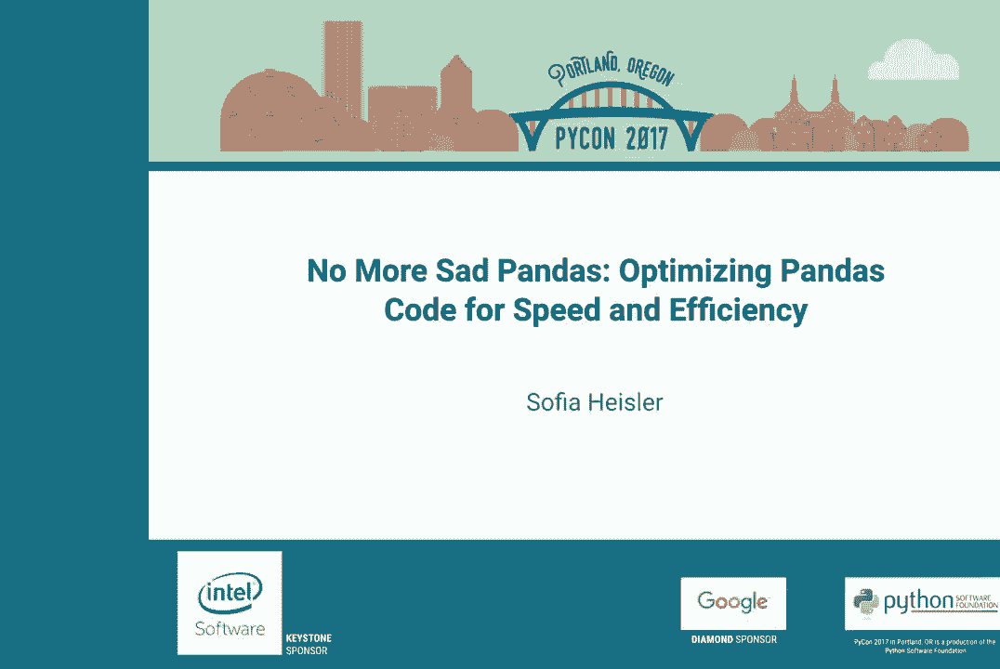

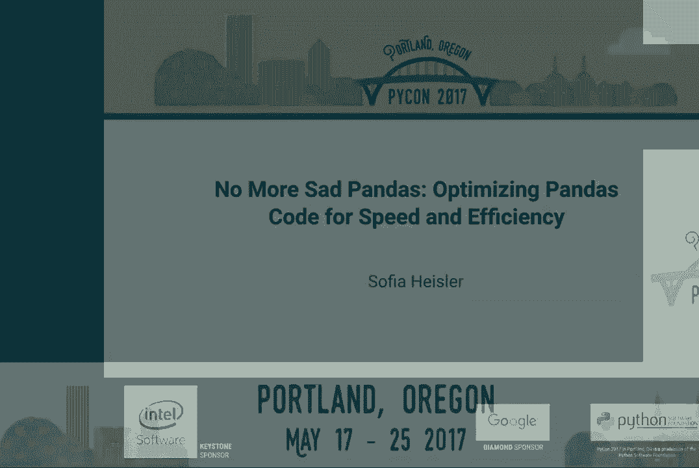

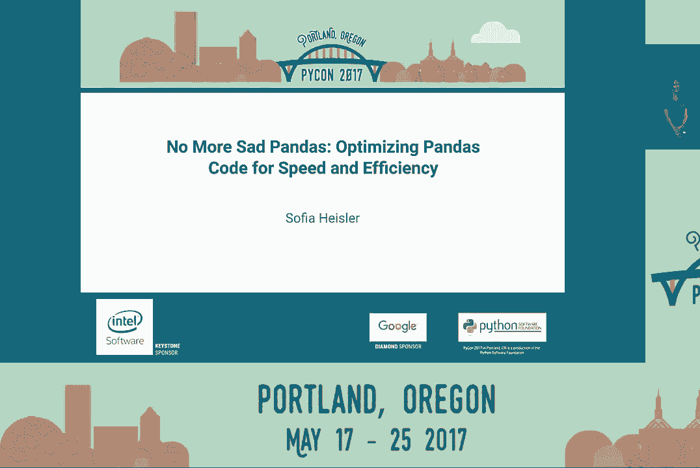

## 概述
在本教程中，我们将学习如何优化pandas代码以提高其运行速度和效率。我们将从如何对代码进行基准测试开始，然后探讨几种常见的优化策略，包括避免循环、使用向量化操作、利用NumPy数组以及使用Cython进行加速。本教程旨在让初学者能够理解并应用这些技巧。

## 如何进行基准测试
在开始优化之前，我们需要知道如何衡量代码的性能。我们将使用Jupyter Notebook中的“魔法命令”来对函数进行计时和分析。

### 使用 `%timeit` 命令
`%timeit` 命令会多次运行一个函数，并计算其平均运行时间和标准差，这为我们提供了一个可靠的性能基准。

**示例代码：**
```python
%timeit df['new_column'] = normalize_function(df['high_rate'])
```
运行上述代码会输出类似 `2.84 ms ± 7.29 µs per loop (mean ± std. dev. of 7 runs, 100 loops each)` 的结果，告诉我们函数的平均执行时间。

### 使用行分析器 `%lprun`
行分析器 (`%lprun`) 可以逐行分析函数，显示每行代码被调用的次数以及执行时间所占的百分比。这有助于我们定位代码中的性能瓶颈。

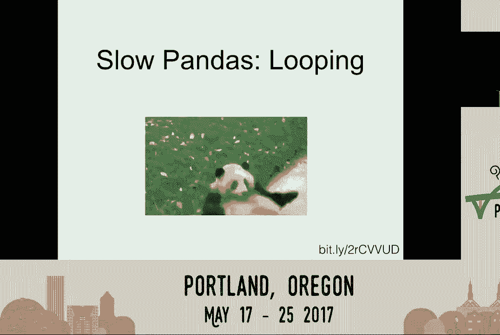

**示例代码：**
```python
%lprun -f normalize_function df['new_column'] = normalize_function(df['high_rate'])
```
分析结果会以表格形式展示，其中“% Time”列清晰地指出了最耗时的代码行。

## 常见的低效模式与优化方法
上一节我们介绍了如何测量性能，本节中我们来看看pandas中几种常见的低效操作模式及其优化方案。

### 1. 避免使用循环遍历行
许多初学者会尝试使用循环（如 `for` 循环或 `iterrows()`）来逐行处理数据框。这是pandas中最慢的操作之一。

**低效示例（使用 `iterrows`）：**
```python
distances = {}
for index, row in df.iterrows():
    distances[row['hotel_id']] = haversine(row['latitude'], row['longitude'], brooklyn_point)
# 执行时间：184 ms
```

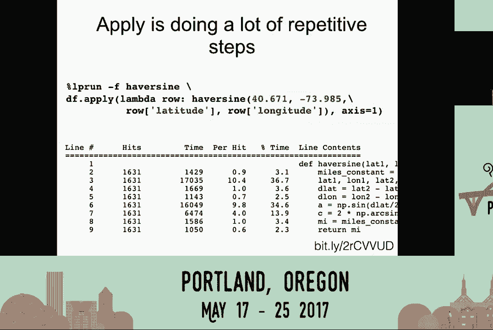


**优化方法：使用 `apply` 函数**
`apply` 函数沿着数据框的轴应用函数，比显式循环高效得多。

**优化后代码：**
```python
df['distance'] = df.apply(lambda row: haversine(row['latitude'], row['longitude'], brooklyn_point), axis=1)
# 执行时间：78 ms
```
仅通过将 `iterrows` 替换为 `apply`，性能就提升了约2.5倍。

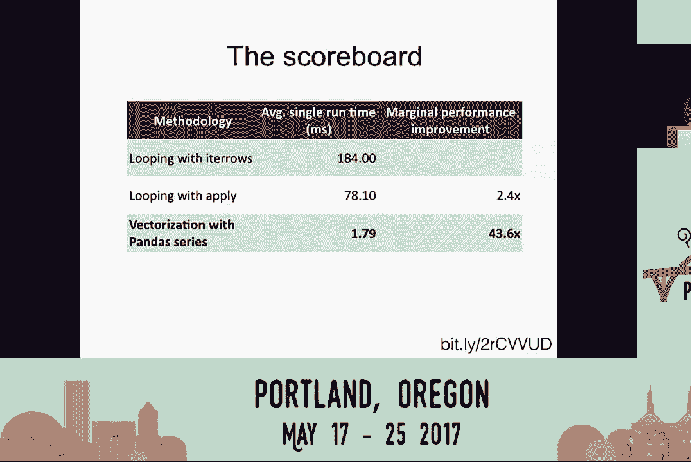

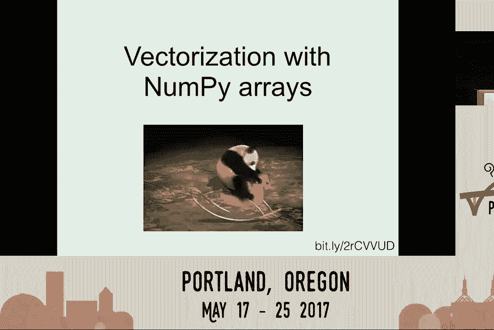

### 2. 拥抱向量化操作
向量化是pandas高效的核心。它意味着对整个数组（Series或DataFrame列）执行操作，而不是对单个标量值进行循环。

**向量化优化示例：**
```python
df['distance'] = haversine(df['latitude'], df['longitude'], brooklyn_point)
# 执行时间：1.8 ms
```
通过直接对整个 `latitude` 和 `longitude` 序列进行操作，执行时间从78毫秒大幅降至1.8毫秒，提升了43倍。

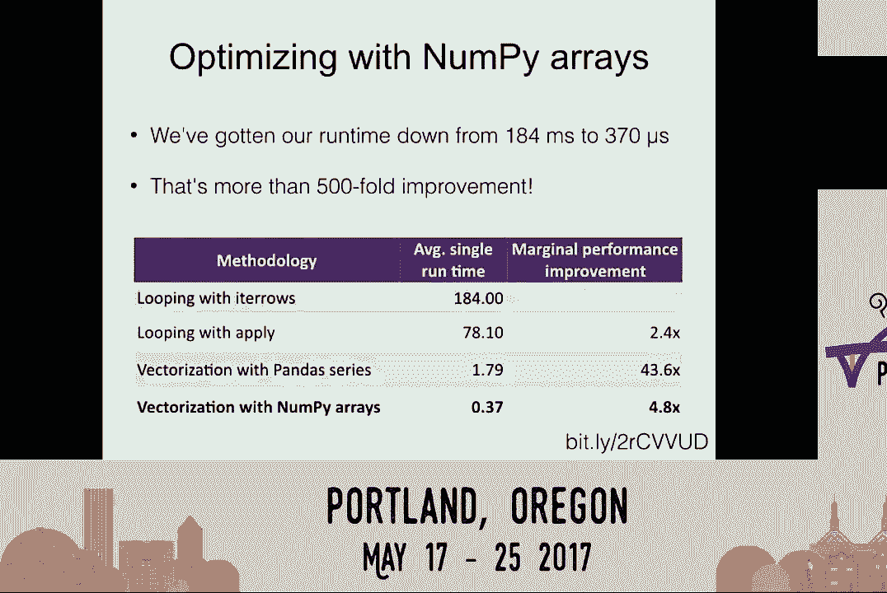


### 3. 使用NumPy数组进行底层优化
Pandas Series在提供丰富功能的同时也带来了一些开销。对于纯数值计算，可以将其转换为NumPy数组以获得更快的速度。

**使用 `.values` 转换为NumPy数组：**
```python
df['distance'] = haversine(df['latitude'].values, df['longitude'].values, brooklyn_point)
# 执行时间：0.37 ms
```
这比在pandas Series上操作又快了近5倍，相比最初的循环，总提升超过500倍。

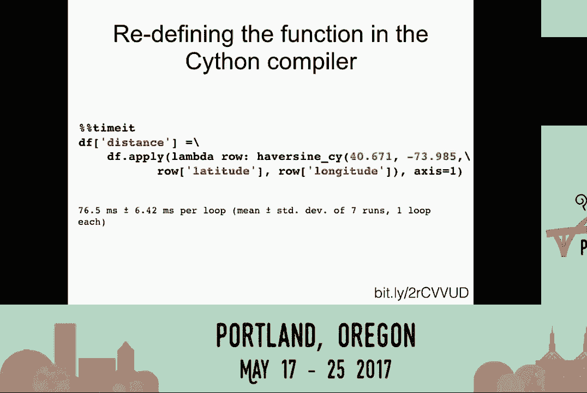

### 4. 当必须循环时：使用Cython加速
有时函数过于复杂，难以向量化。在这种情况下，可以使用Cython将关键循环编译成C代码来加速。

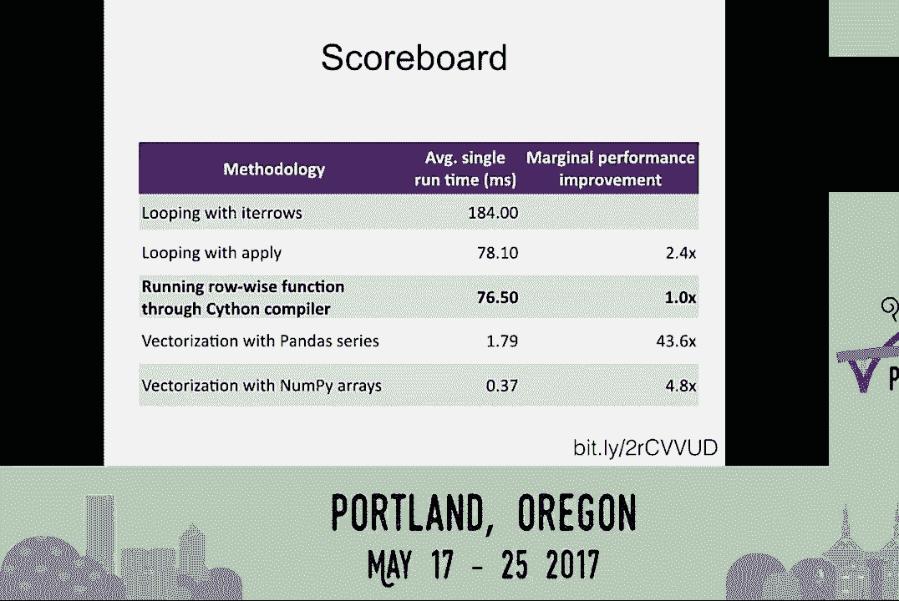

**基础Cython使用（提升有限）：**
```python
%load_ext Cython
```
```cython
%%cython
import numpy as np
def haversine_cython(lat, lon):
    # ... 函数体（与Python版相同）
    return distances
# 执行时间：76 ms
```

**优化Cython代码（添加类型和C数学库）：**
通过为变量声明C数据类型（如 `cdef float`）并使用 `libc.math` 替代 `numpy` 中的数学函数，可以显著提升Cython性能。

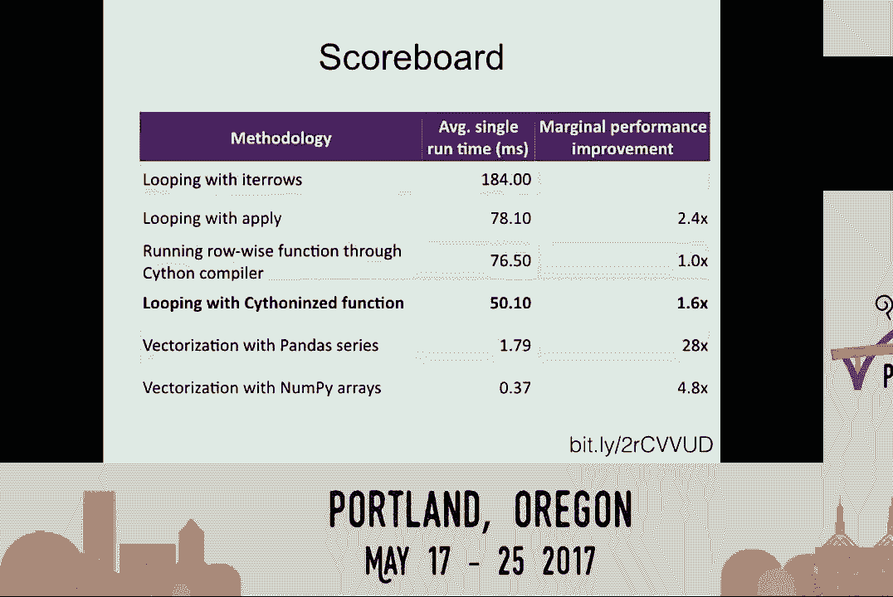

```cython
%%cython
cimport cython
from libc.math cimport sin, cos, asin, sqrt, pi

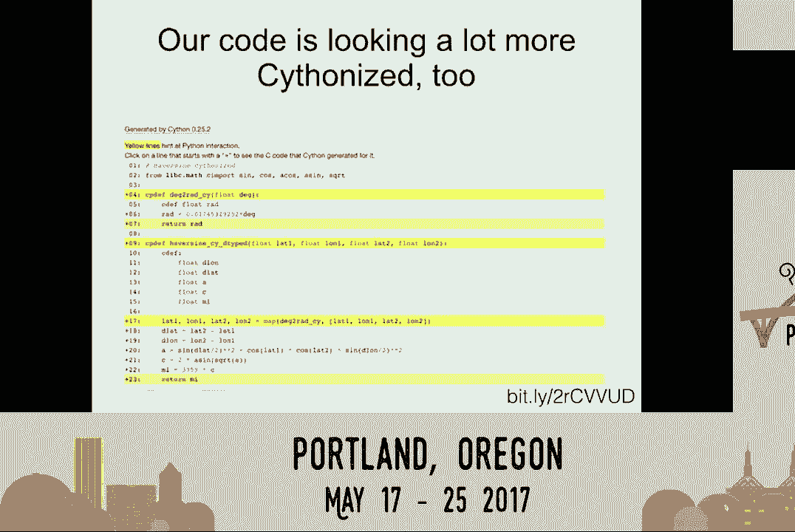


@cython.boundscheck(False)
@cython.wraparound(False)
def haversine_cython_optimized(float lat1, float lon1, float[:] lat2, float[:] lon2):
    cdef int n = lat2.shape[0]
    cdef float[:] dist = np.empty(n, dtype=np.float32)
    cdef float r = 3959.0
    cdef float phi1 = lat1 * pi / 180.0
    # ... 优化后的计算逻辑
    return np.asarray(dist)
# 执行时间：50 ms
```
经过优化的Cython代码比普通Python循环快约3.7倍，但通常仍不如向量化方法高效。

## 性能优化总结
以下是本节课中我们一起学习的各种方法及其性能对比的总结：

| 方法 | 执行时间 | 相对初始性能提升 |
| :--- | :--- | :--- |
| 初始循环 (`iterrows`) | 184 ms | 1x (基准) |
| 使用 `apply` 循环 | 78 ms | ~2.4x |
| 向量化 (Pandas Series) | 1.8 ms | ~102x |
| 向量化 (NumPy Arrays) | **0.37 ms** | **~497x** |
| Cython (基础) | 76 ms | ~2.4x |
| Cython (优化后) | 50 ms | ~3.7x |

**核心优化原则：**
1.  **优先向量化**：尽可能避免显式循环，使用pandas和NumPy的数组操作。
2.  **善用 `apply`**：如果必须按行处理，`apply` 比 `iterrows` 或 `itertuples` 更高效。
3.  **深入NumPy**：对于计算密集型任务，将数据转换为NumPy数组（`.values`）可以移除pandas开销。
4.  **谨慎使用Cython**：仅在循环无法避免且成为瓶颈时考虑使用Cython，并确保进行充分的类型注解和库优化以获得收益。

**重要提示：**
*   **避免过早优化**：首先确保代码功能正确，然后再针对已证实的瓶颈进行优化。
*   **结果因情况而异**：本教程中的性能提升基于特定数据集和函数。实际效果会因数据规模、操作类型和运行环境而有所不同。

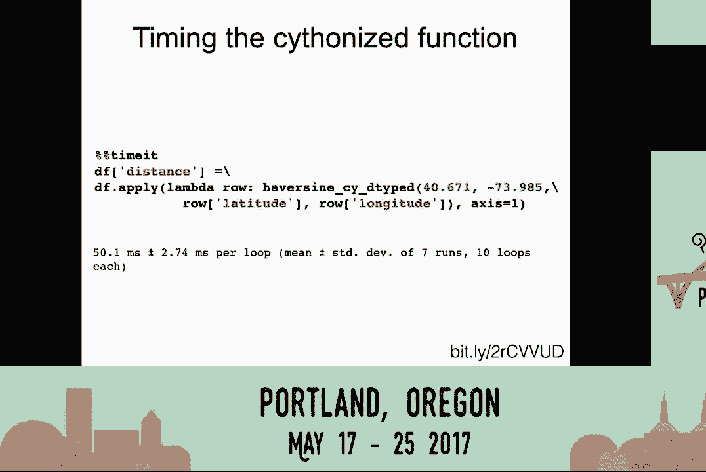

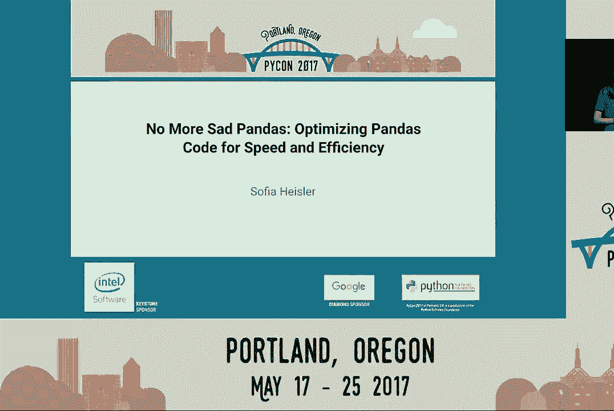

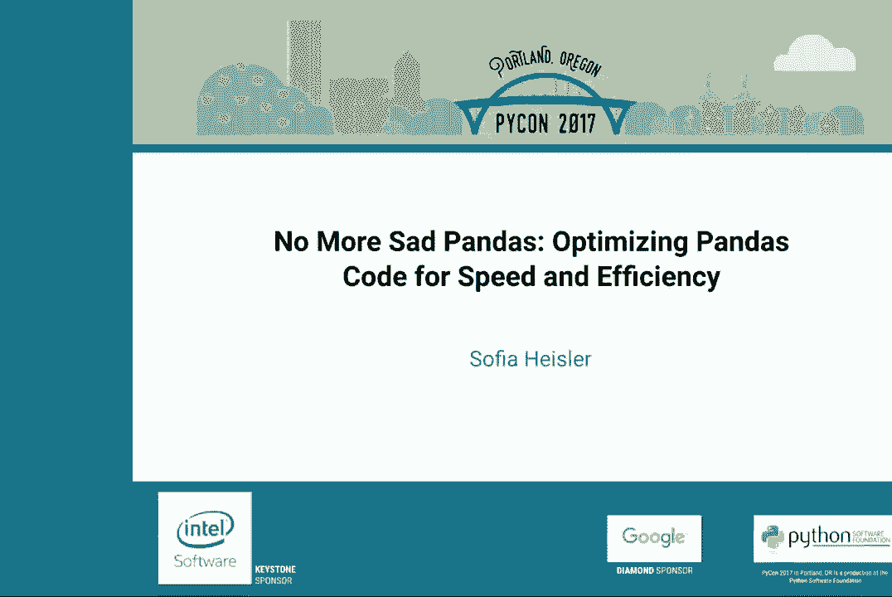

通过应用这些策略，你可以显著提升pandas代码的效率，将运行时间从分钟级缩短到秒级甚至毫秒级。