# P15：Jake VanderPlas   Python 可视化领域   PyCon 2017 - 哒哒哒儿尔 - BV1Ms411H7jG

他将谈论 Python 可视化领域。给他点个掌声。非常感谢。[掌声] 好吧。

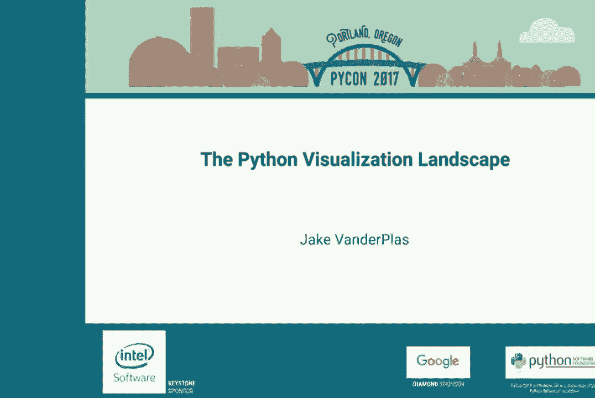

非常感谢。感谢你们的到来。对于许多二次收听我的人，我将在几天后谈论 Python 的可视化领域。因此，在某个秋天，我写下了这个摘要，表示我要给出 Python 中数据工具的全景概述。大约一个月前。

我想，哦，我应该弄清楚那是什么。因此，像我通常做的那样，我发了推文，说，嘿。这些是我考虑讨论的工具。还有其他我应该考虑的吗？

Twitter 回复了这一整件事。这完全改变了我讲座的内容。但我想利用这段时间来理清在 Python 世界中存在的大量可视化工具。这些工具有很多，正如你将看到的。我认为每一个工具都有其专业化。

其独特的应用或独特的优势。我希望每个人都能从这里带走一种能力，即能够观察并说出，鉴于我想要解决的问题，我的可视化任务。我知道在 Python 中该使用哪个包。所以让我们开始吧。一切都始于 Matplotlib。

Matplotlib 已经存在十多年了，几乎快二十年了。它是核心工具，围绕 Matplotlib 建立了许多东西。有这个基本地图、卡多比（cardopi）用于地理可视化。Pandas 和 Seaborn 与 Matplotlib 有一些关联。我们还有像 GGPie 这样的东西。

它提供了一个基于 Matplotlib 的 GGplot 接口。NetworkX 为你提供网络可视化。Yellowbrick 和 scikit plot。这些是我了解到的一些用于机器学习可视化的东西。因此，这就像我想到的 Matplotlib 工具集。我会稍后深入讨论其中一些。此外。

你有 JavaScript。在过去的几年中，许多 Python 库开始依赖 JavaScript，并使用 JavaScript 获得一些很棒的交互式可视化。可能其中最大的两个是 Plotly 和 Bokeh。我稍后会谈到这两个。但还有更多。有这个 toy plot 和 Bq plot，可能你没有听说过。

但它们真的非常有趣的库，值得尝试。你还有与 Jupyter notebook 关联的东西，如 IPy Volume、IPy Leaflet、Py3.js。它们让你利用 JavaScript 的不同方面，在 notebook 中进行交互式可视化，这真是很酷。所以还有其他东西。

Cufflinks 建立在 Plotly 之上。因此，这有点像 JavaScript 的可视化工具集。当然，还有更多，对吧？

你想在 Matplotlib 中链接 JavaScript。所以有这个 D3.js 的东西。我写了一个叫做 MPLD3 的包，它链接了 Matplotlib 和 D3。虽然现在支持不太好，但如果你想把 Matplotlib 图表转换成 D3，这也是个有趣的东西。还有更多基于 D3.js 的工具。

这些图像规范语言，Vega 和 Vega Lite，以及一些 Python 库，如 Altair、Vincent 和 D3PO，提供了一个 Python 接口，连接所有这些工具。你开始感到不知所措了吗？你可以把这些都链接在一起。还有像 Data Shader 这样的工具，它是一种 bokeh 工具，也可以与 Matplotlib 一起使用。

我稍后会给你举个例子。这里有个叫做 Vix 的工具，它与 Data Shader 非常相似，可以在这三个平台上进行渲染。你有这个工具 Hall of Use，它链接了 Data Shader、bokeh 和 Matplotlib。然后还有一个完整的 OpenGL 集群，包括 Glumpy 和 VisPy。还有图形可视化。

还有很多我甚至不知道如何分类的工具，用于处理大数据。所以我们就有了一个庞大的可视化工具的生态系统。你该如何理解这些呢？好吧，我希望这次演讲能通过对这些集群进行颜色编码，帮助你稍微理解一下，以便你之后去 Google 每一个工具。

查看这些例子，你大概会知道它们之间的关系。但在接下来的演讲中，我想深入探讨其中的一些，给你展示一些它们的快速示例，让你了解你可以用它们做什么。

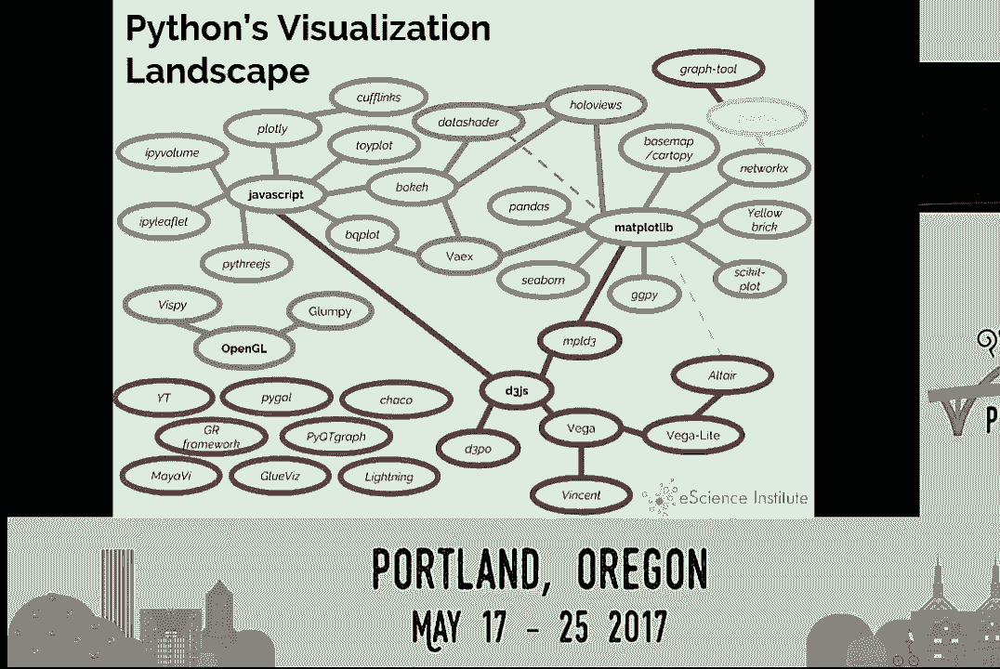

当然，我们觉得这个工具很重要。那么我们是如何走到这一步的呢？这一切都归结于 Matplotlib。这就是我开始使用的工具。尽管 Matplotlib 受到了很多批评。

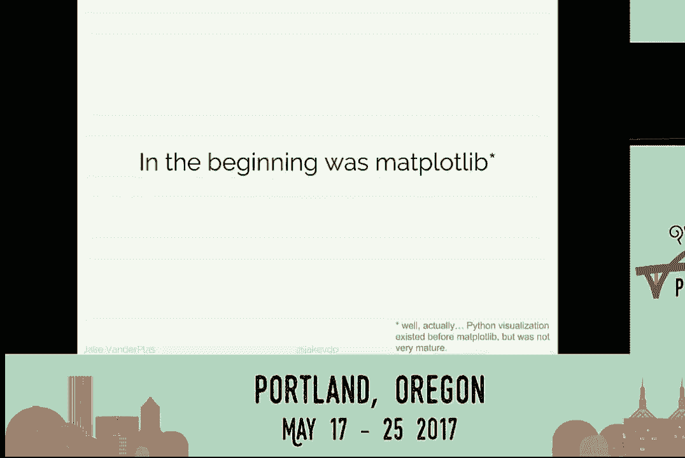

在过去几年里，这确实是一个相当不可思议的工具。它的强项在于，它的设计基本上就像 MATLAB。这对所有在 10 到 15 年前、90 年代末和 2000 年代末转向 Python 的科学家和工程师来说是至关重要的。

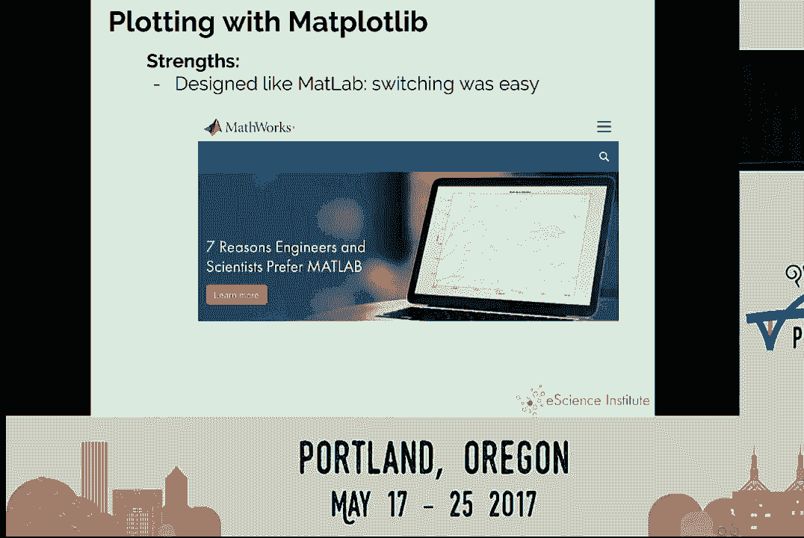

它有大量的渲染后端，这一点常常被低估。如果你在 Matplotlib 中制作一个图表，你几乎可以在任何可视化后端上进行渲染。你可以导出 PNG、PDF、EPS、SVG 等各种输出。而这并不简单，要让你写的代码在所有这些不同的输出中看起来相同，真的很不容易。

这个工具很强大。它几乎可以复现任何图表。制作大多数图表，即使是最简单的，也需要一点努力。而且它经过了良好的测试。这几乎是 13 到 14 年的 Git 提交历史。在这段时间里，它真的经过了实战考验，坚如磐石。所以是 MATplotlib。

我不会低估它。这是一个非常强大的工具。

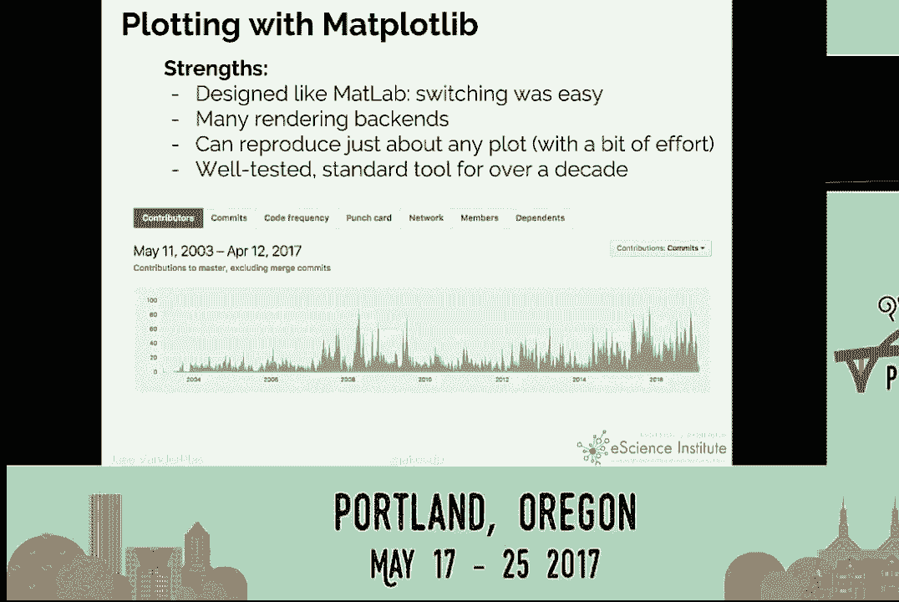

但你可以用它做所有这些不同的事情。不过它确实有一些弱点。如果你尝试进行统计可视化。

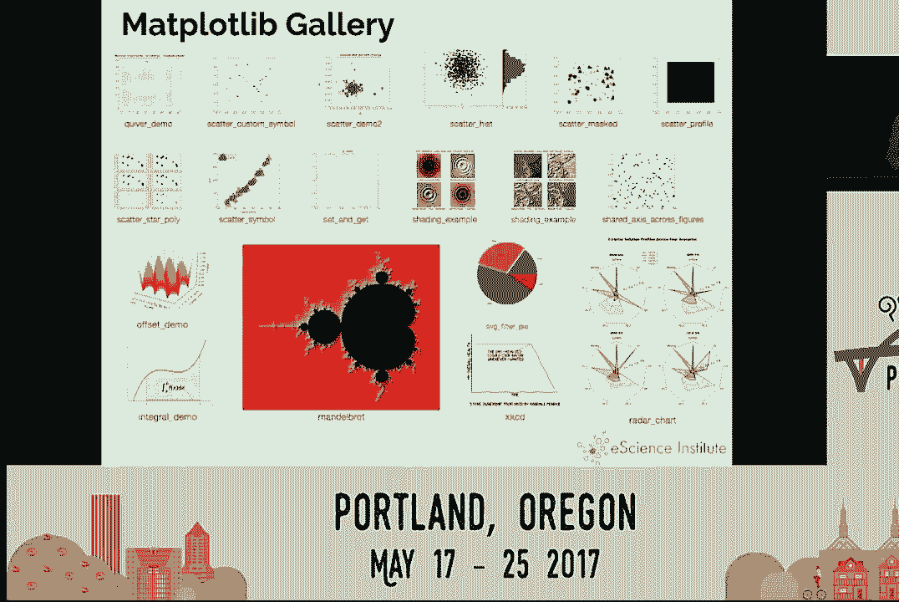

使用**MATplotlib**时，你会遇到这个问题。假设你有一些数据，比如这个**IRIS**数据集的数据框，如果你做过任何机器学习教程，你可能已经接触过。它是一个相对简单的数据集。假设你想要绘制花瓣长度与萼片长度的散点图，并按物种上色。你可以用一个句子片段来表达这一点。

使用**MATplotlib**需要多少行代码？有什么猜测吗？

这算是做这件事的最佳方式。用一个变量来散点图展示另一个变量，并用第三个变量上色。你必须写出所有这些样板代码。问题是，尽管**MATplotlib**强大，但在很多情况下并不是很具表现力。这些都是其弱点之一。API 可以非常冗长。

有时样式默认值较差。它基于 2001 年的**MATLAB**。所以如果你想要看起来像 2001 年**MATLAB**的图形。但我应该说，在最近发布的**MATplotlib 2.0**中，样式默认值已经更新了。所以最近好多了。它并不真正支持网页或交互式图形，这。

这是很多人如今想要的。而且在处理大数据集时可能会比较慢。所以每个人的目标，我认为，正是我们拥有这个庞大的竞争库网络的原因，都是因为每个人都希望改善**MATplotlib**的这些弱点，同时希望不牺牲其优势。而改进**MATplotlib**的一种方法是。

牺牲优点的是你使用**MATplotlib**。所以所有这些**MATplotlib**工具在这里。它们的共同点是将**MATplotlib**作为核心。因此你拥有所有输出后端，所有的多样性和强大功能。但你在上面放置了一个新的 API。这样你就可以解决那个弱点。你可以说，我可以使用**MATplotlib**。

但我可以让生成这些图形变得更简单。我想在这里强调的两个工具是**pandas**和**seaborn**。它们在**Python**数据生态系统中最近非常流行。你可能知道，**pandas**是一个旨在创建数据框、存储带标签数据和标签列数据的库。

它实际上有一些内置绘图函数。如果你对任何这样的**iris**数据框使用点图，然后点出其他东西，那里面有很多不同的绘图方式都是内置的。所以在这里，我们只需一行就可以绘制该数据框的两个列的散点图。

你甚至可以做更复杂的事情。那里有更复杂的统计可视化。这是我最近发现的一个我以前从未听说过的可视化，但我觉得很酷。这是一种将数据框的所有列转化为傅里叶级数并将它们绘制为线条的方法。

每一行都是数据框中的一行。它是一个对象。在某种程度上，这些曲线编码了所有列中的值。因此，仅通过查看这一点，你就能看出其中有三种非常不同类型的对象。你能感受到它们之间的关系。

这些安德鲁曲线有点有趣。我期待在自己的工作中使用它们。还有一个我想提的是 Seaborn。这是一个专门设计用于使统计可视化和更复杂的统计可视化在 Matplotlib 中变得简单的库。它封装了 Matplotlib，提供了一套不错的样式默认值和颜色调色板。

而且你可以用几行代码完成这些事情。这是一种更高级的语言，所以你需要记住更多的内容。你没有那么多可组合的小块。但如果你知道要找什么函数，你可以用非常少的代码行完成事情。例如。

你可以调用 pairplot 函数，获取整个数据框中所有列的成对比较。因此，如果你想在 Python 中使用 Matplotlib 进行统计数据探索，Seaborn 真的是非常不错的选择。好的，那么还有这个 JavaScript 集群。每个人都喜欢 JavaScript 的原因是它现在是网络的通用语言。

所以你可以在 JavaScript 中做令人惊叹的事情，因为它将交互性带入你的浏览器。每个人都有浏览器。你不必再担心这些跨平台的渲染后端。你只需渲染到浏览器。浏览器开发者已经处理了所有的困难部分。因此，关键在于。

这里的共同点是，你基本上是在 Python 中构建一个 API，生成某种可序列化的图形，然后可以传递给浏览器。在浏览器内部，你有一个相应的 JavaScript 库，读取该序列化并渲染图形。这大致是这些工具以某种方式所做的事情。

我想快速关注一下 Plotly 和 Bokeh，我认为它们是这个工具集群中最成熟的。它们都非常出色。它们为你提供了一种互动感，而这是 Matplotlib 所缺少的。所以这是使用 Bokeh 绘制的相同数据。我只是提取了列并做了一个圆形图，然后。

显示它。你可以进行所有这些交互，可以点击，可以缩放，可以平移。如果你深入一些，可以开始做一些事情，比如添加控制器，还可以为点添加工具提示等等。Bokeh 是一种非常棒的语言，它让你可以进行这些类型的可视化。

如果你查看 Bokey 的图库，去在线访问 Bokey.pydata.org。你可以点击每一个示例。因为它是基于浏览器的，每个示例都是互动的。你可以开始点击和拖动，感受它的工作方式。所以 Bokey 是来自 Continuum.io 的，他们带来了 Anaconda，Numba。

还有一些其他很棒的工具。所以我真的建议你们好好看看这个。你们有优势，你们有这种交互性，有多个不同的层次和 API 来生成内容。缺点是你没有 Matplotlib 那样多样的输出。因此，目前来看。

除非我记错了，否则你仍然无法输出 PDF 或 EPS。因此，如果你是一个为需要 PDF 或矢量图形的期刊写论文的科学家，你就麻烦了。而且这也是一个稍微新一点的工具，用户基础并不多。

它没有 Matplotlib 那样经过严格测试，但确实正在朝着这个方向发展。它是一个很棒的程序。因此 Plotly 与之非常相似。Plotly 的背景其实是一个来自蒙特利尔的初创公司。他们有一个有趣的开源/闭源模式，其中大量的 Plotly 工具是开源的，采用 BSD 许可。

你可以用它来做任何你想做的事情。但是他们用来赚钱的一些功能，若你想要更多，就要收费。这通常是自动将图表托管在某种服务器后端的网站上，类似的东西。

不过我知道很多人使用 Plotly 的免费版本进行一些非常不错的可视化，甚至是科学可视化。他们可以做各种不同的事情。他们有一些 Boke 没有的功能，比如 3D 绘图和内置动画。我可能错了，我觉得在 Boke 里也能做动画。

但是它并不像 Plotly 那么简单。不过这是一个非常，非常好的可视化框架。这里有个酷点是，它不仅是一个 Python 库，还是一个 R 库，甚至是一个 Julia 库。它们有不同的方式来从不同的语言针对 JavaScript 后端。所以，正如我所说的，优势与 Boke 相似。

所有这些网页视图交互性，多语言支持，具有 3D 绘图功能。一些功能需要付费计划。根据你的软件哲学，这可能会让你失望。我知道有些人对此态度不同。但我认为这是一个很好的库。如果你感兴趣，我建议你去看看。

这些互动可视化。所以接下来提到的是，Matplotlib 对于更大数据的可视化并不好。有很多库专门解决 Matplotlib 的这个缺陷。它们依赖于 OpenGL，比如 VisPy 和 Glumpy，我不确定该怎么发音。

像 Data Shader 和 Vioxx 这样的工具都很有趣。它们使用非常高效的代码，因此不需要将数据点传递到 GPU 或计算机进行渲染，而是预先聚合所有数据并将像素位图发送到计算机进行渲染。

因此，当你有十亿个点时，发送十亿个点到你的可视化屏幕是没有意义的，因为没有十亿个像素可用。因此，你可以预先聚合这些数据，制作热图。这是它们所采用的策略。

而这些其他工具真的很好。我希望我有时间深入讨论它们。部分工具来自天文学社区，用于可视化大型三维数据集。如果你对此感兴趣，可以查看左下角的灰色区域。但我想快速看看 Data Shader。

因为我认为这是一个不错的项目。它仍在积极开发中，但有一些令人印象深刻的演示。我必须道歉。我原计划做 Data Shader 的实时演示，因为我认为它非常棒。但突然间，我在主题演讲中有了孩子，这个计划没能实现。因此，我有一些截图。

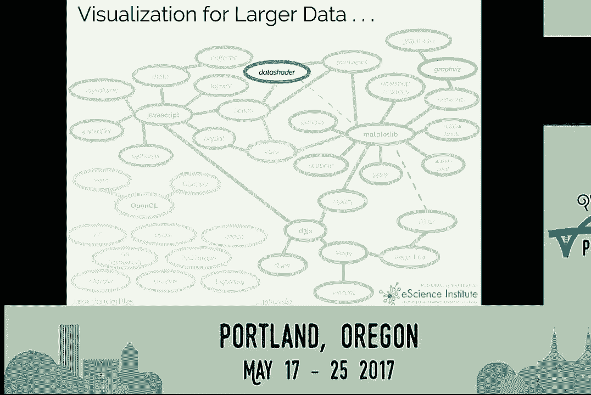

是的，Data Shader 使你能够进行快速的服务器端处理。这是一个快速的服务器端引擎，进行动态数据聚合。因此，你可以处理如人口普查数据这样的内容，其中有 2 亿、3 亿个点。在实时中，你可以在地图上可视化这些数据。

我可以在这里做的实时演示是你可以放大和缩小。实际上，它会实时计算你所查看的边界，确定哪些数据子集与之匹配，然后重新聚合并发送到屏幕上。

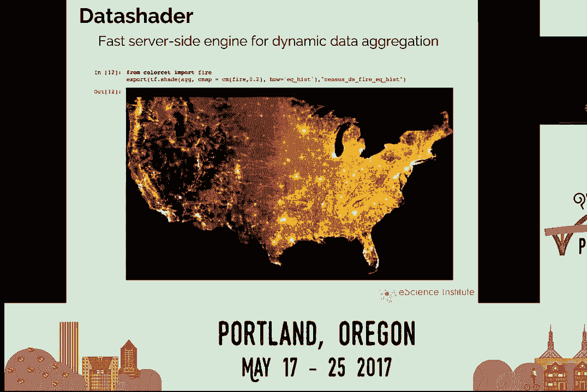

所以如果你想处理数亿或十亿个点，Data Shader 非常棒。这是一个放大的视图。你可以平滑地放大密歇根湖和芝加哥，获取更详细的点数据。因此你再放大，便可以看到社区级别的数据。

如果你想可视化非常大的数据集，我真的建议你尝试一下。你可以下载他们的演示笔记本，安装说明相当简单，而且这是一个有趣的包。

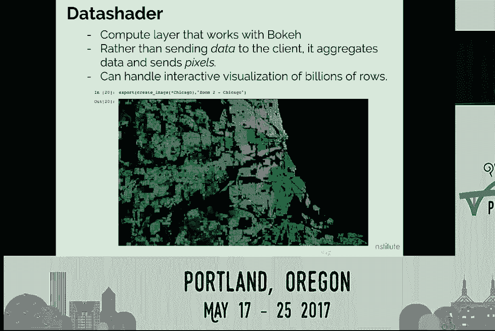

这里还有另一类算法，我认为它们非常有趣，尤其是将这些内容结合在一起的算法，特别是在上方的空视图，以及右下角的剖面。这些是针对不同后端的新型声明式语言规格。

系统。他们可能会对接 Bokeh、matplotlib 或 d3。让你以非常表达的方式和强大的方式创建图形。因此，第一个是 hollow views，这是一个非常有趣的项目，值得关注。我几年前在 SciPy 会议上听到过他们的演示。

这最初的理念是数据集应该有一种内在的教导，数据集的最佳方式是进行可视化。因此，如果你有一个由某些数字的列组成的数据集，就有一种内在的方式去可视化它。

作为程序员，我们不应该考虑这些，调整 x 轴和 y 轴、标签、刻度和颜色。计算机应该知道如何可视化这些数据。因此，你们开始的就是一种将数据集包装起来的方法。

当你在笔记本中对那个对象进行表示时，它会给你可视化的对象。因此，与其说这是一个数据框，地址是某某某，不如说它实际上给你展示了数据的图像，并在此基础上构建了各种有趣的交互性。你可以做一些诸如映射数据的事情。

根据我所听到的，我与一些 Bokeh 开发者交谈过。听起来所有这些都将被整合到 Bokeh 中，并将成为他们的可视化声明层。

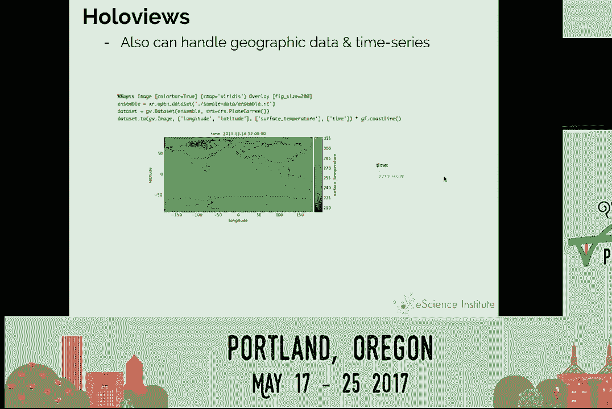

但你们也可以看到我在这里放的链接。它也可以与 mapplotlib 对接。它可以与 data shader 无缝协作。无论你需要什么后端，如果你需要一个交互式后端，或者大数据后端，或者一个可以输出每个图形文件的后端。

想象中的图形文件，你可以使用相同的系统。

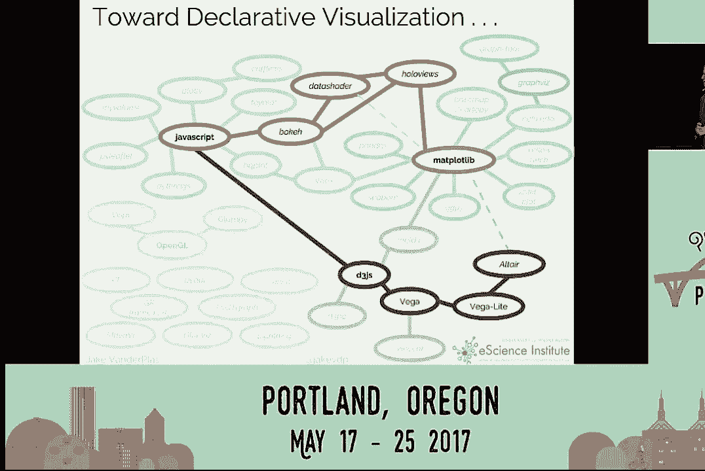

我认为这是一个非常强大的方法。我想谈的最后一个项目是我一直在努力的宠儿项目。这是一个叫做 Altair 的库。这里的想法是，如果不是传递像素。

我们实际上传递的是数据本身，带有描述我们想要什么样图形的元数据。这是非常令人兴奋的事情。Altair 底层的库叫做 Vega 和 Vega Lite。这已经开始被像维基百科这样的东西采纳，他们不想只保存位图。

我们想保存数据，并希望保存说明，告诉网页如何可视化这些数据。我认为这是一个非常强大的想法，因为它可以广泛采用。我们将能够使用整个工具生态系统，并能够让 Bokeh 输出 Vega Lite 的规范。

然后可以被 Matplotlib 读取，并可以传递给其他东西。我与学术期刊和天文学界讨论过，可能让科学家以这些规范的形式提交他们的图形，这样期刊就可以生成 PDF 进行打印，同时也可以生成相应的交互式图形，放在他们的网页上。因此，我真的认为这是未来，这是我所推动的理念。

所以我们在推动这个声明式可视化的概念。这是一个与我在 eScience Institute 的同事、Jupyter 项目，以及华盛顿大学的互动数据实验室合作的项目，后者是你可能听说过的 D3 工具的开发者。

那么声明式和命令式之间有什么区别？命令式可视化，例如 Matplotlib。你可以用一句话说明你想要的图形，然后写 50 行代码来实现。声明式可视化则试图让代码尽量简洁。

尽量做到与那一句话描述尽可能接近。你可以说，我希望 X 成为这个变量，Y 成为那个变量，颜色成为这个变量，并显示结果。因此，命令式是你在指定某些事情该如何完成，所有的小步骤、手动绘图步骤、规范和执行是交织在一起的。

在声明式可视化中，你指定应该做什么，细节则应由系统自动确定。这与使用数据库语言相似，就像通过编写 Python 脚本处理数据与编写 SQL 查询之间的区别。SQL 查询是你希望系统执行的声明性规范，系统可以找到执行的最有效路径。因此，关键在于这让你可以专注于数据和。

关系，而不是这些偶然的细节。布莱恩·格兰杰是 IPython 开发者之一，他实际上在上个学期使用这个库 Altair 来教授入门数据科学课程。他对未来的进展感到非常兴奋。因此，我认为我们努力的方向是让学生开始思考数据和关系。

而不是考虑语法和库。

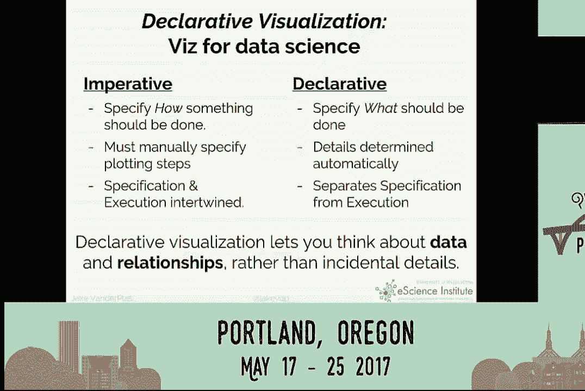

那么这一切来自哪里？你可能见过 D3 语言。我会点击这里查看实时版本。如果你去纽约时报，看到这些非常有趣的交互式演示，当你悬停时，你会看到不同的内容。

基本上，纽约时报上看起来像这样的任何东西都是用 D3 写的。这是因为纽约时报的图形编辑是 Mike Bostock，他写了 D3。所以他使用它很多。他让他的所有人都使用它。我刚刚关闭了全屏。怎么恢复？对。所以 D3 超级强大，你可以做这些惊人的事情。

交互式图形，对吧？但如果你曾经尝试使用 D3，你会发现它是如此低级，除非你是 Mike Bostock。

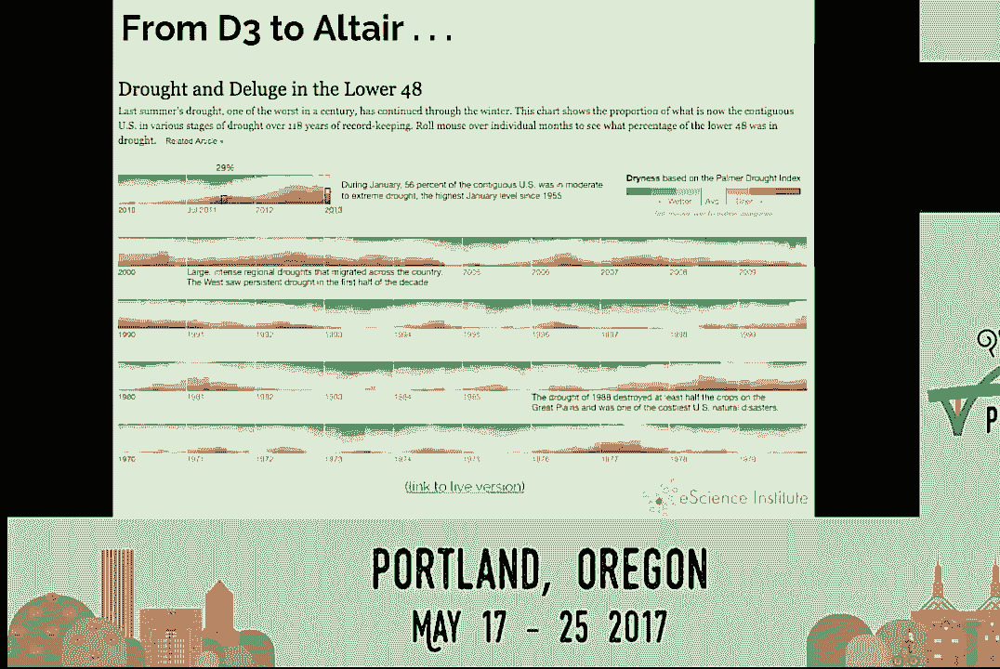

你无法用它做任何事情。这里有一个例子。这字面上就像 D3 示例页面上如何制作柱状图的例子，对吧？就像。好的，我要做一个直方图来看看。这让你想起 Matplotlib，真是疯狂。但在 Bostock 去了纽约时报后，他的顾问 Jeff Hare。

在斯坦福大学，帮助开发了 D3，后来搬到了华盛顿大学。他考虑到这一点，说，我们需要一种更好的方式让真正的科学家和统计学家可视化他们的数据。所以他们写了这种规格语言叫做 Vega。Vega 在这方面有所改进。

这不再是创建轴等命令的强制列表。它是一种声明式规格，说明，这是我的数据。这是我想链接到 x 轴和 y 轴的内容。但它依然强大。你不会坐下来写这个 JSON。

结构以查看你正在探索的一些数据的柱状图，对吧？

一旦他们让 Vega 工作起来——这是一种强大、强大的东西，许多基础都在这里——他们说，我们需要让它变得更简单。所以他们做了 Vega light，对吧？而 Vega light 几乎到了你可以坐下来在文本编辑器中输入它并使其生效的地步，对吧？

你基本上是在说，这些是我的数据。我想要一个条形标记。我想要 x 是 a，y 是 b。然后它会输出这个结果。所以我们在 Altair 中所做的，Altair 库基本上是一个 Python API，创建这些输出，生成这些 JSON 规格。

因为我喜欢写 Python。我不喜欢单独写 JSON。所以 Altair，这就是它的样子。你在数据框中有数据，你说，我想用这些数据制作图表，我想要一个条形图，x 是 a，y 是 b。所以突然之间。你实际上只是在告诉计算机你想要显示什么，计算机会弄明白。

如何显示它。而这段代码的输出基本上就是这个小 JSON 对象。现在你可以开始把它传递给其他库和其他地方。所以你已经将图表的规格与图表的执行分开了。我真的很希望将这个作为一种模型。

在所有这些 Python 库之间以及与 R 和 Julia 等其他语言的库之间，实现互操作性。因此，这里是另一个更复杂的示例。回到我们在 Matplotlib 中做的原始图表。我们想说 x 是花瓣长度，y 是萼片宽度，颜色是物种。

你基本上只需写出这些，然后你可以开始添加一些属性，比如圆的透明度。如果你把它应用于字典，实际上是 Python 的 JSON 表示，你会得到一个描述图表的字典。这就是重现图表所需的一切信息。因此，这真的很有趣。

你可以用 Altair 做一些非常强大的事情。这些是我们为不同类型数据可视化提供的一些更高级的示例。我特别喜欢这个。左中间的这种黄蓝图，大家有认识吗？

这是麻疹发病率随时间变化的图表。那里有一个截断，那是麻疹疫苗引入的时间。所以你可以在历史数据中看到。每一行是一个州，每一框是一年中感染麻疹的人数。你可以看到这个疫苗的效果，效果真的很好。你可以查看一下。

我认为 Altair 的网址是 Altairvis.github.io，去看看。我还要说这在积极开发中。刚发生的一件事是 Altair 2.0 或 Vega-Lite 2.0 发布了。这令人非常兴奋。你知道，可视化的语法并不是一个新概念。

其他人以前也这样做过。但他们所增加的只是交互的语法。所以你可以从基本构件构建这些小的交互。目前在 Altair 中还没有这个。但是我六月份的项目，等我结束带薪假期后，就是完成这个并将 Altair 发布出去，这样你就可以开始进行交互式操作。

声明式图表。不过无论如何，你可以尝试这样做，conda install，pip install。你可以获得一个教程。你可以访问网站。

这就是可视化的全景。我有我的联系信息，但我会把它留在这里，接受几个问题。谢谢大家。我们有时间问问题吗？有的，留出两分钟问问题。如果有人想上麦克风，我们可以这样做。我也可以在之后与大家交流。哦，有一位 bokeh 开发者上来了。糟糕。

我上一次对 bokeh 的提交是直接提交到 master，一个示例。我用我的示例破坏了 master。因此，我不再提交到 bokeh 了。但我有一个形式如同问题的声明。但首先，我非常感谢你提供的这一切。内容非常全面。这并不是一件容易的事情。

非常感谢你在这里做的工作。但我想问的是，你知道 bokeh 其实也有 R 接口吗？所以它也是——我确实知道这一点。我应该提到这一点。但谢谢你，Jake，做了一个很棒的演示。那是以问题的形式提出来的。[听不清]，非常感谢你整理这一切。

关于 Altair，我非常感兴趣。但我花了几年的时间学习 Ggplot2。我只是在想，当你查看你的语法时，你是否考虑过像 Ggplot2 这样非常成功的图形语法？

我希望你的 API 受它们的影响，这样我过去的努力就不会白费。是的，是的。所以这很相似。我们的 API 在 Altair 中主要受到 VEGALITE 规范的影响。

读取 VEGALITE 架构并创建一个 Python 对象层次结构，然后在此基础上添加一些小功能。我没有放这张幻灯片，但我最自豪的一点是，我们有双向甚至三向转换。我可以将 Altair 代码生成 VEGALITE 规范，然后再从 VEGALITE 规范回到 Altair 代码。这样我就可以进行这样的往返旅行。我们单元测试套件测试每一个可能的情况，代码只有 12 行。

所有 VEGALITE 示例的这个往返旅行让我感到非常兴奋。我笑了三天。[笑声]，谢谢。我之前恰好使用过 VEGALITE。所以既然 Altair 应用了 Python API，这是否意味着我仍然需要 web 浏览器来查看图形？是的。

你需要 web 浏览器才能看到它，因为这是一个最终渲染图形的 JavaScript 库。这并不是一个根本限制。有些人正在开发在 Matplotlib 中创建 VEGALITE 渲染器的工作。但现在我们将其与 Jupyter 项目和 JupyterLab 结合在一起，几乎是无缝的。

你只需创建 VEGALITE 对象，Jupyter 就知道如何在浏览器中渲染它。好的。谢谢。也许还有一个问题。是的，我想我可以问一个问题？

问题是你如何解决 I/O 问题？

因为看起来你展示的亿级数据集是在内存中吗？

如果它在内存中，如何从数据库进入内存？

这是关于数据着色器的问题。我会把这个问题交给像 Peter 这样的人，因为他们可以更好地回答有关数据着色器和其他相关内容的问题。我会接受最后一个问题。如果我们需要结束的话，我可以线下进行。这个问题快吗？中等。我想是的。

对于交互式图表，你展示了很多选项，但主要集中在缩放和地理约束的缩放上。切片数据呢？比如，按收入或种族的人口普查，这需要一些用户框？是的。这些工具中有哪个是为此设置的吗？

还是说你必须传递一个不同的 JSON？它们是的。如果你特别查看 Bokeh 项目，它们有这种创建仪表板的方式，真的非常强大。它们可以是客户端或服务器端的仪表板。如果你查看 Bokeh 的所有示例，就会看到有使用滑块与可视化结合的示例之类的东西。所以我建议看看 Bokeh。谢谢。我们希望能在所有领域实现这一点。非常感谢大家。

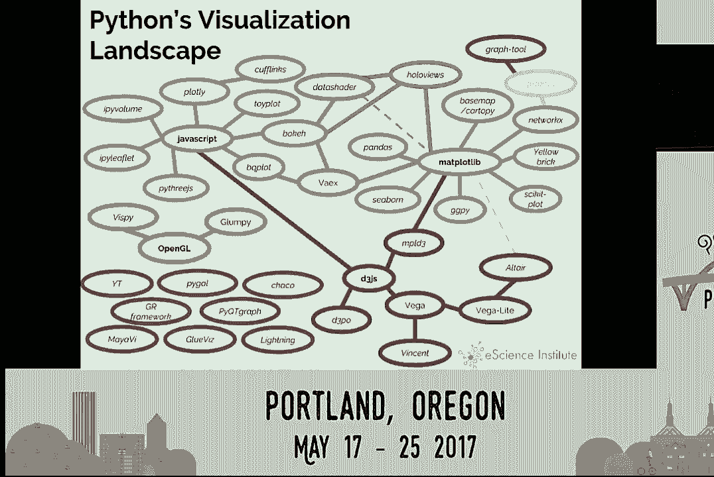

[掌声]，[空白音频]。

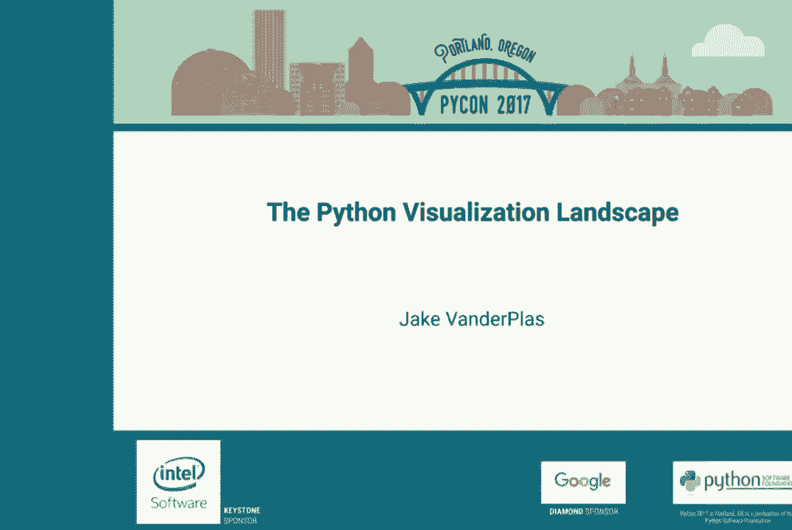
