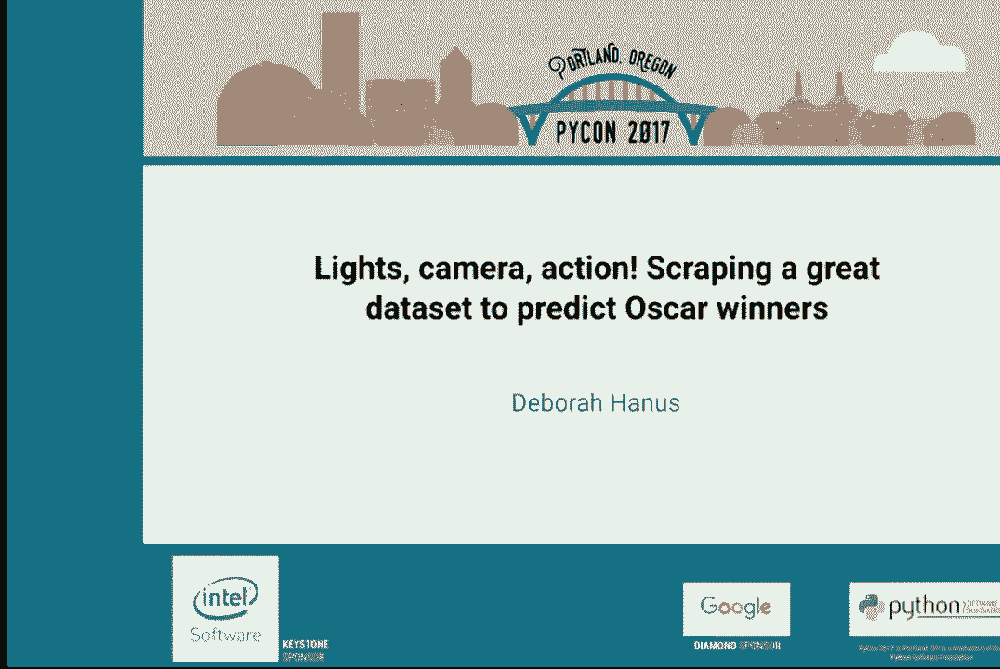
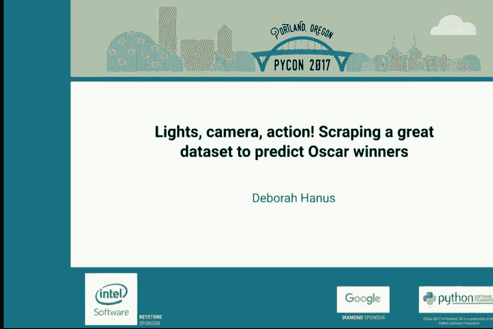
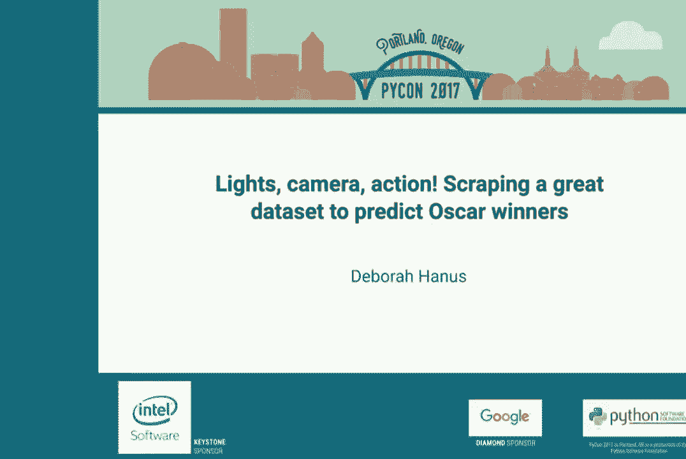

# P16：黛博拉·哈努斯   摄影机准备！抓取优秀数据集以预测奥斯卡 - 哒哒哒儿尔 - BV1Ms411H7jG

2017 年。请在我们开始之前，如果你有会发出声音的设备，请让它保持安静，否则我会亲自过来盯着你看。我们的下一位演讲者是黛博拉·哈纳斯，她将教我们如何预测奥斯卡获奖者。请热烈欢迎她。

大家好。今天我将和你们讨论如何利用互联网上找到的资料来预测票房和奥斯卡获奖者。首先，我会告诉你我是如何做到今天所做的事情的。我在麻省理工学院完成了本科学位和硕士学位，主修计算机科学，并进行了所有本科研究，开发了关于人们如何看待和感知事物的计算模型。

然后我作为富布赖特学者在柬埔寨度过了一年，学习教育如何转化为就业机会。接着，我在旧金山的一家初创公司担任软件工程师。后来我决定辞掉工作，成为一名博士生。现在我是一名在哈佛大学学习机器学习的博士生。作为其中的一部分。

我有机会参与许多令人兴奋的数据相关项目，比如这个。因此，首先我们将讨论如何构建和使用一个优秀的数据集。第一步，也是可能最重要的一步，是定义一个你能够实际回答的问题。然后，你需要获取良好的数据来回答这个问题，探索数据并得出结论。

从这些数据中。今天我们将逐步了解所有这些过程。因此，我们将首先定义一个我们可以回答的问题。今天我们都将假装自己是电影制片人。我们有资金，并准备为制作电影付费，但我们希望得到一些回报。最好是一大堆现金。那么我们如何回答这个问题？

我们真正想知道的是这部电影是否会成为票房热门？但这个问题相当难以回答。你如何定义这一点？因此，我们可以更好地表述这个问题：在考虑到它具有某些特征的情况下，我的电影成为票房热门的可能性有多大？我们还可以问这个问题的另一种方式是，有哪些属性。

一部电影的哪些因素与票房成功相关？这就是我们今天要回答的问题。因此，我们现在想要获取良好的数据。那么首先，让我们从什么是良好数据开始。我们希望它与当前问题相关。我们可能希望它相对结构化。如果它以某种形式存储在表格中或类似的方式。

这使我们获取数据变得容易得多。理想情况下，我们希望它相对完整。如果它不够完整，还有一个完整的研究领域以及其他讲座来解决这个问题。因此，我们为这个项目找到数据的一些地方是 Box Office Mojo，这是一个很棒的 90 年代风格网站，有着出色的表格。

这提供了关于每年票房最高电影的大量信息。另一个很好的地方是烂番茄，也有很多结构化数据。每部电影都有评级等信息。维基百科非常适合这些内容。它的右上角有一个很棒的框，显示电影标题、制片人、导演。

这意味着它以相同的方式格式化，使得抓取数据变得更加容易。IMDB 也是获取这类数据的另一个好地方。好的，那么我们如何获取这些数据呢？一种方法是使用 API，这只是一些定义好的函数，例如 get movies，可以获取所有电影的信息。

通常由生成数据的人定义。因此在我们的案例中，我们使用了 IMDB pi。而另一个方法是编写网页爬虫。要编写网页爬虫，我们需要先获取网页中的所有文本，将其下载到我们的计算机上，使其可查询，然后我们可以对其进行操作。因此，首先我们将发出一个 HTTP 请求。

以获取 HTML。这就是票房魔力的样子。它是如此结构化，难道不是很美吗？

这里有几个有趣的点值得指出。现在最有趣的是 URL，因为 URL 实际上告诉我们将获取哪些信息。因此我们将放大，仔细观察。问号后面有多个参数，定义了我们要获取的信息。

我们将获取的信息中，最相关的是页码。页数等于一，然后我们查看 2017 年的项目，我们可以从最后一个参数看到。因此，我们可以从所有这些页面获取信息。这只是一个来自 jupyter notebook 的片段，我们将使用请求发出 get 调用，使用那个 URL 并循环遍历所有页面。

值得注意的是，我们在每次抓取之间暂停，稍后会谈到这个问题。然后我们将所有项目放入字典中，如果我们查看字典中的第一个项目，它只是原始的 HTML，极其难以阅读的原始 HTML。因此，为了使其更可用，而不是使用一堆正则表达式，我们可以进行处理。

使用像 beautiful soup 或 pie query 这样的工具使其可查询。这些工具的作用是将左侧的 HTML 转换为一种可解析的树状结构，你可以逐层浏览，比如获取所有子节点等。如果我们返回到网站，我们有那个表格，可以右键点击查看源代码。

完全无法读取的文本。然而，如果你仔细观察，会发现一些特别的模式。如果你使用控制 F 查找某些电影的标题，你会看到表格中的所有内容字体大小都等于二。因此，你可以抓取所有字体大小等于二的内容。现在我们有了这些项目的列表。如果我们选择其中一个。

我们可以看到，票房最高的电影是《美女与野兽》。但它仍然不是我们想要的格式。所以《美女与野兽》的标题在这个链接标签中，我们去寻找这个链接，然后获取文本，这样我们就得到了我们想要的标题形式。所以这看起来很简单，对吧？希望我让它看起来相对容易。

容易，但实际上往往并不容易。所以我们将讨论一些人们常遇到的常见问题。其中之一是速率限制。如果你去尝试爬取一个网页，通常主机会尝试识别你是一个正在点击并请求信息的人，还是一个正在请求信息的机器。

尽可能快地进行。所以在编写网络爬虫时，使用时间睡眠方法设置一些延迟是个好主意，这个延迟至少接近人类点击的速度。通常一秒钟的延迟就足够了。你还可以根据你认为某个人的身份来限制对数据的访问。我之前做过一次演讲，有人之后告诉我一个精彩的故事。

他们在一家开放数据公司工作，大部分数据都是开放的，但有些东西他们保持私密，他们有一个竞争对手并不太讲究，爬取他们的网页以获取所有开放数据。他们想要防止这种情况发生，他们的解决办法是。

他们的第一种方法是放置一个 API 密钥，以便他们可以知道是谁在访问这些信息。然而，他们的竞争对手伪装了 Google 网络爬虫的 API 密钥，所以看起来就像是 Google 在爬取他们的网站。最终，他们解决这个问题的方法是做了一个类似 Angular JS 的单页应用，这样就不那么容易了。

解决这个问题的方法是使用浏览器测试工具，比如 Selenium，它可以为你逐个点击每个项目，然后你就可以通过这种方式访问数据。好的，我们已经讨论了如何获取数据，现在我们将开始探索这些数据。有很多因素可以根据我们拥有的数据集进行探索。

想象一下，电影预算可能很重要。也许一部预算非常大的电影会赚更多的钱。IMDB 评分可能也很重要。你可能会怀疑，好的电影会赚更多的钱。也许如果一部电影来自像华纳兄弟这样的强大制片厂，它会赚得更多。开幕周末的收入也可能会影响。

预测它在长期内能赚多少钱。你可能想象到，开放影院的数量会有一定的饱和度。如果你在太少的影院上映一部电影，会有很多想看的人看不到。而如果你在太多的影院上映一部电影，就会有很多空座位，你开始亏钱。这是季节性的问题。

可能有些电影人们更愿意在特定时间观看，而不是其他时间，比如圣诞电影。然后是 MPA 评级，比如 G，PG 等。所以我们将开始探索数据并制作一些基本图表。这将是总收入与开映影院数量之间的关系。从这一点来看，开映周末赚到的钱确实非常重要。

这是一个转折点。这是你可以使用的一个不错的影院数量，大约 3500。因此这很有趣。当我们制作这部电影时，我们可能希望在大约 3500 家影院上映。那么现在看看其他内容。总收入与质量评级。因此，你会期待如果一部电影不错，那可能是可预测的，但看起来确实如此。

根本没有。我们通常会查看如果它沿着那条线发展，那将意味着存在相关性，但似乎完全没有相关性。好电影并不一定会赚更多的钱。因此，我们还可以查看一部电影在首映周末赚的钱与它总体上赚的钱之间的关系。如果一部电影在首映周末赚了很多。

如果一部电影在首映周末赚了很多钱，那么你可以期待它总体上会赚很多钱。所以这看起来是相对可预测的。因此，我们将这些数据结合成一个多变量回归模型。我们发现模型似乎拟合得相当好。太棒了。所以我们稍微探讨了一下数据。我带你们了解了一些我们观察到的内容。

在这项分析中，用于判断某部电影是否会成为票房的主要方法是线性回归。因此我们将得出一些结论。我们发现预算有帮助，但并不是很大。我们发现时机非常重要。看起来 12 月是个很好的发行日期，这似乎合理。12 月通常。

这是很多人和家人一起去电影院看电影的时候。你在 12 月份和其他时间相比，更可能与 10 个人一起去。我们发现，P。J。和 G 级电影更赚钱，这也有道理。我认为很多人觉得在大团体中观看其他类型的电影会感到尴尬。我们发现。

好的。所以我们已经讨论了赚钱所需的条件。那么，赢得奥斯卡需要什么呢？为了回答这个问题，我们将使用之前的方法。我们想定义一个可以回答的问题，获取良好的数据，探索数据并从中得出结论。因此现在我们。

说我们都是演员。我们可能是线性结构中的一个角色，我们想知道如果我们在下一部电影中表演，我们是否能赢得奥斯卡？所以我们真正想知道的问题是这部电影是否会赢得奥斯卡？一个更容易回答的问题可能是，考虑到这些因素，这部电影赢得奥斯卡的可能性有多大。

它具有某些特征，或者说哪些电影属性与电影获奖相关？好的。那么现在我们需要获取数据。这证明比我们预期的要稍微难一些。IMDB 我们将整个项目作为数据科学课的班级项目进行，这意味着我们大约在两周内完成了一切。我们发现了一个。

IMDB 有一个 API，可以让你调用获取某些电影信息，但他们也通过专业服务出售他们的信息，因此他们不想通过这个渠道提供太多信息。所以他们使得他们的 API 非常缓慢。每部电影大约需要五到十秒。我们能够获取一些有趣的信息，但。

嗯，我们最初想查看所有最近的电影，大约在过去的 10 或 15 年间，但我们发现，这将需要一个月的时间来获取所有这些数据。因此我们不得不回去重新评估我们的问题。我们无法回答这些。但我们确实发现了一个包含所有电影的 CSV 文件。

在 1980 到 1996 年之间被提名的电影。所以我们能够重新评估我们拥有的数据进行分析。我们想说，考虑到一部电影被提名奥斯卡的情况下，因为这就是我们所拥有的，我们没有所有其他存在的电影。什么属性与获奖相关，我们能否制作分类器来预测奥斯卡获奖者。

好吧，所以我们开始探索一些数据。在这里，我们有一个不同的因素集可以探索。我们查看了电影提名类别，因此你可能被提名为最佳影片，你也可能被提名为最佳摄影。我们还根据主题内容有许多非常好的二元变量，比如。

这是一部关于家庭的电影吗？它是否包含暴力？它是关于战争的吗？它是否包含吸烟？我认为这是个不错的问题。然后你可以想象，或许戏剧类电影比恐怖电影更有可能获奖，所以电影类型可能会影响结果。可能，电影制作地点会影响结果，或者电影首映年份会影响。

所以我们开始探索这些数据。首先，我们查看了与获奖奥斯卡相关的国家，我们发现，如果电影被提名，如果它来自意大利或西班牙，它实际上获奖的机会非常好，甚至比美国还好。然后我们想查看时机的影响，比如。

当电影上映时。所以我们首先查看了每个月获奖电影的数量。如果我们看看这个，12 月显然是赢家，我们绝对希望我们的电影在 12 月上映。但后来我们意识到，我们想得更多，意识到可能会有不同的数字，可能每个人都知道这个秘密，可能会有。

在 12 月有很多电影上映。因此，我们基于上映电影的数量进行了归一化，发现 12 月并不那么明显。你确实希望在下半年，即 7 月至 9 月之间上映电影。我还没有全部分析完，接下来是绘图。

我们发现，被提名的电影来自意大利和西班牙，获奖的机会很好，就像我们刚刚看到的那样。电影在年底发布更容易获奖。暴力电影表现不佳，除非是战争片。奥斯卡喜欢战争片，这样暴力就没问题。如果一部电影被提名为最佳影片。

如果一部电影提名最佳摄影，获奖的机会就不大。那么我们在这个过程中做了什么？我们定义了两个可回答的问题。我们使用 requests 和 beautiful soup 构建了一个网络抓取器，探索了我们的数据，用它回答问题。我想感谢我的团队其他成员。

我请他们都给我发了自己的照片，他们都发了鸟的照片，那时我知道这将是一个伟大的项目。对于想要自己开始抓取的朋友，我们使用的一些资源包括 requests 和 beautiful soup，后者用于让文本可查询。

我们分析了使用 Jupiter notebooks 的数据，包括网站工具包、谷歌统计模型。我认为，学习的最佳方式之一是查看示例项目。我们除了整理一个网站，概述我们的结果外，还把所有的 Jupiter notebooks 在线发布，详细说明我们如何得出结论。

我们的分析思路和构建分类器的过程。因此，我鼓励大家去看看。如果你在寻找下一个数据科学项目的起点，随时可以联系我。这是我的推特账号。非常感谢你们。谢谢，Deborah。

如果有任何问题，欢迎到过道的麦克风前提问。嘿，最初你们探索的一个学习是，如果在 12 月上映，收益会非常高。当你查看奥斯卡时，你会发现后半年的上映与奥斯卡的关系。

你认为高收入和获奥斯卡之间有相关性吗？如果有，那么你觉得如果用收入而不是上映时间，模型预测效果会更好吗？这是我们考虑过的，我们真的想进行这样的分析，但我们。

遇到了一些问题，因为正如我所说的，关于 IMDB 的信息我们无法获取所有年份的数据来进行分析，但我同意这可能是一个非常有趣的点。从我所看到的，我认为这是合理的。那么，你如何探索这样的事情呢？在这种情况下你使用了什么常见的方法。

说“哦，你知道，你赚得更多，因此你可能会赢得奥斯卡”是有意义的，但在更深奥的情况下，你如何处理这样的相关性？你会推荐什么最佳实践？当场回答这个问题有点困难，但我很乐意之后再和你谈谈。嗨，我很好奇你是如何知道电影是否包含暴力或吸烟的，这些数据是？

是来自 IMDB 的其他信息吗，还是只是某种情况？我们收到了这个包含所有这些电影信息的 CSV 电子表格，涵盖了 80 年代到 1996 年被提名的电影，实际上给了我们所有这些变量，所以他们有一些像“这是否与战争有关”的二元变量。非常好，因为我们能够查看所有这些二元变量。谢谢。

还有其他问题吗？如果没有其他问题，我有个问题：你在做预测时如何证明你的预测有多好，或者如何衡量你的预测有多好？如果有新电影出来，你不会说它可能是最新的，或者多少百分比？

是的，这实际上是一个很好的问题，我在演讲中有一个删除的部分讨论这个问题。所以通常你会在先前的数据上训练一个分类器，然后你可以在一些测试数据上测量准确性，因此你可能需要查看一些最近的年份，也许你可以使用 2016 年的数据，因为那已经过去了，并且只是移除一些。

在奥斯卡奖上看看你的预测有多准确。考虑这个问题时，另一个非常重要的事情是查看基准，因此在这种情况下，当我们查看分类器的准确性时，你想要开始时说一些，比如“而不是仅仅说我们预测了 70，我们有 70%的准确率和”。

这很好，你想要看看，如果我们预测它们都是失败者。结果表明，这实际上接近 70%的准确率，所以你想要查看如果一切都是失败者，或者一切都是赢家，然后你可以把这些作为基准，看看你的分类器是否比这更好。谢谢你，非常感谢。

还有其他问题吗？谢谢你，**德博拉**。

谢谢。[空白音频]。

[空白音频]。

[空白音频]，[空白音频]，[空白音频]，[空白音频]。

