# P17：郭慧丽   主旨演讲   PyCon 2017 - 哒哒哒儿尔 - BV1Ms411H7jG

PICON 2017。（观众鼓掌）因为我的睡觉时间，我没能参加。测试的情况如何？六个人对此感到兴奋。所以，我没有任何新闻，关于我昨天描述的火车情况，今天的情况似乎依然如此。

总是期待明天。天气本该是阳光明媚，真的很美丽温暖，波特兰却不是。（观众笑）因此，我唯一要做的就是介绍我们的早间主旨演讲嘉宾。我们将开始一个对我来说非常有趣的话题，因为我在 Dropbox 工作。

直到昨天看了 Jake 的主旨演讲，我才听到 Gito 的那句名言，他从未预料到人们会写出超过几百行的 Python 程序。这解释了很多。（观众笑）在 Dropbox。（观众笑）我们确实突破了几百行的界限。（观众笑）

当然，Instagram 也有。所以，我很感兴趣，想听听他们最近在 Python 方面的故事。因此，我很高兴欢迎郭丽莎和 Huie Ding 上台与我们交流。给他们热烈欢迎。（观众鼓掌）- 你好。

大家早上好。感谢 Brandon 的介绍。谢谢大家在周六早上来到这里。我知道这有点早。所以，我的名字是 Huie。我负责 Instagram 的基础设施工程。今天我和我的同事郭丽莎在这里，跟大家谈谈我们是如何在 Django 和 Python 堆栈上运行 Instagram 的。

Instagram 自 2012 年开始使用 Python，当时我们的第一位基础设施工程师谈到了如何在 Python 中构建 Pub/Sub 系统。我们很高兴成为这个社区的一部分，并且很荣幸能有机会今天在这里与大家讲话。但是首先，你可能想知道 Instagram 是什么？对许多人来说，Instagram 是一个分享早午餐的应用。

（观众笑）这正是我们在常规周六早晨应该使用的。它始于 2010 年，并迅速发展成为全球最大的社交平台之一。今天，有超过 7 亿的月活跃用户定期使用 Instagram。所以，几周前，Instagram 实际上是宕机的。

因为我们正在尝试将一个 Python 优化部署到生产中。我知道。

这在新闻中得到了报道。（观众笑）但说实话，Instagram 是一个社交媒体平台。我们的使命是通过共享体验帮助增强人际关系。今天，你可以在 Instagram 上讲述你的生活故事。你可以与朋友和家人进行视觉沟通。

你可以在 Instagram 上进行直播。除了早午餐照片，你几乎可以探索任何事物。从动物到自然，从美妆到购物，从 F1 赛车到调色，这是我最近学到的新知识。无论你的兴趣是什么，我可以保证，你都能在 Instagram 上找到相关内容。让我们回到 2012 年，抱歉，是 2015 年。

当我第一次来到蒙特利尔的 PyCon 时，我们有一个漂亮的展位和许多优秀的作品。顺便说一下，我们今天依然有一个漂亮的展位和优秀的作品，欢迎你们过来参观。很多人过来问我们同一个问题，Instagram。你们在 PyCon 干什么？起初，我以为他们不知道 Instagram 是什么。

所以我开始重复自己，告诉他们我们是一个分享早午餐的应用。然后我很快被打断。 不，不，我知道 Instagram 是什么。我朋友和家人一直在谈论它。我的问题是，你们在一个 Python 会议上做什么？所以一旦他们了解到我们是一个完全使用 Python 的团队。

紧接着的问题通常是，哇，你们如何在如此规模下运行 Django 和 Python？

或许一个更具争议性的问题是，为什么你们还没有把一切重写成 Node.js？如果你愿意，把 Node.js 替换为 Rust 或你偏好的语言。

那么 Instagram 为什么选择 Python 呢？要回答这个问题，我们得回到 2010 年，深入了解两位联合创始人，凯文和迈克。这两位当时没有真正后端经验的产品经理，自然在开始时就寻找最佳的可用框架。

帮助他们支持他们想要构建的产品。于是他们发现了这些。（观众笑），（观众鼓掌），结果发现 Django 和 Python 框架是联合创始人所了解的最受欢迎的框架之一。所以在观看了一些教程和文档后。

他们开始朝着 7 亿用户的目标前进。

那么，今天 Instagram 为什么喜欢 Python？首先，Python 以开发者友好的语言而著称，真的很容易让人提高生产力。事实上，Lisa 和我当时只有 C 和 C++的背景，我们是在几年前加入 Instagram 后开始认真开发 Python 的。流行的语言意味着，找工作的人非常容易。

可以接触到大量渴望使用 Python 工作的优秀工程师。在我们听到的许多想加入 Instagram 的原因中，频繁的一条是：我想用 Python 来构建东西。尽管我们在很长一段时间内使用的是非常古老的 Django 版本，但我们依然能够利用这个框架的成熟性。

而是专注于业务逻辑和产品发布。因此，作为一个例子，五年来，我们使用 Django 工作流管理所有 Instagram 的用户信息。也就是说，我们在能力达到之前，早就用完了 32 位用户 ID，而 Django 框架提供的能力还没有用完。事实上，我们已经采用了 Django 和 Python 的堆栈。

现在已经走得很远。因此，在早期，我们在 Django 的 ORM 层中增加了分片支持，以满足我们的社交图数据的存储需求。出人意料的是，我们禁用了 Python 中的垃圾回收，以提高内存利用率，提升内存利用效率。你可以关注这方面的详细信息。

在我们的 Instagram 工程博客上。我们还扩展了 Instagram，使其能够运行在多个地理分布的数据中心。

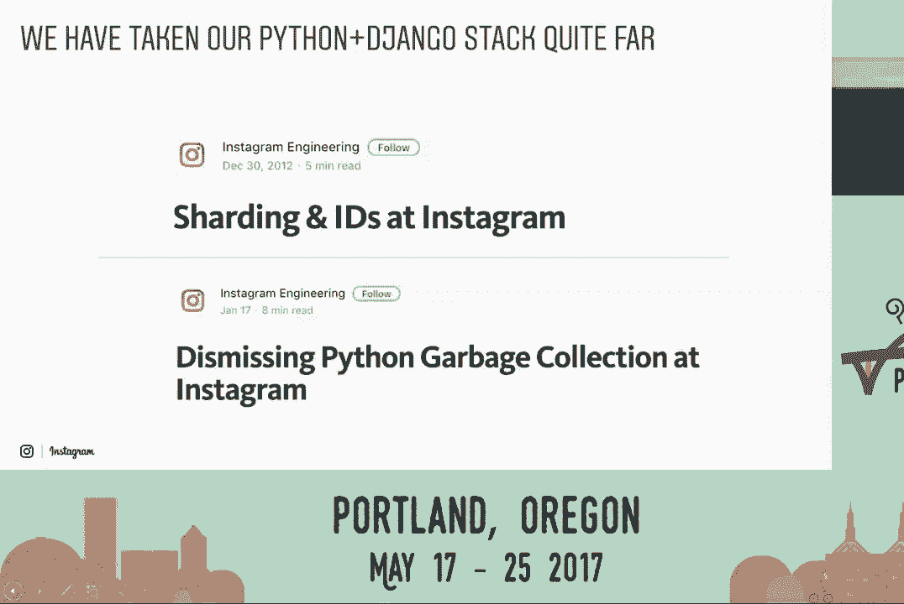

我们很乐意将 Instagram 扩展到尽可能多的感兴趣的用户。这是我们自己的卡尔·迈耶在年度 Django Underhood 大会上谈论扩展 Django。

但这不仅仅是这样。事实上，选择 Python 作为编程语言，帮助影响和塑造了 Instagram 的工程文化。我们倾向于使用经过验证的技术。我们的联合创始人迈克·克里格曾经说过，我们的用户并不在乎 Instagram 运行在什么数据库上。

他们确实不在乎 Instagram 是用什么语言开发的。Python 简单实用的特性，使我们的工程师和开发者能够专注于为用户和产品解决真正的问题，而不是被一些语言细节所困扰。但你可能会想，Python 仍然很慢。

对吧？如果你昨天在这里，你会知道 Python 在处理数百 PB 的天文数据时并不慢。如果你在进行高频交易或低级位操作时，可能会慢。但我们在 Instagram 相信，我们更大的瓶颈是开发者的速度。

不仅仅关注纯粹的代码速度。（观众鼓掌）所以我们的结论，虽然我们肯定有偏见，是你可以用 Python 在不担心框架和语言性能的情况下，获得几亿用户。现在。

这并不是说我们不关心扩展 Python。

在某个时刻，我们意识到，随着我们团队和产品的不断扩展，服务器的增长远远超过了用户的增长。随着我们继续增加更多工程师和推出更多产品，这种情况只会变得更糟。

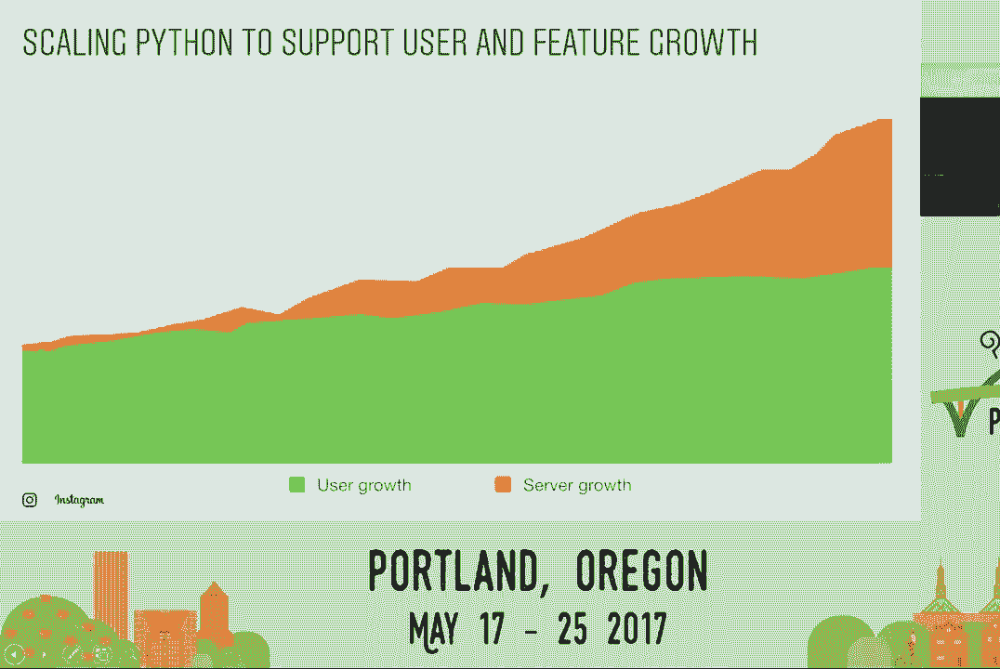

所以这是我们解决 Python 效率的策略。我们开始建立广泛的工具，以分析和理解我们的性能瓶颈。我们主动将关键但稳定的组件推向本地语言实现，如 C 和 C++，一个主要的例子就是 memcache 访问库。

我们还利用了科学化作为武器，显著提升我们的性能。我们的工程师之一，Alex Olaf，将在下午稍晚时分享这方面的内容。最后，随着我们开始寻找下一个 7 亿用户，我们将考虑一些更大的想法。

也许会让整个 Django 堆栈完全异步，或者编写一个新的 Python 运行时。所以我们意识到，我们面临许多挑战和机会。我们承诺将继续推动在 Instagram 上运行 Python 的边界。但有一个小问题。很长一段时间以来，像其他人一样，我们一直在使用 Python 2。

7 和 Django 1.3。没错。我们甚至在 2015 年的招聘人员也知道如何对潜在候选人说这件事。我们在代码库中还有一些小但复杂的补丁。我们心想，难道我们会永远停留在这个设置上吗？就好像我们没有足够的挑战一样。

经过多轮调查和讨论，我们最终决定将整个代码库升级到 Python 3。（观众鼓掌）对某些人来说，这是一种全新的编程语言。在经过一些努力后，今天我很高兴地宣布，Instagram 的整个 Django 网络服务和薪资工作队伍已经在运行 Python 3.6。

这已经持续了几个月了。（观众鼓掌）那么，发生了什么，我们是如何走到这一步的？有了这些，我将把时间交给我的同事 Lisa，让她告诉你们我们的 Python 3 之路。（观众鼓掌）- 谢谢你，V。没错，你听到了，Instagram 已经完全在运行 Python 3 几个月了。在接下来的讲座中。

我想倒回到一年前，和大家分享我们为什么转向 Python 3，达到这个目标所采取的步骤，解决的具体挑战，以及最终我们今天所处的位置。那么，谁刚才说 Python 运行得很好呢？

为什么要包裹船只？在去年的 Python 大会上，Grito 宣布 Python 2 的支持将在 2020 年结束。这次看起来真的要结束了。（观众笑）幸运的是，在那之前我们已经朝这个方向迈进。作为 Instagram 的基础设施团队，我们的使命是让 Instagram 在今天和明天都能继续运行。

所以我们总是在寻找未来可能出现的瓶颈。

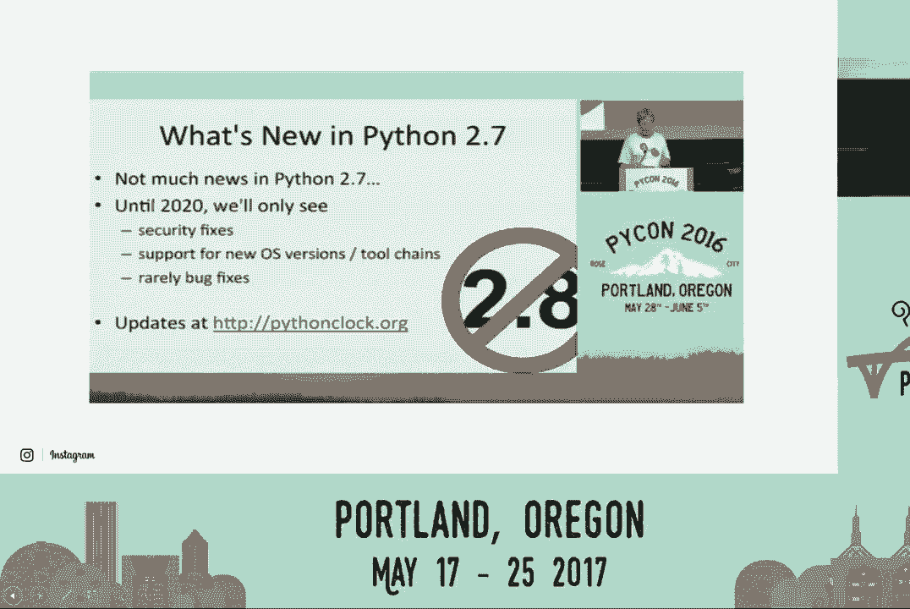

六个月、一年及更长时间。所以这是我们的一些动机。首先是开发速度。看看这个非常典型的 Python 方法，参数模糊，max ID。它可以是整数、字符串、元组。我们的开发人员实际上非常好，放了一段文档字符串。但这并不真正可扩展。只能尽力而为。

没有标准工具来强制执行类型。注释也很容易与代码本身不同步，甚至比没有注释更糟。在 Instagram，许多开发人员使用多种编程语言，包括 C++、Java，甚至 PHP 的现代形式 Hack 也支持类型。因此，这一直是我们产品工程师最重要的功能请求之一。

很高兴看到它在 Python 3 中标准化。第二个动机是为了提升我们的服务器性能。

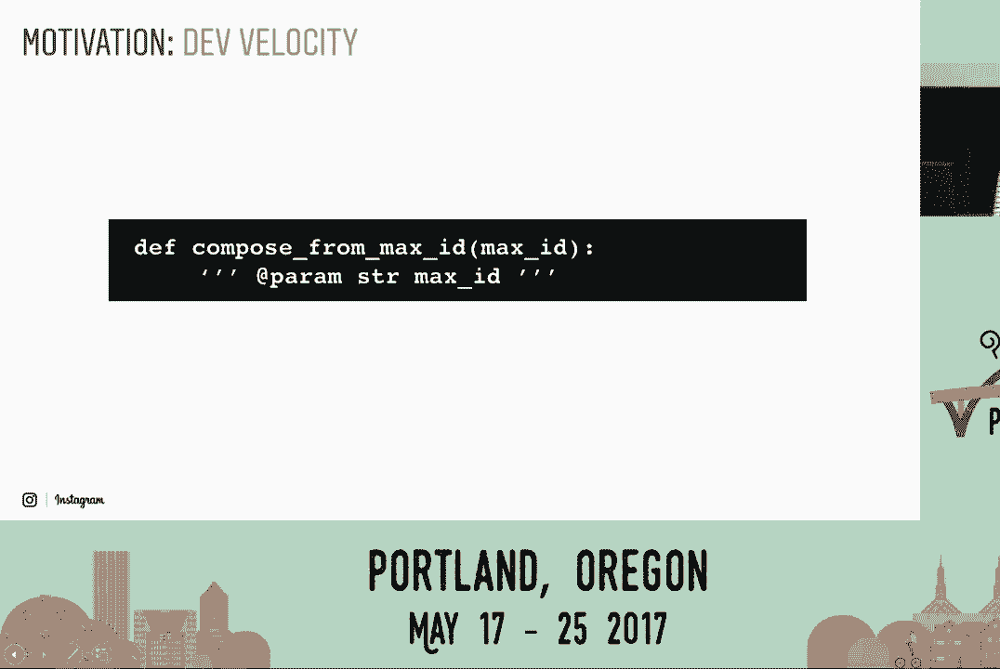

让我们首先高层次地看一下 Instagram 的构建模块。用户请求进入网络服务器，访问各种后端服务以检索信息。它也可能将一些任务调度到异步层执行，例如通知等。目前，我们拥有的最大层是网络。

以及我们运行 Python 的异步层。现在让我们聚焦在一台服务器上。在每台网络服务器上，我们运行 N 个进程，沿用 M 个 CPU 核心。每个进程一次只能处理一个请求。当进程在等待外部服务响应各种用户信息时，它无法在本地执行 CPU。因此，我们会将 M 配置得远远超过 M。

为了避免 CPU 饥饿。但是，进程越多也意味着每个进程的内存预算越少，以及更频繁的进程重启，这反过来又会导致更多的 CPU 消耗。在进程预热期间，N 的最佳数量将取决于 CPU 架构、当前用户工作负载和不断变化的代码库。这需要持续的调优。

为了实现最大服务器容量。如果我们可以有更少的进程，N 可能等于 M，但每个进程可以同时处理多个用户请求。当某些请求在等待外部网络响应时，我们可以执行其他请求，我们可以在 Django 上服务其他请求。Async。io 在这方面非常有前景。

帮助我们向前发展。我们很高兴看到它在 Python 3 中原生支持，而不是像 Python 2 中那样散乱的努力和不兼容的解决方案。第三个动机超越了 Instagram。Python 拥有一个非常活跃的开发社区，继续推动这门编程语言向前发展。

在各个方面，多亏了你们所有人，在这里做出出色的工作。但它只会继续在 Python 3 上进行，我们希望成为其中的一部分。正如我们所说的，多年来我们对旧版本的 Django 和 Python 进行了各种补丁，但这很难上游。因此，我们希望通过跟上进展来改变这一点。

随着这个软件的最新版本发布，我们可以更轻松地回馈社区。（观众鼓掌）所以这都是很好的动机。

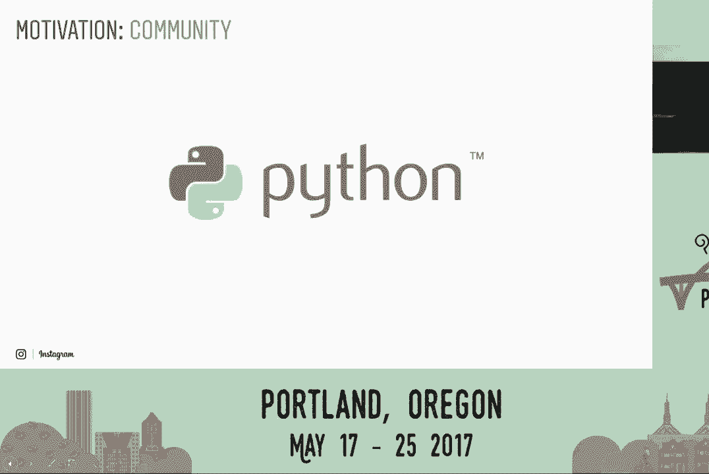

我们得到了继续推进项目的绿灯。让我们放下所有，专注于 Python 3。好吧，这不会发生，对吧？

所以我们有两个必须遵循的命令。第一，不能影响用户。升级不能有服务停机时间。第二，产品发布不能放慢。所以我们的产品工程师将继续发布更丰富的用户体验，同时我们在后台将堆栈迁移到 Python 3。我们如何做到这一点？好吧。

在我们查看几个考虑过的选项之前，先看看 Instagram 如何将代码发布到生产环境。Instagram 在主分支上开发代码，不使用分支。我们的开发理念是进行小而集中的差异化，即使对于大型特性和重构。在开发阶段。

更改会被检查到主分支上。通常在一个小时内，这些更改会被推送到生产环境。此时，这个特性可能对用户不可见，隐藏在一个受限的配置后面。当特性完全开发和测试完毕后，它不会立即上线。这样的提交在主分支上每天发生数十次。

部署在一天中持续进行。考虑到这一点，让我们看看一些我们考虑过的迁移选项。对于许多公司来说，第一个选项可能很明显。当你开发一个新特性时，你会切分支，进行开发，然后合并回去。这对我们来说并不太适用。

正如你在前面的幻灯片中看到的，我们每天在主分支上有大量的提交，而 Python 3 的更改与整个代码库实际上重叠。因此，分支同步的开销会很大，容易出错。此外，如果我们运行这个分支，与主分支长时间分叉。

如果我们还没有在生产环境中运行它，那么合并回去将是一个巨大的风险。如果只有少数开发人员在这个分支上工作，那么我们就失去了教育其他工程师的机会，而他们更乐意帮助迁移。所以这个选项被排除了。

接下来的观察是，我们在所有的 Web 服务器上运行相同的代码。任何 Web 服务器都可以处理任何请求。如果我们逐个端点进行转换，并创建一个单独的池来运行 Python 3，运行那些已经转换的端点，会怎样呢？

这对某些应用程序可能效果不错。例如在 Facebook，每个团队负责不同的二进制文件，他们可以按照自己的节奏进行迁移。这对我们来说并不太适用，因为我们只有一个二进制文件。我们的许多端点共享不断发展的公共模块。我们许多开发人员同时在多个端点上工作。

因此，它们在不同的 Python 版本之间都有上下文切换。管理不同的池也有开销，而且这些池不断缩小和扩大。因此，这个选项也不再可行。好吧，我刚提到的公共模块。假如我们将这些公共模块提取出来，做成微服务呢？

所以，当我们需要访问这些服务时，不再使用本地函数调用，而是直接进行远程过程调用，访问微服务。因此，这将需要大规模的代码重构，并且会导致更高的用户延迟，因为每个请求现在必须经过多个中心来访问这些微服务。

而且部署也比我们现在的要复杂得多。所以这个选项也不再可行。好吧，既然我们在通过小步骤交付大型变更方面非常擅长，我们决定遵循同样的做法，只需确保兼容，这样它就可以在 Python 2 和 Python 3 的虚拟环境下运行。

所以我们将在主干上进行小的更改，这些更改在生产仍在运行 Python 2 时是版本兼容的。当所有代码准备就绪时，我们将虚拟机切换到 Python 3，并祈祷。[笑声]实际上，我们做得比那更好。在 Python 3 期间，我们成功地没有引起头条新闻。

通过这些精心分阶段的迁移。因此，前两项主要工作是并行完成的，我们处理第三方包，并在我们的资源代码中进行大量兼容性更改。在这个阶段，我们所做的代码更改，不知道是否适用于 Python 3，因为我们没有运行它。

但我们知道它在 Python 2 中是有效的，因为代码已经在生产中运行。然后我们进行了为期两个月的密集且高效的单元测试修复，随后在生产中进行了缓慢而谨慎的推出。我将接下来更详细地介绍每个阶段。Instagram 一直在使用开源包。

自第一天起我们就能做到，并且继续这样做。因此，我们制定的第一条规则是，当你向我们的源代码中添加新的依赖项时，必须与 Python 版本兼容，以便我们停止在我们的代码库中引入更多仅支持 Python 2 的包。多年来，我们积累了一些不再使用的包。

所以现在是清理它们的时候了。此外，一些 Python 2 的包在 Python 3 中不再需要，因为它们得到了原生支持。所以也要删除它们。然后我们对包进行了多项升级。最大的一项是将 Django 从 1.3 升级到 1.8。这是必要的，因为 Django 1.3 不支持 Python 3。

但这也是一个早该进行的升级，正如我们所提到的。但因为我们在代码库中分散了很多依赖，使得其难以解开。直到现在，缺乏足够的激励来推动它的进展。通过这次升级，我们设法使 Django 代码库保持完好，最小化了我们代码库中自定义的更改。

这样未来的 Django 升级就不会太过昂贵。与此同时，我们使用现代化的工具对源代码进行大规模修改。我们会在多个文件中一次性进行一个修复，而不是一次只处理一个文件并在该文件上进行所有修复。

当代码审查者一次只关注一个修复时，代码审查过程会变得更简单。而这里是我们在修改过程中所做的更改。但正如你所想象的，在这个过程中，我们还在与产品工程师进行沟通，他们将继续提交闪亮的新功能。

但仍然会打破 Python 3 兼容性。而且直到我们实施单元测试之前，没有好的方法来捕捉这些错误并防止它们发生。我不想强调单元测试的诸多优点，但我想说，在我们的 Python 3 迁移中，它们尤其有帮助。通过单元测试，我们不需要外出寻找 Python 3 的问题，它们就在我们面前。

我们需要做的就是修复它们。这对开发者来说很简单。单元测试也容易重现，便于与修复进行迭代。许多并不拥有代码的工程师也能跳入并协助修复。因此在接下来的两个月里，我们基本上全力以赴，并在整个 Python 3 迁移中度过了我们最富有成效的两个月。

我提到过我们的提交将在合并到主分支后一个小时内发布到生产环境。我没有提到的是，每个提交都必须通过成千上万的单元测试，才能真正合并到主分支。在 Python 3 项目初期，仅有少数这些测试能在 Python 3 上通过。但我们不想让它们退步。

因此，我们添加了一个包含已知通过测试的列表，并将其纳入流程中。现在，每个合并到主分支的差异都必须通过 Python 2 和 Python 3 的测试。随着我们修复单元测试，列表越来越长，直到有意义地转向一个排除列表，将已知失败的测试放入其中。

在这一点上，任何人添加的新测试，无论是针对新功能还是现有功能，都必须默认兼容 Python 3。

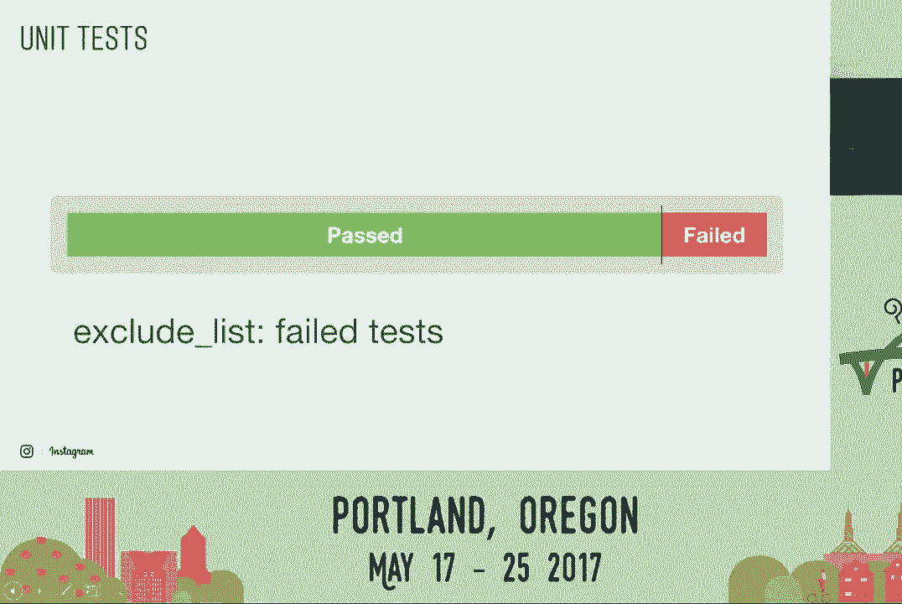

有了不错的测试覆盖率，我很高兴能在我的沙盒中展示我的 Instagram 动态。

这段代码运行 Python 3，能让我每天看猫视频。但这只是进入生产的一个非常小的步骤。

单元测试有其局限性。我们并未 100%覆盖。这是我的一个梦想。许多外部服务在测试和数据兼容性问题上存在模拟，这通常不会在读取和写入相同软件版本时的单元测试中显现。因此，现在是把 Python 3 推向现实世界的时候了。

通过将开发者沙箱切换到 Python 3。这是一个比单元测试面对的过程要慢得多且痛苦得多。因为这有点像剥洋葱。直到你修复外层的问题，你才会看到下一层的问题。但我们不断发现问题，修复它们并重新添加单元测试，应该在最初暴露的地方，并重复这个过程。

通过将沙箱切换到 Python 3，我们还确保任何正在开发新功能的人，从一开始就使功能兼容 Python 3。当开发者停止报告他们沙箱中的问题时，我们就将 Python 3 暴露给 Facebook 员工，他们使用的 Instagram 功能比开发者更广泛。

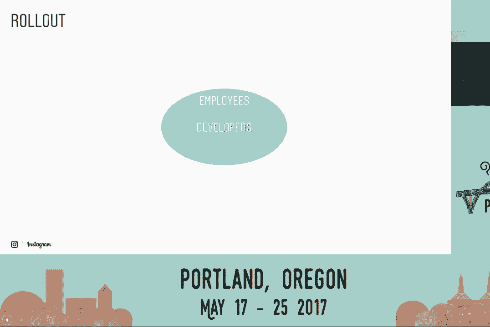

然后慢慢向我们越来越多的用户推出。这并不代表我们在每一个圈子上花费的时间。实际上，我们在外圈花费的时间越来越少。因为我们在开发者和员工测试阶段找到了并修复了大多数问题。

在用户推出阶段，我们更多地关注性能调优。那么我们在单元测试和开发者测试中具体做了哪些改变？

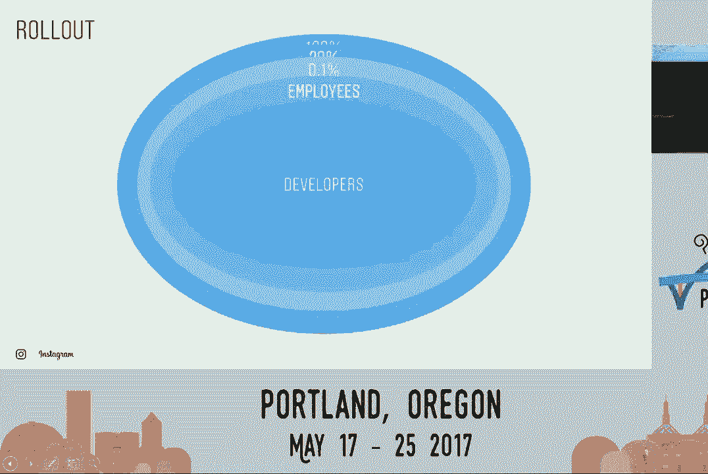

这太多了，无法一一列举。而且大部分对大家来说都相当无聊。所以我将列举一些能够捕捉到我们遇到的主要问题类别的示例。首先，我粗略地使用 Unicode 来指代与字符串相关的 Unicode 字符串问题。

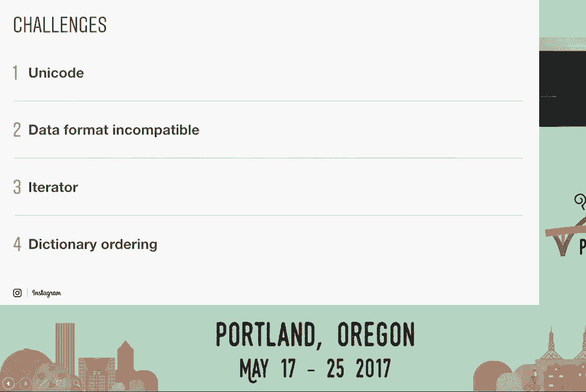

在 Python 3 迁移项目的开始，大多数人基本上会在每个源文件的顶部添加这四行代码。我们决定跳过最后两行，因为它们会对 Python 2 造成微妙的行为差异。根据我们的指令，我们需要保持 Python 2 完全安全，并在对 Python 3 进行显式更改时出错。

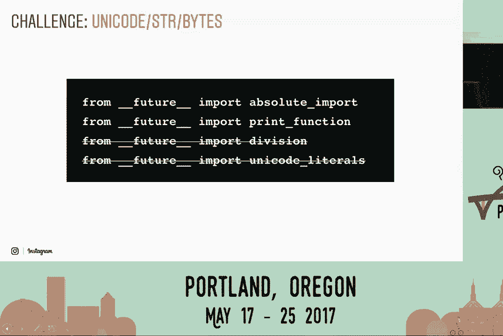

所以 Unicode 是我们代码库中存在的最常见问题。这只是一个典型例子。我们用一个应该是字节字符串的字符串创建了一个新的 HMAC 对象，这会产生 Python 3 的异常。

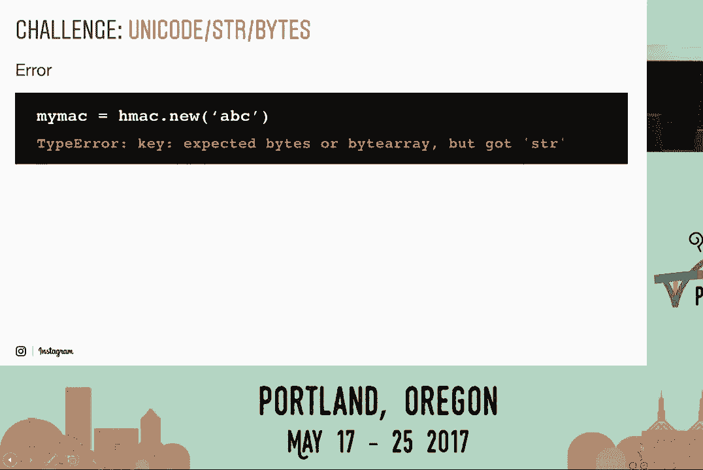

修复的办法是在创建对象之前将字符串转换为字节字符串。这有点冗长，但更重要的是，开发者必须思考，“我在运行 Python 2 吗？”

我应该对我的 Python 3 进行解码和编码吗？经过一段时间后解码和编码你会脑袋疼。因此，我们创建了多个辅助函数，函数名即其目的。

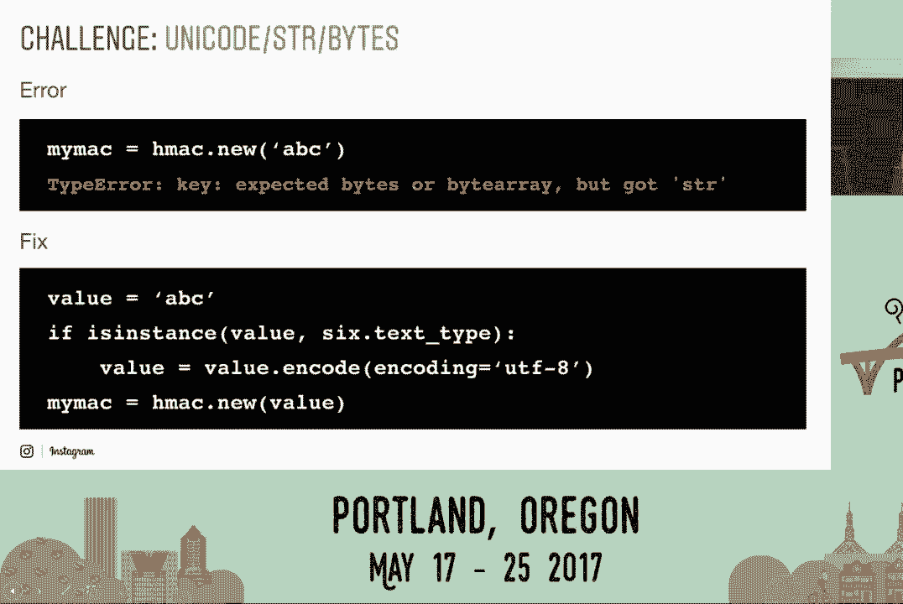

所以理解它的目的更容易，而不是我们到达目的的机制。

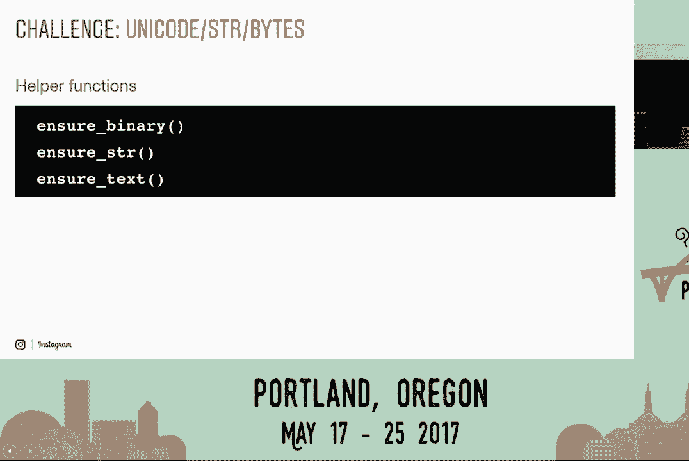

修复的代码看起来是这样的。它更简洁，也更容易理解。上次我检查时，我们有超过 500 个使用这些辅助函数的案例，因此它们在提高 Python 3 项目的生产力方面非常有帮助。

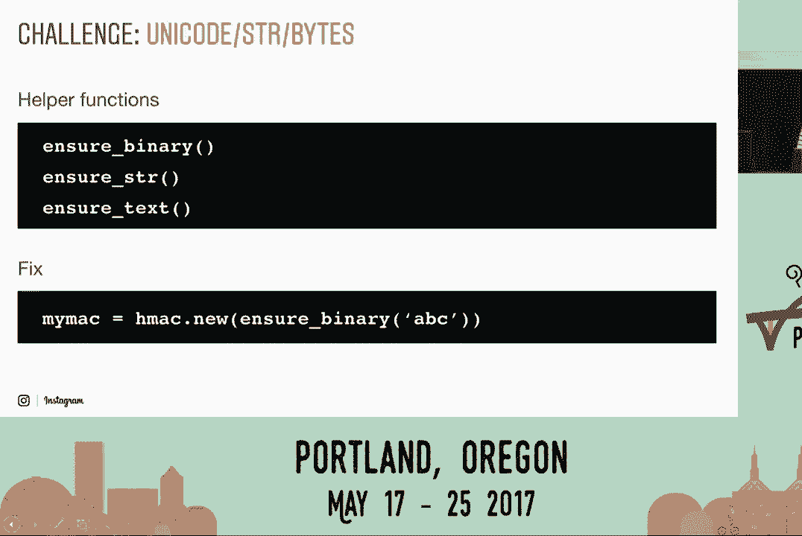

下一个大挑战是数据兼容性问题，尤其是与 pickle 相关的问题。我们使用 pickle，其中一个使用案例是将数据存储在 memcache 中。我们使用最高协议来封装数据。因此，当我将自己的沙盒转换为 Python 3 并尝试访问我的整个数据流时。

我的同事开始抱怨在你自己的沙盒中发生的异常。结果发现，Python 3 中的最高协议是 4，而 Python 2 中的最高协议是 2。哦，没问题。这个简单的修复是硬编码为 2，这是一个共同的基准。

来自网络背景，如果你在讲 IPv4 或者我在讲 IPv4，我们就可以通信。如果我用 Python 2 写一个简单的字典，包含一个 Unicode 值。我会在 Python 3 解码时遇到异常。反之亦然，如果我在 Python 3 中编码相同的数据，那么在 Python 2 中的解码结果与原始数据不同。

这对我们来说是坏消息，因为我们在多个地方使用 pickle 来在不同实体之间交换信息。因此我们查看了几种不同的选择。Thrift 在 Facebook 中广泛用于不同实体之间的序列化和反序列化，并具有很好的向后兼容性支持。

这确实会增加更高的模式定义开销以及编码解码成本。另一方面，消息打包在性能方面对简单使用的 API 的序列化非常友好。但它缺乏对所有类型数据的通用支持。最后，我们查看了每一个 pickle 的使用案例，并不得不为每个案例提出不同的解决方案。

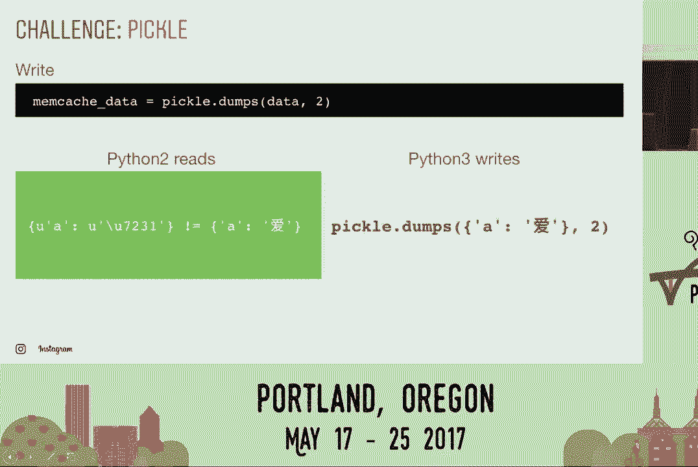

对于 memcache，我们决定将键空间分成两个。因此在这种情况下，Python 2 和 Python 3 之间不会相互通信。

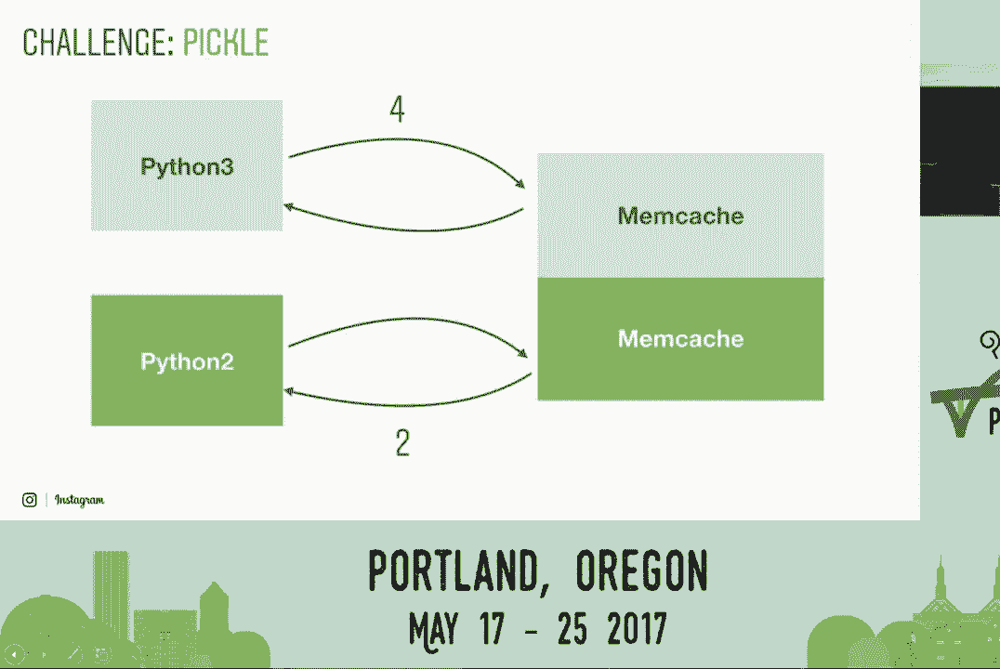

接下来是迭代器。在 Python 3 中，一些以前返回列表的方法现在变成了迭代器，例如这些。性能上很棒，因为当你不需要组成一个新的列表时，性能更好。但这也产生了微妙的行为差异。当你遍历一个迭代器并消费这些元素时，它们会从迭代器中消失。

所以你实际上只能使用迭代器一次。这里的例子正好说明了这一点。

正如你所知，我们使用 Python 来优化我们的运行时性能。但 Python 文件需要预编译。因此，这是执行该操作的脚本的一部分。第一行有一个待编译的 Python 文件列表。第二行将它们映射到一个特定的类实例，这在这个过程中对我们很有帮助。第三行检查这些文件中是否还有未编译的文件，而第四行创建了一个待处理的文件列表以进行处理。

虽然在 Python 2 中运行良好，但当我们转换到 Python 3 时，我们发现第一个文件从未被编译。为什么会这样？

这是因为第二行的 `map` 函数现在变成了一个迭代器。所以当我们在第三行检查文件是否未编译时，它至少消耗了迭代器中的第一个文件。而第四行的构建中从来没有 `.pyx` 文件。所以修复方法很简单。你只需将 `map` 转换回列表。好的。

像这样的错误可能很难发现。如果我信息流顶部应该出现的图片根本没有显示，那么找到问题将需要一段时间。但对于其他问题，这可能会更严重。因此，当你转换你的 Python 3 项目时，始终运行 `futurize` 或 `modernize` 工具，并将所有的迭代器转换回 Python 3 的列表。

然后你可以查看差异，看看如果你没有多次使用迭代器，哪里可以优化。

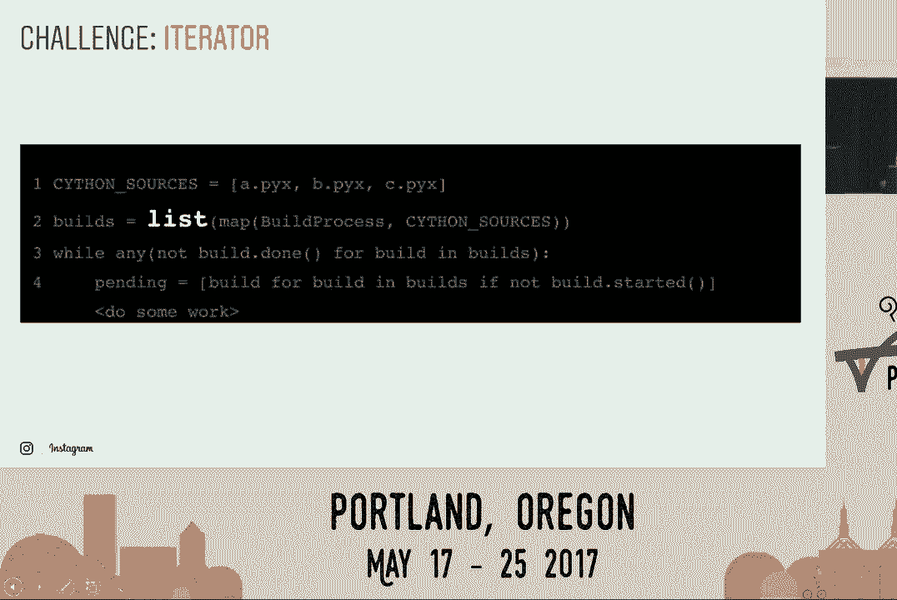

最后一个问题并不特别针对 Python 3。但在你转换到 Python 3 时，你很可能会遇到这个问题。所以这是一个简单的字典，键为 A、B、C。你认为 JSON 转储的输出是什么？好吧。这会根据 Python 版本以及同一 Python 版本的不同运行而有所不同。所以如果你的应用程序确实依赖于 JSON 输出的顺序。

然后你需要明确指出。我们在根据 JSON 输出确定配置是否已更改时，遭遇了严重的性能回退。我们花了一段时间才找到这个问题，所以在调试一些棘手的问题时请记住这一点。

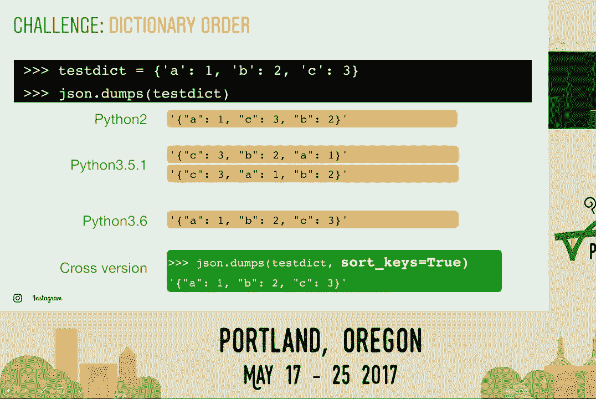

好吧，经过这些修复以及其他许多修复，我们准备好开始了。但有一件事仍然困扰着我们，性能。在 Instagram，我们使用两个指标来衡量网络效率。第一个是每个请求的 CPU 指令，越少越好。第二个是服务器可以支持的最大请求数每秒。

越多越好。通常，这两个指标是相关的。因此，当我们很高兴地看到第一个指标下降了 12%，这在我们的情况下是一个改进时，我们期待看到第二个指标也有 12% 的改善。但我们没有。发生了什么？我们知道内存配置会对第二个指标产生影响。

那我们有不同的内存配置吗？我们知道并没有。我们使用 `Ewiskey.ini` 来配置它。

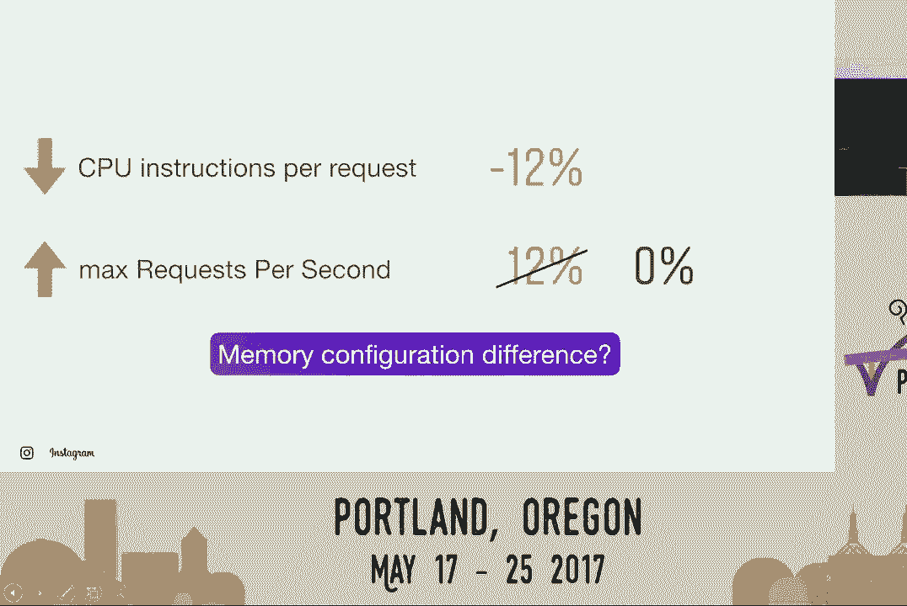

这是检查配置的代码。那么为什么条件在 Python 3 中没有满足呢？

这是 unicote，但它持续到最后。因此，这是我们整个代码库中最重要的一封信，带来了 12%的容量差异。

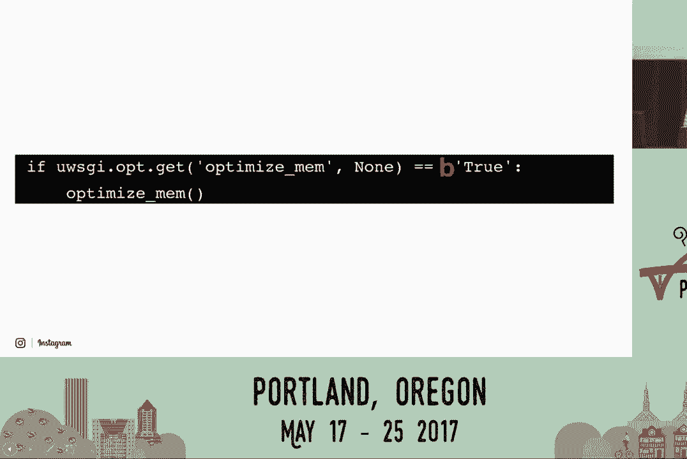

最后，在 2017 年 2 月，我们将 Python 3 到 2 的流量降低到零，并迁移到了 Python 3.5。在接下来的几个月里，我们又向前推进到了 Python 3.6。我们得到了什么？

我们有过——谢谢大家。[掌声]，我们在 Django 层面实现了 12%的 CPU 提升，在内存的薪资层面节省了 30%。那么一开始的要求呢？没有拖慢产品发布的速度。在这个 Python 迁移过程中，我们的月活跃用户增长速度加快了。

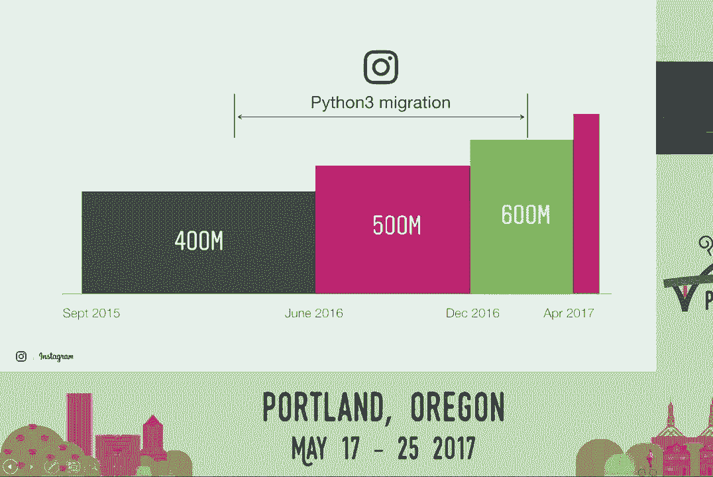

我们还看到了前所未有的功能发布数量，包括实时故事和许多安全功能。

回到我们最初迁移到 Python 3 的动机，我们的早期采用者已经将 2%的功能迁移到了带有类型提示的版本。我们正在开发工具来收集生产中的数据，以帮助启动类型提示的过程。我们还对 MIPI 和类型聊天做出了一些贡献。关于 async。io 的朋友们。

我们在各个终端加速了 async。io 的采用，将用户请求延迟减少了 30%到 40%。我们还在开发工具，以帮助我们更容易地理解和调试 async。io 问题。我们尚未在一个进程内支持多个请求。这是我们期待很快探索的内容。

关于与英特尔合作对网络工作负载进行基准测试的社区朋友们，以便 Python 性能工程师可以将其作为度量参考。我们也在寻找各种运行时优化机会以及内存分析的努力。

总结一下，Python 3 的努力为我们带来了超出预期的性能提升，提高了开发者的生产力，并为我们未来几年的增长奠定了坚实的基础。这是可行的。这是值得的。让它发生。让 Python 3 变得更好。谢谢大家。[掌声]。

非常非常感谢。这真是令人着迷。

