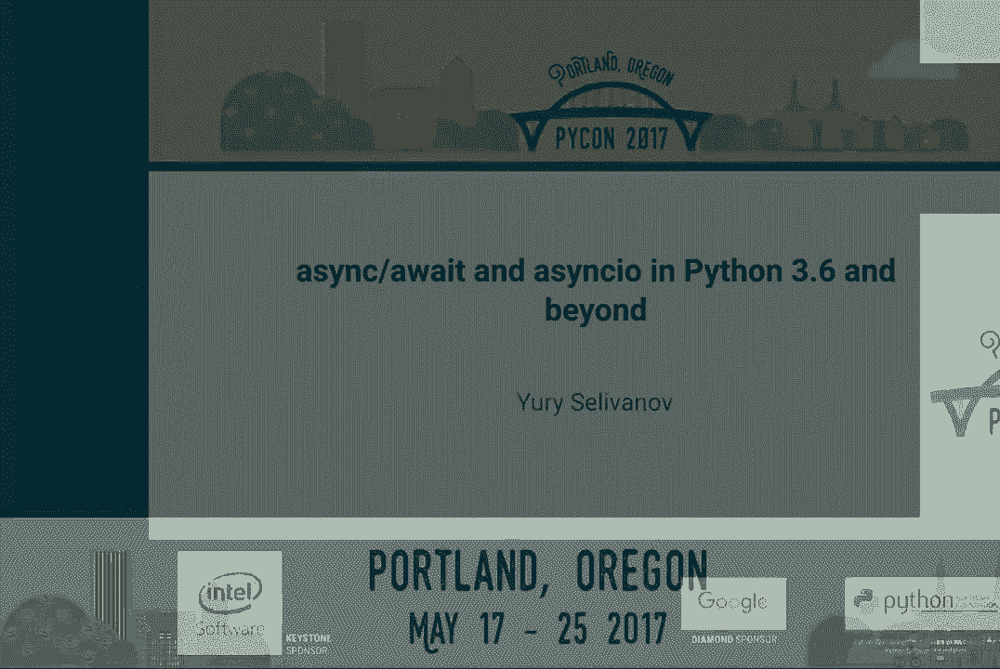
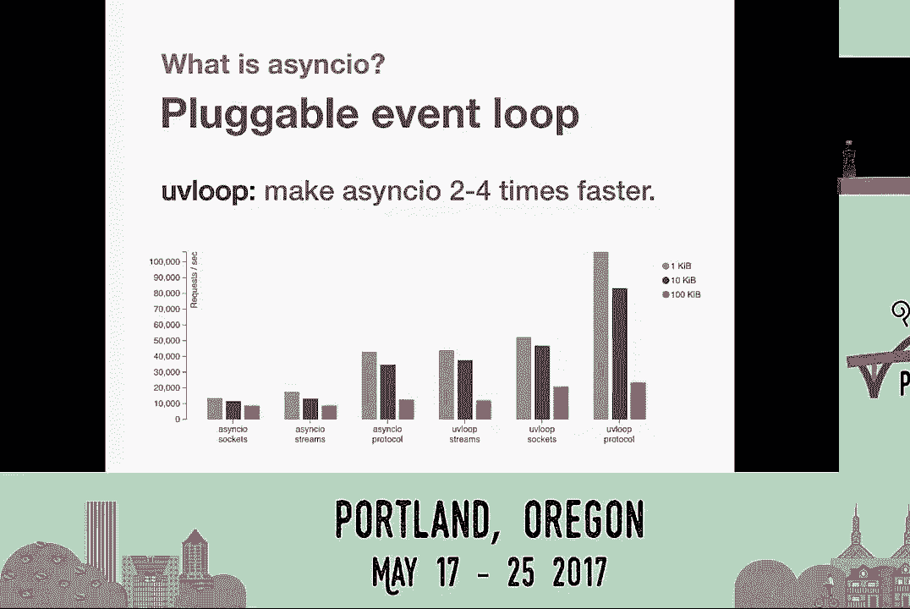
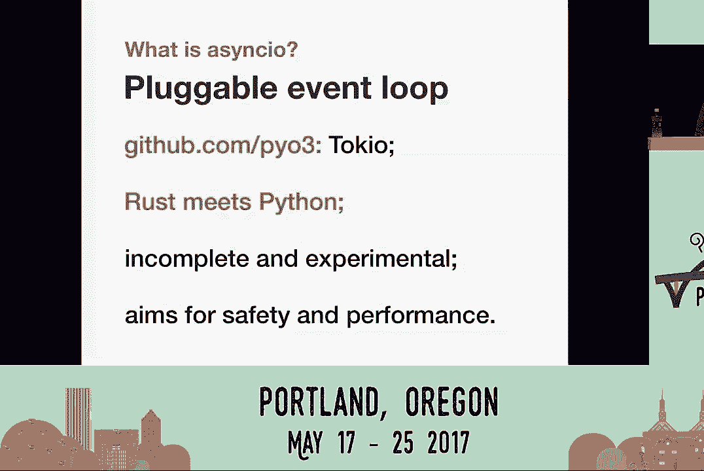
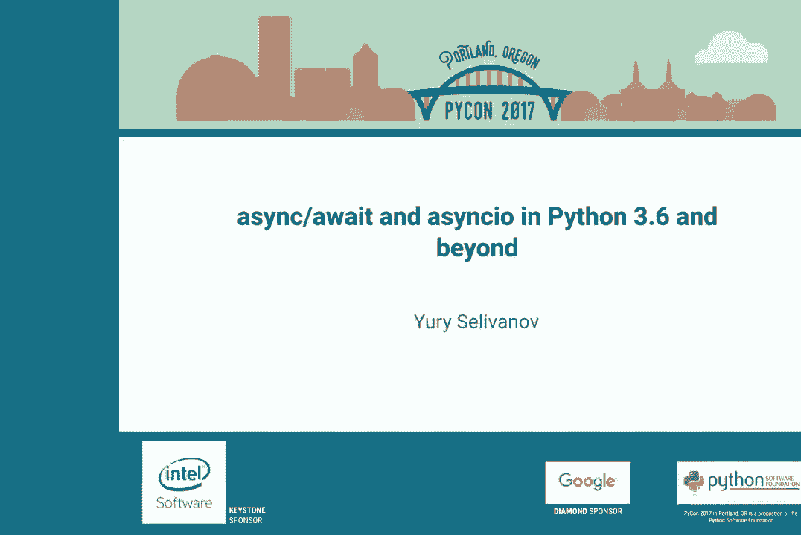

# P3：Yury Selivanov async await 和 asyncio 在 Python 3.6 及以后的 PyCon 2017 - 哒哒哒儿尔 - BV1Ms411H7jG

\>\> 大家下午好。欢迎来到 2017 年 PyCon 的这个环节。在开始之前，我想鼓励每一个有发声设备的人，请和它聊聊，要求它安静。因为当它发声时，所有人都会盯着你，有些人可能会在 Twitter 上对你不友好。说完这个。

我想介绍我们的下一位演讲者。

他的名字是 Yuri Salivanov，他将讨论 async 和 await 以及 async IO。

请欢迎他。[掌声]，\>\> 嗨，我是 Yuri Salivanov。我来自加拿大多伦多。今天我们将讨论 Python 3.6 及以后的 async await 和 async IO。欢迎在 Twitter 上关注我，或通过 yy@magic.io 与我联系。

简单介绍一下我。我是核心开发人员，自 2013 年起工作。主要在多个 PEP 上工作，尤其是关于 async 和 await。我维护异步 IO、UV 循环和 async/pg。我在 magic stack 工作，可以查看我们的网站 magic.io。我们与 Python 做了很多事情，既为 Python 服务，有时也涉及 Python。非常有趣。那么我们来谈谈 async/await。

第一个问题是我们为什么会有它？因为有很多其他方法可以实现并发。例如，你可以使用线程，或者使用回调和承诺，或者使用 G 事件，或事件驱动，或无栈 Python，或许你可以只用带有 yield from 语法的生成器。而答案是可读性。

可以说它比回调或承诺要好。我认为任何尝试调试或重构大量嵌套回调的 JavaScript 或旧 Python 代码的人都可以证明这一点。处理 async/await 代码更容易。你可以清晰地看到代码中所有可以为 IO 或其他内容切换上下文的显式点。它实际上促进了更好的模式，如消息传递，而不是使用全局共享。

数据结构。因为无论你对编写多线程代码的能力有什么看法，你最终都会遇到右侧的情况。还有其他原因吗？效率。由于 Python 中有一个小问题叫做 GIL，线程并不总是解决方案。但即使在没有 GIL 的语言如 C#中，我们仍然有 async/await。为什么？

因为线程是一种系统资源，你无法拥有无限数量的线程。所以使用 async，你可以处理成千上万、甚至有时数百万个开放的、长时间存在的服务器连接。总之，什么是 async/await？显然这是一种语法。我们在 Python 3.5 中首次添加了它们，并添加了定义协程或异步函数的语法。

用于异步上下文的语法，管理器，异步迭代器。显然还有一个权重表达式。在 3.6 中，我们进一步发展。现在我们有异步生成器，异步列表推导，甚至异步生成器表达式。我可以说，目前我们几乎覆盖了你能做的所有事情。

Python 同步模式。你可以使用 async/await 来实现，除了一个例外，那就是 yield from。用于异步生成器的 yield from。我们可能会在 3.7 中添加 yield from 的语法，但这不是优先事项。我会诚实地告诉你。async/await 还有什么？它是一种协议。常见的误解是，async/await 是专门为 async/aw 或仅创建的。

async/await 可以使用它。这不是真的。在内部，async/await 基于迭代器协议，我们有一系列魔法方法，比如 dunderawait，它允许你使对象可等待或在权重表达式中使用它们。我们有魔法方法来定义和创建异步迭代器和异步上下文。

管理器。这是相当通用的。你完全可以为 async/await 编写自己的框架，但你可能不应该。这需要大量的工作，当然，除非你想实验。因此，如果你看看现代 async/await 应用程序，会有一个堆栈。底部当然是操作系统。

然后我们有 Python 解释器，接着是 async/框架。也许是 Tornado、Twisted、Trio。Trio，或者也许是 async/aw。然后我们有应用程序框架。也许是 HTTP 或 Sennick 或其他东西，Django，Flask，如果它们有异步版本。只有在那之后你才有你的应用程序。那么我们有哪些框架？

好处是 Twisted 和 Tornado 今天可以使用 async/await 语法。Twisted 实际上是 async 和 Python 的一个模型。许多都起源于 Twisted。我认为现在没有人知道 Twisted 的所有内容。但它现在可以使用 async/await。而且 Twisted 和 Tornado 都有庞大的生态系统。也许更重要的是。

它们拥有很大的市场份额。因此，在 Stack Overflow 上有很多问题，有时也有答案。（笑声），Tornado 今天以及很快的 Twisted，也许明天，将能够在 async/await 之上运行。这意味着你可以在 Tornado 代码中调用 async/await 库。或者也许很快在 Twisted 代码中。或者也许你能够在你的 async/await 代码中使用我们有很多的 Twisted 库。

所以这相当不错。我们还有 curiantrillo。这是博客上的两个新键。两者都尝试探索新方法。两者都试图使 async 更容易，有时也更安全使用。当然，如果他们发现一些新的或有用的模式或好的想法，我们会。偷走它们并放入 async/await。这是我可以保证的。两者尚未主流。

Curio 已经存在一年半了。Trio 则几个月。这些都是非常好的项目，我真的鼓励你去看看它们，并探索它们内部的实现。这是关于如何进行 async 或可以进行 async 的一个相当有趣的视角。

但还不是主流。无论如何，让我们谈谈 async/await。

那么什么是 async/await？ async/await 首先是一种基础。它定义了低级 API 和高级 async/await API。它将持续存在，并且具有可插拔的事件循环。那么那些低级 API 是什么呢？当然是用于调度回调的东西，用于编写带有传输的协议，网络，进程，处理唯一信号。

所有基于回调，所有都是非常低级的。但这实际上是一个好事，因为它使我们能够与其他用 C、C++ 等语言编写的低级代码集成。除此之外，它还有 async/await 来运行协程，以及进行流和套接字的网络编程，调用子进程，使用日志（如果你喜欢死日志），超时，安装。

所有在 async/await 中处理的内容。它拥有所有工具。它已成为主流。从 Python 3.6 开始，它不再是临时的。它已包含在标准库中。这是核心开发社区和 Python 社区的承诺，async/await 是一个安全的基础，可以依赖。它有一个健康的生态系统。令人惊讶的是。

目前我们有一些框架来处理 HTTP 和 Python，还有许多其他框架。我们有像 async/pidg 这样的数据库库，我们有 MySQL、AO MySQL 和 radius 的支持。memcache/d，几乎所有都得到支持。我们在 GitHub 上有一系列库和 AO libs 组织。所以我想说，我们系统的每个主要组件都有某种 async/await。

围绕它的库。它有一个可插拔的事件循环。这是 async/await 最初设想的内容。这使得 async/await 可以与 Twisted 或 Tornado 等框架集成，但它也赋予我们切换事件循环并进行一些有趣操作的能力，比如。

让它更快。因此有一个名为 UV loop 的项目，它有这个承诺或想法，让 async/await 在时间上更快。在微基准测试中它确实如此。但在实际生产代码中看到 15%，20%，30%，甚至某种情况下 50% 的速度提升并不令人惊讶。所以如果你之前没有见过 UV loop 或者没有尝试过，一定要试试。

我会说，在这个时候它是稳定的，适合在生产环境中使用。

所以尝试一下。这里还有其他内容。我们称之为 Pythonium 3X 网站。这是我们大约一个月前创建的新 GitHub 组。它探索将 Rust 带入 Python 的方法。

所以我们回到这个可插拔事件循环的想法。如果我们可以有一个用 Rust 编写的事件循环和 async/await 循环，这样 async/await 就能成为 Python 世界与 Rust 世界之间的桥梁？如果你可以在 Python 中以超时和取消的方式调用一个用 Rust 实现的质量怎么办？如果你可以有一个用 Rust 实现的 HTTP 服务器或某种协议，并且可以被使用呢？

在你的高级代码中？所以这是一个尝试探索这个问题的项目。它还未完成。我认为它目前实现了大部分 async/await API，但仍然不完整，仍在实验中。现在它的速度不如 UV 循环，但它会赶上。而我们实际上希望关注的一件事是安全性。

因为 UV 循环和许多其他加速器是用 Python 和 C 编写的，有时你会发现 segfault，有时你会发现错误。使用 Rust，你根本没有这种问题，并且性能优越。而 Rust 就是这个新的闪亮的东西。它是每个人的最爱语言。你不知道自己知道了什么。所以它真的很酷。

我对这个新事物真的抱有很高的期望。

所以一定要查看一下。它在 GitHub Live 上。接下来我们谈谈 async/await 会发生什么。async/await 将会怎样？

我们有一些目标。我们对 Python 3.7 有一些目标。实际上，我们想确保的第一件事是能够在 async/await 中运行和使用 twisted 代码。对此有一些阻碍，但我认为我们在 3.6 中解决了这些问题。无论如何，对于 3.7，这是我们想做的事情之一。

我们想确保为镊子开发的所有内容都能得到充分利用。我们有很多优秀的代码可以在 async/await 中使用。另一个问题是，curio 和 trio 是否可以在 async/await 之上构建或重建。也许这将让我们因为用户基础的增加而修复 async/await 中的错误。

我们将能够在 async/await 和 curio/code 或 trio/code 之间实现兼容。这是值得探索的事情。因此，这也是另一个目标，看看我们是否有足够的 API，或者我们的 API 是否足够灵活。以在 async/await 之上实现新的框架，新的 async/await 框架。还有信任循环。所以我们现在在东京有一些问题。例如。

现在，任务或隔离与 Rust 完全兼容 Python 代码真的很困难。有一些底层细节。可以绕过这些问题，但我们绝对希望在 3.7 中确保这一点很简单。所以，也许如果你正在编写下一个事件循环，我不知道，在纯汇编中，你。

将能够与 async/await 轻松集成。我们希望在 Python 3.7 中关注的另一件事是提高可用性，特别是。解决文档问题。async/await 的文档非常庞大。我会说，这真的很难跟随。它过于关注底层细节。

与其教人们如何使用 async/await，或者如何以最佳方式使用它，如何用 async/await 维护代码库，或者如何以最佳方式为 async/await 编写框架和协议，不如直接上手。顺便提一下，原始文档是由 Victor Steiner 编写的，我认为他应得这个荣誉。

这要给他一些功劳，因为他是单枪匹马完成的。当 async/await 还没有像现在这样受欢迎时，他重新完成了所有工作。我觉得我们有些掉链子，没有更新它，也没有真正维护它。所以，对于 3.7，这是我们的首要任务之一，就是修复文档，使 async/await。

易于学习，添加一些教程。因此我们会专注于这一点。当然，如果你们想要帮助，欢迎这样做。现在，这是一个有趣的话题。这些是你——如果你了解这些函数，你几乎可以编写任何 async/await 程序。这都是关于 async/await 的。

还有一些，但不是特别重要。如果你理解这些函数是如何工作的，你就能做到。

但是如果你——它就不起作用。

如果你查看它们，你会发现一些函数前面带有 async/await，而另一些函数前面带有 loop。这是 async/await 的另一个微妙问题，也可能是文档问题。其核心思想是，async/await 程序总是尝试在你的程序中显式传递事件循环。因此你始终需要携带事件循环对象。没有它，你无法执行某些操作。

因此，async/await 本身、所有的 async/await 单元测试，以及许多 async/await 包，都接受 loop 参数。它们会期望你传递这个参数。这确实有点不够理想。但在 Python 3.6 中，我们修复了获取事件循环的方法。现在它的行为是确定性的。每当你从 async/await 代码中调用它时，它总会返回正确的事件循环。

所以我们的想法是，你可以拥有你高层次的、漂亮的 async/await API。每当你需要在实现中进入底层时，你总是可以获取这个事件循环。但是你不需要用户将这个事件循环传递给你。因此，从现在开始，我们开始鼓励人们在设计 API 时不需要考虑。

明确的事件循环是很重要的。但是对于 3.7，我们需要修复许多 API，并添加新的 API，以促进这种模式，使得高层次的 async/await 程序根本不需要关心事件循环。这是一个底层细节。不要去思考它。也不要为此烦恼。我们还需要做——我们也希望添加新内容。其中之一就是启动 TLS。

有些协议开始时是明文传输，但随后它们突然需要升级并变得安全，需要启动 TLS。Armandronica 也非常频繁地请求添加调用和传递上下文 API。也许他想重新实现 Flask 或其他什么，但实际上这是一个相当严肃的事情。这对于大型应用程序来说是一个相当严重的问题。

如果你有数千行代码或数十万行代码，有时在某个深处你会意识到，哦，我需要更多的上下文。也许我需要当前请求对象，或者我需要当前主机或端口，以便进行日志记录或其他类似的事情。没有重写所有代码，你几乎无法做到这一点。你不能使用本地对象，因为它们与异步的工作方式不兼容。

你不能使用全局变量，因为它是一个共享状态。所以这真的很难。最后一个主要任务之一是添加 async.reple，以便你可以直接输入 Python -m async.io，或者可能只是 Python，并用其原生语法进行实验和玩耍，这样你可以随意编写一些代码，它会为你完成。总的来说，我们需要你的帮助。

请求新特性。你可以使用 bugs Python 来处理 bug 请求和报告，但你也可以用它来请求新特性。你还有 Python 工具的邮件列表。Tool if 是 async.io 的原名，但它仍然相当活跃。Gwidderez 对此做出了很多贡献，帮助了许多人。许多其他的异步开发者也在阅读它。此外，还有 GitHub 上的内容。

C Python 完全迁移到了 GitHub，现在一切都在 GitHub 上进行。你可以提交拉取请求。这简单多了。这次迁移的整个想法是让更多人参与 C Python 的开发，以及 async.io 的开发。所以，伙计们，帮帮我们。我认为 async.io 有一个非常光明的未来，特别是在与 Rust 集成方面。这可能使我们在不久的将来能够做更多的事情。

就这样。如果你们有任何问题，我很乐意回答。谢谢你。谢谢你，Yuri。如果有人有问题，请到走道上的麦克风前来提问。你介意将 async.io 的基础设施与其他语言中可用的进行比较吗？比如，众所周知，JavaScript 有 Promise，现在也有 Senka wait，C#也是。就像在一个高层次上。

只是想了解一下它们大致上是否在做相同的事情，或者不同语言之间是否有差异，因为所有语言似乎都在向至少拥有 Senka wait 的方向发展。但背后的实现可能并不完全相同。是的，它们并不完全相同。但确实有区别。

这个想法几乎是相同的。我会说，Python 在 async.io 和 async.io 方面面临的一个问题是，语言本身最初设计为一个同步的东西。所以很多 API 实际上可能会阻塞。因此，我们需要在 Python 中特别研究的一个想法是，找出你的应用程序在进行异步时是否正在进行一些阻塞系统调用。

除此之外，我会说 Python 的 async.io wait 实现与 JavaScript 中的实现非常相似。如果你知道如何在 JavaScript 中使用它，你就知道如何在 Python 中使用它。举例来说，这种上下文共享、上下文对象的想法，部分来自于 C#，他们为 async.io 代码解决了这个问题。

所以这是我们可以从其他语言中借鉴好主意并编辑到 Python 的地方。在很多方面，Python 对 async.io wait 的支持优于任何其他语言。我认为除了 Python 之外，没有很多语言或任何语言拥有异步上下文管理器或异步生成器。起码最初是一个拷贝。

async 和来自 C#的 wait 表达式，但我们增加了很多，使其变得更有用。>> 我在想，我想大概有两个问题。一个，为什么如果 UV 循环比 async.io 的快这么多，它不是标准循环？然后，是否有任何改善启动循环和注册你自己的步骤的努力？

函数以及从用户的角度来看，一切似乎都很繁琐？

那里有没有任何提高可用性的努力呢？

>> 第一个问题是为什么你会觉得循环更快？>> 或者为什么它不是 async.io 的默认循环？

>> 你将循环使用 libv。Libv 是底层库。最初为 null.js 开发。它是一个庞大的依赖项。它是一个大型库。代码量很大。我们不需要 Python 依赖这个库，尤其是安装 UV 循环是多么简单。从一开始就设想这样的事情是可能的。

所以我想在这一时间点，没什么动力去给 Python 添加很多低级 SQL。async.io 的核心功能目前是纯 Python。相对容易阅读和修复。所以这并不是个大问题。至于第二个问题，是的，具体来说我们想添加两个高级函数，async.io。

run 和 async.io 永远运行。第一个会接受一个查询并直接运行。这就像一个简单 async.io 应用程序的入口点。如果你有一个复杂的 async.io 应用程序，它产生很多服务和子进程，你就必须一致地最终确定和清理 async.io 程序的状态。

你将有第二种方法，它实际上接受异步生成器或异步复杂管理器。所以这个想法是你以一致的异步方式进入你的异步状态，并且你可以以一致的异步方式清理你的状态。创建循环、清理资源、打印调试信息的整个机制。

这个功能可以处理。但是，是的，我们认识到这个问题，目前启动一个 async。io 应用程序的过程确实很繁琐。所以，是的，我们有一些解决方案。我将很快开始撰写一个针对 Python 3。7 的 PEP。我的计划是有一个 PEP，并在 GitHub 上发布一个库，我们称之为 aio，next，或 aio。

额外的或者类似的东西，原型制作这些东西，以便你们可以开始使用它们，并在这些内容引入 Python 3。7 之前给我们一些反馈。>> 我对 Py03 感到好奇。这更多是关于在你的名单中加入一些 Python，还是将一些 Rust 融入你的 Python，还是仅仅简化它们？实际的 Py03，Py03 库的用例是什么？>> 是的。

用例首先是启用这种集成，因为我们有 C Python Rust 绑定。这使你可以轻松创建 Rust 代码到 Python 代码的绑定。但现在没有办法拥有一个 API，一个异步版本的 API。它对 async。io 和异步一无所知，也对 Rust 一无所知。所以 async。

io 可以在这里作为桥梁。另一件事是性能，因为是的，你可以用 Rust 编写一个低级的，比如 HTTP 解析库或低级的 Postgres 驱动程序。这将是非常高效的，而且可能比用 C 编写的类似代码更安全。所以这个想法是使在 Python 中以异步方式重用现有 Rust 代码变得更容易。

>> 谢谢。如果有人还有问题，我们还有时间问一两个问题。非常感谢你，尤里。

>> 谢谢。[ 掌声 ]。

[ 静默 ]。

