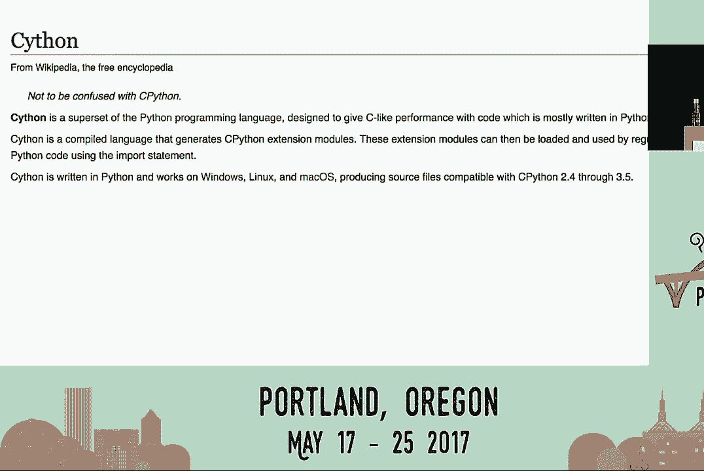
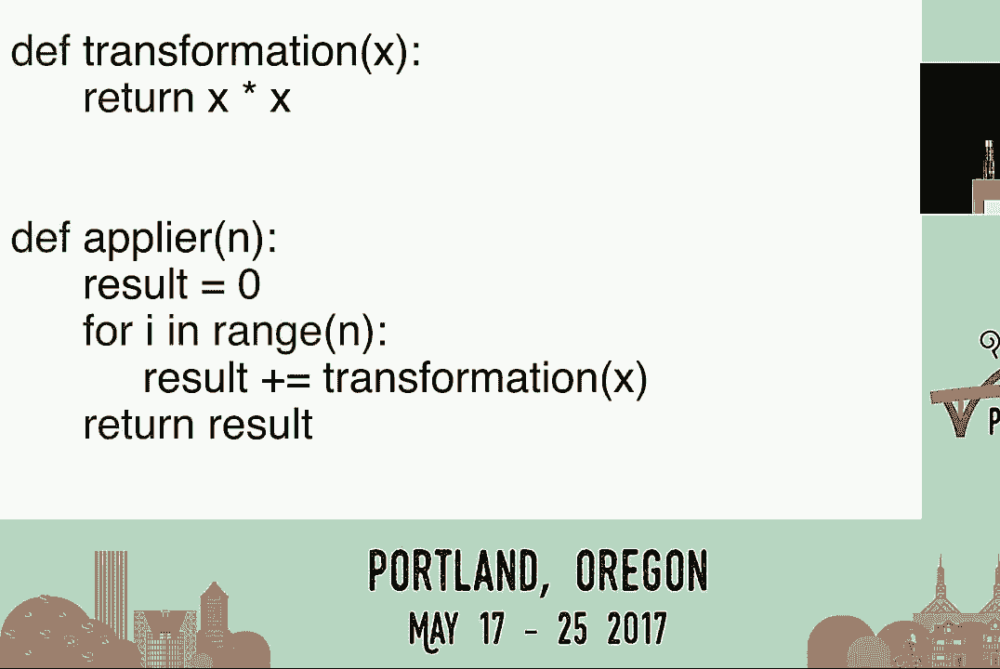

# Python性能优化：Cython作为效率的游戏规则改变者 🚀


在本教程中，我们将学习如何利用Cython来显著提升Python代码的执行效率。我们将从Python的性能瓶颈谈起，逐步介绍Cython的核心概念、基本语法和实际应用，帮助你理解如何在不重写大量代码或改变现有运行时环境的情况下，为你的Python项目带来性能飞跃。

---


## 1：Python的效率挑战

我们知道Python是一门适合多种场景的伟大语言，但它在执行速度方面存在不足。开发者效率高，但在CPU或内存使用率方面表现不佳。


对于典型网络公司的后端工程师，扩展初期面临的挑战通常是数据库或缓存问题。无状态的Web服务器层可以通过增加机器来简单扩展。

但当机器数量增长到一定程度时，节省成本、减少机器数量就变得重要。即便如此，Python的执行速度本身可能并非首要关注点，问题可能是CPU密集型、内存密集型或I/O密集型。

---

## 2：性能分析与优化起点

假设你和Instagram一样面临CPU问题，第一步是进行性能分析。根据帕累托原则，20%的代码通常负责80%的CPU使用率。因此，应避免过早优化，先找出需要优化的关键代码部分。

找到关键代码后，下一步是阅读代码。代码可能执行了不必要的操作，或存在数据结构误用等问题。

例如，以下代码使用列表推导式生成列表，然后在循环中检查元素是否存在：

```python
# 低效的 O(N²) 算法
my_list = [x for x in some_iterable]
for item in another_iterable:
    if item in my_list:  # 列表的`in`操作是O(N)
        # 执行操作
```

列表数据结构并非为快速成员查询设计，这导致了O(N²)的算法复杂度。修复方法很简单，将列表推导式改为集合推导式，复杂度即降为线性：

```python
# 高效的 O(N) 算法
my_set = {x for x in some_iterable}
for item in another_iterable:
    if item in my_set:  # 集合的`in`操作平均是O(1)
        # 执行操作
```


在进行任何重大更改前，应先尝试阅读代码并检查算法。但如果代码逻辑正确却依然很慢，则需考虑其他方案。

---



## 3：性能优化方案对比

当代码逻辑正确但性能不足时，你有多种选择。


**方案A：微服务**
将关键代码提取为独立的微服务，并用性能更好的语言（如Go、Rust）重写。缺点是工作量非轻，且会增加系统架构的复杂性和维护成本。




**方案B：经典的C扩展**
将代码用C/C++重写，并创建Python绑定。许多高性能库（如NumPy）正是如此构建。但要求开发者掌握C/C++，门槛较高。

**方案C：更换Python运行时**
Python有多种实现，如PyPy、Jython。但切换运行时可能不简单，特别是当项目依赖大量C扩展时，迁移会变得棘手。

**方案D：升级Python版本**
从Python 2升级到Python 3可能带来显著的性能提升（例如Instagram获得了12%的整体CPU使用率下降）。如果可行，这应作为优先选项。

**方案E：使用Cython**
Cython是Python的超集，它允许你编写类似Python的代码，并将其编译为C/C++扩展模块，从而获得接近原生代码的性能，同时保持与现有CPython运行时的完全兼容。


---

## 4：Cython初体验与核心优势

Cython是什么？根据定义，Cython是为提高性能而设计的Python编程语言超集。大部分代码用Python编写，但它提供了可选的额外语法。它编译为C或C++，并与现有运行时完美兼容，无需更改基础设施。

考虑以下实例：Instagram发现Django的URL调度器消耗了系统4%的CPU。他们所做的第一步仅仅是使用Cython编译了这个模块。这个简单的操作使该模块性能提升了3倍，CPU消耗从4%降至1%。

关键在于，他们**没有更改任何一行Django源代码**，也无需学习Cython的新语法就获得了显著的性能收益。这是一个轻松的胜利。

---

## 5：Cython语法入门：类型声明

上一节我们看到了Cython的威力。本节中，我们来看看如何通过添加类型注解来让Cython发挥更大作用。

Cython引入的主要关键字是`cdef`，用于声明变量和函数的C类型。

**变量类型声明**
```cython
cdef int i
cdef str s = ""
cdef list data = []
```
这声明了一个C整数`i`，一个Python字符串`s`和一个Python列表`data`。

**函数类型声明**
```cython
def transform(int x) -> int:
    return x * x

def plot(int n) -> int:
    cdef int result = 0
    cdef int i
    for i in range(n):
        result += transform(i)
    return result
```
在函数签名和局部变量中添加类型后，Cython能生成更高效的C代码。对于大型函数，性能提升可达数百倍。

**函数声明类型**
Cython有三种函数声明方式：
1.  `def`: 普通的Python函数。
2.  `cdef`: 纯C函数，只能被Cython或C代码调用，无Python调用开销。
3.  `cpdef`: 混合声明，既生成高效的C函数供内部调用，也生成一个Python包装器供外部Python代码调用。

---

## 6：Cython支持的类型系统

Cython支持丰富的类型系统，这是其性能优化的基础。

**基本C类型**
支持所有基本的C类型，如`int`、`long`、`float`、`double`、`char`。

**字符串类型**
支持字节字符串和Unicode字符串，在Python 2和Python 3中都能正确处理。例如，`str`类型在Python 3中是Unicode，在Python 2中是字节串。

**Python集合**
支持所有常用的Python集合类型，如`list`、`dict`、`tuple`。在大多数情况下，使用这些类型并添加注解就能获得2到5倍的性能提升。

**低级类型（进阶）**
对于追求极致性能的场景，Cython支持C数组、原始指针、枚举、C结构和联合体。例如，你可以使用C++标准模板库（STL）中的容器：
```cython
from libcpp.vector cimport vector
cdef vector[int] vec
```
使用这些低级类型需要格外小心。

---

## 7：使用扩展类型（cdef类）

除了基本类型，Cython的“扩展类型”（使用`cdef class`声明）是另一个强大的性能优化工具。它们看起来像普通Python类，但属性存储在类型化的C结构而非Python字典中。

以下是一个扩展类型的例子：
```cython
cdef class PyConSpeaker:
    cdef str name
    cdef int age
    cdef str bio

    def __init__(self, str name, int age, str bio):
        self.name = name
        self.age = age
        self.bio = bio

    @property
    def info(self):
        return f"{self.name}, {self.age}"
```
**优势**：
*   **内存占用少**：属性存储在C结构体中。
*   **访问速度快**：属性查找和方法调用更快。
*   **可作为静态类型**：可以在Cython的类型系统中使用。
*   **完全兼容**：可以从Python代码中创建和继承。

---

## 8：Cython优化工作流程

结合以上知识，一个典型的Cython优化工作流程如下：

1.  **定位与编译**：识别出性能关键模块，直接用Cython编译（不修改代码），测试性能。
2.  **逐步添加类型**：如果性能不达标，为关键函数和变量添加类型注解（`cdef`），重新编译测试。
3.  **迭代优化**：重复步骤2，逐步添加更多类型，直到达到性能目标。
4.  **深度优化（可选）**：在极少数情况下，如果类型化后仍需要更高性能，可以考虑使用C数组、C++ STL容器等低级结构替换Python数据结构。

**辅助工具：注解报告**
在编译时使用`-a`标志（如`cythonize -a your_module.pyx`），Cython会生成一个HTML报告。报告中：
*   黄色线条表示与Python虚拟机的交互。
*   颜色越亮，交互成本越高。
*   点击行可以查看生成的C代码，帮助你理解性能瓶颈所在。

---

## 9：实践成果与总结

Instagram的实践表明，仅将约10-15个关键模块转换为Cython，就使整个Web服务栈的全局CPU消耗降低了30%。这是一个以较小投入获得巨大回报的典型案例。

**回顾与总结**
在本教程中，我们一起学习了如何利用Cython优化Python性能：

1.  **勿过早优化**：像Instagram一样，在规模达到一定程度后再针对性优化。
2.  **分析先行**：使用性能分析工具定位关键代码。
3.  **首选Cython**：与其他方案（微服务、C扩展、更换运行时）相比，Cython优势明显：
    *   **避免重写**：无需用其他语言重写大量代码。
    *   **渐进式**：可以从编译现有代码开始，逐步添加类型。
    *   **语法亲和**：本质上是“带类型的Python”，学习曲线平缓。
    *   **运行时兼容**：完全兼容现有CPython环境和基础设施。

Cython不仅适用于包装C库或数据科学项目，对于典型的网络服务也同样高效。如果你想深入探索，可以访问 [cython.org](https://cython.org) 查看详细文档。


**本节课中，我们一起学习了Python的性能瓶颈、Cython的核心概念与语法、以及如何通过渐进式类型注解来显著提升代码执行效率。** 现在，你可以尝试在自己的项目中应用这些知识，开启性能优化之旅。