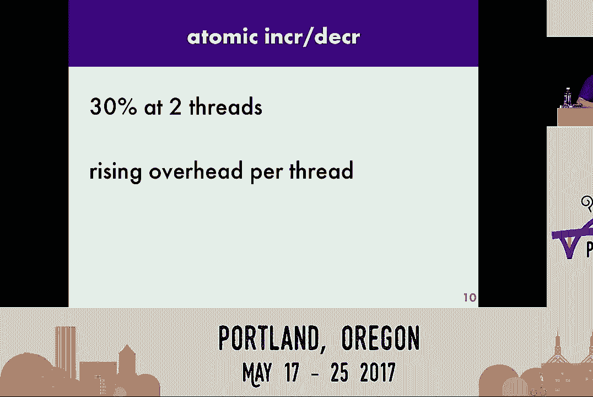
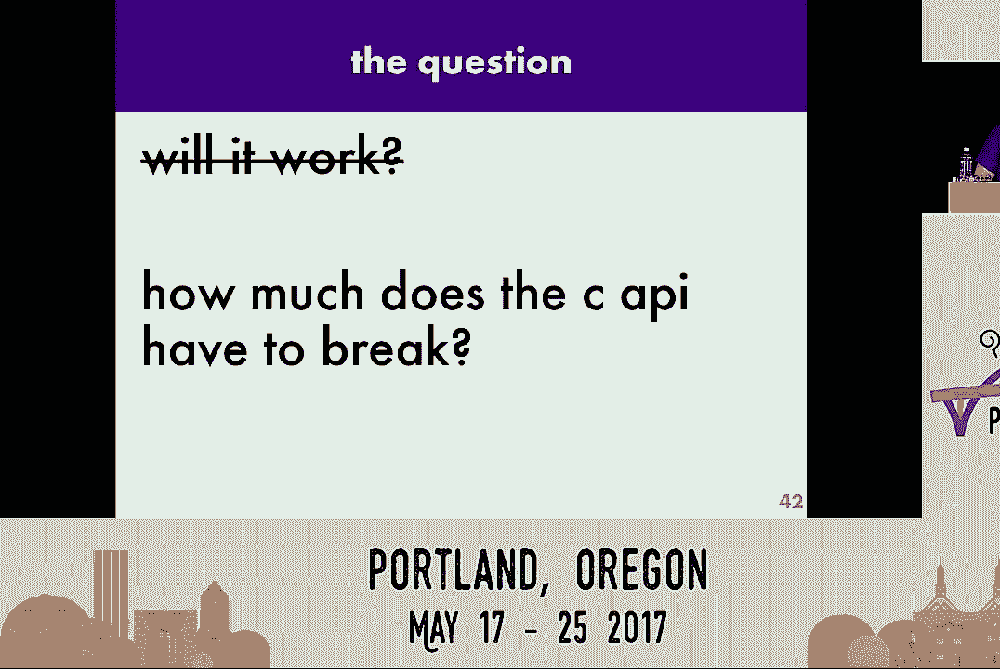

# Python GIL 移除项目（Gilectomy）：P6：进展报告 - PyCon 2017

## 概述
在本教程中，我们将学习 Larry Hastings 在 PyCon 2017 上关于“Gilectomy”项目的演讲内容。Gilectomy 是一个旨在移除 CPython 全局解释器锁（GIL）的项目，目标是让现有的多线程 Python 程序能够在多个 CPU 核心上并行运行，同时尽可能减少对现有 C API 的破坏。

---

## 项目背景与目标

在上一节中，我们了解了 Gilectomy 项目的存在。本节中，我们来看看项目的具体目标和面临的挑战。

Gilectomy 的目标是让使用 `threading` 模块编写的现有多线程 Python 程序能够在多个核心上同时运行。实现方式需要尽可能减少对 C API 的破坏。虽然无法完全保证 GIL 提供的所有特性，但会尽力减少破坏。

项目的成功标准是：在墙钟时间（wall-clock time）上，Gilectomy 下的程序运行速度要比带 GIL 的标准 CPython 更快。

为实现这一目标，Larry 采取的主要方法包括：
*   将 Python 用于跟踪对象生命周期的引用计数操作切换为**原子操作**。
*   在 Python 内部所有可变对象（如字典、列表）的数据结构上**添加锁**，以确保操作安全。
*   在 CPython 内部使用的许多数据结构（如小块分配器 `obmalloc`、各种空闲列表）周围添加锁，或使它们按线程分配。
*   暂时**禁用垃圾收集器**，因为实现线程安全的垃圾收集算法是一项独立且复杂的工作。

总体策略是：先让程序运行起来，然后通过性能分析找出瓶颈并优化。

---

## 性能基准测试的挑战

在深入技术细节之前，我们需要了解一个前提：在现代计算机上进行精确的基准测试非常困难。

现代 CPU（如 Intel Xeon）具有动态调整频率的技术。这意味着 CPU 核心的运行速度会不断变化，你无法确切知道某个核心在某一时刻的运行速度。这种不确定性使得有意义的基准测试变得几乎不可能，基准结果可能存在高达 5% 的误差。

因此，在评估 Gilectomy 的性能数据时，需要考虑到这种背景噪音。

---

## 演进历程与性能对比

Gilectomy 项目自启动以来经历了几个主要的技术阶段。以下是每个阶段的简要介绍和其对性能的影响。

我们通过一个运行递归斐波那契数列生成器的基准测试来对比性能。图表中，X 轴代表使用的线程（核心）数，Y 轴代表程序运行时间（秒）。红线代表标准 CPython（带 GIL），其他颜色的线代表不同阶段的 Gilectomy。

1.  **原子引用计数（2016年6月）**：初始版本，将引用计数改为原子操作。这导致性能严重下降，在7个核心上比 CPython 慢了 **18.9 倍**。主要原因是原子操作导致 CPU 核心间通信总线饱和。
2.  **缓冲引用计数（2016年10月）**：引入“缓冲引用计数”技术，大幅减少了核心间的争用，性能得到显著提升。
3.  **优化小块分配器（2017年4月）**：对 `obmalloc` 进行优化，采用分级锁和每线程空闲列表，进一步提升了性能。
4.  **移除线程局部存储访问（2017年5月）**：减少在关键函数路径中从线程局部存储（TLS）获取数据的次数，带来了又一次性能提升。

经过这些优化，Gilectomy 的性能（墙钟时间）已经非常接近单线程的 CPython，达到了“触手可及”的范围。

---

## 核心技术：缓冲引用计数

上一节我们看到了缓冲引用计数带来的巨大性能提升。本节中，我们来深入了解这项核心技术的原理。

**问题**：传统的原子引用计数操作（`Py_INCREF`/`Py_DECREF`）会导致多个线程频繁争用同一内存地址，造成性能瓶颈。

**解决方案**：缓冲引用计数。其核心思想是引入一个“引用计数提交线程”，并让工作线程将引用计数的增减操作记录到日志中，而非直接修改内存。

以下是该方案的工作流程：

1.  每个工作线程拥有本地的引用计数日志缓冲区。
2.  当线程需要增加或减少某个对象的引用计数时，它只是将“对象指针 + 操作类型（INC/DEC）”写入自己的本地日志。
3.  一个专用的提交线程会定期收集并处理这些日志，真正地执行引用计数的修改。

由于只有提交线程会修改实际的引用计数值，因此它可以使用普通的非原子操作，从而避免了争用。

**挑战与解决**：日志提交的顺序必须正确，否则可能导致对象过早被销毁。例如，线程A增加了对象O的引用，线程B减少了对象O的最后一个引用。如果先提交线程B的日志，对象O会被销毁，再提交线程A的日志时就会访问已释放的内存。

解决方案是，将日志分为 **INC（增加）** 和 **DEC（减少）** 两个独立的队列。只需保证在提交一个 DEC 操作时，所有时间上早于它的 INC 操作都已提交即可。这可以通过一种轻量级的、常数时间的排队算法来实现。

这项技术的实现使得 `Py_INCREF` 和 `Py_DECREF` 宏变得更复杂，但通过缓存和预分配缓冲区等优化，可以使其运行得足够快。

---

## 其他技术挑战与解决方案

缓冲引用计数解决了主要矛盾，但也带来了新的问题。以下是其他几个关键挑战及其解决方案。

*   **弱引用问题**：弱引用机制需要知道对象的实时存活状态。解决方案是引入一个次要的、原子操作的引用计数，专用于弱引用系统。
*   **对象复活问题**：在 `__del__` 方法中复活对象（将 `self` 赋值给外部变量）在 Gilectomy 下会出问题，因为无法实时感知引用计数变化。建议是避免这种编程实践。
*   **性能分析工具**：开发过程中，可逆调试器 **UndoDB** 是不可或缺的工具，它可以像倒带一样运行程序，帮助定位复杂的并发 Bug。

---

## 当前工作与未来方向

目前，性能分析表明内存分配器 `obmalloc` 仍然是主要的性能瓶颈。未来的优化方向包括：

1.  **重写 obmalloc**：尝试将其改造成更彻底的每线程结构，减少锁争用。
2.  **私有锁**：大多数对象从不跨线程共享。可以为对象设计一种“预锁定”模式，当对象仅被创建它的线程访问时，使用极低开销的“锁”；只有当其他线程试图访问时，才将其升级为真正的锁。
3.  **分离引用计数**：将引用计数值从对象本身分离存储。这可以避免修改不可变对象（如小整数）的引用计数时，使所有 CPU 核心的缓存行失效，从而提升多核效率。
4.  **终极方案：切换到追踪式垃圾回收**：如果上述优化均无法达到目标，最后的备选方案是彻底将 CPython 的垃圾回收机制从引用计数改为追踪式垃圾回收（如 Java、Go 所用）。这可以利用 PyPy 项目的 `cpyext` 经验，在追踪式 GC 上模拟 CPython 的 C API 和引用计数语义。但这将是一项浩大的工程，并且会严重破坏现有 C 扩展的语义。

---

## 关于兼容性的重要说明

Gilectomy 不可避免地会破坏现有 C 扩展的**语义**。

虽然源代码级别的 API（如 `Py_INCREF`）保持不变，可以重新编译，但 GIL 所提供的隐式保证将消失。例如：

*   **对象销毁的非确定性**：依赖“对象在最后一个引用消失后立即销毁”的代码将无法正常工作。
*   **丢失的线程安全**：过去依赖 GIL 保护的非线程安全代码（如静态变量的惰性初始化）将出现竞争条件。

Python 语言规范从未保证这些行为，其他实现（如 Jython、IronPython）也未提供。这是移除 GIL 必须付出的代价。

---

## 总结

本节课中，我们一起学习了 Larry Hastings 的 Gilectomy 项目在 PyCon 2017 时的进展。我们了解了项目的目标、性能基准测试的挑战，以及项目演进的几个关键阶段，特别是**缓冲引用计数**这一核心技术。我们还探讨了项目面临的其他技术挑战、当前的优化方向，以及移除 GIL 对 C 扩展**语义兼容性**带来的必然影响。

Gilectomy 项目证明，在 C 语言中编写一个无 GIL 的多线程 Python 解释器是可行的（Jython 和 IronPython 已做到）。真正的挑战在于，如何在提升多核性能的同时，最小化对庞大 CPython 生态系统的破坏。