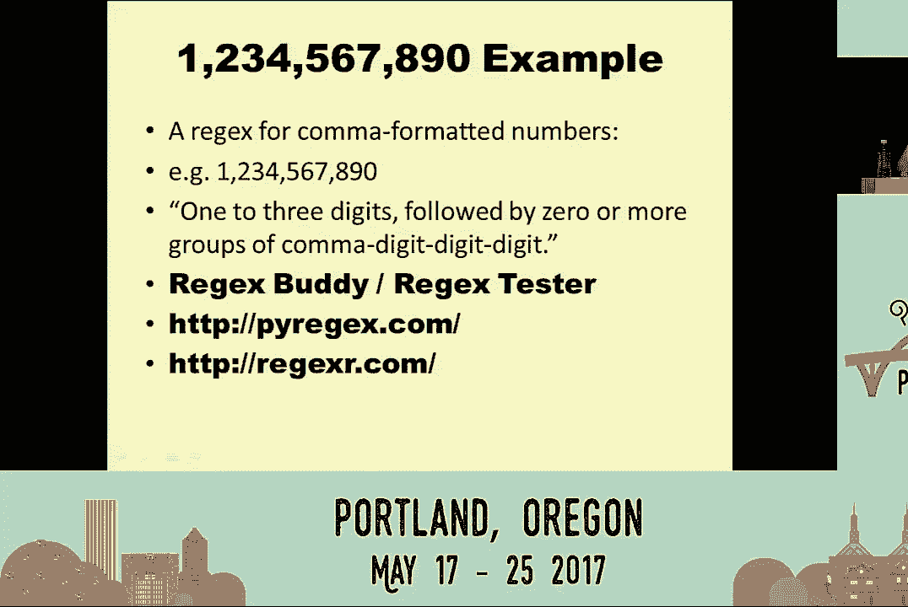
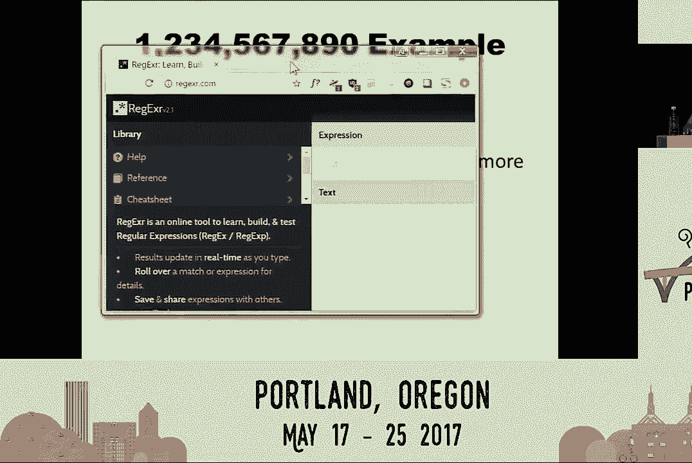
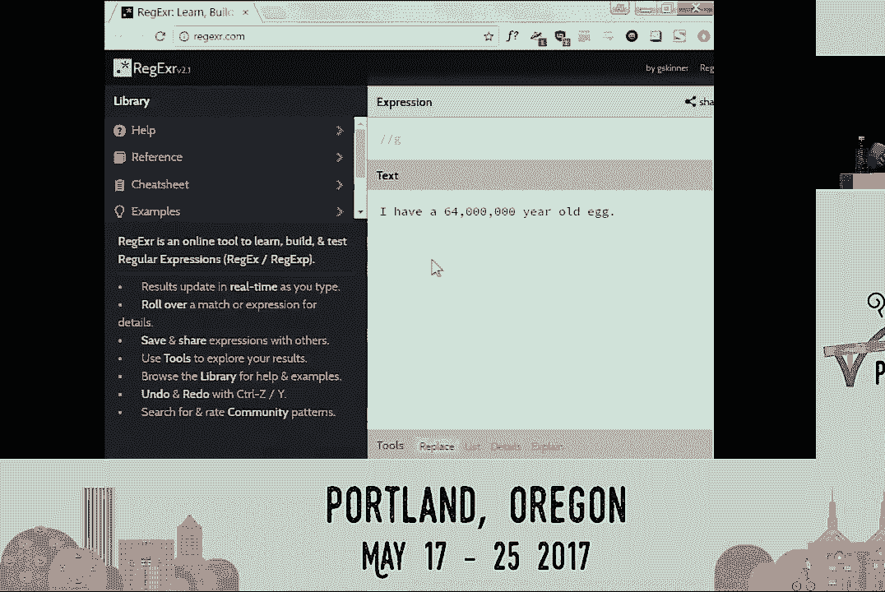
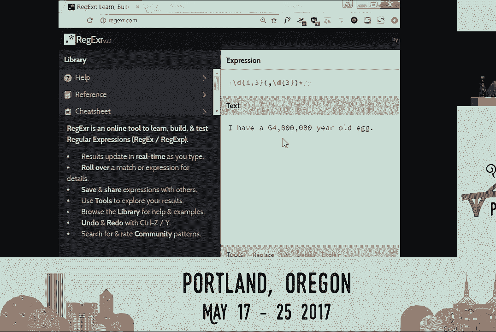
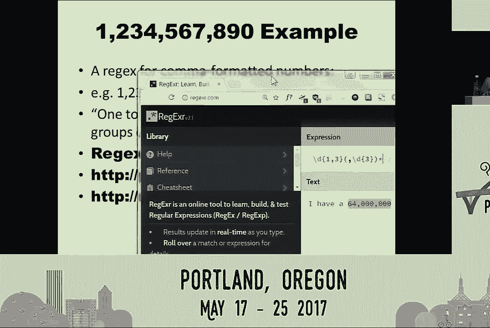

# 正则表达式入门：P7：是的，学习正则表达式的时间到了


在本教程中，我们将学习正则表达式的基础知识。正则表达式是一种强大的文本模式匹配工具，可以帮助我们在字符串中查找、验证或提取特定模式的文本。我们将从基本概念开始，逐步了解其核心语法和在Python中的使用方法。

---

## 正则表达式：1：什么是正则表达式？🔍

正则表达式，常简称为“regex”，是一种用于描述文本模式的字符串。它允许我们指定一个搜索模式，而无需知道确切的文本内容。例如，识别一个电话号码，是因为我们知道其模式（如区号、短横线等），而不是因为记住了每一个号码。

正则表达式的作用就是让我们能够定义这种模式，并在文本中查找匹配该模式的字符串。

---

## 正则表达式：2：Python中的基本用法🐍

在Python中使用正则表达式非常简单，主要涉及三个步骤：导入模块、编译模式和搜索匹配。

以下是核心代码流程：
```python
import re
phone_regex = re.compile(r'\d\d\d-\d\d\d-\d\d\d\d')
match_object = phone_regex.search('我的电话是 415-555-4242。')
if match_object:
    print(match_object.group())
```

**代码解释**：
1.  `import re`：导入Python的正则表达式模块。
2.  `re.compile()`：将表示模式的字符串（如`r‘\d\d\d-\d\d\d-\d\d\d\d’`）编译成一个正则表达式对象。使用原始字符串（`r‘’`）可以避免转义反斜杠的麻烦。
3.  `.search()`：在目标字符串（“干草堆”）中搜索编译好的模式（“针”）。如果找到，返回一个匹配对象；否则返回`None`。
4.  `.group()`：从匹配对象中提取实际匹配到的文本。

虽然看起来比简单的字符串查找方法复杂，但对于复杂的模式匹配，正则表达式能极大简化代码。

---

## 正则表达式：3：理解字符类🔠

上一节我们介绍了基本流程，本节中我们来看看构成模式的核心——字符类。字符类定义了你要匹配的单个字符属于哪个集合。

以下是一些预定义的常用字符类：
*   `\d`：匹配任意一个数字（0-9）。
*   `\w`：匹配任意一个单词字符（字母、数字、下划线）。
*   `\s`：匹配任意一个空白字符（空格、制表符、换行符）。
*   `\D`、`\W`、`\S`：分别匹配对应小写字符类**之外**的任意一个字符。

你也可以创建自定义的字符类：
*   `[aeiouAEIOU]`：匹配任意一个元音字母。
*   `[^aeiouAEIOU]`：匹配任意一个**非**元音字母。`^`在方括号内表示“非”。
*   `[a-zA-Z0-9]`：匹配任意一个字母或数字。`-`表示一个范围。
*   `[\(\\)]`：匹配左圆括号或右圆括号。在字符类内，大多数特殊字符（如`(`）会失去特殊含义，但为了清晰，有时仍会转义。

字符类是你告诉正则表达式引擎“我要匹配这类字符”的方式。





---




## 正则表达式：4：指定匹配数量🔢

仅仅匹配一个字符往往不够，我们经常需要匹配连续出现的多个字符。这时就需要在字符类后面加上表示数量的符号。





以下是常用的数量符号：
*   `{3}`：精确匹配前面的元素3次。例如，`\d{3}`匹配三个连续数字。
*   `{1,3}`：匹配前面的元素1到3次。
*   `?`：匹配前面的元素0次或1次（即可选）。
*   `*`：匹配前面的元素0次或多次。
*   `+`：匹配前面的元素1次或多次。

因此，电话号码模式可以更简洁地写为：`r‘\d{3}-\d{3}-\d{4}’`。模式结构通常是：`字符类` + `数量符号`。

---

## 正则表达式：5：分组与选择⚖️

有时我们需要将多个元素视为一个整体进行操作，或者提供多种匹配选择。这就需要用到分组和管道符号。

**分组**使用圆括号`()`。例如，日语假名通常由辅音和元音组合而成。要匹配一个假名序列，我们可以将`（辅音+元音）`作为一个组，然后匹配这个组多次：
```python
pattern = r‘([^aeiouAEIOU]+[aeiouAEIOU]+)+’
```
这个模式会匹配像“さようなら”（Sayonara）这样的单词。

**管道符号**`|`表示“或”的关系。例如，想匹配《蒙提·派森》短剧中的一些特定单词（如egg, bacon, sausage, ham），可以使用：
```python
pattern = r‘(egg|bacon|sausage|ham)+’
```
这将匹配像“egghambacon”这样的组合。管道符号让你可以在多个备选模式中进行选择。

---

## 正则表达式：6：通配符与贪婪匹配🌐

点号`.`是一个强大的通配符，它可以匹配**除换行符外**的任意单个字符。

当点号与数量符号结合时，功能非常强大：
*   `.*`：匹配任意长度的任意字符（贪婪模式）。它会尽可能多地匹配字符。
*   `.*?`：匹配任意长度的任意字符（非贪婪模式）。它会尽可能少地匹配字符。

例如，在字符串`‘<服务人类>吃晚餐>’`中：
*   模式`r‘<.*>’`（贪婪）会匹配整个字符串`‘<服务人类>吃晚餐>’`。
*   模式`r‘<.*?>’`（非贪婪）只会匹配第一个`‘<服务人类>’`。


理解贪婪与非贪婪的区别，对于精确提取文本至关重要。

---

## 正则表达式：7：最佳实践与局限性🚧

正则表达式虽然强大，但也有其适用边界和最佳实践。

以下是需要注意的几点：
1.  **不要用正则表达式解析HTML/XML/JSON**：这些结构化语言有嵌套、属性等复杂语法，正则表达式难以可靠处理。应使用专门的解析库（如`Beautiful Soup`， `json`模块）。
2.  **避免过于复杂的正则表达式**：如果一个正则表达式变得极其冗长和难以理解（例如，用于验证密码强度），考虑将其拆分为多个简单的正则表达式或使用普通代码逻辑。
3.  **了解其理论限制**：正则表达式基于“正则语言”，无法处理需要匹配**嵌套结构**（如平衡的括号`((()))`）的问题，因为这需要更强大的“上下文无关文法”。

---

## 总结📝


本节课中我们一起学习了正则表达式的核心概念。我们从Python中使用正则表达式的基本三步（编译、搜索、分组）开始，逐步深入到字符类、数量符号、分组、管道符以及通配符。记住，学习正则表达式的关键是理解“模式”而非具体文本，并善用在线测试工具进行练习和调试。虽然它有一些局限性，但在文本模式匹配领域，正则表达式无疑是一个极其高效和强大的工具。现在，是时候开始在实践中使用它了。