# P8：马修·洛克林 Dask：一个 Python 分布式数据科学框架 PyCon 201 - 哒哒哒儿尔 - BV1Ms411H7jG

演讲结束后将有大约五分钟的提问时间，所以请稍等。太好了。

[掌声]，哎呀，让我们关闭这个。

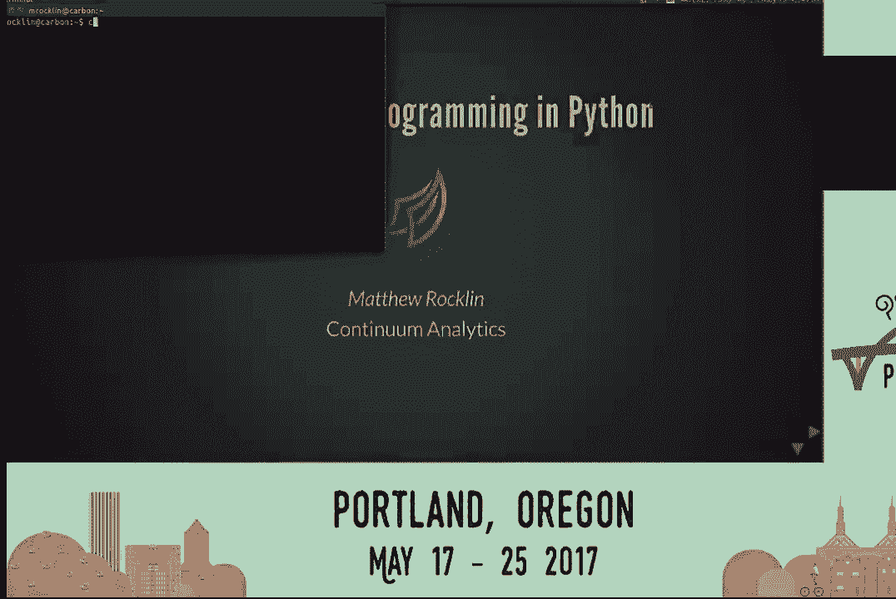

大家好。我叫马修·洛克曼。我在 Continuum Analytics 工作。Continuum 是一家营利性公司，专注于 Python 生态系统中的开源数据科学。因此，他们提供咨询和培训等服务。我们也会申请补助金。

这些补助金支持开源软件。DASK 就是这样一个例子。所以，我参与了一个叫 DASK 的项目，这是一个用于 Python 中并行和分布式计算的库。稍后会谈一谈这个项目，以及 Python 中的并行计算。此次演讲将结合幻灯片和现场演示。

如果无线网络能顺利运行的话。幻灯片可以在我的网页上找到，网址是 MatthewRockman.com/slides/pycon-2017。如果我有点无聊，我想跳到下一部分。所以，我来自 PyCon 生态系统的 NumPy 部分。如果你比较熟悉 NumPy 而不是 Django，或者比较熟悉 Django 而不是 NumPy，请举手。

是的，这很棒。差不多是 50/50。这是个疯狂的会议。所以，Jake 在今天开场的主题演讲中提到这一点，我很喜欢，我们是一个混合的小组。这次演讲将讨论将一些幻灯片混合在一起。我们将结合 Python 的网络侧和数据侧。

创建一个分布式计算系统。所以，我们在 Python 中有一个非常强大的分析系统。这些库包括 NumPy、Pandas 和 Scikit Learn。它们速度很快，直观易用，科学家和分析师都喜欢它们。但它们的缺陷在于设计时主要是运行在单核上，并且数据需要适合 RAM。这种情况正在变得不再适用。

随着我们处理的数据集越来越大，以及集群规模的不断扩大，我们现在希望将这些库和整个生态系统扩展到超越单核处理。这很难做到。因此，我们希望对单个库进行并行化。我们想要对成千上万的包进行并行化。

所以，我要借用一些 Jake 的幻灯片。这些是 Jake 今天早上在主题演讲中提到的 Python 科学栈幻灯片。在核心是 Python，上面有一些核心库，比如 NumPy。在此之上，我们认为像 Pandas 和 SciPy 以及其他一些外围包。当你向外延伸时，实际上有成千上万的小包。

这些软件包用于基因组学，供进行测序和研究太阳的人使用。还有成千上万的小型研究小组都在利用他们的专业知识来支持众多科学家。这些人正在做真实的工作，帮助这个世界。

我们希望不仅对 NumPy 或 Pandas 进行并行化，而是对所有内容进行并行化。这是一个巨大的挑战。这就是我们面临的挑战，我们傻乎乎地想要解决它。

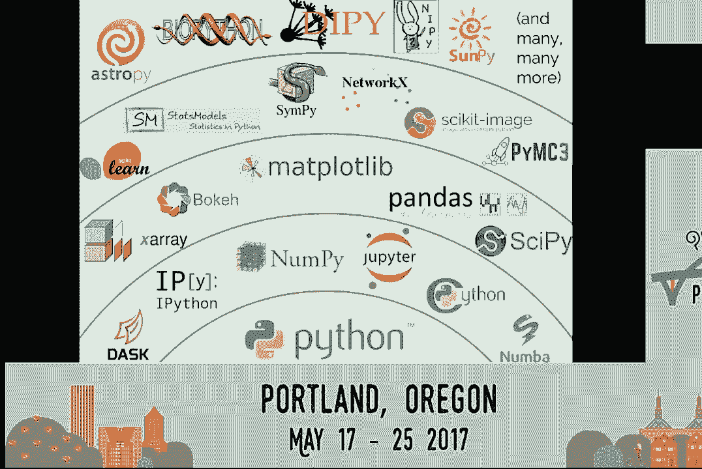

这些包也有自定义算法，不仅仅是一种东西。它们有自己的秘密配方。它们是由聪明的人制作的。所以，我们需要一个并行计算库，它能够灵活处理太阳天文学家和基因组学家的工作。

这足够熟悉，以至于可以被大量人群采用。这再次是一种挑战。因此，为了解决这个问题，我要谈谈 DASK，这是我和其他人过去几年里一直在研究的内容，希望你会喜欢。所以，这次演讲将从更偏向 NumPy 和 Pandas 的方面开始。

更熟悉 NumPy 和 Pandas 的人一开始会比较开心，更容易适应。我们将在最后更多地转向类似于 Tornado 网络并发的方向。因此，希望能满足每个人的需求。我们首先讨论如何对 NumPy 和 Pandas 进行并行化，这也是 DASK 的首要目标。然后我们将讨论如何并行化更通用的代码。

这对于并行化许多软件包是必要的。我们将讨论任务调度和任务图，并与其他能够执行类似任务的计算系统进行比较，比如 Spark 或 Airflow。我们将更深入地讨论 DASK 如何解决这个问题。最后，我们会稍微谈谈 Python API 和协议，这些是有助于获得更好采用的。

然后我们将以最后的思考结束。因此，首先，我们将对 NumPy 和 Pandas 进行并行化。有谁使用过 NumPy 或 Pandas？

最近三天里有谁使用过 NumPy 或 Pandas？好吧，有些人是熟悉的。很高兴看到这一点。因此，谈谈 DASK 的两个子模块。这是一个 DASK 数组，它是由许多小的 NumPy 数组组成的多维数组。我在查看气候数据。我有地球每平方英里的温度数据。

这可能是一个非常大的数组。我可能无法将这个数组放入一台计算机中。它不会把这个数组分成许多不同的部分，放在不同的计算机或我的硬盘上。DASK 数组将逻辑上协调所有这些 NumPy 数组。因此，DASK 数组是任何 NumPy 数组的集合。当你输入时，DASK 数组会处理这些。

你知道，DASK 数组.sum，它会通过与 NumPy 数组进行所有这些协调来计算和。同样，其他产品如 DASK DataFrame，它是许多 Pandas DataFrame 的逻辑连接。因此，例如，我们可能有一个时间序列，而每个月的数据相当大。那可能适合在一台计算机上。我们需要使用多台计算机来存储我们的整个数据集。

我们需要使用我们的硬盘，但这需要很多、很多、很多个月。因此，DASK DataFrame 和 DASK 数组提供的是一个接口，这个接口与 NumPy 和 Pandas 非常相似，但它并行操作。要么在你拥有多个核心的笔记本电脑上，要么在你的磁盘上扩展。

或跨多个计算机集群使用。此外，因为它们在底层使用 NumPy 和 Pandas，所以很多事情与它们一起工作非常简单。因此，这对你的代码库是一个非常轻量的改变。所以，我将切换到几个示例。希望。

无线网络今天比昨天稍微好一点。

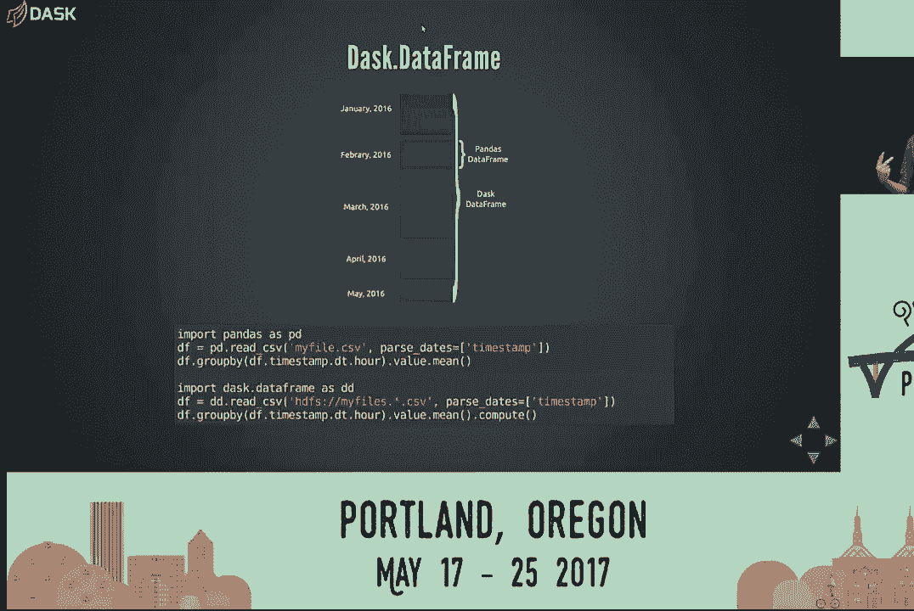

所以，我这里有一个在 Google 计算引擎上运行的集群。这个集群有 32 台机器。每台机器有两个核心。我将创建一个数组。让我们把它做得大一点。我将创建一个 1,000 乘 1,000 的数组，或者 10,000 乘 1,000，但由 NumPy 数组或 1,000 乘 1,000 组成。因此。

一种 10 乘 10 的 NumPy 数组网格。该网格的每个元素是一个 1,000 乘 1,000 的 NumPy 数组。现在，当我在我的集群上计算时，DASK 已经为我计算了所有这些 NumPy 数组。我们在左侧看到过这一点。因此，在整个演讲中，我们将会看到这些图表。所以，我有 64 个核心，它们在这个轴上。

这里的每一行都是一个核心随时间所做的工作。我们看到这个核心调用了 NumPy 随机函数几次，并创建了几个 NumPy 数组。因此，在我的 32 台机器上，我有 100 个 NumPy 数组分散在它们上。如果我做某事，比如说我将计算这个数组的和。

这是一个非常简单的计算。DASK 将计算所有中间数组的和。它会将一些中间值转移到其他机器。这是红色。红色是数据传输。它将计算一些最终结果，并以相对快速的时间给我们一个不错的答案。这更复杂。

我会尽量将这个向下滚动。做一些更复杂的事情。如果你熟悉 NumPy，这个语法应该对你来说很熟悉。因此，我们可以做很多看似 NumPy 计算的事情，但实际上是分布在集群上的。所以，这大概是 DASK 的最高级别的使用。它看起来像 NumPy。

但如果你愿意，它实际上可以在数 TB 的数据上运行。当然。我们将考虑一个 Pandas 数据框的例子。在这里，我有一堆位于 Google 存储上的 CSV 文件。它将放在 S3 上或在亚马逊上，随你喜欢。这是纽约市出租车数据集。它在磁盘上大约 20GB，在 RAM 中大约 60GB。因此，这对于我的笔记本电脑来说太大了。

但我可以用 Pandas 读取它的一小部分。这显示了 2015 年纽约市的所有出租车行程。那么，出租车里有多少乘客？他们什么时候出发？他们什么时候停下？

以及费用的细分。因此，这是一个大型时间序列数据集。也许你以前见过。它有点方便，因为易于理解，但又不方便地大。我不能在一台机器上全部读取，但我可以在多台机器上读取。因此，在这里。与其使用 Pandas 读取 CSV 函数，我使用了 DASK 数据框读取 CSV 函数。

它具有相同的 API，但分解了我的计算。它将那 12 个 CSV 文件分解成数百个字节块。然后调用 Pandas 读取 CSV 函数和所有这些字节块。因此，您在左侧看到的都是我的集群中的所有机器都在忙于创建。

在它们的本地内存中生成 Pandas 数据框。我们得到的对象不是 Pandas 数据框，而是 DASK 数据框。它看起来和感觉都一样。当我们对这个 DASK 数据框进行操作时，DASK 会协调以确保所有 Pandas 数据框都相应地受到影响。因此，再次强调，DASK 就像一个非常好的秘书。因此，实际上并不进行任何计算。

这是协调多个 Pandas 数据框以进行正确计算。因此，你知道，这一切都是基于 Pandas 构建的，对所有 D 型的嗅探者来说看起来都很熟悉。我们喜欢从 Pandas 读取 CSV。而且，你知道，它的运行方式相同，渲染方式也相似。它应该让人感觉相对熟悉。如果你想让整个 Python 生态系统的人都使用它，这一点非常重要。

他们似乎喜欢 Pandas，事实证明。因此，你知道，简单的计算。我们可能会计算那个数据框的长度。那是相对简单的。我们计算所有中间值的长度。因此，如果你稍微放大一下。我们计算这个特定 Pandas 数据框的长度，它花费了，你知道的。

几微秒。我们这样做了几百次。我们在一台机器上传输了一些数据，并且我们称之为，我们做了这个。这是一个非常简单的计算，但我们可以做更复杂的事情。在这里，我们将看到纽约人给小费的情况。因此，我们将去掉一些不良行。

原来在纽约市有一些免费乘车的情况。我们将创建一个新列，即小费比例。所以，你知道，小费与车费的比率，是否是 10%的小费或 20%的小费？我们将按照一天中的小时和一周中的天进行分组，看看小费比例的平均值。

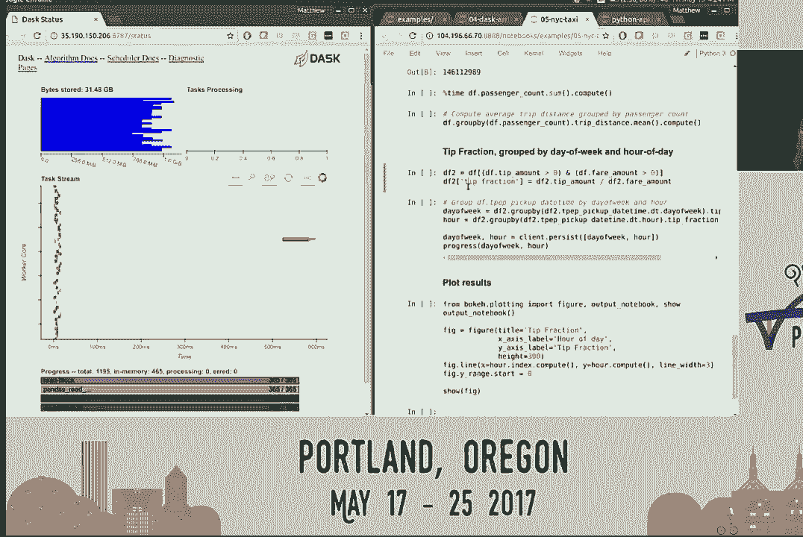

那么，纽约人的小费水平如何呢？按照一天中的小时进行分组。这产生了成千上万的 Python 函数，这些函数在我们的集群上运行，并给我们带来了很好的结果。所以，你知道，数据框将这种类似 Pandas 的计算转变为成千上万的 Python 函数，需要运行所有的 Pandas 数据框。然后，Dask 任务调度器在大约三到四秒内为我们运行了所有这些函数。

我们将回到纽约人相对慷慨的小费这一美好结果，作为近期在纽约的移民，我对此感到自豪。平均而言，小费大约为 20%，在凌晨 4 点时有一个惊人的峰值，达到 38%。我知道这时是酒吧的最后叫酒时间。不过，正如你所知，我们对一个相对容易设置的集群上的大规模内部数据集进行了数据科学分析。

这就像是 Dask 的第一次重大成功。Dask 为你提供了一个并行或分布式的 NumPy 或 Pandas 数据框。对某些人来说，这是有用的。然而，事实证明，我们也认为这是有用的。然后我们把它带给学术团体和公司，问他们：“嘿，这不是很有用吗？”

我说：“是的，但我们的问题实际上要复杂一些。”事实证明，并不是所有问题都是一个大数据框或一个大数组或一个大列表。相反，人们的代码通常看起来像这样。它们就是普通的 Python 代码，有四个循环。这显然是可以并行化的。但它并不明显是数据框和数组的计算。

因此，我们的第一种方法是尝试将其强制转换为数据框计算。可能是两个数据框，我们在进行连接和过滤。这是一个尴尬的过程。因此，我们开发了 Dask 的其他库或模块，可以处理更通用的代码。Dask 数组或 Dask 数据框之下的系统正在进行所有协调。

秘书部分。实际上，这是相当灵活的。只要我们能够用更灵活、更细化的 API 来暴露这一点，我们就能并行化更多聪明且定制的代码。因此，这在实践中使用得比大数据框或更大的数组要多得多。

至少是由更大的机构进行的。让我们看看一个例子。

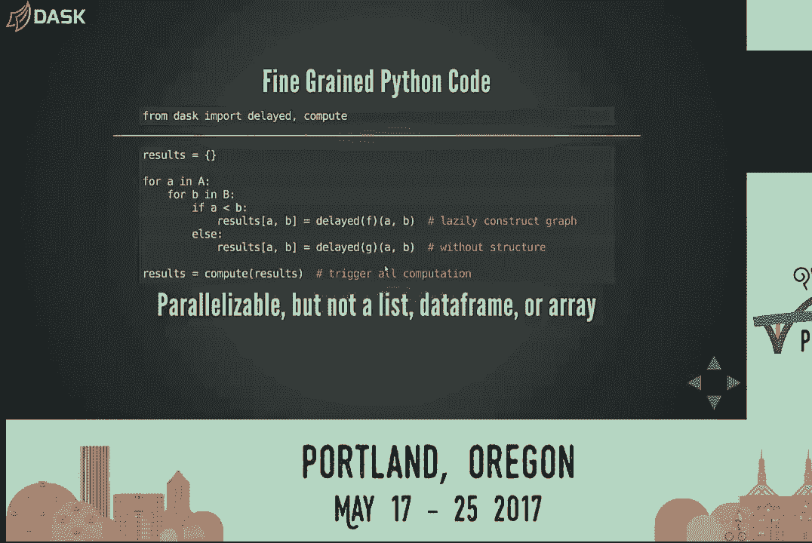

我实际上将切换，不是到集群，而是直接到我的本地机器。这在集群上运行得很好，但我想向你展示在你的笔记本上使用 Dask 是很简单的。我的目标是让大家能够在他们的笔记本上使用 Dask，并开始尝试。所以通常，当我们创建一个客户端时，并不会连接到特定的集群。

我们稍后会谈论这个。我们输入一些调度器头节点的地址。在这种情况下，我们不打算添加任何内容。这是一个信号，告诉 Dask 它应该在本地创建一些东西。因此，Dask 将在我们的笔记本上创建一个小型 Dask 集群。实际上，我很抱歉。我根本不想要这个笔记本。我想要另一个。所以，忘记我刚刚说的话。

我这里有一些函数，模拟工作。因此，它们将进行少量工作，但会休眠一段时间。这可能是你自己编写的某些代码。inc 增加一个数字，decrements 从一个数字中减去一，并将两个数字相加。我可以在本地调用这些。让我们清除一下。我可以在本地调用这些，可能需要几秒钟。

有点随机。或者我可以导入 Dask，并可以对这些函数进行延迟标注。这就是我这里的意思，当我们现在调用那个函数时，我们并不会实际执行代码。因此，我们将那个函数及其参数放入一个任务图中，以便我们可以稍后执行。所以现在当我运行那段代码时，之前的同样代码。

它立即计算，但实际上还没有做任何工作。因此它产生了这个对象 Z，它保留了如何计算的配方。无论何时我们想完成它。因此，当我在这个对象 Z 上调用计算时，它现在将在我的笔记本电脑上并行运行。不是在集群上，也不是在任何设置上。

我在这里没有设置任何内容。我导入了 Dask。我调用了计算。默认情况下，这在一个线程池中运行。也可以运行一个进程池或其他东西。但这是我们可以用来以更像 Python 的方式构建并行计算的接口。现在我将设置一个集群。同样，只是在我的本地笔记本上。

其中一个好处是它给我提供了一个不错的仪表板页面。这是一个 bokeh 仪表板，一个 bokeh 网络应用程序。人们对此很感兴趣。那一定是**莎拉·伯德**。你来了，谢谢你，莎拉。然后我们可以在这个仪表板上运行它。我们可以看到它的运行。因此，我们在其中一个线程上调用它的递减。我们在另一个线程上调用它的递增。

然后这个小红点是两个不同线程之间的通信。我们在结果上调用它的加法。因此，Dask 再次在确定何时调用这些内容、移动数据等方面做出决定。处理其他并行计算的部分，而不必思考。同时仍然让你有自由去做你想做的事情。所以这很不错。

当你有四个循环并且可以做一些任意复杂的事情时，这变得更好。所以我有更多的计算，我们正在填满这些进程并进行大量工作。

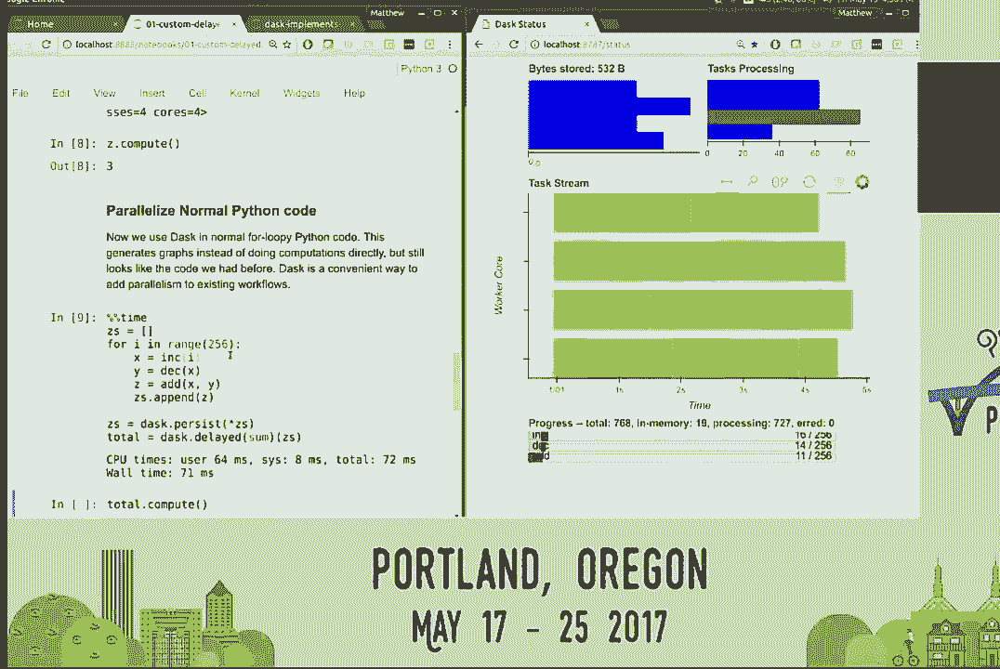

我从这些进度部分注意到，这将需要一些时间。所以我要启动更多的工作线程，并将其指向这个调度器。这将生成 10 个进程，我们将用于运行线程。

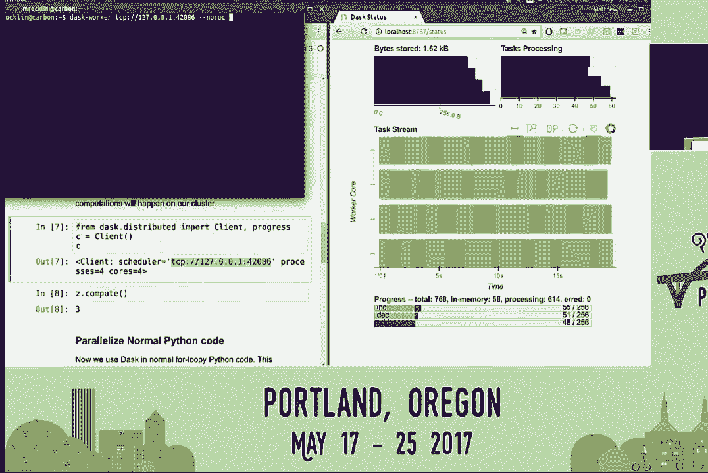

所以我们正在将其连接到调度器，现在我们看到正在响应的任务。并行化得很好。我可以将它们移除。Dask 是弹性的。它可以扩展。它可以做你想要集群的所有美好事情。既然我们有了这个能力，让我们做一些稍微复杂的事情。

我们在我的笔记本电脑上有这些数字。我要把它们加在一起。一种方法就是调用一些并将它们全部相加。我必须迁移到一台机器上，将它们在一台机器上相加。但还有更复杂的方法。让我们逐对相加。前两个加在一起。

第二组将那些加在一起。所以这里有一些 Python 代码可以做到这一点。这段 Python 代码不是 Dask 代码，而只是普通的 Python 代码。如果你看这一段大约一分钟，我想你会理解它在做什么。它有一个值的列表，并逐对相加。

当列表的长度大于一时，它会继续这样做。我们可以可视化那个结果。也许你能看到这一点。我们得到的图表显示了我们想要计算的内容。你可以看到它确实产生了我们想要的计算。它看起来像上面的这张图。还没有任何东西运行。

我们已经创建了一个如何做这些事情的配方。如果我们让 Dask 为我们计算那个结果，它将使用我们的集群并利用所有这些进程。它在必要时在进程之间进行通信。一开始有很多工作要做。到最后，我们需要完成的加法会越来越少。

如果你想来 Continuum 的展位，我会给你这个演示。这个演示展示了两件事。第一，大数据框。第二，能够编写你自己的 Python 代码并将其并行化。这变得更具吸引力，也更实用。

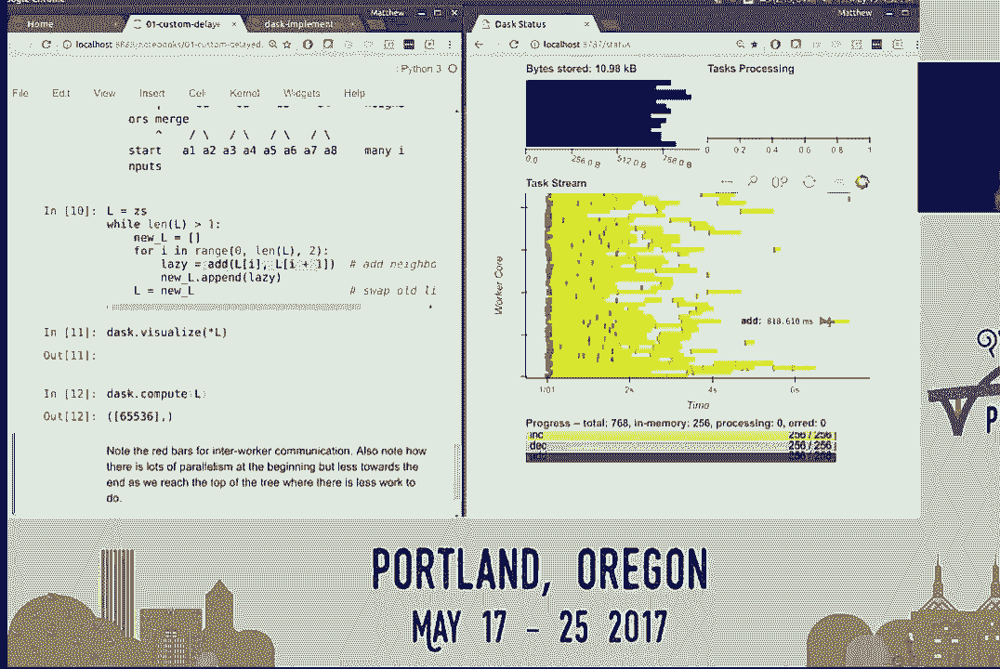

让我们回到幻灯片。让我们更深入地探讨 Dask 在做什么。让我们来解释任务。Dask 为你做两件事。第一，它生成任务。你编写数据框代码，它会找出执行该代码的配方。第二，给定这样的图和一个集群或笔记本电脑，它会找出如何并行执行该图。

这两种问题截然不同。实际上，numpy pandas 喜欢第一类问题，而 tornado。并发处理者则喜欢第二类问题。两件事情同时发生。我们谈论第一部分和第二部分。任务图。这个字体在后面可见吗？不。这是否意味着它不可见或者需要放大？可以的。我有些不好的感觉。

让我们看看我们能做些什么。揭示并不 -- 好吧。希望能稍微好一点。我认为这已经是我能做到的极限了。我们将进行一个简单的数组计算，看看 Dask 如何生成任务图。我正在使用 numpy 创建一个包含 15 个 1 的数组，使用 numpy 的 ones 函数。它会产生这样的结果。假设我在电脑上只有 20 字节，并将其分配到多台计算机之间。

然后我可能会使用 Dask array 的 ones 函数。我们仍在创建 15 个 1 的数组，但我们将其切割成三个数组。每个数组的块大小为 5。我们调用 numpy 的 ones 函数三次，生成三个 numpy 数组。如果我对这个数组调用求和，Dask 将知道我需要调用求和。以及所有的 numpy ones 函数数组。我们将对它们全部计算总和。

我们看到 numpy 代码生成任务图。如果我们转到二维，那就更有趣了。

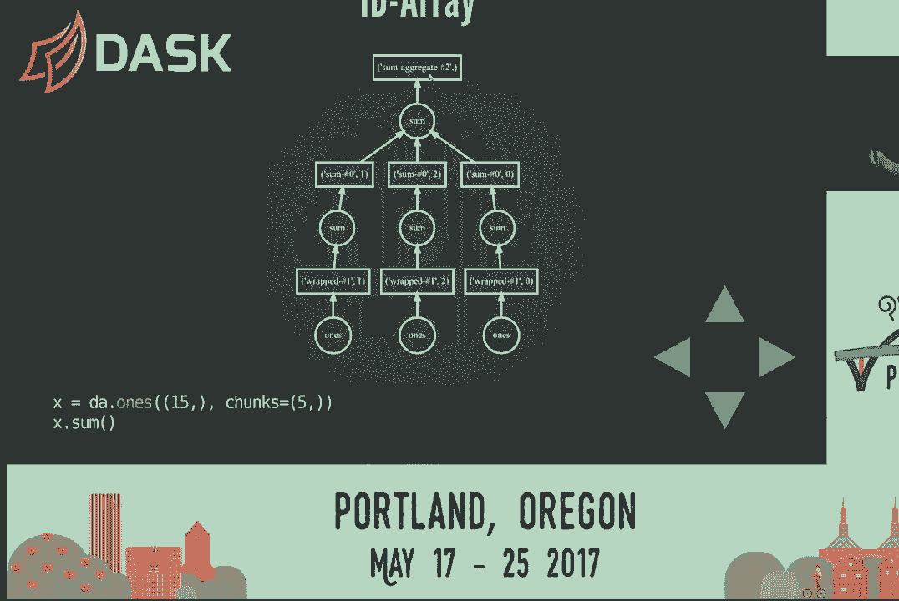

我正在创建一个 15 x 15 的数组，由大小为 5 x 5 的 numpy 数组组成。我有九个块。如果我在一个轴上求和，我会得到相同的求和行为。这是你可以用 Spark 的 NAPRODUCE 做的事情。Numpy 数组计算变得更复杂。将这个数组与其转置相加。

Numpy 用户会对奇数对角节点之间只与自己交流而非对角线节点与其转置邻居交流感兴趣。这种差异实际上在后面会提到。如果你看一下像 Spark 或 Storm 这样的数据库系统，当它们失去这些对称性时。

当你打破对称性时，这是非常好的。它处理通用情况。我们可以在复杂上工作。我们可以乘法运算。我们可以继续进行。这是一个简单的事情。如果你看看气候科学家，他们做的事情要复杂十倍百倍。他们生成带有数百万节点的图。我们已经制作了这个图。

现在让我们继续计算。又来了，哎呀。这根本没有顶起来。这个对象，为什么。仍然是懒惰的。我们还没有做任何工作。当我调用 white.compute 时，答案是零。答案为零并不令人惊讶。有趣的是，它在大约 47 毫秒内返回了答案。在这段时间里，四个线程遍历了这个任务图中的每个圆圈，执行了该函数。

将其传递给其他函数，运行这些函数，删除那些不需要做的规则，然后继续遍历该图。这大致就是任务调度程序所做的。执行图并给我们一个数字返回。理想情况下，在短时间内。我们支持那些坐在电脑前打字的互动用户。

等待结果返回。我们希望速度非常快。让我们继续。很好。系统喜欢请求一个写入者，让一个框架生成像这样的任务图。这实际上来自一个网站学习计算。调度程序并行执行该图。这是一个单台机器调度程序在四个线程中遍历该图的跟踪。

这是我们从 NumPy 的人转向更关注 Tornado 并发网络的人们的地方。我们如何高效地运行这些图？在讨论如何提出这个问题之前，我想简要总结一下 Python 领域内的其他选项，以激励我们为什么必须构建自己的东西。我们正在谈论几个简单的系统，比如多处理和并发未来。

大数据集合，如 Spark、Storm、Flink、数据库或 TensorFlow，然后是像 Luigi 或 Airflow 这样的任务调度程序。让我们考虑一下 map。谁以前使用过多处理？

很多人，几乎所有人，谁没有使用过多处理？抱歉让你举手。五个勇敢的人。也许还有一些不那么勇敢的人。所以我拿一个函数。我有一堆数据。我想把这个函数应用到所有数据上。多处理是一种非常简单的并行方式。多处理的优缺点。它非常容易安装。

它在标准库中使用。API 非常简单。它也是一个非常轻量级的依赖项。因为在标准库中，库并不介意依赖它。记住，这就是我们的目标之一。我们想构建一个许多生态系统中的库都愿意依赖的库。所有这些库以及更多的数千个，实际上都是愿意依赖它的。

他们愿意把它放在 requirements.txt 文件中。

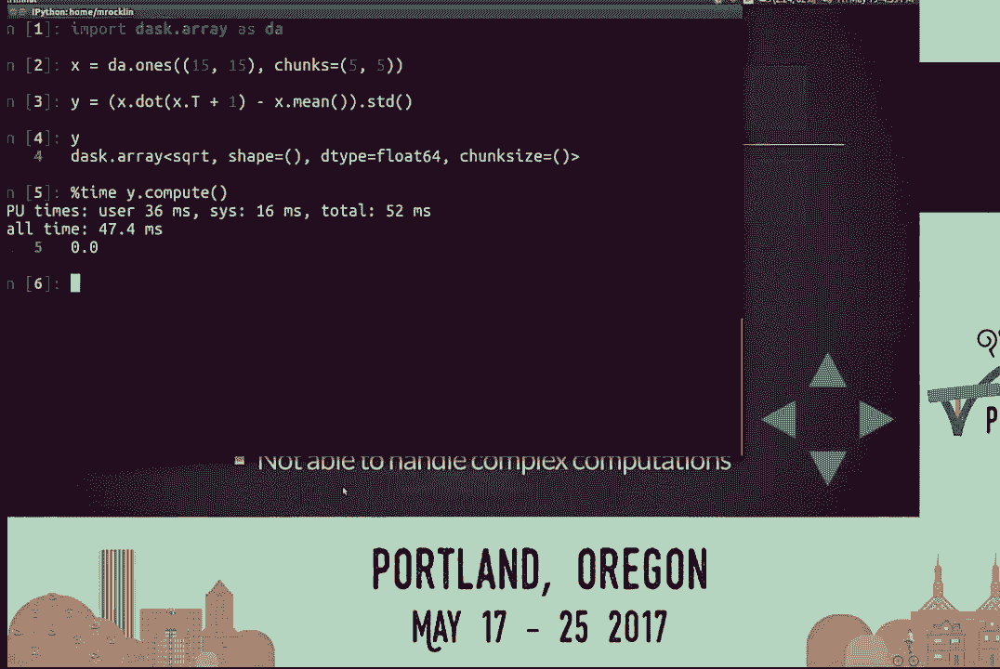

一些缺点。跨进程移动数据有一定成本。这很不幸。而且它也无法处理更复杂的计算。因此，我们所拥有的图中的 map 无法轻松处理这些。让我们看一些更复杂的东西。让我们看看大数据集合。像 Spark 或数据库这样的东西。

所以这些系统是一个巨大的进步。它们为你提供了一个固定的 API。像 map、filter、group by 和 join 这样的操作。你使用所有这些操作，而不仅仅是 map。它们会为你处理并行性。这使你能够并行化更广泛的一组应用，特别是许多这些都是为 ETL 或数据提取和清洗等实现的。

数据库计算或一些轻量级机器学习。使用这些系统你可以做到所有这些。因此，你可以使用更广泛的 API，比如 SQL 语言。它的扩展性很好，并且在企业中广泛可信。因此，我要摘下我的开源社区帽子，戴上盈利的邪恶帽子。

我也喜欢，你知道，desk 是开源和免费的。但付费给开发者来做这件事还是很不错的。我们能让更多人使用 desk，并且说服他们帮助我们付费开发者改进它，这样我其实对此有一点关心。我有点邪恶，为此我道歉。好吧。[笑]，那么这些系统的一些缺点是，它们有点笨重。

所以说服库依赖于 Spark 会有点困难。存在这种大的转变，你必须在 Spark 世界中停留一段时间，进行计算后再走出来。这因几个原因而不愉快。它专注于 JVM。Python 总是处于第二公民的地位。这对于大多数并行计算库而言都是事实。

你知道，Storm，Flink。它们通常是建立在 JVM 栈之上，借助其成功。此外，这些系统无法处理非常复杂的计算。现在，我所说的是什么？

我是说我们之前看到的图。这些图没有太多对称性，有些是任意的动态任务图。这里的每个圆圈都是一个需要在一块数据上运行的 Python 函数。所以，它们无法处理这些情况。像 Spark 这样的数据库系统通常擅长在许多事物上映射一个函数。

所有的打乱通信、减少东西，但总是有点锁住。它不是一种细粒度的处理。我们需要进行一些更复杂的计算，它们需要处理，以支持所有这些库。然而，也有一些库可以处理更复杂的计算。

这些系统实际上在数据工程领域中常用。像 Airflow、Luigi 或 Celery 这样的库。房间里有谁使用过这些库？好吧。那实际上很棒。在 SciPy 或 PyDotox 等会议上并不是这样。因此，这些库能够处理更复杂、更加任意的任务图。

它们适合我们需要的模型。它们通常也是 Python 原生的。所以，你知道。这些是我们可以进行修改的库，我们的社区愿意依赖它们。从这个意义上来说，它们更好。然而，也有一些缺点。没有内部工作存储或通信。延迟相对较高。因此。

对于这些库来说，任务之间的 100 毫秒是可以接受的，但对我们来说则不行。我们工作的时间尺度大约在毫秒到 100 微秒之间。我们并未针对计算进行优化。不过，它们在许多 Dask 不做的事情上进行了优化。我并不想贬低这两个库。

Spark、Luigi 和 Airflow 执行许多 Dask 无法做到的事情，但 Dask 在它们之间的混合方面表现良好。所以，我们想要一个像 Airflow 和 Luigi 那样的任务调度器，但它更专注于计算，像 Spark 或 Flink TensorFlow 那样。结果是这样的——

我们试图构建的系统称为 Dask，因此，我们已经看到了 Dask 数据框和 Dask 数组，这些都是基于 Dask 构建的东西。这并不是 Dask。Dask 本质上是一个动态任务调度器。因此，它获取一个任务图，就像你在复杂情况下给 Luigi 的那样，并在并行硬件上执行这些任务，可能是你的笔记本电脑，也可能是一个集群。

我们在多种方面相对较快。我们没有 MPI 那么快，但比大多数其他东西快。而且，它轻量，稍后我们会看到，而且支持良好。所以，我将稍微谈谈任务调度器。Dask 世界中有两个主要的任务调度器。

有一个多年前为单机构建的调度器。它通常在线程池或多处理池之上运行，且运行时开销非常低。它实际上只依赖于约 50 微秒的任务开销。它很快，能够处理任意图。

它相对简洁。代码大约有 1,000 行的三分之一。它实际上只依赖于标准库。所以，即使是非常保守的库也愿意依赖这段代码。它一直很稳定，变化不大，长时间以来人们都不想更改这段代码。

这是一个稳定的代码，它轻量且易于使用。许多团队在不同的应用程序中使用它。这些调度器的应用多样性非常广泛。所以，如果你有一个不同的应用程序，它也很可能有效。

它们并不是针对数组计算或数据框计算进行优化的，而是针对一般计算进行优化。大约一年半前，我们开始构建一个更复杂的分布式集群调度器，但也稍微重一些。这是一个 tornado TCP 应用，简洁性稍低。

它是完全异步的。所以，你可以在它运行的同时提交图形。你可以得到一种持续的双向对话。它支持 HDFS 空间、Hadoop 空间，同时也支持更传统的集群 HBC 空间。所以，当你看到集群上运行的东西时，我们正在运行这个分布式调度器。

它的组织方式是，在你的集群的某个地方有一个单独的进程在运行，那就是调度程序。所以，它可能被称为主节点或头节点。这个进程将协调你集群中的所有其他进程。然后会有很多工作节点从那个调度程序获取指令。所以。

调度程序可能会说：“嘿，工作节点一，我想让你计算这个任务。”工作节点将计算这个任务并保留结果，并通知调度程序它已经完成。工作节点将点对点通信以共享数据，因此它们不是通过一个中心瓶颈进行通信。然后我们作为客户端。

从我们的，你知道，可能是从我们的 Jupyter Notebooks 或我们正在运行的一些脚本中下来。你知道，夜间或其他什么，我们接下来会将图形提交给那个调度程序。所以，工作节点和调度程序都是 TCP 服务器。它们通过各种有趣的协议进行通信。

客户端只是一个到调度程序的客户端。所以，你可以相对容易地设置这个。你可以像我之前那样在你的笔记本电脑上安装它。你可以在集群上运行它。它也相对轻量。所以，在底部。我实际上只是在一个进程内部运行它。我可以启动这个。

包括精美的仪表板和所有内容。总共 43 毫秒。所以，你可以导入这个。你可以运行它。你可以拆除它。而且这不是一件大事。它很便宜。你不应该把分布式计算视为一个遥不可及的难题。这就像，导入 pandas 比这慢。这花费大约 200 毫秒。所以。

你应该把这看作是一件便宜的事情。如果你不喜欢 Kanda，你也可以将这个固定到所有请求。所有东西都是纯 Python。所以。我将要快速浏览这段时间，我不会详细讲解。但这展示了调度程序在一个简单示例中可能如何工作。所以。

DAS 易于使用和采用。你已经知道 DAS 提供的许多 API。没有单一的 DASK API。我们大多数情况下借用了其他语言或其他项目的 API。你可能已经安装了依赖项。你可能安装了 tornado。你可能安装了 message pack。如果你想要，知道，DAS 数据框，你需要 pandas。

但你可能已经安装了它。

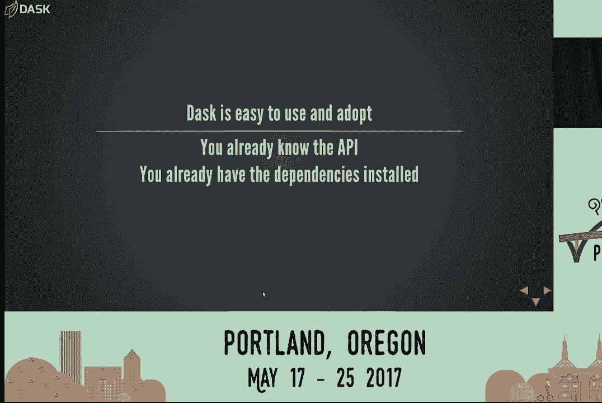

如果你确实想要。所以，为了提高采用率。为了减少创造性的工作量，我们必须做到。DASK 在很大程度上使用现有的 Python API。因此，我们支持许多 NumPy 和 Pandas API 及其存在的协议。我们支持 PEP 31-48，也就是并发未来。如果你熟悉那个库。

DASK 完美支持这一点。我们也做 async await。如果你喜欢并发异步工作。它也会使用 job.lib。因此，你实际上可以使用现有的 scikit-learn 代码，并且在 joblib 中有一种方法，joblib 是 scikit-learn 的并行库，可以劫持它的并行方式。你可以在集群上运行你的 scikit-learn 代码。它可能在所有情况下都不是很好用。但我们。

你知道，哪里有一个现有的并行计算和 Python 的协议。我们通常会实现它。因此，你可能已经知道如何使用 DASK。你可能也知道，它非常轻量。你们可以说，只是使用现有的库。让我们看看，嗯，花一点时间。让我们看看这些 API。再一次。

我们看到，你知道，如果你知道 NumPy，你可能知道如何使用 DASK 数组。这里是 scikit-learn 的一个例子。这来自，这个是 scikit-learn 文档的一个例子。你知道，有人，所以我们正在创建一个管道。我们将在那个管道上进行交叉验证网格搜索。只是普通的 scikit-learn 代码。

而且它花了。或者，八秒或九秒。现在有一个人，他的名字叫 Jim Christ。一个词库，一个 DASK 搜索 CV，它是网格搜索的直接替代品。因此。现在当你运行它时，它将在我们自己的集群上运行。看起来就是这样。我们使用所有的 scikit-learn API。因此，它看起来，嗯，它也适合现有的工作。

它运行得更快。我们也注意到，这里有很多空白。我们的许多工作者没有在做任何事情。因此，现在我们有了更多的计算能力。让我们继续，增加一下。我们将增加参数搜索空间。如果你不知道 scikit-learn，没关系。你只需理解我在增加输入，我们会得到更多的工作。

而且它不会慢。因此，现在我们有了更多的工作，更多的计算能力。我们将更好地搜索这个空间。再一次。如果你知道 scikit-learn，这对你应该相当熟悉。因此，DASK 的许多工作只是帮助其他库使用那些相同的接口进行并行化。

DAS 支持并发未来接口。因此，在这里我们可以，嗯，做执行的.submit 模型。它实际上是完全异步的。因此，像工作进来时。你可以以完全实时的方式提交更多工作，这很有趣。我们做类似 async await 的事情。因此，嗯，这是，完全异步的事情，你知道。

你看到的所有那种 Python 代码。除了像 import DASK 语句之外，你在这个笔记本上看到的代码，你都不会认为是 DASK 代码。它都是你之前见过的那种代码。但它都是以很好的方式并行化的。

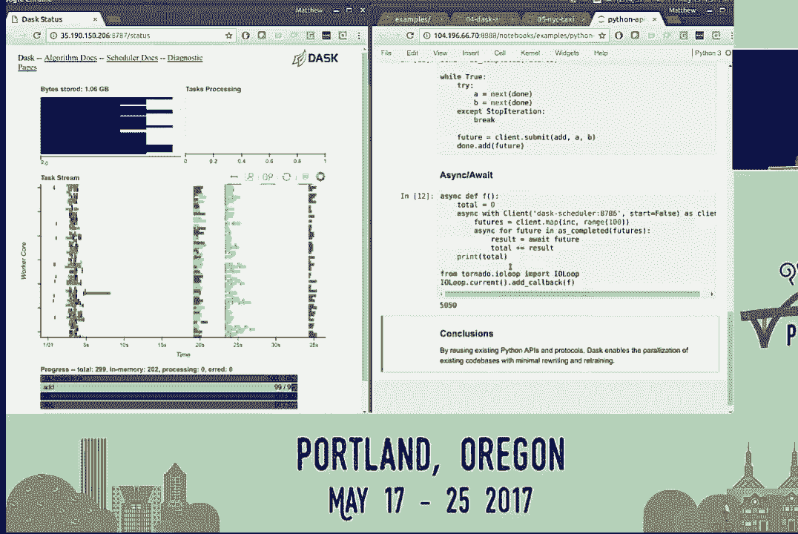

这再次是 DASK 的目标之一。好吧，从高层次来看，DASK 为你提供了并行 API。并行 pandas、并行 mumpy、并行 second-learn。所有这些只是一个子集，并不是完整的。它在并行化现有的自定义系统方面也非常出色。在低层次上，DASK 是一个任务调度器，这意味着它在 Python OAuth 上运行 Python 函数。

它在并行硬件上对 Python 对象进行操作。嗯，这些 Python 函数就是 Python 对象，它取决于你。它可以是你自己特殊的对象，或你自己特殊的函数。DASK 并不需要知道这是什么。它可以直接运行，并且会弄清楚在哪里和何时运行这些函数。

如果机器崩溃，它会将其恢复。所有这些优雅的并行性特性。好吧，我想花几分钟时间谈谈一些一般的生态系统评论。因此，我通常是一个相当批评或悲观的人。我道歉，但我想稍微夸赞一下。所以，我认为 Python 生态系统真的是构建这类项目的最佳地方。

我们构建 DASK 的过程远比你想象的要容易得多。这得益于生态系统中已经完成的所有工作。

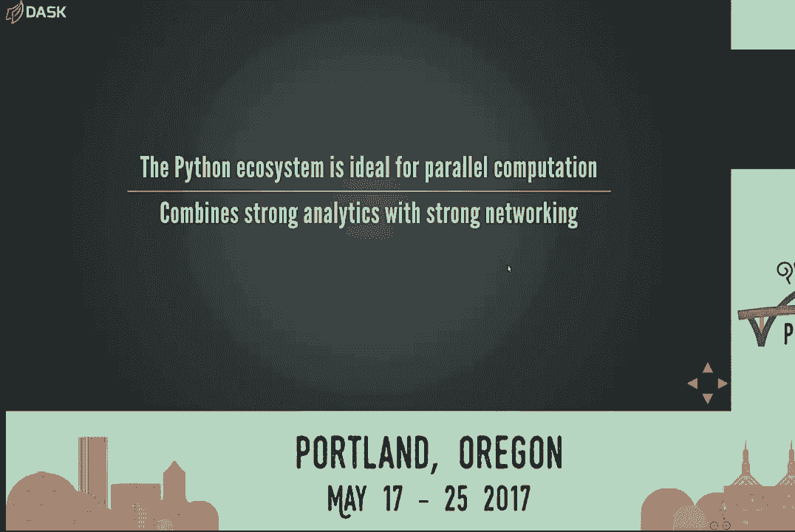

那么，让我们从并行数据分析的角度来看看 Python 的优缺点。Python 有着非常强大的算法传统。那些用打孔卡或 Fortran 编写代码的社区已经转向 Python。他们知道如何非常非常好地完成这些事情。他们非常了解算法。

他们知道自己有数学或其他领域的博士学位。很多人在 Fortran 代码上经过了激烈的磨练。这个非常高效。他们使用你 CPU 上最好的 SSE2 指令。我们还拥有一个非常强大的网络货币栈。而且在同一种语言中同时具备这两者是非常罕见的。

我们在教学中也有非常标准的方式。所以，很多人在使用 Python。缺点，我认为，并不是那么真实。人们认为 Python 很慢。还有 Gil。这些都是关于打包的问题。因此，我对这件事做了一些评论。NumPy 和 Py—在 Python 上的 C 类数值栈是非常非常快的。

它运行在裸金属速度上。所以，我这里有一个 1,000 乘 1,000 的数组，我正在进行矩阵乘法。这个计算中大约有十亿次乘法和加法。我们在大约 70 毫秒内完成了它。这相当于每秒约 100 亿次操作。我想到了我的笔记本电脑。我的笔记本电脑的处理器只有两到三吉赫兹。

实际上，我执行的加法操作比系统中的周期还要多。如果你了解 CPU，这不会让你感到惊讶。但我们正在以裸金属速度运行。Gil。人们通常会担心并行性和 Gil。再说一次，对于数值栈，这实际上并不重要。如果你主要运行与 NumPy 等库相关的数值代码，Gil 就不是问题。

和 Pandas 以及 scikit-learn。所以，Gil 阻止两个 Python 线程同时操作。但是——或者说两个 Python 线程实际上是同时使用 Python 代码。但我们的线程只是调用一些 C 函数，然后在函数返回之前等待。所以，我们实际上并没有调用 Python 代码。我们在调用 C 或 Fortran 代码。

如果你使用 NumPy 或 Pandas 等栈，你可以轻松地用多个线程运行 Python，并充分利用你的硬件。你应该自由地使用线程，除非你在做，知道的，Python 的极端操作。但是使用线程，你知道的，只是一般评论。与此同时，还有一个完全不同的社区。

同时构建出一个非常强大且直观的并发网络栈。所以，这里有一些代码，你知道的，类似于你可能在一组桌面中看到的。做了很多并发的事情。你现在可能会用一个单一的等待来写这个。我会问你。使用 tornado。这段代码看起来很简单。理解起来很容易。

这实际上是非常显著的。十年前情况可不是这样的。同时，它的速度也相当快。

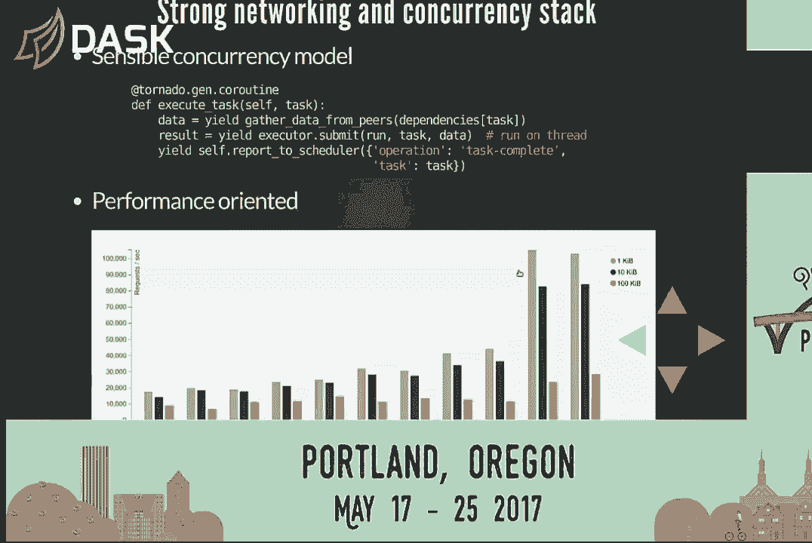

这是关于 UV loop 的一篇博客文章。让我看看我能否把那个链接放进去。谈论你知道的，各种 UV loops，各种事件循环。这实际上是在 tornado 上运行的，这在这里很下方。但是即使如此，它每秒也处理 20,000 个 TCP 请求，这对我们来说完全可以。所以。

这个社区也非常专注于性能。不是以数字计算的方式，而是以并发的方式。

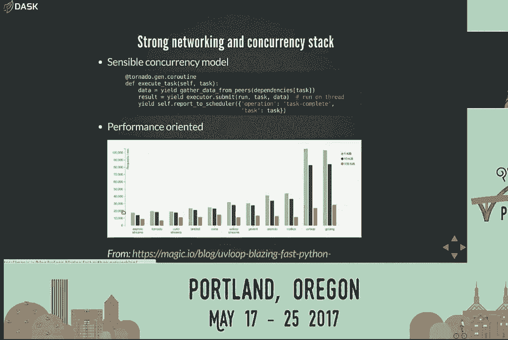

所以，Python 既是一个优秀的数字计算栈，也是一个优秀的并发网络栈。这实际上是相当罕见的。我们能有这两组人一起，真的是一种福气。正因为如此，desk 的构建变得非常容易。因此，构建 desk 的大部分工作都是已经完成的。

你们在五或十年前所做的。所以，我非常感谢你们的努力。

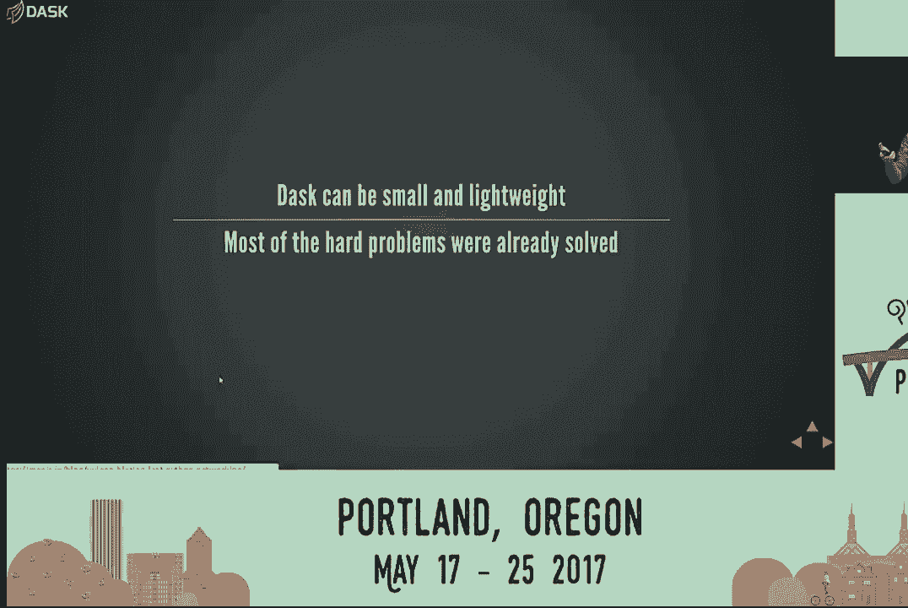

为了节省时间，我要停止了。但是很多人都在为 desk 工作。不仅仅是我。还有各种政府组织和非营利机构资助 desk。我们也想感谢他们。是的，过去 48 小时的参与情况。这些项目也在 GitHub 上提到或承诺使用 desk 的代码。

所以，看到这一点还是挺不错的。好的。谢谢。[鼓掌]。我们还有大约五分钟的时间来提问。所以，如果你可以排队到麦克风旁。好的。有一个 C API 吗？没有 C API。Python，或者说 desk 是一个 Python 项目。好的。所以，假设我有一些代码，它是一个无包装的 swig，并且它接收一个 NumPy。

或者一个 NumPy 数组。它是否也可能在桌面数组上操作，并仍然利用该功能？还是完全不可行？所以，桌面数组并没有实现 NumPy 低级 ABI 接口。好的。但是，如果你有一个函数，因为一个桌面是由任何 NumPy 数组组成的，你可能能够将你的函数应用于它们所有，具体取决于你的函数的作用。

好的。谢谢你。在你的演示中，你作为单个客户端操作你的集群。如果有多个客户端竞争集群的资源，表现如何？是的。所以，一个桌面集群可以有多个客户端在同一数据上工作。桌面图或一个 Merkle 标签。如果你知道这意味着什么，你会很棒。所以，它可以很好地共享。

话虽如此，大多数进行多客户端工作负载的人最终会分配单独的调度器和工作节点。很好。谢谢。桌面对任务图是否做了任何优化？

这现在是项目的优先事项吗？是的。所以，我们进行的优化都是线性的。因此，你会在普通编译器中看到的那种东西，但没有复杂的那种。因此，特别是，我们不做任何数据帧优化，比如排序或重排序。

因为在任务图层面，我们已经失去了那种信息。但循环融合，你知道，那些操作我们做得很好，调用图。是的。你有没有考虑过或使用 OpenCL 或 CUDA 来实现更高的并行化？在 GPU 上？呃，没有，但你可以在你的 Python 函数中。然后。

桌面可以在配备 GPU 的各种机器上运行 Python 函数。所以，桌面在 Python 对象上运行 Python 函数。这些 Python 函数的作用完全取决于用户。你可以注释说你图中的某些工作节点有 GPU，桌面会尊重这一点并相应分配。但我们实际上不使用 CUDA 来执行我们的并行性。好的。

谢谢。调度能利用任何数据局部性吗？

假设这个节点有这一组文件。所以，是的。[笑]在许多方面，是的。在你传递的函数内部，有什么限制吗？如果这是一个自定义函数？抱歉，第二次请。你在传递的函数内部能做的事情有什么限制吗？

分布式工作负载系统？嗯，你的函数必须可以用 Cloud Pickle 序列化。因此，你不能传递锁或打开的文件。嗯。你的函数不应该改变给定的状态。呃，所以一般来说，为了有弹性，我们必须假设这一点。嗯，你不应该调用我们来 segift，但除此之外。

即使那样也不错。就像我们从中覆盖的那样，完全可以。好吧。谢谢。好，再来一个，然后我们就得加了。它能扩展到多大？像。你运行过的最大集群是什么？你尝试过哪些超级庞大的工作负载？

我接触过的最大集群是千台奇怪的 Windows 机器。嗯，嗯，呃。你脑海中需要记住的数字是每个任务大约需要 200 微秒的开销在调度器内部。所以如果你的任务每个大约需要一秒，你可以饱和大约 5,000 个核心。这大致是你需要记住的数字。

但千台机器实际上是我所见的。实际上我见过有人尝试更大的集群，但失败了。不过我假设如果你有 100,000 台，你会遇到一些问题。谢谢大家的时间。[掌声]。

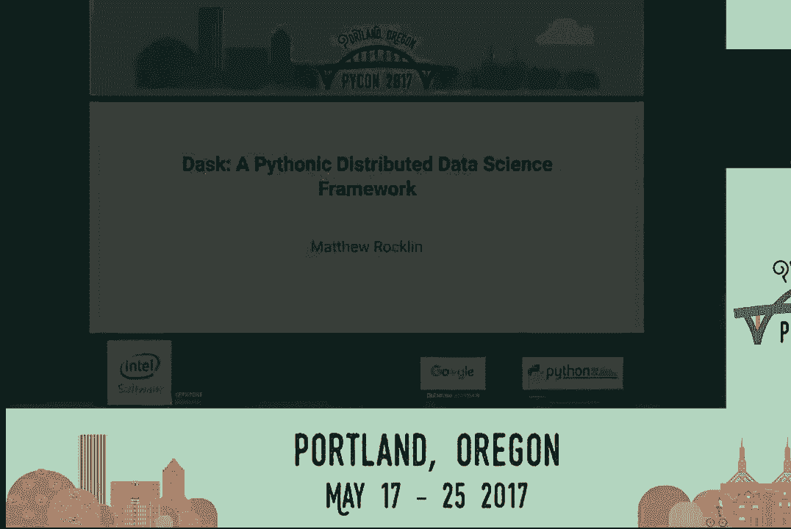

[沉默]。

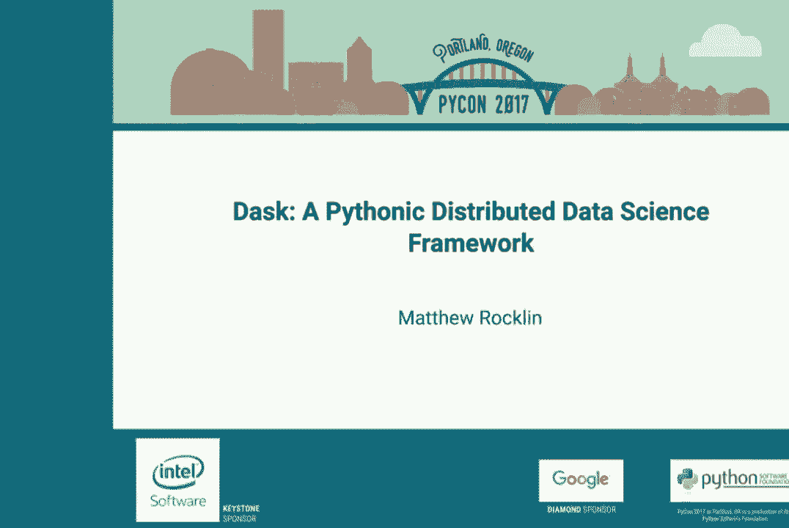
