# P9：Jake Vanderplas - 主题演讲 - PyCon 2017 - 哒哒哒儿尔 - BV1Ms411H7jG

[掌声]，来吧，拿这个。好的，我想我该上场了。大家好。很高兴在这里。

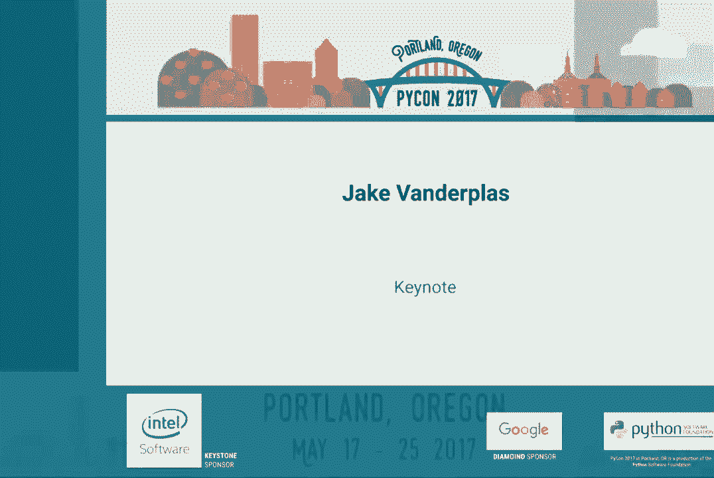

我叫 Jake Vanderplaas。在思考这个演讲时，我回忆起我参加的其他 PyCon。这是我连续第六次参加。回想起五年前，在 2012 年，我是一个蓬头垢面的，饥肠辘辘的博士生。我是以 PSF 的旅行奖学金来到 PyCon 的。

这是我第一次参加这样的大型会议。我被演讲的质量和我遇到的人深深震撼。我已经使用 Python 多年，能够与像 NumPy、SciPy 和 IPython 这些库的作者握手。

我在工作中使用的所有这些工具让我震撼。我真的没有想过会有机会站在这里与你们交流。这对我来说，真的非常非常荣幸。所以我想感谢 PSF 五年前给我这个机会。

我要感谢 Brandon 和组织者今天给我机会与大家分享我想说的话。在我在 PyCon 的经历中，浮现在我脑海中的一件事是，PyCon 在某种程度上像一个马赛克。如果你参加像 SciPy 会议、DjangoCon、PiData、AnacondaCon、JupyterCon 或其他会议。

你会得到 Python 社区的一个特定片段。但在 PyCon，你能接触到每一个人。这很有趣。每个我们 Python 社区的小片段都有自己使用语言的方式，喜欢使用的工具以及解决问题的方法。几年前，我对此有了更深刻的认识。

我发现自己在一次 PyCon 的聚餐中，坐在一个在 Python 社区颇有名望的人旁边。你可能知道我是 Jupyter Notebook 和 IPython Notebook 等工具的粉丝。那时，我坐在桌子旁，这个人说，哦，是的，你知道，IPython。它太臃肿了。

这鼓励了不良的软件实践。我当时在想，我的第一反应是有点防御。我做了我家庭教养下的事情，转移了话题，避免了对抗。但后来我意识到，这并不是一次攻击或防御的时刻。

这是一个反映出那个人使用 Python 的方式与我不同的时刻。而 Jupyter 对我来说是合理的，但可能对他来说并不合适。我认为，在这个周末，我们有一个很好的机会与其他以不同方式使用这种语言的人交流。

所以在我们继续前进时，请你牢记这个 Python Mosaic。那么，我是谁呢？

我是 Jake VDP，你可以在互联网上找到我，使用这个名字。现在关于我最重要的事情是。

这个小家伙就是这里提到的。因此，在四周前，我和我的妻子接到了我们等待已久的电话，但仍然有些措手不及。这个小女孩那天早上出生，需要一个家庭来照顾她。因此，我的工作相对灵活。

在过去的四周里，我一直在家休陪产假，像疯狂地在瓶子和尿布之间编写 PyCon 幻灯片，这真是太棒了。因此，特别感谢我的妻子今天请假在家陪孩子，让我能在这里。

这太棒了。是的，在 Python 世界里，你可能认识我。我有时写这个博客。我为 SciPy、SecutLearn、Astropie 等一些包贡献了很多代码。我还写了几本书，如果你想，可以查看一下。让我能够做到这一切工作的一个重要原因。

我有一位很棒的雇主，他支持我每天编写代码，并开发这些类型的库。华盛顿大学电子科学研究所是个有趣的工作地方。我能够把时间花在研究、编码以及帮助华盛顿大学的研究人员身上。

更有效地利用他们的数据和计算资源。而我能够做到这一点的一个重要原因是——我必须向摩尔基金会、斯隆基金会和华盛顿研究基金会致敬，因为他们支持我几乎所有的工作和我任何开源贡献。

你可以想象他们是在其背后。因此，关于我还有一件事是，我是一名天文学家。我以天文学家的视角来参与这个讲座。所以今天我想稍微谈一下，作为天文学家和科学家，我是如何使用 Python 的。这可能与你使用 Python 的方式以及你使用的工具有所不同。

但我想提供一些视角，说明是什么吸引科学家选择 Python。

以如此大的数量。因此，当我说我是天文学家时，很多人会脑海中浮现这样的形象。这是埃德温·哈勃在施密特望远镜前，1940 年代的情景。你可能知道哈勃，因为以他命名的著名望远镜。他是 20 世纪初发现宇宙膨胀的科学家之一。

这是一种美好的浪漫天文观，想象一个年长的天文学家，嘴里叼着烟斗，透过目镜观察。但在我十年的专业天文学生涯中，老实说，我从未真正通过望远镜观察过。说实话，专业天文学家看待世界的方式。

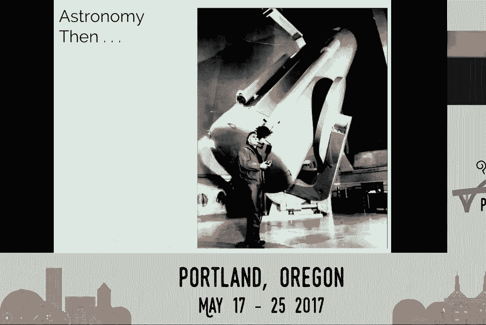

当然，这是通过数据库查询实现的。因为我们有这么多出色的仪器在外面，以巨大的速度测量数据。我想强调其中两个在过去 20 到 25 年中非常重要的。一个是哈勃太空望远镜，你可能听说过。另一个是斯隆数字天空调查，我认为。

可能更少的人听说过。

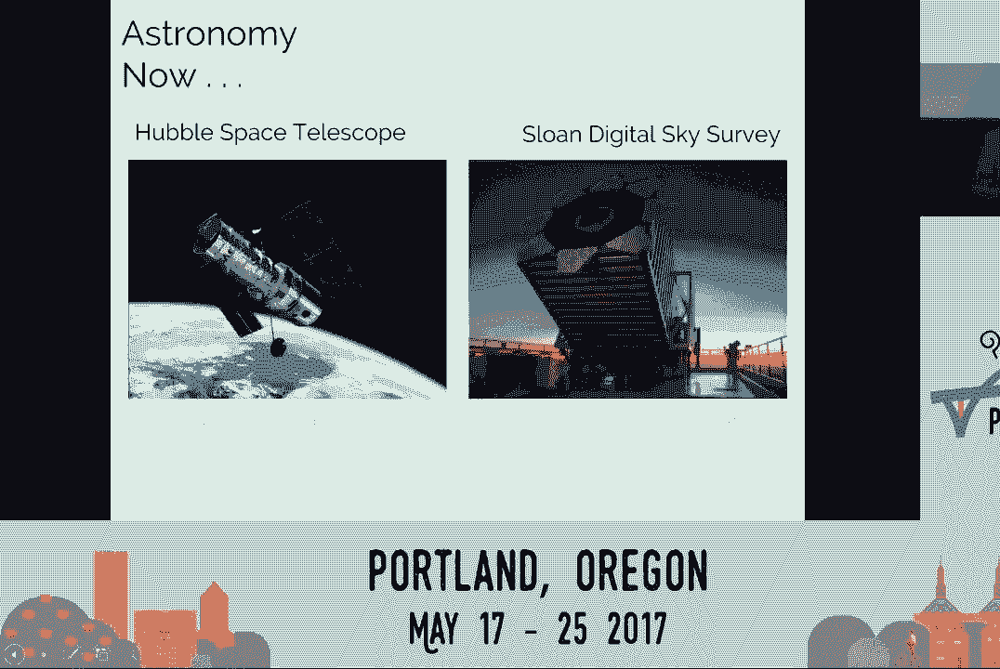

哈勃太空望远镜自 1990 年以来，一直在地球轨道飞行，拍摄宇宙的惊人照片。这是我最喜欢的之一。这被称为超深场。这是哈勃观察的一小片天空，视场大约是满月直径的十分之一。

在那片小小的天空中，整合了数小时的观察，以捕捉足够的光子来创建这个图像。你在图像中看到的每一个斑点，除了可能两三个，是一个遥远的星系。它是数十亿颗恒星的集合。

那些星系就在宇宙中，距离我们可能有 130 亿光年或更远。因此，你现在在这些图片中看到的一些斑点，都是来自宇宙早期的星系。我们可以收集到这些光，并了解我们的星星来自何方，我们的星系来自何方，以及种类。

关于宇宙的整体动态。哈勃在教会我们这些事物方面表现得非常出色，关于早期宇宙以及非常细致的事物。一个互补的方法是斯隆数字天空调查所做的。我这里展示的是星系目录。

来自斯隆数字天空调查。斯隆调查与哈勃只观察天空中的一个小点不同，它扫描了整个天空，历时十年，能够对那里每个物体进行光谱测量。因此在这个图中，你所看到的是位置。

我们宇宙中星系的三维位置。我们正处于原点，正位于中心，向外看，那些弧形就是斯隆能够观察到的天空的一部分。而天文学家们能够做到的，就是观察这一点，看到星系并没有均匀分布。

这里有很多的团块、簇、丝状结构和空洞。关于星系空间分布的信息中，编码了关于宇宙整体的信息。物质有多少，暗能量有多少，暗物质又有多少。

因此，我们能够通过来自斯隆调查的这个庞大数据集来实现这一点。那些望远镜有点老旧，是在 90 年代发射的。近年来，现代科学的发展则依赖于一些其他的望远镜。我想强调的一个是开普勒项目。你可能听说过开普勒项目。

因为最近有很多新闻发布。

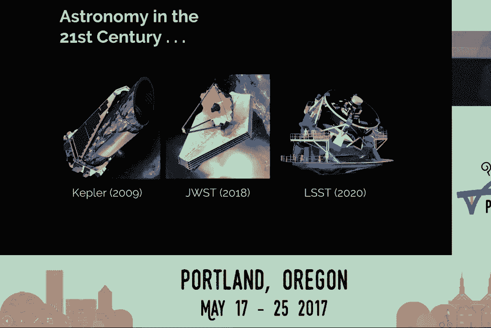

像这样的图像，对吧？这是特拉普斯特一号系。实际上不是由开普勒发现的，而是由特拉普斯特望远镜发现的。但它的特别之处在于这是一颗几光年外的小星星，周围有七颗小型岩石行星。我们已经能够。

利用这些望远镜，我们已经能够发现围绕其他恒星旋转的行星，并开始思考，这些行星可能是什么样子的。这些行星之所以特别，是因为其中几个处于所谓的可居住区。天文学家将可居住区定义为液态水能够存在的太空区域。

因为我们没有其他好的定义，来说明生命可能是什么样子。因此我们认为，水是一个不错的搜索目标。但像这样的图片，这些艺术家创作的图像，有点具有误导性。你在像这样的行星或系统上获得的实际数据看起来是这样的。这就是我们通过开普勒所观察到的。

这是对特拉普斯特系统的 K2 观测。让我来描述一下你在这里看到的内容。你看到的是一颗单一的星星，它在像素之间摇摆，因为开普勒上的一个稳定器坏了，因此它随着时间的推移有些摇晃。而你在这里寻找的信号，正是这些行星。

你可以看到这些行星在掩蔽星星时的情形。因此，星星的亮度在此时，行星会在它前面经过。随着行星的经过，星星的亮度会略微下降。而这种低于百分之一的下降，正是我们在这些数据中寻找行星的关键。而现在这非常困难，因为你有仪器噪声。这是一颗微弱的星星。

你会发现星星本身是多变的。它上面有星斑，存在太阳耀斑以及其他所有这些现象。因此，你实际上可以通过这个极其复杂的统计建模，提取出这些行星，了解系统及行星的物理参数。

随着它们的运行，以及我们对其运作方式的了解。因此，寻找这些类型的系统归结为编写统计代码和非常复杂的数据处理管道。如果我告诉你这一点，希望你不会感到惊讶。

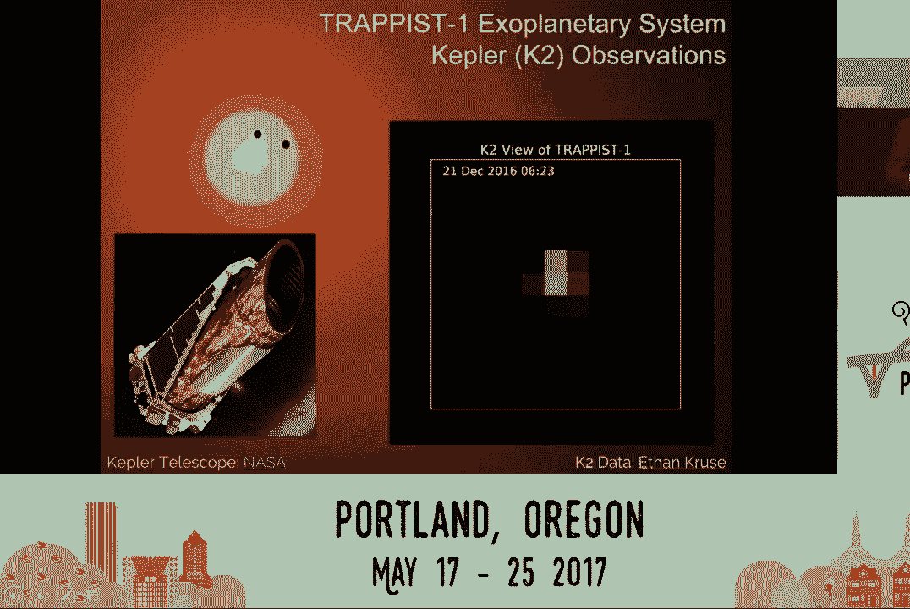

开普勒所使用的是在 GitHub 上的 Python 代码。因此，如果你想查看用于这些数据处理的一些代码，你实际上可以去开放源代码中看到。这是我稍后会提到的，这是来自科学界的一个成果。

接纳 Python 社区的规范。我想告诉你另一个望远镜——这就是詹姆斯·韦伯太空望远镜。这实际上不是望远镜，而是一个比例模型。因此，这个望远镜是哈勃的替代品。哈勃已经在太空中运行了 27 年，历程漫长，但它很快就会耗尽能量，我们需要其他东西来替代它。

詹姆斯·韦伯将要发射到太空，并且它有一个巨大的镜子。哈勃的镜子大约是一个人的大小，而詹姆斯·韦伯的镜子直径大约是其三倍。詹姆斯·韦伯望远镜的另一个不同之处在于，一旦它在太空中，就不会像我们的眼睛所能看到的红色、绿色和蓝色那样对可见光敏感。

它更适合红外光。因此，光的波长比我们可以看到的红光稍长一些。这一点很重要，因为在红外线和詹姆斯·韦伯所具备的那种精确度下，我们可能能够实际成像那些系外行星。

正在其他恒星周围运行的行星。因此，与其仅仅看到它们在恒星前方的阴影，我们实际上可能能够看到一些行星本身。其中一个最令人兴奋的前景是，观察詹姆斯·韦伯能够进行的光谱测量。这是当你将光分解为其组成波长，并观察波长流量分布时的光谱。

我们将能够看到的是，当这些行星在恒星前方移动时，我们能够隔离出经过该行星大气层的光的成分。寻找光中的分子吸收。

然后推断大气的分子成分。这是非常令人兴奋的，这在系外行星科学中几乎是圣杯。我们实际上将能够知道这些行星的组成。而且有些事情虽然很困难，但如果你观察宇宙中存在的行星和大气中的气体类型。

有些东西是永远不会出现的，比如氧气和臭氧。这些氧气和臭氧是没有已知地球物理来源的物质。它们只来自生物，只来自基本上是细菌、植物和生物体的东西。因此，在接下来的五到十年里，我们有小概率能够嗅出。

一个行星的化学成分围绕另一颗恒星。如果我们看到像臭氧层这样的东西，这将是一个非常好的迹象，表明那颗行星上至少有某种细菌生命。我觉得这非常令人兴奋，对吧？我认为以这种方式探索宇宙是非常重要的。再一次，如果你想知道我们在天文学的每个部分是如何做的。

处理这些数据，JWST 以及整个空间望远镜科学研究所已经转向使用 Python 和 Jupyter 笔记本来展示他们的材料。这真是非常令人惊叹。

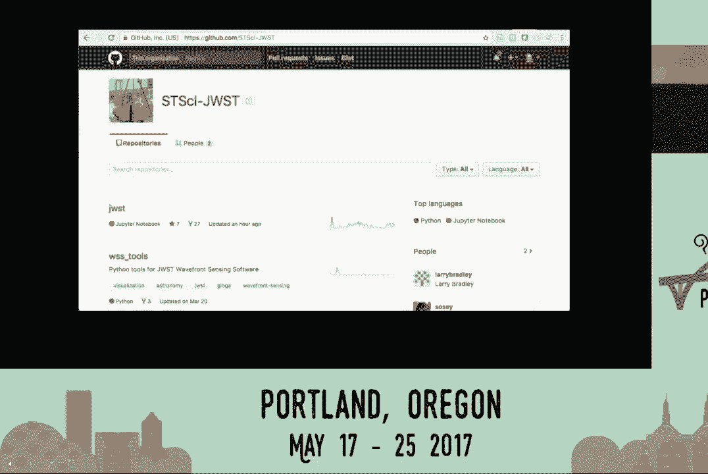

我想简要告诉你最后一个项目。这是一个将在未来十年内真正改变天文学各个领域的项目。这是我的博士导师从一开始就密切参与的事情。所以作为研究生，我能够参与这个项目的很多方面。

这是一个大型综合巡天望远镜。所以我不知道你是否能看到，但那里有一个小人的图像，对吧？所以这大约就是望远镜的大小。这将是一个大型地面望远镜。

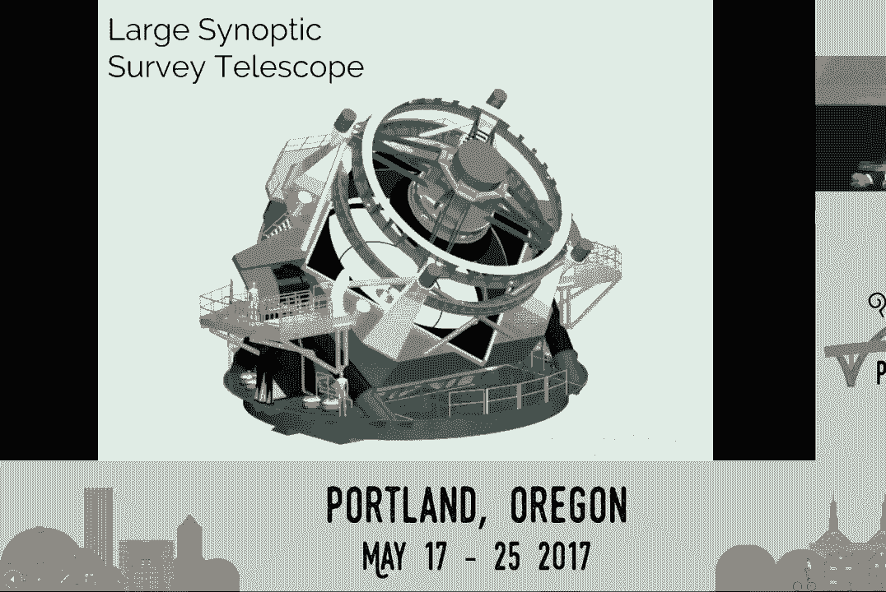

它并不在太空中飞行。这是几年前镜面空白的照片，拍摄于他们开始与 LSST 团队打磨之前。对于这么大的镜子，你需要一个非常大的相机。因此，LSST 正在建造有史以来最大的数字相机。这是一台三千兆像素的相机，CCD 大约有一个人那么大。

为了给你一个视场的概念，我们有一张月球的图像，叠加在 CCD 芯片上。这实在是巨大得令人难以置信，对吧？

三千兆像素。如果你想象一下高清电视，那差不多是 2000 乘 1000。

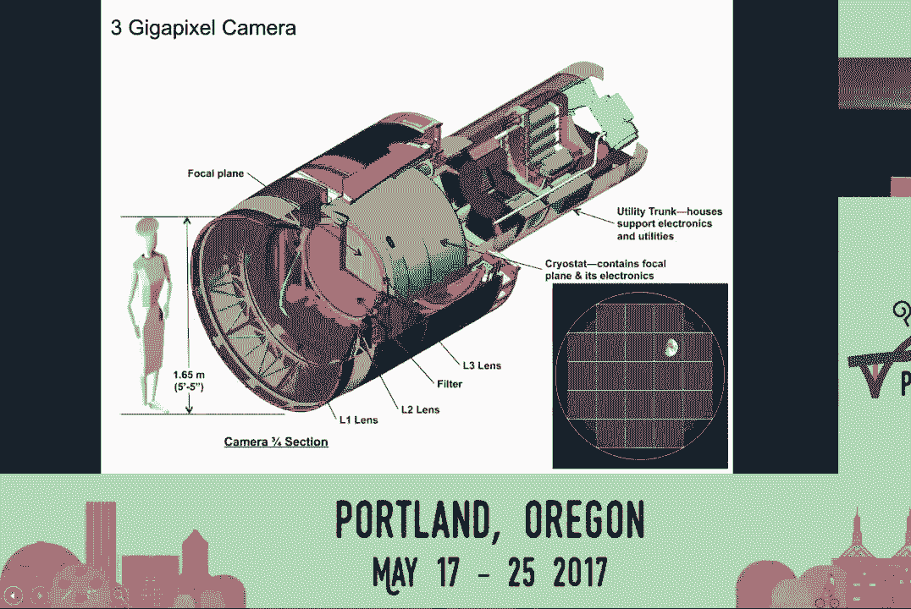

像素，如果你想以全分辨率显示单个 LSST 快照，你将需要 1500 台高清电视。所以这是很多像素。令人惊讶的是，这 1500 台高清电视所需的像素将在每 30 秒拍摄两次，持续 10 年，对吧？

所以，LSST 的最终结果基本上就是，它将是一个为期十年的整个夜空的视频。覆盖智利可见的整个南半球的天空大约需要三天。最终的数据目录将包含数百个 PB 的数据。我不是在夸大其词，当我说这将绝对改变天文学的方式时。

从研究太阳系尘埃的人们，一直到最遥远的星系，以及宇宙本身的结构。

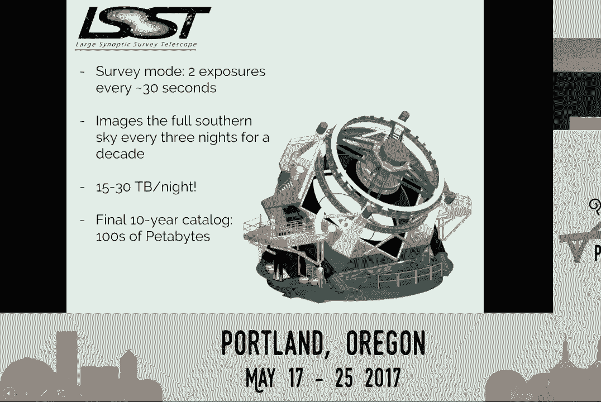

我本来打算讲一些科学案例，但实际上有一本 600 页的书谈论了我们能够用 LSST 做的一切。如果你感兴趣，我建议至少读一读目录，因为我们将要做的事情真的很惊人。

你可能现在已经感受到了一种模式。

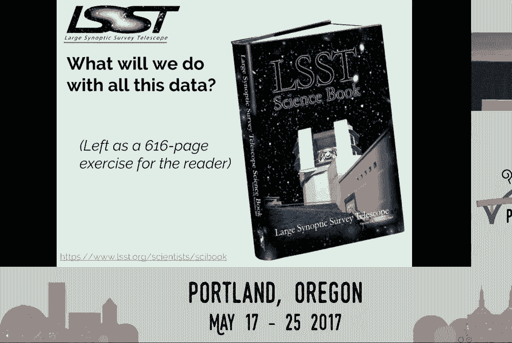

如果你想知道驱动这 100PB 数据的软件，它在 GitHub 上，使用的是 Python，部分内容是 C++。所以在过去的 10 年中，这在天文学上确实是一场革命。我对此很好奇，于是使用了一个朋友的脚本。

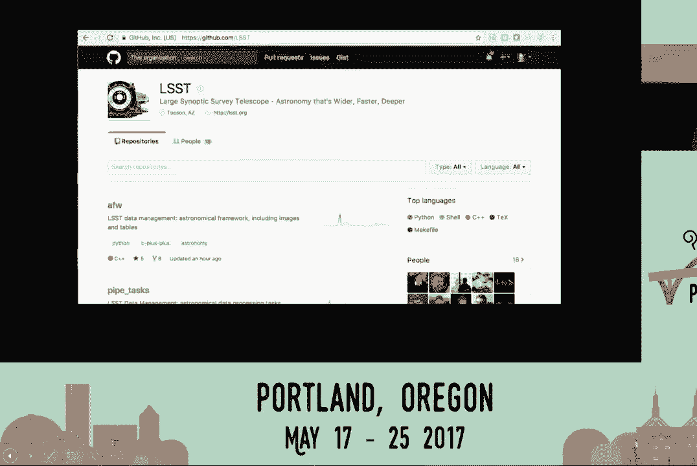

来挖掘天体物理数据系统，这是所有经过同行评审的天文学论文的列表。在过去的 17 年中，这些是某些软件语言的提及。你可以看到 Python 是——我们有这个曲棍球棒的趋势，对吧？Python 正在经历指数级增长。

天文学领域的数据集。这些较旧的工具，如 IDL，在我开始攻读博士学位时最为流行，现在有些退潮。这是个好消息，因为 IDL 是一个封闭源代码系统，有许可费用，而且实际上并没有——。

学习 IDL 的学生无法找到其他工作。他们只能获得天文学方面的工作，对吧？

所以，Python 有很多非常不错的地方。在接下来的演讲中，我想集中讨论这个。为什么选择 Python？如果你回到 1985 年，问 Guido 是否认为他的这个小语言会被用来管理数百 PB 的数据，为全球天文学家服务，他可能会用荷兰语说你疯了。

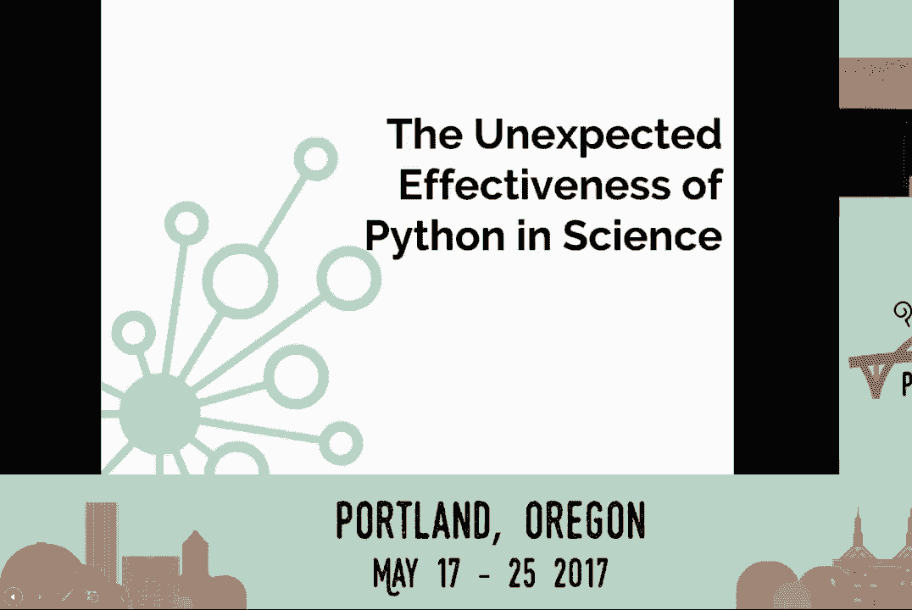

如果你回顾一下 Python 在 80 年代的发展，实际上它作为一种教学语言开发，旨在弥补 Shell 和 C 之间的差距。他甚至表示，它从未打算成为程序员的主要语言。所以如果你们中的任何人自认为是程序员。

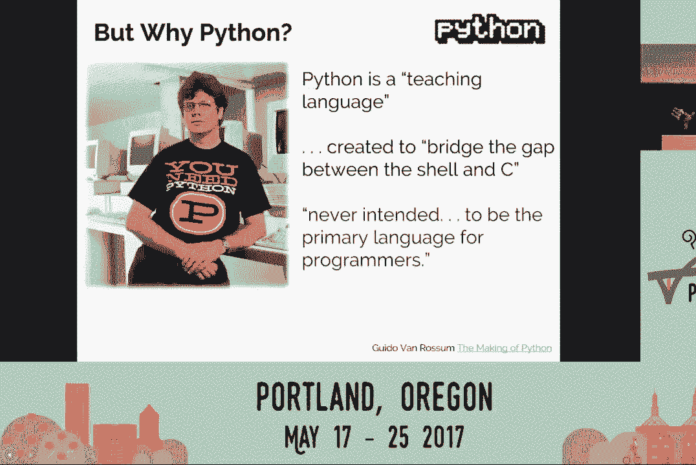

你们正在使用错误的语言。如果你深入那次访谈，会发现非常有趣。他说，我以为我们会写 10 行、50 行，也许 500 行的程序。但现在我们却在使用成千上万行，甚至数百万行的 Python 来存储和分析一些最大的。

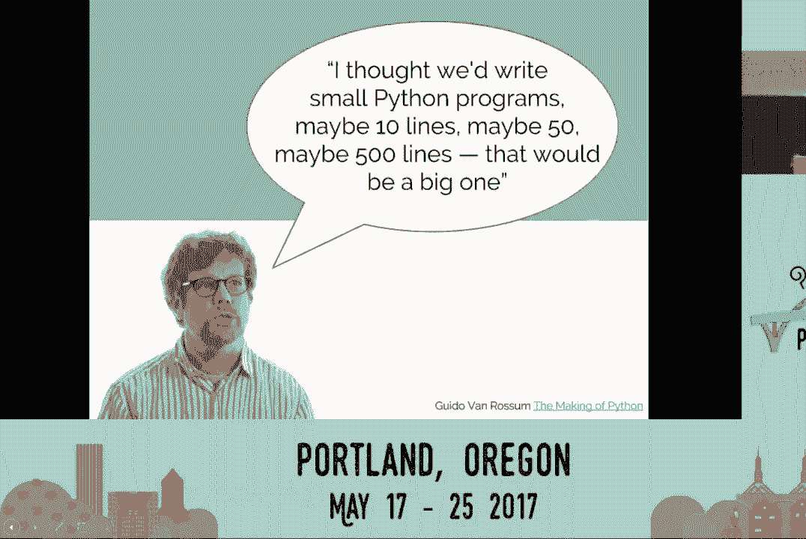

世界上最大的数据库。我认为这真是不可思议。那么，为什么 Python 在科学中如此有效呢？

我认为首先出现的是，它与其他语言的互操作性。

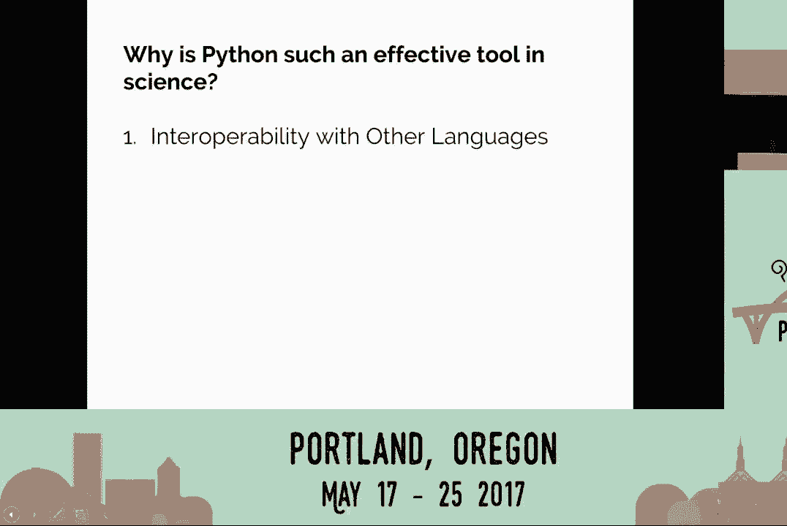

这真正推动了这一切。如果你回顾过去，看看一些伟大的科学家，其中之一就是艾萨克·牛顿。他有一句著名的话，他说如果我看得更远，那是因为我站在巨人的肩膀上，基本上是在说他的科学不是在真空中存在的。他需要所有在他之前的科学。

我认为如果艾萨克·牛顿今天还在世，他会说类似的话。这是通过从巨人的代码中引入的。因此，无论科学家们今天在做什么，他们都在使用某种计算。这就是我们所处理的数据的本质。如果每次都要重新发明轮子，你就什么也做不成。

每次扩展研究时，你永远不会完成任何事情。所以我们不断使用那些。

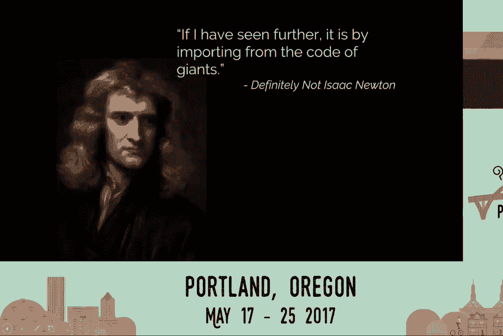

在我们之前。如果你想了解 Python 和科学的第一步，戴夫·比斯利在 2000 年写了一篇有趣的论文。如果你曾参加 PyCon，你可能知道戴夫。你可能知道他是教你用协程做一些恶魔般的事情的人。但在 20 年前的那段时间。

他在一个国家实验室工作，并推动了一些科学家，成为第一批在科学领域使用 Python 的科学家之一。他说，科学家们与各种系统合作，从模拟代码、数据分析包、数据库到可视化工具、自制软件，每一个都。

向用户展示不同的接口和文件格式。因此，科学家们可能会花费相当多的时间试图使这些组件以某种方式协同工作。因此，他在 2000 年提倡 Python 作为解决方案，将所有这些工具粘合在一起。

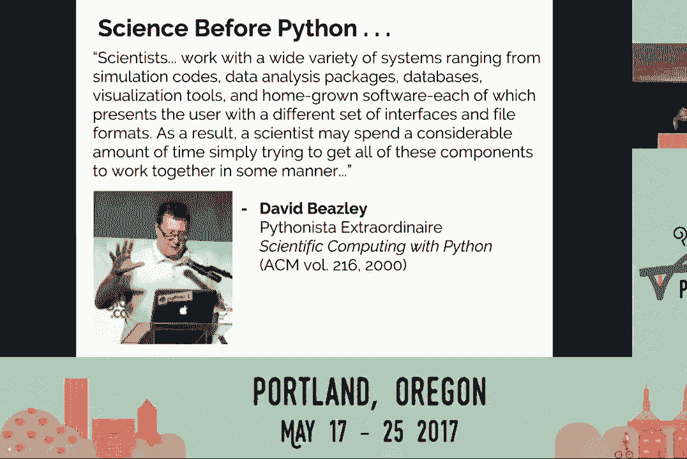

如果你看看科学 Python 世界中的一些其他人物，比如约翰·亨特，他是 Matplotlib 的创造者。他说，我有一堆混乱的工作流程。我有 Perl 脚本，使用 C++。我把它们加载到 Matlab 中并绘制，然后我开始使用 newplot。

这激励他去开发 Matplotlib。这在某种程度上是 Python 对整个不匹配的替代品。

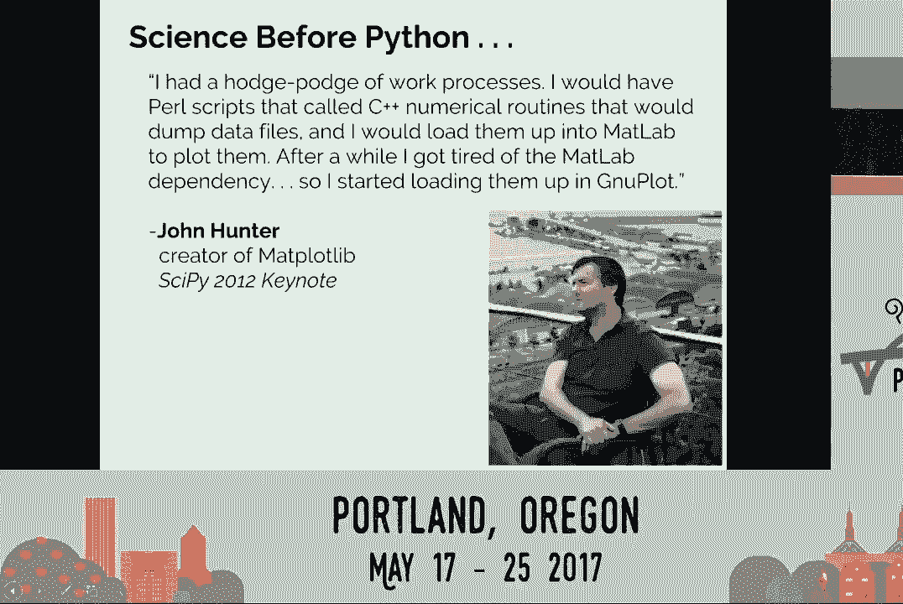

他使用的管道。对于南达·佩雷斯来说，他启动了 IPython 项目，后来发展成 Jupyter。他也有类似的经历。我的导师有一个 heavily customized 的氧化物 bash 工作流程来管理作业提交和 C 代码的后处理。因此，他使用了她的脚本，并在此基础上添加了一层 Perl。

GNU plot，IDL 和 Mathematica。这听起来对我来说绝对可怕。这激励他创建 IPython，以便使用 Python 将所有这些工具整合在一起。因此，从根本上说，在科学中，Python 更多的是胶水。它起初是将这些各种科学工具粘合在一起的一种方式。

人们正在使用的工具。高层次的 Python 语法。封装了这些低层次的 C 和 Fortran 库。因此，Python 成为如此有效工具的另一个原因是“电池包含”的概念。Python 开箱即用可以做许多事情。如果你将它与开箱即用的 C 或 C++进行比较。

Python 有这个内置的标准库，可以完成从启动 Web 服务器到读取 JSON，再到处理文件系统和字符串操作等所有任务。这种功能极其有价值。而对于没有内置的库，围绕 Python 构建了这个软件生态系统。

这被证明是非常有用的。因此，如果你查看科学 Python 的起源，有很多人在其上工作。但这个项目的面孔之一是 Travis Oliphant。他启动了 NumPy 项目和 SciPy 项目的部分。他说，当我发现 Python 时，我真的很喜欢这个语言。

但它当时非常初期，缺乏很多库。我觉得通过将这些低层次的库与 Python 的高层次用法连接起来，我可以为世界增添价值。因此，这就是从 Python 作为胶水转向 Python 作为应用程序，结合这些基础工具。

科学生态系统在过去几年里确实迅速膨胀和爆炸。你有 Python 在地面上。然后有各种与 Python 合作并以对科学家有用的方式扩展的包。当然。NumPy 提供数组计算。IPython 在 Jupyter 上为你提供了一种基于 Python 的 IDE。

你有 SciThon 项目，它让你基本上可以在 Python 中包装 C 代码并编写 C 代码，这非常有趣。实际上，除了这个，我世界上最喜欢的编程语言是 SciThon。你应该试试，这真的很有趣。你还有像 Numba 和 Dask 这样的工具，处理可扩展性和计算。在这个层次之上，你。

有些工具稍微更专业一些。像 Bokeh 和 Matplotlib 这样的绘图工具。你有 pandas 用于数据框和 X-array，用于多维标签结构。当然，还有 SciPy，它封装了所有科学例程，如积分和插值。这些都依赖于它们下面的层次。当然。

科学家们——这些是更高层次的工具，但还有更高层次的需求。人们想进行机器学习。因此构建了依赖于 SciPy 和 NumPy 的 Scikit Learn。SimPy 进行符号运算，类似于如果你使用过 Mathematica 或 Wolfram Alpha。你可以在 Python 中以符号方式解方程。NetworkX、Scikit Image、PyMC，来自 Arkov、Chain。

钱、卡洛、统计模型。而且这比那个更专业，除此之外，还有许多不同的领域为 Python 开发了这些特定领域的软件包。因此，在 Python 社区和科学界，我们真正处于一个阶段，如果你想在 Python 中解决某个问题，肯定有人为此编写了软件包。

你可以在外面找到，且很可能在 GitHub 上。而这在科学界的影响绝对巨大。因此，我们在天文学中看到这样的“曲棍球棍”增长。这也是 Python 在科学中如此有效的另一个原因，正是因为它的简单性和动态特性。

你可能见过这个 XKCD。如果你在 Python 解释器中输入 import anti-gravity，这个会弹出。它揭示了很多人对 Python 的看法。Python 就是有趣。如果你从另一种语言切换到 Python，这是一种解放的感觉。你只需写下你想要发生的事情。它就会发生，对吧？

Python 有点像可执行的伪代码。

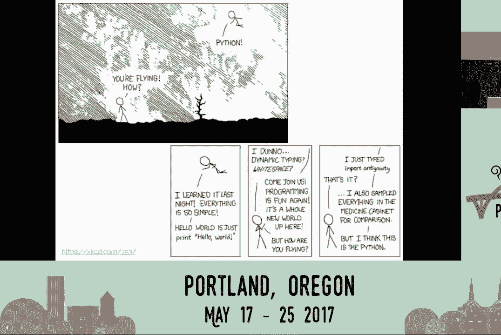

它就是有效。真不错。佩里·格林菲尔德，他是空间望远镜科学研究所的项目负责人之一。这些人是哈勃太空望远镜和詹姆斯·韦布太空望远镜的幕后推手。他在几年前的 Pi 数据会议上做了一个有趣的演讲，讨论了为什么 Python 在天文学中得到采用。

他是其中之一——如果你想知道为什么 Python 在天文学中如此重要。他在后台推动了这一切，使其被一些大型组织采用。他说，Python 是一种对开发者非常强大，同时对天文学家也很友好的语言。

让这两类人使用相同的工具，我认为。这提供了巨大的好处，而这些好处并不总是被注意到或提及。因此，关键在于，Python 是库的编写者使用的工具，同时也是使用这些库的人的工具。

这种简单性确实让它运作，因为天文学家并不是计算机科学家。我们中的许多人没有计算机科学的培训，因此我们习惯于编写脚本语言。

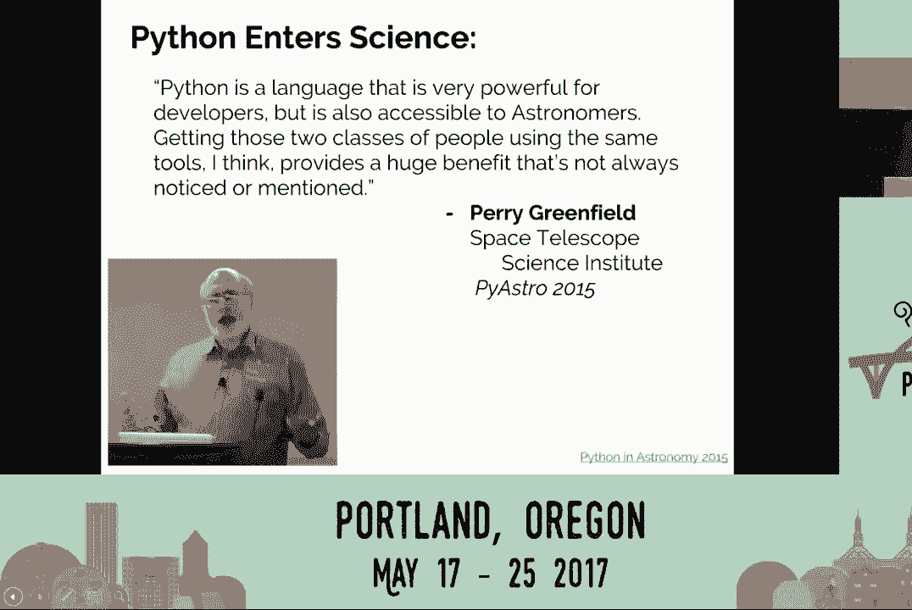

而且 Python 非常符合这个要求。所以在日常科学探索中，开发速度是首要的，执行速度是次要的。有时会有人，尤其是在处理大量数据的领域，质疑你为什么用 Python 来管理这些 TB 或 PB 的数据。

关于数据。他们开始说，为什么不使用 C 呢？那样更快。我最喜欢的回答是，为什么不乘飞机而不是开车呢？那样更快。Python 的好处在于启动成本非常低。你不需要去机场，经过安检，打包行李。

然后挤进一个小管子，结果到达你要去的城市的错误地方。你只需跳上去，开始前进。

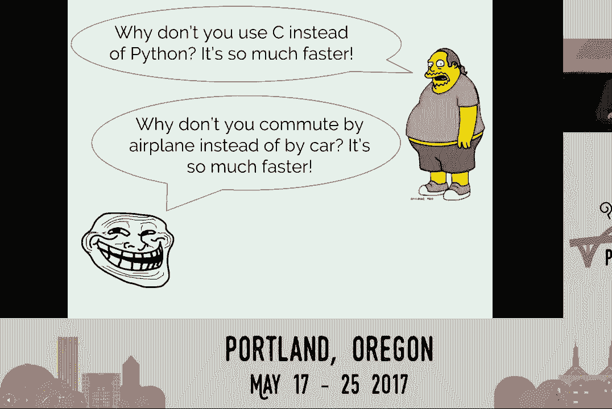

所以这个难题的另一部分是，科学编码实际上是非常、非常非线性的，并且具有探索性。这是我花了很多时间和孩子们一起看的一个片段，来自一本名为“Aida Twist Scientist”的儿童书籍。如果你有小孩，真的应该看看。但是它在某个地方提到。

Ada Marie 做了科学家所做的事。她问了一个小问题，然后问了两个。每个问题又引出了三个问题，而其中一些问题又导致了四个。这其实就是科学的过程。我们不是有路线图的软件开发者，坐下来编写模块并进行测试驱动开发，直到测试通过。我们有一个数据集。

然后我们开始玩弄它。也许我们以一种方式绘制它，也许以另一种方式绘制。我不知道我的视频能否播放，因为网络连接的问题。哦，好吧。这是我在 Jupyter Notebook 上进行一些数据探索的视频。

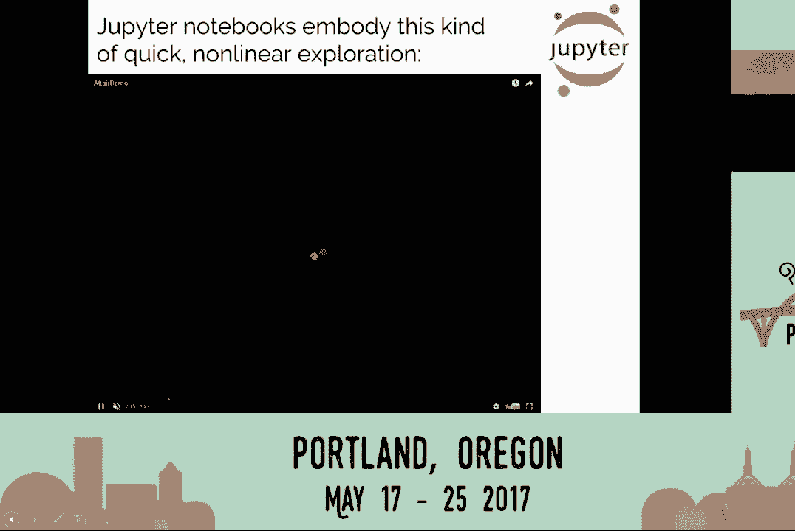

尝试一些东西，从头开始，再试一次。问题是科学家使用 Python 的方式确实是这样的。我们进行各种往返的探索工作，非常非线性。这意味着像 Jupyter Notebook 这样的系统实际上是理想的。

对于那些习惯于经典软件开发并寻找 IDE 的人来说，这可能不太适用。可能感觉有点臃肿。但对我们正在做的事情来说，它正是我们所需要的。

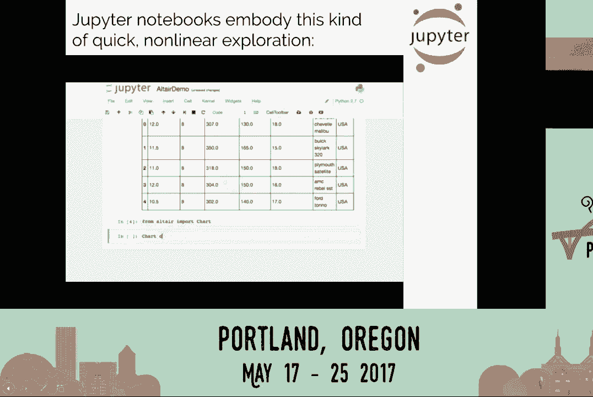

对不起，那个视频无法播放。所以我认为 Python 是如此有效的工具的最后一个原因是因为它有这种开放的精神。我之前提到过，所有这些大型望远镜项目现在都有 GitHub 存储库，处理流程用 Python 和其他语言开放。这在十年前并不是这样的。如果你多读读媒体上的内容。

如果你关注当今的科学，你会看到，所有这些关于重复危机的文章。每个人都在谈论科学如何崩溃。

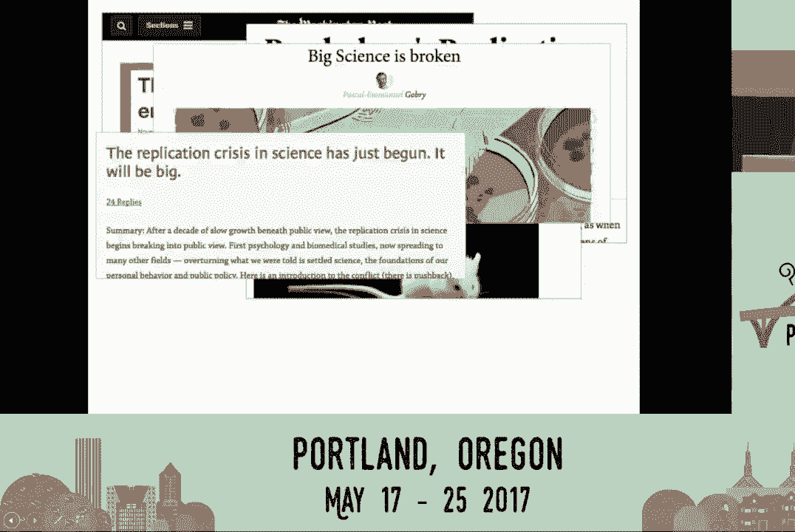

复制危机已经开始。我们无法复制同行的研究。科学的核心基础似乎正在崩溃，因为我们没有很好地使我们的研究具有可复制性。那些深入思考如何解决这个问题的人，主要得出的结论是。

这是开放科学的理念。

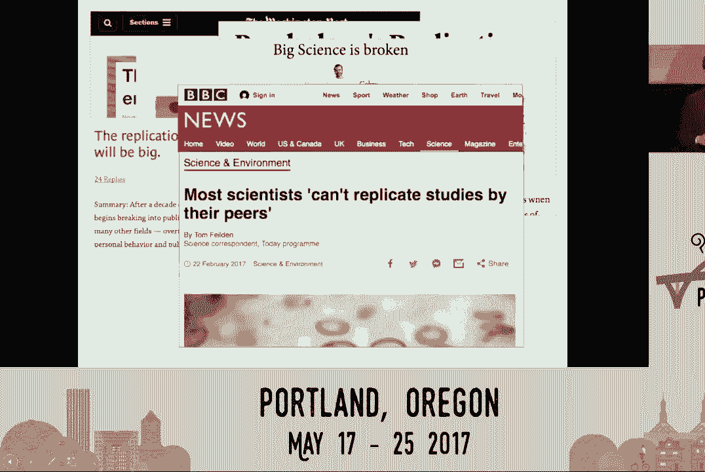

所以，Buckeye 和 Donahoe 在大约 20 年前的一篇论文中有这样一句精彩的引述。一篇关于计算结果的文章，是广告，而不是学术。真正的学术是完整的软件环境、产生结果的代码和数据。因此，人们所说的基本上是，科学要进步。

我们需要开始以开源世界几十年来的做法来做事。我们需要开始把我们的代码放到网上，这样任何人都可以下载和运行它。我们需要以一种方式授权，以便其他人可以使用并基于此进行构建。

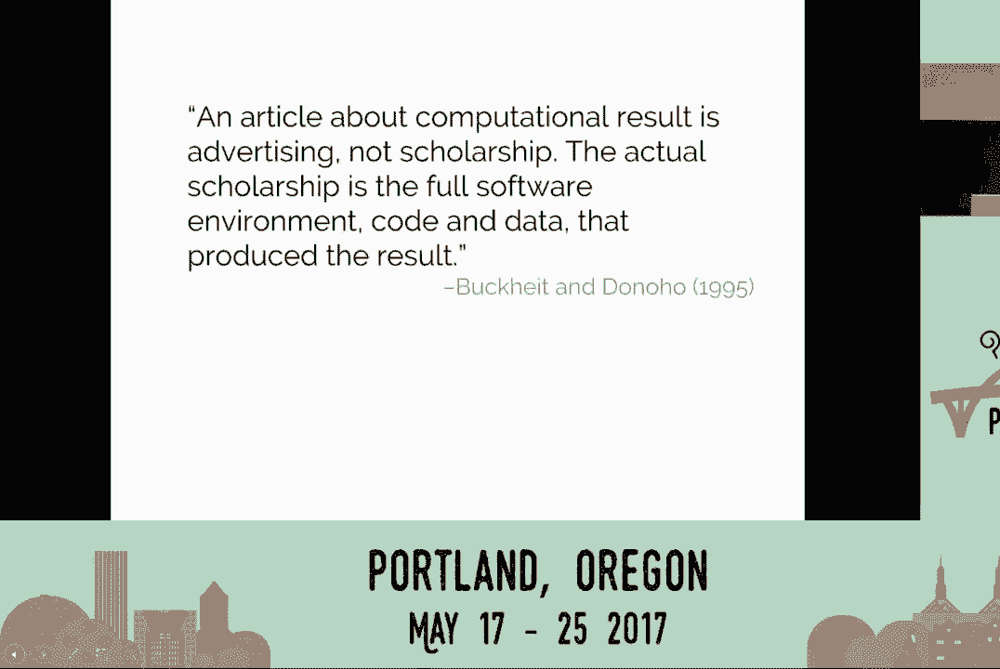

这种情况已经开始发生。一个伟大的例子是，LIGO 检测到的这个令人难以置信的事件。激光干涉引力波天文台成功检测到了由两个黑洞螺旋靠近引起的时空涟漪。

并融合在一起。黑洞是如此巨大，以至于它们实际上扭曲了时空的结构。当它们螺旋靠近时，会产生螺旋的引力波。时空中的涟漪向外扩散。当 LIGO 发布那个结果时——我几乎可以确定，这个结果将在未来几年内获得诺贝尔奖。

当他们发布那个结果时，你。

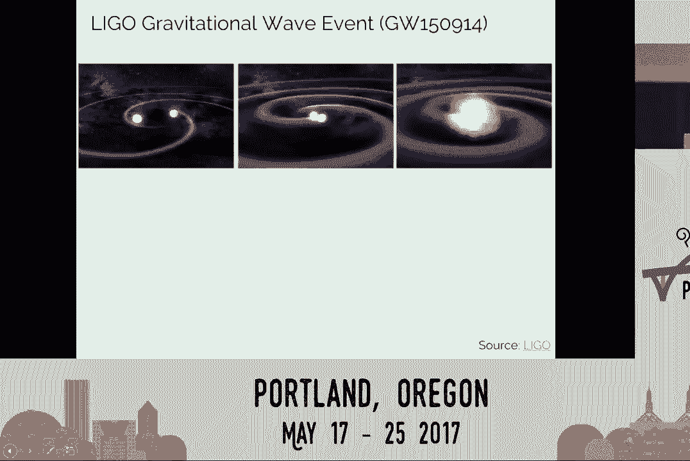

你可以看看你是否认识 Matplotlib。这是他们所拥有的图表，他们是在 Matplotlib 中制作的。他们还发布了笔记本。你可以从原始数据一直到他们刚刚发布的这个图表，只需遵循他们的笔记本。因此，这确实是科学的未来之路。

走出这个复制危机，确保我们发布的所有内容都包含代码。

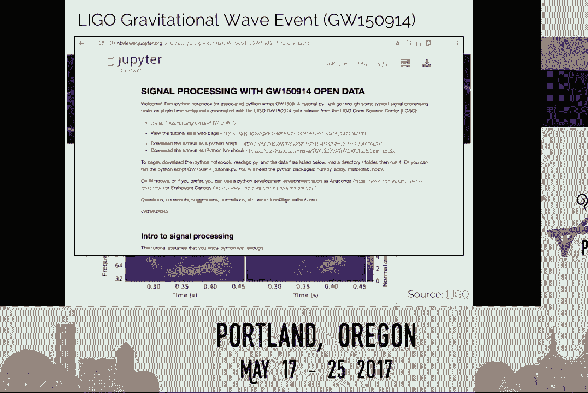

并遵循开源世界所做的事情。因此，这是我在自己项目中尝试做的事情。这是我提到的两本书。如果你想，可以从 Arilie 购买它们。或者你可以去我的 GitHub，查看以笔记本形式呈现的整本书。你可以下载并执行它。

并确认代码的运行方式如我所说的那样。因此，我一直在努力践行这种开放性，无论是在写书还是撰写我的研究论文等方面。顺便提一下，如果你想要这本书的副本，明天我将在 Riley 展位签名，时间是上午 10 点。

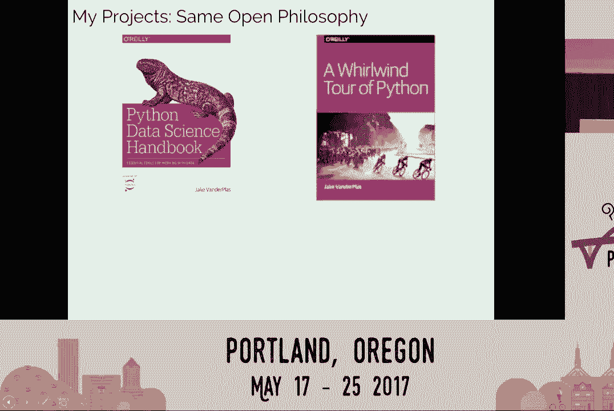

所以请过来看看。Python 界在开放性方面确实影响了科学。你知道，我之前提到的 AstroPy 库，这是天文学家们聚集的焦点。如今有很多论文都是基于 AstroPy 中的工具进行分析的。而 AstroPy 的结构方式。

这基于 Python 界的发展。回到佩里·格林菲尔德，这个内容改编自他在同一场主题演讲中的幻灯片。他谈到了 Python 对天文学的贡献。传统上，天文学一直是——我们并没有真正共享软件，而是对此有所保留。Python 改变了这一点。

这是合作的，关于分享的。我们过去的努力是碎片化的，而现在在这个 AstroPy 的伞下更为统一。它不是由机构自上而下规划的，而是由使用和创建软件的人自下而上进行规划的。接下来就不再深入探讨了。

我让你看一下这个。但这里的要点是，科学家们进入 Python 世界时，很多人做事情的方式与我们科学家不同。但我们能够向你们学习，并真正改善科学的做法。

我非常希望，这些如复制危机之类的问题很快会被我们抛在身后。因为我们作为科学家正在适应开源世界的工具。那么，为什么 Python 在科学中如此有效？我认为有这四个关键因素。我们拥有这种互操作性，它可以作为其他所有事物的粘合剂。

我们有包含电池的模块和第三方模块，都是为了使 Python 尽可能有用，并减少按键次数。其简单性和动态特性，使得一个从未编码过的初学天文学学生可以在一周内开始编写脚本。

在一个学期结束时编写应用程序，这真是太了不起了。这种开源精神非常适合科学。我认为，尤其是科学和天文学，应该对 Python 界表示感谢，因为它让我们走上了正确的轨道。所以在这方面，我想再次提到马赛克的概念。

所以我给你提供了一些关于 Python 在科学中应用的视角。这就像是马赛克中的一块砖。而这里的每个人都有不同的经历。你可能是 pip 用户，也可能是 conda 用户，或者你可能是 PyCharm 用户，而不是 Jupyter 用户。还有其他什么呢？比如说，PyPy 与 CPython。

根据你日常生活中的工作，你会有截然不同的方法和适合你的工具集。我鼓励你在这个周末的 PyCon 期间，保持这一点。真正的机会在于你可以与使用这种语言的人交流。

这些与您完全不同。因此，我希望您尝试去寻找其他领域的演讲，与那些以不同方式使用 Python 的人交流。如果你这样做，你永远不知道。你可能会完全改变你所在领域的工作方式。所以就到此为止。

非常感谢。我很乐意回答一些问题。[掌声]。根据我的时钟，很不幸我们到了时间。如果你有问题请找 Vanderplast 博士，或者在会议的其他媒体房间找到他。在我们进入第一轮大型演讲之前，让我们再次为博士鼓掌。

Vanderplast。感谢你的发言。[掌声]，[音乐播放]，[掌声]，[空白音频]。

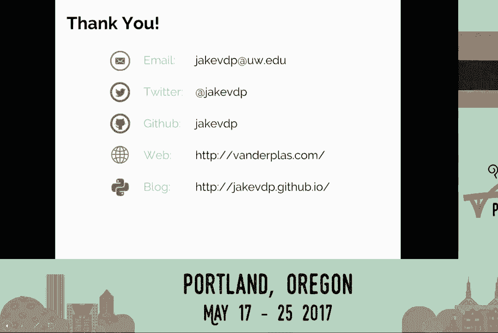
