# 002：2017年部署你的Python Web应用的五种方式


在本教程中，我们将学习五种在2017年将本地Python Web应用部署到互联网上的不同方法。我们将使用一个简单的Flask应用作为示例，并逐一演示每种部署方式，同时分析其优缺点，帮助你根据项目需求选择最合适的方案。

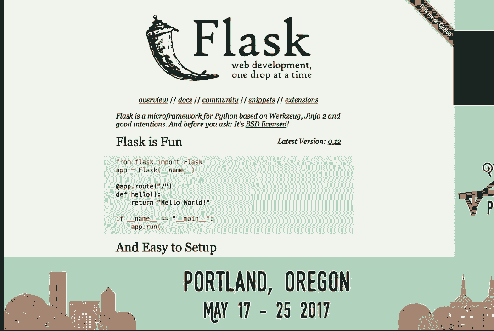

## 技术一：ngrok 🚀

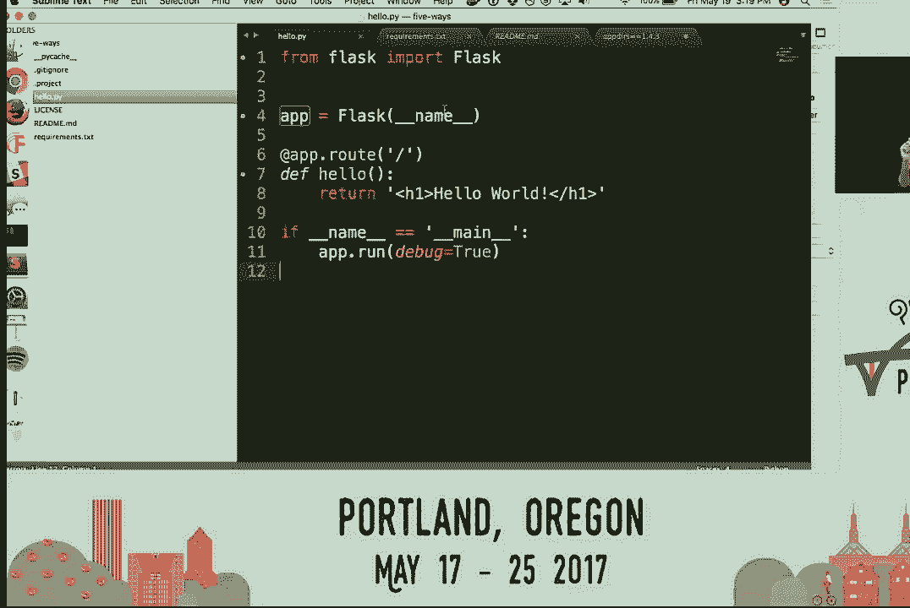

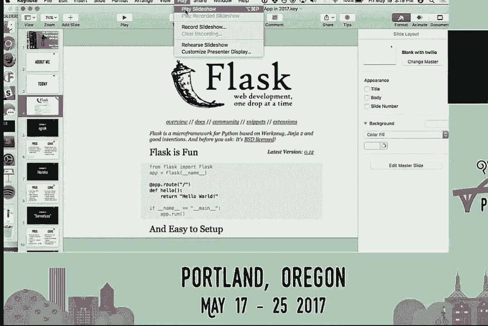


上一节我们介绍了本教程的目标，本节中我们来看看第一种技术：ngrok。ngrok并非真正的部署，而是一个极其便捷的工具，可以为本地服务器创建安全的公共隧道。

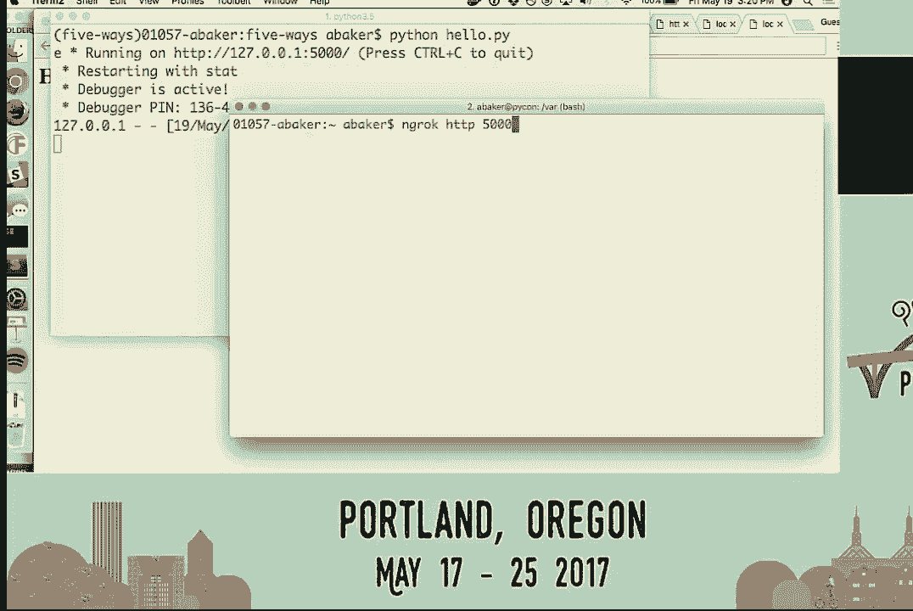

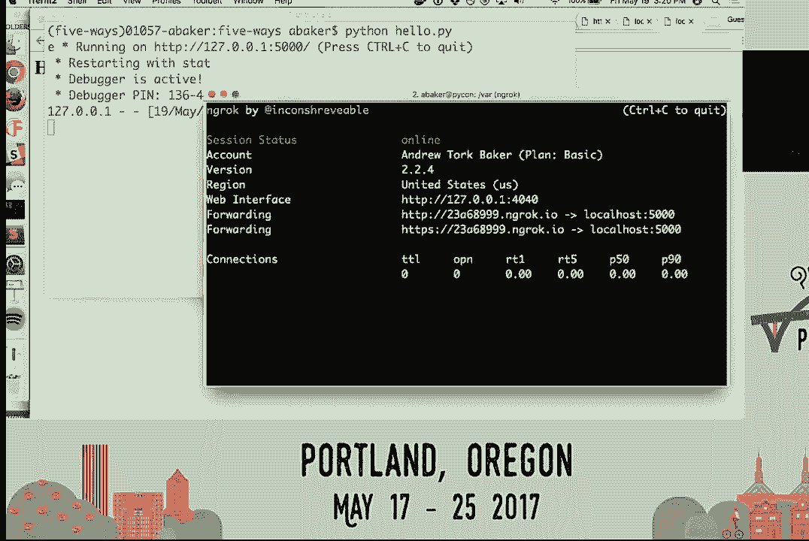

ngrok的官方描述是“为本地主机提供安全隧道”。其核心功能是将运行在NAT或防火墙后的本地服务器暴露到互联网上。

以下是使用ngrok的步骤：
1.  从官网下载并安装ngrok。
2.  在本地启动Flask应用（例如运行在`localhost:5000`）。
3.  在终端运行命令 `ngrok http 5000`。
4.  ngrok会生成一个随机的公共URL（如 `https://xxxx.ngrok.io`），访问该URL即可看到你的应用。

ngrok还提供了一个内置的Web界面（通常位于 `http://localhost:4040`），用于实时查看所有传入的HTTP请求和响应，方便调试。

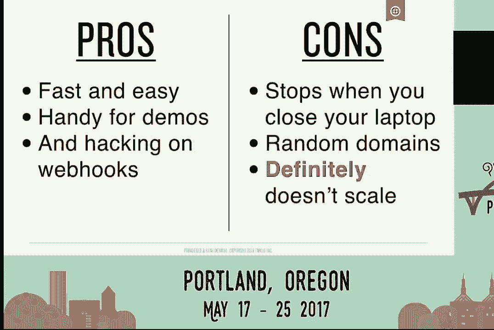

**优点分析：**
*   **速度极快，操作简单**：没有比这更快让应用上线的方法。
*   **适合演示和临时分享**：在会议或团队内快速展示本地开发成果。
*   **非常适合Webhook开发**：当需要接收外部服务（如Twilio）的回调请求时，ngrok提供了临时的公网地址。


**缺点分析：**
*   **非持久化**：关闭本地电脑或ngrok进程，服务即中断。
*   **域名随机**：免费版每次启动都会获得不同的URL。
*   **无法扩展**：免费版有并发连接数限制，不适合正式生产环境。


## 技术二：Heroku ☁️


上一节我们了解了用于临时暴露服务的ngrok，本节中我们来看看如何让应用持久在线。Heroku是一种平台即服务（PaaS），它能让你的代码在云端7x24小时运行，且过程非常简单。

使用Heroku部署，你无需直接管理服务器。其核心思想是：你提供代码和运行指令，Heroku负责其余的一切。

以下是部署到Heroku的关键步骤：
1.  创建 `Procfile` 文件，定义启动命令。例如：`web: gunicorn hello:app --log-file -`
2.  安装Heroku CLI并登录。
3.  在项目目录下运行 `heroku create` 命令创建应用。
4.  使用 `git push heroku master` 将代码推送到Heroku。
5.  使用 `heroku open` 命令打开应用。

**优点分析：**
*   **简单快捷**：是让应用免费、持久在线的最简单方式之一。
*   **无需服务器管理**：完全抽象了底层基础设施。
*   **丰富的插件生态**：可轻松添加数据库、日志、监控等服务。
*   **扩展简单**：通过配置可以轻松增加服务器实例（但成本会增加）。

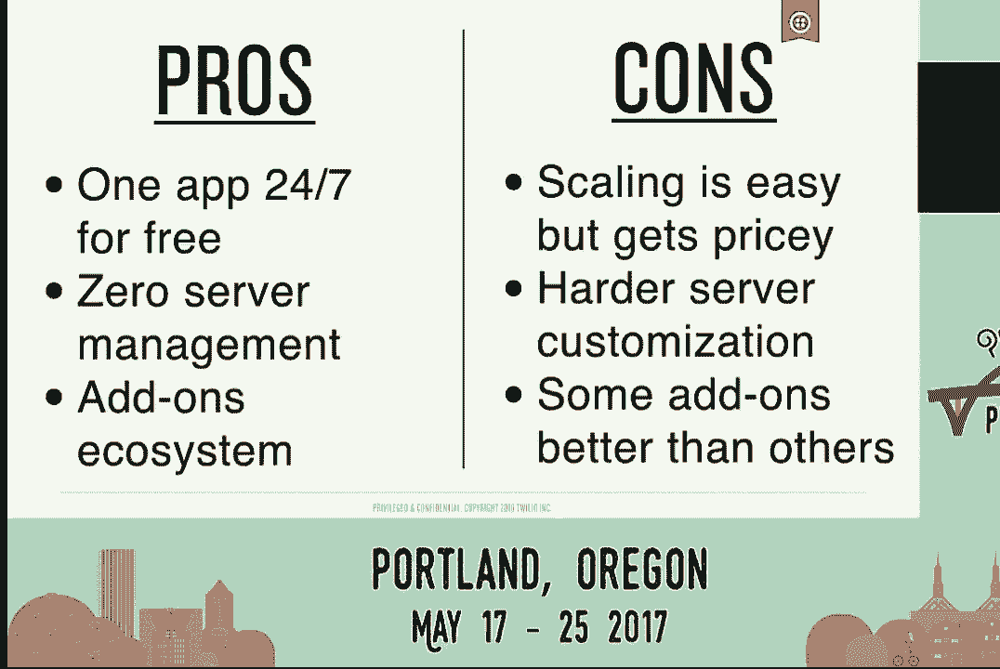

**缺点分析：**
*   **成本随规模增长**：当应用需要多个服务器实例时，费用可能变得昂贵。
*   **服务器定制困难**：如果需要特定的操作系统库或深度定制，会受到限制。
*   **插件质量参差**：第三方插件的可靠性和支持水平不一。

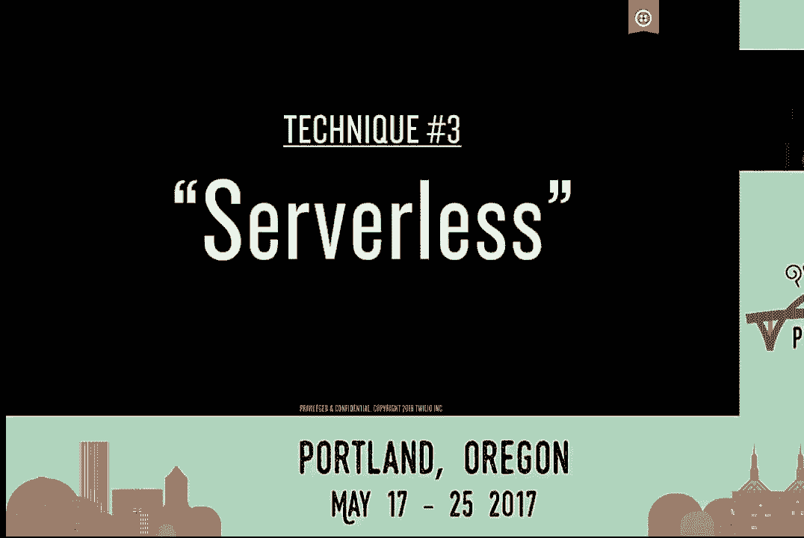

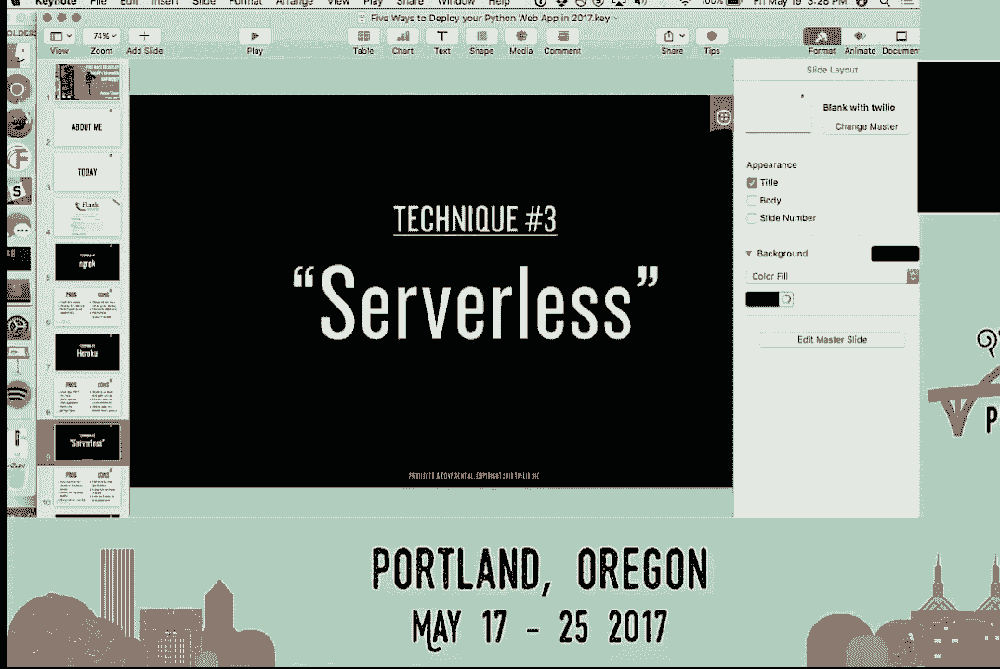

## 技术三：无服务器架构（以AWS Lambda为例） ⚡

上一节我们介绍了全托管的PaaS平台Heroku，本节中我们来看看一种更前沿的部署模式：无服务器架构。这里的“无服务器”并非没有服务器，而是指你无需管理服务器，代码只在被请求时执行。

我们使用Zappa框架来简化将Flask应用部署到AWS Lambda的过程。Zappa封装了AWS的API Gateway和Lambda服务。

以下是使用Zappa部署的步骤：
1.  安装Zappa：`pip install zappa`
2.  初始化Zappa配置：`zappa init`，并回答相关问题（如环境名、AWS配置等）。
3.  部署应用：`zappa deploy production`
4.  部署完成后，Zappa会提供一个URL，访问即可看到应用。


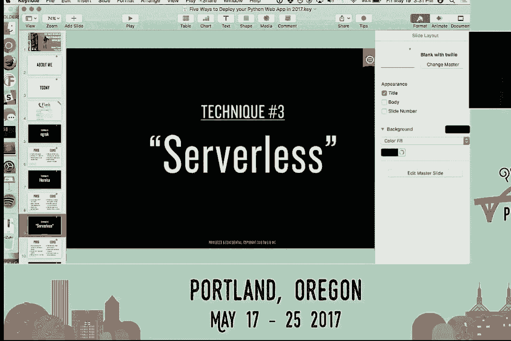

部署后，你可以在AWS控制台中查看自动创建的API Gateway、Lambda函数和S3存储桶。

**优点分析：**
*   **按需付费，经济高效**：只为代码实际执行的时间付费，非常适合低流量或突发流量场景。
*   **自动扩展**：云服务商自动处理流量激增，无需人工干预。
*   **零服务器配置**：比Heroku更彻底地抽象了服务器概念。

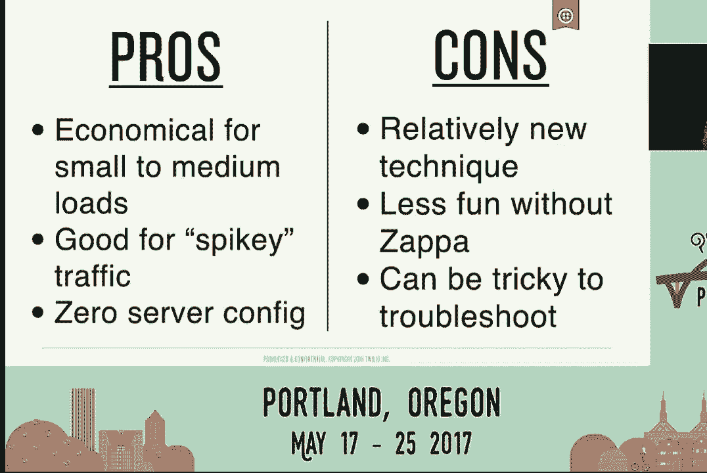

**缺点分析：**
*   **新兴技术**：生态系统和最佳实践仍在快速发展中。
*   **调试复杂**：问题可能涉及多个AWS服务的交互，排查需要熟悉AWS控制台。
*   **冷启动延迟**：函数一段时间未被调用后再次启动，可能会有短暂的延迟。

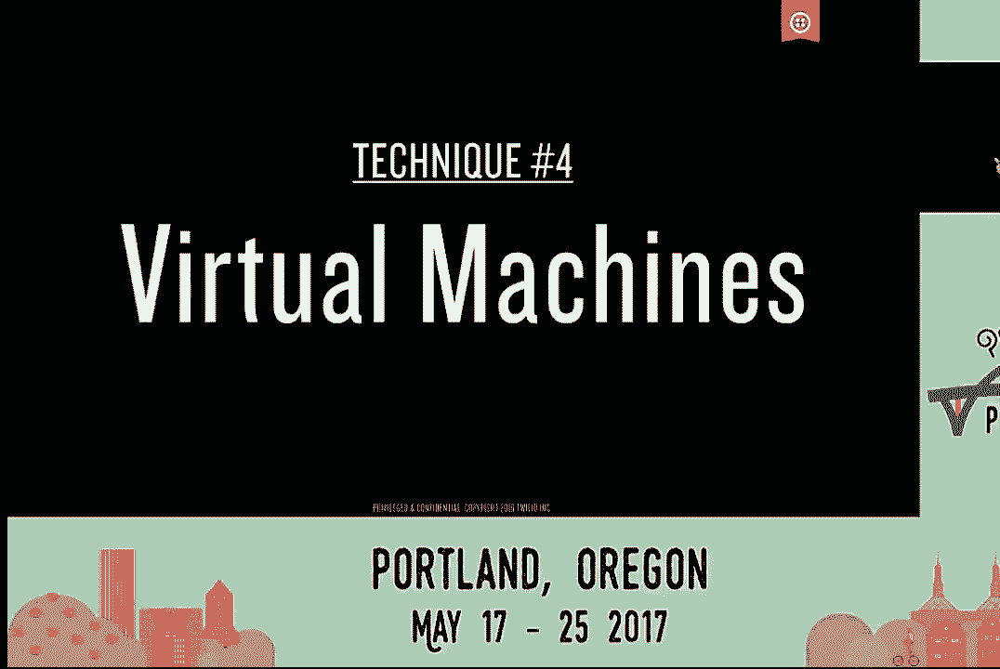

## 技术四：虚拟机（以Google Compute Engine为例） 🖥️

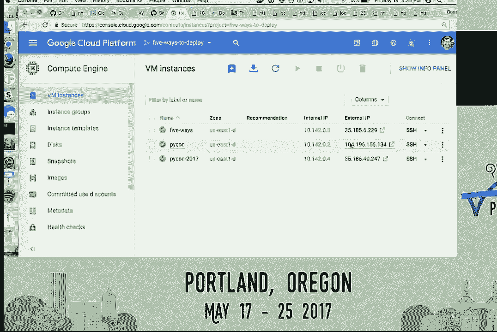

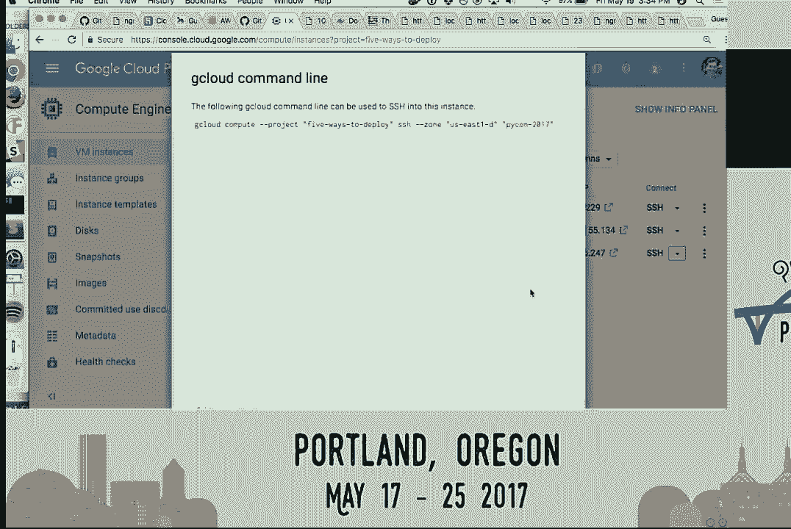

上一节我们探讨了抽象程度很高的无服务器架构，本节我们将接触更底层的部署方式：虚拟机。这是互联网上最主流的运行代码的方式，它让你在云端获得一台完整的虚拟计算机。

我们以Google Compute Engine为例。使用虚拟机意味着你需要像设置一台全新物理服务器一样，手动配置一切。

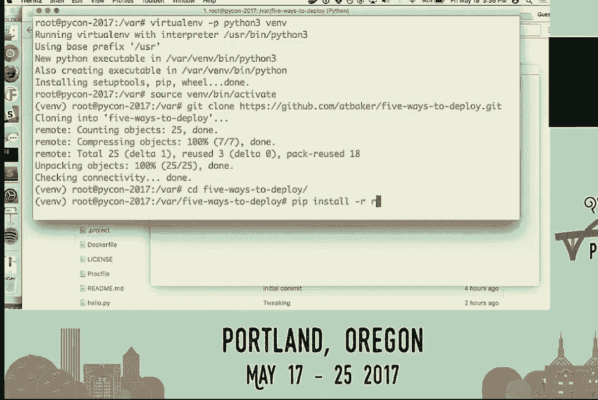


以下是部署到虚拟机的基本步骤：
1.  在云平台控制台创建虚拟机实例，选择配置（CPU、内存、操作系统如Ubuntu）。
2.  通过SSH连接到虚拟机。
3.  在虚拟机内手动设置环境：安装Python、pip、创建虚拟环境。
    ```bash
    sudo apt-get update
    sudo apt-get install python3-pip
    pip3 install virtualenv
    virtualenv venv
    source venv/bin/activate
    ```
4.  拉取项目代码并安装依赖。
    ```bash
    git clone <your-repo>
    cd <your-project>
    pip install -r requirements.txt
    ```
5.  使用Gunicorn启动应用，并绑定到外部IP和80端口。
    ```bash
    gunicorn hello:app -b 0.0.0.0:80
    ```


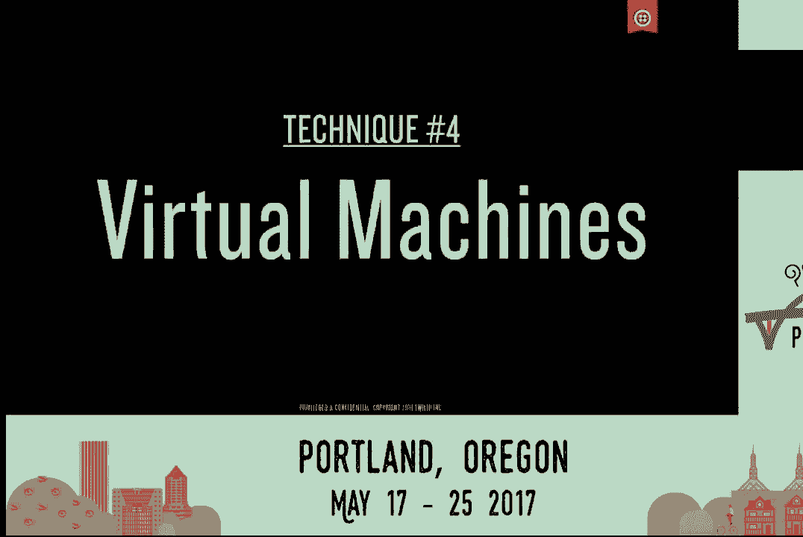

**优点分析：**
*   **完全控制**：你可以完全掌控操作系统、安装任何软件、进行任何配置。
*   **扩展潜力大**：性能上限取决于你选择的机器配置和钱包深度。
*   **成本可能更优**：对于长期运行、负载稳定的应用，精心配置的虚拟机可能比PaaS更经济。

**缺点分析：**
*   **工作量大**：需要手动完成所有运维工作，是今天所有方法中最繁琐的。
*   **学习曲线陡峭**：需要掌握系统管理、网络、安全、监控、自动化配置（如Ansible）等知识。
*   **成本预测复杂**：结合负载均衡器、存储等附加服务后，账单可能难以精确预估。


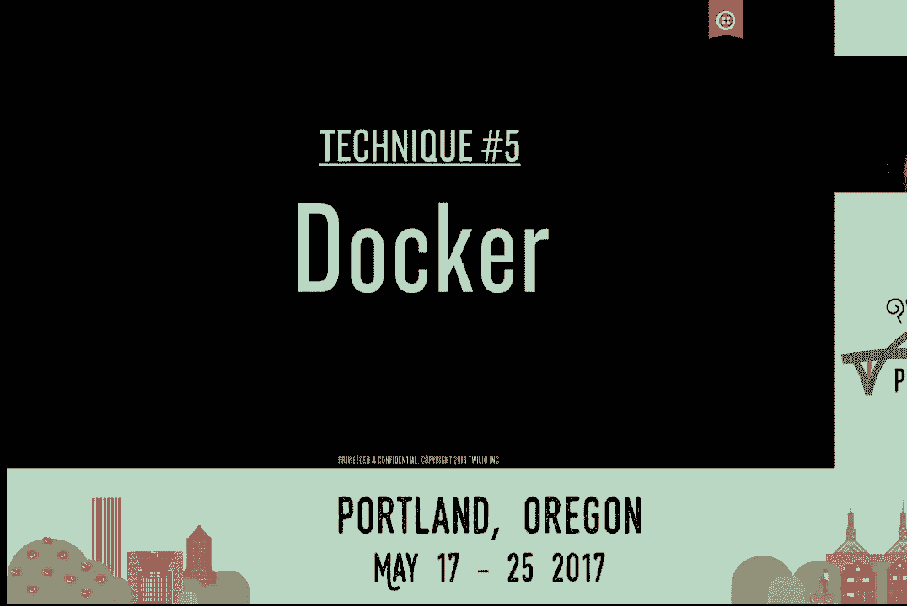

## 技术五：Docker 🐳


上一节我们体验了需要大量手动操作的虚拟机部署，本节我们介绍一种折中方案：Docker。Docker通过容器技术，试图在控制力和简便性之间取得平衡。


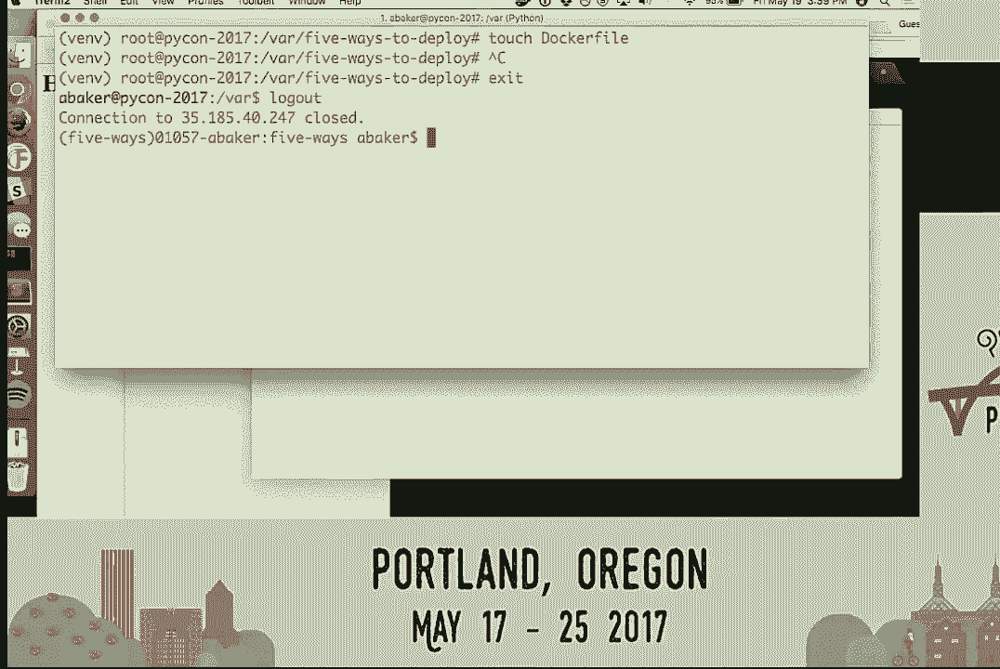

容器比虚拟机更轻量，它打包了应用及其所有依赖，确保环境一致性。你可以像在虚拟机中一样定义环境，但容器更容易创建、分发和运行。

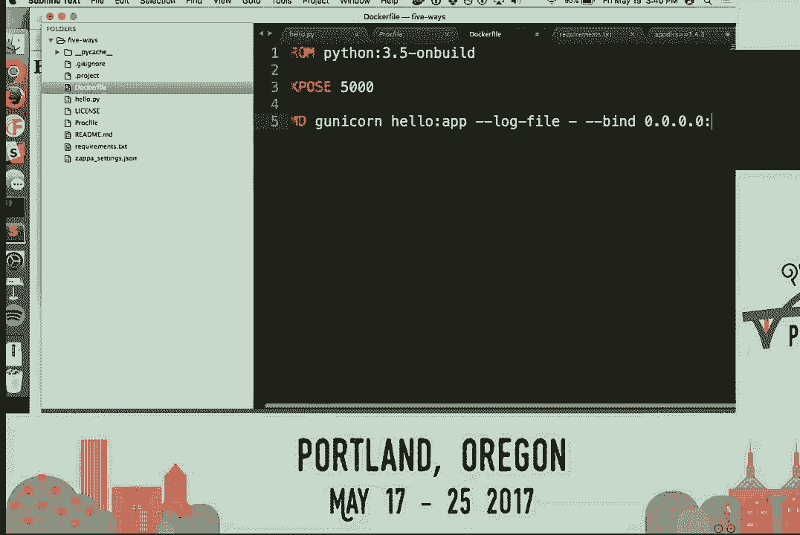

以下是使用Docker部署的步骤：
1.  创建 `Dockerfile`，定义如何构建镜像。
    ```dockerfile
    FROM python:3-slim
    WORKDIR /app
    COPY requirements.txt .
    RUN pip install --no-cache-dir -r requirements.txt
    COPY . .
    EXPOSE 5000
    CMD ["gunicorn", "hello:app", "-b", "0.0.0.0:5000"]
    ```
2.  构建Docker镜像：`docker build -t yourname/five-ways .`
3.  本地运行测试：`docker run -p 5000:5000 yourname/five-ways`
4.  将镜像推送到Docker Hub：`docker push yourname/five-ways`
5.  在云服务器（可通过`docker-machine`创建）上拉取并运行该镜像。

**优点分析：**
*   **环境一致性**：完美解决了“在我机器上能运行”的问题，确保开发、测试、生产环境一致。
*   **轻量高效**：容器共享主机内核，启动速度快，资源开销远小于虚拟机。
*   **适合微服务**：是构建和部署微服务架构的理想选择。
*   **镜像易于分发**：构建一次，随处运行。

**缺点分析：**
*   **学习曲线**：需要学习Dockerfile语法、镜像、容器、网络、存储卷等概念。
*   **最佳实践仍在演进**：虽然已相对成熟，但生态系统和工具链仍在快速发展中。
*   **团队协作要求高**：要充分发挥Docker的优势，需要团队在开发流程上做出相应调整。

## 总结 📝

本节课中我们一起学习了在2017年部署Python Web应用的五种主要方式：
1.  **ngrok**：用于快速创建临时公共隧道的利器，适合演示和Webhook开发。
2.  **Heroku**：全托管的PaaS平台，是让应用简单、持久上线的首选。
3.  **无服务器（AWS Lambda + Zappa）**：按需执行的架构，适合事件驱动和突发流量的场景，经济高效。
4.  **虚拟机（GCE/AWS EC2）**：提供完全控制，是互联网的基石，需要较强的运维能力。
5.  **Docker**：容器化技术，在环境一致性和部署便利性方面表现出色，是现代应用部署的重要趋势。

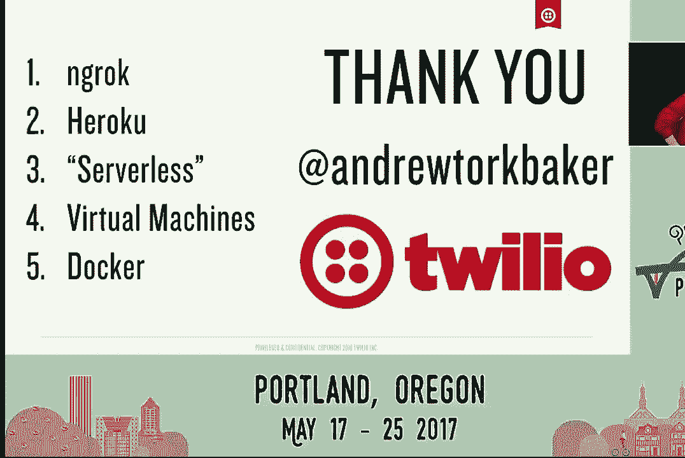

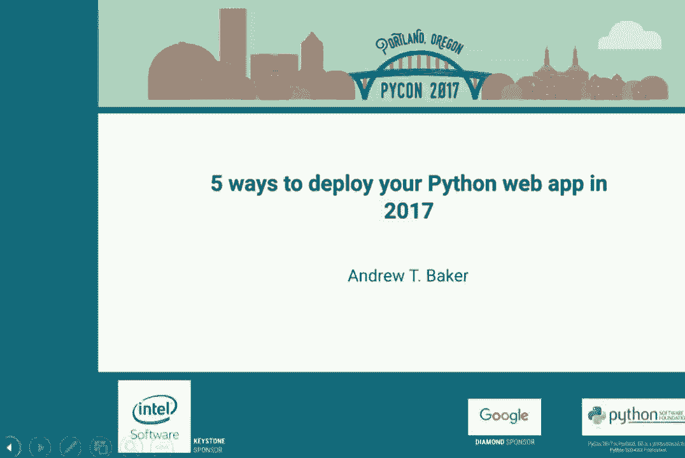

每种技术都在控制力、易用性、成本和复杂性之间有着不同的权衡。对于初学者，可以从Heroku或简单的Docker部署开始；当需要更多控制或优化成本时，可以逐步探索虚拟机和更深入的无服务器或容器化方案。选择最适合你当前项目阶段和团队技能的那一种。