# 004：为完全初学者讲解异步 Python

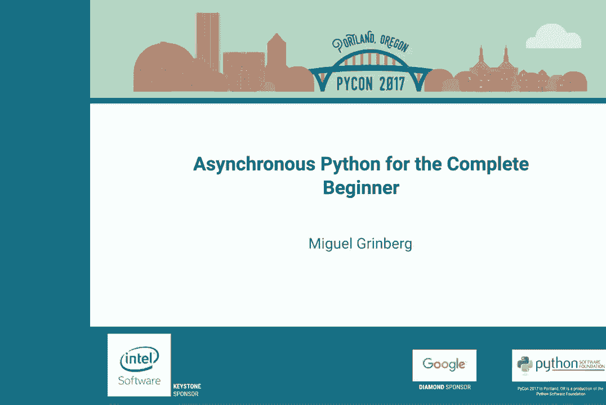

在本节课中，我们将要学习异步编程的核心概念。我们将从基本定义开始，通过生动的比喻理解其工作原理，并了解它与进程、线程等传统并发方式的区别。最后，我们会探讨异步编程的优势、适用场景以及需要注意的常见陷阱。

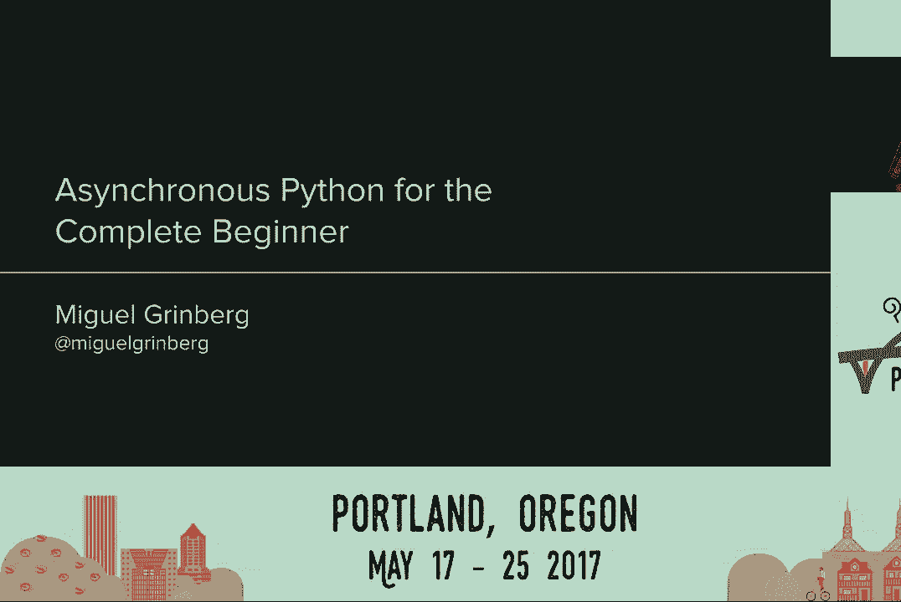


## 什么是异步编程？ 🧐

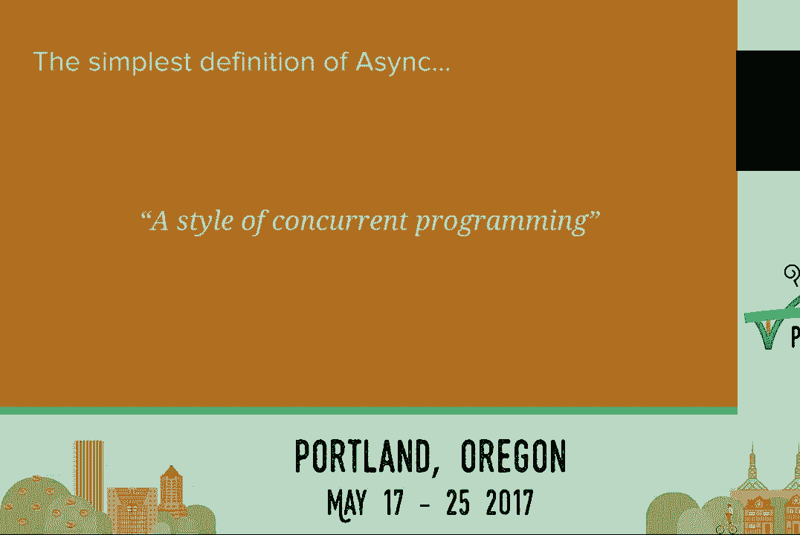


上一节我们介绍了课程概述，本节中我们来看看异步编程的基本定义。

异步是一个通用术语，指的是一种并发编程的方式，意味着程序可以同时处理多件事情。这并非特指 Python 的 `asyncio` 库，而是实现并发的一种模式。

其核心思想是：**正在运行的任务在进入等待期（如等待网络响应）时，主动释放 CPU 控制权，让其他需要 CPU 的任务得以运行**。

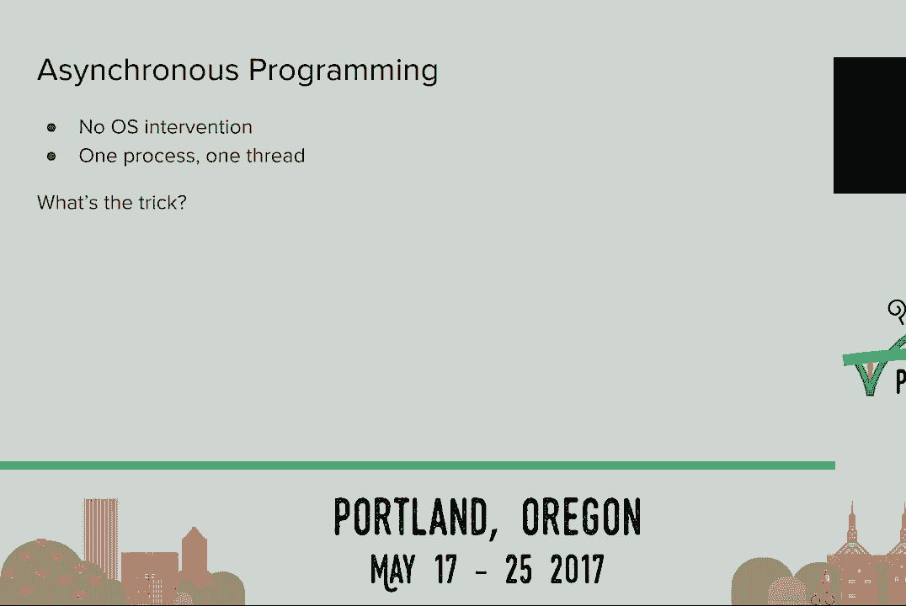

## 实现并发的几种方式 ⚙️

在深入了解异步之前，我们先看看几种常见的并发实现方式。

以下是三种主要的并发模型：


1.  **多进程**：启动多个独立的 Python 解释器进程。操作系统负责在多个 CPU 核心间分配资源。这是 CPython 中真正利用多核 CPU 的唯一方式。
2.  **多线程**：在一个进程内创建多个执行线程。它们共享内存空间，但编写线程安全的代码较为复杂。在 Python 中，由于全局解释器锁（GIL）的存在，任何时候只有一个线程可以执行 Python 字节码，这限制了多线程在 CPU 密集型任务上的性能。
3.  **异步编程**：在单个进程、单个线程内实现并发。它通过“协作式多任务”来管理多个任务，由程序自身（而非操作系统）来调度任务在何时运行。

## 异步如何工作：国际象棋表演的比喻 ♟️

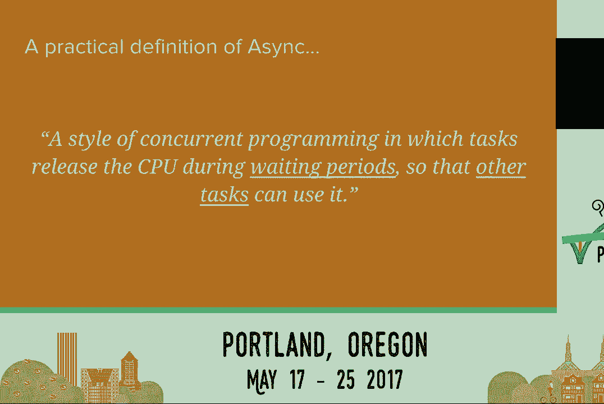

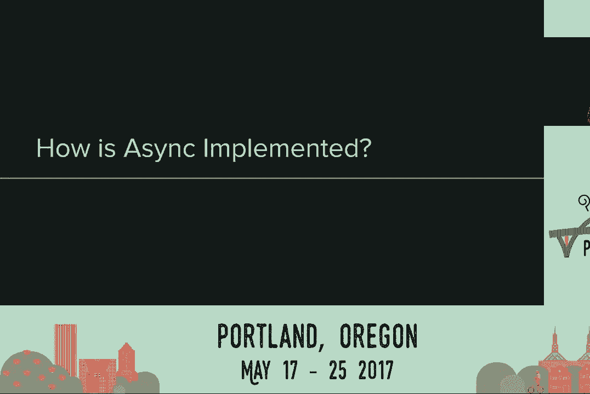

上一节我们对比了不同的并发方式，本节中我们通过一个比喻来形象地理解异步的工作原理。

想象一位国际象棋大师同时与 24 位业余棋手对弈。

*   **同步方式**：大师与第一位棋手对弈直至终局（假设30分钟），然后再与第二位对弈，如此循环。完成全部对局需要 `24 * 30分钟 = 12小时`。
*   **异步方式**：大师走到第一张棋盘，走一步（5秒），然后立即移动到第二张棋盘走一步，以此类推。在两分钟内，她可以在所有24张棋盘上走出第一步。当她回到第一张棋盘时，对手已经想好了应手，她可以立即走下一步。通过这种方式，她可以在大约1小时内完成所有对局。

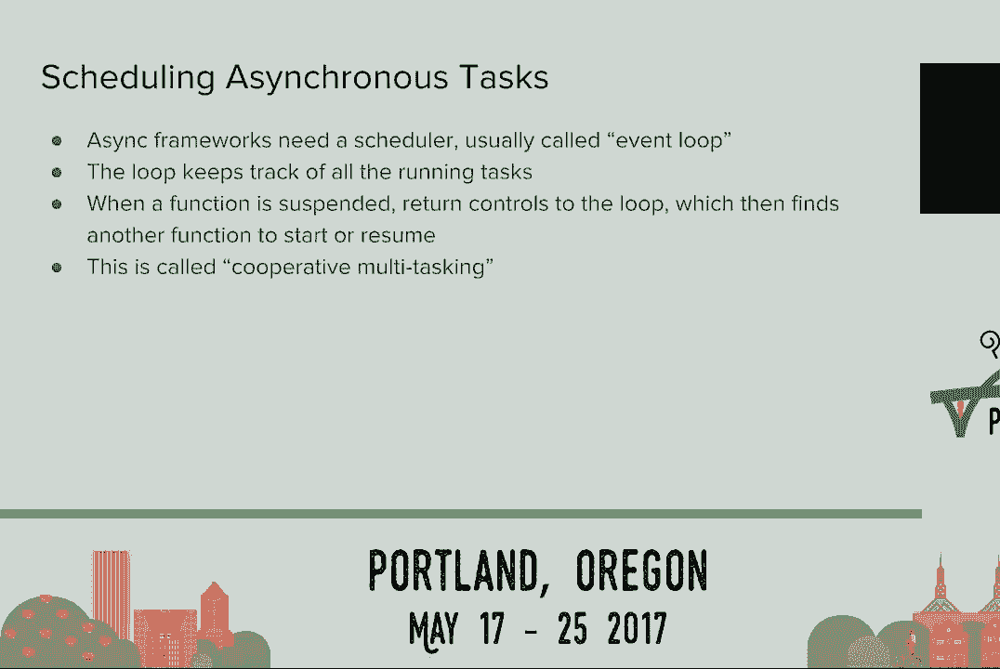

在这个比喻中：
*   **国际象棋大师** 相当于 **CPU**。
*   **走棋** 相当于 **执行计算**。
*   **等待对手思考** 相当于 **I/O 等待**。
*   **异步的秘诀** 就是 **避免 CPU 空闲等待，充分利用等待时间去处理其他任务**。


## 异步编程的技术要件 🔧

理解了核心思想后，我们来看看在代码层面实现异步需要哪些技术组件。

实现异步编程主要需要两样东西：

1.  **可暂停和恢复的函数**：我们需要一种机制，让函数在遇到 I/O 等待时能够“暂停”，并在等待结束后从暂停点“恢复”执行。在 Python 中，有几种方式可以实现：
    *   **生成器函数**：使用 `yield` 或 `yield from` 关键字。
    *   **async/await 关键字**：Python 3.5 引入的语法，使代码更清晰。
    *   **第三方库**：如 `greenlet`。
    *   **回调函数**：一种较原始且复杂的方式。

2.  **事件循环**：这是一个调度器，负责管理所有待运行的任务（协程）。它从可运行的任务中选择一个执行，当该任务主动暂停（`await`）时，事件循环收回控制权，并选择另一个任务执行，如此循环往复。这种模式称为 **协作式多任务处理**。

## 代码示例对比 📝

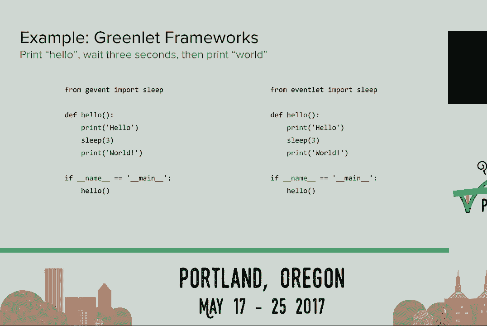


上一节我们介绍了异步的技术基础，本节中我们通过具体代码来感受其写法。

以下是一个简单的“打印 Hello， 等待3秒， 打印 World”的任务。

**同步阻塞版本**：
```python
import time

def hello():
    print(‘Hello’)
    time.sleep(3)  # 阻塞调用，整个线程停住
    print(‘World’)

# 运行10次将耗时约30秒
for _ in range(10):
    hello()
```

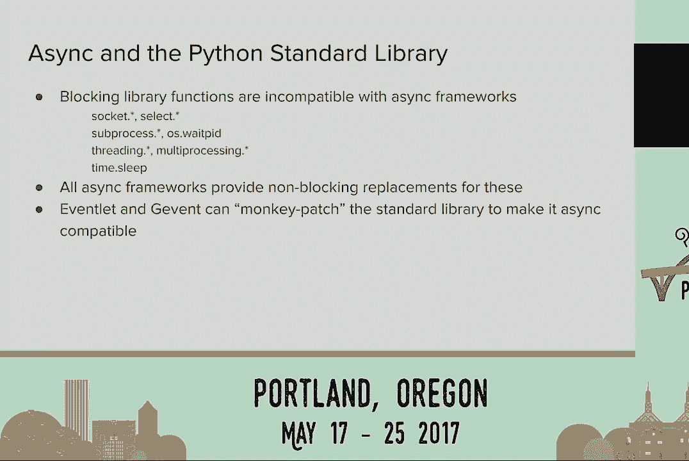


**使用 asyncio 的异步版本**：
```python
import asyncio

async def hello():
    print(‘Hello’)
    await asyncio.sleep(3)  # 非阻塞暂停，事件循环可在此期间运行其他任务
    print(‘World’)

async def main():
    # 创建10个并发任务
    tasks = [asyncio.create_task(hello()) for _ in range(10)]
    await asyncio.gather(*tasks)

asyncio.run(main())  # 总耗时仅略多于3秒
```
在异步版本中，当第一个任务执行到 `await asyncio.sleep(3)` 时，它会暂停并将控制权交还给事件循环。事件循环随即执行第二个、第三个...任务。因此，所有10个任务的“等待3秒”是并发进行的，总运行时间远短于30秒。

## 异步编程的陷阱与注意事项 ⚠️

编写异步代码时，有一些关键的注意事项，否则可能无法获得预期的性能提升，甚至导致程序阻塞。

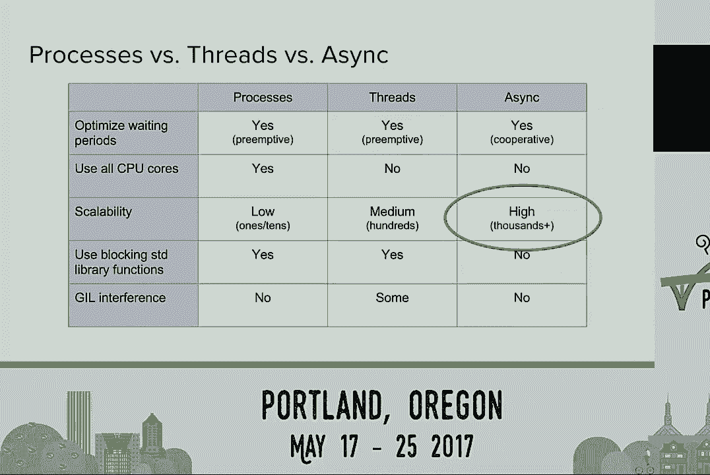

以下是初学者常遇到的几个陷阱：

1.  **CPU 密集型任务会阻塞事件循环**：由于是单线程协作，如果一个任务长时间占用 CPU 进行计算而不暂停（`await`），其他所有任务都会被阻塞。解决方案是在计算循环中定期 `await asyncio.sleep(0)` 来主动让出控制权。
2.  **不能使用标准的阻塞式 I/O 函数**：例如 `time.sleep()`、`socket.recv()`、同步的文件读写等。这些函数会阻塞整个线程。必须使用异步框架提供的替代品，如 `asyncio.sleep()`、`aiofiles` 等。
3.  **“猴子补丁”的兼容性问题**：一些异步框架（如 `gevent`、`eventlet`）通过“猴子补丁”替换标准库的阻塞函数，使得同步代码无需修改就能获得异步行为。但这可能带来隐蔽的兼容性问题，并且 `asyncio` 不采用这种方式，它要求显式地使用异步库。

## 如何选择：进程、线程还是异步？ 📊

最后，我们通过一个对比表格来总结，帮助你根据实际场景做出技术选型。

| 特性 | 多进程 | 多线程 | 异步 |
| :--- | :--- | :--- | :--- |
| **利用多核 CPU** | **是** (最佳) | 受 GIL 限制 | 受单线程限制 |
| **可扩展性** | 低 (内存开销大) | 中 | **高** (可处理数千连接) |
| **I/O 等待时不阻塞** | 是 (OS 调度) | 是 (OS 调度) | **是** (协作式调度) |
| **使用标准库阻塞函数** | 可以 | 可以 | **不可以** (需用异步版本) |
| **编程复杂度** | 中 | 高 (线程安全) | 中 |

**总结与建议**：
*   **选择异步的最佳理由**是**需要极高的 I/O 并发能力**，例如构建高性能网络服务器、爬虫或微服务，需要处理成千上万的并发连接。
*   如果需要充分利用多核进行**CPU 密集型计算**，应选择**多进程**，或结合“多进程+异步/线程”的架构。
*   如果只是简单的后台任务或已有同步代码库，**多线程**可能更易于集成。
*   如果你喜欢异步的编程模式，它本身也是一个完全有效的应用开发框架。

---


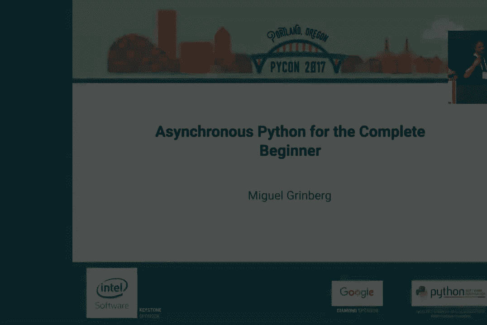

本节课中我们一起学习了异步 Python 的核心思想、工作原理、代码实现以及适用场景。关键要记住：**异步通过让任务在等待时主动让出 CPU 来实现高并发，其威力在于 I/O 密集型场景，但编写时需避免阻塞调用并注意任务间的友好协作**。