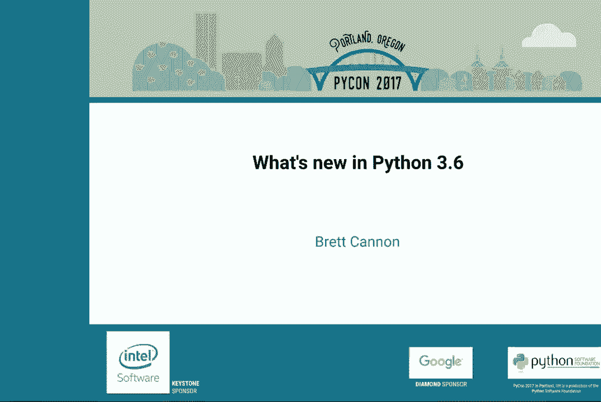
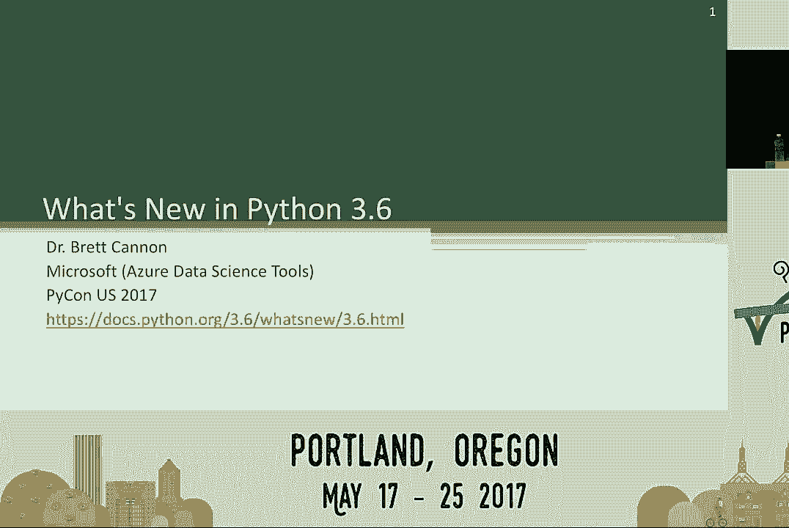
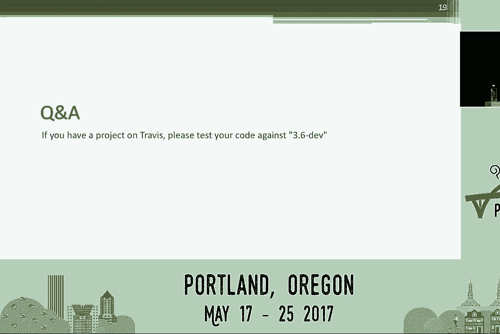
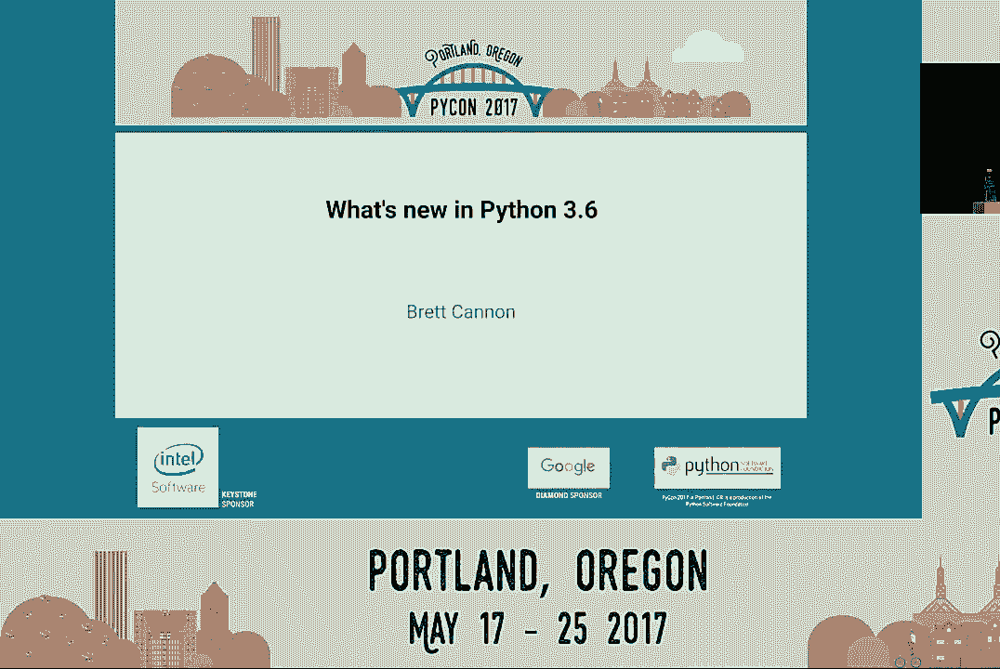

# 011：布雷特·卡农 Python 3.6 的新变化



在本教程中，我们将一起学习 Python 3.6 版本引入的一系列重要新特性。Python 3.6 是一个包含大量改进的版本，涵盖了语法增强、性能优化、安全性提升以及开发体验的改善。我们将按照 Python 增强提案（PEP）的顺序，逐一解析这些变化，帮助你快速掌握 Python 3.6 的核心更新。


## PEP 468：保留关键字参数顺序 🗂️

上一节我们介绍了本教程的概述，本节中我们来看看第一个重要特性：保留关键字参数顺序。在 Python 3.6 之前，使用 `**kwargs` 收集关键字参数时，其顺序是随机的。现在，Python 保证在函数调用中传入的关键字参数的顺序会被保留。

**核心概念**：`**kwargs` 现在是一个保持插入顺序的映射。



```python
def func(**kwargs):
    for key in kwargs:
        print(key, kwargs[key])

func(a=1, b=2, c=3)  # 输出顺序将保证是 a, b, c
```

**重要提示**：虽然 Python 3.6 的字典实现保持了插入顺序，但这在语言规范中仅针对此特定场景（函数 `**kwargs`）得到保证。请不要依赖从普通字典迭代中输出的键值顺序，因为它仍被视为实现细节。

## PEP 487：简化的类创建定制 🏗️

之前，定制类创建主要依赖元类或类装饰器，两者各有其复杂性或局限性。PEP 487 引入了一个新的类创建钩子 `__init_subclass__`，它提供了一个更简单、更直接的介入点。

**核心概念**：使用 `__init_subclass__` 方法在子类创建时进行定制。

```python
class Base:
    def __init_subclass__(cls, **kwargs):
        super().__init_subclass__(**kwargs)
        # 在类创建时添加一个方法
        cls.hello = lambda self: print(f"Hello from {cls.__name__}")

class MyClass(Base):
    pass

obj = MyClass()
obj.hello()  # 输出: Hello from MyClass
```

这个钩子在元类的完全控制和类装饰器的后期修改之间提供了一个理想的中间地带。

## PEP 495：本地时间消歧义 ⏰

处理夏令时转换期间的模糊时间一直是个难题。PEP 495 为 `datetime` 对象添加了一个 `fold` 属性，用于消除本地时间在时钟回拨时产生的歧义。

**核心概念**：`datetime` 实例的 `fold` 属性（值为 0 或 1）指示时间是否处于重复的“回拨”小时内。

```python
from datetime import datetime, timezone, timedelta

# 模拟一个模糊时间（例如，夏令时结束时的 01:30）
dt_ambiguous = datetime(2016, 11, 6, 1, 30, tzinfo=timezone(timedelta(hours=-5)))
print(dt_ambiguous)  # 输出可能包含 fold 信息
```

最佳实践是始终使用时区感知的 `datetime` 对象。但当无法获取时区信息时，`fold` 属性提供了关键的消歧义手段。

## PEP 498：格式化字符串字面量（f-string）✨

格式化字符串字面量，通常称为 f-string，是 Python 3.6 中最受瞩目的特性之一。它提供了一种更简洁、更直观且性能更高的字符串格式化方式。

**核心概念**：在字符串前加前缀 `f` 或 `F`，即可在字符串内直接嵌入表达式。

```python
name = "World"
age = 30
greeting = f"Hello, {name}. You are {age} years old."
print(greeting)  # 输出: Hello, World. You are 30 years old.

# 支持表达式
print(f"Next year you will be {age + 1}.")
```

f-string 在编译时被解析并转换为高效的字节码，因此其性能通常优于传统的 `%` 格式化或 `str.format()` 方法。

## PEP 506 与 524：增强的安全性模块 🛡️

Python 3.6 引入了两个与安全相关的 PEP，旨在提供更可靠的随机数生成。

**PEP 506：`secrets` 模块**
`secrets` 模块专为生成加密级安全的随机数（如令牌、密钥）而设计。

**核心概念**：使用 `secrets` 替代 `random` 模块进行安全敏感操作。

```python
import secrets

# 生成一个安全的随机令牌
token = secrets.token_hex(16)
print(token)

# 从序列中安全地选择一项
safe_choice = secrets.choice(['apple', 'banana', 'cherry'])
```

**PEP 524：`os.getrandom()`**
为了解决 `os.urandom()` 在系统熵不足时可能阻塞的问题，Python 3.6 恢复了 `os.urandom()` 的阻塞行为，并新增了 `os.getrandom()`。后者在熵不足时会抛出 `BlockingIOError` 异常，让开发者可以自主选择处理策略。

```python
import os

try:
    random_bytes = os.getrandom(16)  # 非阻塞，可能抛出异常
except BlockingIOError:
    # 处理熵不足的情况
    pass

# 或者使用会阻塞直到熵足够的 os.urandom()
random_bytes_blocking = os.urandom(16)
```

## PEP 509：为字典添加私有版本 🔧

这个特性主要面向 CPython 解释器的内部优化和工具开发者（如 JIT、调试器）。它在可变字典上添加了一个私有版本号，C 扩展可以借此快速判断字典自上次查看后是否被修改，从而为未来的性能优化铺平道路。普通用户通常无需直接使用此功能。

## PEP 515：数字字面量中的下划线 📊

为了提高长数字的可读性，Python 3.6 允许在数字字面量中使用下划线进行分组。

**核心概念**：在整数和浮点数中使用 `_` 作为千位分隔符（或任意分组）。

```python
# 提高大数字的可读性
billion = 1_000_000_000
hex_value = 0xDEAD_BEEF
bytes_value = 0b_1101_0010

print(billion)  # 输出: 1000000000
```

下划线的放置位置非常灵活，但不能放在数字的开头或结尾，也不能紧邻小数点。

## PEP 519：文件系统路径协议 🗺️

为了让 `pathlib.Path` 对象能在更多接受字符串路径的地方使用，PEP 519 定义了一个 `os.PathLike` 协议。任何实现了 `__fspath__()` 方法的对象都可以被识别为文件系统路径。

**核心概念**：对象通过实现 `__fspath__()` 方法来提供其路径的字符串表示。

```python
from pathlib import Path

p = Path('/home/user')
print(os.fspath(p))  # 输出: /home/user

# 现在许多标准库函数可以直接接受 Path 对象
with open(p / 'file.txt') as f:
    content = f.read()
```

标准库（如 `os.path` 模块）已广泛支持此协议，使得 `pathlib` 的使用更加无缝。

## PEP 520：保留类属性定义顺序 📝

与保留关键字参数顺序类似，PEP 520 保证了类体中属性定义的顺序会被保留在类的 `__dict__` 或 `__slots__` 中。

**核心概念**：类命名空间（如 `__dict__`）现在是一个保持插入顺序的映射。

```python
class OrderedClass:
    x = 1
    y = 2
    z = 3

print(list(OrderedClass.__dict__.keys()))
# 输出将包含 'x', 'y', 'z' 等，且其定义顺序被保留。
```

**再次强调**：这是语言规范为类命名空间提供的保证，不要依赖普通字典的迭代顺序。

## PEP 523：CPython 的帧评估 API ⚙️

这是一个面向高级用户和工具开发者（如 JIT、调试器、性能分析器）的特性。它允许在 C 级别钩住 Python 帧的执行过程，为动态替换执行引擎（例如，从解释器切换到 JIT 编译器）提供了可能。

**核心概念**：通过 `PyEval_SetProfile` 和 `PyEval_SetTrace` 等 API 的扩展，实现了更灵活的帧评估控制。

此特性本身不改变 Python 代码的写法，但它为像 PyPy 的 JIT 或 PyCharm 调试器（据说性能提升了 20%）这样的工具提供了强大的底层支持。

## PEP 525 与 530：异步生成器与推导式 ⚡

Python 3.5 引入了 `async`/`await` 语法，但生成器还不能使用 `await`。PEP 525 引入了异步生成器，PEP 530 则进一步允许在异步上下文管理器、推导式等中使用 `async for` 和 `await`。

**核心概念**：定义使用 `async def` 且包含 `yield` 语句的函数来创建异步生成器。

```python
import asyncio

async def async_gen():
    for i in range(3):
        await asyncio.sleep(0.1)  # 可以在生成器中等待
        yield i

async def main():
    # 异步列表推导式 (PEP 530)
    results = [i async for i in async_gen()]
    print(results)  # 输出: [0, 1, 2]

    # 在推导式中使用 await
    values = [await asyncio.sleep(0.1, i) for i in range(3)]
    print(values)  # 输出: [0, 1, 2]

asyncio.run(main())
```

这使得异步编程在 Python 中更加完整和流畅。

## PEP 526：变量注释语法 📄

PEP 484 引入了函数类型提示，PEP 526 将其扩展到了变量（包括类变量和实例变量）。这为静态类型检查器提供了更多信息，但运行时不会强制执行这些类型。

**核心概念**：使用冒号 `:` 语法为变量添加类型注释。

```python
from typing import List, Dict

# 类变量注释
class Node:
    children: List['Node'] = []
    metadata: Dict[str, str]

    def __init__(self, value: int):
        # 实例变量注释
        self.value: int = value
        # 局部变量注释（主要用于静态检查，运行时无作用）
        local_var: str = "temp"

# 类型信息可通过 __annotations__ 访问
print(Node.__annotations__)  # 输出: {'children': typing.List[__main__.Node], 'metadata': typing.Dict[str, str]}
```

变量注释主要服务于像 `mypy` 这样的静态类型检查工具，以提升代码的健壮性和可维护性。

## PEP 528 与 529：Windows 控制台与文件系统编码改进 💻

这两个 PEP 显著改善了 Python 在 Windows 平台上的使用体验。

**PEP 528：Windows 控制台使用 UTF-8**
Python 交互式解释器（REPL）现在在 Windows 上默认使用 UTF-8 编码，这意味着可以正确显示 Emoji 和其他 Unicode 字符。

**PEP 529：Windows 文件系统编码改为 UTF-8**
Python 现在将 Windows 文件系统编码默认视为 UTF-8。当接收到字节路径时，会将其重新编码为 UTF-16 供 Windows API 使用。这使得处理从 Python 2 迁移过来的、使用字节路径的代码更加容易。

```python
# 现在在 Windows 上，这类操作更加可靠
with open('café.txt', 'w', encoding='utf-8') as f:  # 路径包含非ASCII字符
    f.write('Hello')
```

## 其他重要改进 🎁

*   **PEP 529**：添加了 `PYTHONMALLOC` 环境变量，允许在不重新编译调试版 Python 的情况下启用内存分配调试器。
*   **DTrace 和 SystemTap 支持**：为 CPython 添加了基本的 DTrace 和 SystemTap 探针支持，便于系统级性能分析和跟踪。
*   **性能提升**：Python 3.6 包含了许多内部优化。根据 [speed.python.org](https://speed.python.org) 的基准测试，Python 3.6 在多项指标上比 Python 2.7 和 3.5 更快。
*   **语法警告**：对无效的转义序列（如 `\m`）会发出 `SyntaxWarning`，帮助开发者避免错误。

## 总结 🎯



本节课中我们一起学习了 Python 3.6 版本带来的众多新特性。我们从保留关键字参数和类属性顺序开始，探讨了更安全的 `secrets` 模块、革命性的 f-string、更易读的数字字面量、对 `pathlib` 的更好支持，以及强大的异步生成器和变量注释语法。我们还看到了针对 Windows 平台的编码改进和为高级用户准备的底层钩子。




Python 3.6 是一个功能丰富且性能卓越的版本，这些改进共同使 Python 语言更加强大、安全和易用。建议开发者查阅 [官方文档](https://docs.python.org/3.6/whatsnew/3.6.html) 以获取更详细的信息，并开始在新项目中使用这些特性。