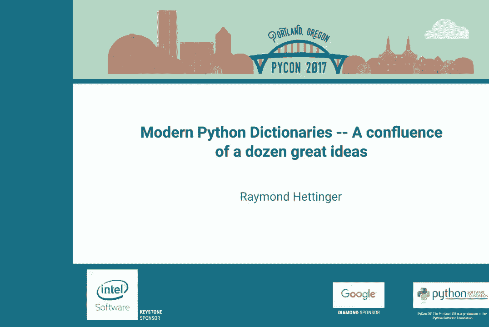

# 012：十几个伟大思想的汇聚 🧠




在本教程中，我们将跟随Raymond Hettinger的演讲，探索Python字典从诞生到现代实现的演进历程。我们将看到，现代Python字典是跨越约50年、汇聚了十几个伟大思想的结晶。从最初的简单设计到如今高效、紧凑的实现，每一步创新都解决了特定问题并提升了性能。

## 概述 📖

Python字典是语言的核心组件。全局变量、局部变量、模块、类和实例都依赖于字典。它们无处不在且至关重要。本教程将带你从“恐龙时代”的简单关联列表开始，逐步了解哈希表、分离链接、开放寻址、缓存哈希、快速匹配、键共享字典等关键概念，最终抵达Python 3.6中更小、更快、有序的现代字典实现。

---

## 1：起点与现状 🦕➡️🤖

上一节我们概述了本教程的内容，本节中我们来看看Python字典的起点和我们最终要达到的现代形态。

一个简单的Python类实例，其属性背后就是字典。

```python
class Person:
    def __init__(self, name, color, city, fruit):
        self.name = name
        self.color = color
        self.city = city
        self.fruit = fruit

quito = Person('Quito', 'blue', 'Austin', 'apple')
```

实例`quito`的属性存储在一个字典中。不同Python版本中，这个字典的实现和特性差异巨大。

以下是不同Python版本中字典特性的对比：

*   **Python 2.7**:
    *   大小：280字节
    *   键顺序：确定性但杂乱（与插入顺序无关）
*   **Python 3.5**:
    *   大小：196字节
    *   键顺序：随机化（每次运行顺序不同）
*   **Python 3.6+**:
    *   大小：112字节
    *   键顺序：确定性（保持插入顺序）

现代Python 3.6+的字典更小、更快，并且是隐式的“有序字典”。这是升级到Python 3.6+的一个重要理由。

---

## 2：最初的尝试——线性搜索 📜

上一节我们看到了现代字典的优越性，本节中我们回溯历史，看看最初人们是如何解决问题的。

在早期，人们使用类似数据库表的结构存储关联数据。在Python中，可以表示为一个元组列表。

```python
# 模拟一个简单的“数据库表”
data = [
    ('Quito', 'blue'),
    ('Sarah', 'red'),
    ('Barry', 'yellow'),
    ('Rachel', 'green'),
    ('Tim', 'purple')
]
```

要查找`‘Barry’`对应的颜色，必须进行**线性搜索（Linear Search）**，即从头到尾遍历列表，直到找到匹配的键。

```python
def linear_search(key, data):
    for k, v in data:
        if k == key:
            return v
    return None
```

当数据量增大时，线性搜索的性能会急剧下降。有趣的是，即使只有2到3个条目，现代字典的性能通常也已优于线性搜索的列表。

---

## 3：哈希表的诞生——分离链接法 🪣

上一节我们介绍了低效的线性搜索，本节中我们来看看第一个伟大创新：哈希表，具体来说是分离链接法（Separate Chaining）。

哈希表的核心思想是**减少搜索空间**。与其在一个大列表中搜索，不如先将所有条目分散到多个更小的“桶”（bucket）中。查找时，先确定目标在哪个桶，然后只在该桶内进行小范围的线性搜索。

确定条目属于哪个桶的过程叫做**哈希（Hashing）**。我们使用一个哈希函数来计算键的哈希值，然后根据哈希值决定其桶的索引。

```
哈希值 = hash(键)
桶索引 = 哈希值 % 桶的数量
```

以下是分离链接法的演进思路：

1.  **两个桶**：将条目分散到两个桶中，平均搜索长度减半。
2.  **四个桶**：进一步分散条目，大多数查找只需一次探测（probe）即可命中。
3.  **更多桶**：当桶的数量足够多，使得每个桶内平均只有很少甚至一个条目时，查找效率接近常数时间O(1)。

然而，随着字典中条目数量增加，如果桶的数量固定，每个桶内的链会变长，性能会退化。解决方案是**动态调整大小（Resizing）**：当字典的负载因子（条目数/桶数）超过某个阈值（如2/3）时，就创建一个更大的新表（通常是原大小的两倍），然后将所有条目重新哈希并插入新表。

---

## 4：性能优化——缓存哈希与快速匹配 ⚡

上一节我们学习了哈希表的基本原理，本节中我们深入两个关键的优化细节，这些在学校教科书中往往被省略。

**缓存哈希值（Caching Hashes）**
在调整大小时，需要为每个键重新计算哈希值。对于某些对象（如长字符串、复杂对象），计算哈希值可能非常昂贵。因此，Python字典在存储条目时，会**缓存**该键的哈希值。调整大小时，只需读取缓存的哈希值，无需重新计算，这使得调整大小的操作非常快。

**快速匹配（Fast Matching）**
在桶内查找匹配的键时，最直接的方法是调用键的`__eq__`方法进行相等性比较。但在面向对象语言中，`__eq__`操作可能非常复杂和耗时（例如比较两个包含许多字段的对象）。

Python字典使用了一个包含两个步骤的**快速匹配**算法来尽可能避免昂贵的相等性比较：

1.  **身份比较（Identity Comparison）**：首先检查两个对象是否是同一个对象（即`key is target_key`）。如果是，则它们必然相等。这只需要一次快速的指针比较。
2.  **哈希值比较（Hash Comparison）**：然后比较缓存的哈希值。如果哈希值不相等，根据哈希不变式（相等的对象必须有相等的哈希值），可以断定这两个对象不相等。

只有在以上两步都无法确定时，才会进行最终的、可能昂贵的相等性测试（`key == target_key`）。由于64位哈希值冲突的概率极低，在实践中几乎永远不会进行不必要的相等性测试。

```python
# 快速匹配的伪代码逻辑
if key is target_key:
    return True  # 身份即相等，快速返回
if cached_hash != target_hash:
    return False # 哈希不同，必然不等
# 最后的手段：进行完整的相等性比较
return key == target_key
```

这两行优化代码对Python字典的性能至关重要。

---

## 5：空间优化——开放寻址与线性探测 🗺️

上一节我们关注了查找速度的优化，本节中我们看看如何优化哈希表的空间利用率。

分离链接法需要为每个桶维护一个链表（或列表），这引入了额外的指针开销。**开放寻址（Open Addressing）** 是另一种策略，它将所有条目都存储在一个大的连续数组中，从而消除了指针开销。

当发生哈希冲突时（两个键被哈希到同一个数组索引），开放寻址会按照某种探测序列（Probing Sequence）寻找下一个可用的空槽。最简单的是**线性探测（Linear Probing）**：如果索引`i`被占用，则尝试`i+1`, `i+2`，依此类推。

```python
# 线性探测的简化示例
index = hash(key) % table_size
while table[index] is not None and table[index].key != key:
    index = (index + 1) % table_size  # 线性移动到下一个槽
```

**删除的问题与虚位条目（Dummy Entry）**
开放寻址的一个挑战是删除。如果直接清空一个槽，可能会切断后续条目的探测路径，导致它们变得“不可达”。解决方案是使用一个特殊的**虚位条目（如`<dummy>`）** 来标记被删除的位置。查找时，遇到虚位条目可以跳过它继续探测；插入时，则可以复用虚位槽。

**更优的探测序列——扰动（Perturbation）**
单纯的线性探测容易导致“聚集”（Clustering），降低性能。Python采用了一种更聪明的方法，结合了**扰动**技术：在发生冲突时，不仅使用哈希值的低位，还逐步引入哈希值的高位来生成新的探测索引。这通常与一个线性同余生成器结合（如 `index = (5*index + 1) % table_size`），确保能探测到表中的每一个槽，避免死循环。

---

## 6：现代字典——紧凑布局与键共享 🧩

上一节我们介绍了开放寻址，本节中我们来到现代Python字典的核心创新：紧凑布局。

传统的开放寻址哈希表（如Python 3.5之前）是一个稀疏数组，每个槽存储三个字段：哈希值、键、值。这造成了大量的空间浪费（空槽）。

**紧凑字典（Compact Dict）**
Raymond Hettinger提出的创新是将存储结构一分为二：
1.  **密集数组**：一个按插入顺序紧密排列的数组，依次存储所有条目的`(哈希值, 键, 值)`。这个数组没有空位。
2.  **索引表**：一个大小与哈希表桶数相同的稀疏数组。它不直接存储数据，而是存储指向密集数组中对应条目的**索引**。

```
# 传统布局（稀疏）
索引表: [空, 空, 指向(哈希A, 键A, 值A), 空, 指向(哈希B, 键B, 值B), ...]

# 紧凑布局
密集数组: [(哈希A, 键A, 值A), (哈希B, 键B, 值B), ...] # 紧密排列
索引表: [空, 空, 0, 空, 1, ...] # 存储的是密集数组的索引
```

**优势**：
*   **空间高效**：消除了稀疏数组中的空槽浪费。
*   **迭代更快**：遍历密集数组就是按插入顺序遍历，非常高效。
*   **保持顺序**：作为紧凑布局的副产品，字典自然地保持了键的插入顺序。

**键共享字典（Key-Sharing Dict）**
对于拥有大量相同键集合的字典（例如许多同类实例的`__dict__`），PEP 412引入了进一步的优化。这些字典可以共享相同的键（和哈希值）数组，每个实例只需存储自己独有的值数组。这极大地减少了内存占用。

```python
# 多个实例的字典共享键数组
共享键表: [‘name‘, ‘color‘, ‘city‘, ‘fruit‘]
实例1值表: [‘Quito‘, ‘blue‘, ‘Austin‘, ‘apple‘]
实例2值表: [‘Sarah‘, ‘red‘, ‘Dallas‘, ‘banana‘]
```

---

## 7：其他要点与未来展望 🔮

上一节我们揭晓了现代字典的最终形态，本节中我们补充一些其他要点并展望未来。

**安全性——哈希随机化**
为防止一种称为“哈希洪水拒绝服务（HashDoS）”的攻击（攻击者故意构造大量哈希冲突的键来拖慢字典性能），Python在启动时会生成一个随机盐（salt）并与对象的哈希值混合。这使得攻击者无法预测键的哈希分布，从而无法轻易构造冲突。

**集合（Set）的不同策略**
Python的集合（`set`）虽然也基于哈希表，但其优化策略与字典略有不同。因为集合的主要操作是判断成员是否存在，而字典的主要操作是通过已知键查找值。两者在负载因子、探测策略上可能进行不同的权衡。

**关于布谷鸟哈希（Cuckoo Hashing）**
布谷鸟哈希是另一种哈希表冲突解决策略，它使用两个（或多个）哈希函数和两个表。虽然它能保证最坏情况下的查找次数，但现代Python的紧凑字典通过增加索引表的稀疏性（用很小的空间代价）已能基本消除冲突，因此目前并未采用布谷鸟哈希。

**迭代安全**
在迭代字典或集合时修改其结构（如增删键）会导致未定义行为或运行时错误。Python内部有机制来检测这种操作并抛出`RuntimeError`，以保证程序不会崩溃。

**未来：更稀疏的索引表**
一个未来的优化方向是进一步增加索引表的稀疏性（例如，让索引表大小是条目数的两倍）。由于索引表本身很小（存储字节），增加其大小的代价很低，但却能几乎完全消除哈希冲突，使绝大多数查找在第一次探测时就命中。

---

## 总结 🎯

本节课中我们一起学习了Python字典波澜壮阔的演进史。我们从最基础的线性搜索和关联列表出发，逐步探索了：

1.  **哈希表与分离链接法**：通过分桶减少搜索空间。
2.  **动态调整大小**：维持哈希表的高性能。
3.  **缓存哈希**：加速调整大小操作。
4.  **快速匹配**：利用身份比较和哈希比较避免昂贵的相等性测试。
5.  **开放寻址与线性探测**：提高空间利用率，并引入虚位条目处理删除。
6.  **扰动技术**：优化探测序列，减少聚集。
7.  **版本号**：允许缓存字典查找结果。
8.  **紧凑布局**：将数据存储与索引分离，实现空间高效和有序迭代。
9.  **键共享字典**：为大量相似字典节省内存。
10. **哈希随机化**：增强安全性，抵御HashDoS攻击。


最终，这些跨越数十年的伟大思想汇聚成了Python 3.6及以后版本中我们使用的**更小、更快、有序且内存高效**的现代字典。这个演进过程完美体现了软件工程中持续的优化、权衡与创新精神。