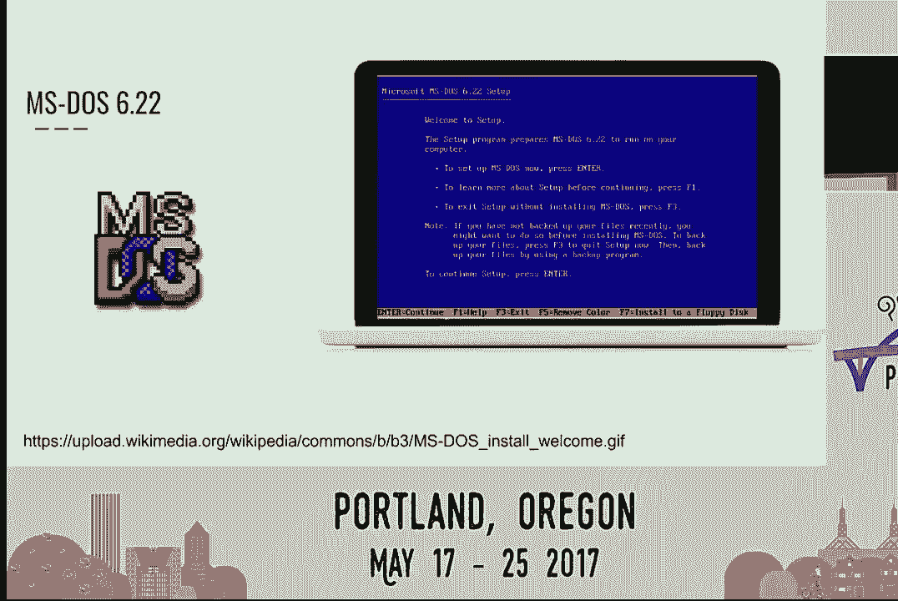
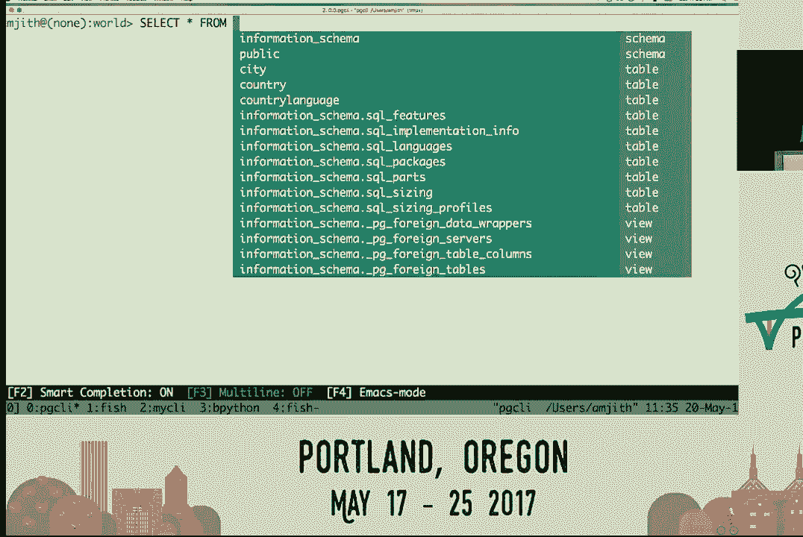
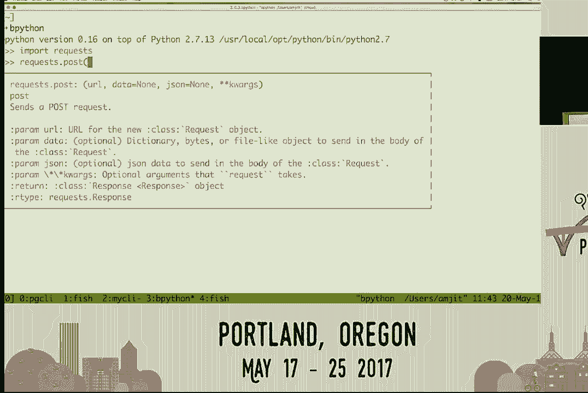
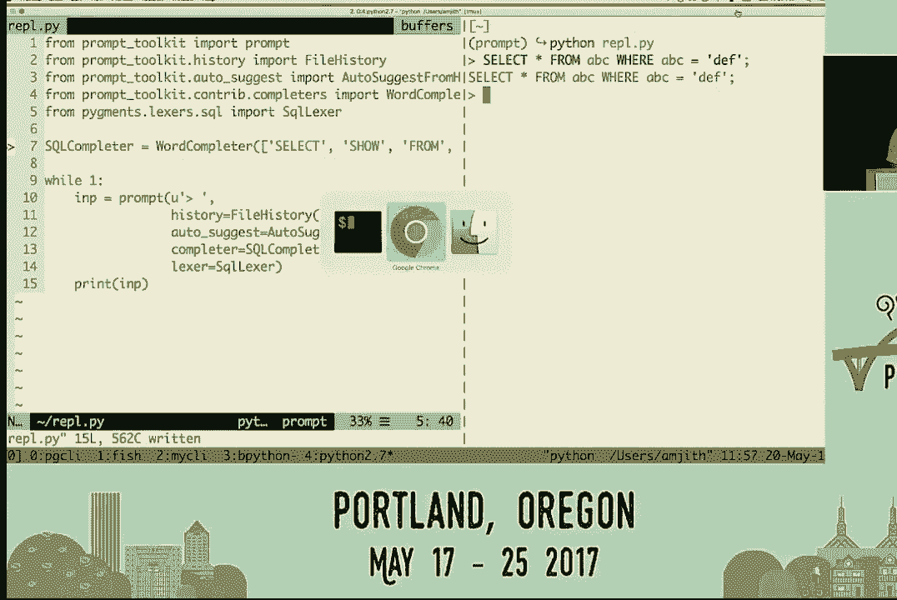
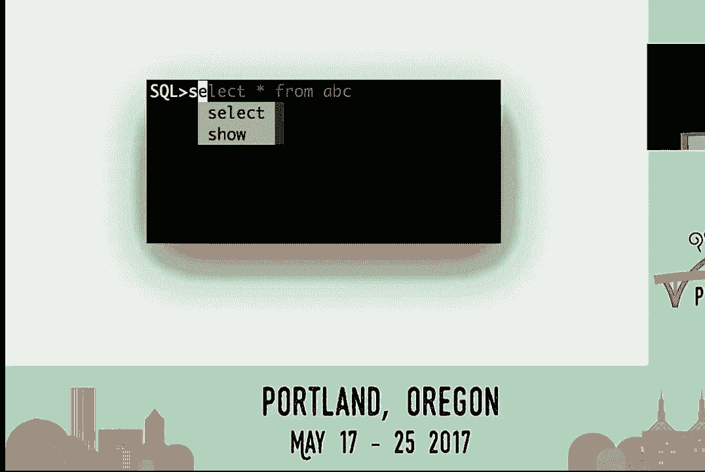
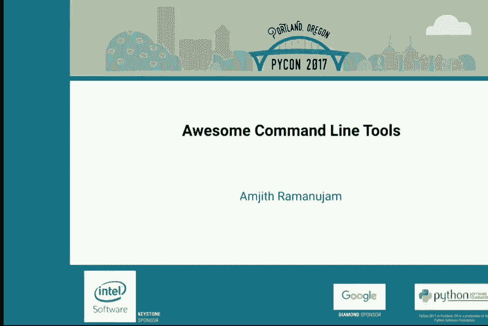

# 014：Amjith Ramanujam 在 PyCon 2017 的演讲 🚀


在本教程中，我们将学习如何设计出色的命令行工具。我们将探讨三个核心设计原则：**可发现性**、**用户关注**和**最小化配置**。通过分析 PGCLI、MyCLI、Fish Shell 和 Bpython 等优秀工具，我们将了解如何将这些原则付诸实践。最后，我们将使用 Python 的 `prompt_toolkit` 库，快速构建一个功能丰富的交互式 REPL。

---

## 精彩的命令行工具：1：引言与背景


我叫 Amjith Ramanujam。本次演讲的主题是命令行工具。我的日常工作是在 Netflix 的流量工程团队。但今天，我将讨论我的两个副项目：PGCLI 和 MyCLI，它们分别是 PostgreSQL 和 MySQL 的命令行客户端。

本次演讲将分享我们作为核心团队，为克服命令行界面固有局限而做出的一些设计决策。我们从许多设计精良的现有命令行应用程序中获得了灵感。

---



## 精彩的命令行工具：2：可发现性的重要性 🕵️

故事始于大约二十年前。一个孩子在 MS-DOS 终端上输入命令，因打错字而沮丧。直到老师教他使用**上箭头键**调出历史命令并编辑，问题才得以解决。这带来了巨大的喜悦。

后来，在 Linux 中，Bash 保留了通过上下箭头导航历史的惯例。更令人惊喜的是**Tab 键补全**功能，它能自动补全文件名或路径名。


然而，这些强大功能并不容易被新用户发现。用户需要阅读手册页，或依赖他人指导。相比之下，GUI 应用的新功能通常有明确的图标或菜单项，易于探索。

那么，如何将这种**可发现性**引入命令行应用呢？我们将以历史导航和 Tab 补全为例。


---

### 提升 Tab 补全的可发现性


在 PGCLI 中，我们改进了 Tab 补全。用户开始输入时，所有补全选项会**立即显示**，无需先按 Tab 键。例如，输入 `SELECT` 时，相关关键字会自动建议。

```python
# 在 PGCLI 中，补全建议是即时且上下文相关的。
输入: SEL
建议: SELECT
```



---

### 提升历史导航的可发现性

在 Bash 中，可以通过 `Ctrl+R` 搜索历史命令，但这功能不易被发现。Fish Shell 采取了更主动的方式：用户一开始输入，它就会**自动搜索历史**并给出建议，用户按右箭头即可采纳。

```bash
# Fish Shell 风格的历史建议
输入: git comm
建议: git commit -m “fix typo” (来自历史记录)
```


---

### 可发现性的核心理念


其背后的理念是**坦诚**。不要将功能隐藏在特殊按键组合之后。为了让程序更具可发现性，应该更直接地向用户展示其功能。


---


## 精彩的命令行工具：3：以用户为中心的设计 👥


上一节我们探讨了可发现性，本节我们来看看如何将**用户放在首位**。设计时应首先考虑什么对用户最直观、最强大，而不是实现起来有多困难。


---

### 案例对比：MySQL vs MyCLI

以下是 MySQL 默认客户端与 MyCLI 在补全体验上的对比：

1.  **大小写敏感性问题**：在 MySQL 客户端中，输入 `sel` 后按 Tab 无反应，必须输入 `SEL`（大写）才会触发补全。MyCLI 则实现了**不区分大小写**的补全。
2.  **上下文无关的补全**：在 MySQL 中，输入 `SELECT * FROM` 后按 Tab，会列出所有可能的关键字（可能超过800个），而不是当前数据库中的表。MyCLI 则提供**上下文敏感**的补全，`FROM` 关键字后只建议当前数据库中的表名。

```sql
-- MyCLI 的上下文敏感补全
输入: SELECT * FROM users WHERE
补全建议: id, name, email... (仅限 users 表的列)
```


最初实现 MyCLI 的智能补全引擎非常困难，但坚持**用户优先**的原则，最终创造了更强大的工具。

---

### 用户关注点的总结


始终将用户置于首位。在设计新功能时，思考用户的需求，追求极致的直观和强大。实现细节的困难应该放在第二位去解决。


---


## 精彩的命令行工具：4：警惕过度配置 ⚙️

我们已将最好的留到最后。Bpython 是一个出色的交互式 Python Shell，它展示了如何通过智能默认值减少配置。

---

### Bpython 的强大功能



在标准 Python REPL 中，输入 `impo` 后按 Tab，只会插入一个制表符。而在 Bpython 中：
*   输入时自动显示补全建议。
*   显示函数签名和文档字符串。
*   无需离开终端即可了解方法用法。


```python
# 在 Bpython 中
输入: requests.get(
显示: get(url, params=None, **kwargs)  # 自动显示签名和文档
```

---

### 配置是“万恶之源”


一个常见的反对意见是：“我可以通过配置标准 Python REPL 来获得类似功能。”然而，过多的配置选项往往意味着程序**无法智能地判断什么对用户最好**。

配置应仅限于**主观偏好**，例如配色方案。对于客观的功能，程序应该提供**明智的默认值**，让大多数用户开箱即用，无需配置。


---


## 精彩的命令行工具：5：快速构建卓越 REPL 🛠️

我们探讨了命令行工具的三大问题：可发现性、用户关注和配置最小化。现在你可能会想，实现这些高级功能是否非常困难？

如果我告诉你，用大约 10 行 Python 代码，在 10 分钟内就能实现一个具备所有这些功能的 REPL，你会怎么想？

以下是构建一个优秀交互式 REPL 的检查清单：
1.  **持久化历史记录**
2.  **历史搜索**（如 `Ctrl+R` 或 Fish 风格建议）
3.  **Emacs 风格键绑定**（如 `Ctrl+A` 到行首，`Ctrl+E` 到行尾）
4.  **输出分页**
5.  **自动触发补全**（无需按 Tab）
6.  **最小化配置**
7.  **语法高亮**

我们将使用 `prompt_toolkit` 库来实现它们。

---

### 第一步：基础 REPL

首先，我们创建一个简单的回声 REPL，它读取用户输入并打印出来。

```python
from prompt_toolkit import prompt

while True:
    user_input = prompt(‘> ‘)
    print(user_input)
```


---


### 第二步：添加持久化历史记录


使用 `prompt_toolkit` 的 `FileHistory` 为 REPL 添加历史记录功能。

```python
from prompt_toolkit import prompt
from prompt_toolkit.history import FileHistory

while True:
    user_input = prompt(‘> ‘, history=FileHistory(‘./history.txt‘))
    print(user_input)
```
现在，REPL 已经支持上下箭头导航历史、`Ctrl+R` 搜索，以及 Emacs 键绑定。

---

### 第三步：添加 Fish 风格自动建议

让 REPL 能够根据历史记录自动建议。

```python
from prompt_toolkit import prompt
from prompt_toolkit.history import FileHistory
from prompt_toolkit.auto_suggest import AutoSuggestFromHistory

while True:
    user_input = prompt(
        ‘> ‘,
        history=FileHistory(‘./history.txt‘),
        auto_suggest=AutoSuggestFromHistory(), # 添加自动建议
    )
    print(user_input)
```

---

### 第四步：添加自动补全

我们创建一个 SQL 关键字补全器，并在用户输入时自动触发补全。

```python
from prompt_toolkit import prompt
from prompt_toolkit.history import FileHistory
from prompt_toolkit.auto_suggest import AutoSuggestFromHistory
from prompt_toolkit.completion import WordCompleter

# 定义 SQL 补全器
sql_completer = WordCompleter([‘select‘, ‘from‘, ‘where‘, ‘show‘], ignore_case=True)

while True:
    user_input = prompt(
        ‘> ‘,
        history=FileHistory(‘./history.txt‘),
        auto_suggest=AutoSuggestFromHistory(),
        completer=sql_completer, # 添加补全器
        complete_while_typing=True, # 输入时自动补全
    )
    print(user_input)
```

---

### 第五步：添加语法高亮

使用 `Pygments` 库为 SQL 语句添加语法高亮。

```python
from prompt_toolkit import prompt
from prompt_toolkit.history import FileHistory
from prompt_toolkit.auto_suggest import AutoSuggestFromHistory
from prompt_toolkit.completion import WordCompleter
from pygments.lexers.sql import SqlLexer # 导入 SQL 词法分析器

sql_completer = WordCompleter([‘select‘, ‘from‘, ‘where‘, ‘show‘], ignore_case=True)



while True:
    user_input = prompt(
        ‘> ‘,
        history=FileHistory(‘./history.txt‘),
        auto_suggest=AutoSuggestFromHistory(),
        completer=sql_completer,
        complete_while_typing=True,
        lexer=SqlLexer, # 添加语法高亮
    )
    print(user_input)
```



至此，我们用一个简短的脚本实现了一个支持持久历史、智能补全、自动建议和语法高亮的强大 REPL。输出分页可以使用 `click` 库轻松实现。

---

## 精彩的命令行工具：6：总结与资源 📚

本节课中，我们一起学习了设计优秀命令行工具的三大原则：
1.  **可发现性**：主动展示功能，减少隐藏操作。
2.  **用户关注**：优先考虑用户体验，再解决实现难题。
3.  **最小化配置**：提供明智的默认值，仅在处理主观偏好时提供配置选项。

我们还使用 `prompt_toolkit` 库快速构建了一个功能丰富的 REPL，演示了如何轻松应用这些原则。


**相关资源**：
*   **PGCLI**: PostgreSQL 命令行客户端
*   **MyCLI**: MySQL 命令行客户端
*   **Fish Shell**: 现代化的命令行 Shell
*   **Bpython**: 功能丰富的 Python REPL
*   **prompt_toolkit**: 用于构建强大命令行应用程序的 Python 库
*   **Click**: Python 命令行工具创建库，支持输出分页




感谢阅读，希望这些理念能帮助你构建更用户友好的命令行工具！