# P1：Kenneth Reitz - Pipenv Python 依赖管理的未来 - PyCon 2018 - 哒哒哒儿尔 - BV1Ms411H7Hn

好吧。

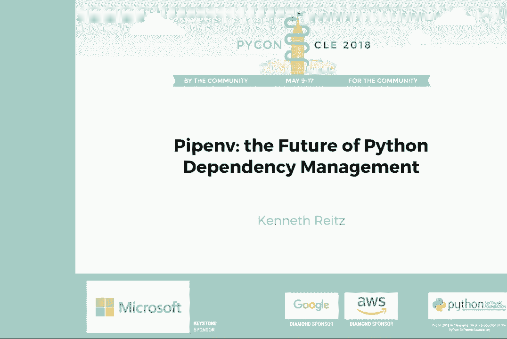

感谢大家参加这个会议。你们中有多少人使用 requests？

是的。哇，Kenneth，这一定让你很开心。非常感谢。[掌声]我得说，Kenneth 是我心目中的 Python 英雄。最后，我想主持这个会议的原因是因为我能亲自见到他。他是我心目中的 Python 英雄，因为他编写的 API 设计是为人类服务的，不像大多数其他 API。

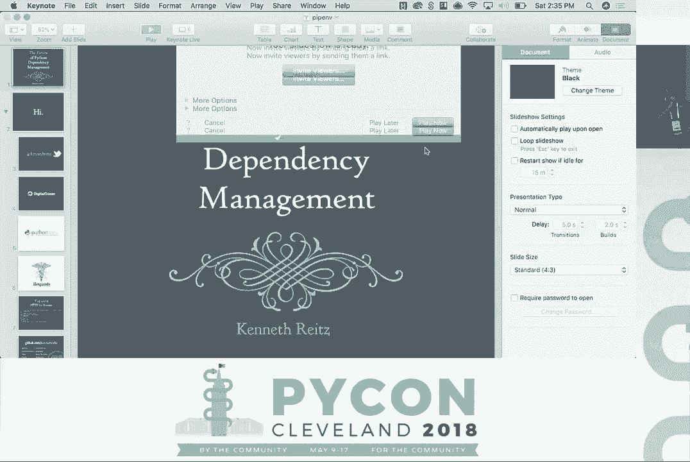

科学计算社区的成员们。好吧？正如我们所知，我也是这个社区的一部分，所以我可以这样说。

他是 requests 的创作者。正如我们所看到的，很多人使用 requests。这是一个非常受欢迎的包。他在这里谈论 pipen，这是另一个为人类设计的工具。好的，Ken，请开始吧。[掌声]大家好。欢迎来到 Python 第二天，我想是的。大家到目前为止都过得愉快吗？好吧。

我想特别感谢 Ernest W. Durban 组织这个活动。我认为他在克利夫兰做得非常出色。我也期待明年。所以这是 Python 依赖管理的未来。大家好，我是 Kenneth Reitz。如果你愿意，可以在 Twitter 上关注我 @KennathRites。每一个关注我都非常感激。

我在 DigitalOcean 工作。这对我来说是一个新的开始。我之前在 Heroku 工作，但我大约五天前刚换了工作。我想确保我在 Python 活动中代表我的新公司。因此我签署了文件，直接赶来了这里。我仍在进行入职培训等一切，所以我还不能正式对任何事情发表看法。

但我非常兴奋能够加入这个团队。我认为这是世界上最容易接触的基础设施，作为服务提供。如果你对 DigitalOcean 有任何问题，或者觉得我们有任何合作的机会，或者想知道的任何事情，可以稍后来问我。

我也是 Python 软件基金会的董事会成员。我稍后会做关于这个的快速演讲。Python 软件基金会是一个旨在保护 Python 知识产权，并有效地组织这个活动的机构。这就是该组织大部分收入的来源。

大部分收入来自于 Python。这也是 Python 存在的原因之一。这是一个了不起的组织。在场的每个人，我想，都是对 Python 有所投资，因为你们在这里参加 Python 活动。所以我鼓励还不是会员的每个人，成为会员。这个是免费的。捐款也是一直欢迎的。

但是你可以注册并成为会员。如果你愿意，还可以成为投票或活跃会员，这样你就可以参与投票并帮助引导语言未来的决策。所以如果你知道我是谁，可能是因为 Request 库，它是为人类设计的 HTTP。

它看起来像这样，允许你在互联网上用 Python 轻松发出 HTTP 请求。在这个库出现之前，做到这一点是非常困难的，因为有 lib2 和其他一些工具，我可以说并不是那么友好。这个库非常受欢迎，我很感谢社区的支持。

这个项目的磨损感让我很谦卑。其他一些项目在 GitHub 上。如果你可能在这些项目中认出我，OSX GCC 安装程序就是现在这个——它被称为 Xcode 安装——，Xcode 选择-install。它让你在不安装 5 到 6GB 的 Xcode 的情况下，在 Mac 上安装 GCC。

这都是因为我的项目 OSX GCC 安装程序。我还有一堆其他东西，比如 Maya 记录、平板等等。还有这个播客的导入。不过，关于我就够了。我在这里是为了谈论打包，Python 打包。那么这里谁在使用 Python 打包？

所以我问，谁不使用 Python 打包？我们反过来问这个吧。一个人。两个人。所以 Python 打包几乎影响到每一个使用 Python 的人。它有一个有趣的历史，因为人们在不同的时期接触 Python。我从大约 2007 年开始使用 Python。

我知道一些人使用 Python 的时间要长得多，所以我这十年的 Python 经历并不算什么。但与某些人相比，还是有些独特的。我对打包历史有一些了解。我喜欢分享我对历史的看法，所以有些事情可能会稍微不清楚。

目前的状况以及为什么事情会这样发展的进展情况。

过去，当我开始写 Python 时，如果你想安装某个东西，你会从互联网上下载一个 tar 包，然后解压。接着运行 setup.py install，安装到你的 site packages 目录中。然后它就会被安装。

这就是安装 Python 包的事实标准方式。有些人实际上会直接解压并拖到他们的 site packages 文件夹里。这就是管理 Python 依赖关系的方式，这曾经是常态。

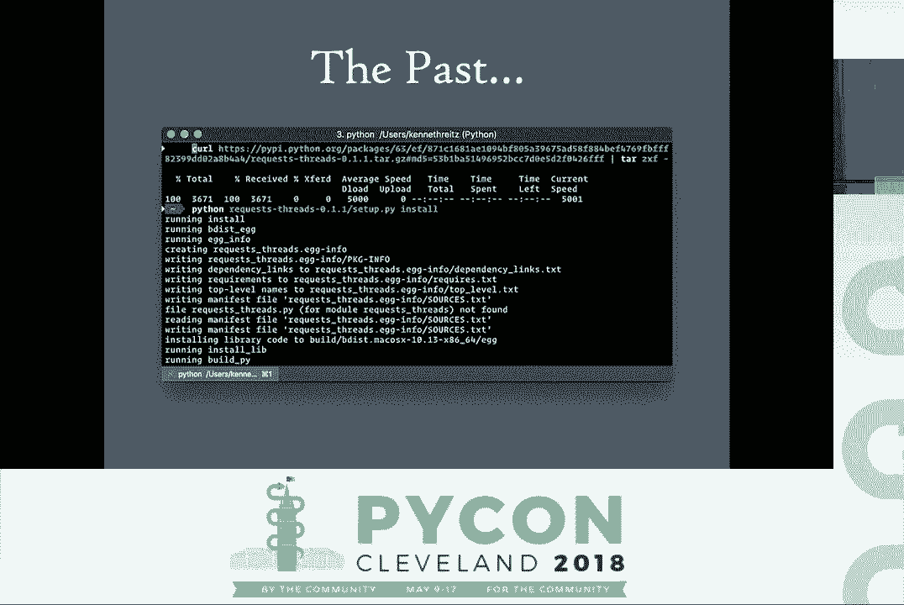

显然，这种方法存在一些问题。我提到的“奶酪商店”是 Python 包索引的一个昵称，现在是 pipi.org。它仅仅是一个包的索引，而不是单一的包托管服务。所以现在，如果你去 pipi.org 注册一个包，你必须上传文件。

你不能说文件存在于另一个我在其他地方托管的服务器上。因此，在之前，你可以注册包，并说，哦，这个网站和这个网站，还有这个网站，它只是一个索引。所以那是问题 A。包通常是在其他地方托管的。如果它运行在为整个 Python 社区提供服务的服务器上。

它是在瑞典的一台单一机器上运行，这非常有问题。就只有这一台小机器在瑞典运行。它的使用量仅占现在的一个小部分。所以这并不是一个大问题。它工作得很好，大家都还算满意。更明显的问题是这个安装系统。

这是一个非常手动的过程，不适合自动化。你有全局安装的包，而同一库的两个版本是无法安装的，这显然至今仍然存在。如果你安装了——。我没有使用历史相关的东西，但如果你要安装 Flask10。

例如，你不能在同一个 Python 安装中安装 Flask09。因此，如果你只有一个全局的 Python 安装，你就无法在两个有冲突依赖项的项目中工作。

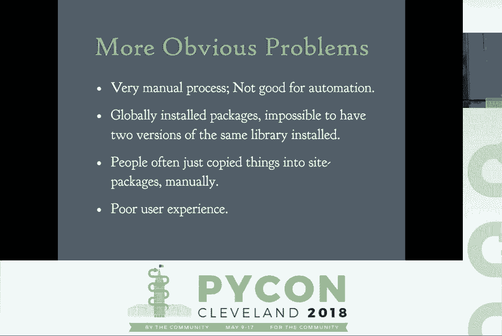

所以人们认为这总体上是一个糟糕的用户体验。因此，这个系统的下一个迭代被称为 EasyInstall。这在很长一段时间内非常受欢迎。它让事情变得简单得多。你只需输入 EasyInstall，空格，然后你就能得到一个包。

然后它会从“奶酪商店”抓取并安装到你的系统中，这真是太棒了。

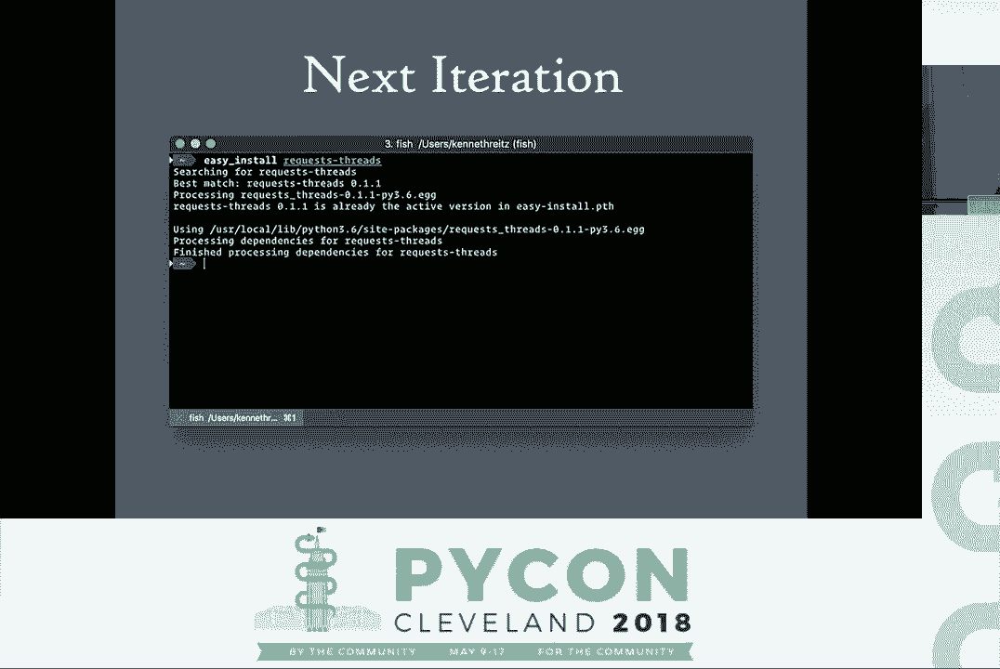

这要好得多。这是一个更好的安装体验，但这些包是从“奶酪商店”安装的。而且自动化要容易得多。这个方法有一些缺点。例如，没有 EasyInstall。因此，你只能安装东西。你可以卸载东西。

所以这有点像是一个小的退步。我将给你描绘一下今天的世界是什么样的。从 2010 年左右开始，这个工具被称为 PIP，成为管理包的事实上的 EasyInstall 替代品。VirtualLens 也成为了常规做法。人们开始传播这些东西。

称为 requirements.txt 文件。VirtualLens 的作用是为每个项目创建一个隔离的 Python home，以便在其中安装包。你可以创建一个虚拟环境，并在其中安装东西。在另一个项目中，你可以创建另一个虚拟环境，然后安装不同版本的依赖项。

而且它们彼此隔离。这很美妙。随着时间的发展，它不再默认包含全局包了。因此，你有非常独立的 Python 环境。你可以得到非常可重复的构建。这是一个很棒的工具。它是一个非常强大的概念，允许极大的灵活性。而且在 Python 社区中，它算是独特的工具。

例如，在 Ruby 社区中是不存在的。而这其中的一个原因是因为你可以在同一系统上同时安装多个版本的 gem。在 Ruby 中，如果他们有一个 flask，你可以安装 Flask10 和 09。

同时进入相同的全局安装。因此，他们不需要 VirtualLens。然后我们还有另一个工具是 PIP。PIP 解析、下载、安装和卸载 Python 包，来自包索引或任意 URL。它利用 requirements.txt 文件，并操控虚拟环境。我假设每位举手的人。

说他们使用 Python 包管理，使用 PIP，并对此很熟悉。因此我不会深入讨论这一点。所以在 VirtualLens 中使用 PIP 的做法至今仍在继续。这是大约在 2010 年左右开始的做法，也是我们今天所使用的。现在，如果你看看其他社区，你会看到一些有趣的模式。

多年来的发展。在 Node.js 中，他们有 yarn 和 NPM。在 PHP 中，他们有 Composer，在 Rust 中则有 Cargo。在 Ruby 中有 Bundler。所有这些东西展示了一个非常相似的机制，称为锁定文件。但如果你看看 Python，我们使用 PIP 和 VirtualLens，这首先是两件事，而不是像其他语言那样的一件事，除了 Node。

他们有两件事。[笑声]，而且没有锁定文件。现在，可以说 requirements.txt 是一个锁定文件，但我们稍后会讨论这个问题。但在 Python 中，没有锁定文件。所以这是个问题。首先，VirtualLens 就存在这样的问题。

问题在于理解抽象层是困难的。这对新手来说是个头疼的问题。这增加了对语言的入门门槛。如果你非常熟悉 Unix 概念，这一切就很有意义。但如果你不熟悉 Unix 概念，这就显得有些陌生，而且确实会妨碍你理解正在发生的事情。这是一个非常手动的过程。

自动化很简单，但手动使用不自然。还有像 Virtual Envabber 这样的工具，确实使得这个过程在日常使用中变得更加容易，这很好。requirements.txt 也有它的问题。一个非常常见的模式是你执行 pip freeze，然后将其输出到 requirements.txt，这会给你所有依赖的扁平版本。

有点像，这是我所有依赖和我的临时依赖的可重现版本列表，用于我正在工作的项目。但在 requirements 文件的定义上存在阻抗失配，因为声明 requirements 文件的方式有两种。

一种是你想安装的，另一种是你需要安装的。我们稍后会详细讨论。今天有一些工具使这更容易，比如 pip 工具，我想对它表示赞赏。但理想情况下，requirements.txt 文件是一个完全预先扁平化和依赖树。

这是建立确定性构建所必需的。这是理想情况下应该如此的。因此，这是一种处理 requirements.txt 的方法。这是它的理想情况。如果你查看一下，这里有——这是一个 Flask 项目。Flask 有临时依赖。如果你需要 Flask，它自身有依赖，比如 Wurxig，举个例子，它很危险，Ginger2。

它们都有不同的版本。因此，如果你 pip 安装 Flask，然后运行 pip freeze，输出到一个 requirements.txt 文件，输出看起来就是这样。这很好，因为它是确定性的。如果你从一个新的虚拟环境中 pip 安装，这是包含所有传递依赖的。但知道发生了什么有点困难。

如果你查看一下你在 GitHub 上的源代码库，或者你同事的代码，对你至关重要的是，哪种依赖是你真正想要的？这并不明确。你想要——它很危险？这是你的团队需要的，还是你的团队需要 Flask？

你到底依赖哪一个？这就是问题所在。有些团队通过这样解决这个问题，因为这样有效。你可以只安装 Flask，其他的依赖会自动安装。但是不幸的是，这会导致非确定性构建。它更易读且易于理解。

并且它正常运行。但它是非确定性的，这可能导致构建失败。如果任何一个传递依赖更新，你将获得这些依赖的不同版本。你的应用可能会崩溃，可能存在安全漏洞。这有很多应用场景。因此，这就是你所需要的与所想要之间的阻抗失配。

你想要的和你需要的。这在要求中是个问题。txt 格式。因此，这种要求格式实际上既是锁文件，又不是锁文件，取决于你的使用方式。所以我们假设 Python 现在没有锁文件。

解决方案是提供一个锁文件。所以我们已经讨论过这一点。两种类型的依赖——你想要的和你需要的。因此，这个问题的一个解决方案是有两个不同的 requirements 文件，一个是你想要的，一个是你需要的。你有一个叫做 requirements 以冻结。

然后你会有一个叫做 requirements.txt 的文件，这是 pip freeze 的结果。这是一个很好的解决方案，你可以使用标准化工具，比如 pip。你只需要 pip 就能做到这一点。这给你提供了最好的两全其美的选择。此外，还有一个叫 pip tools 的工具。

它做了非常相似的事情，基本上围绕这个概念构建。如果你不打算使用我稍后推荐的内容，我强烈推荐使用这个。因此这是一个很好的模式。我认为这是为使用 pip 的人提供的一个很好的解决方案，给你最好的两全其美的选择。

但这并不是一个真正的解决方案。真正的解决方案是这个正在演变的新标准，它来自 PIP 文件。PIP 文件是一个新的标准，将在未来取代 requirements.txt。它是用 Toml 编写的，因此手动编写和阅读都很容易，并且它具有两个组。在你使用的其他语言的其他工具中，你可以把你需要的内容放在里面，比如 Flask。

依赖项组通常会有多种形式。你还会看到人们有要求的开发环境、测试环境、生产环境和 Heroku 环境。这些是将组纳入 PIP 的一种方式。然而，composer 社区只使用了两个组，并且这样做取得了非常成功的项目。

所以 PIP 文件的规范中有空间支持更多的组。但目前的实现只有两个组，packages 和 dev packages，这应该涵盖你所需的一切。任何不进入生产的内容都会放入 dev packages，进入生产的内容则放入 packages。

理想情况下，这应该涵盖你可能会有的每一个使用案例。而 PIP 文件是将要进入 PIP 的东西，基本上等到唐纳德的内容处理完。这是一个很棒的想法。我在 Python 中做了一个规范的原型，并得到了几位贡献者的帮助。有一个叫 PIP file 的项目，你可以用来解析。

这些文件并进行操作。它存在，并且总有一天会进入 PIP。所以这就是未来，PIP 文件将取代 requirements.txt。以下是 PIP 文件的样子。它是 Toml 格式。在顶部，你会看到源，这指定了你正在使用哪个包索引。

它有一些参数，比如 verify 的集合等于 true，这应该始终成立。你可以给索引一个名字，比如 PIPI。还有前面提到的两个组，packages 和 dev packages。在这个实例中，有 Flask，我将其分配为版本 star，意味着获取最新版本。而 dev packages 的真正含义是任何版本。

默认使用最新版本。开发包包含 PyTest。所以这就是你会放入这两个不同组的一个好例子。你会把测试运行器放在开发组中，然后把 Flask 放在默认组中。然后这个东西可以被处理并生成称为 PIP 文件.lock 的东西。

这就是 PIP 文件的魔力所在。PIP 文件.lock 是 JSON 格式。因此，它非常容易被机器解析，这很好，并且是静态可分析的。它包含所有传递依赖项，并为每个发布版本提供所有可接受的哈希。它再次分为两组，默认和开发。因此，这可能有点难以看清。

这是一个非常大的文件。我对其进行了截断。但你可以在黄色部分看到，有 click，有 Flask，还有版本号。然后它包括所有哈希，256 哈希。所有不同的 wheel 和这些有效依赖的源分发，这很好。因此，我们在这里有我们需要的，和我们想要的。这是两个独立的事物。

这将生成这个。所以这是理想的。PIP 文件的问题在于它尚未集成到 PIP 中，这可能会因为资源限制而需要相当长的时间。

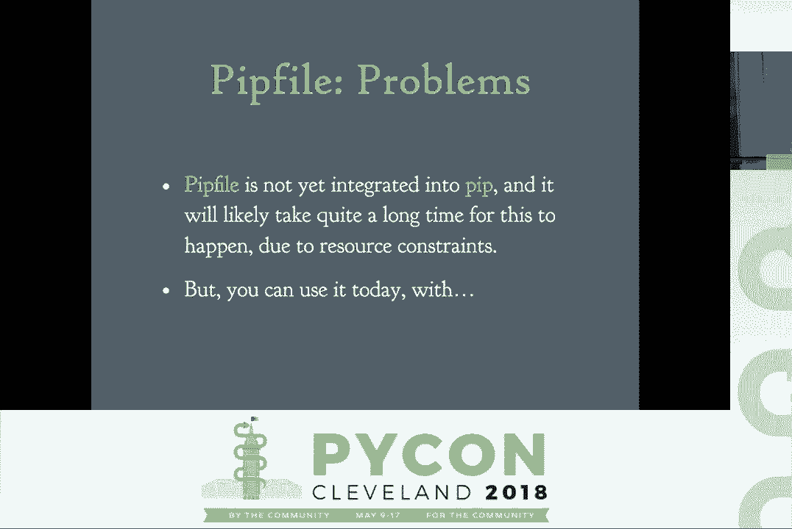

但你今天可以与我正在进行的新项目 PIPAM 一起使用，我想鼓励大家。

这是本次演讲的主题。所以 PIPAM 的销售宣传是，它是 Python.org 官方推荐的工具，用于管理你的 Python 依赖。它让你今天可以使用 PIP 文件和 PIP 文件.lock，而无需等待 PIP 来实现。它完全自动化了虚拟 AMP 的工作流程。它确实使用虚拟 AMP。

但你不必直接与它接口。它会为你处理。它确保确定性的构建，包括哈希检查和安装时的验证。并且它为你提供其他很棒的工具，比如 PIPAM Graph，我将很快为你演示。一些很棒的引用。前 PIP 维护者 Janis Lydell 曾说过。

PIPAM 是我一直想为 PIP 构建的外表。它适合我的思维，并在很大程度上取代了我手动调用 PIP 的虚拟 AMP 包装器。使用它。我的好朋友 Justin Miles Holmes 说，PIPAM 终于是一个旨在吸引思维的抽象层，而不仅仅是文件系统。

我非常享受这个。好了，现在是演示和问答时间。如果在演示期间有任何问题，请排队。我会尽力回答你们的问题。我希望这是一个互动的演示。因此，请在我进行演示时随时提问。希望如此。

我的 SSH 连接到我的服务器会顺利。

让我们看看。这对每个人来说够大吗？是吗？太好了。好的。我刚创建了一个名为 demo 的新目录。而这个目录里没有任何文件。所以我将要做的事情是，我已经安装了 PIPAM。我将使用 PIPAM，安装 requests。

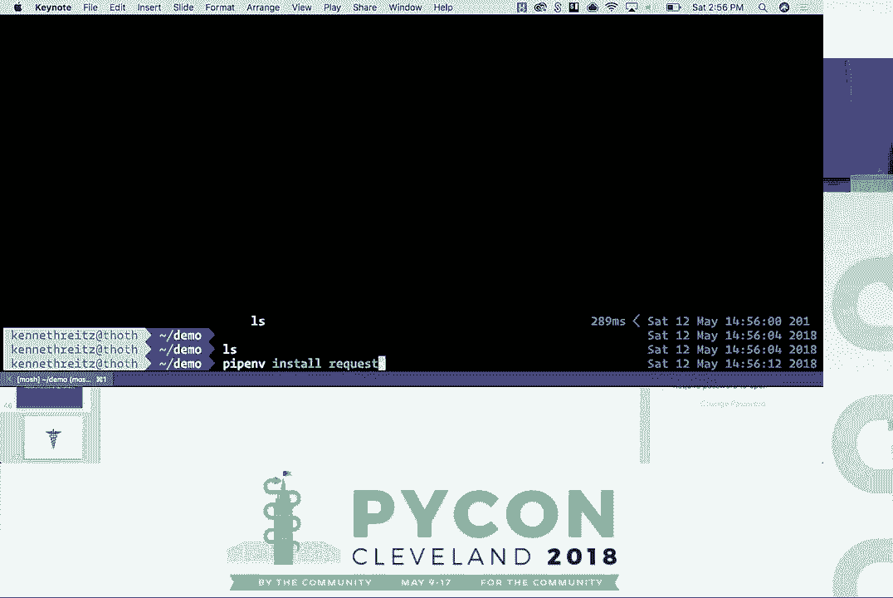

它将自动为我创建一个虚拟环境，并为我自动创建一个 PIP 文件。然后它将安装 requests，并创建 PIP file.lock。它会重新锁定文件。所以现在我看到有两个文件--PIP file 和 PIP file.lock。如果我查看 PIP file，你会看到其中有 requests。

它会自动指定，我们支持版本说明符。所以你可以将你的应用程序限制为某些 Python 版本说明符。这一个要求 Python 3.6。如果我想安装一个开发包，我可以像这样使用 PIPAM install。pi test-dev。它将把 pi test 安装到开发包目录。

它会自动重新锁定。正如你所注意到的，我不必手动编辑这个 PIP 文件。它在为我处理。这是我从 Composer 那里得到的一个想法。所以 pi test 在这里，requests 也在这里。这一切都能正常工作。所以我可以运行--我可以使用 PIPAM-RM 移除虚拟环境，完全删除虚拟环境。我只需做 PIPAM install。

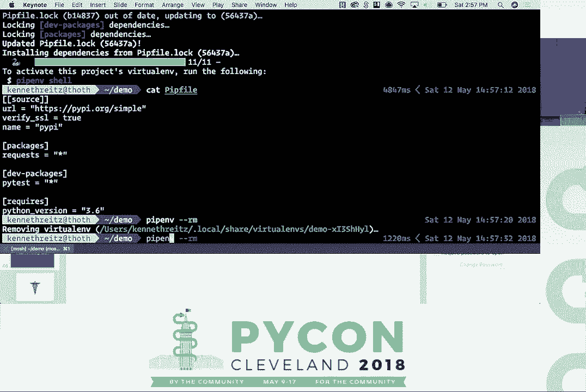

它将从头开始重建。遗憾的是，它使用的是 Python 3.6.2。

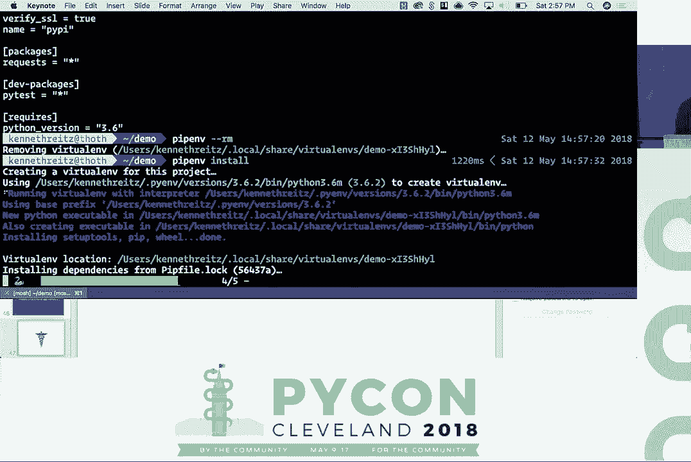

应该是 3.6.5。我可以指定 Python 的版本。

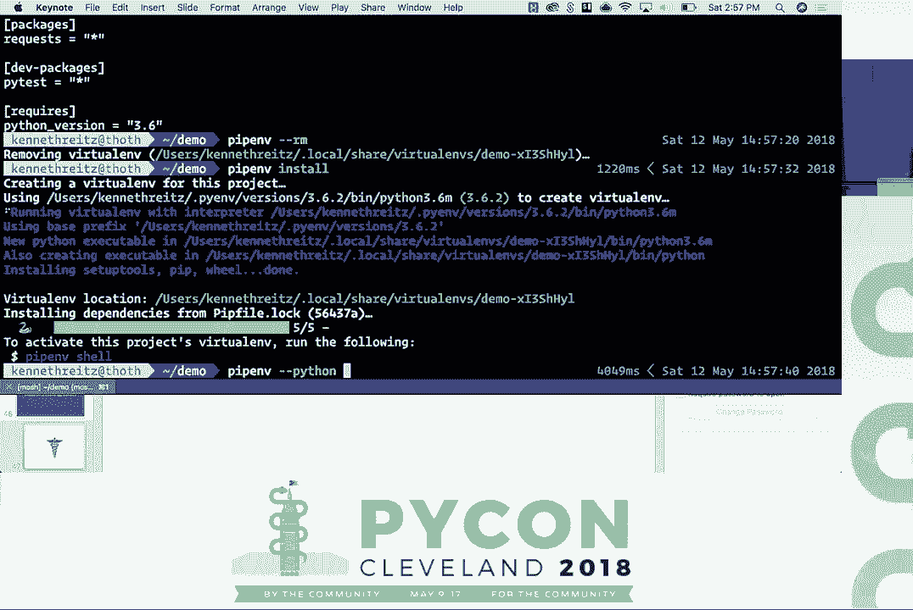

让我们试试。来吧，3.6.5。好了，我得到了这个。所以 PIPAM install。它将安装依赖项。实际上，它是并发运行 PIP 的。所以如果你有 45 个依赖项，它将同时安装它们。这样你就不必等待每个依赖项按顺序一个个安装。

所以这比使用 PIP 快得多。你能否同时处理多个源？

所以你可以有多个源。你可以有一个组织内部的 PIPAM 运行在 DevPy 上。是的，确实可以。是的，如果你查看文档，有一种方法可以让你指定多个源，并且还可以在 TAML 文件中将特定包分配到特定源。是的。[听不清]，[听不清]，[听不清]。

[听不清]，抱歉，如果你有问题，请去麦克风旁。抱歉。你提到并发安装。那关于包的--，那是什么？

根据之前安装的内容，安装的包会有所不同。像 tornado 一样，如果你有 site，它会优化。如果你没有 site，它就不会优化。所以如果你没有 site？是的，site 不是 tornado 的真正依赖。如果你没有它，没关系。是的。所以我们没有内置的顺序。

你可以关闭顺序执行——你可以添加顺序标志。这样它将顺序执行，而不是同时进行。在完成这一步后，你可以运行`pipm shell`，这将为你提供一个子 shell，这样如果我运行 Python。

我得到了 365，并且我可以像预期的那样导入请求和请求工作。然后你退出。它会从那个 shell 退出到我的父 shell，而不是停用。但是如果你想，可以使用`pipm dash dash vm`。这将显示你创建的虚拟嵌入路径。这只是一个普通的虚拟环境。

所以我可以执行`source this slash bin slash activate`。这就像一个普通的虚拟环境。因此，没有惊喜。我马上就会回答下一个问题。我将安装一些有更多依赖项的东西，比如 Maya。哦，`pipm install Maya`。这里有一些不错的功能，比如`pipm graph`。

这将给你一个依赖树的图形。所以这是我的顶级依赖项。

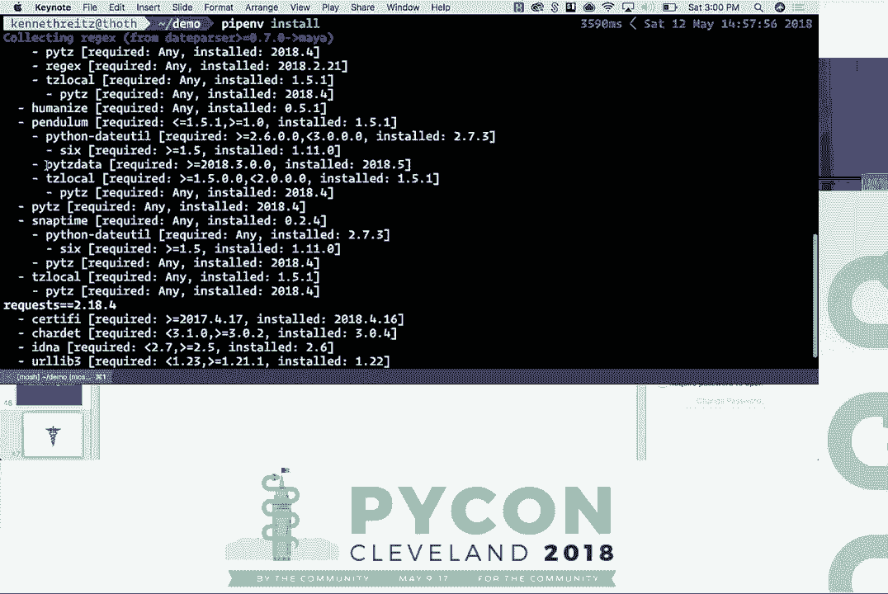

这是 requests。这里是它的依赖项。这是所需的。这是已安装的。非常不错。此外，我可以执行`pipm install Django`。有人能告诉我一个不安全版本的 Django 的名称吗？非常不安全。142。

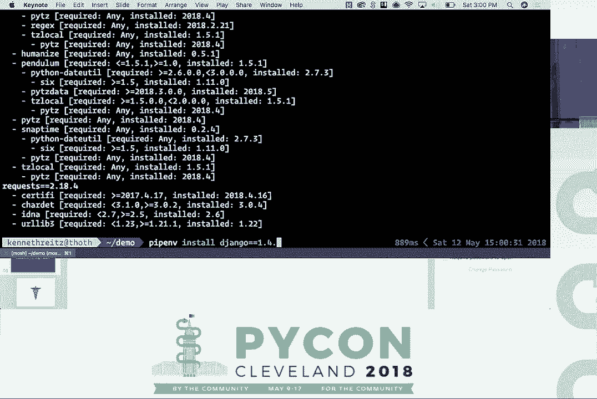

好的，安装 Django 等于 142。Wi-Fi 速度不快，我很抱歉。

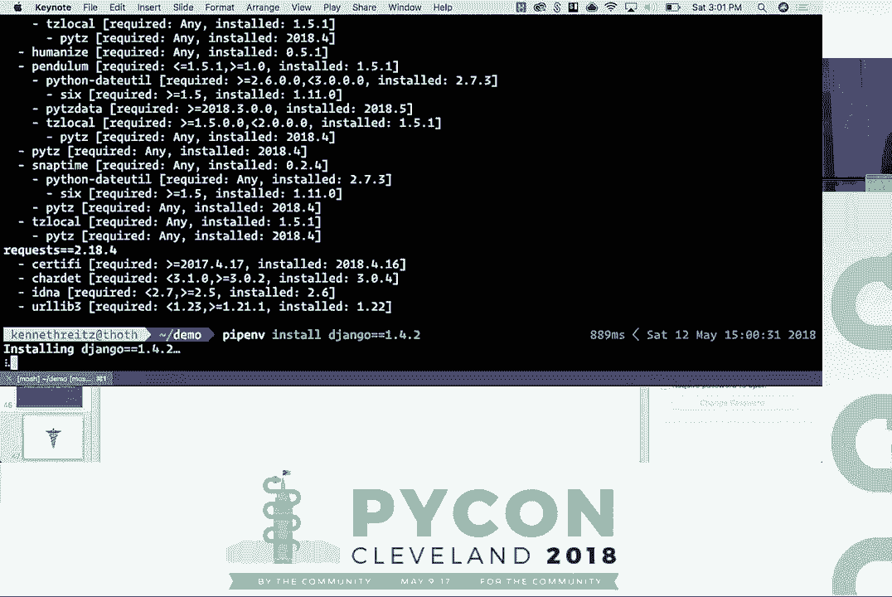

我有一个内置的安全漏洞扫描器。

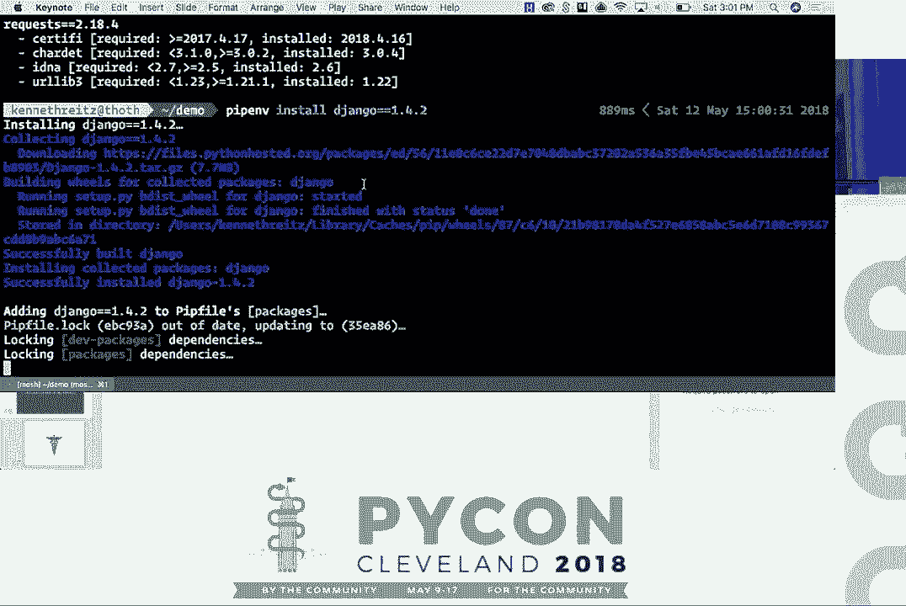

它由 PyUp 提供。我在他们那里有一个账户，并且它嵌入在 API 中。保持嵌入状态。所以你可以执行`pipm check`。

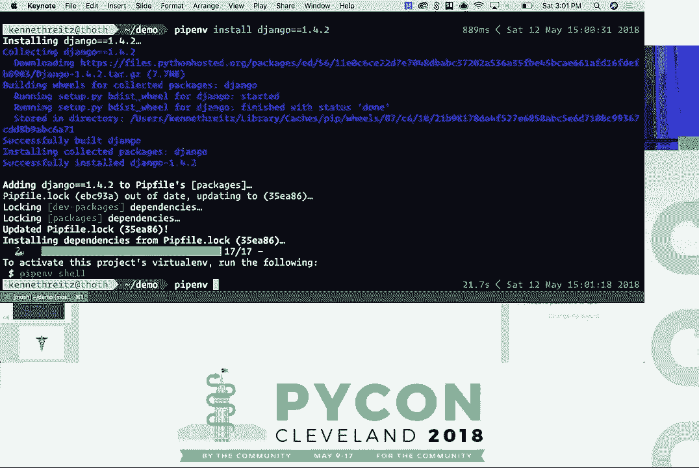

它检查了 pipe 508 要求，切换了那些约束。它说 Python 3.6。所以它检查了一切都很好。但这里是我依赖项中的一些已知漏洞。所以这是我们还有的一个不错的功能。所以我安装了那个无效版本的 Django。这是该版本 Django 的漏洞。

这样你可以对你的代码进行很好的检查，等等，将其构建到你的 CI 中。Pipm Graph 非常有用。除了安装，当然，你还可以卸载。你可以执行`pipm uninstall requests`。

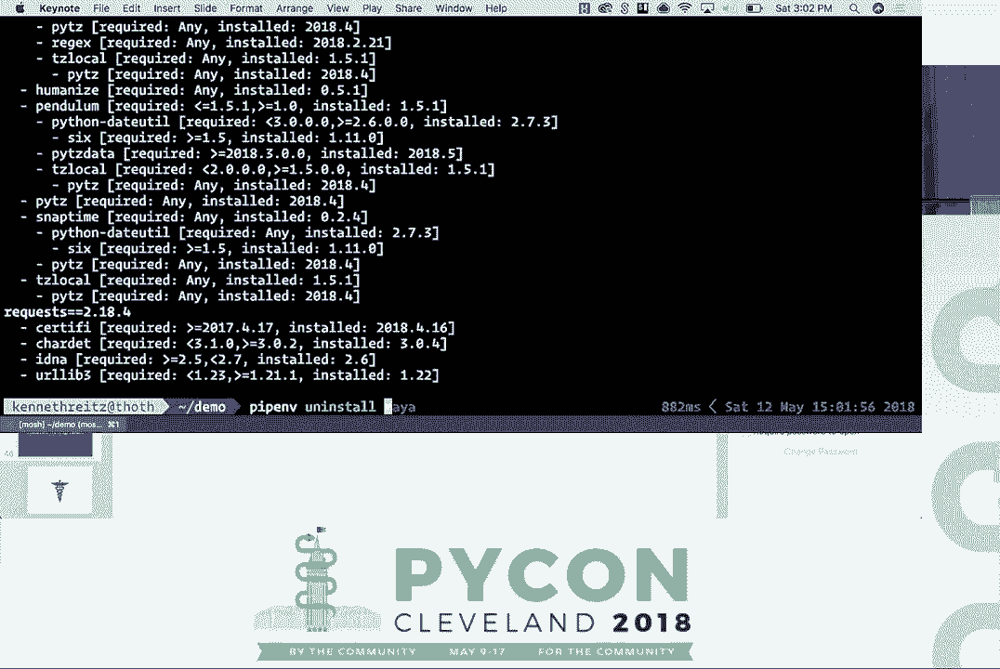

不是说你应该这样做。它会从文件中删除它，从 pip 文件中。

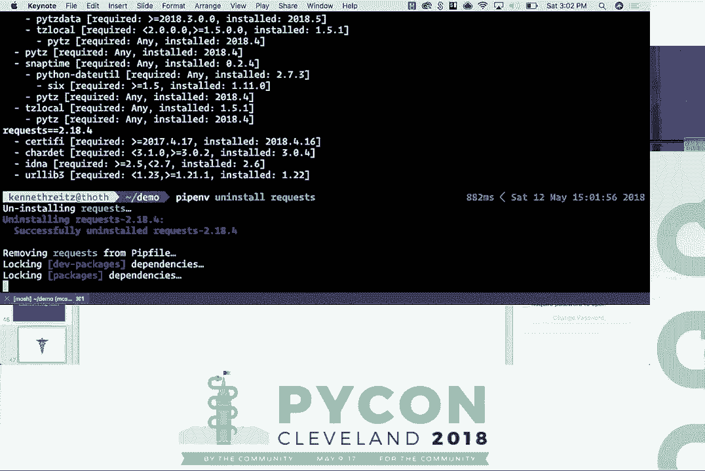

并且自动重新锁定。例如，我还可以编辑 pip 文件。我只是要改变它。所以我添加了一些新行。然后我要执行`pipm install dash-deploy`。所以这是你在生产中使用的。如果你要在 Docker 镜像中部署，或者在生产中，你绝对不希望你的锁文件不同步。

使用你的 pip 文件。所以这看起来没问题。等等。也许我们缓存了——我想我们对值进行哈希，而不是内容。所以我得加一个评论或其他东西。那不是一个真正的更改。是的，所以你的 pip 文件过期了。它期望这个哈希，而这个哈希是找到的。所以它会自动中止部署。

如果你推送了一个新的 pip 文件但没有锁定。当然，你在开发中不需要使用那个。如果你这样做，它会知道过期，并会自动重新锁定。

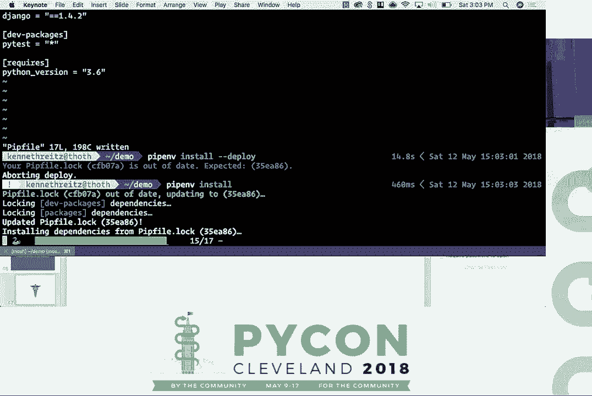

所以下一个问题。感谢你对 requests 的工作。我的问题是，在早期，如果 pip 和虚拟环境是在项目中创建的，那么默认值被更改为主目录。你能多告诉我们一些关于那个决定的事情吗？是的，所以默认情况下。如果你输入 pip m dash VM。

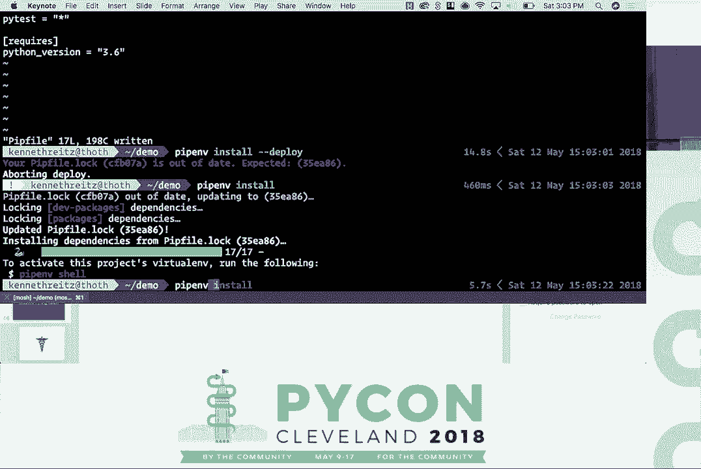

你会注意到虚拟 AMP 的位置是，dot local share virtual AMP。这根据你的操作系统略有不同。它位于操作系统的已知良好位置。它有效地模拟了虚拟 AMP 包装器的行为，我认为这是社区的最佳实践。如果你不想这样做，我可以创建 dir dot VM。

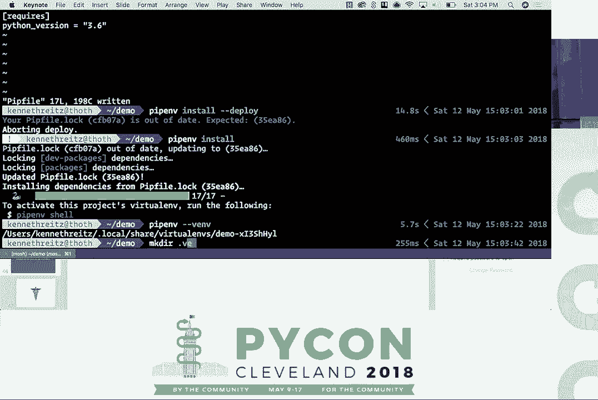

然后执行 pip m install。它会自动为你使用 dot VM 目录。

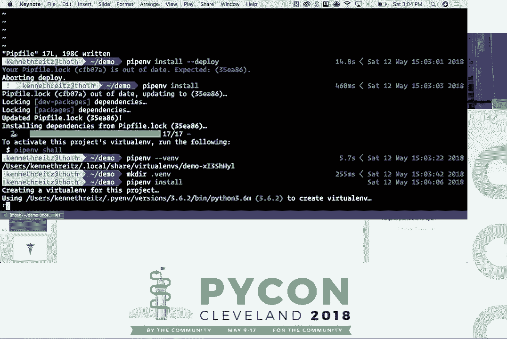

如果那里有一个。或者如果你想的话，有一个环境变量可以设置。无论如何，它总是会使用 dot VM。它被称为 pip m VM VIN project。这是一个设置。

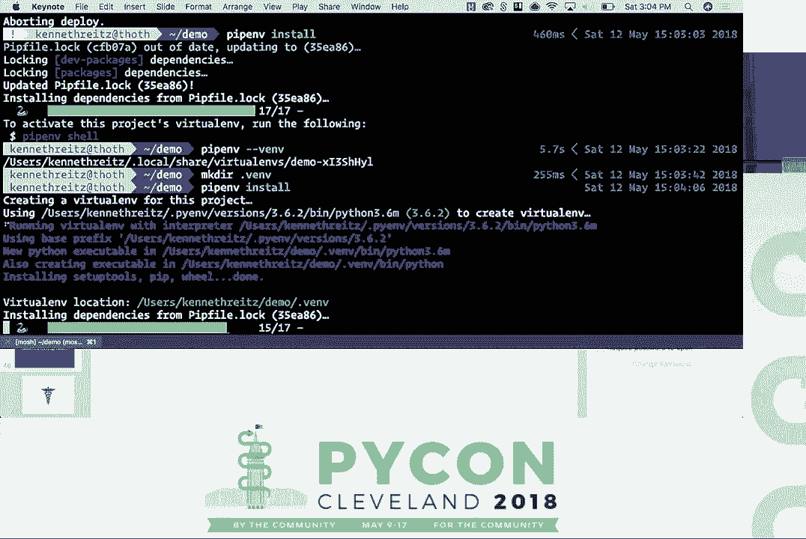

所以我的问题？是的。我的问题是跟进一下。是否可以在一个不在 dot local 并且不叫 dot 的目录中创建虚拟环境？不，目前不可以。好的，目前不可以没关系。谢谢。不是这个。其实，是的。这样——。

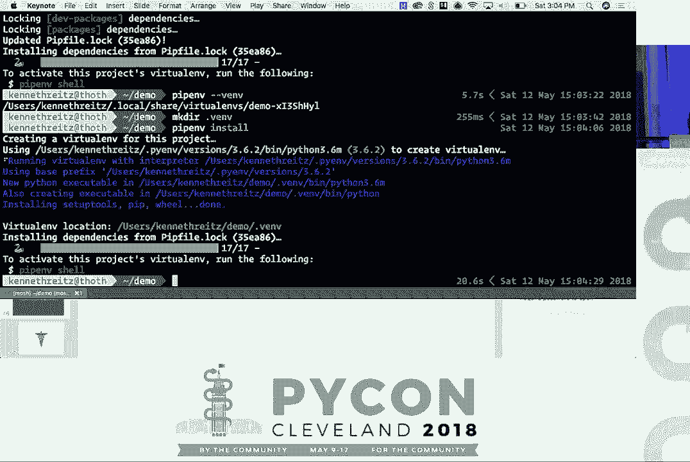

[笑声]，所以我可以创建一个叫 test 的虚拟环境。那是什么？虚拟 AMP？

我使用 pip m 已经很久了。所以我正在创建一个叫 test 的虚拟 AMP，它使用 Python 2.7。我将 source test.VENV——所以我花了一些时间——激活 dot fish。这样我激活了我的虚拟 AMP。现在我运行 pip m install。它会——它知道自己正在虚拟环境中运行。

它会为你在那个虚拟环境中安装东西。完美。谢谢。是的。如果你想切换 Python 的版本，我刚刚搞砸了一切。所以让我从中恢复过来。pip m dash dash 3 将自动创建一个 Python 3 的环境。我的意思是，这必须先停用。它给你一个友好的消息。

`pip m`发现自己在虚拟环境中运行。所以它自动进入那个环境。有一个设置可以禁用那个环境的停用。现在我不在我的虚拟环境中。我可以执行`pip m dash dash 3`。它会移除我曾经的环境，并使用 Python 3 重新创建一个。

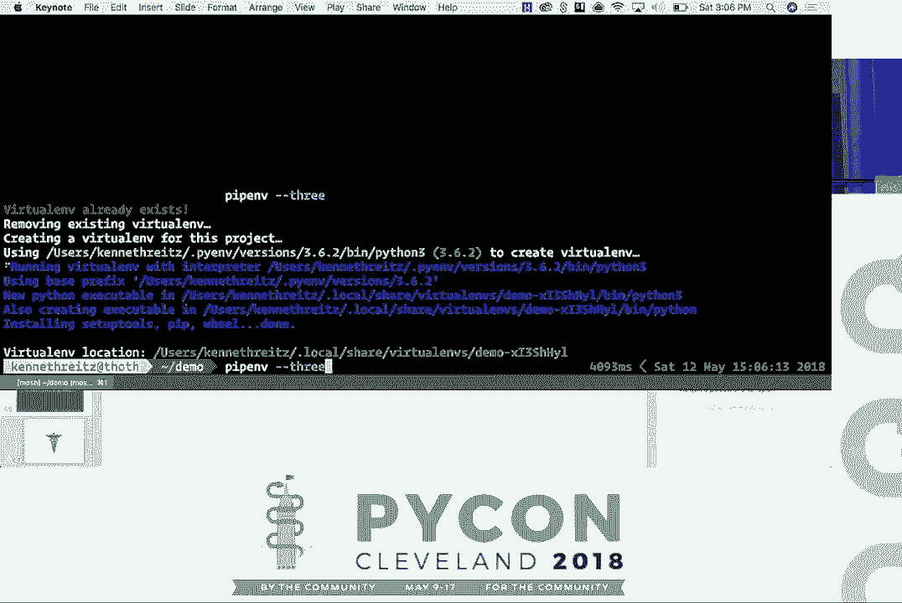

如果我想切换到 2，我只需执行`pip m dash dash 2`。它会销毁当前环境，然后用 Python 2 创建新的环境。

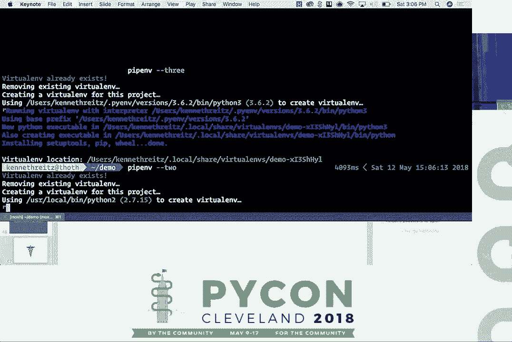

非常简单。如果你愿意，可以执行`dash dash Python`，指定任何解释器的路径。它将使用那个 Python 解释器。目前它不支持`pip m`，但可以与其他所有 Python 解释器一起使用。你也可以指定任意版本的 Python，比如 2，7，14。如果你的系统上没有安装，而你已安装`pip m`，它会执行。

会从源代码编译并提供使用。那么下一个问题。你好。我有一个关于安装新包速度的问题。与普通的 pip 相比，似乎需要很长时间，假设是因为在计算哈希或其他原因。我在这个问题上查过一些资料。

似乎我不是唯一一个有这个问题的人。那么你听说过这个问题吗？

对此你有什么看法，或者有没有可能加快的方式？

因为像安装新包，我再次认为，它是在计算哈希。是安装速度慢还是锁定速度慢？我认为，嗯，可能是锁定的过程。是的，锁定可能会慢，因为它需要解析依赖图。如果你有一个很大的图，那确实会很慢。但是我们在这方面做了大量改进。

而且它每天都在变得更快。所以解析依赖图，原来是相当困难的。这涉及到很多请求等。而且必须下载所有这些包。所以是的。好的，为了节省时间，我将有三分钟的提问时间。三分钟提问，快速问答。

我想先从后面的女士开始。你好。我对这个很感兴趣，但我不一定会让公司里的每个人立即开始使用。有没有办法可以在这个锁文件和`requirements.txt`之间进行转换，以便人们可以使用任一文件？是的，我们可以。如果你执行`pipm.lock-r`。

它会输出一个`requirements.txt`文件。太棒了，谢谢。是的。我们开始了吗？好的。我们应该把锁文件放入源代码控制吗？是的。谢谢。[笑声]，当你卸载时，是否是递归的？它会移除因为那次安装而带来的所有依赖项吗？再说一次。当你卸载时。

这是递归地卸载为该依赖项引入的所有内容吗？不。它只会卸载那个包。有一个同步命令，它会自动--。这是一个单独的命令，用于将你的环境与锁定文件同步。好的。像风扇一样。前面。pipm 怎么做。不是，哪个虚拟环境对应于哪个应用程序目录？

从目录的路径来看。所以如果你移动它，它会。创建一个新的虚拟环境。好的。背后？在设计一个面向 Python 的 API 与一个通过 Shell 消费的 API 时，是否存在较大的差异？而且更具交互性，而不仅仅是你在代码中实现的东西？是的。

我认为在设计某个东西时，如果你查看 pipm 的代码库。它的 Python 部分并不是我见过的最优雅的代码库，因为它。试图提供最佳的用户界面。因此，我认为两边都有妥协。如果我尝试先用 Python 构建它，然后再展示 CLI。

我认为那样体验会较差。所以我认为总是存在权衡。谢谢。好的，下一个问题。背后？嗨。这也会替代 setup.py 吗？不。setup.py 是针对不同事情的完全不同工具。setup.py 用于库。而这是针对应用程序的。好的。我们来做最后一个问题。我认为那位绅士在后面。

在麦克风前面填满之前就已经在那里了。只是想跟进一下源代码管理。检查你的锁定文件。这在 Node 社区一直是一个大问题。你会为库和项目都这样做吗？你会总是检查锁定文件吗？

如果你针对多个 Python 版本，则我不会检查锁定文件，因为你的锁定文件在不同版本的 Python 下可能会不同。希望我们已经做了很多工作，因此它应该是一个扁平的锁定文件，指定 Python 的版本。这实际上取决于提供的元数据。

由那些包提供的。所以如果元数据是好的，你应该能够。但如果最坏的情况发生，那就保持不变。好的。

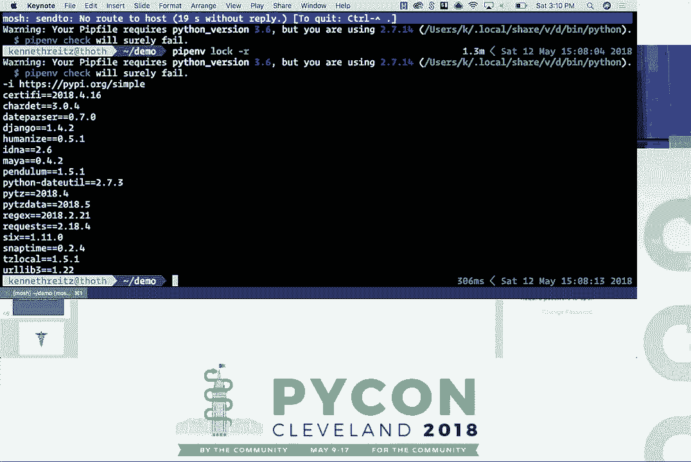

有了这个，让我们感谢肯尼斯。[鼓掌]，我相信他会很乐意回答问题。

舞厅外面。是的，绝对如此。非常感谢。
