# 类型、深度静态分析与你：P11：Pieter Hooimeijer - PyCon 2018

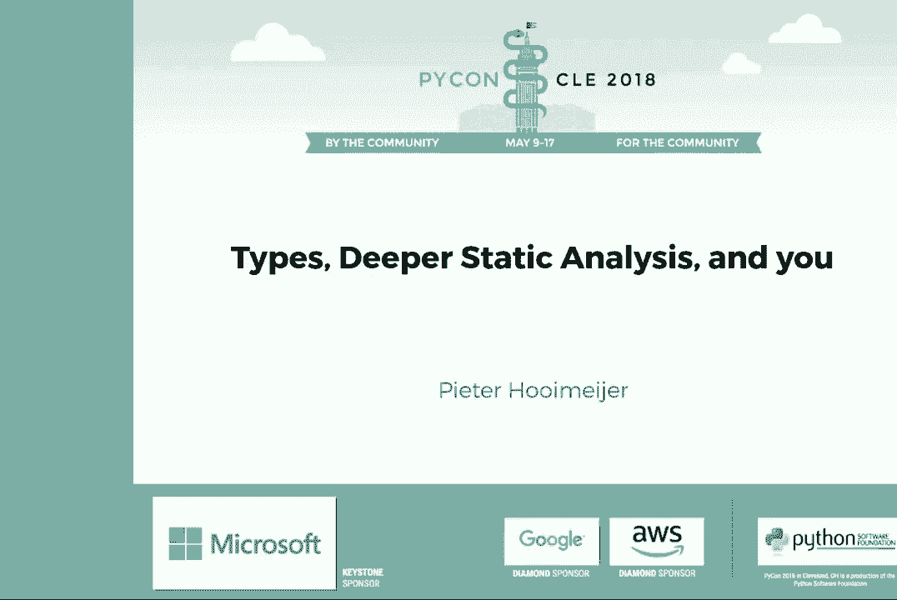

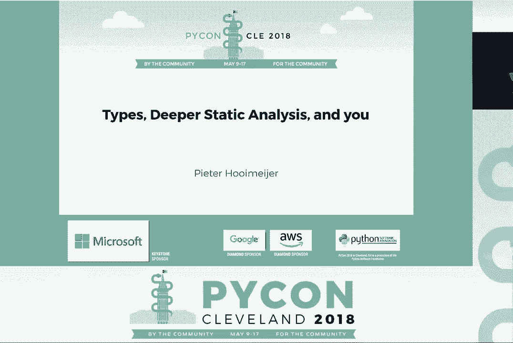

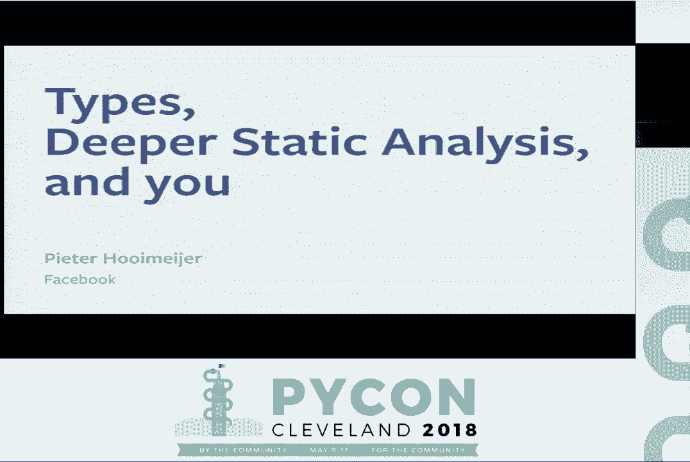

## 📖 概述
在本教程中，我们将学习如何利用类型系统来构建强大的静态分析工具，特别是用于发现代码中的安全漏洞。我们将从理解一个实际的安全问题示例开始，逐步探讨从简单的代码扫描工具到复杂的深度静态分析技术，并了解如何将类型检查器扩展为能够进行过程间数据流分析的工具。最后，我们将看到这种技术在大型代码库（如Facebook和Instagram）中的实际应用效果。

---


## 🔍 第一部分：从一个安全问题开始
上一节我们介绍了本教程的主题。本节中，我们来看一个具体的代码安全问题示例，它展示了我们希望通过静态分析来检测的问题类型。

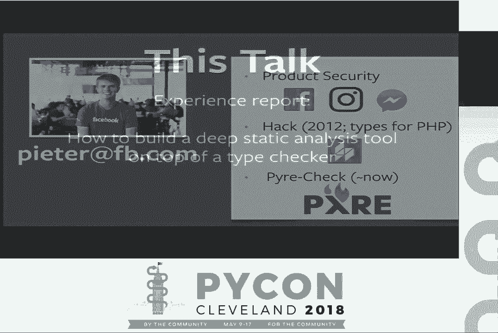

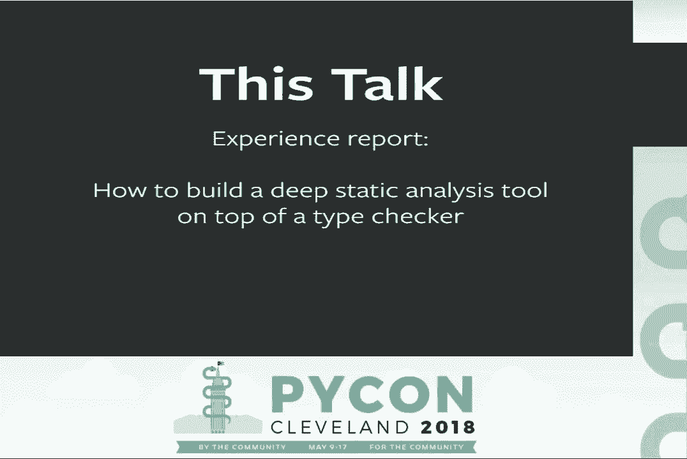

以下是一个简化的、类似Django的Python代码片段，它模拟了一个实际产品中曾出现过的安全漏洞。

```python
def get_group_thumbnail(request):
    group_id = request.GET.get(‘id‘)          # 步骤1：从用户输入获取组ID
    data = load_group_data(group_id, request.user)  # 步骤2：加载并检查用户权限
    if data is None:
        raise Http404(f“Group {group_id} not found”)  # 问题所在：基于用户控制输入抛出404
    return render_thumbnail(data)
```

这段代码的功能是获取用户组的缩略图。问题在于，当`load_group_data`检查发现当前用户无权访问该组时，它会返回`None`，代码随后抛出一个包含用户提供的`group_id`的404错误。

**核心问题**：攻击者可以构造一个恶意网页，通过图片标签的`onload`和`onerror`事件处理器来探测这个端点。通过观察请求成功（加载图片）或失败（触发404错误），攻击者就能推断出当前访问恶意网站的用户是否属于某个特定的私密群组，从而造成信息泄露。

这个例子引出了我们的目标：**能否静态地（即在代码运行前）自动检测出这类问题？**

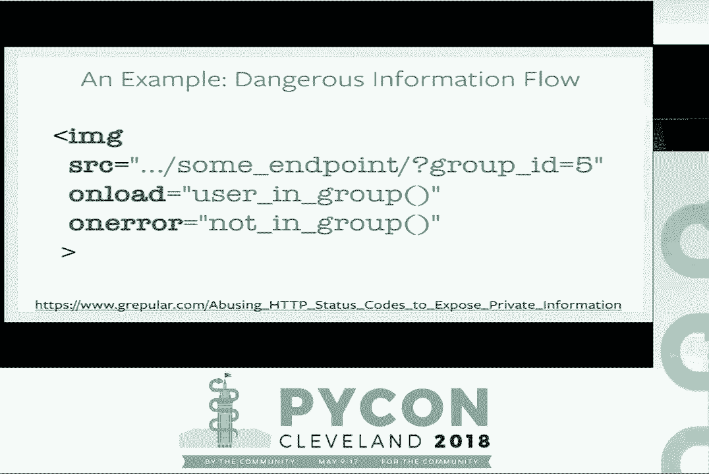

---

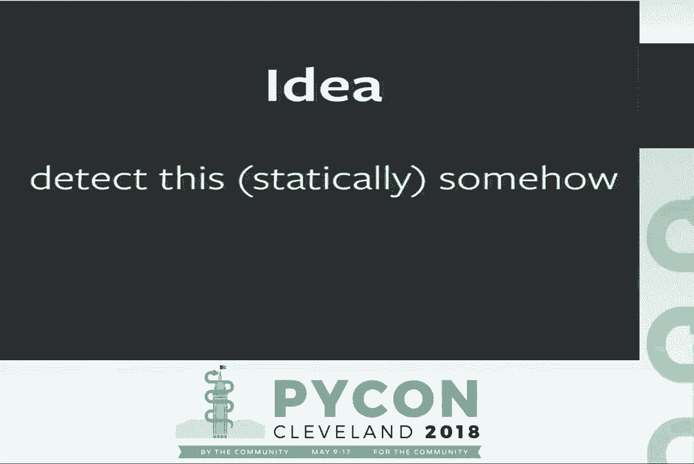

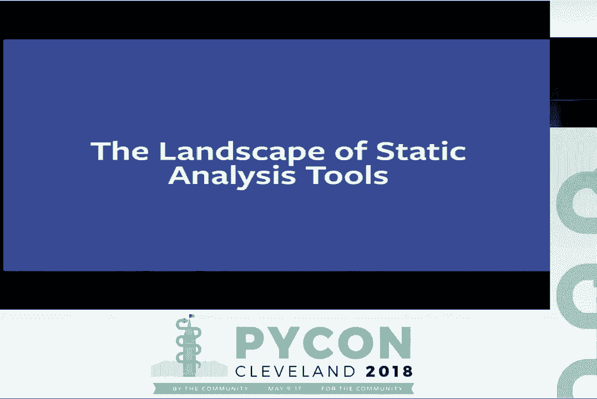

## 🛠️ 第二部分：静态分析工具光谱
上一节我们看到了一个具体的安全漏洞。本节中，我们来了解一下用于发现这类问题的各种静态分析工具，并将它们放在一个从简单到复杂的“光谱”上进行对比。

我们将工具按以下维度排列：
*   **左侧**：快速、易用、简单。
*   **右侧**：缓慢、难用、复杂。

以下是几种典型的静态分析工具：

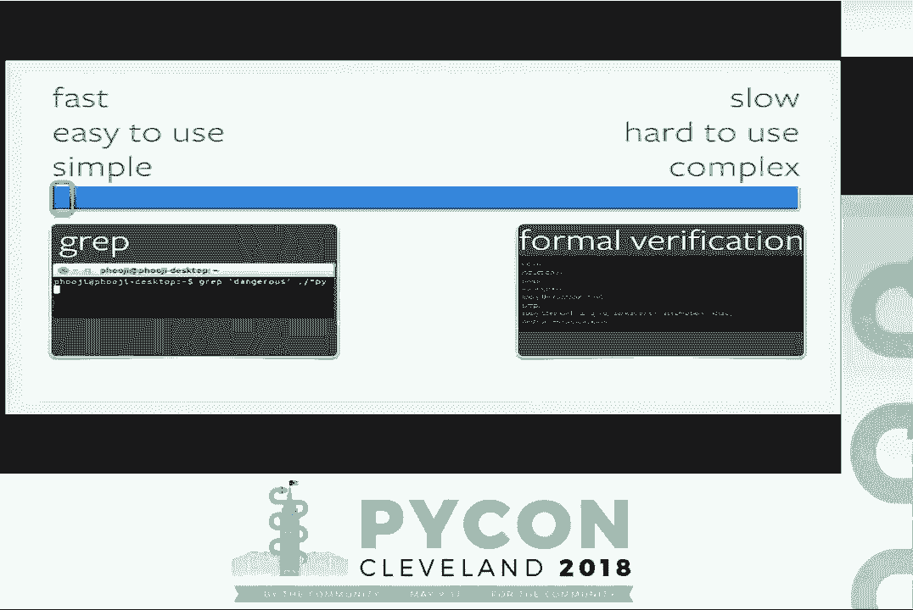

1.  **正式验证 (Formal Verification)**
    *   **位置**：光谱最右端。
    *   **描述**：需要为代码和待证明的属性编写完整的形式化规范，并构造冗长的证明脚本。它能提供最高级别的保证。
    *   **挑战**：极其复杂，需要专业知识，通常不实用。例如，验证5行代码可能需要1300行证明脚本。
    *   **公式/代码表示**：`证明脚本行数 >> 代码行数`

2.  **Grep**
    *   **位置**：光谱最左端。
    *   **描述**：在代码文本中搜索特定模式（如关键词“dangerous”）。它是语言无关的。
    *   **挑战**：精度很低，会产生大量误报和漏报。例如，它无法理解代码的语义，只能进行文本匹配。

3.  **Linter (如 Pylint, Flake8)**
    *   **位置**：光谱中间偏左。
    *   **描述**：基于抽象语法树进行代码检查，可以编写相对简单的规则来发现代码风格或简单模式问题。
    *   **挑战**：对于需要跟踪数据在函数间如何流动的复杂问题（如信息泄露），能力仍然不足。

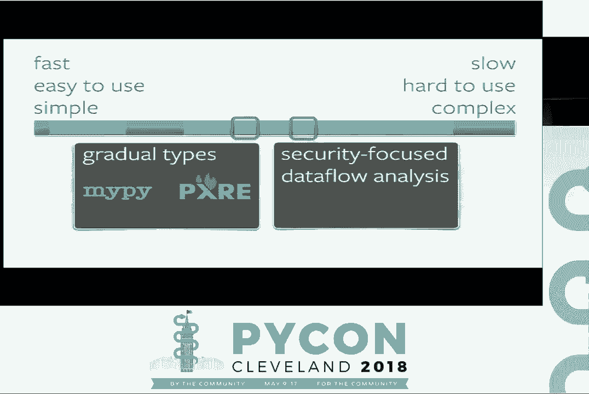

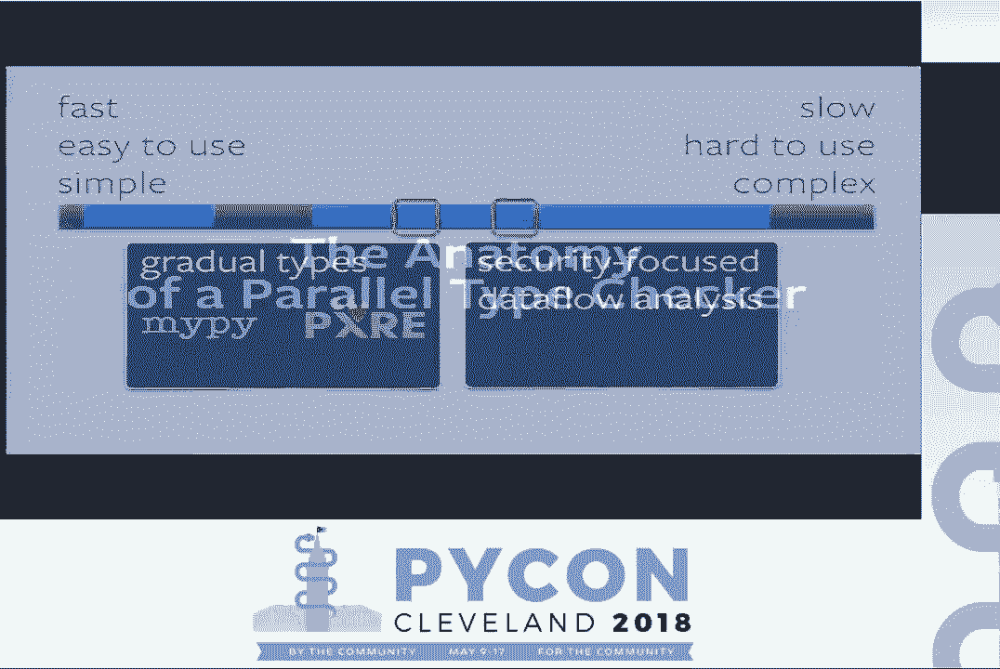


4.  **类型检查器 (如 Mypy, Pyre)**
    *   **位置**：光谱中间。
    *   **描述**：要求开发者为代码添加类型注解，然后检查类型的一致性。能发现一大类错误。
    *   **挑战**：本身并不直接检测安全漏洞或复杂的数据流。

**本教程的核心前提**：我们可以**在现有类型系统的基础上**，构建专注于安全的数据流分析工具，而无需像形式化验证那样复杂的规范。我们利用代码库已有的类型注解作为基础。

---

## 🏗️ 第三部分：类型检查器架构基础
上一节我们比较了各类静态分析工具。本节中，我们深入了解一下现代类型检查器（如Hack和Pyre）的高层架构，这是构建深度分析的基础。

类型检查器的核心任务是验证代码中的类型是否一致。考虑以下代码：

```python
def bar(x: int) -> int:
    return x + 1

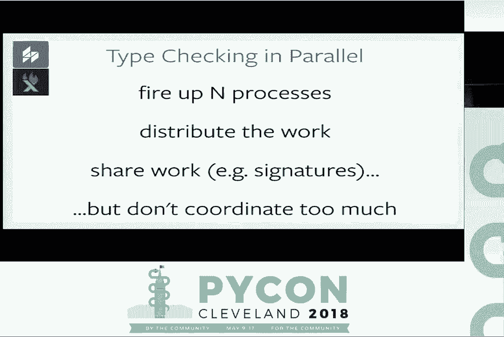


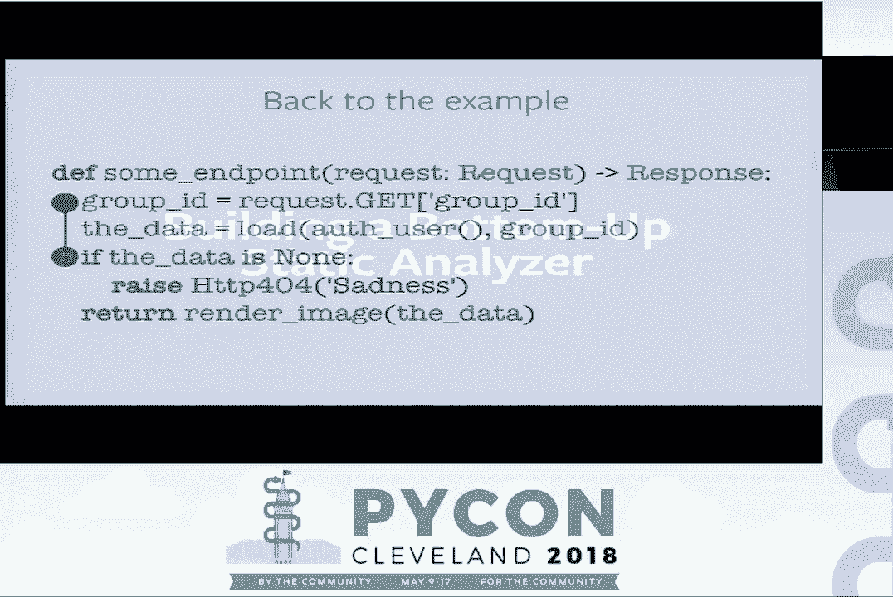

def foo(x: str) -> str:
    return bar(x)  # 类型错误：`str` 不能传递给期望 `int` 的 `bar`
```

为了检查`foo`函数体中的`bar(x)`调用，类型检查器需要：
1.  查找`x`在`foo`签名中的类型（`str`）。
2.  查找`bar`第一个参数的类型（`int`）。
3.  检查两者是否匹配（不匹配，发现错误）。
4.  检查`bar(x)`的返回类型是否与`foo`的返回类型匹配。

**关键观察**：为了检查`bar`的函数体，我们只需要知道它的**签名**（参数和返回类型），而不需要知道调用它的函数`foo`的任何信息。这意味着对`foo`和`bar`的类型检查可以**独立并行**进行。

因此，像`Hack`和`Pyre`这样的类型检查器采用高度并行的架构：
*   启动多个工作进程。
*   将待分析的文件分配给这些进程。
*   每个进程独立解析函数，并将函数签名缓存起来供其他进程查询。
*   进程间协调成本较高，因此偶尔的重复工作（如两个进程都解析了同一个函数）是可接受的代价，以换取整体速度。

这种并行、基于缓存的架构为构建更复杂的分析提供了良好的性能基础。

---

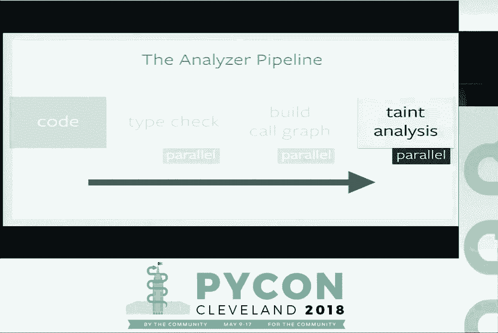

## 🎯 第四部分：构建深度静态分析器
上一节我们介绍了类型检查器的并行架构。本节中，我们来看看如何在此基础上构建一个能够发现安全漏洞的“深度”静态分析器。

我们回到最初的安全漏洞例子。我们想要静态检测的属性是：**用户控制的输入**是否会影响**基于隐私决策的异常抛出分支**。

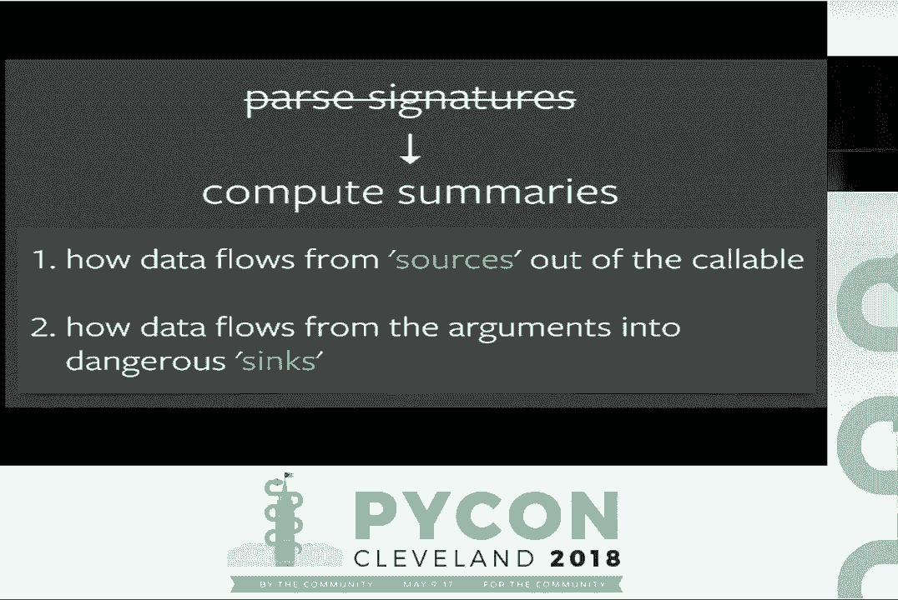

在静态分析术语中：
*   **源**：用户控制的输入（如`request.GET.get(‘id‘)`）。
*   **汇**：危险的操作点（如抛出包含敏感信息的`Http404`）。
*   **污点分析**：跟踪数据从“源”到“汇”的流动过程。

构建这样一个分析器需要三个主要步骤：

1.  **构建调用图**
    *   **定义**：调用图是对代码库中所有可能发生的函数调用的一个**过度近似**。
    *   **为什么需要**：为了跟踪数据在函数间的流动，我们必须知道一个函数可能调用哪些其他函数。
    *   **示例**：对于面向对象代码和动态分发，我们需要考虑类继承。如果函数`foo`接收一个`B`类实例并调用其`get_data`方法，那么调用图需要包含从`foo`到`B.get_data`的边，同时也可能包含到`B`的子类`C.get_data`的边，因为运行时`foo`可能接收到一个`C`的实例。

2.  **计算函数摘要**
    *   **定义**：摘要是对函数行为的精炼描述，比类型签名包含更多细节。对于污点分析，摘要描述了两件事：
        *   **输入摘要**：函数的哪个参数会流入其内部调用的危险函数（汇）。
        *   **输出摘要**：函数返回的值是否来自某个受污染的源。
    *   **示例**：
        ```python
        def foo(puc: str) -> str:  # 签名：str -> str
            return sync(puc)       # 摘要：参数1 -> 流入 `sync`；返回值 <- 来自 `sync`
        ```

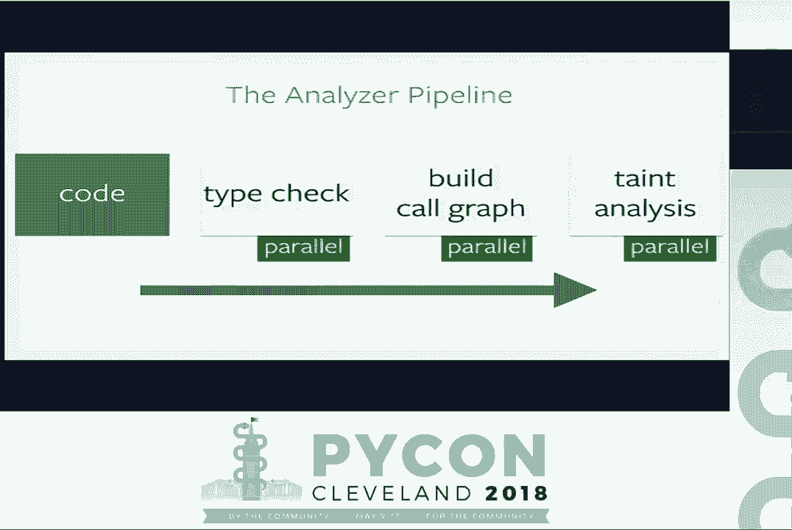

3.  **自底向上的摘要拼接**
    *   **过程**：利用调用图，从被调用的函数开始分析，生成摘要，然后将这些摘要“拼接”到调用它们的函数中，从而发现跨越多个函数调用的长距离数据流。
    *   **示例**：如果`buzz`的摘要显示其参数流入`sink`，`bar`的摘要显示其参数流入`buzz`，那么`foo`的摘要就能显示其参数最终会流入`sink`。

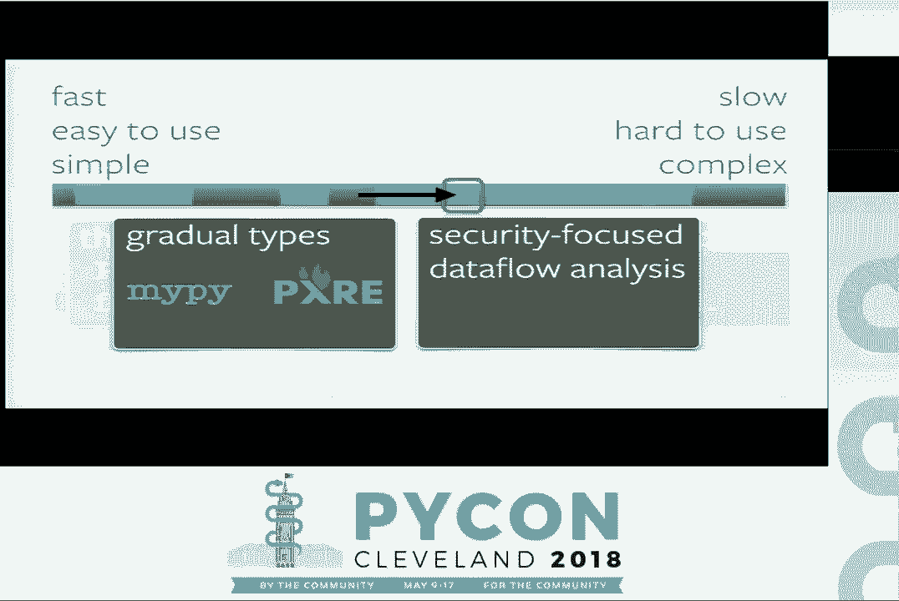

**分析器流水线**：整个分析过程是阶段化的（解析 -> 构建调用图 -> 污点分析），并且每个阶段内部都可以高度并行化。调用图的构建结果会指导污点分析调度器以高效的顺序分析函数（例如，先分析被深度调用的函数）。

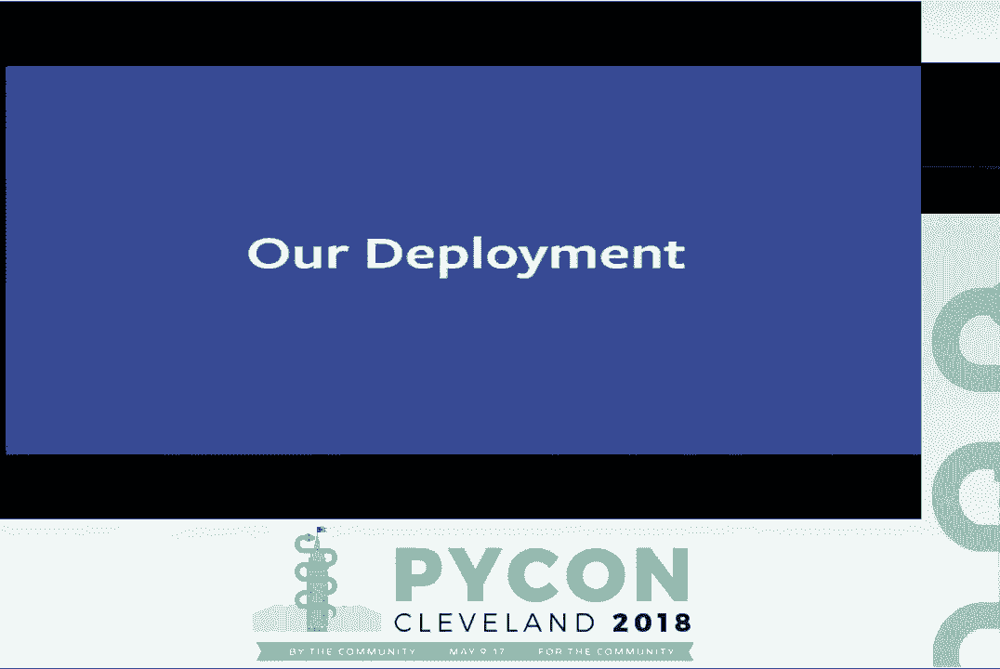

**核心优势**：这种方法**不需要任何新的代码注解**，它完全建立在现有的类型系统之上。安全工程师只需要定义他们关心的“源”和“汇”即可。

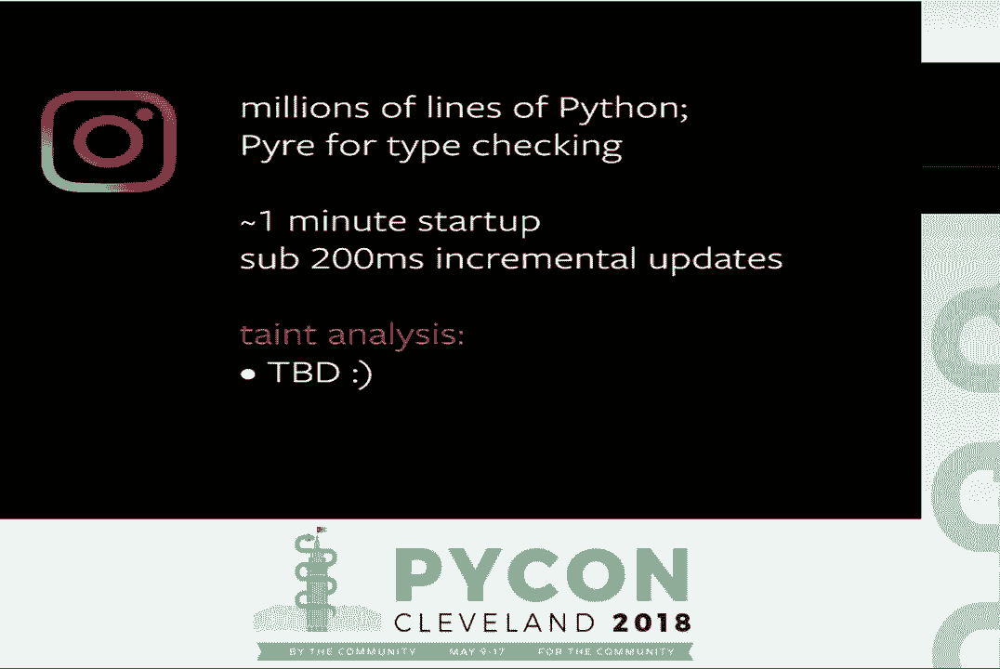

---

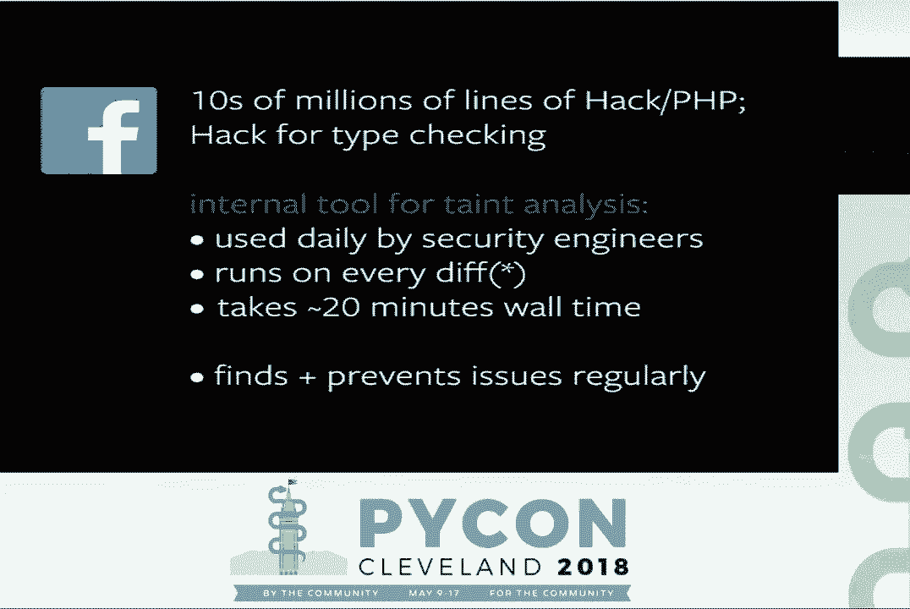

## 📊 第五部分：实际应用与结果
上一节我们从理论上探讨了如何构建深度分析器。本节中，我们来看看这种技术在实际大型代码库中的应用效果，以证明其可行性。

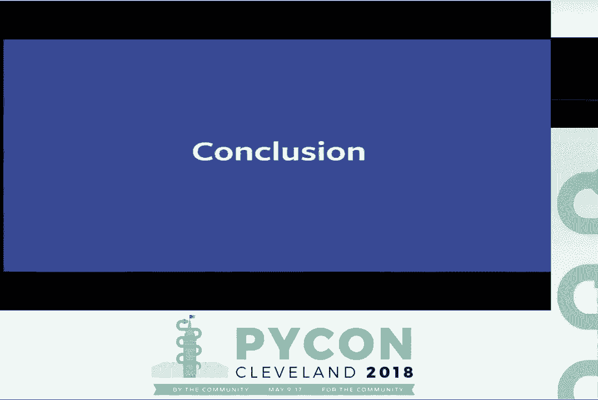

我们在Facebook内部基于`Hack`类型检查器构建了这样的安全分析工具，并正在为`Pyre`（Python）规划类似功能。

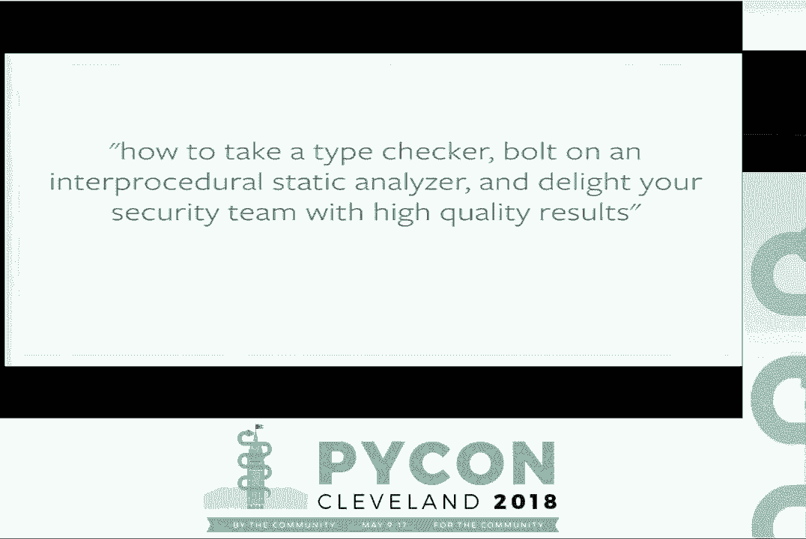

**Instagram (Python) 代码库**：
*   **规模**：约一百万行代码。
*   **类型检查**：使用`Pyre`，全量检查约需1分钟，增量更新仅需200毫秒。
*   **深度分析**：计划中。

**Facebook (PHP/Hack) 代码库**：
*   **规模**：数千万行代码。
*   **深度安全分析工具**：已部署并每日使用。
*   **运行方式**：在每次代码变更（Diff）时自动运行，包括提交前。
*   **性能**：端到端分析约需20分钟（无缓存情况下），检查大量安全属性。
*   **效果**：该工具定期发现并防止安全问题，已成为安全工程师的首选工具，替代了像`grep`这样的简单方法。

这些结果表明，将类型检查与过程间静态分析相结合，可以为安全团队提供强大、可扩展且高效的问题检测能力。

---

## ✅ 总结
在本教程中，我们一起学习了如何利用类型系统来赋能深度静态分析。

1.  我们从一个实际的**安全漏洞示例**出发，明确了静态检测这类问题的目标。
2.  我们回顾了**静态分析工具的光谱**，从简单的`grep`到复杂的正式验证，并确立了在类型检查器基础上构建的折中路线。
3.  我们探讨了现代**类型检查器的并行架构**，这是实现高效深度分析的基础。
4.  我们深入介绍了构建**深度静态分析器**的关键组件：**调用图**、**函数摘要**和**自底向上的摘要拼接**，从而能够发现跨函数的数据流问题。
5.  最后，我们看到了这种技术在**Facebook和Instagram**等超大规模代码库中的成功应用，证明了其有效性和实用性。

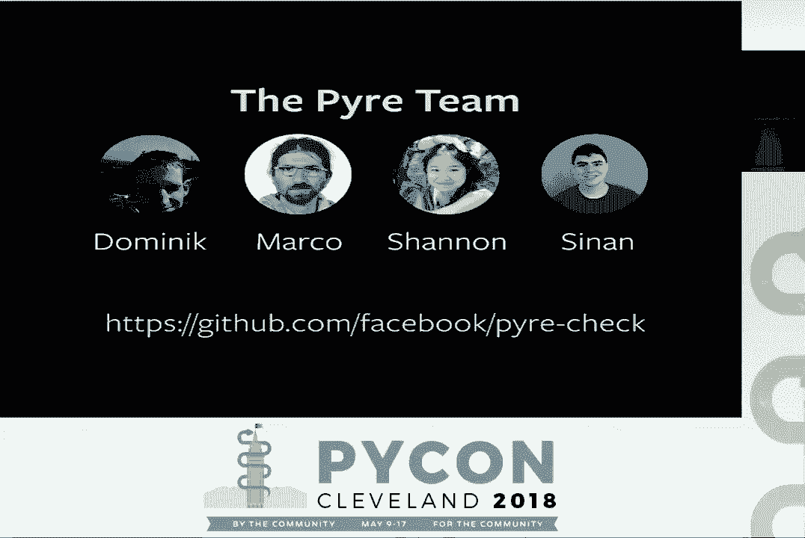

核心思想是：**渐进式的类型注解不仅能改善代码质量和开发体验，还能作为跳板，使安全团队能够进行深度、精准且高效的代码审计，自动捕捉复杂的安全漏洞。**