# P13：Vigneshwar Dhinakaran - 使用 Rust 提升 Python 模块 - PyCon 2018 - 哒哒哒儿尔 - BV1Ms411H7Hn

\>\> 嘿，朋友们。让我们为下一位演讲者再来一轮掌声。

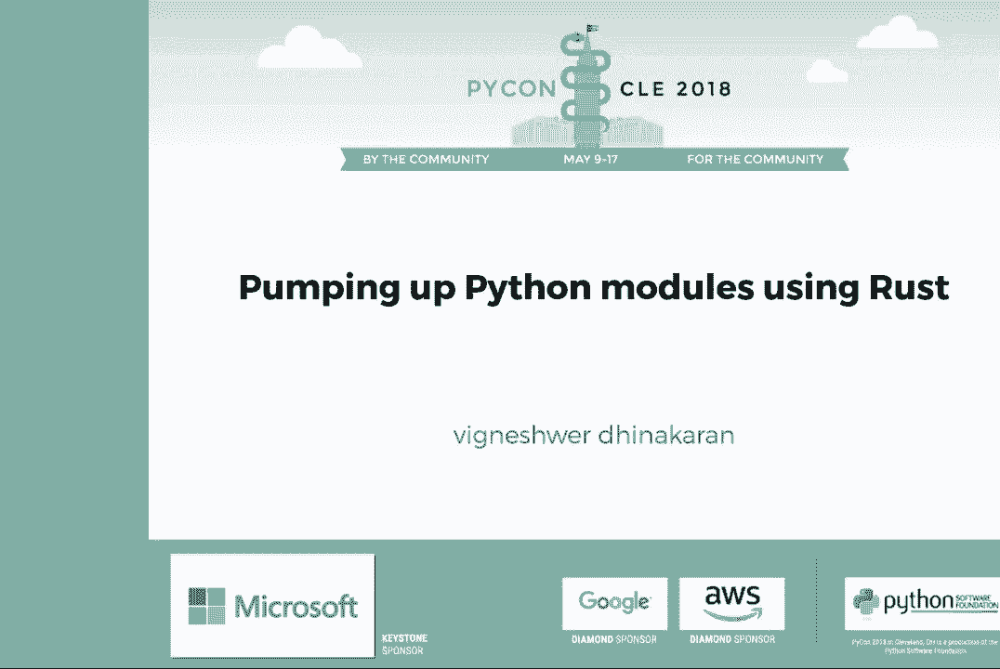

\>\> 嗨，大家好，感谢大家今天的到来。很高兴能在这里，与大家分享我最喜欢的两种编程语言，Python 和 Rust。这两者让我感觉自己是一个完整的开发者。我在这里与大家分享我的这些经验。

今天我将谈谈作为 Python 开发者，我们如何可能编写一个小的 Python 扩展，或者将我们的某些工作负载与静态类型语言连接起来，以获得性能。所以我的演讲主要围绕这个展开。如果你和我一样，听着 PyCon 里的各种性能数据演讲，你。

你可能已经记下了这些黄金法则。第一个是寻找一些工具，比如行分析器，查看程序的哪一部分实际上是慢的。第二件事是去谷歌，看看 Python 社区的人们是如何解决这个问题的。因为 Python 社区真的很棒。总有人。

谁已经成功解决了这个问题。也许使用他们构建的库，或者使用他们用来思考解决这个问题的技术。第三点是不要使用 Python。使用一些以前有效的其他东西。所以我想，从第三点开始。先从一些不是 Python 的东西开始。

所以我很高兴我的演讲安排在这个时间点，因为在听完所有的性能数据演讲后，我们将更多地关注使用一些不是 Python 的内容。但为了使用像 Rust 这样的语言，作为系统编程语言，基本上可以提升你的 Python 模块。所以我们将讨论一下。

在这次演讲中谈论很多关于 Rust 的内容，看看我们如何在 Python 中利用它的特性。因此在开始之前，让我快速自我介绍一下。我叫 Vigneshwar。今天我在这里，代表 Mozilla 作为技术演讲者。很多人看到我的证件问 Mozilla 技术演讲者是什么。所以我想我应该多谈谈这个。这是一个了不起的项目。

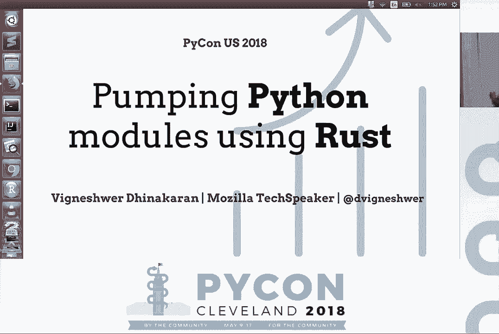

由 Mozilla 的开发者外联团队主办，他们招募热情的志愿者。

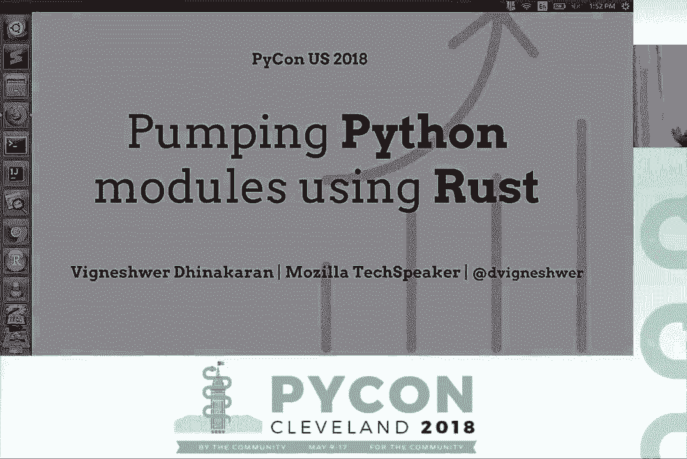

培养他们成为开发者倡导者，走出去并在会议上开发案例。

像这样。谈论 Mozilla 和网络的一般情况，我很抱歉，抱歉这个。好的。

我会继续移动我的鼠标以确保一切正常。除此之外，我是一名数据科学家。我工作，构建许多最先进的机器学习算法。我喜欢这样做。这就是我大量使用 Python 的地方。Python 是数据科学的最佳选择。除此之外，我还写了一本关于 Rust 的书。因此，它确实帮助人们入门。

Rust 编程。称之为 Rust 书。这基本上是关于我自己的。所以让我们开始吧。那么，为什么我们需要本地扩展呢？这是首先想到的问题。这基本上是因为你有一些非常好的静态类型库。然后你想把它带到 Python 中。计算修订版。你们中很多人看到许多图像。

我们使用的处理库，比如 NumPy，还有类似的东西。因此我们希望在我们的 Python 模型中利用这些优秀的工程成果。你不想重写整个东西。这就是我们开始考虑本地扩展的地方。第二个方面是当我们在内存管理上需要更多的自由时。这是我们在 Python 中无法获得的。

第三个方面可能是与硬件打交道等等。因此，性能控制一直是关键。在构建现在要求很高的应用程序时，你需要拥有所有这些惊人的功能。你需要具备能力。这就是能让你在竞争中获得优势的所在。

现在的产品要求很高。因此，单靠 Python 我认为会有点棘手。所以我们需要开始寻找一些替代方案。这也是这次演讲背后的一个重要动机。

那么到现在为止的解决方案是什么呢？Python 社区可能为你解决了这个问题。只需出去看看他们做了什么。你上次遇到问题是什么时候，Python 社区没有提供帮助的？

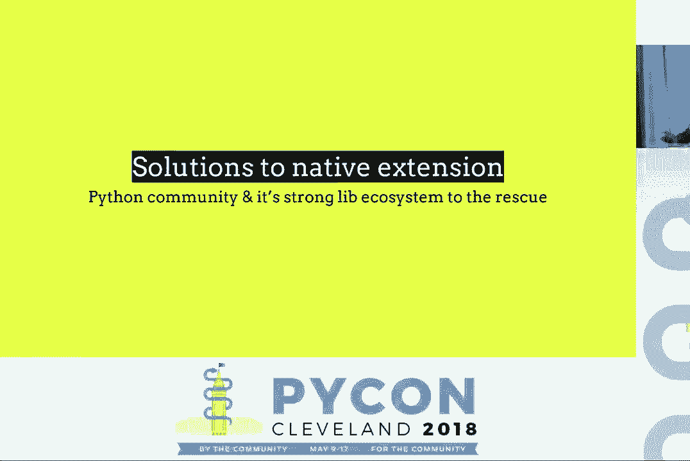

大多数情况下，这确实有效。所以这对我们来说并不新鲜。作为 Python 开发者，你或多或少都使用过这些库。例如，53% 的 C 代码使得它变得神奇。它让它运行得如此顺畅。比如 TensorFlow，这是我每天使用的。它包含 48% 的 C++ 代码。C Python，就是那个运行你特定业务或领域的版本。

你的 Python 代码中包含了大量的系统编程代码。Pillow 是一个在各个领域广泛使用的图像处理库。它包含了大量的 C 代码。那么问题是什么呢？C++ 开发者就像超人一样。很难找到，他们非常强大，就像超人。但现实是，编写代码非常困难。

C++扩展。你需要具备那种专业知识。考虑到时间线，你知道的，尤其是我可以为自己发言，我来自服务行业，你知道。时间线对我来说是个大问题。我甚至无法考虑静态代码。我使用 Python 的原因是为了确保我的代码没有任何错误。你知道吗？所以这就是我看到的。

你知道，Python 真的很有用。这正是 Python 优秀的地方。它可读性强，非常简单，而且运行得很好。但问题是，有些人像**莱克斯·卢瑟**，会成为某种黑客，去查看你的系统代码，试图利用它。例如，氪石对**超人**是个大问题，对吧？所以，从历史上看。

我们见过如此多的错误，造成了很多问题。数据，研究，像。肯定。这是需要手动处理的事情。Python 只是为我们处理了所有这些。就像，你有一个垃圾字符。我会更多地缩短这一点。但重点是，如果你在写 C++扩展，你需要处理这些事情。

这些是有点困难的。这就是我说的，写 C++扩展是可怕和痛苦的原因。那么，我们还有什么其他选择呢？一个网站。所以，它是 Python 的超集，知道吗，调用 C 函数和数据类型的简单方法。效果不错。`A number`是另一个非常好的选择，它使用。

JIT 编译器。它基本上是优化后的机器代码，工作在 LLVM 编译器上。效果很好。最后一个是`PyPy`。它甚至不是 Python。你知道，Python。但这又是一个有争议的话题。是的，再次使用编译器中的建议。效果很好。但问题是，对于像我这样的人，我不能代表所有人。

我有点觉得自己失去了控制。就像，我使用这些工具，它对我来说运行良好。但我不确定到底发生了什么。这让我有点伤心。这时我开始寻找替代方案。主要的需求是什么？主要的需求是。

你知道，你想要 C++那种性能、可移植性和嵌入性，而没有，知道吗。保障安全。我的意思是，Python，知道的，它给我们提供的安全。我们不需要太担心内存和这些东西。我只想专注于我的应用程序，再次获得这种性能提升。抱歉。

所以让我向你介绍一个惊人的。

我们编程语言的现状。它叫做 Rust。这是一种系统编程语言，我喜欢定义为像 C++一样具有很好的控制性，像 Python 一样提供生产力，并且非常安全。因此，有三件事，知道吗，这种语言真的做得很好。这是第一。无惧黑客。因此，再次，有阻碍。

没有额外开销和稳定性，没有停滞。所以无畏黑客的概念就是，去生产环境而没有这些类型的错误。没有额外开销的抽象，就是社区非常自豪的零成本抽象。关于这一点，我会在讨论交易时深入探讨更多内容。

稳定性而不停滞意味着每当新版本的 Rust 发布时，它不会，呃，导致你当前扩展的任何问题。因此，每个版本都应该是完美的，你知道的。这是每个软件开发者所希望的。

我坚信 Rust 正在培养新一代的系统程序员。呃。你可能从未做过系统编程，但我对所有这些术语非常自信。我到处发表自己是系统程序员的帖子。但目标是，你需要创建一个非常稳定的。

自信且安全的系统编程语言。所以 Rust 的特点是你拥有内存安全，而没有垃圾回收。再说一遍，嗯，当我谈到所有权和无聊时，这是 Rust 语言背后的核心概念，这种类型系统，让你能够很好地阅读代码。很容易理解。你写得非常准确。

知道底层发生了什么。高层迭代器。这是我们作为 Python 开发者都喜欢的。我们被它宠坏了。这是另一个话题。但这确实给我们带来了很多选择。自由、数据竞争和一个热情的社区。这是你从 Python 背景中会非常欣赏的东西。我们需要一个非常强大的。

生态系统，一个强大的库生态系统。这是 Rust 非常关注的内容。让我们看看一些事实和数据。这是一个名为 Wires 的应用。基本上是一个进行商务聊天和 WebRTC 会议通话的应用。所以他们基本上做的是将整个加密货币部分迁移到 Rust，并且获得了良好的性能。

这真的很酷。这是另一家公司叫做 Sentry，我想我在这里看到过他们。所以他们在编写他们的代码方面做得很好，能很好地传递他们的源映射和 Rust，并显著减少了处理时间。我认为 Armin 就是写这个的人，他恰好是。

开发了 Flashcap 的那位家伙。他之前做过很多很酷的演讲，所以我真的推荐你去看看，他们在这里做了重要的工作。还有另一家公司叫做。

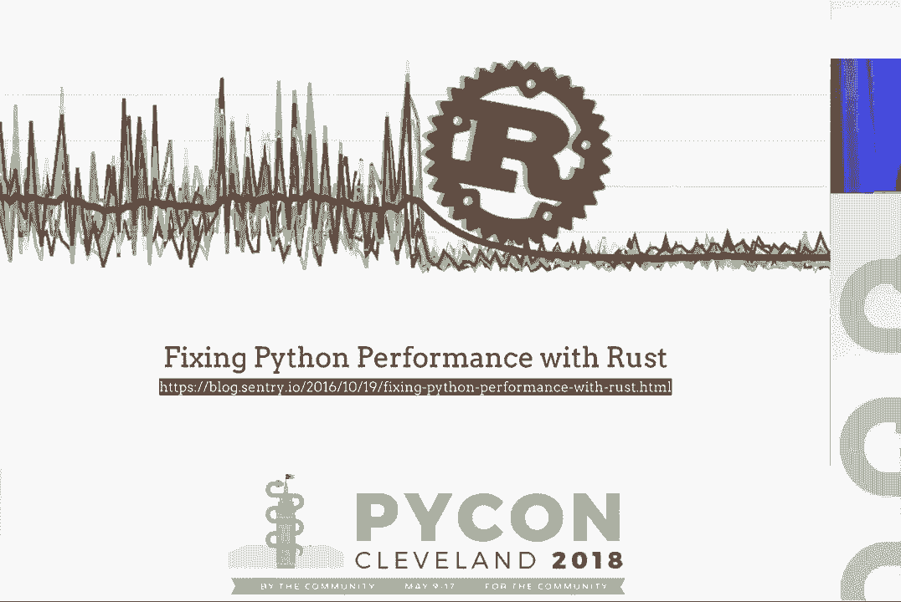

Snips。他们就像 Wires 一样，有 10 家公司。他们重度使用 Rust 来发布他们的产品，并在不同硬件上发布他们的 AI 模型。对他们来说效果很好。这是另一个。

这是一个概念验证库，基于 atokir 编写，它是一种非常快速和可靠的处理异步请求的方式。如果你能看到这些图表，异步请求的处理能力是非常高的。这基本上会帮助你在生产环境中节省很多钱。再次强调，这只是一个概念验证，但如果这个项目能够实现，那将会非常好。

它最终会稳定版本发布。这是 Rust 委员会非常自豪的另一件事。你知道，他们连续第三次被评为最。响亮的语言。这对一个语言来说真是非常酷。它在 2015 年发布，对吧？

所以很多公司正在使用它们。他们有非常、非常好的用例。我没有时间谈论它们，但我真的推荐你们去看看 Rust 朋友网站。再说一遍，你可以从那里获取很多灵感，并试着在你的工作场所应用。那么这一切是如何开始的？Mozilla 是赞助这个项目的公司。

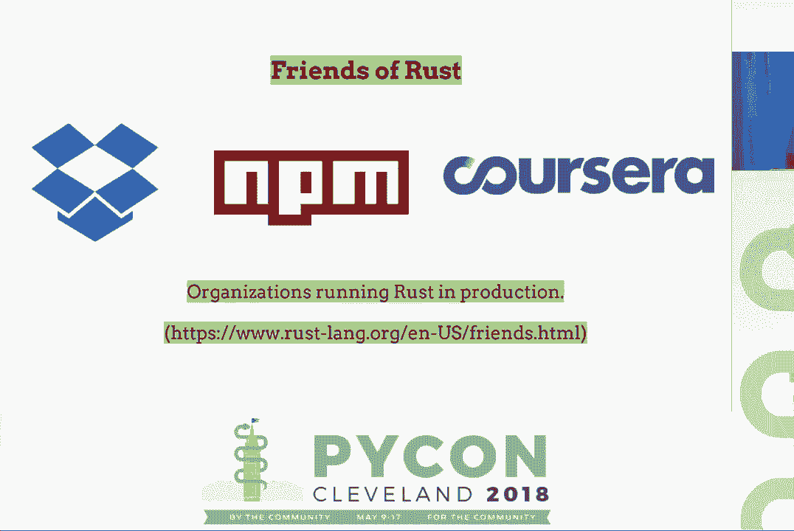

但这完全是一个社区驱动的倡议。所以浏览器只是在性能上竞争。

而且他们也需要安全性。因此，Mozilla 投资于此是非常重要的。所以这就是 Rust 项目，我认为大约在 2006 年开始，也许更像是。Mozilla 的一名员工在做这个，然后有类似的东西。他们受到了很多函数式编程的影响，而且它与 C++ 非常相似。在某个时刻。

Rust 有垃圾收集器。因此，语言随着时间的推移而演变，这让阅读社区发生的事情变得非常愉快。而服务器项目是一种创建高性能浏览器引擎的方式，你知道，整个 Rust 语言受此影响。在 Firefox 48 中引入了 Rust。这是第一次，你知道的。

这样规模的产品，Rust 曾经参与过。它是一个 URL 解析器。然后 557，是一个很成功的故事。他们在 Rust 中重写了很多部分。Stylo 是其中之一，为他们提供了很大的运行时性能。强烈推荐你去看看。所以让我再说一下，你知道的。

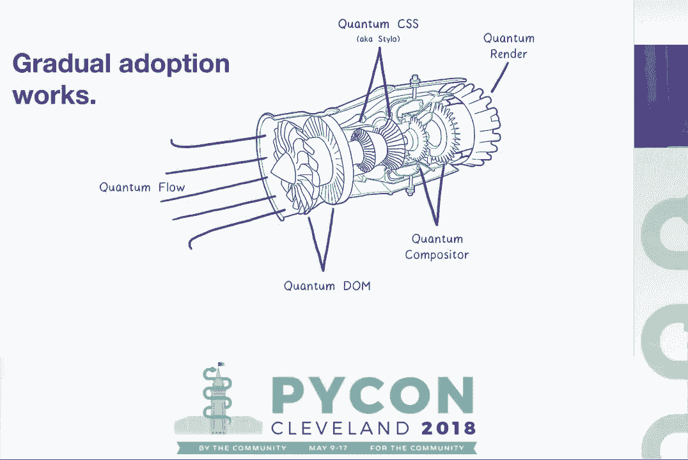

介绍给你 Rust 语法，因为幻灯片的最新部分有很多内容。

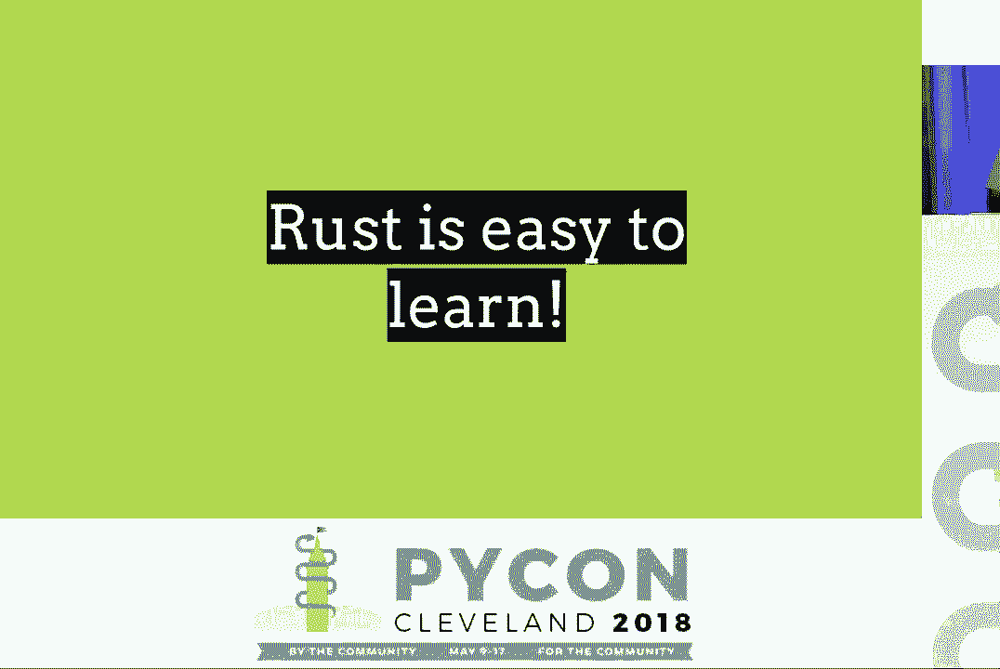

你需要了解的 Rust 语法。 Rust 确实非常、非常容易学习。所以你可以使用这个。

让变量来创建变量绑定。你不必明确提及类型，编译器足够聪明，会默认认为所有变量都是不可变的。然后你必须明确提到可变类型作为可变，以便创建可变的变量绑定。因此，在运行时，当你有时，可以改变值。

把它标记为可变。否则，这是不可能的。与 let 变量不同，如果你想声明一个常量或明确提到类型，这个特定变量在程序的整个范围内都是相同的。因此，函数是相似的。唯一一件我建议专注的事情是，所有内容都要明确提到。

进入特定函数的类型。这基本上有助于你很好地阅读函数。然后你不必明确提到返回类型。最后的语句通常被引用为你试图返回的内容。流控制非常简单。这里没有花哨的东西。只要条件通过，你就知道了。

处理一些代码，其他的不处理。因此，专利映射或开关通常是通过关键字 match 来完成的。所以你有，匹配一个变量，然后你会有很多条件。如果你有一个单一的值，一组值，或一个范围的值，底线基本上是默认的。这是一个无限循环。

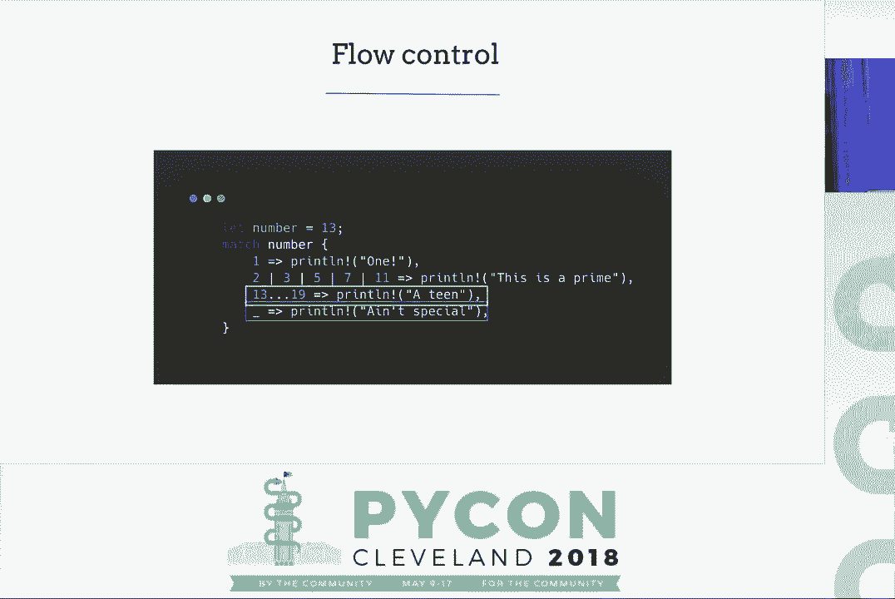

具有条件的循环。因此，在 Rust 中，你都有可迭代类型。所以，你的类型需要是可迭代的，才能运行 for 循环。

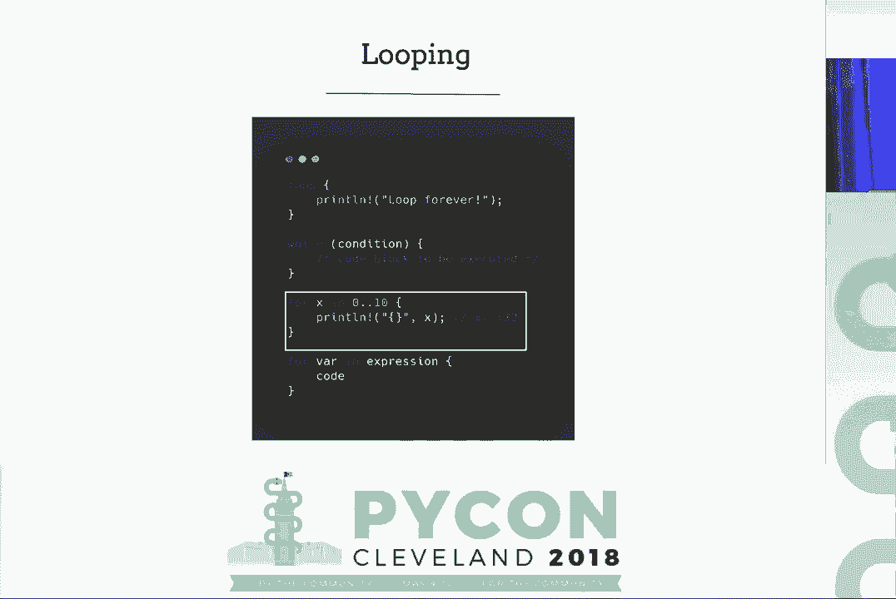

所以这里基本上有一个范围，表达式应该是一个区间类型。

以便在 for 类型中运行。因此，Rust 给你提供了系统编程语言中通常会找到的所有类型。没有不同的。因此，你会看到一个叫 cargo 的东西，真的非常酷。它和 pip 非常相似，但做得更多，我相信有一些 cargo 做得很好的额外功能。

那里有很多相似之处。因此，从 Python 社区回来，cargo 将是你非常享受的东西，因为我确实很喜欢。所以回到核心概念。

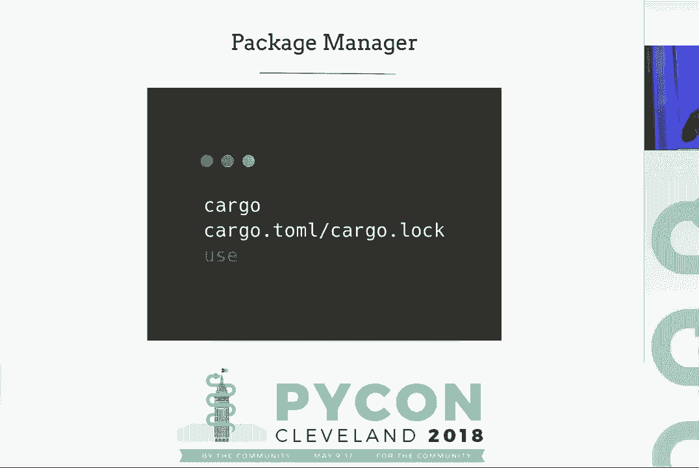

这是一件你需要真正理解的事情。如果你能够理解这一点，你可能已经掌握了信任。因此，所有权，这更像是一个作家处理的过程。

有些东西。所以让我们看看这个 Python 示例。所以你有一个类，它计算面积。然后你创建三个这样的对象，呃，并且你知道，计算面积，而你在。呃，你知道，有一个运算符，呃，来将面积相加。因此，基本上在堆内存中，你可能会有，呃，三个圆。随着时间的推移，基本上会发生这样的事情。

将会有一个后台运行的垃圾回收器软件，呃，在幕后清理这个。因此，它使用引用计数和类似的东西在 Python 中。所以我们作为 Python 开发者并不真的，呃，关心这个，因为这是由 Python 解释器处理的。呃，非常酷。因此在，呃，类似于引用的情况下，你。

你可以只。

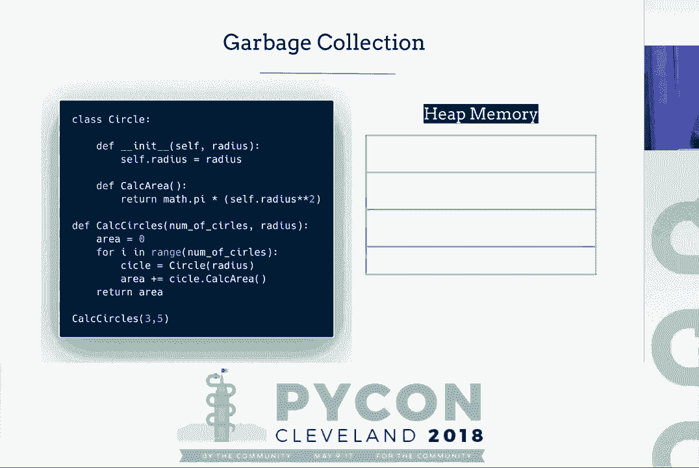

你知道，获取一些值并将其传递给不同的类，比如考虑一个预订。服务。呃，抱歉，那里有一个小错别字。预订服务和维修服务持有。对此变量的引用，呃，应该完全没问题。但假设我们在信任中这样做。

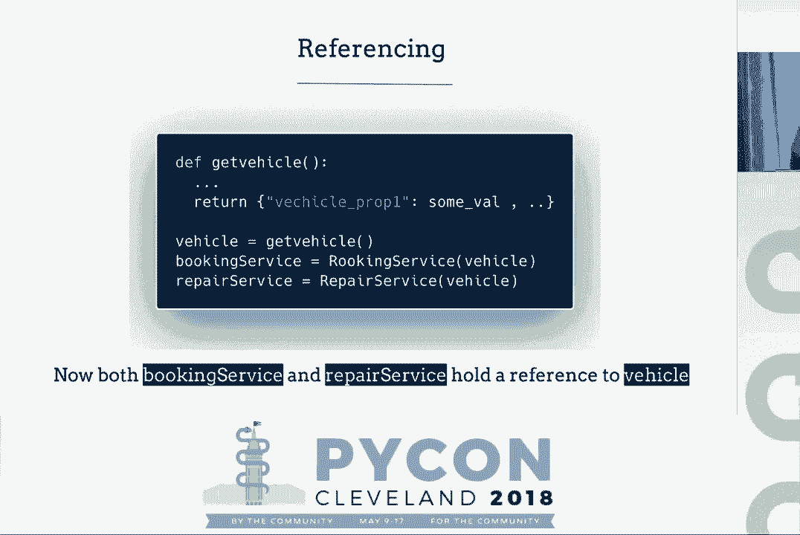

呃，这将在编译时失败。它基本上会抛出一个错误，告诉你。你知道，这个特定类型已经被移动了。像，你怎么能这样编程呢？

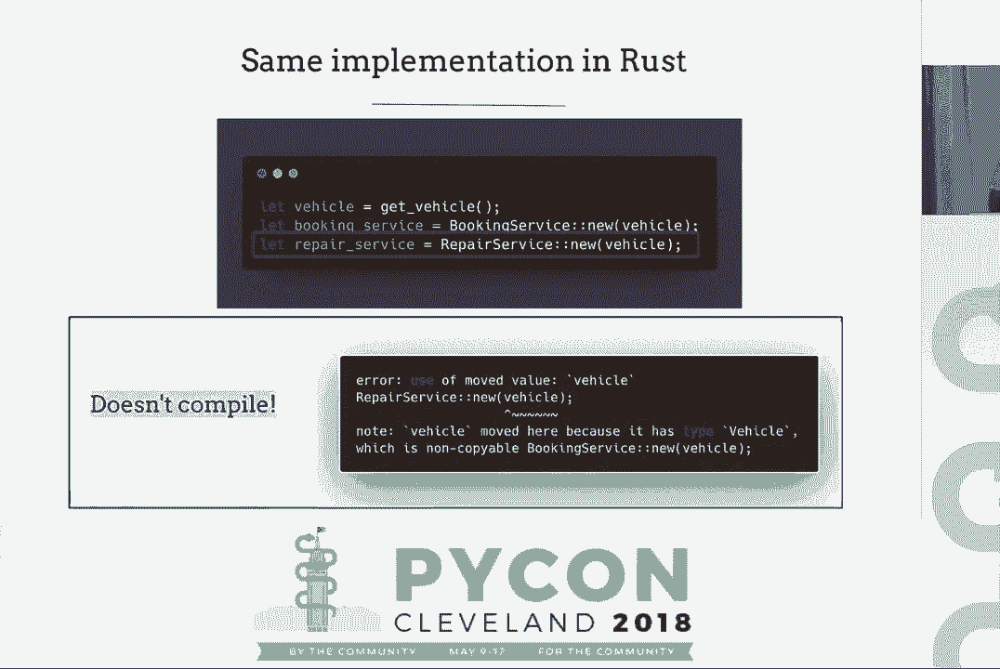

我连引用都无法传递。因此，这就是所有权真正起作用的地方。所有在信任中，呃，都是由一个作用域拥有的。所以一个作用域，特别是，作用域基本上拥有。一个特定的，呃，变量或一个特定的资源，而一旦变量，作用域结束。变量就会超出作用域。它就被销毁了，销毁了，销毁了，销毁了，销毁了，历史上。

被销毁。因此，这就是为什么你不需要垃圾回收器的原因。内存在所有变量超出作用域时立即被释放。这是最重要的事情。

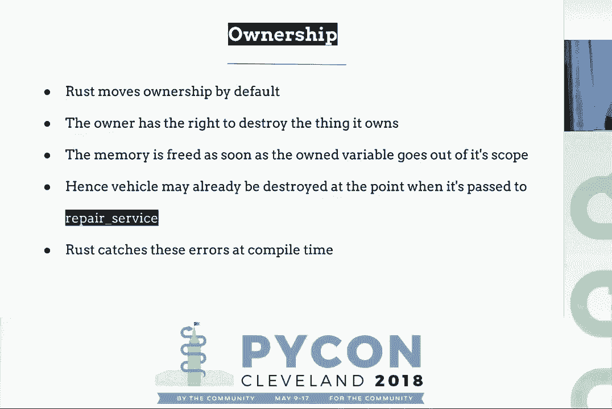

你需要，呃，你知道，记住的东西。但这就是为什么当我们将车辆，呃，变量传递给预订服务时，预订服务并没有明确地将所有权返回给主线程的原因。因此，你调用维修，呃，维修服务。呃，这个，呃，车辆将不存在，因为它已经被销毁了。

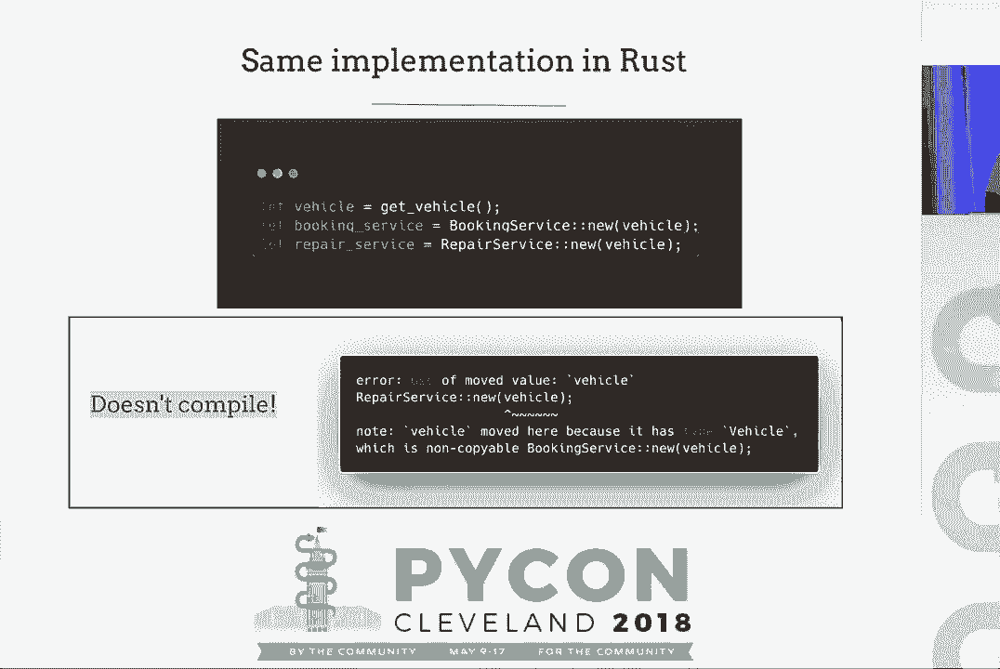

那我应该怎么编码呢？我怎么能在线程之间传递变量？所以就是这样。

借用在这里起作用。因此你可以使用一个借用符号来传递引用。一个相当简单的借用是关键。呃，所以你可以，你基本上是在传递。

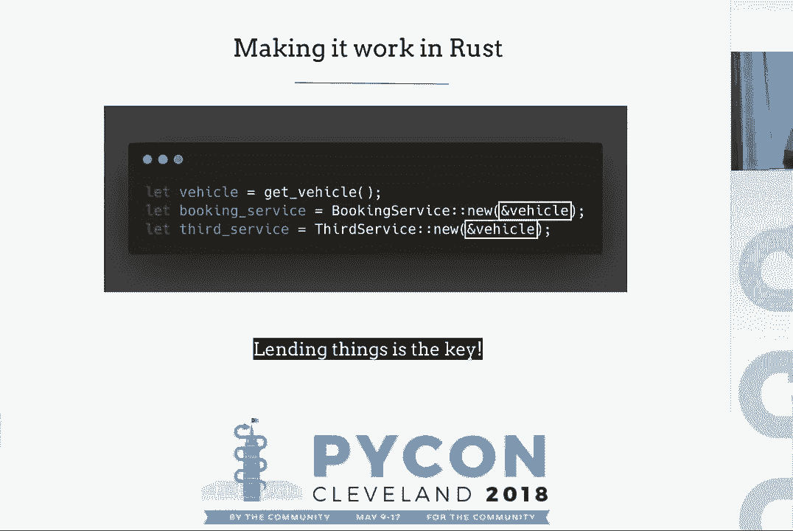

线程之间或函数之间的所有权，然后有两种类型的借用，分别是不可变类型和可变类型。不可变类型不允许你更改特定的内存位置，而可变类型则允许你这样做。你可以有任意数量的，嗯，你知道的，不可变引用，但你不能有，嗯，给定的。

这时，一个可变引用。听起来合理吧？所以是的，这就是你知道的，嗯。

Rust 处理内存管理的方式，嗯，没有任何垃圾收集器。让我们看看。

我提到的一些高阶迭代器。所以在这里我们正在找一个特定的单词，嗯。

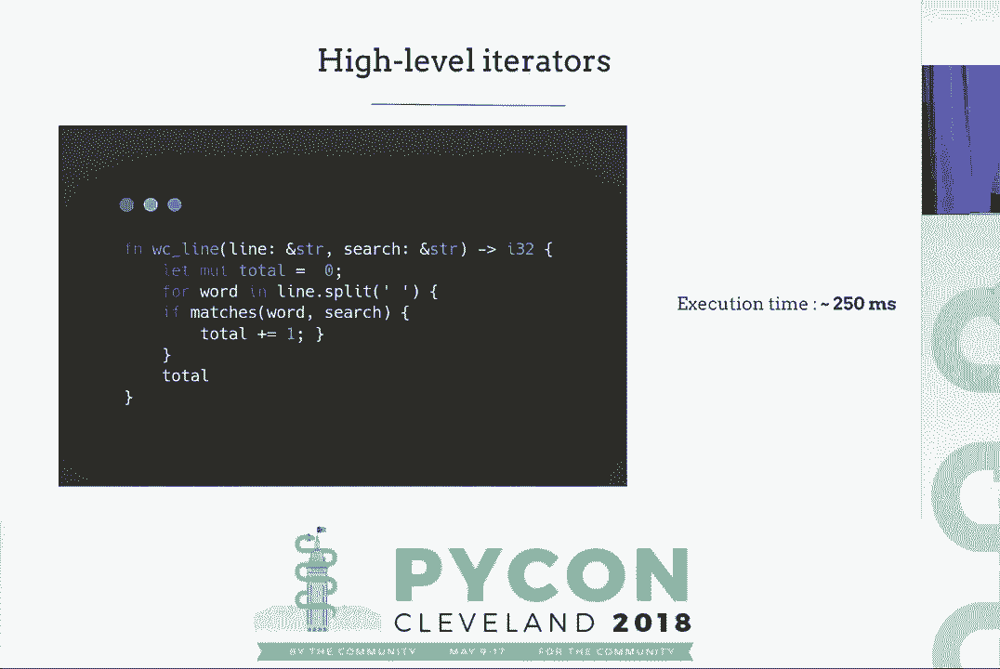

字符串，然后你有一些东西，比如说，进入一个转换器，它会把你的特定字符串转换为可迭代类型，以及你的映射函数，它调用你拥有的 wc 行函数，之后还有过滤和折叠。所以这些就是我所说的高阶迭代器，这确实使得你可以写得非常快。但是，我该如何以并行的方式来做呢，让事情变得更快？

嗯，所以这个包叫做，嗯，Ryan，所有你需要做的就是，把，嗯，变成可迭代变成并行的。非常简单，对吧？所以，嗯，这在运行时给你带来了很大的提升。所以 Ryan 是一个非常，非常酷的包。我强烈推荐你去看看。

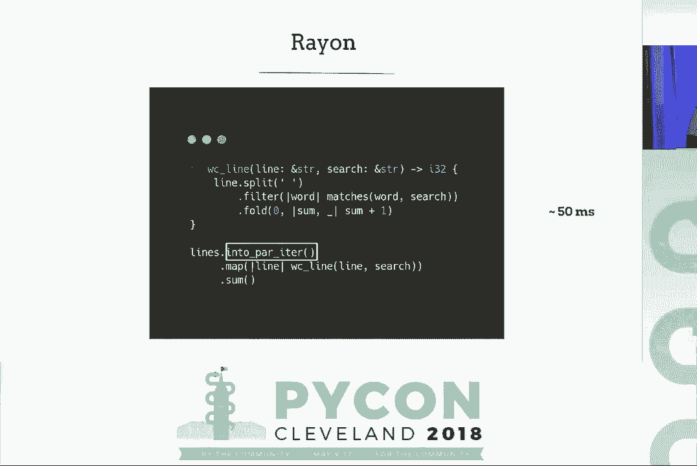

这确实有助于数据并行性，嗯，数据并行性。所以有一些自定义数据类型。

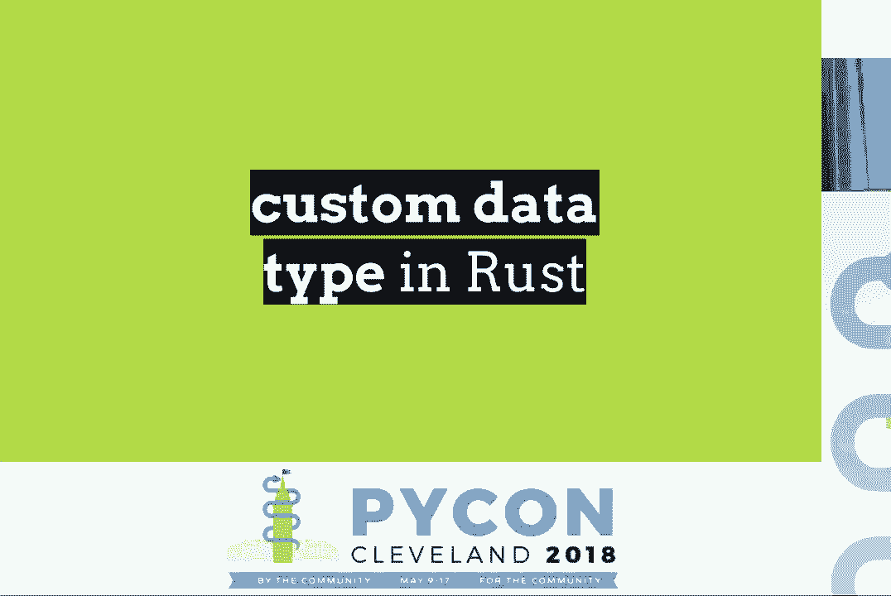

你可以构建的东西。结构是一种方法。它们就像轻量级引用。它们有字段。嗯，它们也有方法。但是，你不能让它们部分填充。这样会在运行时抛出错误。所以，嗯，你基本上可以使用类似的选项，这是一种通常用于错误处理的枚举。而且匹配一个枚举或。

一种非常好的错误处理方法。嗯，Stux 可以有方法。所以要使用实现。

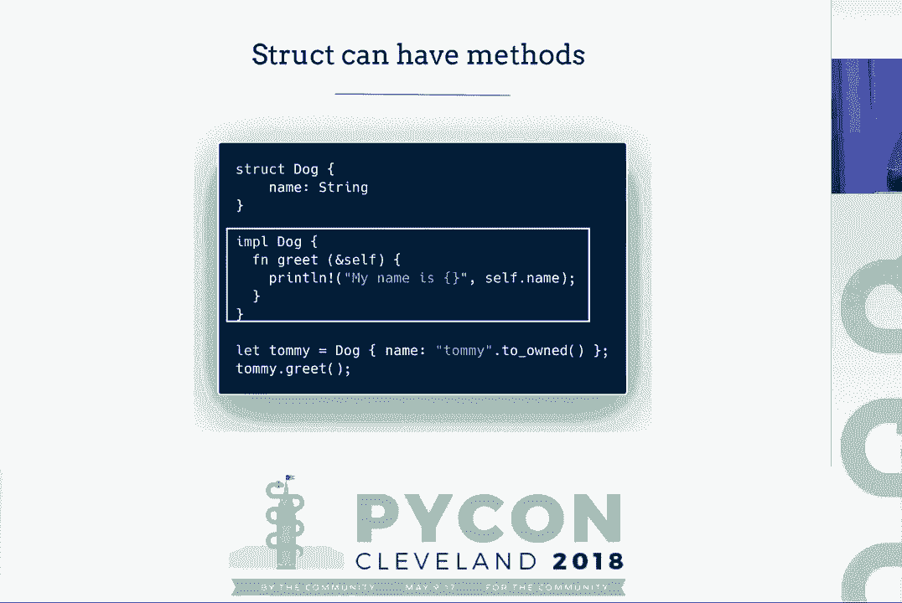

关键字来构建结构体的方法。所以还有一个我想讨论的重要主题是接口，在 Rust 中像接口那样的结构，它允许你添加功能。像是，你知道的，具有类似功能的，不同类型的同名函数。所以。

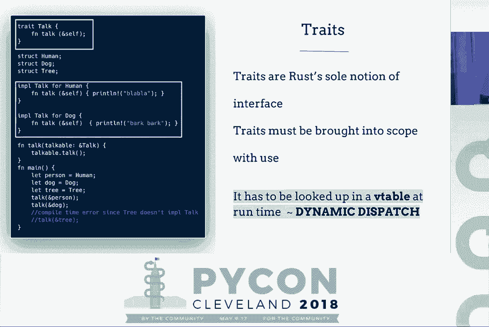

这是动态调度在运行时发生的地方。而且有一种叫做泛型的东西，嗯。

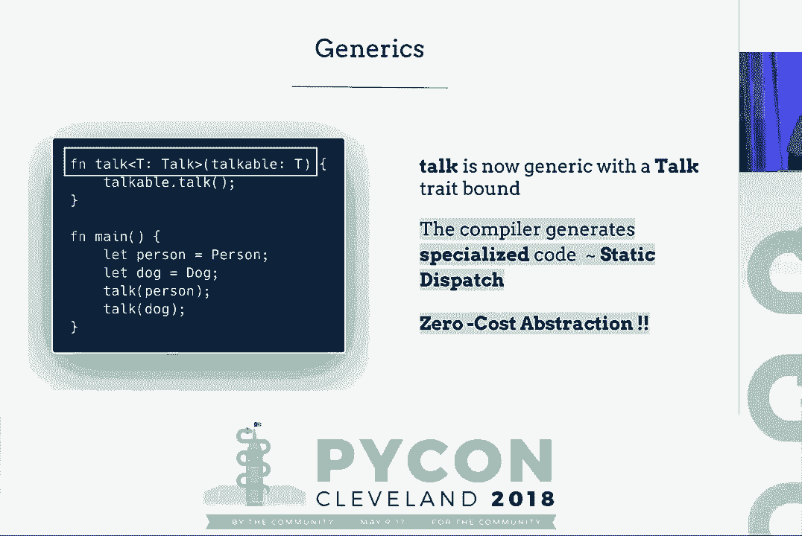

这是一个非常酷的话题，我想我快没时间了，我将跳过这一部分。

所以让我们看看如何在 Python 模式下开发和发布 Rust 扩展。这就是你们在这里的原因，对吧？所以做法是使用外部函数接口。外部函数。接口是你，知道的，你可能想要从一种语言共享特定数据类型到其他语言的方式。这就是，呃，你知道的。

外部函数接口到位。呃，它基于平台相关的，呃，C 绑定。C 应用程序绑定接口，你有。Rust 被认为能够，呃，生成非常。非常高效的 C 绑定。这是我觉得，呃，Rust 是，呃，一个你可能考虑的写下一个引擎的好选择的原因。呃，再次。

说到控制方面，你真的，知道发生了什么。你。你查看了 Rust 代码，它相当容易理解。它并不那么难，对吧？它与 Python 和其他语言有很多相似之处。所以它基本上给你这个机会去理解你在写什么。你只是没有。

盲目相信某些工具。呃，这是你知道的，作为程序员，我们需要真正，真正关注的事情。呃，所以是的，如果。 如果 Python 是托尼·斯塔克，那么钢铁侠就是 Rust，而 Rust 编译器就是贾维斯。呃，这就是我的，呃，你知道，呃，例子。所以这确实是理想的，呃。

创建和使用 FFI 模块的理想选择。呃，所以你从，呃，你知道，提到，呃。你想要创建的库。所以你必须，在 Rust 中，首先创建一个二进制文件。所以你用，呃，如果你查看创建类型，创建一个类似于 Rust 中的库。呃，类似于 Python 中的库。使用创建类型，你创建了一个。

动态库将，呃，你知道，输出像 Linux 中的 daughter so 文件和一个，点，呃，deal 文件 Windows 和类似的东西。接下来是创建扩展的地方。所以。

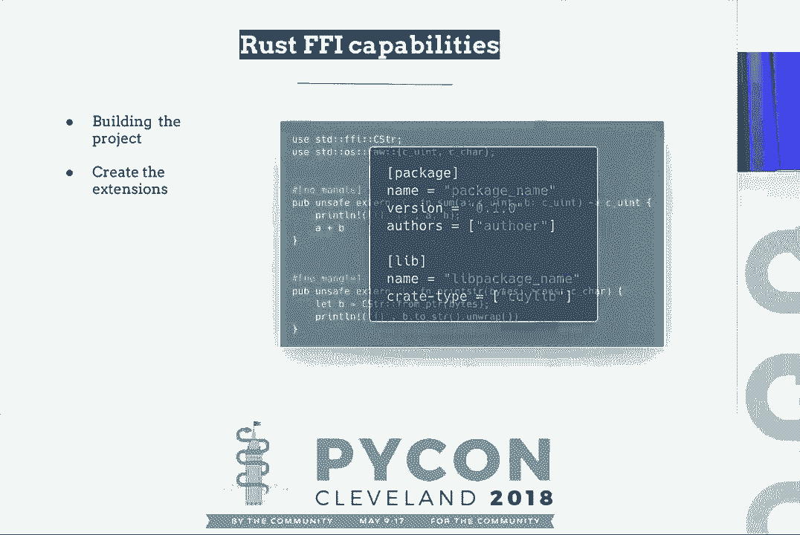

Rust 标准库为你提供了一些，呃，一些，呃，呃。内建的数据类型用于与这些，街道字符串和输入交互。没有 mangell 是一种方式，你知道，在你提到的属性中。不是说不要更改我的函数名称，呃，在编译时。是的，你，你没有。

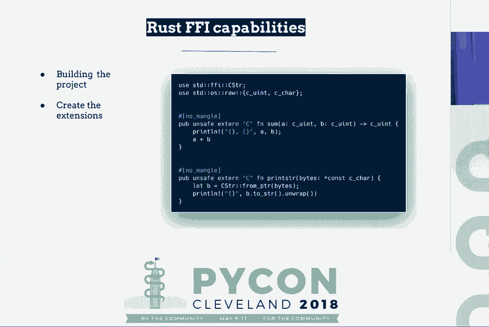

明确地遍历代码。呃，关键是编写这些扩展非常简单。还有。

呃，你可以使用，呃，ECFFI 模块将其编译到你的 Python 代码中。我强烈建议去看看文档，测试很多，呃。需要覆盖的内容，你总是可以用你的，呃，setup.py 来构建它。所以还有其他工具我也非常推荐。

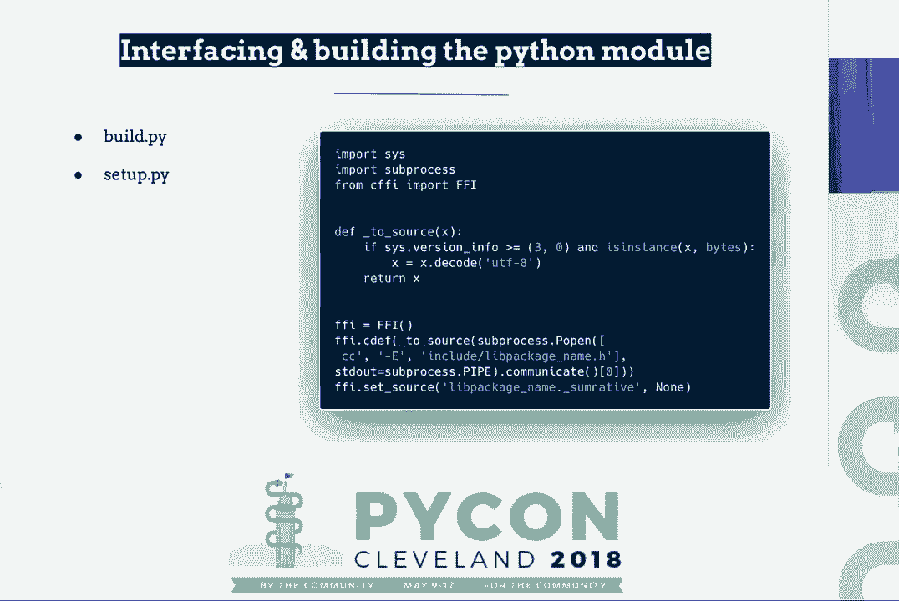

外出，检查设置工具。Rust，mil snake，mil snake 又是由，呃，中心的家伙们写的。

所以它工作得很好。呃，但还有其他替代方案。正如人们所说，不要重新发明。轮子。呃，你有很多类型需要，呃，你知道，手动处理，那里有，呃，向量和。数组，你基本上想要传递出去。所以 rush see Python 是一个很好的，呃，库。它是一个库或创建，可能处理，呃，其他，你想要的其他 C 绑定。

拥有。呃，这是一种简单的方法，你知道，和 Python 中的兴趣进行通信。所以在这里，我基本上有一段 Python 代码，呃，我在尝试做一些字符串处理。呃，呃，查找某一行字符串中的双重。我使用了两个 S。你可以只用一个 zip，然后我用正则表达式来做到这一点。呃，我在创建像十亿个。

呃，字符。所以你会使用，呃，Rust。

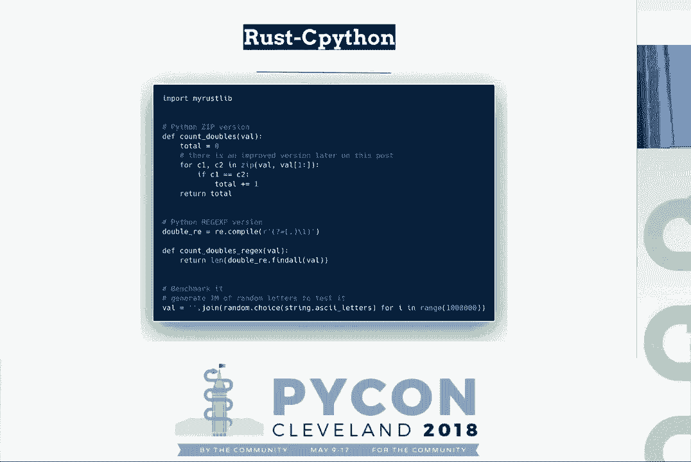

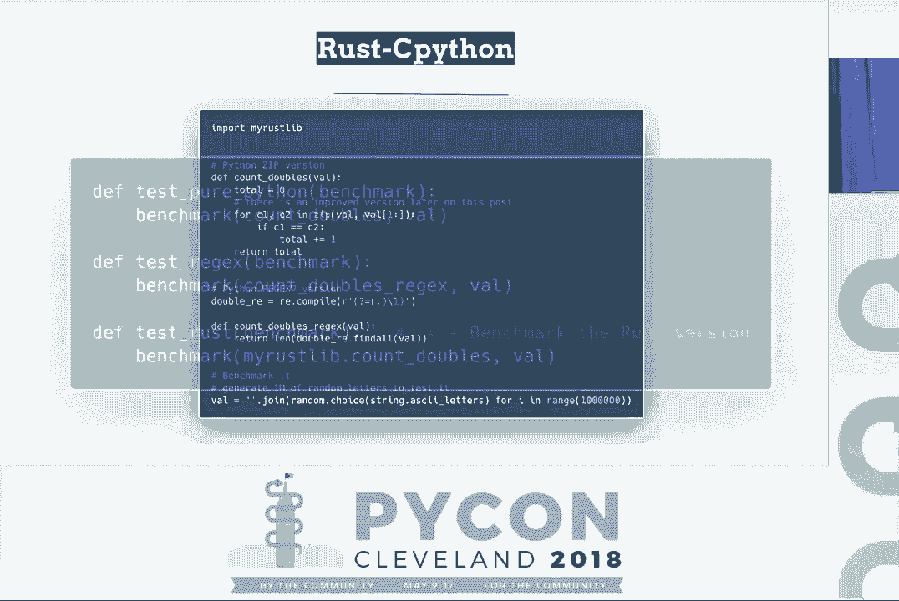

呃，基准，呃，PyTorch，基准，呃，库，以便，知道，基准你的，呃，性能。

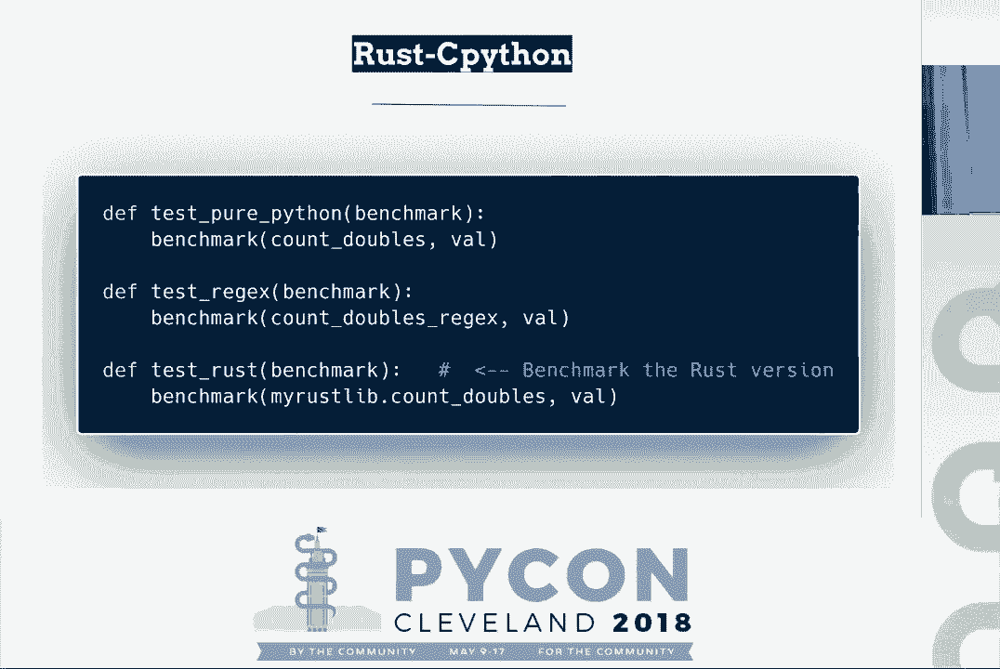

运行时。你知道，现在让我们在，呃，Rust 中创建一个扩展来做同样的事情。所以我们首先。首先，我们开始，呃，提到我们将使用的，呃，crate。那是。Python，呃，调用那些，呃，类型，你可能会在我们的 Rust 代码中使用。然后，这里我有一个类似的实现，呃，呃，和之前的，呃。

在 Rust 中计数功能。但如果你能注意到。显然我使用了一个 Py 结果作为我的类型，因为那将处理 Python 中的异常，并且，你知道，能够在，呃，静态编译的。eso 文件和你的，呃，Python 解释器之间进行通信。而且它也。

第一个或两个参数在 Python 类型中，呃，向下传递，你知道，你，呃。锁定你的，呃，全局，呃，g，呃，gl，呃，gl。呃，是的，然后好吧，它是一种。写回，呃，成功的这个特定程序。

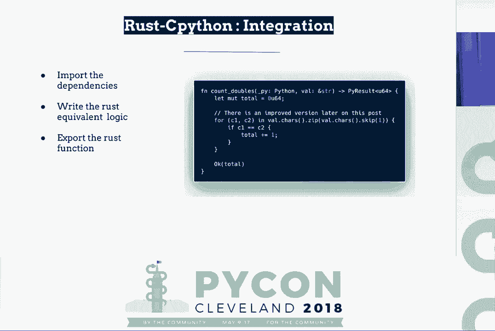

最终值。最后你必须使用一个宏，以便明确提及你要导出的函数，呃，因为，再次，一个好的接口，呃，你知道。编译出这些函数。

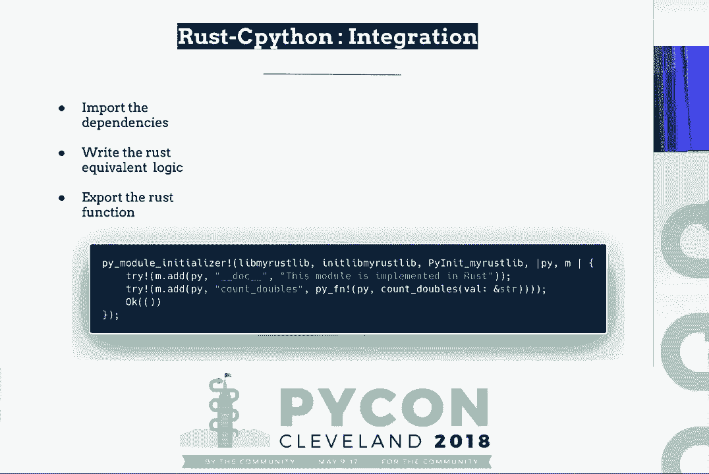

你要使用的。因此，是的，你会发现显著的，呃，性能提升。所以。纯 Python，呃，你知道，它只是，它只是比，呃，reggaex 函数快 25 倍，快 10 倍，呃，最多。比，呃，reggaex 函数快 10 倍。所以这就是你知道的，预编译的优势，呃，和使用静态编程语言。因此，还有其他事情。

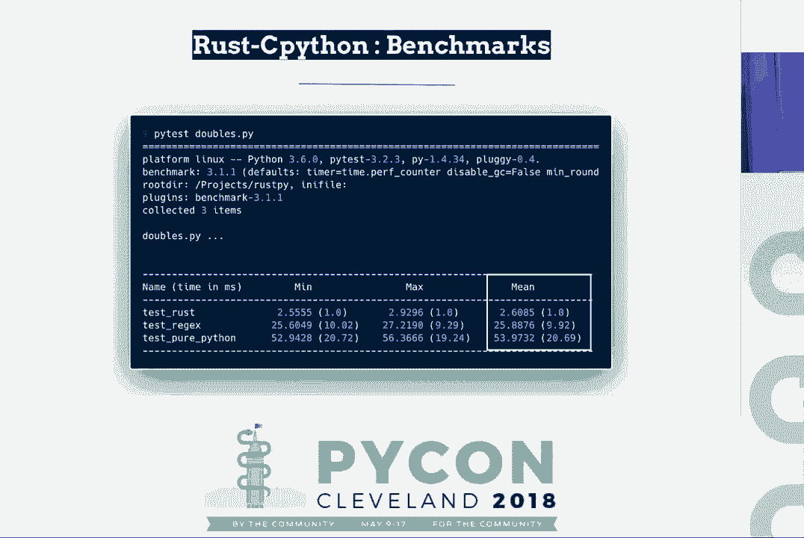

你可能想要做的，关于，内存分配的事情。有很多更多，你知道。这是一个非常简单的例子，但，呃，呃，构建生产应用程序你可能想做。更多的事情，比如传递向量等。呃，所以我强烈推荐。我朋友 Nikita 的这个演讲，他也是一位技术演讲者。这是一个很好的演讲，值得关注。

并检查。他详细讨论了每个信任的五个方面。所以，再一次，有很好的工具。可用于信任的系统。你有 Rust 应用程序，这是 Rust，呃，呃，Rust，呃。工具链安装程序帮助你在不同版本的 Rust 之间切换，Rust 格式，Rust。通过 PDA，一些，呃，好的维护方式，像，真的好的代码基础，cargo，我之前提到过。

之前，包管理器，还有许多其他工具系统。呃，Rust 是一个。社区驱动的，呃，项目，呃，你知道，所有事情都通过 RFC 进行，如果你想要某种更改，你，提交一个 RFC 提案，社区。

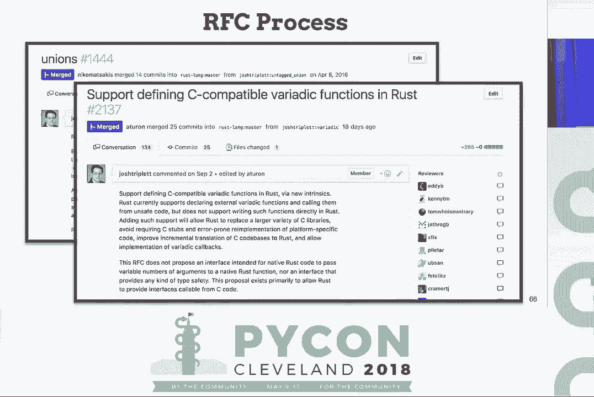

验证它。有一个叫 craze.io 的东西，你知道，所有这些包会被上传，你会发现，这是一个非常好的库生态系统。就像。在时间上，那里已经发布了很多 craze，非常有帮助。

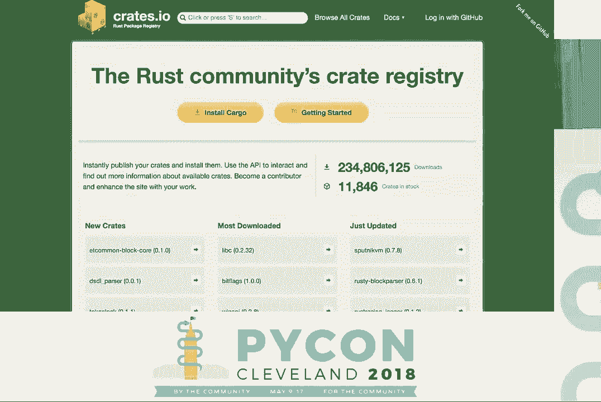

呃，总结一下，呃，不，我，我，当你必须使用 Rust 时，比如，你知道。我会说的主要事情是如果有某种数学，呃，复杂的，复杂的代码你在现有的堆栈中，那是你可以转换为 Rust 的东西，你知道，获得静态类型语言在访问硬件时的优势。

你知道，内核级 API，Rust 为你提供了良好的类型和，你知道，接口来实现这一点。呃，实现高级，呃，Concurrency 范式，真的，真的很简单。但请记住，你知道，不同语言之间的调用是有点成本的。所以，尽量在非常。响应会被做，不，应该不是像，你知道，针对每个，请求或者。

类似的事情，你在，呃，呃，调用 Rust 构建函数或 Rust 静态类型，呃，Rust 函数。那么 Rust 有什么提供？它是 C++的现代替代品。如果你是像我这样寻找学习系统构建语言的人，觉得 C++有点。难以学习，Rust 绝对是个好选择。除此之外，就是，你知道。

改善你的工具链。你，想要，你想要，像，呃，每天学习。因为有些概念在 Python 中我们并不太在意，但，呃。鉴于计算机科学发展如此之快，我们需要了解这些概念，Rust 是学习它们的一个非常好的方式。

我个人是这样学的。这只是丰富的运行时，并且有很多强大的，嗯，函数式编程影响，这非常好，正是我们所需要的。

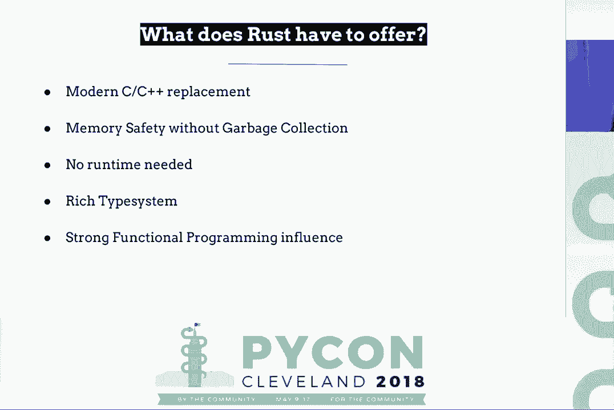

开发者的声音非常大。嗯，所以我们感觉很棒，像，嗯，差不多就是我想要覆盖的所有内容。嗯，非常感谢。像，你可以。我的，我，我，我在这一天，这一周，你应该在 Twitter 上，然后我刚刚。整理了一些好的演讲在 PyCon US，微小世界或 PyCon US，所以请随意。

去看看吧。我想我们还有几分钟时间可以提问。非常感谢。[掌声]所以，嗯，如果有人有问题，请随时走到提问麦克风前。有一个在这里，还有一个在那里。嗯，我们还有几分钟时间，请随便问任何你在想的事情。或者我会在这里，所以请随意来，嗯。

嗯，我很好奇，你知道 Rust 在科学计算方面有很多库吗？比如像 NumPy 那样处理数据？嗯，现在还不多。我会很诚实地告诉你。嗯，但这是我在空闲时间想做的事情。我在构建一些深度学习包，嗯，实际上就是一个深度学习包。

但这是一件有趣的事情，你知道，在这个过程中你学到很多。它们非常少。实际上非常，非常具体于行业，但在网络、嵌入式系统和这些领域有很多惊人的创作，但在科学计算方面，我们还没达到。嗯，但这对 Rust 来说是一个非常有趣的领域。是的。谢谢。好的，谢谢你的演讲。嗯。

所以如果我拿一个 NumPy 数组传递给 Rust，或者如果 Rust 有一个数组想要传回 Python，嗯，它会显示成什么样子？你需要手动指定所有的，嗯，形状吗？还是别的什么？嗯。这就是像你知道的 Rust，见到 Python 的地方。嗯，他们为你处理这个。

但如果你想从头开始做，你可以使用 Rust，嗯，内置的 FFI 模块来做到这一点。好的，谢谢。是的。所以目前如果我想在计算方面加速一些东西，我可能会使用 cython 或 C++或类似的东西。

你见过哪些情况下 Rust 会超越，嗯，cython 或 C++？我。其实我没有对 cython 和 Rust 进行基准测试。嗯，有时我觉得你可以得到非常接近的性能。具体取决于你在构建什么和你的应用是什么。嗯，但，像你知道的，关键在于控制。我展示了一些用例，对吧？

在网页开发中，解析以及类似的事情。他们在那方面历史上有过良好的性能提升。谢谢。嘿，感谢你的演讲。嗯。你知道有哪些 Python C 库转向 Rust 吗？他们的体验如何？是的，呃，Centric 的团队做过这件事。

对于库的名称我不是很确定，但，有几个我可以，稍后分享给你。是的。感谢你介绍 Rust。嗯，在你的总结幻灯片中，呃，有一句话你提到，Rust 不需要运行时。你能稍微解释一下吗？

对不起，我没听懂这个问题。嗯，你的一句话说 Rust 不需要运行时。呃，我真的很抱歉。我没法理解。你能理解这个问题吗？好的。是的。你基本上是提前编译的。所以你需要构建整个抽象语法。这是 Python 即时处理的，对吗？它是，呃，一种脚本。

语言和另一种系统编程语言。这就是你所获得的那种，呃，计算，呃，计算提升。呃，所以这就是我所说的无需运行时。谢谢。希望这对你有帮助。是的。非常感谢大家。

