# P14：妮娜·扎哈连科 - 日常 Python 问题的优雅解决方案 - PyCon 2018 - 哒哒哒儿尔 - BV1Ms411H7Hn

好的，大家。

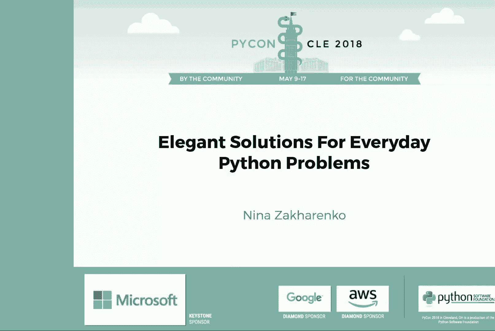

让我们热烈欢迎妮娜·雅克斯-阿兰科。

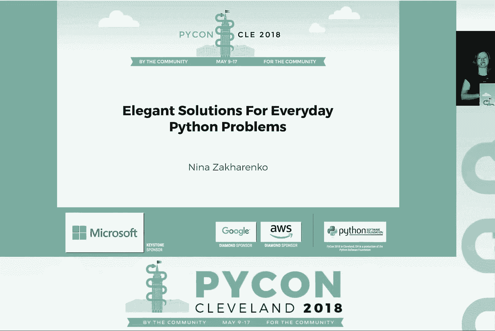

[掌声]，大家好。我是妮娜。我已经专业编写代码超过一天。我曾在一些很酷的公司工作，比如 Meetup、HBO、Reddit。但这些天我在微软担任云开发者倡导者。屏幕上的是我们的吉祥物，比特，这只可爱的小浣熊。

所以如果你也觉得他可爱，演讲结束后来找我要贴纸或徽章。我今天来这里是为了和大家讨论日常 Python 问题的优雅解决方案。

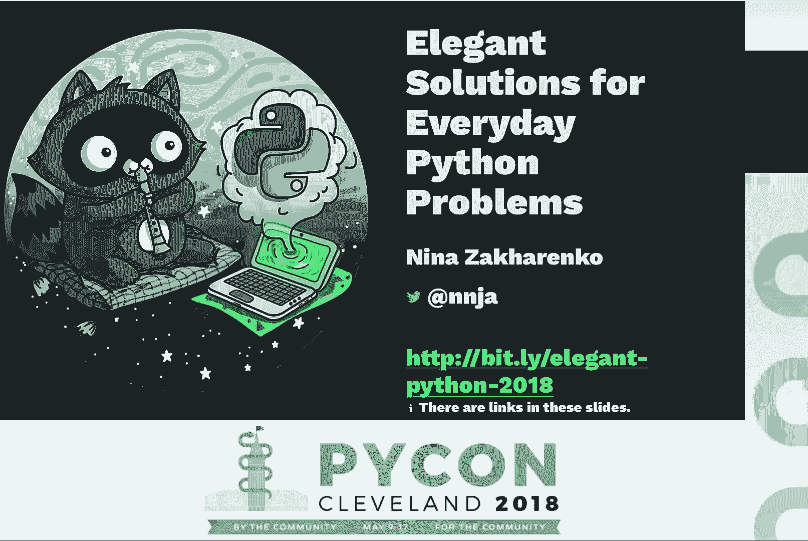

这次演讲的幻灯片托管在 bit.ly/elegant-python-2018。所以如果你想跟着一起看，可以去查看幻灯片。幻灯片中包含了许多指向有用信息的链接，比如额外的文档。这是一个中级水平的演讲，我将快速浏览一些我最喜欢的 Python 语言特性。如果你在此刻无法吸收所有内容，也没关系。

不要害怕。如有需要，请随时重新查看材料。如果你是从另一种语言转到 Python，这可能对你有用。或者如果你想了解一些酷炫的 Python 特性，比如魔法方法、迭代器、装饰器和上下文管理器。我还会突出一些有用的包，能够改变默认的 Python 行为。

到下一个层次。请注意，这次演讲的目标是 Python 3。

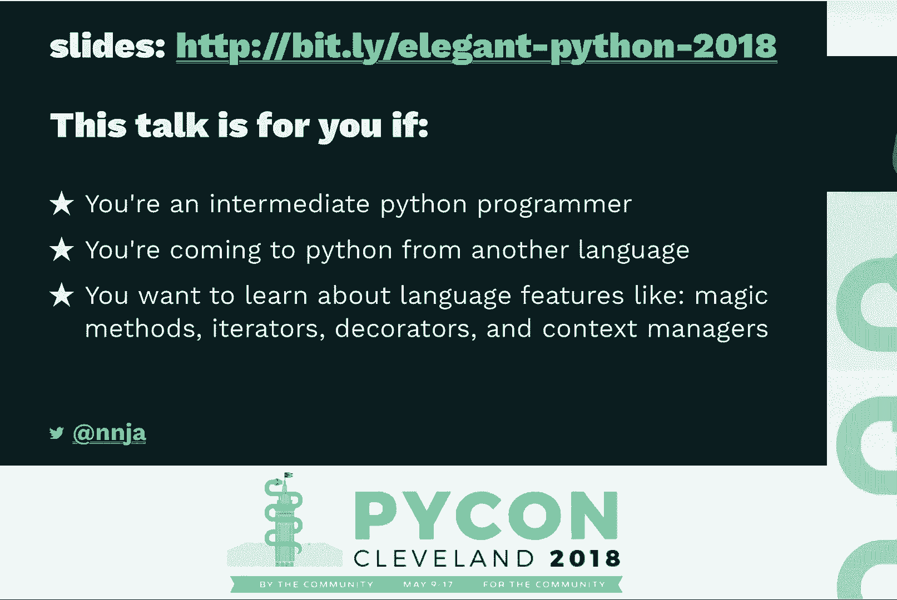

那么什么是优雅的代码呢？这实际上取决于我们想要解决的问题。我刚开始职业生涯时是一名企业 Java 开发者，曾使用当时一些流行的库和语言特性。但所有这些始终感觉像是附加上去的，从未感到优雅。

我想我仍然会对抽象、单例、代理、工厂 bean 有噩梦。在场的 Java 开发者发出会心的笑声。所以当我发现 Python 时，真的感觉像是清新的空气。清新的空气。

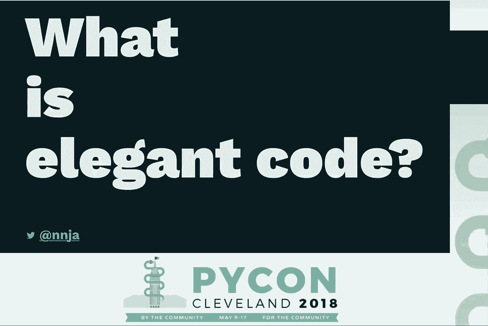

它有一些创新的特性，感觉不是强行加入语言中的。那么我们该如何选择合适的工具呢？

我们都读过《Python 之禅》。如果你还没有，请打开解释器并输入 import this。《Python 之禅》是一首小诗，指明了编写 Python 代码的最佳方式。它的开头是“美胜于丑，简单胜于复杂”。

显式优于隐式，复杂优于复杂化。这些都是很好的观点。我们如何在自己的代码中实现这一点？今天我在这里与您分享一些实用的代码，您可以用它来让您的代码更简单、更优雅、更明确。但您必须记住，优雅在于观察者的眼中。

所以对我来说美丽和优雅的东西可能对你来说并不优雅。

让我们深入了解魔法方法。在深入之前，我们先讨论一点术语。魔法方法通常以双下划线开始和结束。您可能会听到我和其他人称之为“dunder”。所以如果您在会议期间一直在想这是什么意思，这就是您的小提示。

一点术语。通过实现魔法方法，您可以真正使您的对象表现得像不同的内置对象。比如数字、列表、字典等等。您习惯于实现像“dunder stir”、“dunder repper”这样的魔法方法，但还有一个您可以实现的魔法方法的世界。

这里我有一个货币类。它是一种简单明了的货币类。我将用它作为示例来展示如何将这个货币类的实例当作数字进行操作。这个货币类知道某种特定货币的汇率。它是基于美元的。因此这里的$1 代表 88 美分的欧元。

我们有一个接受符号和金额的构造函数。这个类还实现了 dunder stir，因此当我们尝试打印它时，它知道如何表示货币。最后，它知道如何使用这个转换方法在不同货币之间进行转换。抱歉，有点基础的内容。如果我们想表示两种不同餐食的成本和不同货币。

这里是我们汽水的美元成本。当我们打印出来时，它看起来非常好。它有我们的符号。我们以欧元表示比萨的成本。由于我们实现了那个 dunder stir 方法，我们可以看到很好的输出。现在让我们再实现一个魔法方法。我们将实现 dunder add。

而 add 代表加法。所以如果我们愿意，也可以支持减法、乘法和一系列其他数学操作。现在让我们看看为什么这如此强大。这使得我们可以以非常直观的方式使用这个类。这是货币。你期望能够将其相加或进行其他操作。

现在我可以打印出我的汽水成本，美元与我的比萨成本，欧元相加。这些东西都很酷。如果第二个对象是不同的货币，它会在后台进行转换。我们不必担心。在前面的例子中，我们看到 add 映射到加号符号。

其他魔法方法可以映射到其他内容。例如，dunder get item 魔法方法映射到方括号，在这种情况下，你可以使用它们通过索引访问列表中的项目或通过键访问字典中的项目。一些魔法方法还映射到内置函数。因此在这个例子中，我有一个类。

它是一个方形。当我在这个类上调用内置方法 Len 时，我想知道我的形状有多少条边。因此在这种情况下，我的形状有四条边。稍后我们将看到这在谈话中的作用。让我们聊聊自定义迭代器。术语一开始可能会让人感到困惑。

但如果你记住这几条关于使类可迭代的指导方针，它就会变得简单。为了使一个类可迭代，类需要实现魔法方法 dunder iter。Dunder iter 必须返回一个迭代器。为了成为一个迭代器，类需要实现 dunder next。

对于我们实现的 dunder next，有一个规范。当没有更多项目返回时，它必须引发异常 stop iteration。

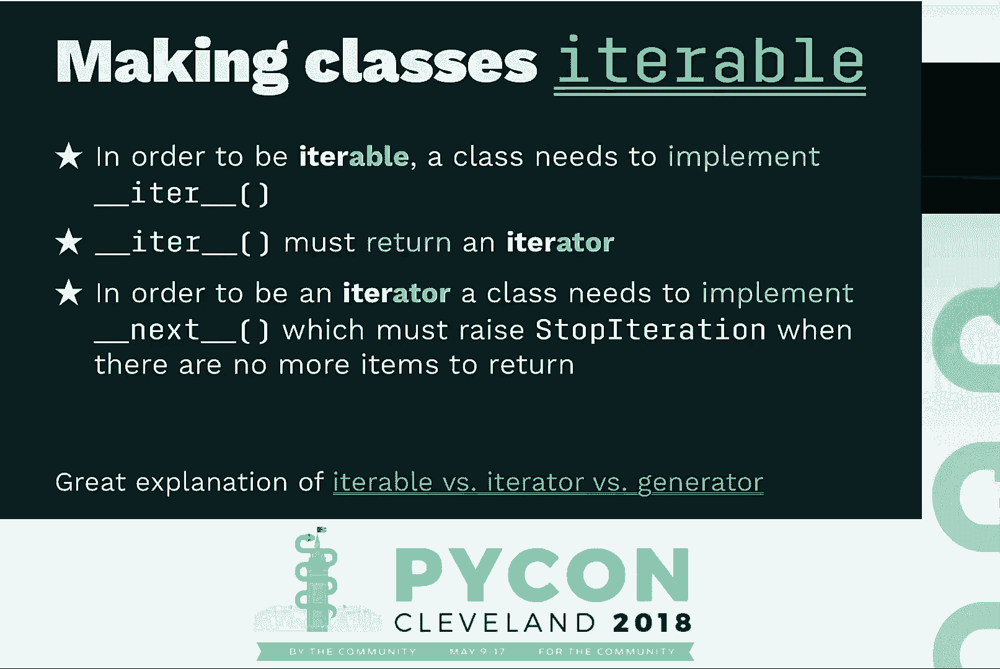

这里有一个场景。假设我们有一个服务器实例在不同的端口上运行服务。其中一些服务是活跃的，而一些则是非活跃的。我们希望能够循环遍历我们的服务器实例。但当我们这样做时，我们只想确保循环遍历活跃的服务。

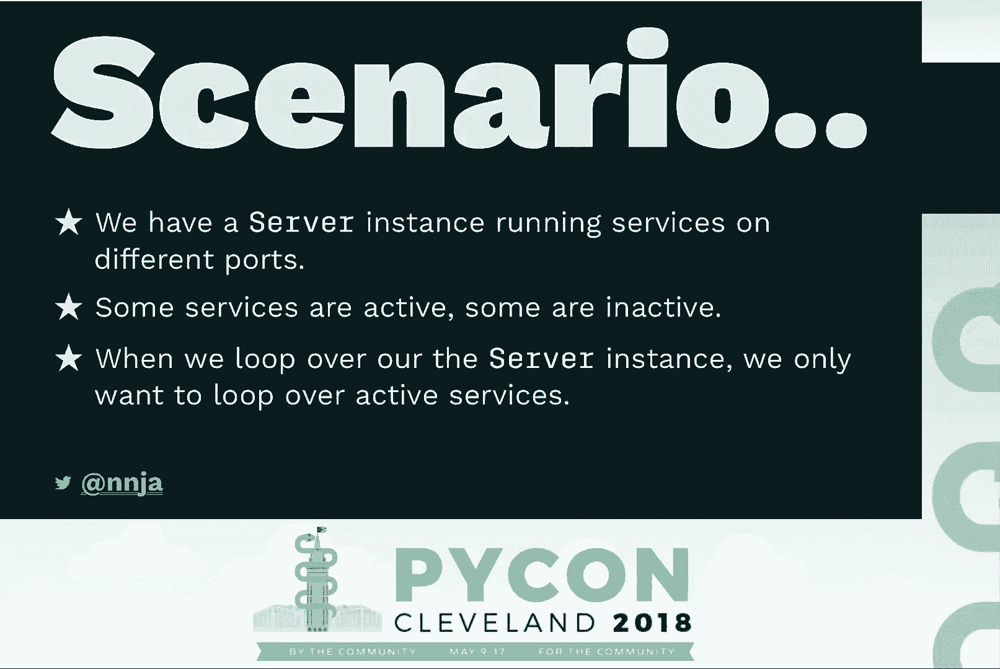

这是一个示例类。我们定义了一些服务。我们在 21 端口上运行 FTP，在 22 端口上运行 SSH，在 80 端口上运行 HTTP。其中一些服务是活跃的。在我的示例中，FTP 是一个非活跃服务。因此，为了使这个服务器可迭代，在我们的构造函数中，我们将初始化为当前的位置。当我们循环时。

我们将在幕后调用这个 dunder next 方法。我们继续通过服务列表。如果是活跃的，我们返回它。如果不是，我们跳过。如果我们维护我们的状态，我们就知道在服务列表中的位置。当所有服务完成且没有更多服务时，我们引发 stop iteration 异常。

注意这是一个迭代器，因为它实现了 dunder iter。在这种情况下，我们可以返回 self，因为这个类也实现了 dunder next。请记住，dunder iter 实际上是在我们第一次开始迭代时被调用的，而在我们第一次调用 next 之前。所以如果我们在 for 循环或推导中循环遍历这个可迭代的服务器。

该初始化是在幕后发生的。如果需要，我们还可以手动使用内置的 iter 获取迭代器。现在我们可以这样做。我们可以直接循环遍历我们可迭代的服务器中的协议和端口并将其打印出来。这个循环服务器是我们所有活跃的服务。非常酷。但如果你。

如果你的迭代器不需要维护大量状态，就像在我们的例子中那样。

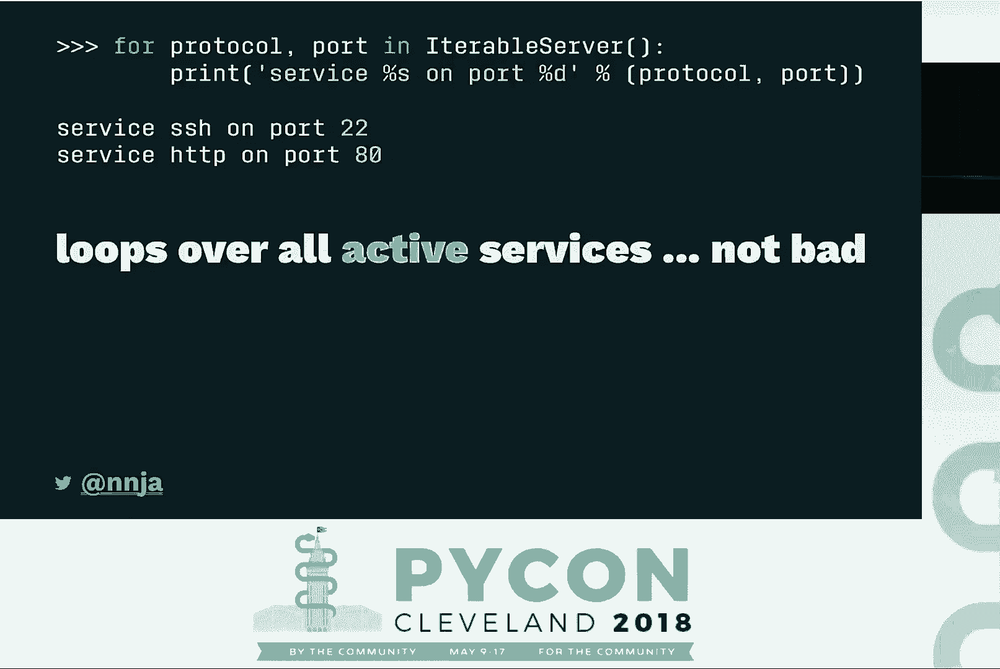

通常，我会说大多数时候使用生成器更好。

这里我们有一个新的双下划线迭代器方法的实现。请注意，我们并没有显式地维护一个位置。这是因为我们的生成器，作为一个迭代器，并不知道它在过去的位置。它只知道如何继续向未来前进。因此，我们只是循环遍历我们的服务。

我们在检查那个服务是否活跃。然后我们做一些特别的事情。我们将 yield 该服务的名称、协议和端口。yield 究竟是什么？

嗯，yield 就像一种返回。我们稍后会更详细地讨论。但现在你需要知道的是，在 yield 之后，我们仍然保持某种隐式状态。当我们在 yield 之后回来时，我们就会继续我们停下的地方。这意味着我们不需要维护很多状态，比如我们的当前位置。

这是隐式为我们完成的。

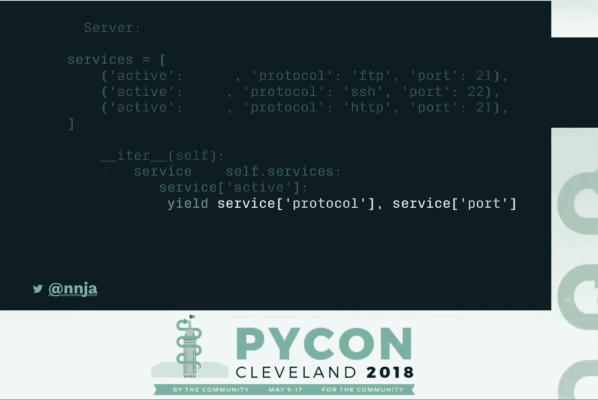

快速回顾一下为什么这能工作。从技术上讲，当你使用单个括号创建生成器表达式时，适当的名称是生成器表达式。但我更喜欢生成器理解，这对我来说更有意义。所以我正在创建一个非常非常简单的生成器。

我只是在一个范围内获取一个数字。如果我检查我创建的变量 my gen，我会发现它是一个生成器。

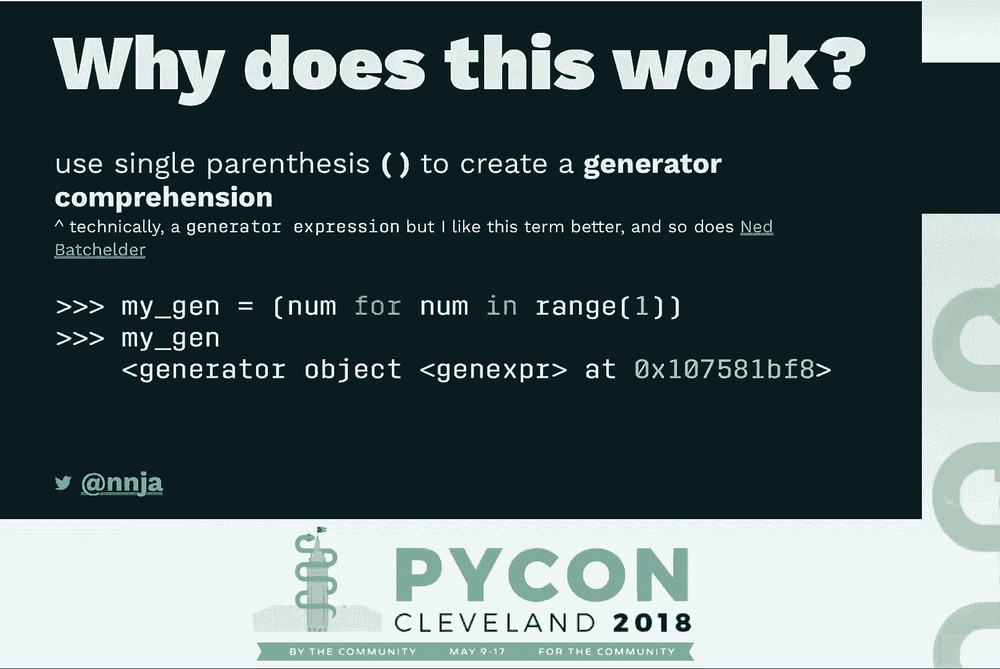

表达式。请记住，迭代器必须实现双下划线 next。如果我调用内置的 next，它在我的生成器内部映射到双下划线 next，我得到的值就是零。如果我再次尝试调用 next，我将遇到停止迭代异常。请记住，当没有更多元素时，我们的迭代器必须引发停止迭代。

这真的很酷。我们可以用更少的代码实现迭代器，而且我们不需要浪费时间或资源去维护状态。因此，这是一种非常快速且简单的方法来实现所需的迭代。

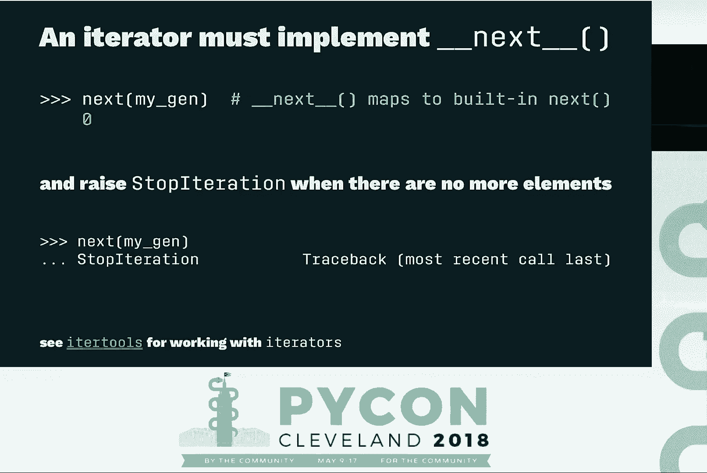

让我们稍微了解一下方法魔法。

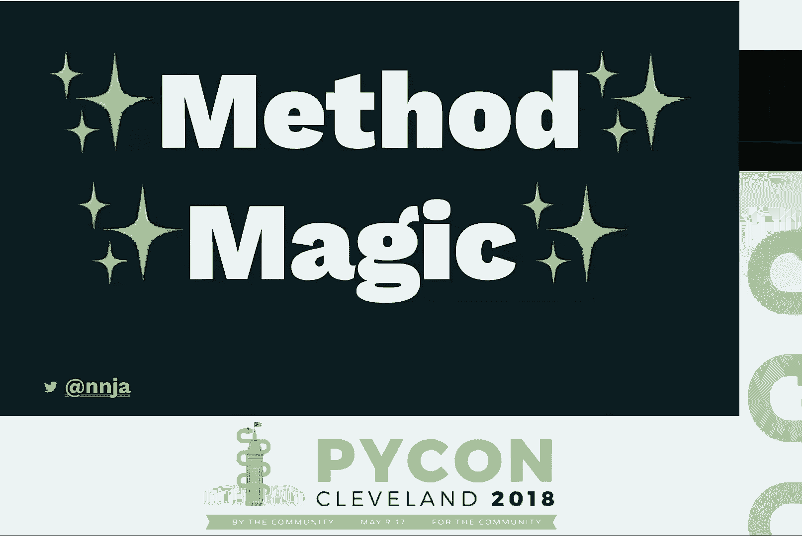

我们可以很容易地为方法创建别名。我们只需将它们赋值给一个变量。在这种情况下，我将双下划线 add 方法赋值给一个名为 concat 的新变量。现在我可以像使用双下划线 add 一样使用它，因为方法只是对象。因此，我之前在内部使用的是加号。现在我重新命名了我的方法。

我也可以调用 concat。当我询问 Python 这两个值是否相等时，我得到一个 true。稍后我会聊聊这点为什么重要。但接下来，我要给你展示更多的魔法。获取加法器。所以在这个例子中，我定义了一个非常简单的狗类。它有一个叫做 speak 的方法。

当我在我的狗实例上调用 speak 时，它会发出“汪汪”的声音。我可以使用一个名为 get adder 的内置方法，该方法接受一个对象、一个名称，并注意那个名称必须是字符串，并且如果我想提供一个，默认值也是可选的。所以如果我在我的狗实例上调用 get adder。

我有一个--并传入字符串的值--抱歉，作为字符串说。我会看到我有一个绑定方法。现在我可以继续--如果我将该方法保存到一个变量中。我可以像调用任何方法一样调用它。因此，通过使用 get adder，我们得到了那个 speak 属性。如果 speak 不在那个实例上，因为我没有提供默认值，我就会。

遇到了属性错误。为了避免异常，你可以尝试提供一个默认值。这是我们可能如何使用类似的东西的示例。我这里写了一个最小的命令行工具，可以接受动态命令。因此，我定义了一个操作类，并在其上定义了一些方法。

我有一个叫 say hi 的方法，它打印出 hello 和一个名字作为参数。我还有一个方法 say bye，它打印出 goodbye 和传入的参数。我还定义了一个默认方法，它会打印出这个操作不被支持。如果你看看主要方法，我在做什么？

我正在创建我的操作类的新实例。假设我在其中有一些错误处理，那可能是一个不错的补充。接下来，我抓取用户输入，并将其分成一个命令和一个参数。最后，我用我的三个参数调用 get adder。第一个是操作类的实例。

第二个是我从用户输入中提取的命令。第三个是一个默认值。最后，我用一个参数调用那个方法。在这种情况下，我将提供一个名字。让我们检查一下运行我这个小演示脚本的输出。如果我说 hi 和 Nina，我得到了预期的输出，hello Nina。如果我只是尝试输入一些垃圾。

我会收到一条错误消息，说明此操作不受支持，我可以随时处理。这很酷。接下来，我想谈谈 funktools.partial。它接受三个参数，函数。在这种情况下，我将其缩写为 funk，一些参数和一些关键字参数。

这个方法返回一个新的部分对象，其行为类似于 funk，但使用那些参数和关键字参数进行调用。如果传入任何附加参数，它们会被附加到 args 中。如果传入任何附加关键字参数，它们将扩展并覆盖 quarks。让我们看看这是如何工作的。

如果我将一个二进制数作为字符串传递给内置的 int 函数，并指定基数，在这种情况下是二，表示它是一个二进制数，我们将得到该值，以十进制形式返回。假设我想能够在任何二进制数上调用这个函数，而不必总是指定基数。我可以用部分功能做到这一点。我导入我的 funktools.partial。

抱歉，来自 funktools 的 import partial。然后我创建了一个名为 base two 的新 partial。我传递的函数是一个整数，而我传递的关键字参数是 base two。如果我检查这个对象，我会看到它是一个 funktools.partial 对象。那我可以用它做什么？我可以在任何二进制数字上调用 base two 和那个参数。

base 等于现在是隐式的，我得到了一个十进制的值。

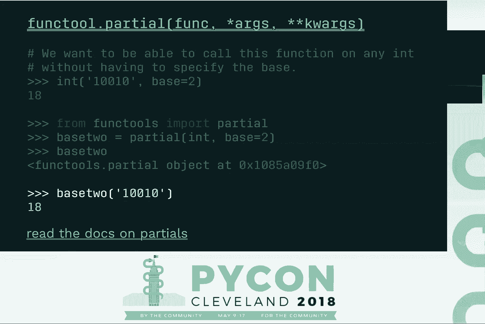

我们谈到了许多魔法方法和方法魔法。让我们看看这些东西是如何运作的，以及它是如何适用于我们的。有一个我非常喜欢的库，不幸的是名字非常糟糕。它正在寻找新的维护者，后来被 Mozilla 采用了。所以谢谢你，Mozilla。

这个叫做 GitHub，实际上和 GitHub 没有太大关系。它是一个具有透明语法的 REST API 客户端，并且促进了在任何 REST API 上的快速原型制作，而不仅仅是 GitHub 的。它大约用 400 行代码实现。你可以用大约 30 行代码为任何 REST API 添加支持，项目在 GitHub。

它了解关于协议、REST、HTTP 等所需的一切。

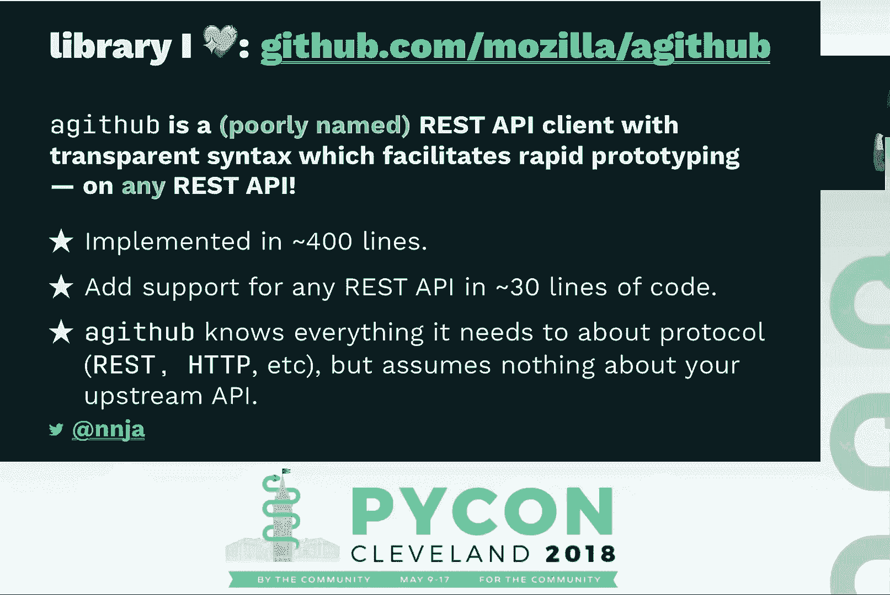

但它对上游 API 并没有假设。在这里我们定义了一个端点 URL 和其他连接属性。这是一段相当多的代码，但让我们关注重要的部分，类名是 GitHub。我们期望一个 API 令牌，这将是我们的 GitHub API 令牌，以及提供的 API URL 为 api.github.com。在我们定义这个端点和其他连接属性之后。

我们可以开始使用 API。我已经创建了之前展示的那个类的新实例。我提供了一个令牌，我的 GitHub API 令牌，抱歉今天不能与大家分享，但你们需要想象一下。我得到了一个状态和一些数据。我称这个实例为 gh.user.repos.get。它实际上映射的是 API 中的 /user/repos 的 get 方法。

github.com。这就是我需要做的所有设置。但如果我们尝试提供一个不存在的路径，我们只会得到一个 404。所以 gh.path.doesn't exist.get 404。因为请记住，你需要正确拼写。如果 URL 不存在或其他任何事情出错，就没有任何验证。

API 抛出的错误将被直接返回。好的，魔法。这是如何工作的？

每次调用 API 类都会转发到一个不完整的请求。我们可以用两种不同的格式使用它。一种是方括号格式，因为我们在这里实现了 get adder。我们也将 get item 别名为 get adder。这使我们能够使用点语法。首先，我们检查它是否是 URL。如果是，我们就继续追加到路径。

如果不是，我们要做的是检查那个值是否是一个 HTML HTTP 方法。如果它在我们预定义的 HTTP 方法列表中。如果是，就进入客户端类。你会看到一旦我们到达这个示例中的某个关键字，即`get`，我们将实际调用 API，使用我们现在构建的 URL。

这使用了一个部分方法。所以我们返回一个部分与我们构建的 HTTP 方法和 URL。我觉得这个库非常酷。值得查看一下源代码，看看它是如何编写的。我在原型设计时总是使用它。接下来，我们来谈谈上下文管理器。你什么时候应该使用它？如果你想在操作之前或之后执行一个操作。

常见场景包括在完成后关闭资源，比如文件或网络连接，在函数调用前后执行一些清理。一个例子是特性标志。它可以轻松地切换你的应用程序中的某个特性。例如，如果你想进行 A/B 测试，向一些用户展示蓝色的结账按钮。

你的用户看到红色的结账按钮，或者其他人看到蓝色的按钮，看看哪个选项能让你转化更多用户，或者进行滚动发布。如果你想测试你的代码对 5%的用户的影响，看看它是否影响你的资源，或者让你的网站变得缓慢，或者像向选择参与的用户展示测试版本那样。

一个测试计划。在这里我有一个非常简单的特性标志类。我只有一个特性。那么 beta，我是否想显示我主页的测试版本？我们有两个方法。`is_on`会返回 true 或 false，表示该特性是否开启，还有一个`toggle`方法，可以让我设置该标志的值是开启还是关闭。当我测试这些标志时，如何临时开启和关闭它们？

我想要的是像这样的上下文管理器，它只在我提供的上下文中启用那个特性标志，并在退出该上下文时将特性标志恢复到之前的设置。

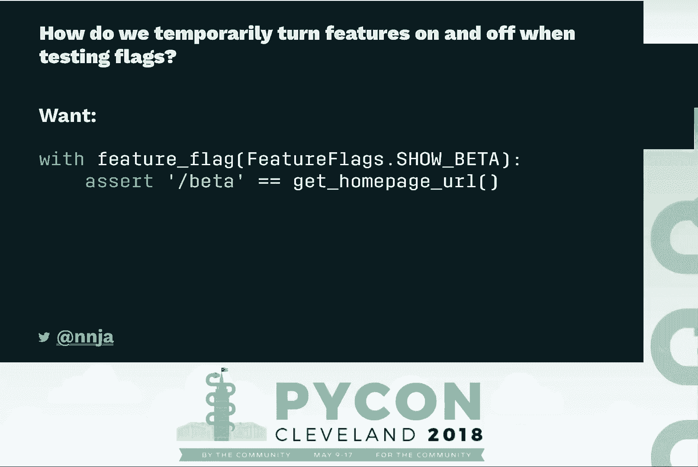

我们可以通过魔法方法`__enter__`和`__exit__`来做到这一点。在我们的构造函数中，我们保存旧值，无论那个特性标志是什么，这样我们就可以稍后将其设置回去。在`__enter__`中，我们将切换该标志为开启，在`__exit__`中我们将。

进行清理并将其设置回旧值。更好的做法是使用上下文管理器装饰器。你从`contextlib`导入，然后将那个装饰器应用到任何函数上。它允许你定义该工厂函数以用于`with`语句，而无需创建一个具有`__enter__`和`__exit__`方法的单独类。

我们在中间所做的，首先是实现`dunder enter`的行为。所以开启那个功能。然后我们使用`yield`，我稍后会回到这一点。我们从那个`yield`返回后，将该功能切换回之前的值，进行清理。让我们再回到`yield`，这里发生了什么？

`Yield`暂时放弃控制。你在方法运行之前做你需要做的事情。然后将控制权交给正在使用的方法。一旦该方法完成，`yield`就结束，我们重新进入我们的上下文管理器，以便运行我们希望在退出时运行的清理代码。

使用这两种实现方式，我们可以使用上下文管理器，让我们的测试保持状态，与它们发现的状态相同。如果我们仅仅开启和关闭这些功能标志，可能会导致我们测试中的问题。为了更好地解释如何做到这一点，我想谈谈装饰器。简单的解释是，它们是一种语法糖，允许对某些内容进行修改。

一个基础函数。装饰器将一个函数包装在另一个函数中，然后它们执行某些操作。它们可以在调用之前或调用之后，处理提供的参数，或者修改它们。

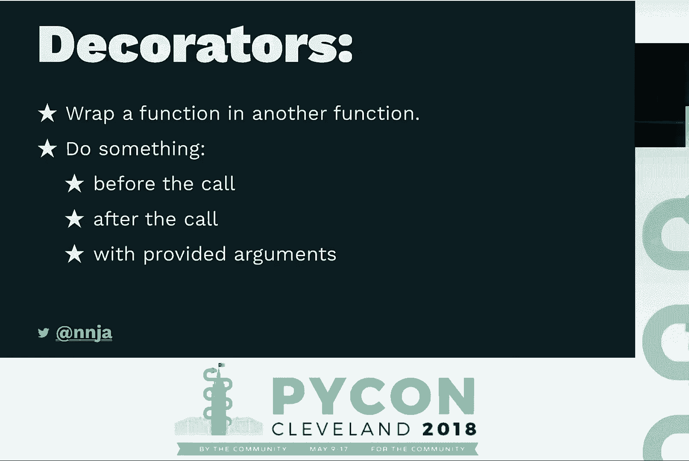

返回值或以某种方式处理参数。我在这里定义了一个用户类，它有一个`is_authenticated`的标志和一个构造函数，接受一个名称并设置一个值。我们有一个小型网络应用程序，包含这些用户，我们想为他们展示页面。

但是如果一个未认证的用户试图访问仅限登录用户的数据，我们想抛出一个异常。我们这里有一个个人资料页面的方法，我们检查该用户是否未认证。

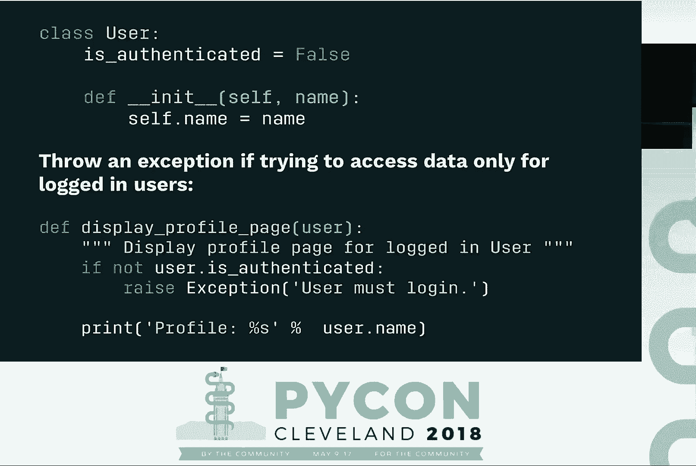

抛出一个异常。但我们可以使用装饰器来消除一些代码重复。在这里，我写了一个叫做`enforce authentication`的方法，这个方法有点有趣。它包含了另一个方法，叫做`wrapper`。而`enforce authentication`接受一个函数作为参数，而我们的`wrapper`函数。

接受一个参数，该参数是一个用户。那个内部函数返回它。传递给内部函数的参数被调用，然后在外部上下文中我们返回一个包装器。但这一开始可能有点混乱，但看看重要的逻辑。

在中间。如果用户未认证，则我们抛出一个异常。与我们之前的代码相同。

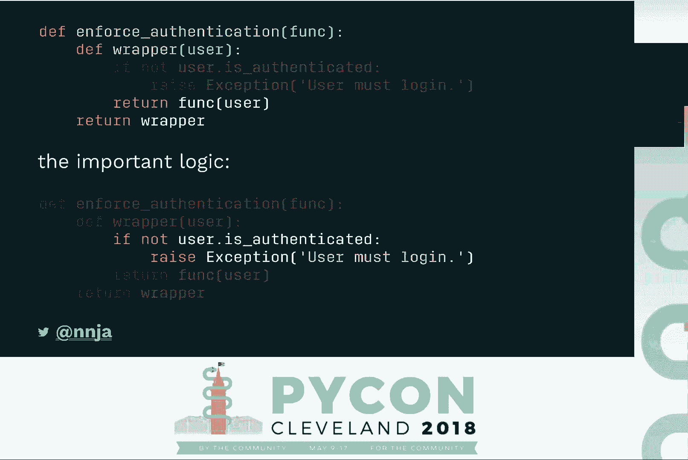

我们可以以几种不同的方式使用它。我们可以不使用装饰器。我们可以直接调用`enforce authentication`与一个函数，即`display profile page`。然后传入用户的实例，作为参数。或者我们可以使用语法糖，使用`@`符号作为装饰器。

所以我们在任何需要强制身份验证的页面上添加`@enforceauthentication`。如果未经身份验证的用户尝试调用该页面，现在就会抛出异常。你不需要在代码中到处放置复制粘贴的东西。

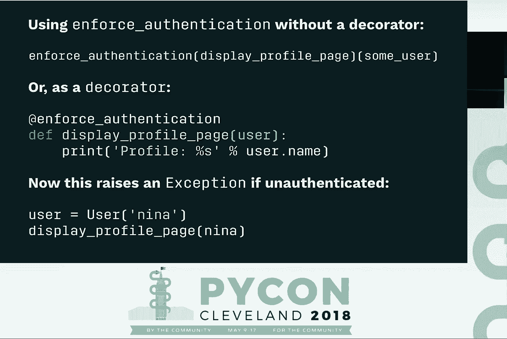

关于装饰器，有一个快速的事情是你可能会遇到上下文丢失的问题。例如，现在我们的装饰函数没有正确的名称，也没有我们为其定义的文档字符串。如果你遇到这个问题，可以查找如何使用`contextlib.wraps`。这真的很简单。在装饰器的用例中，有日志记录和计时等。

验证、速率限制、模拟和修补，还有一个很酷的功能叫做上下文装饰器。这是一个上下文管理器和装饰器的结合。从 Python 3.2 起它就在标准库中，使用它们你可以轻松编写可以同时作为装饰器和上下文管理器使用的类，并且上下文装饰器已经被上下文管理器使用。

所以你自动获得该功能，完全免费。对于我们之前的上下文管理器，代码几乎是一样的。我们在进入上下文管理器之前保存了特性标志的值，然后。

我们生成然后再将其设置回原来的样子。在使用该装饰器时，我们可以将其用作上下文管理器，或者在这种情况下通过将其添加到我们的获取配置文件页面函数中来用作装饰器，并进行传递。

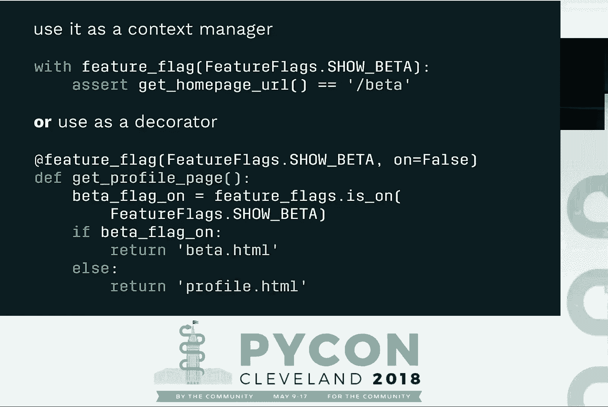

在这些参数中。我喜欢的一个很好地使用这个特性的库叫做 freeze gun。它可以让你的 Python 测试穿越时间，你可以在第一个示例中将其用作上下文管理器。因此，在测试的某一部分，你想要日期和时间为这个特定日期。一旦你退出上下文管理器。

你的日期可以恢复到原来的样子，或者你可以将其用作装饰器，只需在整个函数中使用该装饰器来冻结时间。有空时请阅读源代码。这真的让人脑洞大开。

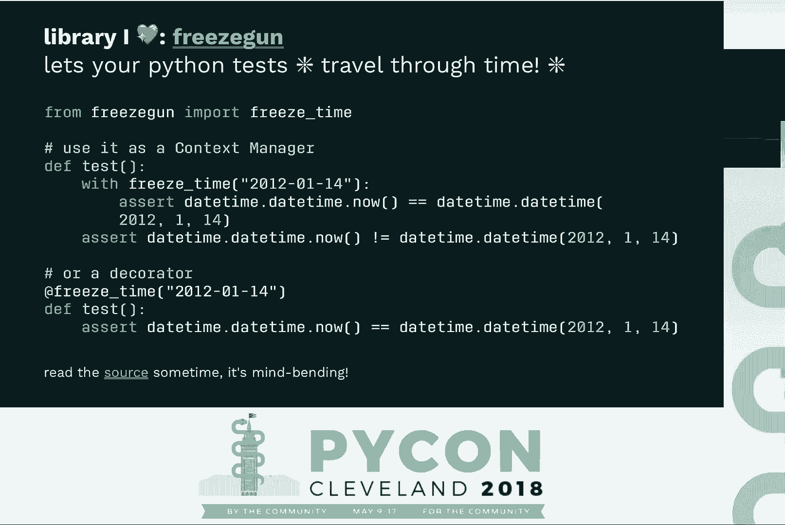

最后，我想非常简要地谈谈命名元组。我不打算深入实现，但我想给你展示两个我觉得有用的命名元组的特性。命名元组是一种轻量级的数据表示。你可以使用命名字段创建元组子类。

因此，这比完全重量级对象快得多。

这是来自活跃状态的一个快速示例。我们有一个名为缓存信息的命名元组，它包含一些随机信息。缓存命中次数、未命中次数、最大大小等等。我们可以给这些命名元组默认值。在这个例子中，我有一个路由表，并且我保存了一些值，比如前缀、队列名称和等待时间。

我们可以用两种不同的方式设置默认值。 第一种是通过在双下划线 new 上指定双下划线默认值。 所以在第一个案例中，我始终为所有实例指定一个默认的等待时间 20 秒。 这个命名元组可以被覆盖，如果我需要的话。 在第二个实例中，我使用下划线 replace 自定义一个原型。

所以通过调用下划线 replace 并传入用户前缀的默认值和用户队列名称的默认值，这是为我的命名元组指定默认值的另一种方式。

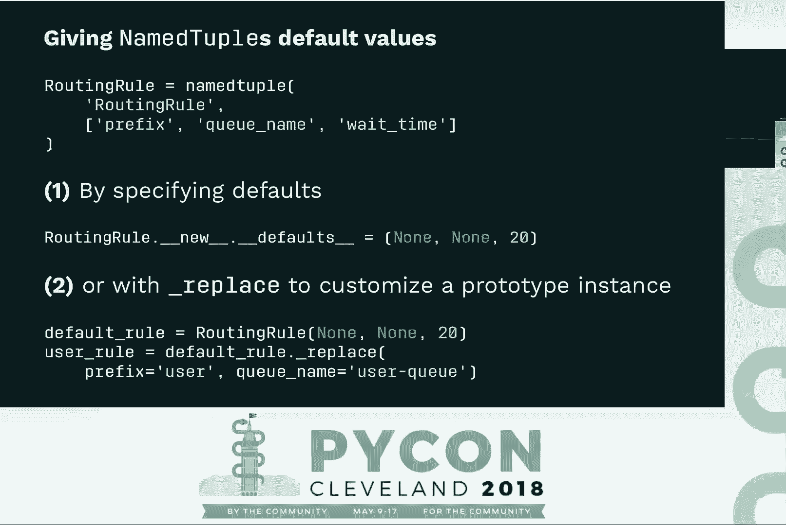

最后，命名元组也可以被子类化和扩展。 如果你看到这里我定义了我的类 person，我在扩展一个命名元组，现在如果我想在这个示例中提供其他更复杂的等待方法，比如双下划线 ster，也是可以的。 所以你得到了很多新的工具。 我们了解了魔法方法。

让你的对象像内置类型那样工作，比如数字、列表、字典等。 我们学习了一些方法魔法，比如别名、获取添加器、上下文管理器。 用于管理资源的装饰器，执行调用前或调用后的操作，修改返回值，验证参数。 我们了解了上下文装饰器。

这包括上下文管理器和装饰器。 迭代器、生成器，循环遍历你的对象。 我们了解了 yield 关键字及其作用。 最后，我们还涉及了命名元组。 我很欣赏的一句话是，完美不是在于无可再去或无可再加，而是当没有任何东西可以去除时。

所以少即是多，优雅的代码可以是诗意的。 从 Stack Overflow 复制和粘贴或者随机坚持你所学的编程语言范式可能很容易，但要抵制这种冲动。 如果你深入探讨 Python，它会真正开启你新的见解。

因为你想成为一个优雅的 Pythonista。 我们是个不错的社群。 你想使用今天学到的工具来入门。 并记住，强大的能力伴随重大的责任。 所以要非常谨慎地使用它们。 如果你在一个类的每个函数上使用装饰器，我们认为你的方法。

考虑重构。 简单更好。 选择合适的工具来完成工作是你的责任。 谢谢。 [掌声]。
