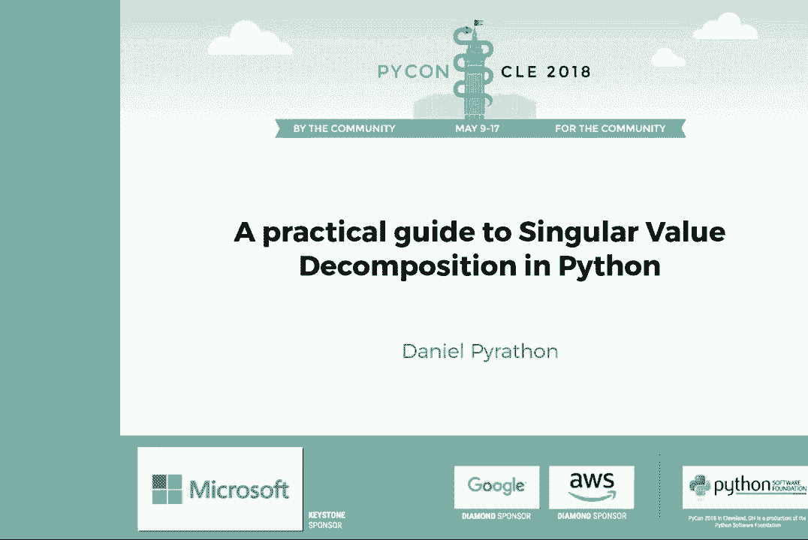
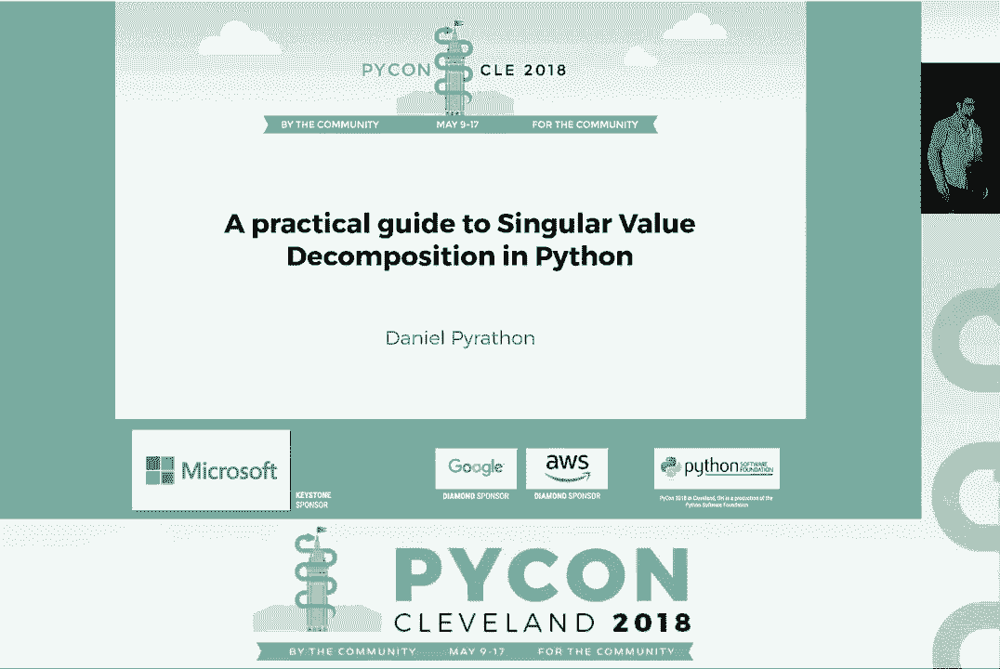
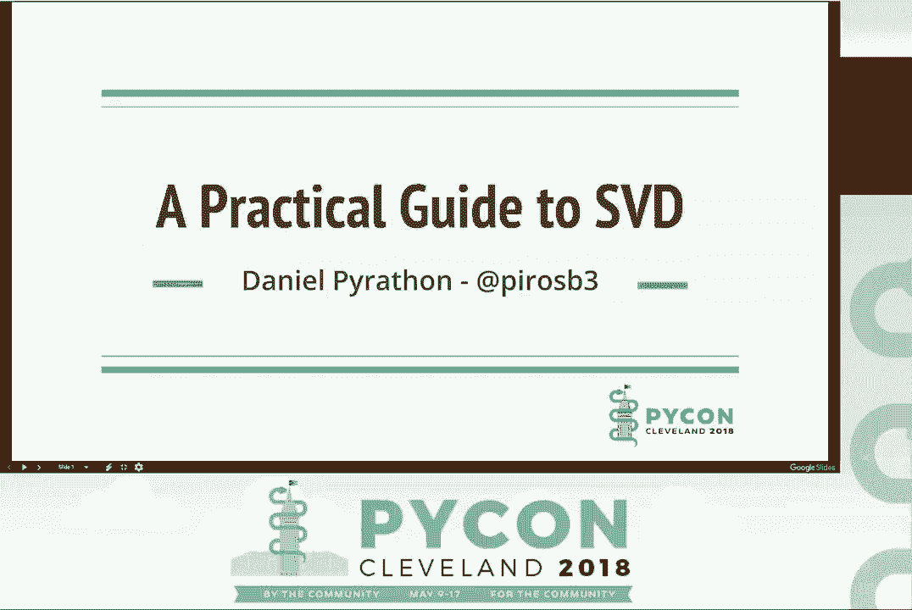
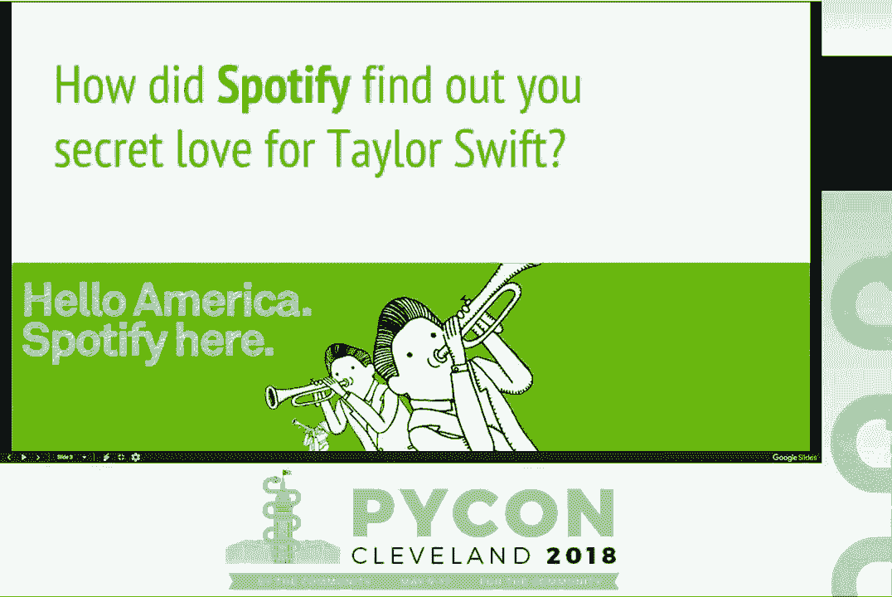
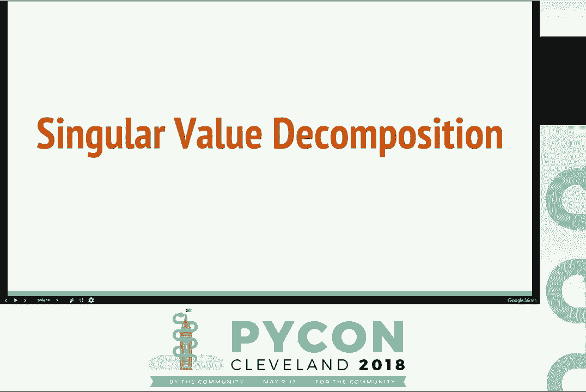
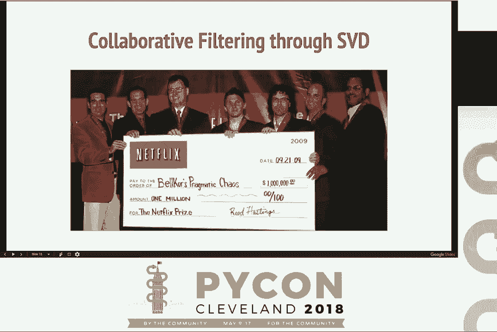
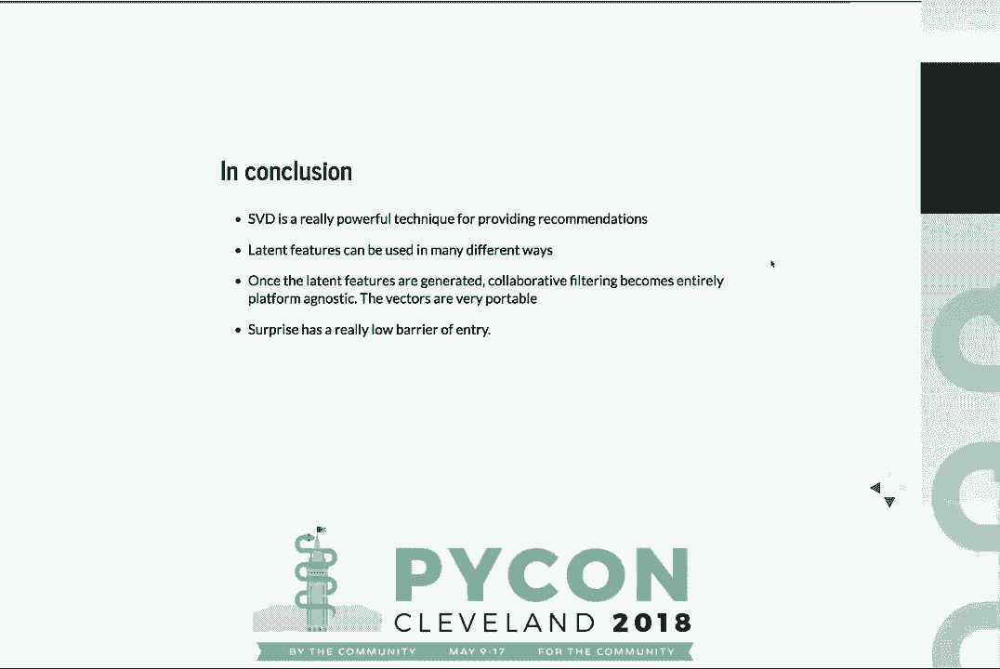
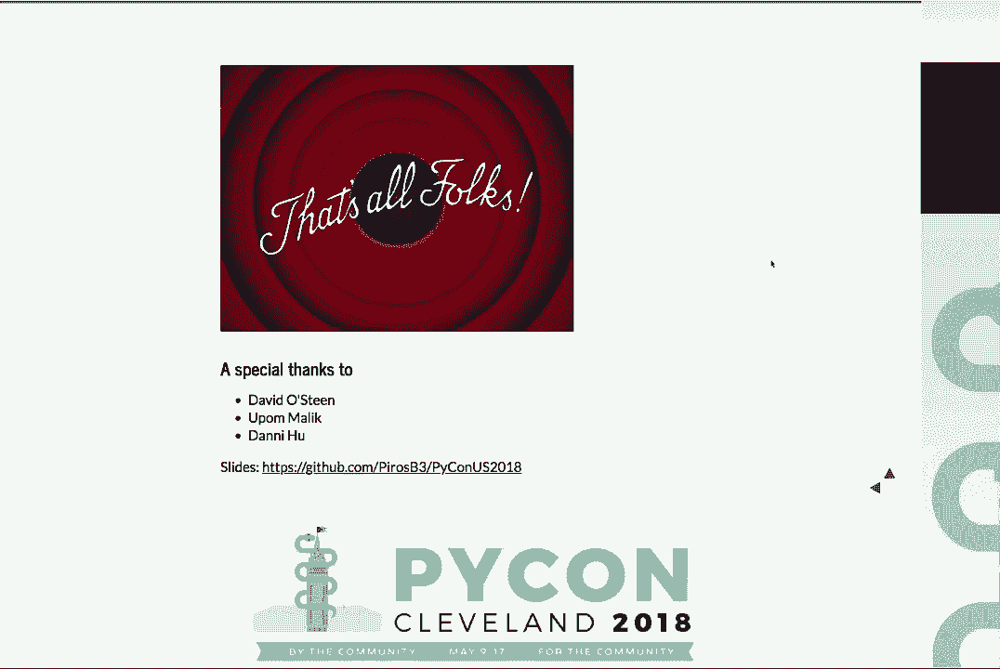

# P3：Daniel Pyrathon - Python 中奇异值分解的实用指南 - - 哒哒哒儿尔 - BV1Ms411H7Hn

>> 大家好。欢迎参加关于奇异值分解的实用指南的演讲。

在 Python 中。请欢迎 Daniel，他是 Pi Bay 的组织者，一场区域 Python 大会。

在湾区。好的。[掌声]，你好。感谢你的到来。今天我想讨论两个主要内容。首先，我想介绍在推荐系统中 SVD 的重要性。然后，第二个内容显然是，我们如何用 Python 来实现 SVD？但在开始之前，让。

我问你两个问题。你有没有想过为什么你会狂看 Netflix？或者，也许？怎么。

Spotify 是如何发现对 Taylor Swift 的秘密热爱的？实际上，这些服务如 Spotify 和 Netflix 之所以如此亲密，是因为某种原因。

所以，这样的个性化。为什么会这样？答案就是推荐。让我告诉你为什么我在这里。所以我在一家名为 Coffee Meets Bagel 的在线约会公司工作。谁知道 Coffee Meets Bagel？嘿，对吧。太棒了。希望你没有糟糕的经历。这是一个很好的约会应用程序。所以，我最近从传统的软件工程角色转变过来。

转向机器学习工程师的角色。最重要的是，我在几乎没有科学背景的情况下做到这一点。我知道你们在想什么。这真是个糟糕的主意。但是，今天。我想告诉你的是，我想展示的是 Python 如何真正帮助我学习，并让我跟上我们在 Coffee Meets Bagel 运行的一些学习算法。

最重要的是，这些算法有很多更容易理解和逻辑性。当你查看用 Python 实现的源代码时。今天，我想给你展示一个这样的例子。所以在我们开始之前，我想确保我们在同一页上。什么是推荐引擎？你们中很多人可能还没有。

听说过推荐引擎的人可能听说过搜索引擎。搜索引擎。可以把这些看作是黑匣子，你输入一些参数就会得到一些搜索结果。推荐引擎与搜索引擎类似，但它们是个性化的。就像在你的应用程序中为每个用户有一个搜索引擎。

搜索引擎的好处是什么？因为它们为每个用户提供个性化服务。在你的应用程序中，它们提供更个性化的结果。它们提供那些我们之前提到的亲密结果。但最重要的是，它们随着时间的推移不断学习。当你的用户探索应用程序时，当你的用户与项目和资源互动时。

在你的应用中，推荐引擎会学习并提供更好的结果。再次说明，有许多好处。我想指出两个，第一个是参与度。如果使用推荐引擎，参与度会大幅提升，相较于传统搜索引擎。第二个也是推荐的多样性。

如果用户在你的应用中被个人化对待，他们所获得的结果的参与度和多样性都会显著提升。如果这还不够，我们来看一些统计数据。亚马逊的 35%收入实际上是通过某种程度的推荐引擎生成的。Netflix 有超过 75%的电影实际上是基于。

关于推荐，这是非常重要的。因此，今天我想做的是只覆盖推荐引擎的一部分。实际上，这是一个非常大的话题。我想讨论的是一种执行推荐的常见策略，称为协同过滤。要理解协同过滤。

我们首先需要关注组成协同过滤的三个主要成分：用户、评分和产品。用户实际上是你系统中的参与者。他们对产品进行评分，你可以将用户视为博客的读者，或在线杂货店的顾客。实际上，我们大多数人假设在某个应用中都是用户。

用户对产品进行评分，这张幻灯片的最右侧。产品再次是非常特定于领域的。在 Spotify 的情况下，它们可以是歌曲；在 Netflix 的情况下，它们可能是电影。评分是连接用户和产品的粘合剂。实际上，可以将评分视为一个数字，以某种方式量化用户与产品之间的互动程度。

这个数字可以是非常细致的，比如说四分之五，或者可以简单地说是点赞或点踩。选择权在于你作为开发者。为了简单起见，这些幻灯片中我将只专注于电影作为产品。从现在开始，我们只会讨论电影。但请记住。

产品可以是你想要的任何东西。那么，让我们来回答这个问题：什么是协同过滤？实际上，协同过滤是一种通过利用与您相似的用户的现有评分来提供推荐的方法。理解它的最好方式就是看右侧的这个矩阵。

这是一个用户到电影的矩阵，每一行都是一个独特的用户，每一列都是一个独特的电影。单元格中的内容表示该用户对该电影的评分。因此，可以看到有两个主要的评分，点赞表示购买电影，而点踩可能表示“喜欢”，你知道的。

给电影回报或者不喜欢这部电影。这就是我们的迷你 Netflix，对吧？

我们只有五个用户和四部电影，所以这非常有限。假设我们的用户五在迷你 Netflix 上登录。迷你 Netflix 询问我们的协同过滤引擎，能否为蓝色电影提供推荐？那么，我们该如何做到呢？

协同过滤的第一步是找到与用户五相似的用户，他们也对蓝色电影进行了评分。让我们来看一个例子。因此，用户二和用户五都积极评价了绿色电影，而对红色电影和橙色电影的评价则是负面的。用户免费和用户五都积极评价了红色电影。

积极评价绿色电影的用户二和用户免费也对蓝色电影进行了评分，而我们正是试图预测这一点。那么，让我问一下，是否有勇敢的人愿意回答这个问题。用户五对蓝色电影会有什么看法？哇。好吧。太棒了。是的，答案正确。所以你可以看到，我们利用了现有用户的信息。

为了生成这个推荐，对吧？我们协作找到了答案。所以，我想再深入一步。提供协同过滤的方法有很多。今天，我将专注于一种特定的方法。另一种值分解。这是目前行业中最著名的协同过滤算法之一。

这个算法在行业中被广泛采用。实际上，许多公司都在使用它。像 Spotify 这样的公司也曾讨论过他们的实现，它非常可扩展。为了展示这个算法的广泛使用，这是来自 Netflix 奖的一张图片。

这个比赛是由 Netflix 在 2009 年创建的。这是一个开放的比赛，基本上召集了全世界的工程师和研究人员，试图提升 Netflix 的推荐引擎。这个比赛的获胜者，也就是这些人，实际上使用了 SVD 算法的变种来提升 Netflix 的性能。

准确率提升了 10%。这可是巨大的。为了说明奖项，这些人获得了 100 万美元。使用 SVD。所以听听这个演讲。希望到现在为止，我已经试图说服你 SVD 是个很酷的东西。但为了理解 SVD 实际如何运作，最重要的事情我想向你解释。

SVD 如何预测这些新的推荐。实际上，SVD 是一种算法，它为我们的评分数据库中的每个用户和每部电影创建了所谓的潜在特征。

但为了理解什么是潜在特征，我们首先要理解什么是特征。只是为了确认。因此，在机器学习的上下文中，特征是我们作为科学家或工程师赋予或关联给用户和产品的元数据。例如，在 Netflix 的上下文中，我们会将什么属性与我们的用户关联起来？

也许是他们的年龄、所在地区或性别。那么电影呢？好吧，发行日期也许，导演在某种程度上是重要的，电影的时长。这些对于我们人类来说都是非常有信息量的特征。事实上，我们假设这个用户给这部美丽绿色电影的评分在某种程度上受到影响。

我们定义的这些特征。理解这一点的最佳方式可能是，如果你获得了过去 IMDB 的评分或类似的东西，并且实际上，你可以使用这些特征生成一些统计数据。例如，也许 20 多岁的男性比 40 多岁的男性对西部电影的评分更高。类似这样的统计数据。

所以我们所做的是生成这些特征，以便我们可以将它们输入某种学习算法，这样可以识别每一个特征的重要性或权重。但再说一次，这里有一个错误，那就是这些特征是由我们人类生成的。作为人类，我们只能定义那些在某种程度上是直接可观察的特征。

我们认为重要的东西，但大多数时候，有一组特征并不是直接可观察的，但在预测评分时更具影响力。事实上，有一类算法像 SVD，从无到有地学习，创造出这些我们称之为潜在特征的新特征，就像年龄、地区和性别。

这些特征并不是直接可观察的。我们不能指出第一个潜在特征识别的。我不知道，拥有金发眼睛的用户或类似的东西。我们无法做到这一点。但我们所知道的是，这些特征可以被使用，并且在用户与电影之间的推荐预测中是高度信息化的。因此，SVD 作为一种算法。

在这些数据集上运行并生成这些特征。那么这些特征看起来像什么？

抱歉关于这张图片，但它们非常模糊。实际上没有办法描述它们。这是我努力尝试描述这些特征的创造力。它们并不是你可以明确指出的东西。这些都是非常抽象的。但再说一次，我们可以在数据集中使用这些特征。那么现在让我们尝试真正理解这一点。

我们可以使用这些潜在特征吗？这些特征实际上是如何生成的？让我们从这里开始。所以，再次以我们的 Netflix，一个迷你 Netflix 的例子为例。这是一个迷你，迷你的 Netflix，甚至更小，对吧？我们以前有两个用户，但他们已经不再使用了。所以现在我们只有三个用户和四部电影。最重要的是，正如你在这里看到的，我不再使用点赞和点踩。

我实际上使用的是一个数字。记住，评分越高，相关性就越强。例如，在这里，用户二给红色电影的评分非常高，但给蓝色电影的评分非常低。因为四显然大于一。现在，让我们先把这个矩阵放在这里一秒钟。所以结果是有一种算法叫做矩阵分解，这个技术。

矩阵分解所做的就是获取一个大的矩阵，并从这个大矩阵中创建两个较小的矩阵。通过这种方式，我们可以将创建的两个矩阵在稍后的时刻重新组合成原始矩阵。这有点难以理解，但让我们尝试可视化一下。

好的。SVD 是一种实现算法，使用矩阵分解。因此，分解。这两个矩阵的方式是我们只保留最有信息的特征，即这两个矩阵中最重要的、最大的重要性特征。我们实际提取的特征数量是我们所要的。

开发者或科学家定义。我们告诉 SVD 我们想从这个数据集中提取多少个特征。所以假设我们想在这个矩阵上运行 SVD，并且我们只想输出两个特征。这看起来会是什么样的？正如你在这里看到的，每个用户都有这两个潜在特征，每部电影也有两个潜在特征。如果你相信我，

你可以获得这两个矩阵并重新相乘，你将得到一个近似值，即最接近那个中心矩阵的近似值。减去问号，这基本上意味着你实际上可以生成新的预测。那么，这些特征呢？它们为什么存在？我在这里只使用两个潜在特征，仅仅是为了说明。但是，在你的真实例子中，

你可能会想使用比这些更多的特征。你生成的潜在特征越多，你实际上从原始矩阵中提取的信息就越多。提取的潜在特征越多，你的 SVD 所需的计算成本就会越高。所以这是一个你将要描述的数字。那么现在，我们有这些潜在特征。我们可以用它们做什么？

好吧，今天我想展示如何使用这些潜在特征的两个用例。第一个是预测新的评分。实际上，一旦我们生成了这些潜在特征，我们可以预测任意用户和电影组合之间的评分。让我们举个例子。假设我们有用户一，我们想预测。

用户一会认为蓝色电影怎么样。因此，我们只需在用户一的潜在特征与蓝色电影的潜在特征之间执行点积。我们将用户一的潜在特征一与蓝色电影的潜在特征一相乘。然后将用户一的潜在特征二与蓝色电影的潜在特征二相加。

结果是 3.52。因此，根据这个例子，用户一会非常喜欢蓝色电影。让我们看看另一种使用这些向量的方式。这是我最喜欢的方式。实际上，一旦我们生成了这些潜在特征，我们就可以比较用户。

与其他用户和其他电影之间。我们实际上可以通过识别它们向量的相似性来找到两个用户或两个电影之间的相似性。测量相似性的方法有很多种。今天我将使用余弦相似度，它有效地测量这两个向量之间的角度，角度的余弦。因此在这个例子中。

你可能会说，如果用户 free 在口味上与用户一更接近，那么用户 free 与用户二的相似度就更低。这实际上意味着用户 free 更可能同意用户一的口味和评分，而不是用户二。因此，希望这会很有趣，但我现在想展示的是。

一个小演示。实际上，我们将使用一个名为 surprise SVD 的库来训练一个 SVD。这是一个非常好的库，非常简单易用。我们将下载并探索这个名为 movie lens 的数据集。一旦我们探索了这个数据集。

我们将使用非常少的步骤来训练一个 SVD。你今天回家后可以在自己的数据集上进行操作。最后，我之前向你展示的两种方式，通过重建结果生成推荐，执行用户与电影之间的点积以及电影之间的相似度，实际上我们正在。

我们将通过这个例子来做到这一点。让我们先谈谈电影 Lens。电影 Lens 是一个很棒的开源数据集。它相当有名，常用于许多竞赛。它包含了许多不同的评分，以及大量独特的电影和用户。我在这里构建了一个小函数，称为 load movie lens，它简单地将 CSV 文件转换为数据框。

创建一个评分数据框。如你所见，每一行都是一个评分，对吗？例如，如果你看第一行，这位用户 742 对《杰瑞·麦奎尔》的评分是 4。而且，评分的范围从 1 到 5，包括 1 和 5。正如你所见，这个数据框有三列。第一列是用户 ID。

第二列是电影标题。这些都是字符串。它们可以是你想要的任何内容。你的用户和你的产品中的项目可以是你想要的任何数据结构。重要的是评分必须是一个数字。对吗？记住，它需要是可量化的。那么我们如何通过四个简单步骤来训练一个 SVD 呢？第一步。

步骤显然是导入 surprise SVD。我们定义一个叫做 reader 的东西。reader 实际上是 surprise 内部的一个组件——它是一个类，定义了你评分的下限和上限。记住，你可以选择任何下限和上限。重要的是，你要事先定义好。

告诉 surprise。因此，在这种情况下，MovieLance 有很好的开源文档，它告诉我们评分范围从 1 到 5。所以这就是我将要定义的。第一步是我们初始化一个数据集实例。可以把数据集看作是一个加载器。实际上，它的作用是为执行 SVD 准备数据。数据。

设置接受两个参数。第一个是 MovieLance 数据集——我们之前定义的 MovieLance 数据框。记住，这需要是一个包含三个特定顺序的列的 pandas 数据框。用户 ID、产品 ID 和评分。这一点非常重要。第二个参数是 reader。现在，作为第一步。

我们想做的是保留一定数量的数据集用于后续的测试目的。今天，我实际上不会告诉你如何进行测试。但是，如果你下载我的笔记本，你会发现一些隐藏的幻灯片来执行这个操作。最后，我们期待已久的时刻是初始化一个新的 SVD 实例，并适配我们的数据集。

在这里，正如你所看到的，SVD 在其构造函数中接受一个参数，即因素的数量。这是我们想要使用的潜在特征的数量。记住，我在这里选择了 100 作为一个任意的数字。这个数字在我的例子中效果很好。但你可以选择任何你想要的数字，任何你觉得自信的数字。

我使用的数据集是电影镜头数据集，如果你仅仅使用好的子集。例如，在这个例子中，它将需要很少的时间来训练。这在计算上并不是很昂贵。因此，一旦我们训练完这个 SVD 实例，记住会发生什么，SVD 会创建这两个矩阵。

用户矩阵和电影矩阵。这些矩阵都有这些潜在特征。那么，这些矩阵现在在哪里呢？其实，运行 SVD 后，会在模型顶部生成一个叫做 QI 的属性。正如你所看到的，这个模型有 596 行和 100 列。那么，为什么会这样呢？因为有 596 部独特的电影。

在我们的评分中。现在每部电影都将拥有这 100 个潜在特征。所以，现在你可能会问——你可能想问，嗯——抱歉，有些奇怪的事情发生了。哦，好吧。所以，我们有所有这些潜在特征，但我们如何将每个向量映射回它的电影？好吧。结果证明有一个隐藏属性，叫做 raw to inner ID。

项目是一个字典。这个字典有效地将每个项目、每部电影映射到我们定义的方式，在这种情况下是字符串，映射到对应的潜在特征的行索引。所以，让我们举个例子。假设你想识别《玩具总动员》。我们要做的第一件事是索引——找到《玩具总动员》的行索引。

通过使用名称。然后一旦我们有了行索引，我们可以通过在该特定行索引 QI 矩阵来找到所有潜在特征。你将得到整个行的返回。在这个例子中将有 100 个潜在特征。所以，现在我们已经学会了如何训练 SVD。我们也学会了如何识别这些潜在特征的具体位置。

是隐藏的。所以，现在是时候给你展示两个很好的例子。第一个是预测用户和电影之间的新评分。这非常简单。作为复习，这是我们的电影镜头数据框的样子。我们的用户 ID 在这里定义为字符串：用户 4，3，7。而电影标题同样定义为字符串。所以，惊喜。

SVD 让事情变得简单。这里有一个预测 API。这个预测 API 接受两个参数：用户和电影。输出将是一个预测对象，里面有一个 EST 属性，它将有效地告诉你预测的评分。在这种情况下，EST 是 4，这意味着相当高。对吧？

所以，我的意思是，每个人都喜欢《玩具总动员》，但这个用户尤其如此。现在，我们都期待的时刻到了。通过比较项目来推荐。这在我看来是最有趣的部分。所以，记住，作为复习，当两个电影、两个产品的余弦距离尽可能接近零时，它们是相似的。我们要做的是。

来获取免费的电影向量。第一个是原版《星球大战》。第二个是《绝地归来》。第三个是《阿拉丁》。首先，我将测量《星球大战》向量和《绝地归来》向量之间的距离。如你所见，距离是 0.26。哦，抱歉，0.29。假设我想在这之间执行相同的距离计算。

《星球大战》和《阿拉丁》。好吧，我们的距离是 0.85。所以，这有效地意味着原版《星球大战》与《绝地归来》的相似度要远高于《星球大战》与《阿拉丁》的相似度。而且我记得这些是在没有任何信息的情况下生成的，没有原始特征的任何元数据。没有导演的概念。

没有类型的概念。什么都没有。仅仅通过评分。那么，现在，如果我们想通过执行排名找到类似的电影呢？对吧？实际上，我们可以构建一个小函数，它接受一个电影标题，并生成该电影标题与我们系统中所有其他电影之间的相似度，然后。

按相似度对电影进行排名。这看起来会是什么样子？假设我想为《星球大战》生成相似度。第一个结果，显然是《星球大战》因为它是自己。《帝国反击战》，《绝地归来》，《夺宝奇兵》。这些令人震惊，这些是令人震惊的准确。请记住，根本没有关于潜在相同导演的信息。

或同一系列或任何其他。让我们看看《低俗小说》。好吧。爱德华，《猜火车》。来自 Dustholdon。因此，这实际上也在评分的概念中显示出来，也许你有喜欢《低俗小说》的用户，如果他们喜欢《低俗小说》，那么，为什么不看看这些电影呢？因为它们非常相似，人们评分。

以相同的方式推荐给他们。这也是向用户提供推荐的另一种方式。因此，总之，SPD 是提供这些推荐的一种非常强大的技术。一旦你生成这些潜在特征，你可以用多种方式使用它们。你甚至可以将它们用作你分类算法的特征。而且最重要的是，如果。

你想了解 SVD，但没有科学背景，真的可以试试这些库，因为 Python 让你入门的门槛非常低，你可以真正以工程师的身份深入了解这些东西是如何工作的。这就是全部。谢谢你。

很多。[掌声]， >> 嘿，如果你们有问题，前面有一个麦克风。我们可能可以接三个人。 >> 嗨。我在想 SVD 对维度灾难的抵抗力有多强？

>> 是的，这很好。所以，是的，我确实尝试了——我想在这个例子中介绍 Pearson，但我发现余弦相似度只是一种非常简单且更直观的方式来展示这种差异。但是，是的，你也可以使用 Pearson。 >> 所以。我在想，如果你要推出一款新产品，而你基本上有一个非常。

在人口稀少的稀疏矩阵中，在哪个点上 SVD 的训练变得实际上可行，对吧？如果在你提到的三乘四的例子中，你只有两个评分，那么这就不会那么有帮助。 >> 是的，这是个很好的问题。所以。幸运的是，SVD 是一种非常可并行化的算法。实际上。

矩阵分解的这个概念有不同的实现。其中一个叫做 ALS，交替最小二乘法，实际上有很好的并行实现。其中一个实际上存在于 PySpark 中，这也是我们在 Coffee Me's Bagel 生产中实际使用的之一。尽管如此，我们发现 SVD 是。

在某些方面更准确，ALS 是一个可以高度并行化的算法，也可以扩展。你问的问题我回答了吗？ \>\> 所以，你基本上是说如果在三乘四的矩阵中，只有两个方块被填充，ALS 会比 SVD 更好？ \>\> 哦，不，不。所以。我刚才说的是，随着你的数据——抱歉，你的问题是像这样的。

潜在特征越多——生成的潜在特征越多，计算量就越大？

\>\> 我是在说，如果——如果你想在那个三乘四的矩阵中训练你的 SVD，而你只有两个流行的东西会怎样？ \>\> 哦，是的，当然。好问题。所以。它仍然会有效，但结果会很糟糕。所以，你要做的是测量那个矩阵的重建作为你的误差，对吗？

所以，你可以使用均方误差或其他某种指标来实际找到原始矩阵重建与之之间的误差——所以，评分越多，准确度就会越高。 \>\> 实际上，我们现在时间不多了。我们就把问题放到外面问。这样可以吗？

感谢你也能来，谢谢你，丹尼尔。

[掌声]，（applause）。
