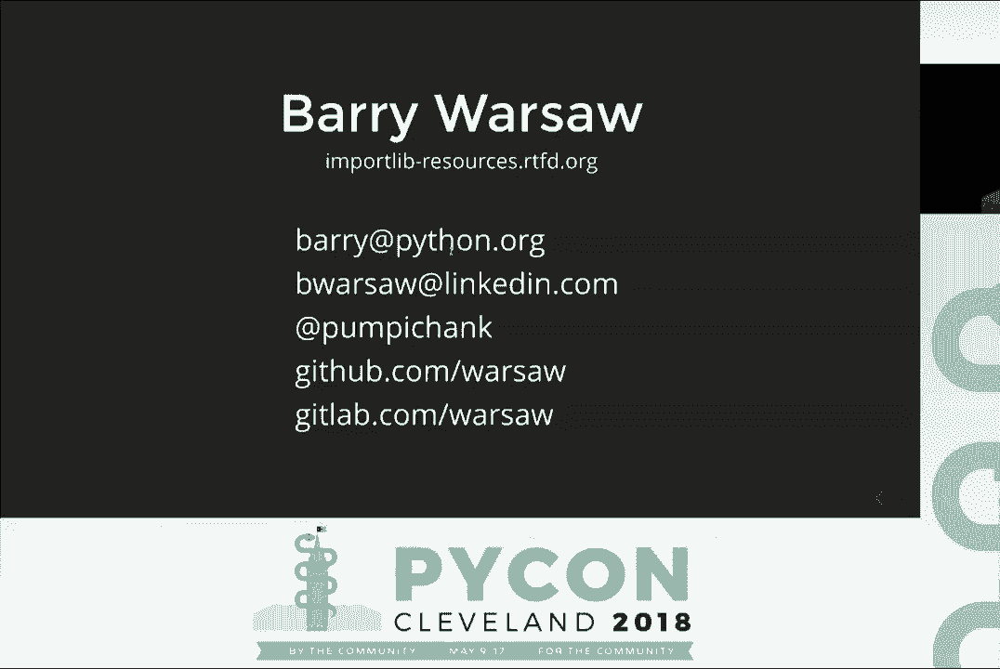

# Python 资源管理：P4：通过 importlib.resources 更快获取资源


在本节课中，我们将学习如何在 Python 运行时高效地读取与代码打包在一起的静态文件（如模板、测试数据、证书等）。我们将重点介绍 Python 3.7 引入的新标准库 `importlib.resources`，它旨在替代传统方法，提供更清晰、更高效的 API。

---

## 概述：为什么需要新的资源访问方式？

在开发 Python 库或应用时，我们经常需要读取一些与代码一同分发的静态文件。传统方法，如直接使用 `__file__` 属性或 `pkg_resources` 库，存在一些问题：
*   `__file__` 在代码被打包（如放入 zip 文件）时可能失效。
*   `pkg_resources` 在导入时会产生性能开销，且 API 设计较为陈旧。

`importlib.resources` 基于 Python 高度优化的导入系统构建，旨在解决这些问题，提供更现代、更高效的解决方案。

---

## 传统方法及其局限性

上一节我们概述了资源访问的需求，本节中我们来看看两种传统方法的具体实现和它们各自的缺点。

### 方法一：使用 `__file__` 属性

这是一种直观的方法，通过模块的 `__file__` 属性定位文件路径。

```python
import package

with open(os.path.join(os.path.dirname(package.__file__), ‘data’, ‘example.dat’), ‘rb’) as fp:
    example_data = fp.read()
```

**局限性**：当你的包被放入一个 zip 文件或其他归档格式时，`__file__` 可能不再指向一个真实的文件系统路径，上述代码会抛出异常。


### 方法二：使用 `pkg_resources`

`pkg_resources` 库提供了一个更通用的 API，可以处理文件系统和压缩包内的资源。

```python
from pkg_resources import resource_string as resource_bytes

example_data = resource_bytes(‘package.data’, ‘example.dat’)
```

**局限性**：
1.  **导入时性能开销**：`pkg_resources` 在导入时会扫描 `sys.path` 中的所有条目，建立工作集，即使你后续不使用它，也会产生这个固定成本。
2.  **API 设计陈旧**：例如，`resource_string` 在 Python 3 中返回的是字节（bytes），但名称却叫“string”，容易造成混淆。
3.  **临时文件管理**：其 `resource_filename` API 在需要时会创建临时文件，但由于该库早于 `with` 语句，无法保证临时文件会被及时清理。

---

## 解决方案：`importlib.resources`

鉴于 `pkg_resources` 的种种问题，Python 3.7 在标准库中引入了 `importlib.resources` 模块。它基于 Python 的导入系统，设计更清晰，性能更优。

### 核心概念定义

在深入 API 之前，我们需要明确两个核心概念：
*   **包**：任何拥有 `__path__` 属性的可导入模块。通常，你可以将其理解为一个包含 `__init__.py` 文件的目录（尽管它不一定在物理文件系统上）。
*   **资源**：包内任何可以被读取的对象（如文件）。**重要**：子目录本身不是资源，命名空间包（PEP 420）不能包含资源。

### 主要 API 介绍

以下是 `importlib.resources` 提供的主要函数。它们都接受两个参数：`package`（包名或模块对象）和 `resource`（资源名）。

#### 1. 读取资源内容

当你需要一次性获取资源的全部内容时，可以使用以下函数。

**以二进制模式读取**：
```python
from importlib import resources
data = resources.read_binary(‘package.data’, ‘example.dat’) # 返回 bytes
```

**以文本模式读取**：
```python
from importlib import resources
text = resources.read_text(‘package.data’, ‘template.txt’, encoding=‘utf-8’) # 返回 str
```
API 明确区分了二进制和文本模式，使意图更清晰。

#### 2. 获取资源文件句柄

如果你希望像操作普通文件一样流式读取资源，可以使用以下函数，它们返回一个可在 `with` 语句中使用的上下文管理器。

**打开二进制文件**：
```python
from importlib import resources
with resources.open_binary(‘package.data’, ‘example.dat’) as fp:
    chunk = fp.read(1024)
```

**打开文本文件**：
```python
from importlib import resources
with resources.open_text(‘package.data’, ‘template.txt’, encoding=‘utf-8’) as fp:
    line = fp.readline()
```

#### 3. 获取文件系统路径

某些第三方库（如加载 `.so` 文件或某些 SSL 证书）要求一个真实的文件系统路径。`as_file` 函数提供了这个保证。

```python
from importlib import resources
with resources.as_file(resources.files(‘package.data’) / ‘cert.pem’) as cert_path:
    # cert_path 是一个 pathlib.Path 对象，指向一个真实文件
    # 如果资源在压缩包内，这里会是一个临时文件
    use_certificate(str(cert_path))
# 退出 with 语句后，临时文件（如果创建了）会被自动清理
```
**注意**：`resources.files()` 是 Python 3.9+ 引入的更面向对象的 API。在 3.7-3.8 中，你可以直接使用 `as_file` 配合资源路径字符串。

#### 4. 列出包内容

你可以像使用 `os.listdir()` 一样，列出一个包目录下的所有条目。

```python
from importlib import resources
contents = resources.contents(‘package’)
print(contents) # 可能输出 [‘__init__.py‘, ‘data‘, ‘__pycache__‘]
```
`contents()` 返回的是字符串列表，其中可能包含子包、资源以及像 `__pycache__` 这样的目录。

#### 5. 判断是否为资源

为了区分 `contents()` 返回列表中的资源和非资源（如 `__pycache__`），可以使用 `is_resource()` 函数。

```python
from importlib import resources
if resources.is_resource(‘package’, ‘__pycache__’):
    print(“This is a resource”)
else:
    print(“This is NOT a resource (e.g., a directory)”)
```

---

## 高级主题：底层机制与向后兼容

### 底层加载器 API

`importlib.resources` 的高级 API 建立在 Python 导入系统的“加载器”机制之上。这意味着任何自定义加载器（例如，从数据库或网络加载模块）都可以通过实现一个简单的抽象基类（ABC）来支持资源访问，从而使高级 API 无需修改即可工作。对于大多数使用者来说，无需关心此底层细节。

### 向后兼容与性能

*   **向后移植**：`importlib.resources` 的核心 API 已被向后移植到 PyPI 上的 `importlib-resources` 库，支持 Python 2.7 及 3.4+。这意味着你无需升级到 Python 3.7 即可开始使用它。
*   **性能提升**：在实际案例中（如 LinkedIn 的内部工具），用 `importlib.resources` 替换 `pkg_resources`，并结合现代打包工具（如 `shiv` 替代 `PEX`），使得命令行工具的启动时间提升了 **25% 到 50%**。

---

## 总结

本节课中我们一起学习了 Python 中管理打包资源的最佳实践。我们回顾了传统方法（`__file__` 和 `pkg_resources`）的缺点，并深入探讨了 Python 3.7 引入的现代解决方案 `importlib.resources`。

它的核心优势在于：
1.  **清晰的 API**：明确区分二进制/文本操作，使用上下文管理器自动管理资源。
2.  **优异的性能**：基于高效的导入系统，避免了 `pkg_resources` 的导入时开销。
3.  **更好的兼容性**：能正确处理文件系统和压缩包内的资源。
4.  **广泛的可用性**：通过 `importlib-resources` 包支持旧版 Python。




建议在新项目中直接使用 `importlib.resources`，并在旧项目中逐步迁移，以提升代码的清晰度和运行效率。