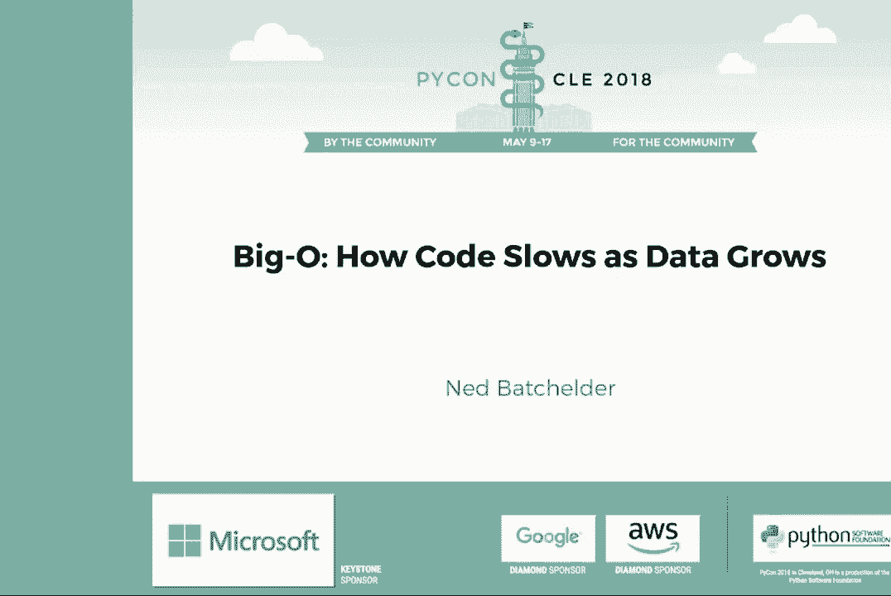
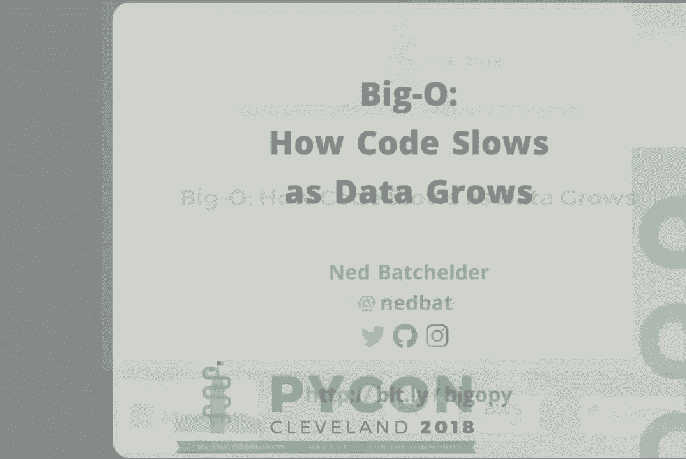
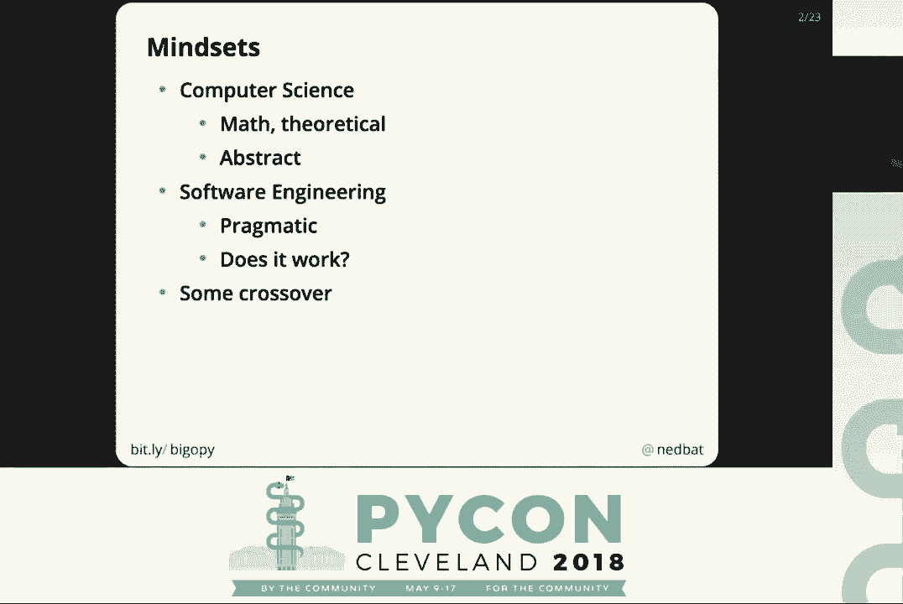
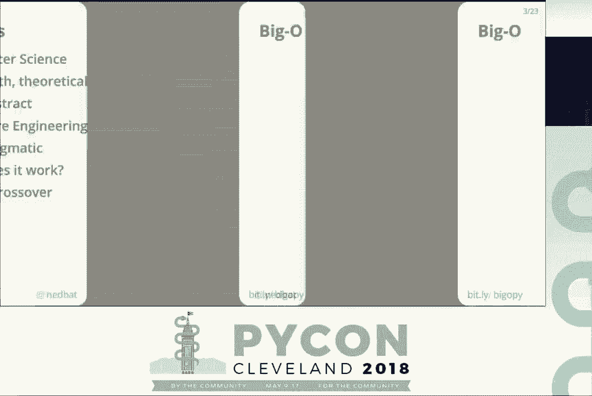
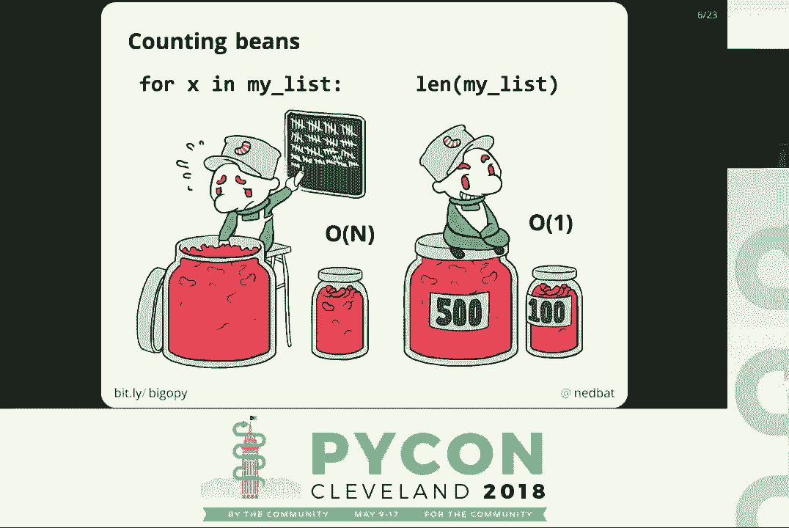
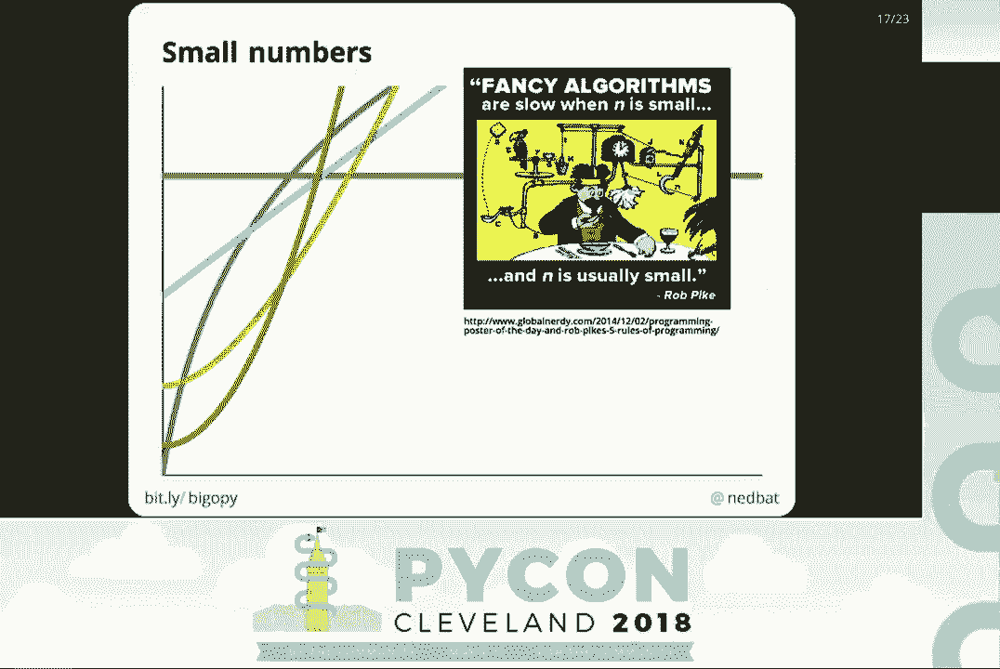
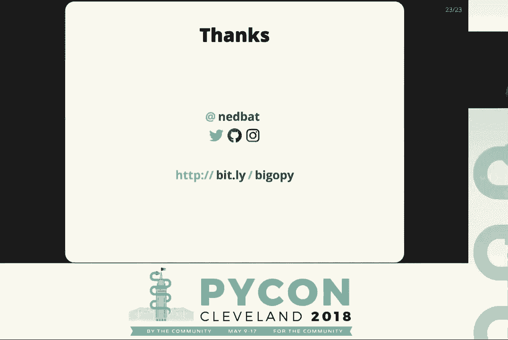

# 算法复杂度：P6：大O符号：代码如何随数据增长而减速 🐌





在本节课中，我们将要学习一个对软件工程师至关重要的概念——大O符号。我们将探讨如何用它来描述代码的运行时间如何随着数据量的增长而增加，并学习如何分析简单代码片段的复杂度。理解这个概念能帮助我们编写出在处理大量数据时依然高效的代码。

## 什么是大O符号？🤔





上一节我们介绍了课程概述，本节中我们来看看大O符号的核心定义。大O符号是一种描述算法“时间复杂度”的方法，它关注的是当输入数据量（通常用 **N** 表示）增长时，算法运行时间增长的趋势。

**核心公式**：`O(f(N))`

这里的 `O` 代表“阶”（Order），`f(N)` 是一个关于数据量 **N** 的数学函数。它不是一个真正的函数调用，而是一种表示增长趋势的符号。

## 现实世界中的复杂度例子 🥫

为了理解不同复杂度级别的含义，让我们看几个生活中的例子。

以下是两个计算豆子数量的方法：
*   **方法A（逐个计数）**：打开罐子，一颗一颗地数豆子。如果豆子数量（N）增加十倍，所需时间也大约增加十倍。这被称为 **O(N)**，或**线性时间**。
*   **方法B（查看标签）**：罐子外面贴好了豆子数量的标签。无论罐子多大，看一眼标签就能知道数量，所需时间恒定。这被称为 **O(1)**，或**常数时间**。



在编程中，Python的 `len(list)` 操作就像**方法B**，是 O(1)；而遍历列表的每个元素就像**方法A**，是 O(N)。

## 更多复杂度类别 📚

上一节我们看到了O(1)和O(N)的例子，本节中我们来看看另一种常见的复杂度。

假设你需要在书中查找一个特定的词。
*   **在小说中顺序查找**：你需要从头开始阅读，直到找到那个词。这平均需要检查一半的页数，时间与书的总页数 N 成正比，是 **O(N)**。
*   **在按字母排序的百科全书中查找**：你可以使用“二分查找法”。先翻到中间，根据词汇顺序决定向前或向后查找，每次都能排除一半的页数。这种方法的复杂度是 **O(log N)**，增长速度远慢于 O(N)。

数据的组织方式（数据结构）决定了你能使用的算法，从而极大地影响代码的效率。

## 关键术语与图表 📈

在深入分析前，我们先统一一些术语并可视化不同复杂度的差异。

*   **O(1)**：常数时间。运行时间不随 N 变化。
*   **O(N)**：线性时间。运行时间与 N 成正比。
*   **O(N²)**：二次时间。如果 N 增加10倍，运行时间可能增加100倍。
*   **O(log N)**：对数时间。运行时间随 N 增长非常缓慢。

这些概念有时也被称为“时间复杂度”、“算法复杂度”或“渐近复杂度”。

以下是不同大O复杂度的增长趋势示意图：
```
时间
  ↑
  |                                    ....（O(N²)）
  |                                ...
  |                            ...
  |                        ...（O(N)）
  |                    ...
  |                ...
  |            ...（O(log N)）
  |        ...
  |    ...（O(1)）
  |...
  +——————————————————————————————> 数据量 (N)
```
可以看到，O(N²) 随着数据量增长急剧上升，而 O(1) 则保持平坦。

## 如何确定代码的大O？🔍

现在我们来学习分析一段代码并确定其大O复杂度的实用步骤。

以下是分析的四个步骤：
1.  **明确代码段**：确定你要分析的是哪个具体的函数或代码块。
2.  **定义 N**：找出代码中代表“数据量”的变量是什么（例如：列表长度、字符串长度、记录条数）。
3.  **计算典型情况下的步骤数**：模拟代码在典型数据上运行一次，计算其执行的基本“步骤”数。将步骤数表达为关于 N 的公式（如 `3N + 2`）。
4.  **简化表达式**：只保留公式中最高阶的项，并忽略它的系数。例如，`3N² + 5N + 10` 简化为 **O(N²)**。因为当 N 非常大时，低阶项和系数的影响微乎其微。

## 代码分析实例 👩👧

让我们通过两个具体的Python函数来实践上述步骤。

**实例1：查找母亲（O(N)）**
```python
def find_mom(moms, child_name):
    for child, mom in moms:          # 这个循环是关键
        if child == child_name:
            return mom
    return None
```
*   **N**：列表 `moms` 的长度。
*   **分析**：在典型情况下（名字在列表中随机出现），循环平均需要运行 `N/2` 次。每次循环包含几个固定步骤（读取元组、比较等）。总步骤数可表示为 `a * (N/2) + b`，简化后为 **O(N)**。

**实例2：统计祖母数量（O(N²)）**
```python
def count_grandmas(moms):
    count = 0
    for child, mom in moms:          # 外层循环：O(N)
        if find_mom(moms, mom):      # 内层调用：O(N)
            count += 1
    return count
```
*   **N**：列表 `moms` 的长度。
*   **分析**：外层循环运行 N 次。每次循环都调用 `find_mom` 函数，而我们已经知道 `find_mom` 是 O(N) 的操作。因此，总复杂度是 N * O(N) = **O(N²)**。

## Python常见操作的时间复杂度 🐍

了解常用数据结构操作的基础复杂度至关重要，这能帮助我们在编程时做出明智的选择。

以下是Python列表、字典和集合的部分关键操作复杂度：
*   **列表 (List)**:
    *   按索引访问/赋值 (`list[i]`): **O(1)**
    *   追加 (`list.append(x)`): **O(1)** (摊销时间)
    *   查找值 (`x in list`): **O(N)**
*   **字典/集合 (Dict/Set)**:
    *   查找键/值 (`key in dict`, `x in set`): **O(1)** (典型情况)
    *   赋值/添加 (`dict[key]=val`, `set.add(x)`): **O(1)** (典型情况)

**重要提示**：用集合 (`set`) 的 O(1) 查找替代列表 (`list`) 的 O(N) 查找，通常是显著的性能优化。但需注意，将列表转换为集合本身是 O(N) 操作。因此，如果只做一次查找，转换可能得不偿失；如果需要多次查找，则转换是值得的。

## 权衡、误区与高级话题 ⚖️

在应用大O分析时，需要保持全局视角并理解其局限性。

**关注大局**：优化一段 O(N) 的代码固然好，但如果它只被调用一次，而程序的主要时间消耗在一个 O(N²) 的循环中，那么优化前者收效甚微。始终先找到并优化性能瓶颈。



**当N很小时**：大O描述的是 N **趋近于无穷大**时的趋势。当数据量很小时，被忽略的常数项和低阶项可能起主导作用。一个 O(N²) 但常数很小的算法，在 N<100 时可能比一个 O(N) 但常数很大的算法更快。正如 Rob Pike 所说：“花哨的算法在 n 很小时很慢，而 n 通常很小。”

**高级话题速览**：
*   **摊销分析**：像 `list.append()` 这样的操作，绝大多数时间是 O(1)，但偶尔在列表需要扩容时会有一次 O(N) 的复制。从长期平均来看，其时间复杂度仍是 O(1)，这就是“摊销 O(1)”。
*   **最坏情况**：我们之前主要分析“典型情况”。某些算法（如哈希表查询）在典型数据下是 O(1)，但在特定恶意构造的数据下可能退化为 O(N)。这也是Python为字典引入哈希随机化的原因之一。

## 总结 🎯

本节课中我们一起学习了：
1.  **大O符号 (`O(f(N))`)** 是一种描述代码运行时间随输入数据量 **N** 增长而变化的趋势的工具。
2.  常见的复杂度有 **O(1)**（常数）、**O(log N)**（对数）、**O(N)**（线性）和 **O(N²)**（二次），其增长速率依次加快。
3.  分析代码复杂度的步骤是：明确代码段、定义 N、估算步骤数、简化表达式。
4.  掌握 Python 基础数据结构（列表、字典、集合）的核心操作复杂度，能帮助我们写出更高效的代码。
5.  大O分析是强大的工具，但应用时需注意**权衡**（如转换成本）、**关注瓶颈**，并记住在**数据量很小时**，常数因素可能比复杂度级别更重要。



希望本教程能帮助你消除对大O符号的畏惧，并将其作为一个实用的、非数学的工具应用到日常的软件工程实践中。