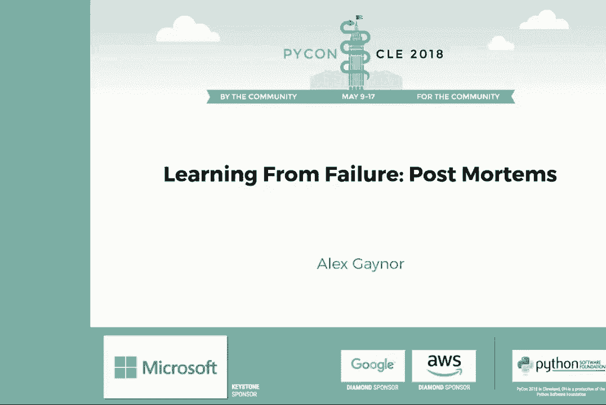
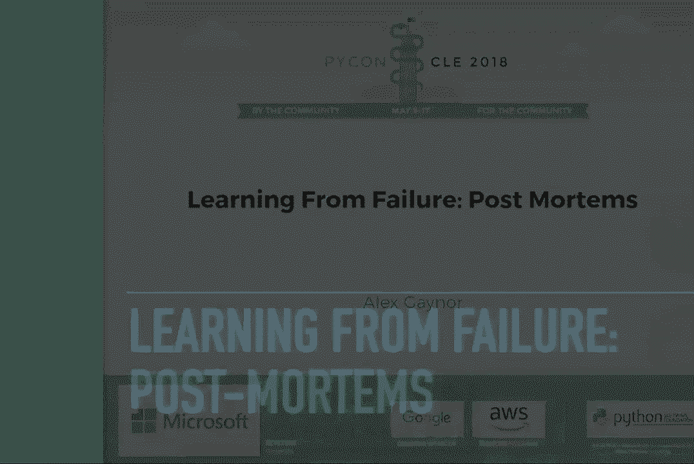
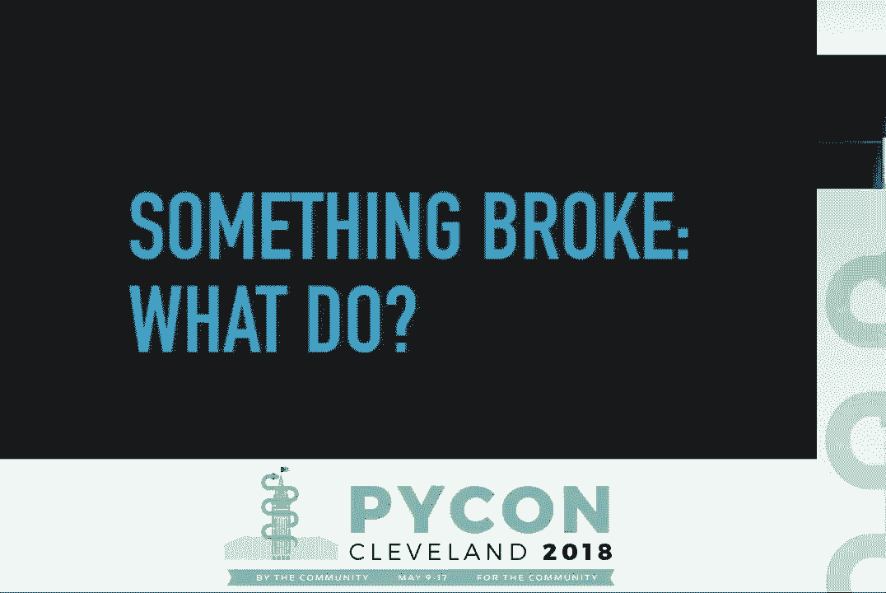
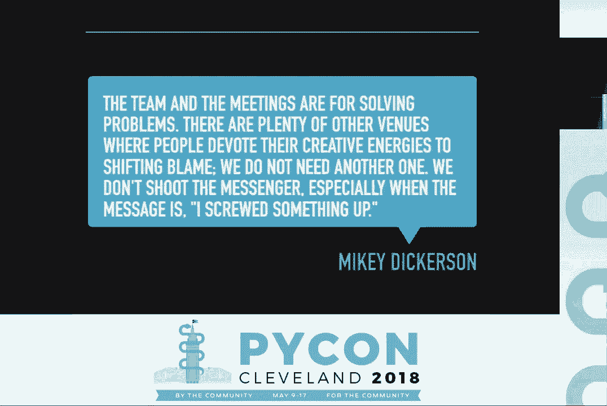
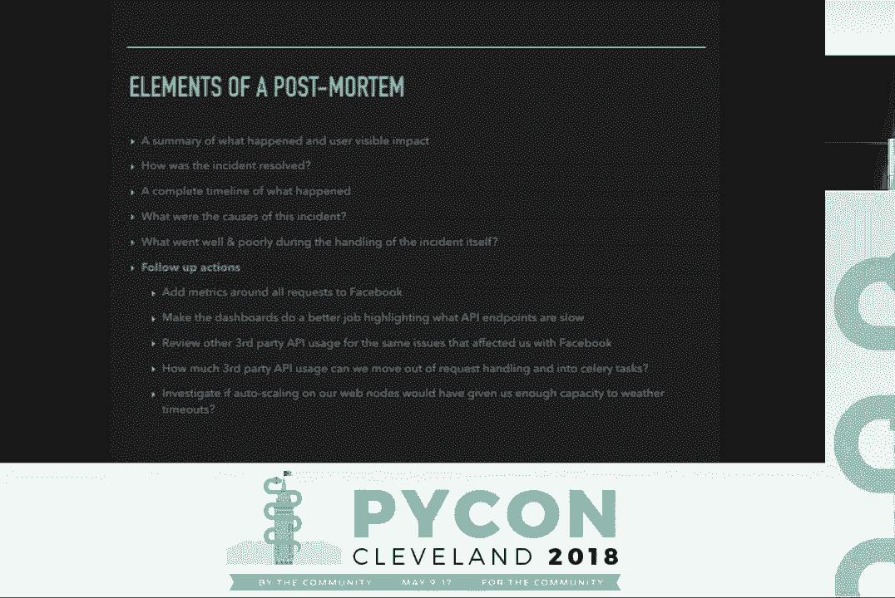
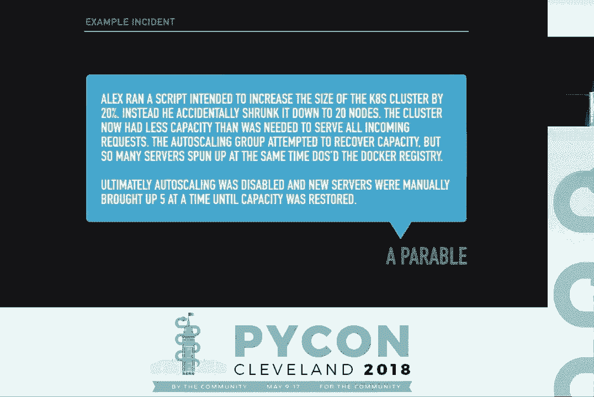
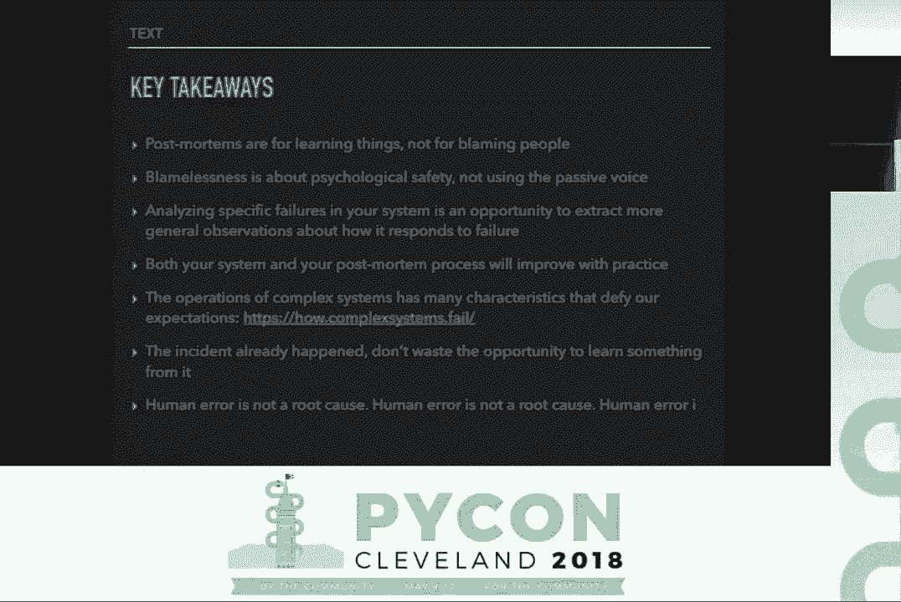
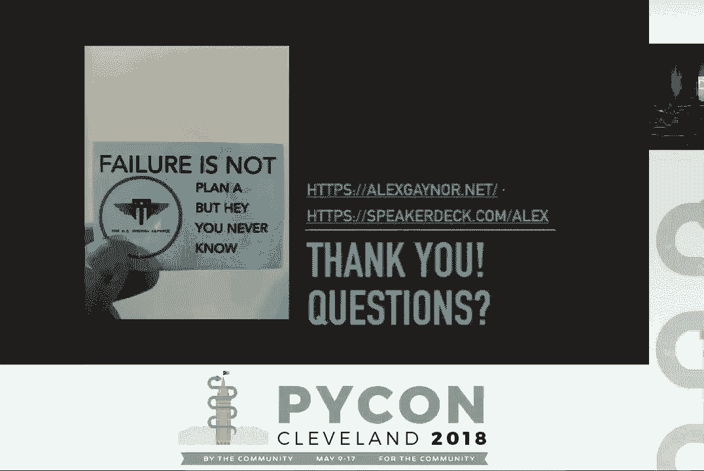

# P7：Alex Gaynor - 从失败中学习的事后分析 - PyCon 2018 - 哒哒哒儿尔 - BV1Ms411H7Hn

\>\> 大家下午好。欢迎回到我们的倒数第二个会议。我们的下一位演讲者不需要介绍，所以我不会花时间介绍 Alex。我想你们大多数人都认识他，他将和我们谈论从失败中学习的事后分析。

Alex Gaynor。 [掌声]。

\>\> 谢谢你，Ned，也谢谢你们所有人，来到这里听这个演讲。正如 Ned 所说，我是 Alex，这次演讲将围绕通过事后分析从失败中学习。我们将讨论如何在开发过程中引入事后分析，以从不可避免的失败中获得最大收益。

对于软件开发人员来说，bug 是生活的一部分。除非你在做航天飞机或心脏起搏器，否则你可能对此并不太在意。你已经接受了，这种情况时不时会发生。在我的经验中，客户从来不会对 bug 感到特别高兴，但今天我们将专注于一个特定的子集。操作性 bug。

什么是操作性故障？网站停机。数据泄露。在生产环境中出现问题。一个简单的测试是，如果这是你会在服务水平协议（SLA）中衡量的内容，那就是操作性故障。我们将重点讨论如何从操作性故障中学习。

其中一些实践可能适用于你想学习的其他情况，比如敏捷事后分析或敏捷冲刺回顾。但这不是我的重点。在这里，我会使用网站宕机作为大多数例子，但这是我认为许多人都能理解的情况。

但不要以为这只是唯一的操作性故障。在我们深入之前，你可能需要了解我所带来的视角。我目前是一名在 Mozilla 保护 Firefox 的安全工程师。在之前的职业生涯中，我为初创公司和美国政府工作过。我开发过网络应用程序和编译器。

还有现在的网络浏览器。我在 Python 生态系统中花了很多时间，从开发流行的开源项目到担任 Python 软件基金会的董事会成员。那么，某些东西坏了，你接下来该怎么办？首先，止住损失。解决破损的直接表现超出了这次演讲的范围。

希望在 PyCon 上还有其他人进行了修复 bug 的演讲。如果没有，那你就只能靠自己。一旦情况稳定，接下来你该怎么办？根据我的经验，这个问题有两个可能的答案。一个是如何确保这种情况不会再发生。

第二个是我们如何弄清楚谁需要被解雇？

团队和会议是用来解决问题的。还有许多其他场所，人们投入创造性精力去转移责任。我们不需要另一个这样的场所。我们不会责怪传话者，尤其是当信息是“我搞砸了”时。我认为我以前的老板米奇·迪克森的一句话。

捕捉到了这两种观点之间的区别。米奇是 2013 年被引入 RescueHealthCare.gov 的第一批工程师之一，当时网站发生故障。如果你还没听过这个故事，你应该找个人来告诉你。这个故事很精彩。他们遇到了问题，网站一直无法正常运行。

当一些人试图让它运作时，国会正在举行听证会。网站在任何时刻是否正常运行都是 CNN 的头条新闻。没有人愿意分享任何会指责他们自己或他们公司内容的信息，即使这对修复网站有帮助。

如果你离开这里后什么都没学到，我希望你能相信，追究责任（即解雇他们）和进行系统性改进是无关的问题，甚至可能是互相排斥的。如果你想学习在出错时如何选择解雇谁。

你需要找一个不同的讲座。

这是关于我们如何从错误中学习的。你可能听过“无责事后检讨”这个词。这个词正是我刚才所说的。事后检讨是为了寻找系统性改进，而不是找出谁该负责。在事情出错时，这种情况很常见。

我们可以寻找一个可以说是负责任的人，并进行指责。负责将代码推向生产的人，运行出了问题的管理脚本的人，开发了引入了错误代码的拉取请求的人。我想花一点时间给个例子。

无责文化是什么样子，因为它对这个过程至关重要。根本原因。运行了一个删除了半个生产集群的脚本。乍一看，这听起来还不错。我们没有指责任何人。脚本是运行的，重要的是由谁运行。如果你曾经使用过 Microsoft Word，并对其被动语态提出过抱怨。

这就是了。这是一个无责的句子。它没有指责任何人，但它并没有产生一种无责的文化，这正是我们所追求的。根本原因。我，亚历克斯，运行了一个删除了半个生产集群的脚本。这似乎更糟糕。我们将删除生产集群归因于一个人，这肯定是在指责他们。

无责文化并不是否认特定的人做了什么，而是我可以说，我做了这个，整个团队将其推过去，寻找系统性的改进机会。关键是你的团队要看到并理解，无责并不是省略某个人的名字。

但出于一种深信不疑的信念，几乎所有问题都有系统性的解决方案，追求这些解决方案远比其他更重要。使用被动语态微妙地传达了，如果我们知道是谁，我们会指责某人。我们把这些信息保密，因为内心深处我们真的想找一个人来指责。建立一种文化，让你可以说，我是这样做的。

这给人们提供了更多机会自由发言，充分交流发生了什么，并理解根本原因，而不是被恼人的问题分散注意力。哦，是马克又犯错了吗？他把脚本运行错了吗？因为那不是我们想要的。我已经多次使用“系统性问题”或“系统性解决方案”这个短语。

如果你们都允许有这种哲学，我想深入探讨这些的含义。发生了操作故障。网站宕机了。然后有人修复了错误，重新部署，现在网站恢复了。发生了故障，现在已解决，还需要做什么。我要在这个过程中带来的坚定信念是，发生的操作故障。

给我们提供了一个问题的示例演示。但这只是一些潜在故障中十几种表现方式之一。事后分析的任务是找出其他 11 种，看看我们如何能一次性解决它们，并发现其他哪些挑战加剧了这些错误的严重性。你可能听过“根本原因分析”这个词。

一般来说，这在哲学上与我所谈论的非常一致。然而，有一点重要的修正。根本原因，复数。我希望我有时间全面探讨这些材料，但我希望每个人记下网址，how.complexsystems.fail，或者你可以在演讲后在幻灯片中找到它。

本页总结了理查德·库克博士所做的一些研究。他是一位医学博士，研究复杂系统的故障模式，无论是电网、医院还是生产分布式系统。如果你有一小堆网络服务器、负载均衡器、网络文件系统和数据库。

以及监控工具，你就拥有了一个复杂的系统。库克博士研究的一个主要观察结果是，对于复杂系统来说，它们已经进行了大量工作来处理故障。你在 Python 代码中放置的每个接受、尝试或最终、或者使用阻塞的操作，都是在尝试处理某种故障。因此，任何操作失败都将有多个促成因素。

因此，很可能触发操作故障的任何变化，仅仅引发了一组先前存在的潜在错误，这些错误在之前并不明显。我们必须认真对待这些潜在错误，视其为瞬时原因的一部分，与使它们活跃的直接变化同等重要。我们还必须考虑那些可能并不明显的事情。

可能会有错误，但这些依然是我们事件或其严重性的影响因素。现在去阅读这个网站的其余部分。理想情况下，在我讲完之后，但这内容相当不错。我会理解的。所以我给出了事后分析的基本哲学理由。我告诉你，我必须有。

你必须有一个。什么是事后分析？事后分析通常是以会议和书面文件的形式进行的，其目标是将我们的单一具体操作故障转化为学习。以对我们的代码进行改进、对我们的文档进行改进的形式进行学习。

对我们流程的改进，对大卫和萨拉笔记本上的奇怪脚本的改进，它们意外地成为了关键的生产基础设施。以文档的形式进行学习。加入公司六个月的人可以阅读以了解发生了什么。最重要的是，通过将这一特定事件转化为观察来学习。

关于更一般的模式。事后分析是由负责运营的团队汇总的，并实施所学的教训。如果你正在登录服务器修复问题，你就处于事后分析的过程中。如果你将负责重做厨师的食谱。

你在事后分析过程中。如果你为受影响的应用程序编写代码，你就处于事后分析的过程中。事后分析不是由某人为了别人整理的。它们是由正在进行工作的人员为自己完成的。

我看到的有效格式是在事件发生几天后。所有相关人员聚在一起，分享他们的笔记，并共同制作文档。我们把团队聚在一个房间里。我们坐下来为刚刚发生的事件撰写事后分析。我们需要确保这个文档中包含什么？我将逐一介绍事后分析的要素。

以及示例。这不是一套严格的规则，但这些是我看到的必要元素，似乎与其他公司朋友们使用的相符。我个人觉得创建一个包含每个字段的模板是有帮助的。当我说模板时，我指的是一个 Markdown 文件。

带有一些预填充的标题。没什么花哨的。这对于你的事后分析保持相同的格式是有用的。这样可以轻松发现它们之间的趋势。哦。我已经看到根本原因三到四次，跨越多个事后分析。也就是说，实用性胜过纯粹。如果你的某个事件与另一个事件有显著不同。

不要强行将其塞入一个没有意义的模板。需要对发生的事情和用户可见的影响进行总结。网站宕机了 17 分钟，之后另有 24 分钟的异常率升高。从一开始，你就想要有一个简明的描述，说明故障是什么。

所有发生的事情的可见影响是什么？

用户可见影响的含义因你的系统而异。如果你有一个复杂的微服务架构，而你的服务消费者或人的 ETL 工作。他们就是你的用户，而你关心停机时间，或其他影响，因为他们的感知。不一定是你的最终客户的感知。事件是如何解决的？

我给我们应用程序向 Facebook 发出的 HTTP 请求添加了超时，并重新部署了应用程序。你在当下做了一些事情来止住伤口。那是什么？

事件发生的完整时间线。909 时，监控显示网站 503。亚历克斯页面，912 时。亚历克斯处理页面，914 时，亚历克斯重启 Nginx，事件未解决。921 时，朱莉在 Slack 上评论，在事件开始之前，连接 Facebook 的 API 端点显示延迟增加，等等。

等等。这是最重要的部分之一。记录下所有发生的事情，以及每个人所做的每一件事。这对于评估你的实例响应过程的有效性，监控的有效性，以及深入理解事件的发生至关重要。尽可能多写些内容。

没有过多的信息这种说法。在这一点上，我们已经掌握了事件的事实。发生了什么，每个人在做什么，以及最终是如何解决的。到目前为止，我们所记录的一切，或多或少都是客观信息，关于世界上发生的事情。接下来，我们需要专注于分析，这带来了。

将主观因素引入其中。首先，事件的原因是什么？在这个案例中，Facebook 开始缓慢响应请求。我们对 Facebook 的请求没有超时设置，而且在向我们的 API 发出 HTTP 请求时，我们对 Facebook 发出了阻塞请求。我们的请求处理过程，使得少量的慢请求变得容易。

对我们进行拒绝服务。你可能会注意到，缺少任何一个组件，这个事件就不会发生。因此每一个都是我们事件的潜在成因。这一部分我们真正分析原因。这是我在开头提到的多个原因的地方。

在这个特定事件中，直接原因是 Facebook 开始缓慢响应请求，这完全超出了我们的控制范围。但我们仍然可以在我们这方面做很多工作，以提高在下次 Facebook 变慢时的韧性。在这里深入挖掘。列出所有可能的原因。你可以决定这不是问题。

你稍后将追求修复。尽管如此，从我的经验中吸取教训。如果你深入挖掘到，计算机是一种错误。你可能就走得太远了。在事件处理过程中，什么做得好，什么做得不好？不幸的是，我们的监控和图表，没有很好地突出显示。

我们系统上哪些 API 端点响应缓慢。我们没有直接监控请求到 Facebook 的延迟和错误率，所以我们必须知道我们网站上的特定 URL，可能由于响应缓慢而牵连到 Facebook。在好的一面，一旦我们开发出修复方案。

我们能够非常迅速地将其部署到生产环境中，并解决了事件。善于应对事件是韧性的关键因素之一。因此，我们需要回顾事件发生时的情况，超出导致事件的原因。在这种情况下，有机会改善我们的监控工具。

从部署系统的好处来看，在事件发生期间工作得毫无瑕疵，这是重要的。如果我们的部署系统在我们试图解决事件时出现问题，那将更加严重地加剧我们的困境。最后，后续行动。增加关于所有请求到 Facebook 的指标。

使仪表盘更好地突出显示，哪些 API 端点响应缓慢。回顾其他第三方 API 的使用，看看是否有同样的问题影响了我们与 Facebook 的交互。我们能把多少第三方 API 的使用，完全移出请求处理，转入薪资任务？

我们应该调查在我们的 Web 节点上，自动扩展是否能提供足够的剩余容量，以应对超时。这是你综合事件原因的地方，以及处理中的因素，这些因素加重了事件的严重性，并形成后续事项。预计需要在你的错误跟踪器中提交大量票据。

然后你可以使用正常的优先级排序过程，以确保最重要的事项快速完成。你应该包括短期跟进事项，即可以立即处理的事情，以及可能涉及更长期跟进事项的内容。

对你的代码进行严重修正或更长的实施时间。在这种情况下，我们生成行动事项，以改善我们的指标，审查我们的代码，看看还有哪些其他第三方集成，可能会导致拒绝服务。考虑长期改进，将一些集成转入薪资任务。

以便影响 Web 服务的可用性，并调查如果我们有基于响应时间缓慢的自动扩展，或者基于请求延迟缓慢的自动扩展，会发生什么。如你所见，这些都是受到我们认为是事件根本原因之一的启发。

现在我们已经走过了事后分析的要素。我将给大家布置一些作业。我将描述一个事件，看看你们的想法，以及我看到的一些后续事项。我希望在座的每个人都能带着这些回家，思考我所描述的情况中你们看到的其他内容，还有其他系统性的机会。

我们还有哪些地方可以改进？亚历克斯运行了一个旨在将 Kubernetes 集群大小增加 20% 的脚本。结果，他意外地将其缩减到 20 个节点。现在集群的容量不足以处理所有传入请求。自动扩展组试图恢复容量，但同时启动的服务器太多。

对 Docker Registry 的服务拒绝。最终，自动扩展功能被禁用，新的服务器被手动一次性带入五台，直到我们恢复到满负荷。总的来说，事情几乎完全不可用，持续了稍超过一个小时，完全解决从开始到失败，花费了超过三个小时。

我们很容易说，亚历克斯不理解如何使用 scale.sh 是根本原因。希望到现在为止，我已经说服你这样做会错失改善整个系统的机会，更不用说把责任归咎于一个人，而这最终是团队的努力。

有些事情让我印象深刻。显然，在 scale.sh 中存在用户体验问题。无论是我使用的 API 令人困惑，导致误解了它所需的参数，还是它几乎可以删除整个集群。

这使我们的能力远低于所需的水平，且没有任何确认。自动扩展本应使我们更具弹性，通过在需要时增加容量。然而，它让这个事件更糟，因为我们处于一种状态，虽然有服务器启动，但无法使用。这值得认真审查。

在这个事件中你看到了什么？我们可以做出哪些系统性改进，以处理这六种其他方式，这种情况除了亚历克斯运行脚本错误之外还会以什么形式出现？

也许亚马逊只是偶尔删除我们的一些服务器，产生完全相同的症状。我们所看到的关于如何防止此事件的结论，是否也适用于这种情况？如果你要处理这个事件，你希望拥有什么工具？或者你希望掌握哪些指标？

如果你想将事后分析纳入团队流程，该从何开始？嗯，你只需决定去做。然而，直到下次事情真正出错之前，这里有几种你可以用来练习的方法。首先，模拟一个事件。在安全领域，我们通常称之为桌面演练。想出一个示例场景。

坐在桌子旁，讨论你会如何处理它。这是提高你实例响应能力的一个优秀工具。但这并不如寻找潜在错误来得好，尽管有时仅仅思考“这个情况可能如何失败？”也能引发一系列的改进。推特账户。

“每日坏事”，推特上实践安全事件示例供你在这些练习中使用。起初，你可能会觉得这些场景非常奇怪，但很快你会意识到，“哦，如果我们能熟练处理类似的情况，那也会让我们在处理各种其他场景时表现出色。”选择二。

引发事件。Netflix 在其生产环境中运行一种叫做混沌猴子的东西。基本上，它会随机删除生产中的一个 EC2 实例。这确保他们的系统可以在没有问题的情况下处理实例损失，如果不能，就提供了一个练习的机会，以运行他们的实例响应程序。

生活在生产环境中，尽管你或许可以在开发环境中开始。如果你关闭了一个服务器，所有其他服务会完美响应吗？

你是否测试过这个理论？最后，你可以重新定义什么是事件。如果你已经在 99%的请求中没有错误地达到 SLA，提升你的 SLA 到 99.5%，并将 99 百分位响应延迟目标设定为 500 毫秒。对让你未能达到 SLA 的慢请求进行事后分析。

尽管整个过程中网站一直可用。我谈到了对计算机问题的事后分析，但软件工程师并没有发明这个想法。事后分析在其他行业有着悠久的历史。在军方，他们称之为热洗或事后回顾。

医生称之为发病率和死亡率会议，而这也是国家交通安全委员会核心工作的一部分。NTSB 是一个独立的联邦机构，员工人数几百。他们负责调查交通事故，无论是飞机还是火车。

或汽车。NTSB 的使命是，引用。 "确定交通事故和事件的可能原因，并制定安全建议以改善交通安全。" 告诉我这听起来不熟悉吗？NTSB 通过他们称之为“党派系统”的方式进行调查。

基本上，除了 NTSB 的团队成员外，党派还将包括来自行业的人，包括直接来自事故相关组织的人。如果事故是飞机最终降落时的发动机故障，可能会有来自发动机制造商、空中交通管制和航空公司的专家参与。

你无法在没有各个角度的专家在场的情况下调查事故原因。然而，保险公司成员不得参与该党派。

保险公司总是关注责任分配。关于 NTSB，最重要的事情是，他们不是执法机构。他们进行事故调查，而不是刑事调查。这不仅仅是他们使命中的字眼。

NTSB 调查的结果及其收到的证词不能作为法庭上的证据。他们的公共安全任务要求这样做。NTSB 会提供他们收集的客观技术和科学数据，并支持执法部门对这些数据的分析。但关于根本原因的报告都享有特权，不能在法庭上使用。

这是一个特殊的状态，有点像律师-客户特权或配偶特权。我认为没有更明确的证据表明，提出安全建议与找出谁或什么是责任方是不同的工作。在结束之前，还有一些信息我希望大家了解。

这在幻灯片中没有适合的地方。首先，有时事情会崩溃而我们不知道原因。这并不意味着我们不能进行事后分析。事实上，这让事后分析显得更加重要。在之前的工作中，我们曾经历过一次网站崩溃的事件。

因为我们所有的移动应用程序在同一时间开始向后台发送请求。我们修复了移动应用中的指数退避问题，我们使 API 端点更加高效，手机在请求时能处理更多负载。我们从未弄清楚为什么所有手机在同一时间发起请求。

但这并没有阻止我们进行改进，以便在再次发生时更好地处理情况。如果你听到有人说根本原因是人为错误，那应该是一个巨大的红旗。我曾见过一个事件，其中一个人错误地从一个系统的字段复制了一个值到另一个系统，并被描述为根本原因是人为错误。没有讨论为什么系统没有进行数据验证。

没有人讨论为什么人类要手动在两个软件系统之间复制内容。人为错误意味着你无法提出单一的根本问题来进行修复。如果你这样声称，那你最好有证据支持。我从未见过有这种情况的事后分析。

我曾见过一种情况，认为修复根本问题过于罕见，且成本高得不具成本效益，但这是另一种说法，我们当然知道原因是什么。我花了过去 20 分钟对你的开发过程进行了相当深入的补充。为什么要费心？这是一项巨大的努力。每当出现问题时召开这些会议需要花费大量时间。

这是一组需要发展的技能，而软件工程师已经拥有许多必要的技能。为什么要费心？值得吗？如果你不从根本上修复某类错误，你最终会以更快的速度产生更多类错误，超过你修复单个实例的能力。随着时间的推移，产品的可靠性将会降低，因为系统性错误越来越多。

软件工程是一门需要实践以提升的学科，就像其他任何学科一样。如果你不抓住机会从错误中学习，你将错失许多学习机会。特别是，一旦你学会识别某些潜在错误的类型。

你可以在下一个项目一开始就避免犯这些错误。如果你在开始时知道很多类型的错误是很便宜的可以避免，而在项目变大后修复则非常昂贵。那么，预防胜于治疗。最后，从系统性修复错误在长远来看比逐个修复要便宜。

我希望大家能从这里带走的关键要点。如果你忽略了关于如何召开会议的所有建议，想知道你的事后分析中需要包含哪些元素，我希望你能记住这些事情。事后分析是为了学习，而不是为了指责他人。

无指责的文化是关于心理安全，而不是使用被动语态。当人们看到你使用被动语态时，他们会认为这意味着我想指责他们，只要我知道他们是谁。分析系统中的具体失败是提取更一般观察的机会，关于它如何应对失败。在许多事后分析的趋势中，应该越来越多地表明你的系统能够在没有灾难性故障的情况下处理更多情况。

你的系统和事后分析过程都会随着实践而改善。复杂系统的操作有许多特征超出我们的预期，如何处理复杂系统失败的网站详细列出了其中许多特征，希望能帮助你操作系统。事件已经发生，不要浪费从中学习的机会。

具体的失败几乎总是比努力思考可能发生的事情更具教育意义。最后，人为错误不是根本原因。

非常感谢你们在周日下午与我共度时光。这是我的网站，幻灯片的链接将在这里发布。我相信现在我们有大约三分钟的时间来提问。如果有人想要提问，希望大家现在都知道这一点。但问题是你不知道答案的事情。

Mike 在那边，或许在那边。[掌声]，谢谢你教我关于事后分析的课程。我相信我们中的许多人在不同的开发团队中工作过，事后分析中存在很多指责。你有什么建议能帮助文化从指责转变为无指责的心态吗？

>> 是的，这确实很难。一旦人们学到这样一个教训：如果我说我做错了，我就会受到指责。要撤销这个教训需要付出大量的努力。我认为没有你的团队负责人或管理层以身作则，很难撤销这个教训。愿意说“我做了这个，导致了这个情况”。

这就是我们将如何专注于系统性的改进。我相信这真的是必须从领导层开始，为大家展示。>> 你可能在演讲中提到过这个，但根据你的经验，你是否有建议认为这对你是否有帮助？

在事后分析中，有执行人员参与是有帮助的，还是明确限制在参与事件的人员之中，这点很重要。>> 我认为让高管在场是有帮助的，但关键是要有在一线的团队成员在场。通常，你希望高管看到投入这些努力的价值，并理解为什么你要求资源来优先处理这些修复。

所以，如果让他们在场有助于他们理解你为何要投入时间进行这些补救工作，那绝对是有价值的。很好。非常感谢大家。我希望你们都有一个出色的会议。

[掌声]。
