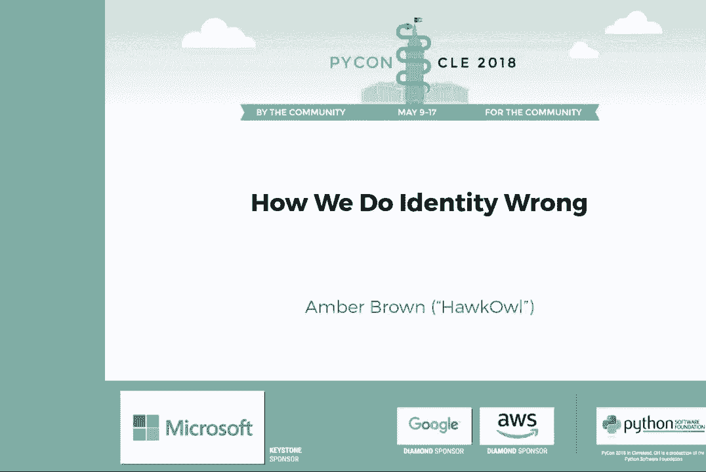

# 002：我们如何错误地定义身份

## 概述
在本节课中，我们将学习在软件开发中如何处理用户的身份信息。我们将探讨姓名、性别、地址等常见身份数据的复杂性，理解为什么许多常见的处理方式是错误的，并学习如何以更尊重用户、更灵活、更安全的方式来设计和存储这些信息。

---

## 什么是身份？🤔

身份是将个体与他人区分开来的特征集合。它由内部属性和外部属性组成。

*   **内部属性**通常相对不变，例如个性、性别认同和生活经历。
*   **外部属性**则可能频繁变化，例如地址、国籍，甚至姓名。

作为开发者，我们经常需要存储用户信息。常见的存储项包括姓名、地址、出生日期、国籍、性别和社会安全号码等。

---

## 姓名：远比想象中复杂 📛

上一节我们介绍了身份的基本概念，本节中我们来看看最常被误解的身份数据之一：姓名。我们经常错误地假设姓名结构简单且固定不变。

### 常见的错误假设
以下是程序员对姓名的一些常见误解：

*   **假设姓名由“名+中间名+姓”组成**：这在许多英语国家常见，但并非全球通用。
*   **假设中间名只有一个且长度正常**：例如，美国总统 Harry S. Truman 的中间名就是单个字母“S”。而有些人可能有多个中间名。
*   **假设姓氏是单个词**：许多人的姓氏包含空格或连字符（例如 “van der Berg” 或 “Smith-Jones”）。
*   **假设姓名不会改变**：人们可能因结婚、性别转换或个人喜好而更改姓名。
*   **假设每个人都有名和姓**：有些人只有一个单一的名字（例如，歌手 “Cher”）。

### 姓名结构的多样性
*   **英语国家**：格式通常为 `[头衔] [名] [中间名] [姓] [后缀]`。例如：`Lady Augusta Ada King, Countess of Lovelace`。
*   **中文和日语**：姓在前，名在后。不能假设字符串的第一部分是名。
*   **其他情况**：有些人有多个中间名，或由多个词组成且无分隔符的姓氏。

### 如何正确存储姓名
首先，需要明确存储姓名的目的：
*   **用于政府系统验证**（如医疗、银行）：应严格遵循政府文件上的格式。
*   **用于日常沟通**（如寄信、网站显示）：一个单独的“全名”字段通常更合适、更灵活。

如果需要同时满足两种需求，最佳实践是明确区分：
1.  询问“法定姓名”（用于官方验证）。
2.  提供一个选项，询问“您的常用姓名是否与法定姓名不同？”，然后允许用户填写“常用姓名”。

**核心原则**：不要尝试从用户提供的单一字符串中自动解析出名和姓。如果确实需要分开的部分，必须明确地向用户询问。

> **推荐阅读**：经典文章 *《Falsehoods Programmers Believe About Names》* 详细列举了关于姓名的各种误解。

---

## 性别与代词：询问前请三思 ♀️♂️

处理完姓名，我们来看另一个敏感领域：性别。首先要问的关键问题是：**你为什么要收集这些信息？**

### 明确收集目的
*   **为了使用正确的代词称呼用户**：那么你应该直接询问“代词”（Pronouns），并提供选项如“他/她”、“她/她”、“他们/他们”以及“自定义”输入框。
*   **为了提供性别化产品或服务**（如卫生用品）：这时询问“性别”可能是合理的。
*   **用于统计或合规**：需谨慎处理，并确保匿名化。

### 最佳实践
1.  **优先询问代词而非性别**。
2.  如果必须询问性别，请提供非二元选项和“不愿透露”选项。
3.  **使用自由格式文本框或包含“其他”选项的下拉菜单**，允许用户自行定义。
4.  默认情况下**不公开**此信息，让用户控制其可见性。
5.  **反思是否真的需要**：在许多场景下，完全可以避免使用性别化的语言。

---

## 地址：世界不是只有美国格式 🗺️

了解了个人标识信息后，我们来看看地理位置标识——地址。许多系统的地址设计严重以美国为中心，这给全球用户带来了困扰。

### 常见的国际地址问题
*   **邮政编码**：并非全是数字（如英国邮编包含字母）。
*   **州/省**：不要向非美国用户展示美国的州列表。
*   **邮政信箱**：在许多国家（如澳大利亚），邮政信箱是有效的、常用的投递地址。
*   **长地名**：某些城市或街道名称可能很长或包含空格。
*   **非标准地址**：在某些地区，地址可能非常简略甚至不存在标准格式。

### 如何改进地址字段
1.  **研究目标市场**：为你计划服务的国家/地区设计特定的地址格式。
2.  **使用灵活的多行文本框**：有时，一个简单的多行文本框让用户自由填写，比强制分字段更有效，邮政系统通常能处理。
3.  **避免过度验证**：对地址格式的严格验证常常会拒绝有效地址。

> **扩展阅读**：类似地，也存在 *《Falsehoods Programmers Believe About Addresses》* 这样的文章。

---

## 数据安全与伦理责任 🔒

在收集了各种身份数据后，我们必须意识到随之而来的巨大责任。存储个人信息伴随着严重的风险和伦理考量。

### 为什么数据安全至关重要
*   **个人数据如同“武器级钚”**：它危险、持久，一旦泄露就无法收回。
*   **现实后果**：数据泄露会给用户带来真实的经济损失和风险（例如身份盗用）。2017年的Equifax泄露事件影响了数亿人。
*   **法律风险**：如欧盟的GDPR规定，对数据泄露可处以巨额罚款（全球营业额的4%或2000万欧元，取较高者）。
*   **政治与伦理风险**：你收集的数据可能被滥用，用于追踪特定族群或观点的人群。

### 核心安全准则
*   **数据最小化原则**：如果不需要某项信息，就绝对不要收集和存储它。
*   **为最坏情况做打算**：思考如果数据被黑客窃取或被政府传票，会发生什么。
*   **软件应帮助人**：最终，软件是为人服务的。糟糕的身份数据处理会剥夺用户的人性，使其感到被边缘化。

---

## 总结与实践建议 🎯

本节课中我们一起学习了身份数据处理的复杂性、常见误区及最佳实践。

### 黄金法则：不要做假设
你的个人经验并非普世标准。进入新市场时，必须进行研究并与当地用户交流。

### 给开发者的具体建议
1.  **设计灵活的系统**：例如，在Django中，默认的User模型要求名字和姓氏，这可能不适用。考虑创建更灵活的用户档案模型。
2.  **全面支持Unicode**：确保从表单到数据库再到邮件，整个系统都能正确处理各种字符，避免出现乱码。
3.  **允许更改**：姓名、地址等信息可能会变，系统应允许用户更新。
4.  **保持谦逊并迭代**：不要期望第一次就完美。当用户指出问题时，积极修复。

### 最终目标
构建尊重所有用户、具有包容性且安全可靠的软件。通过更谨慎地处理身份数据，我们不仅能避免技术错误和法律责任，更能真正地帮助和服务于每一个独特的个体。

---
**记住**：我们不是在处理字符串，而是在处理人。