# 010：深入探讨无缝日志记录


## 概述

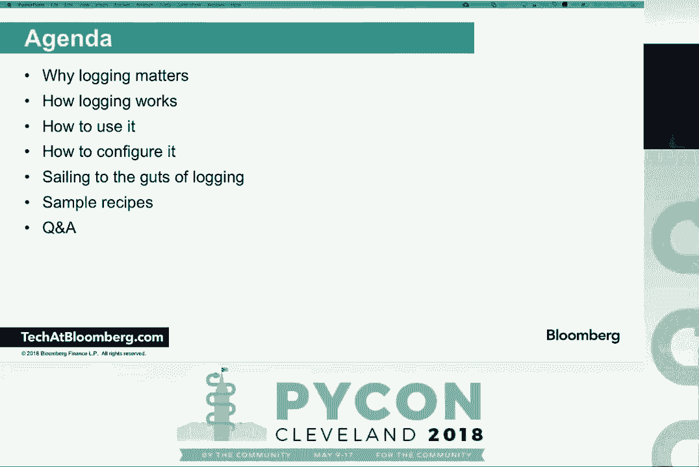

在本节课中，我们将要学习Python标准库中的`logging`模块。我们将探讨为什么日志记录很重要，它是如何工作的，以及如何有效地配置和使用它。通过理解其核心组件和设计理念，你将能够为自己的应用程序或库实现强大且灵活的日志记录功能。

---


## 为什么需要日志记录？📝


日志记录是开发人员为运行中的应用程序编写的“文档”。当代码在生产环境中运行时，它就像一个黑箱。日志记录和监控使你能够观察应用程序的行为，而无需直接调试运行中的代码。这有助于在出现问题时进行故障排除，而无需中断服务或联系正在度假的开发者。


与简单的`print`语句相比，`logging`模块提供了更强大的功能：
*   **线程安全**：在多线程环境中，`print`语句的输出可能会交错混乱，而日志记录是线程安全的。
*   **分类与分级**：可以对日志消息进行分类（如`DEBUG`, `INFO`, `WARNING`, `ERROR`, `CRITICAL`）和过滤。
*   **关注点分离**：日志记录的设计将**记录什么**（由库或应用代码决定）与**如何记录**（由最终用户或部署环境配置）分离开。这使得库开发者可以自由地添加日志点，而无需关心最终的输出目的地（控制台、文件、网络等）。

---

## 日志模块如何工作？🔧

上一节我们介绍了日志记录的重要性，本节中我们来看看`logging`模块的核心架构。它主要包含四个关键组件，协同工作。

以下是日志记录的核心流程组件：

1.  **记录器 (Logger)**：这是开发者交互的主要接口。你通过`logging.getLogger(name)`获取一个记录器，然后调用其方法（如`.info()`, `.warning()`）来产生日志。
2.  **日志记录 (LogRecord)**：当调用记录器方法时，会自动创建一个`LogRecord`对象。这个对象不仅包含你的消息，还包含了丰富的上下文信息，如时间戳、模块名、函数名、行号等。
3.  **处理器 (Handler)**：处理器负责将`LogRecord`输出到指定的目的地。标准库提供了多种处理器，例如：
    *   `StreamHandler`：输出到流（如控制台）。
    *   `FileHandler`：输出到文件。
    *   `SMTPHandler`：通过邮件发送。
    *   `HTTPHandler`：通过HTTP发送。
4.  **格式化器 (Formatter)**：格式化器负责将`LogRecord`对象转换成最终的文本字符串。你可以自定义输出的格式。

**基本工作流程**：
```python
# 伪代码示意流程
logger.info(“User %s logged in”, username)
# 1. Logger 创建 LogRecord 对象
# 2. Logger 将 LogRecord 传递给所有关联的 Handler
# 3. Handler 使用 Formatter 将 LogRecord 格式化为字符串
# 4. Handler 将字符串写入其目标（如控制台、文件）
```

此外，还有一个可选组件：
*   **过滤器 (Filter)**：可以提供比日志级别更精细的控制，用于决定是否让某条`LogRecord`通过。

---

## 记录器的层次结构与传播 🌳

理解了单个记录器的工作流程后，我们需要认识一个关键概念：记录器层次结构。这解释了日志配置如何被继承和共享。

记录器通过名称形成一个层次结构，类似于Python的包路径。例如，名为`”a.b”`的记录器是名为`”a”`的记录器的子记录器，而`”a”`又是根记录器（名为`””`）的子记录器。

这个层次结构带来了两个重要特性：

1.  **级别继承**：如果子记录器没有显式设置级别，它将继承父记录器的级别。
2.  **传播 (Propagation)**：这是关键且易混淆的一点。默认情况下，记录器的`propagate`属性为`True`。这意味着当一条日志在一个记录器上被处理时，**它还会传递给所有祖先记录器的处理器**。但请注意，它调用的是父记录器的**处理器**，而不是父记录器的日志方法本身。

**公式**：
*   设记录器 `L` 的父记录器为 `P`。
*   当 `L.propagate == True` 时，`L` 产生的 `LogRecord` 会经过 `L` 自身的处理器后，继续传递给 `P` 的处理器（以及更上层的处理器）进行处理。

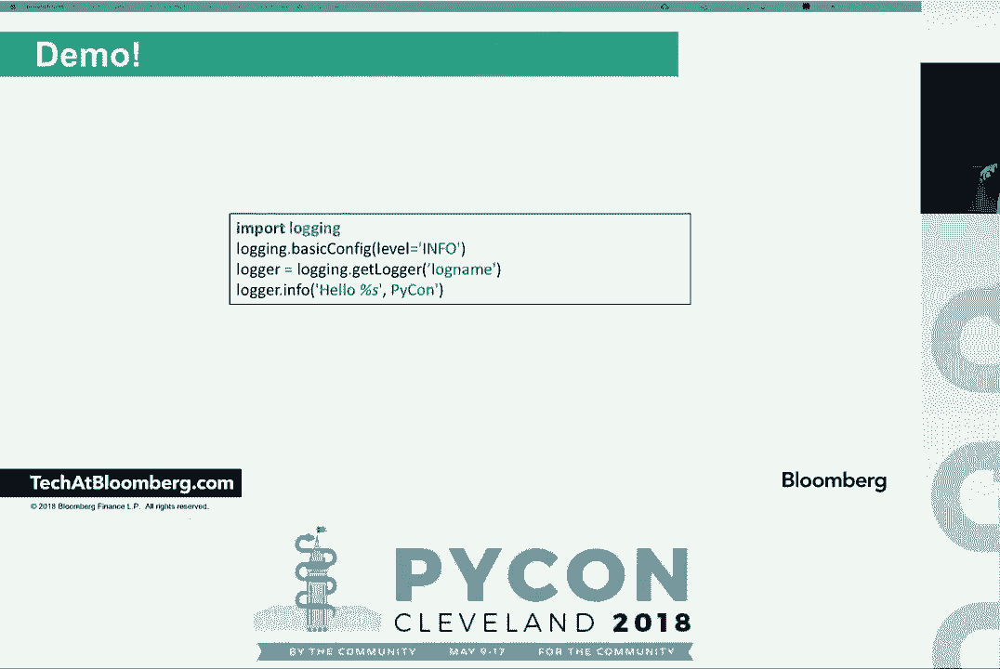

这种设计允许你在根记录器上配置一个通用的处理器（如写入文件），而在模块特定的子记录器上配置额外的处理器（如发送错误警报），所有日志最终都会汇集到根处理器的目标中。

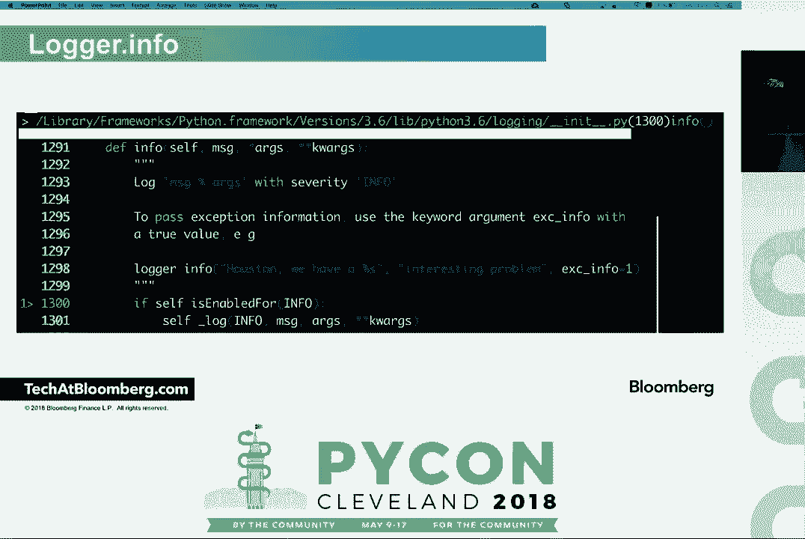

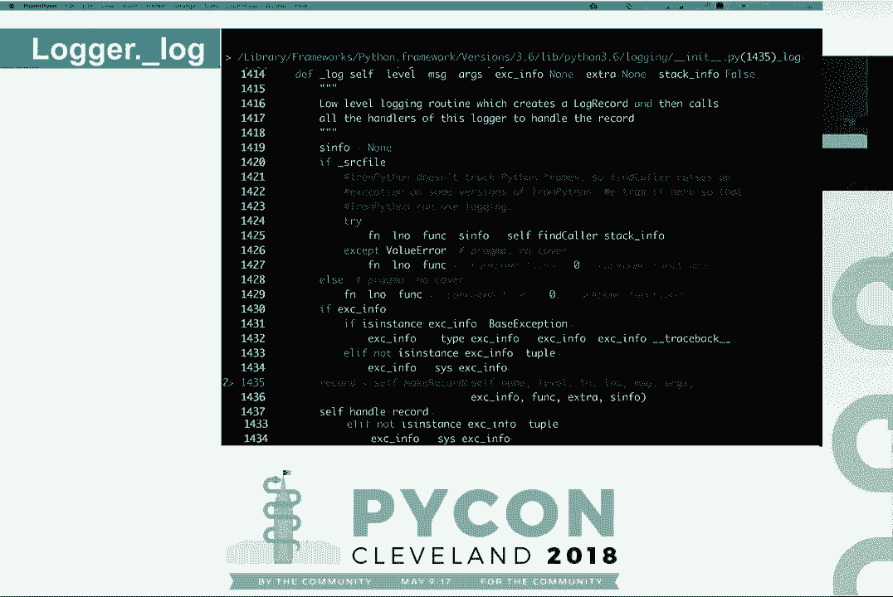

---

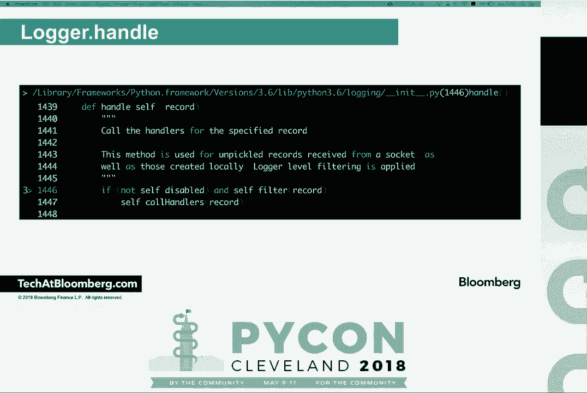

## 如何使用记录器？💻

现在我们已经了解了理论，本节中我们来看看在代码中实际如何使用记录器。

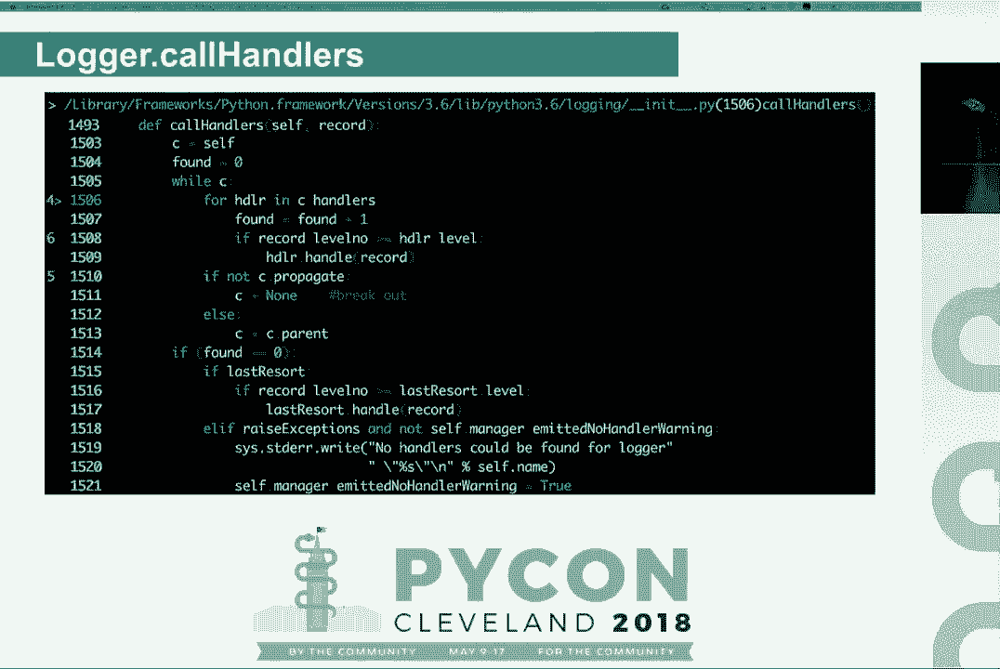

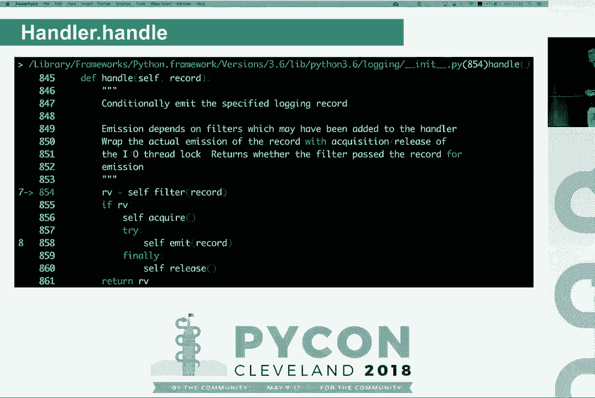

首先，获取一个记录器。最佳实践是使用 `__name__` 作为记录器名称，这样会自动创建与模块结构对应的层次结构。
```python
import logging


# 获取当前模块的记录器
logger = logging.getLogger(__name__)
```


然后，使用不同级别的方法记录消息。
```python
logger.debug(“This is a debug message”) # 最低级别，用于开发细节
logger.info(“User %s logged in successfully”, username) # 普通信息
logger.warning(“Disk space is low.”) # 警告信息
logger.error(“Failed to connect to database.”) # 错误信息
logger.critical(“System is out of memory!”) # 最高级别，严重错误
```

**重要技巧**：
*   **避免先格式化字符串**：不要使用 `logger.info(“User ” + username + ” logged in”)` 或 `logger.info(f”User {username} logged in”)`。应该传递模板和参数，如 `logger.info(“User %s logged in”, username)`。这样只有在消息真正需要输出时才会进行格式化，且能利用格式化器的特性。
*   **记录异常信息**：使用 `logger.exception()` 或在日志方法中设置 `exc_info=True` 参数，可以自动捕获并记录异常的堆栈跟踪，这对于调试至关重要。
    ```python
    try:
        # 可能出错的代码
        risky_operation()
    except Exception:
        logger.exception(“An error occurred during the operation.”)
        # 等同于 logger.error(“An error occurred…”, exc_info=True)
    ```

---

## 如何配置日志记录？⚙️

`logging` 模块的强大之处在于其灵活的配置方式。你可以将配置代码与业务逻辑完全分离。主要有三种配置方法。

以下是三种主要的配置方式：


1.  **使用 `basicConfig` 进行简单配置**：适用于脚本或简单应用。它提供了一种快速设置根记录器级别、格式和输出目标的方法。
    ```python
    import logging
    logging.basicConfig(
        level=logging.INFO,
        format=‘%(asctime)s - %(name)s - %(levelname)s - %(message)s’,
        filename=‘app.log’
    )
    # 注意：basicConfig 通常在程序开始处调用一次，多次调用只有第一次生效。
    ```


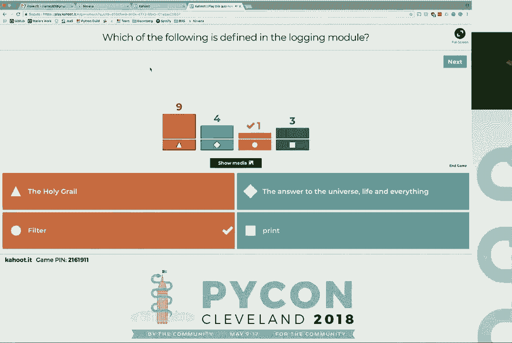


2.  **使用字典或文件进行高级配置**：这是最强大和推荐的方式，尤其对于复杂应用。你可以通过字典详细定义记录器、处理器、过滤器和格式化器。
    ```python
    import logging.config

    config_dict = {
        ‘version’: 1,
        ‘formatters’: {
            ‘detailed’: {
                ‘format’: ‘%(asctime)s %(module)s %(levelname)s %(message)s’
            },
        },
        ‘handlers’: {
            ‘console’: {
                ‘class’: ‘logging.StreamHandler’,
                ‘level’: ‘INFO’,
                ‘formatter’: ‘detailed’,
                ‘stream’: ‘ext://sys.stdout’,
            },
            ‘file’: {
                ‘class’: ‘logging.FileHandler’,
                ‘filename’: ‘errors.log’,
                ‘level’: ‘ERROR’,
                ‘formatter’: ‘detailed’,
            },
        },
        ‘loggers’: {
            ‘my_module’: {
                ‘level’: ‘DEBUG’,
                # 注意：此记录器没有直接分配处理器，日志会传播到根记录器
            },
        },
        ‘root’: {
            ‘level’: ‘INFO’,
            ‘handlers’: [‘console’, ‘file’]
        }
    }

    logging.config.dictConfig(config_dict)
    ```
    你也可以将配置写在JSON或YAML文件中，然后用 `dictConfig` 加载。

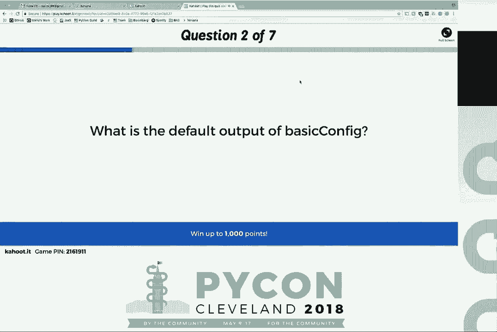


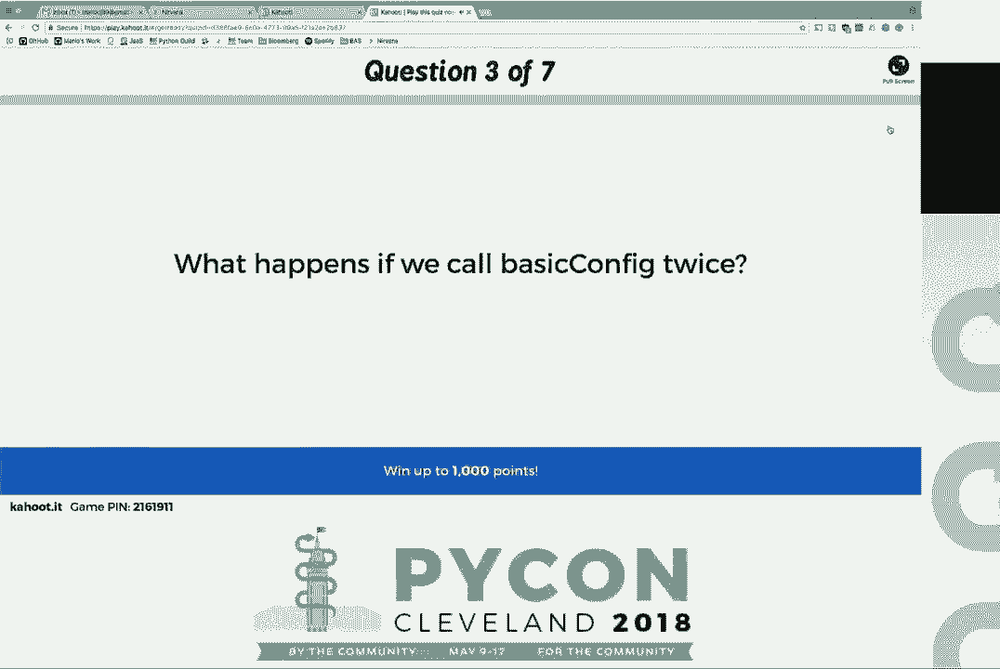

3.  **通过代码直接配置**：直接实例化并组装 `Logger`, `Handler`, `Formatter` 对象。这种方式最灵活，但也最繁琐。


---


## 实用配方与进阶主题 🍳


掌握了基本配置后，让我们看一些解决特定问题的实用“配方”。


以下是几个有用的日志记录模式：


*   **结构化日志记录（如JSON）**：便于日志收集系统（如ELK Stack, Splunk）进行解析和索引。你可以创建一个自定义的格式化器来输出JSON字符串。
*   **上下文信息（如请求ID）**：在Web应用中，为同一个请求的所有日志添加一个唯一的关联ID，便于追踪。这可以通过自定义过滤器或从Python 3.2开始引入的 `LoggerAdapter`，或更好的，从Python 3.6引入的 `logging.setLogRecordFactory` 来实现。
*   **缓冲处理器**：仅在发生错误时，才输出错误发生前的一些低级别（如`INFO`）日志，这对于复现问题场景非常有用。
*   **队列处理器用于多进程**：在 `multiprocessing` 环境中，多个进程不能安全地写入同一个文件。`QueueHandler` 和 `QueueListener` 可以将日志消息放入一个队列，由一个单独的进程负责处理写入，从而避免冲突。
*   **分离标准输出和标准错误**：像许多Unix工具一样，将 `INFO` 及以上级别日志输出到 `stderr`，将 `DEBUG` 日志输出到 `stdout`。这可以通过自定义过滤器实现。

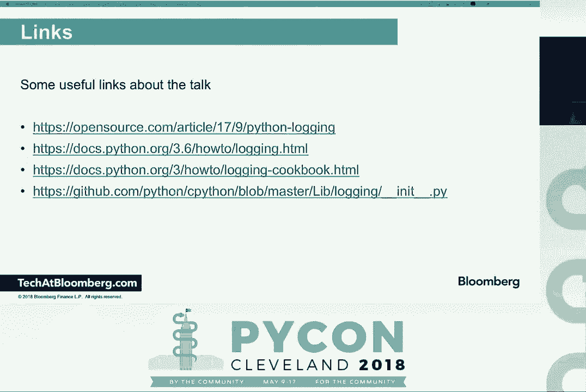


---

## 总结

本节课中我们一起深入探讨了Python的`logging`模块。我们从日志记录的重要性开始，逐步剖析了其核心架构：**记录器(Logger)**、**处理器(Handler)**、**格式化器(Formatter)** 和可选的**过滤器(Filter)**。我们学习了记录器的**层次结构**和**传播机制**，这是理解复杂配置的关键。

我们实践了如何获取记录器并记录不同级别的消息，强调了传递格式字符串参数而非预先格式化的最佳实践。最后，我们介绍了从简单的`basicConfig`到强大的基于字典的配置等多种配置方法，并了解了一些高级用例和实用配方。


记住，良好的日志记录是生产级应用程序的基石。花时间设计你的日志策略，将为未来的调试和监控带来巨大便利。当你遇到疑惑时，`logging`模块本身的源代码由于其优秀的设计，也是很好的学习资料。