# 012：现实世界中的类型检查


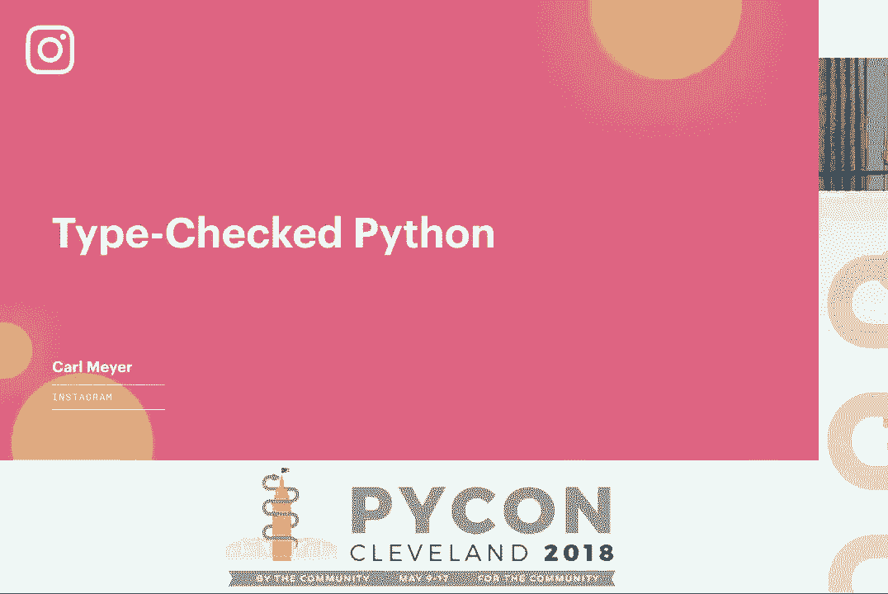

## 概述

在本节课中，我们将学习如何在现实世界中对 Python 代码进行类型检查。我们将探讨类型检查的好处、Python 类型系统的基础知识、如何为代码添加类型注解，以及如何利用渐进式类型检查来管理大型遗留代码库。

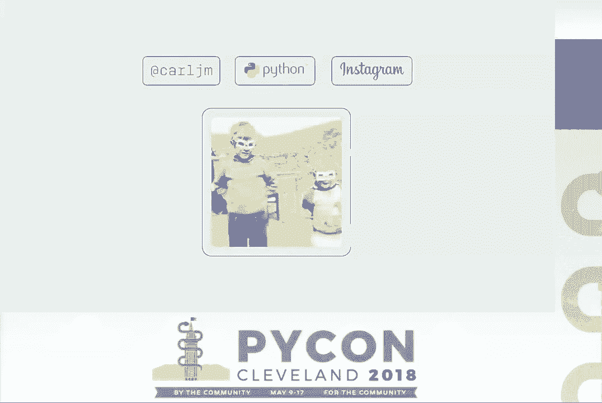

---

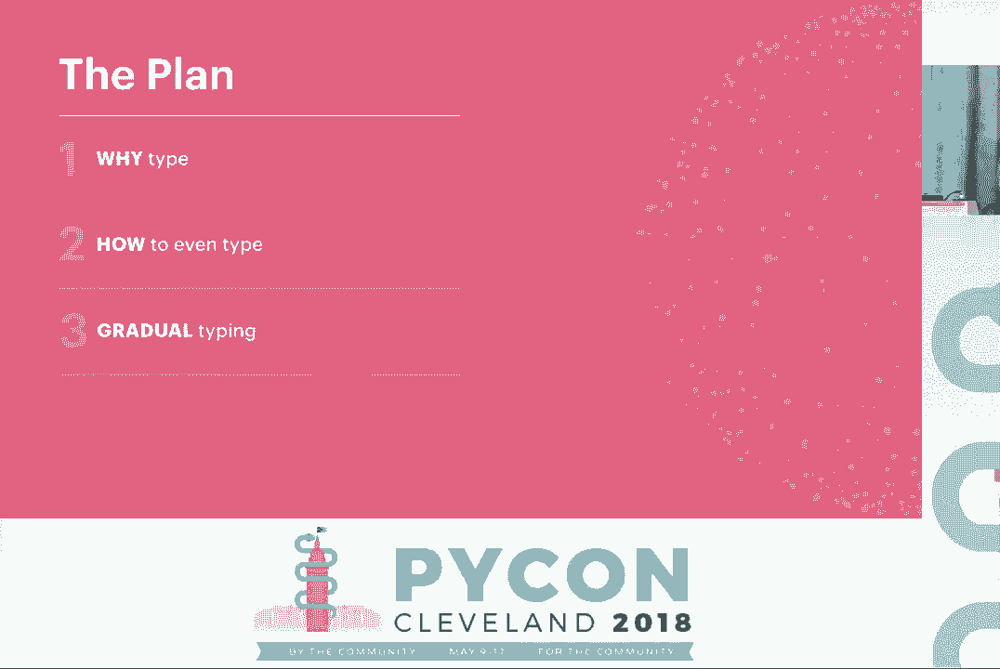


## 为什么要进行类型检查？ 🧐

如果你来自静态类型语言背景，可能会好奇没有静态类型的 Python 如何工作。但作为 Python 开发者，我们更常问的是：我用了 Python 很多年，一直很好，为什么需要类型注解？

考虑一个方法，它接受一个 `items` 参数。在 Python 的鸭子类型下，`items` 可以是任何可迭代对象，其中的每个项目需要有一个 `value` 属性，而该 `value` 又需要一个 `id` 属性。这种灵活性很好，但合同是隐式的。

代码只写一次，却要维护很久。六个月后，你可能需要重新阅读每一行代码来理解这个隐式合同。或者，你如何知道代码库的每个角落都遵守了这个合同？如果某个地方传入了一个 `value` 可能为 `None` 的对象，就会导致运行时属性错误。类型注解能明确解决这些问题，让你确切知道函数期待什么。

开发者多年来一直将类型信息放在文档字符串或注释里。但文档字符串的问题是，总会有人更新了函数签名却忘了更新文档，导致信息过时。类型注解可以被自动检查正确性，因此必须与代码保持同步。

你可能会想：“我可以通过测试来捕捉这些问题。” 测试和类型检查是互补的。测试覆盖了输入空间中的特定点，而类型注解通过声明参数类型，立即排除了整个无效的输入区域（例如，声明参数为整数，就排除了所有字符串、列表等输入），让你可以更专注于核心逻辑的测试。

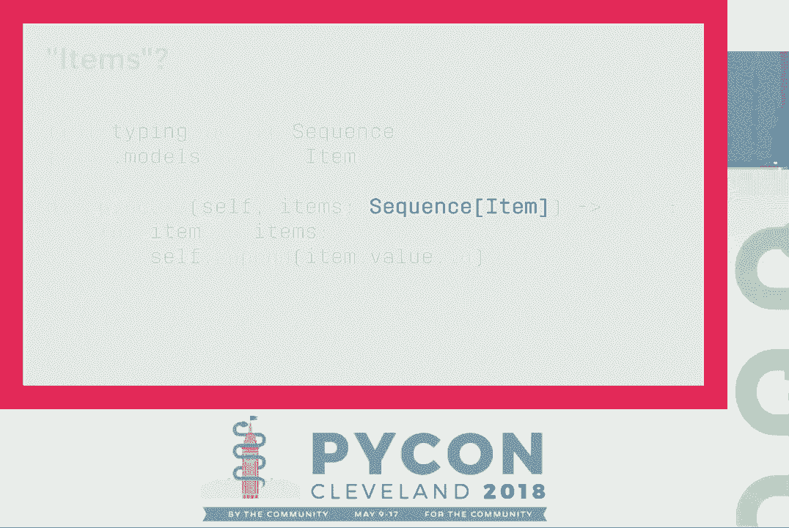

---


## 如何进行类型检查？ 🛠️

上一节我们讨论了类型检查的价值，本节我们来看看具体如何操作。首先，了解 Python 类型注解的基本语法。

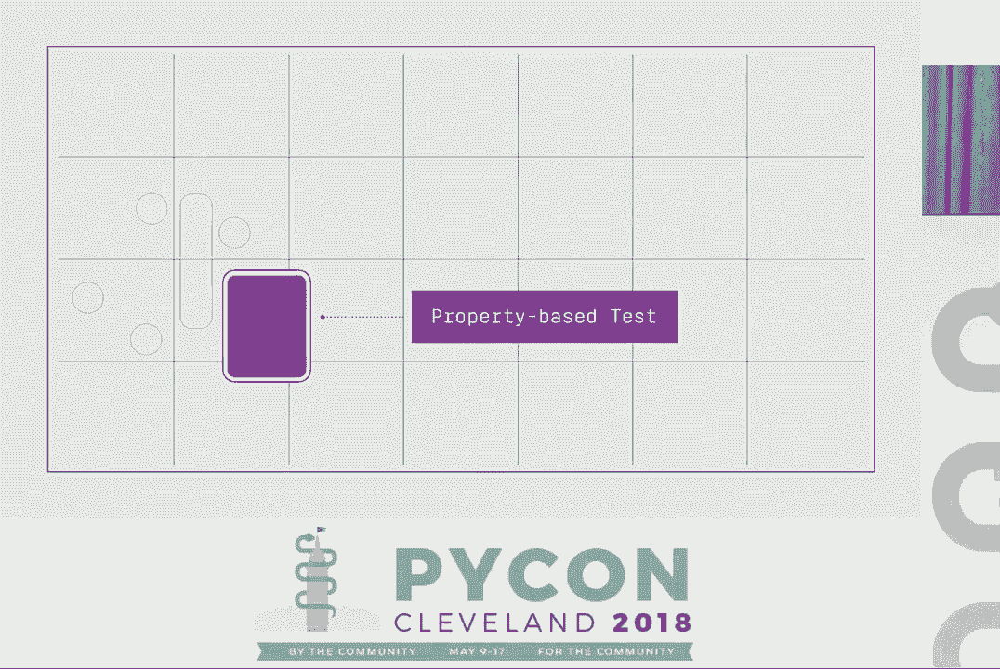


一个简单的平方函数，接受一个整数，返回其平方值：
```python
def square(x: int) -> int:
    return x * x
```
参数后加冒号和类型，函数定义后加箭头和返回类型。

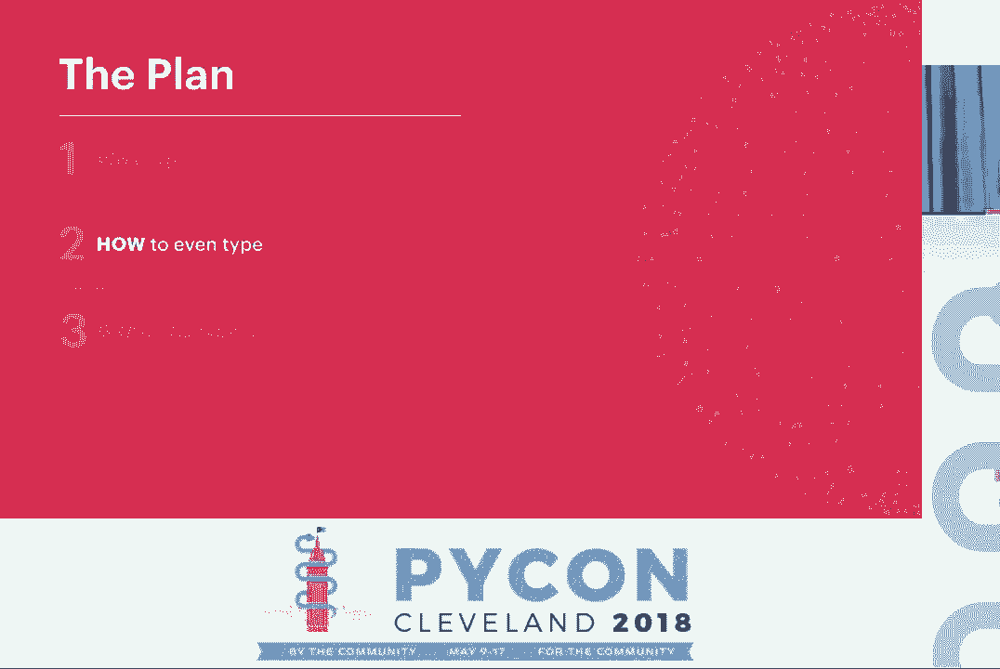

多次调用这个函数：
```python
square(3)
square("a string")  # 类型错误
square(4) + " and a string"  # 类型错误
```

使用 `mypy` 进行类型检查：
```bash
pip install mypy
mypy your_file.py
```
运行后会报告类型错误，例如将 `square` 应用于字符串。这不需要任何测试，静态分析器就能基于你声明的函数签名验证假设。

类型检查器可以推断很多信息。例如，在这个类中：
```python
class Photo:
    def __init__(self, width: int, height: int) -> None:
        self.width = width
        self.height = height

    def dimensions(self) -> Tuple[str, str]:
        return self.width, self.height  # 错误：返回的是整数，不是字符串
```
检查器知道 `self.width` 和 `self.height` 是整数。

对于容器类型，如果创建一个 `Photo` 对象列表并尝试添加字符串，检查器会报错（它假设你希望列表是同质的）。如果你想明确列表类型，可以添加变量注解（Python 3.6+）：
```python
from typing import List
my_list: List[str] = []
```

回顾一下，通常你需要注解函数签名（参数和返回值）。只有在类型检查器无法推断时，才需要注解变量，以避免冗余。

---

## 处理复杂类型 🔄

上一节介绍了基础类型注解，本节我们来看看如何处理更复杂的场景，比如函数可以接受或返回多种类型。

最简单的方法是使用 `Union` 类型：
```python
from typing import Union
def get_response() -> Union[Foo, Bar]:
    ...
```
一个非常常见的情况是函数可能返回一个值或 `None`，为此有特殊的 `Optional` 类型：
```python
from typing import Optional
def get_foo(foo_id: Optional[int]) -> Optional[Foo]:
    ...
```
`Optional[Foo]` 等价于 `Union[Foo, None]`。

但使用 `Optional` 作为返回类型有个问题：调用者必须检查返回值是否为 `None`，否则类型检查器会报错。即使你知道在某些情况下返回值不会是 `None`，检查器也不知道。

更好的选择是使用 `@overload` 装饰器，向类型检查器提供更多信息：
```python
from typing import overload

@overload
def get_foo(foo_id: None) -> None: ...

@overload
def get_foo(foo_id: int) -> Foo: ...

def get_foo(foo_id: Optional[int]) -> Optional[Foo]:
    if foo_id is None:
        return None
    return lookup_foo(foo_id)
```
`@overload` 定义只为类型检查器提供信息，运行时只使用最后一个实际定义。这样，调用 `get_foo(5)` 时，检查器就知道返回的是 `Foo`，无需额外检查。

我们还可以使用泛型来编写更灵活、类型安全的函数。定义一个类型变量作为占位符：
```python
from typing import TypeVar
AnyStr = TypeVar('AnyStr', str, bytes)  # 限制为 str 或 bytes

def concat(a: AnyStr, b: AnyStr) -> AnyStr:
    return a + b
```
类型变量确保在一次调用中，`a` 和 `b` 必须是同一种类型（都是 `str` 或都是 `bytes`）。调用 `concat("hello", b"world")` 会报错，而 `concat("a", "b")` 的返回类型会被推断为 `str`。

`AnyStr` 在 `typing` 模块中已内置，无需自己定义。

总结一下，可以适度使用 `Union` 和 `Optional`。`@overload` 和泛型允许我们向类型检查器教授更多关于函数不变性的知识，使函数对调用者更友好。

---

## 鸭子类型与协议 🦆

你可能在想：我的鸭子类型呢？我喜欢编写能接受任何具有特定方法或属性的对象的函数。

例如，一个调用对象 `render` 方法的函数。这类似于 Python 的内置协议（如 `len` 调用 `__len__`）。如何为其添加类型？

尝试使用 `object` 类型不行，因为 `object` 没有 `render` 属性。使用 `Any` 类型（一个“逃生口”，与所有类型兼容）虽然能让检查通过，但意味着失去了类型安全性，可能传入没有 `render` 方法的对象。

解决方案是使用 **协议**（Protocol），它提供了结构子类型（structural subtyping）。你需要从 `typing_extensions` 导入（未来会进入 `typing`）：
```python
from typing_extensions import Protocol

class Renderable(Protocol):
    def render(self) -> str: ...

def render_it(obj: Renderable) -> str:
    return obj.render()

class MyWidget:
    def render(self) -> str:
        return "rendered!"

render_it(MyWidget())  # 类型检查通过
```
只要一个类具有符合协议定义的结构（这里是有返回 `str` 的 `render` 方法），类型检查器就认为它是该协议的子类型，无需显式继承。这完美支持了鸭子类型。

---

## 类型系统的“逃生通道” 🚪

严格的静态类型检查适合大部分简单、直接的代码。但在某些情况下，你需要利用 Python 的动态特性，或者处理大量遗留代码。Python 类型系统提供了一些“逃生通道”。

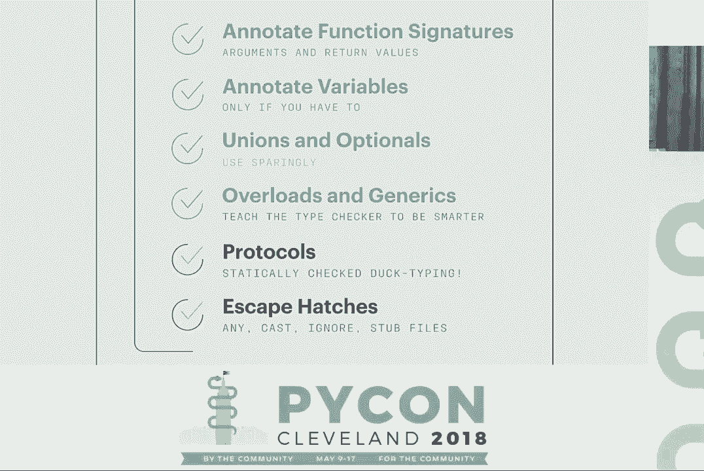

1.  **`Any` 类型**：我们已经见过。它是所有类型的子类型和超类型，关闭了类型检查。例如，一个包装器代理可能不知道被代理对象的具体属性和类型，可以声明返回 `Any`。
2.  **`cast` 函数**：让你对类型检查器“撒谎”，断言某个表达式的类型。
    ```python
    from typing import cast, Dict
    config = get_config_var()  # 类型为 Any
    specific_config = cast(Dict[str, int], config)  # 告诉检查器这是 Dict[str, int]
    ```
    你需要确保断言是正确的。
3.  **`# type: ignore`**：忽略某一行的所有类型错误。应保留给无法解决的类型检查器限制或错误。使用时最好加上解释性注释。
4.  **存根文件（.pyi）**：用于为 C 扩展或无法直接分析的模块提供类型信息。例如，为 `fastmath` 编译模块创建 `fastmath.pyi`：
    ```python
    # fastmath.pyi
    def square(x: int) -> int: ...
    class Complex:
        real: float
        imag: float
    ```
    这样类型检查器就能理解这些函数和类的接口。

---


## 渐进式类型与工具 🚀

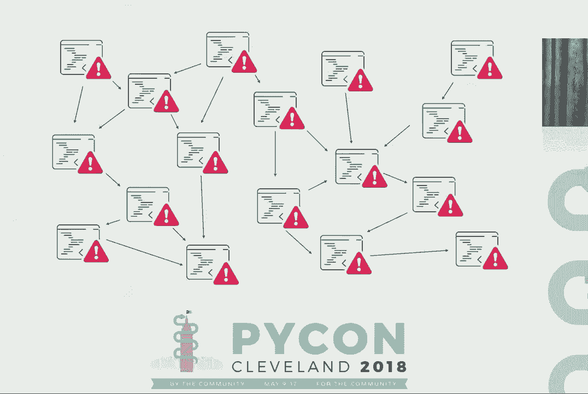

我们已经开始触及渐进式类型。它意味着即使程序不是完全类型化的，也可以进行类型检查。`Any` 类型就是一个例子。

更重要的是，渐进式类型允许我们逐步向代码库添加类型。规则是：**只有带有类型注解的函数会被检查**。没有注解的函数被认为可以接受和返回任何类型，其函数体甚至不会被检查。

这允许我们逐个函数、逐个模块地引入类型。从最核心、最常用的函数开始，收益最大。使用持续集成（CI）来保护进展，防止新的类型错误被引入。

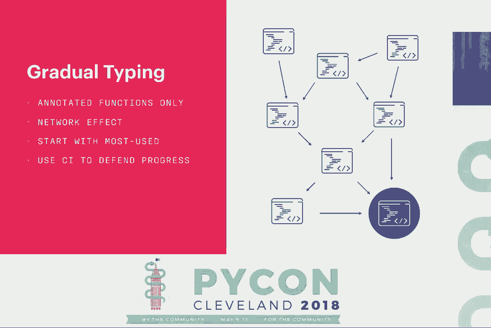

`mypy` 提供了严格性选项，可以对已完全类型化的模块设置更严格的规则（例如，禁止未类型化的函数或 `Any` 类型）。

但是，为大型遗留代码库手动添加类型注解可能非常耗时和痛苦。你需要追溯所有调用路径来理解类型。

为此，Instagram 开发并开源了 **MonkeyType** 工具。它通过在运行时追踪实际传入的类型来自动生成类型存根。

以下是使用 MonkeyType 的步骤：
1.  `pip install monkeytype`
2.  使用 `monkeytype run your_script.py` 运行你的代码（可以是测试或生产流量采样）来收集类型信息。
3.  使用 `monkeytype stub your.module` 查看生成的类型存根。
4.  使用 `monkeytype apply your.module` 将类型注解自动应用到你的源代码中。

这极大地加速了为遗留代码添加类型注解的过程。

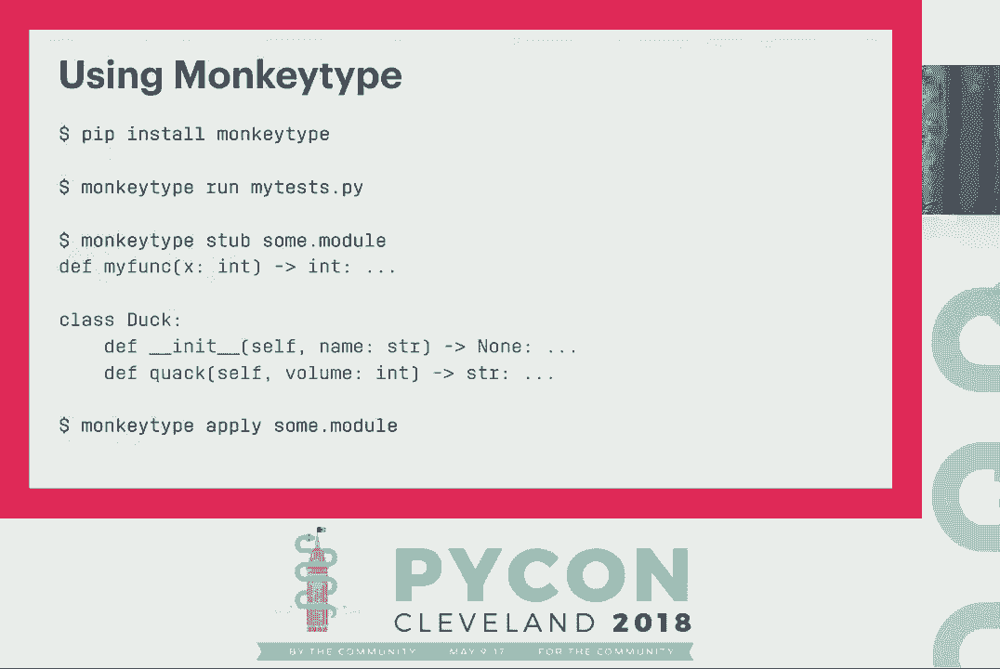

---

## 未来与总结 🌟

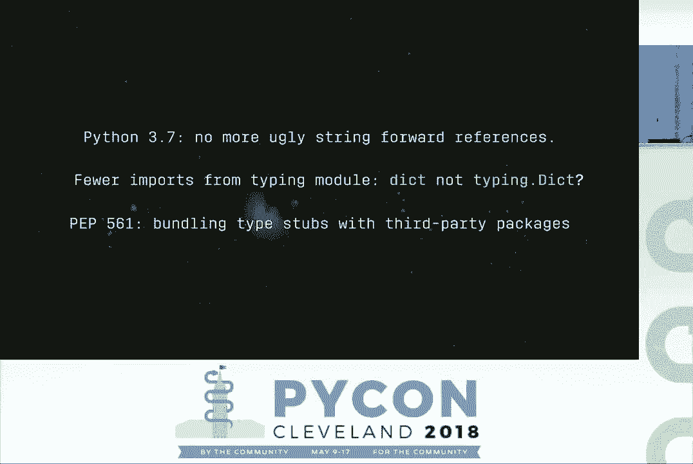

Python 类型检查正在不断发展。例如，Python 3.7 的 `from __future__ import annotations` 可以避免字符串形式的前向引用。未来可能允许直接使用小写 `dict`、`list` 等作为类型注解。PEP 已标准化了如何将类型存根与第三方包捆绑分发。

类型检查的 Python 已经可用且有效。在 Instagram，类型检查阻止了带有类型错误的代码进入生产环境，开发者们积极使用它，类型覆盖率有机增长。MonkeyType 帮助我们将数百万行代码的一半进行了类型注解。


除了 `mypy`，还有更快的类型检查器如 Facebook 的 `pyre`，适合超大型代码库。

### 本节课总结

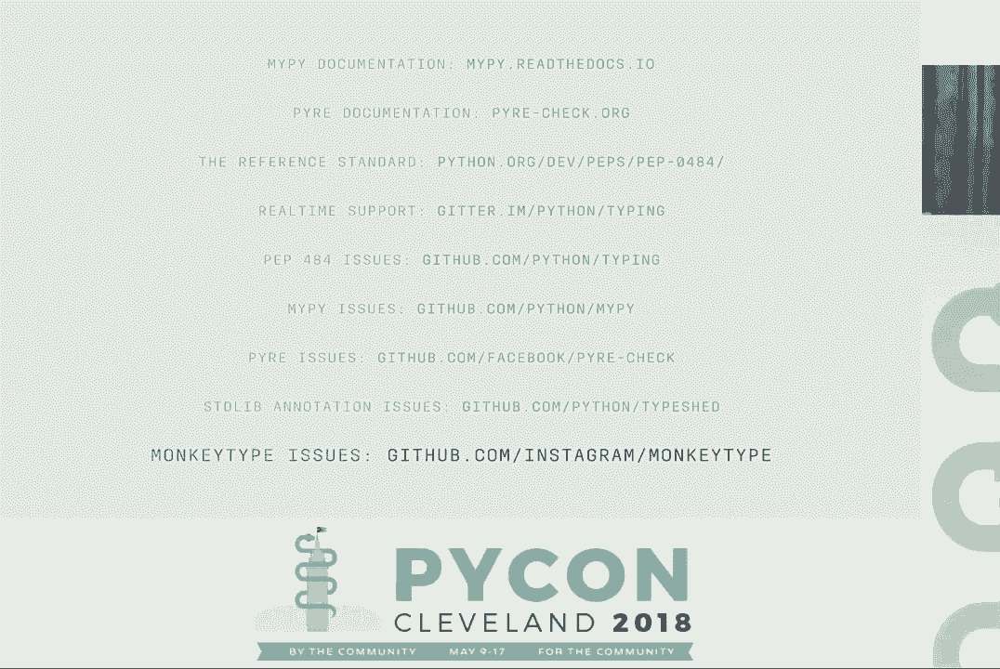

在本节课中，我们一起学习了：
*   **为什么**要对 Python 进行类型检查：提高代码可读性、可维护性，并与测试互补，提前捕获错误。
*   **如何**进行类型检查：使用 `mypy` 等工具，学习基础注解语法、`Union`/`Optional`、泛型和 `@overload`。
*   如何用 **协议（Protocol）** 为鸭子类型代码添加类型安全。
*   了解类型系统的 **“逃生通道”**（`Any`, `cast`, `# type: ignore`, 存根文件）以处理动态代码或遗留代码。
*   利用 **渐进式类型** 规则逐步改造代码库，并使用 **MonkeyType** 等工具自动化类型注解过程。


类型检查的 Python 是一个强大的工具，能显著提升大型项目的开发体验和代码质量。