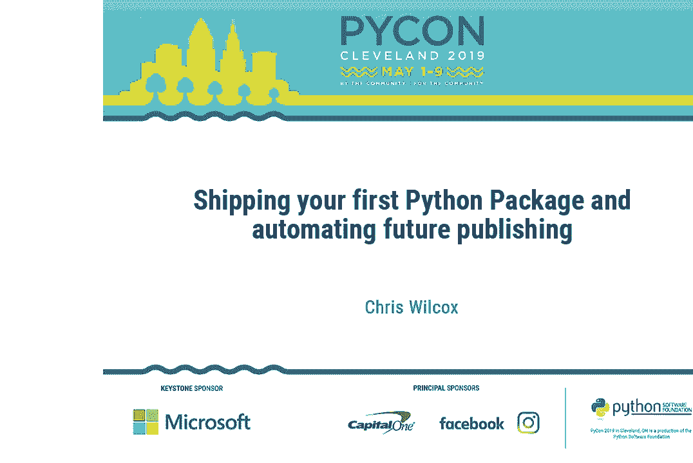
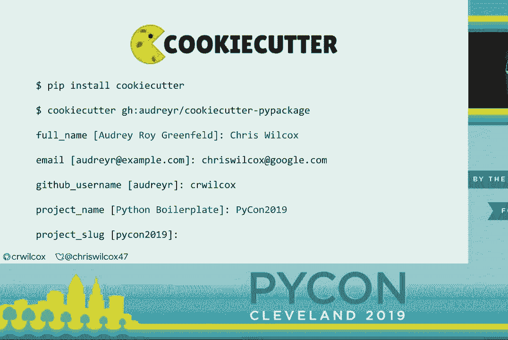
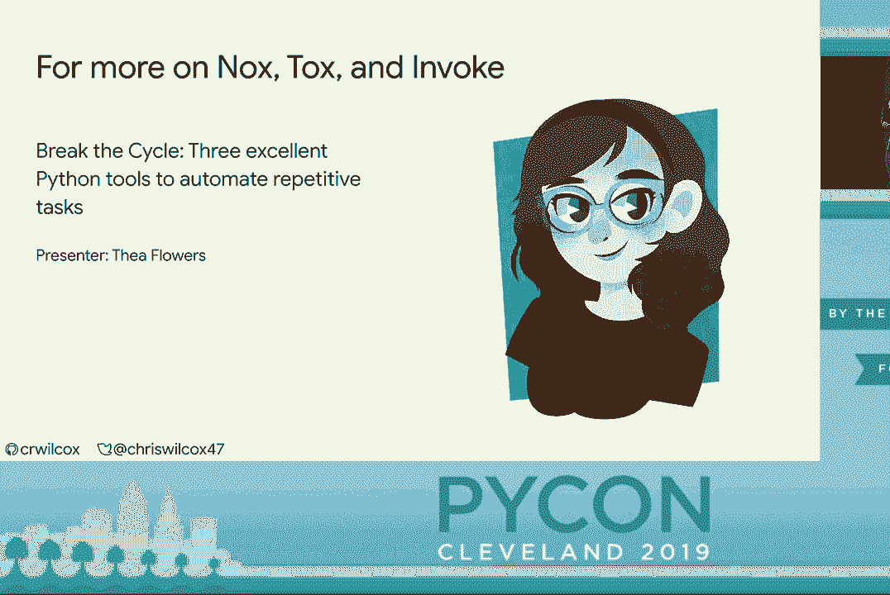
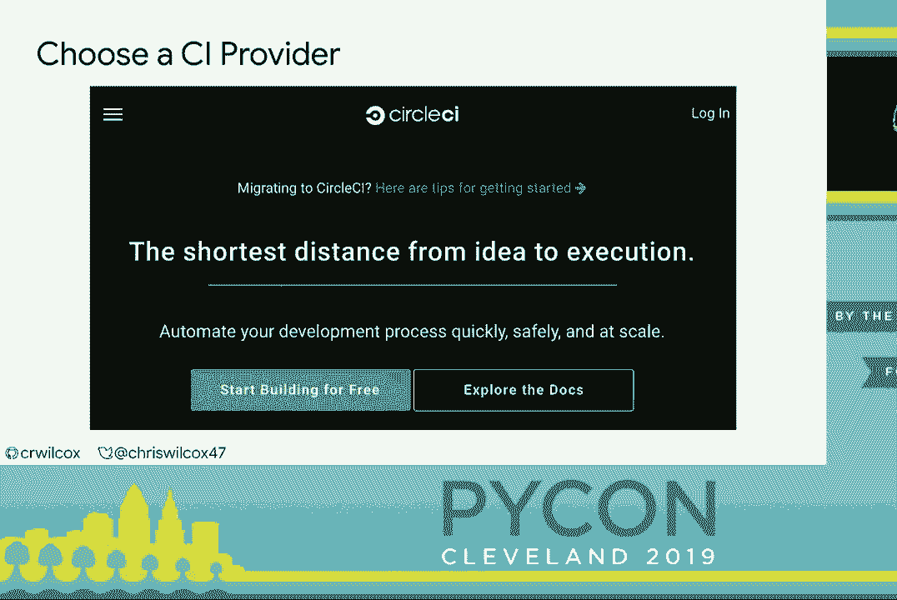
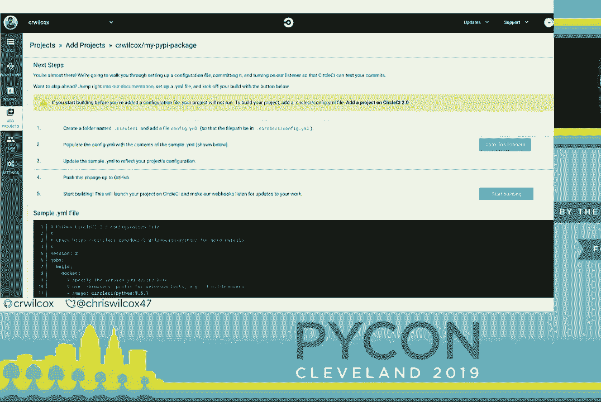
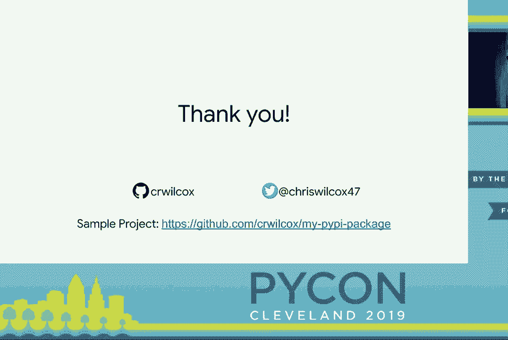

# Python包发布教程：P12：发布你的第一个Python包并自动化未来的发布 🚀



在本教程中，我们将学习如何创建并发布你的第一个Python包到PyPI（Python包索引），并探讨如何通过自动化工具来简化后续的发布和维护流程。我们将从最基础的步骤开始，逐步添加更多元数据、依赖管理和自动化测试，最终实现一个完整的、可自动发布的包。

---

## 什么是PyPI？📦

PyPI是Python包维护者使用的包存储库。它是Python生态系统的重要组成部分，使得开发者能够轻松地分享和安装代码库，从而促进了整个社区的学习和创新。

随着Python和PyPI的不断发展，发布过程对许多人来说可能显得有些神秘。本教程的目标是证明这个过程其实很简单，每个人都能学会。

---

## 什么是Python包？🐍

Python包是你可以部署给其他用户使用的模块、类或函数的集合。下面是一个非常简单的例子：

我们有一个名为`mypackage`的模块，它包含一个`__init__.py`文件和一个`module.py`文件。`module.py`中有一个简单的函数`spam`，它总是返回字符串`"eggs"`。

```python
# mypackage/__init__.py
# 这是一个空文件，用于标识这是一个包

# mypackage/module.py
def spam():
    return "eggs"
```

这个简单的结构足以展示如何部署到PyPI。

---

## 第一步：创建 `setup.py` 文件 📄

为了将包部署到PyPI，我们需要一个`setup.py`文件。最基本的`setup.py`只需要四个字段：

*   **`name`**: 包的名称。
*   **`version`**: 包的版本号。
*   **`description`**: 包的简短描述。
*   **`packages`**: 指定包中包含哪些内容。

`setuptools.find_packages()`是一个辅助函数，它会自动发现当前目录下需要包含的包。

```python
# setup.py
from setuptools import setup, find_packages

setup(
    name='mypackage',
    version='0.0.1',
    description='一个非常简单的示例包',
    packages=find_packages(),
)
```

---

## 第二步：本地测试你的包 ✅

在发布之前，我们应该先在本地测试包是否能正常工作。

首先，创建一个虚拟环境并进入。然后，使用`pip`以“可编辑”模式安装你的包。这种模式允许你在修改代码后无需重新安装。

```bash
pip install -e .
```

安装完成后，打开Python交互式环境（REPL），导入你的包并测试函数。

```python
>>> import mypackage
>>> from mypackage.module import spam
>>> spam()
'eggs'
```

如果一切正常，说明你的包在本地可以正确工作。

---

## 第三步：发布到测试PyPI 🧪

在正式发布到PyPI之前，最好先在测试PyPI上进行演练。首先，安装必要的工具：`twine`和`wheel`。

```bash
pip install twine wheel
```

接下来，构建你的包。`sdist`命令创建源代码分发，`bdist_wheel`命令创建二进制wheel分发。虽然纯Python包不一定需要wheel，但提供它是一种良好的实践。

```bash
python setup.py sdist bdist_wheel
```

这个命令会在`dist/`目录下生成分发文件。现在，使用`twine`将它们上传到测试PyPI。

```bash
twine upload --repository-url https://test.pypi.org/legacy/ dist/*
```

最后，你可以尝试从测试PyPI安装你的包。

```bash
pip install --index-url https://test.pypi.org/simple/ mypackage
```

恭喜！你现在已经成功发布了一个最基础的Python包。



---


## 第四步：完善包的元数据 🏷️

虽然最基本的包可以工作，但为了给用户提供更好的体验，我们应该添加更多元数据。

以下是`setup.py`中可以添加的一些重要字段：

*   **作者信息**：`author`和`author_email`，让用户知道如何联系你。
*   **项目链接**：`url`，通常是代码仓库的地址。
*   **分类器**：`classifiers`，帮助用户在PyPI上发现和理解你的包。例如，说明开发状态、支持的Python版本、操作系统和主题。

```python
classifiers=[
    'Development Status :: 3 - Alpha',
    'Programming Language :: Python :: 3',
    'Programming Language :: Python :: 3.5',
    'Programming Language :: Python :: 3.6',
    'Programming Language :: Python :: 3.7',
    'Operating System :: OS Independent',
    'Topic :: Software Development :: Libraries',
],
```

*   **许可证**：`license`，这是最重要的部分之一。没有许可证，许多用户（尤其是企业用户）将无法合法使用你的代码。常见的许可证有MIT、Apache 2.0和GPL。
*   **详细描述**：`long_description`和`long_description_content_type`，可以从`README.md`文件读取，为用户提供安装和使用说明。

一个更完善的`setup.py`示例如下：

```python
from setuptools import setup, find_packages
from os import path

this_directory = path.abspath(path.dirname(__file__))
with open(path.join(this_directory, 'README.md'), encoding='utf-8') as f:
    long_description = f.read()

setup(
    name='mypackage',
    version='0.0.1',
    description='一个非常简单的示例包',
    long_description=long_description,
    long_description_content_type='text/markdown',
    author='你的名字',
    author_email='your.email@example.com',
    url='https://github.com/yourusername/mypackage',
    packages=find_packages(),
    classifiers=[
        'Development Status :: 3 - Alpha',
        'Programming Language :: Python :: 3',
        'Programming Language :: Python :: 3.5',
        'Programming Language :: Python :: 3.6',
        'Programming Language :: Python :: 3.7',
        'Operating System :: OS Independent',
        'License :: OSI Approved :: MIT License',
        'Topic :: Software Development :: Libraries',
    ],
    python_requires='>=3.5',
    install_requires=[
        'requests', # 示例依赖
    ],
)
```

---



## 第五步：管理依赖和凭据 🔐

上一节我们完善了包的基本信息，本节我们来关注依赖管理和发布凭据。

**管理依赖**：使用`install_requires`字段声明你的包所依赖的其他库。这样，当用户安装你的包时，`pip`会自动安装这些依赖。



```python
install_requires=[
    'requests>=2.20.0',
],
```

**管理发布凭据**：向PyPI上传包需要用户名和密码。有几种管理方式：
1.  **交互式输入**：运行`twine upload`时在命令行输入。
2.  **使用`.pypirc`文件**：在主目录创建此文件，存储凭据（注意安全，避免提交到代码库）。
3.  **使用`keyring`库**：一个更安全的密码管理器。

---



## 第六步：利用模板和自动化 🛠️

随着包的增多，手动编写`setup.py`和项目结构会变得繁琐。以下方法可以提高效率：

*   **复用代码**：从你之前的成功项目中复制`setup.py`并进行修改。
*   **使用Cookiecutter**：这是一个项目模板工具，可以一键生成包含`setup.py`、文档结构、测试框架等在内的完整项目骨架。
*   **参考官方示例**：PyPI提供了一个详尽的示例项目，注释了几乎所有`setup.py`参数的使用方法。

---

## 第七步：自动化测试和发布 🤖

手动执行测试和发布流程容易出错且难以扩展。自动化可以带来一致性、可重复性和团队协作的便利。

**自动化测试**：我们需要测试包在多个Python版本下的兼容性。可以使用`tox`或`nox`等工具。
*   `tox`通过`.ini`配置文件定义测试环境。
*   `nox`使用Python函数定义任务，更加灵活。

以下是一个`noxfile.py`的示例，它会在Python 3.5, 3.6, 3.7下运行测试并构建文档：

```python
import nox

@nox.session(python=['3.5', '3.6', '3.7'])
def tests(session):
    session.install('pytest', 'mock')
    session.install('.')
    session.run('pytest', *session.posargs)

@nox.session
def docs(session):
    session.install('sphinx')
    session.install('.')
    session.run('sphinx-build', 'docs', 'docs/_build')
```

**持续集成与自动发布**：我们可以将自动化测试和发布流程集成到CI/CD服务中，如CircleCI、Travis CI等。

一个典型的流程是：
1.  每次推送代码或创建拉取请求时，CI运行所有测试。
2.  当给代码库打上版本标签（如`v1.0.0`）时，CI在通过测试后自动执行发布流程（构建、上传到PyPI）。

在CI配置中，你需要通过环境变量安全地设置PyPI凭据。以下是一个简化的CircleCI配置思路：

```yaml
# .circleci/config.yml
workflows:
  version: 2
  test_and_deploy:
    jobs:
      - test_py35
      - test_py36
      - test_py37
      - deploy:
          requires:
            - test_py37 # 部署前确保测试通过
          filters:
            tags:
              only: /^v\d+\.\d+\.\d+$/ # 仅对版本标签触发部署
            branches:
              ignore: /.*/

jobs:
  test_py37:
    docker:
      - image: circleci/python:3.7
    steps:
      - checkout
      - run: pip install nox
      - run: nox -s tests

  deploy:
    docker:
      - image: circleci/python:3.7
    steps:
      - checkout
      - run: pip install twine wheel
      - run: python setup.py sdist bdist_wheel
      - run: twine upload dist/*
        # 注意：这里需要通过环境变量或上下文提供PYPI_USERNAME和PYPI_PASSWORD
```

---




## 总结 📚

在本教程中，我们一起学习了如何发布Python包：

1.  **创建基础包**：我们从一个简单的模块开始，编写了最基本的`setup.py`文件。
2.  **本地测试**：我们学会了如何在本地以可编辑模式安装和测试包。
3.  **发布到测试环境**：我们使用`twine`将包发布到测试PyPI进行演练。
4.  **完善元数据**：我们添加了作者、描述、分类器、许可证等关键信息，使包更专业、更易用。
5.  **管理依赖和凭据**：我们讨论了如何声明依赖以及安全管理发布凭据的几种方式。
6.  **提高效率**：我们了解了如何使用模板和复用代码来加速新项目的创建。
7.  **实现自动化**：我们探索了使用`nox`进行多版本自动化测试，并利用CI/CD服务（如CircleCI）实现测试和发布的完整自动化流水线。


通过掌握这些知识和工具，你现在可以自信地创建、发布并维护高质量的Python包，为丰富的Python生态系统贡献自己的力量。祝你发布顺利！