# 重构的艺术：P15：何时重构，何时保持现状 🧑‍💻

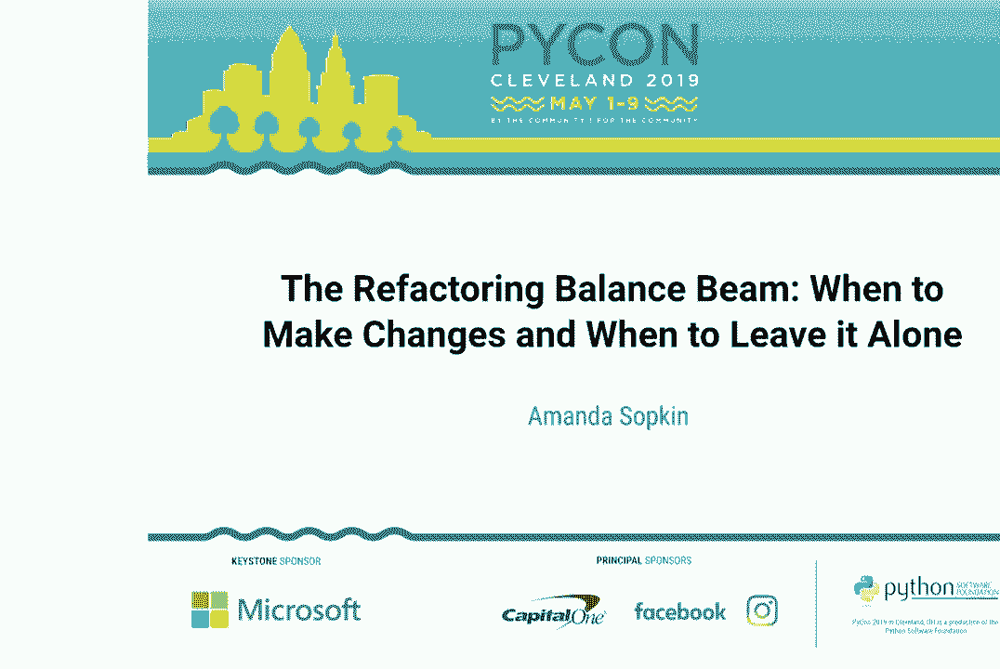

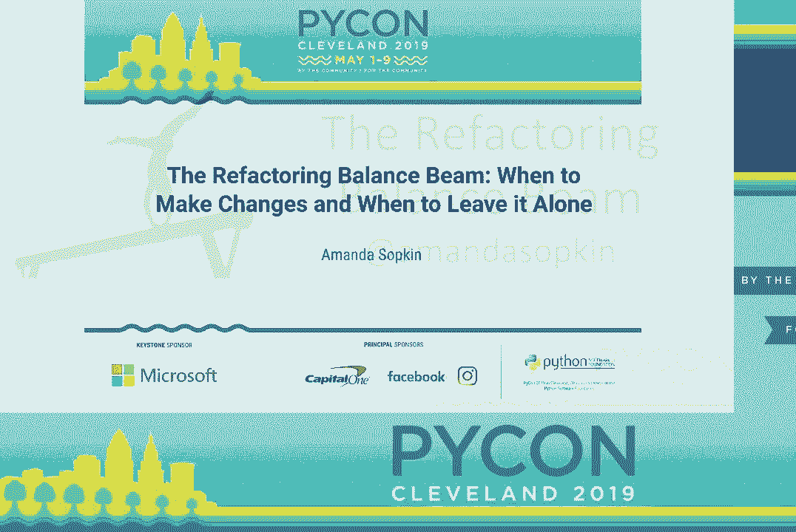

在本节课中，我们将学习如何识别代码中的问题（即“代码异味”），并掌握重构的时机与方法。我们将探讨如何在不改变软件外部行为的前提下，改善代码的内部结构，使其更易于理解和维护。

---

## 概述：重构的平衡木

重构是对现有代码进行重组的过程，其核心是**在不改变外部行为的前提下，提升代码的可读性与可维护性**。这个过程就像走平衡木，需要在“值得进行的更改”和“应该保持现状的部分”之间找到平衡点。

---

## 重构的哲学与动机

上一节我们介绍了重构的基本概念，本节中我们来看看驱动我们进行重构的核心理念。

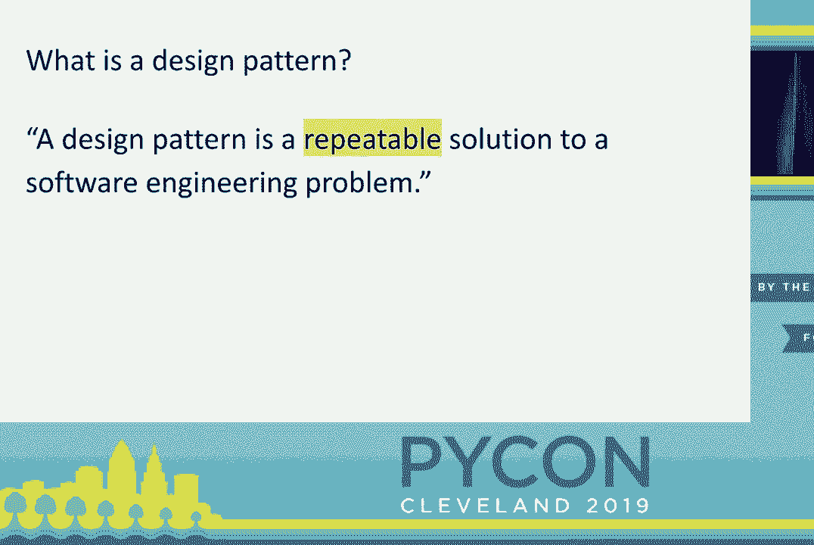

Python之禅为我们提供了很好的指导原则：
*   **美胜于丑**
*   **显式胜于隐式**
*   **简单胜于复杂**
*   **可读性很重要**
*   **应该有一种——且最好只有一种——明显的方式去实现它**
*   **如果实现难以解释，那就是个坏主意**

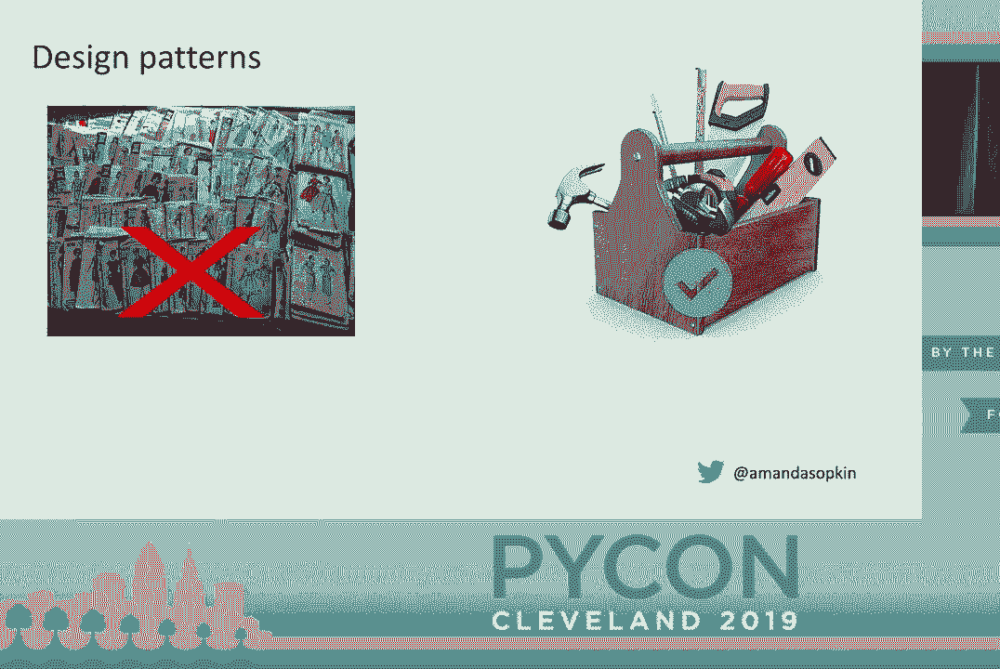

重构的最终目的是**增进理解**，无论是对于编写者还是未来的维护者。如果重构使代码变得更复杂，那我们就偏离了目标。

在开始重构前，必须牢记：**始终需要一个回滚策略**。即使是简单的重命名，也可能对生产环境产生意想不到的影响。一个可靠的测试套件是确保重构安全性的基本工具。

---

## 识别代码异味：何时需要重构

代码异味是源代码中可能指示更深层次问题的特征。它们并非绝对的错误，而是提醒我们值得仔细检查的信号。我们将代码异味分为三大类：**太长/太复杂**、**不够有用**和**糟糕的面向对象设计**。

### 处理“太长/太复杂”的代码

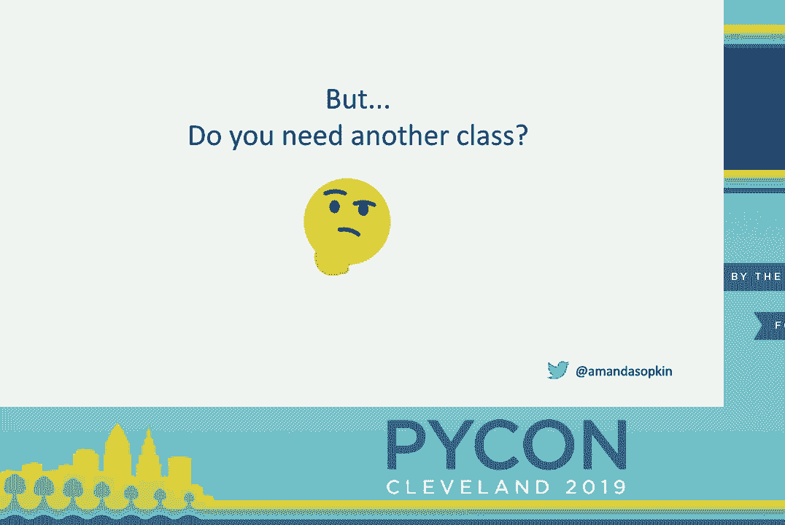

以下是几种常见的“太长”类代码异味及其解决方法。

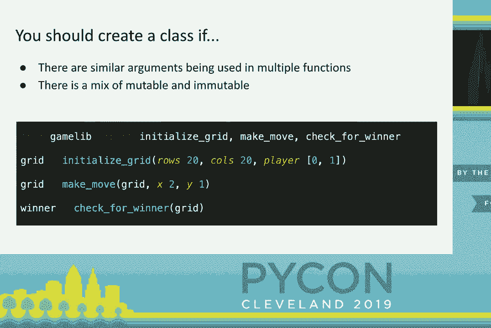

**1. 重复代码**
如果你在多个地方编写了相同或相似的代码，这是一个强烈的信号，表明你应该将其提取到一个独立的方法或类中。

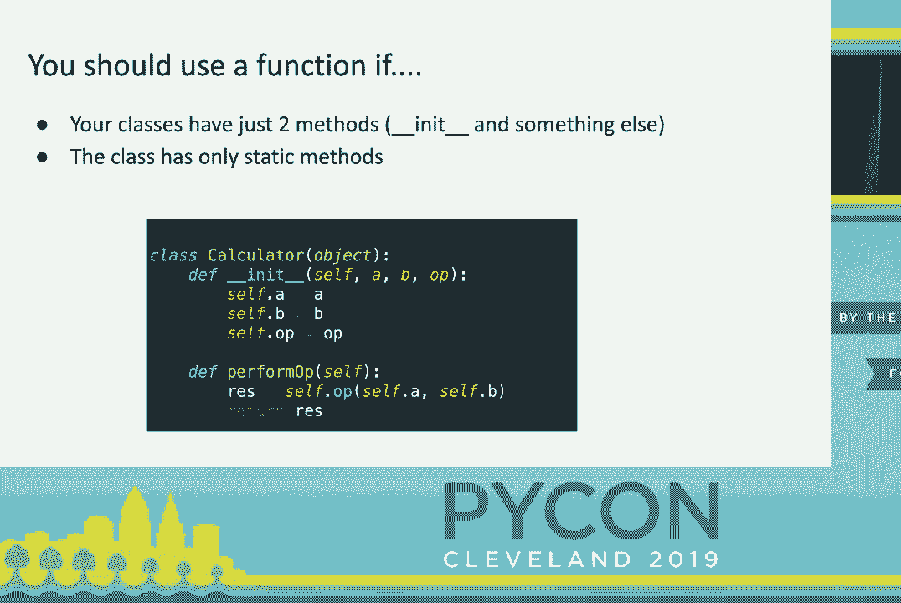

**2. 过长方法**
判断方法是否过长的标准不是行数，而是其复杂性和单一职责。如果你无法为方法想出一个清晰、简洁的名称来描述其功能，它很可能需要被拆分。

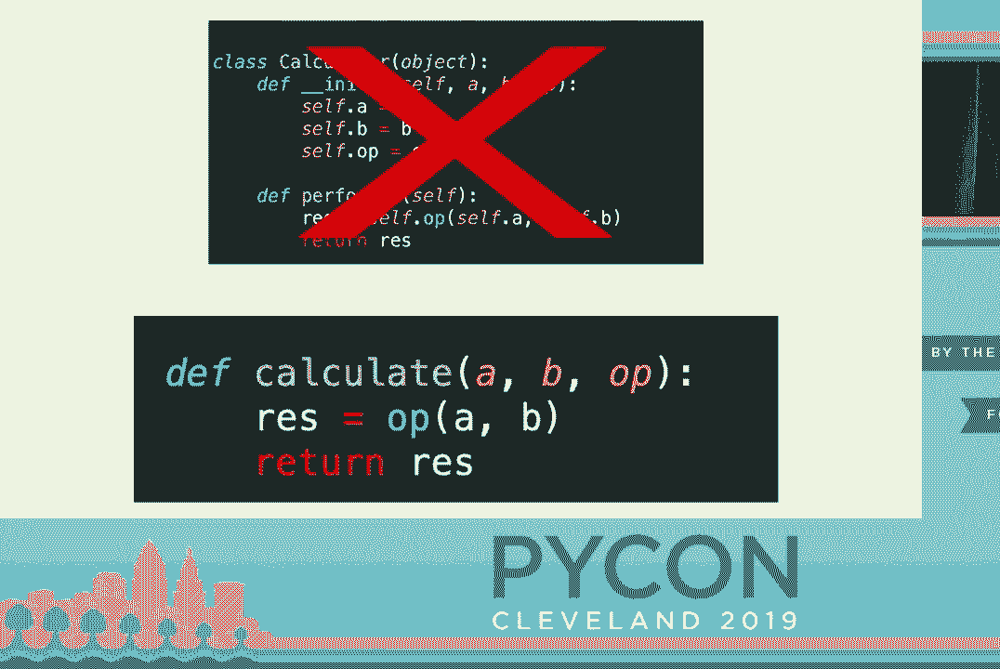

**3. 过长参数列表**
当一组参数频繁地一起出现时，可以考虑将它们封装成一个对象。

```python
# 重构前：参数分散
def process_data(start_time, end_time, user_id, data_type):
    ...

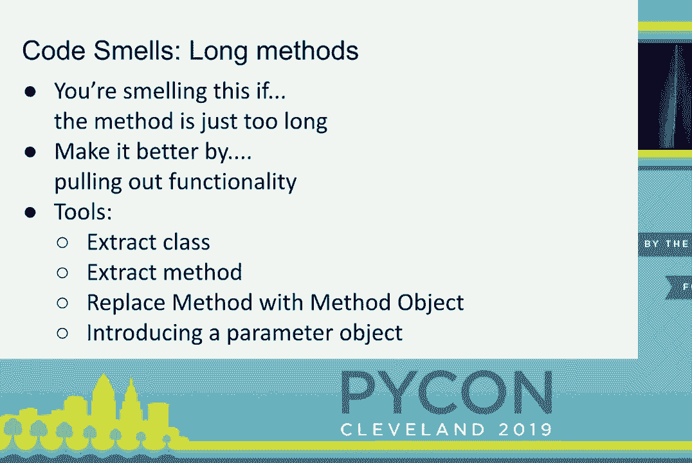

# 重构后：使用参数对象
class TimeRange:
    def __init__(self, start, end):
        self.start = start
        self.end = end

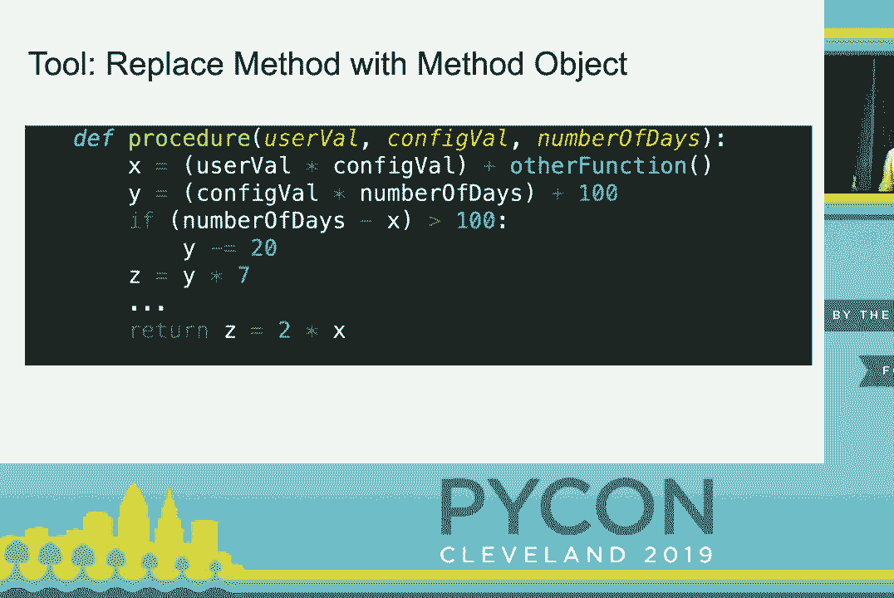

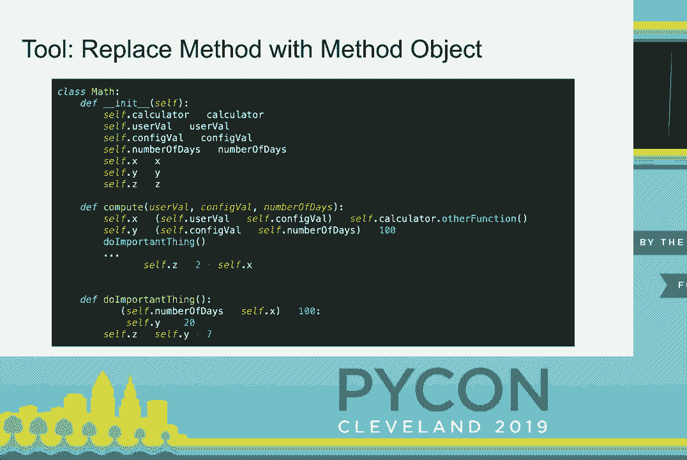

def process_data(time_range, user_id, data_type):
    ...
```

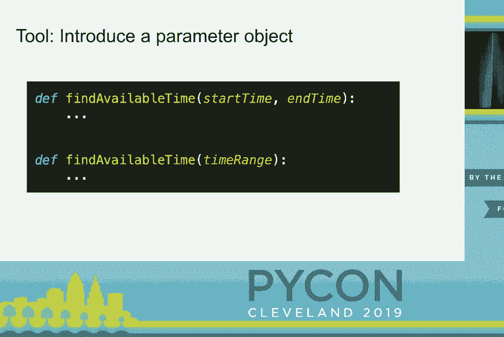

**4. 数据泥团**
如果你发现相同的几项数据总是在多个地方同时出现，就应该考虑将它们提炼成一个独立的数据结构或类。

---

### 处理“不够有用”的代码

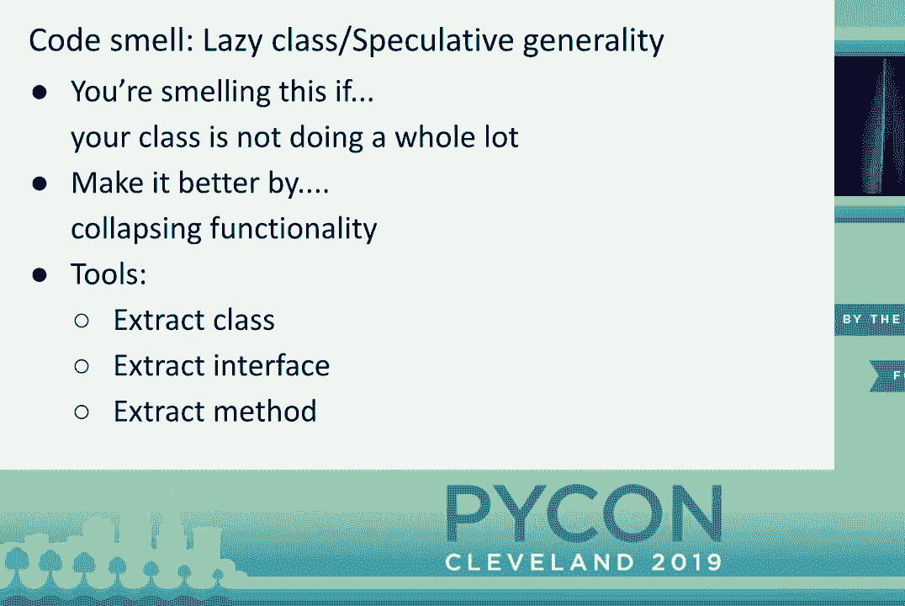

上一节我们讨论了如何拆分过长的代码，本节中我们来看看相反的情况：如何压缩或合并那些“不够有用”的部分。

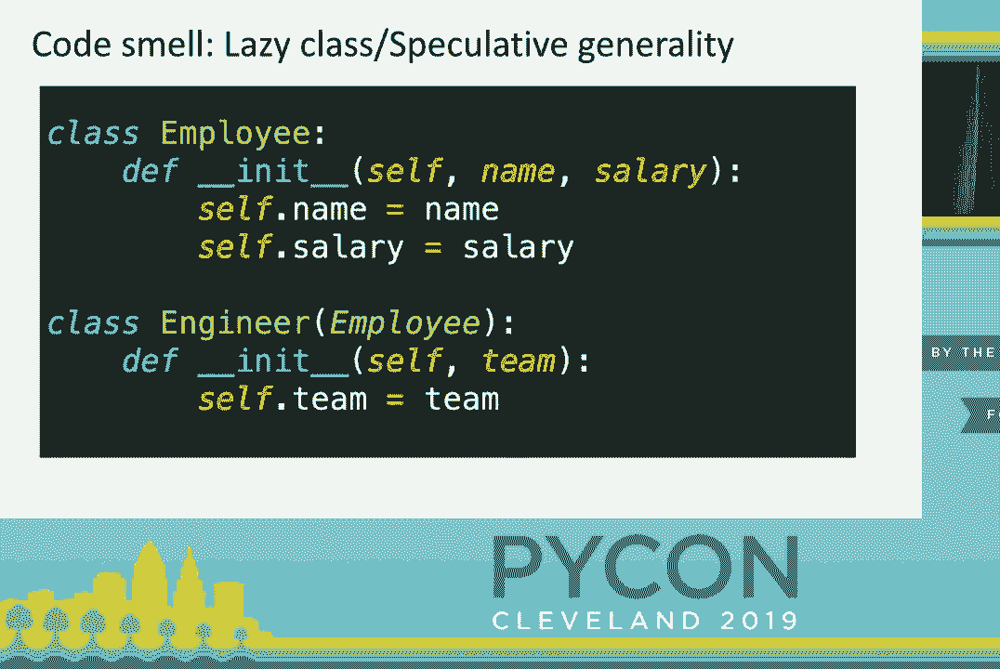

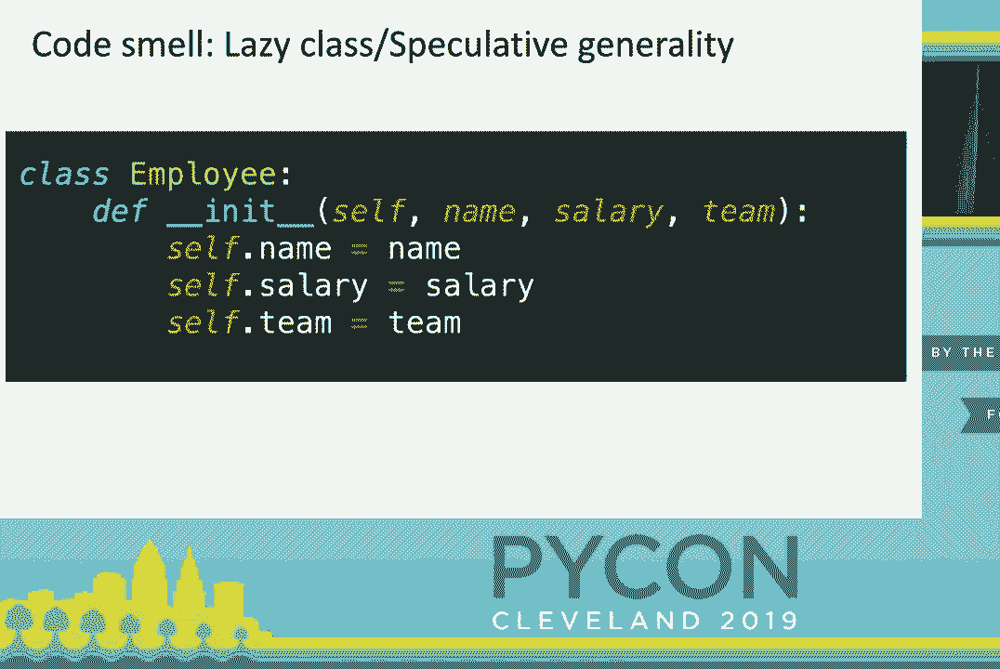

**1. 冗余类（懒惰类/投机泛化）**
这种情况常发生在过度设计时，创建了许多实际上并未承担足够职责的类。解决方案通常是**折叠继承体系**或**内联类**，将功能合并到更有用的类中。

```python
# 重构前：存在无用的父类
class Employee:
    def __init__(self, name):
        self.name = name

class Engineer(Employee):
    def __init__(self, name, team):
        super().__init__(name)
        self.team = team

# 重构后：将属性提升到父类
class Employee:
    def __init__(self, name, team=None): # 团队属性提升
        self.name = name
        self.team = team
```

**2. 纯数据类**
这是“数据泥团”的反面模式。如果一个类仅仅是一堆属性的集合（只有数据，没有行为），那么它可能只是一个数据结构，而非真正的对象。尝试寻找与这些数据相关的行为，并将其移入该类中。

---

### 处理“糟糕的面向对象设计”

这是最复杂的一类代码异味，涉及对象之间的不良交互。

**1. 发散式变化 & 霰弹枪式修改**
*   **发散式变化**：一个类因为多种不同的原因而经常被修改。
*   **霰弹枪式修改**：每做一次修改，都必须在许多不同的类中做出许多小修改。

这两种异味都表明职责没有良好地集中。解决方法是通过**提取类**或**搬移方法**，将相关的变更点集中到一起。

**2. 特性依恋 & 不恰当的亲密关系**
一个对象过于频繁地访问另一个对象的内部数据。这违反了封装原则。解决方案通常是**搬移方法**，将操作数据的方法移到数据所在的类中。

**3. 过度使用Switch语句**
大量的`switch`或`if/elif`语句（尤其是在检查对象类型时）是使用多态的好机会。可以考虑用**状态模式**或**策略模式**来替代。

**4. 过长的消息链**
客户端通过一连串的访问（如`a.getB().getC().getD()`）才能获取所需数据。这增加了耦合度。可以通过**隐藏委托关系**，在中间对象上提供一个方法直接获取最终数据。

**5. 拒绝继承**
子类继承了父类的所有方法，但其中一些并不需要或并不适用。这通常意味着“组合优于继承”的原则被违反了。考虑用**组合**替代**继承**，只包含需要的功能。

---

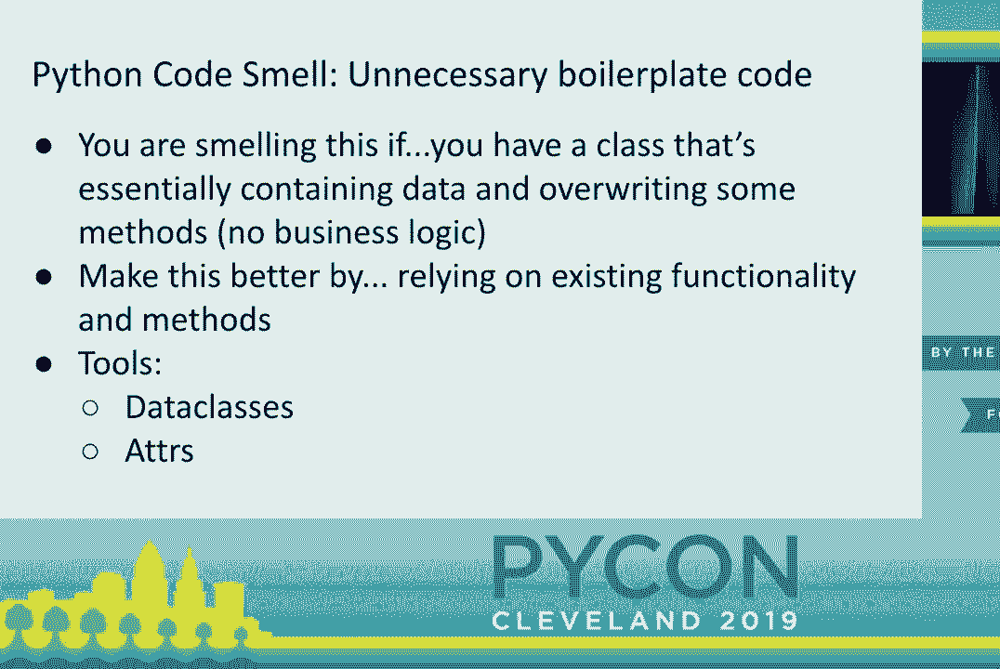

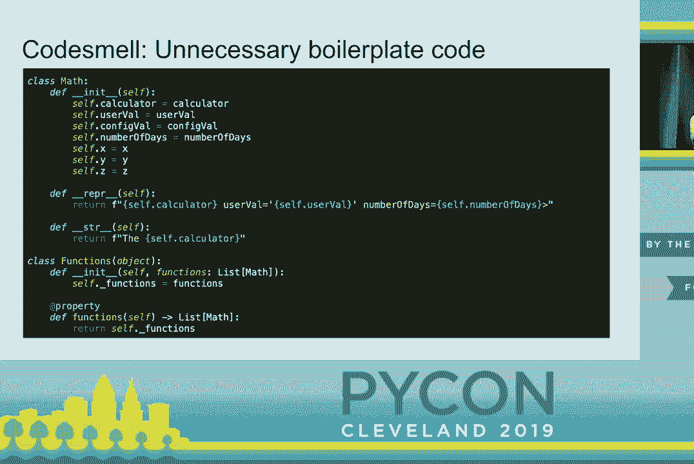

## Python特有的代码异味与重构技巧

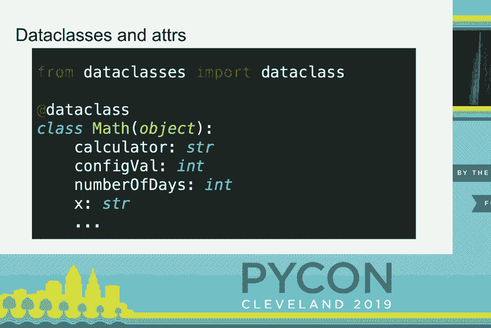

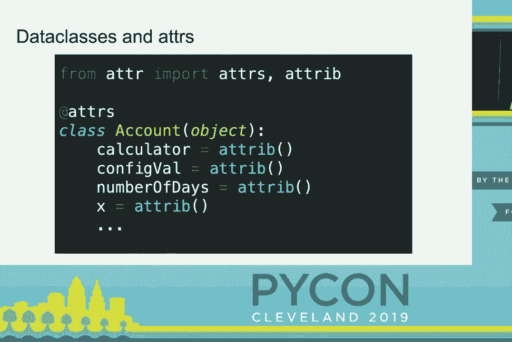

除了通用原则，Python也有一些特有的模式和重构技巧。

**1. 过度嵌套的代码**
深层嵌套的`if/for`语句会降低可读性。可以利用Python的迭代器、提前返回（`early return`）或`any()`/`all()`等内置函数来使代码扁平化。

**2. 冗余的模板代码**
如果你写了一个类，主要就是定义`__init__`来存储属性，并手动实现`__repr__`等方法，那么你可能在重复造轮子。

```python
# 重构前：手动编写模板代码
class Point:
    def __init__(self, x, y):
        self.x = x
        self.y = y
    def __repr__(self):
        return f"Point({self.x}, {self.y})"

# 重构后：使用数据类
from dataclasses import dataclass

@dataclass
class Point:
    x: int
    y: int
```

**3. 异常处理与业务逻辑混杂**
`try...except`块应该专注于错误恢复，而不应包含大量的业务逻辑。将核心逻辑提取到独立的方法中。

**4. 重复的设置与清理代码**
如果代码中频繁出现配对的设置和清理操作（如打开/关闭文件），考虑使用**上下文管理器**（`with`语句）。

---

## 重构实战：一个案例演示

让我们通过一个简化案例，看看如何将复杂的条件逻辑重构得清晰。假设我们要根据季节和库存决定餐厅的菜单。

**初始代码（复杂嵌套）**：
```python
def get_menu(season, ingredients):
    if season == "summer":
        if "bread" in ingredients and "sauce" in ingredients:
            return "pizza"
        elif "cheese" in ingredients and "bread" in ingredients:
            return "grilled_cheese"
        # ... 更多嵌套判断
    elif season == "winter":
        # ... 另一套复杂的嵌套判断
    # ... 其他季节
```
这段代码难以阅读和扩展（例如，增加“是否点酒”的条件会使它更糟）。

**重构步骤**：
1.  **引入菜单项列表**：将选项从条件判断中抽离，定义为数据结构。
2.  **提取方法**：将“判断某道菜是否可用”的逻辑提取成独立方法，使主逻辑更清晰。
3.  **引入类封装**：创建`SeasonalMenu`类，将季节、可用食材和选择逻辑封装在一起，便于测试和扩展。

重构后的代码结构更清晰，职责分离，添加新条件时只需修改特定部分，避免了“霰弹枪式修改”。

**关键要点**：
*   **不要边重构边添加功能**：先重构，稳定后再添加新功能，或者先添加测试再重构。
*   **小步前进**：每次做小的、可验证的更改，比一次性大规模重写更安全、更可控。
*   **追求进步，而非完美**：重构的目标是持续改进，而不是一步到位达到理论上的完美设计。

---

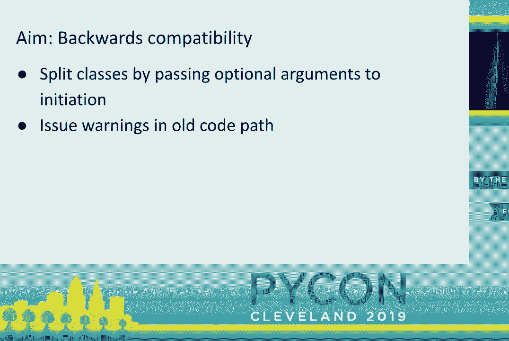

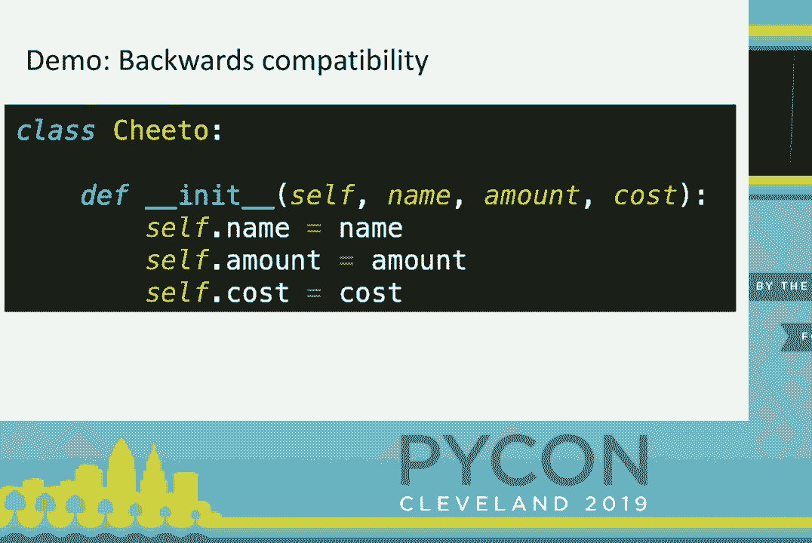

## 重构策略与时机

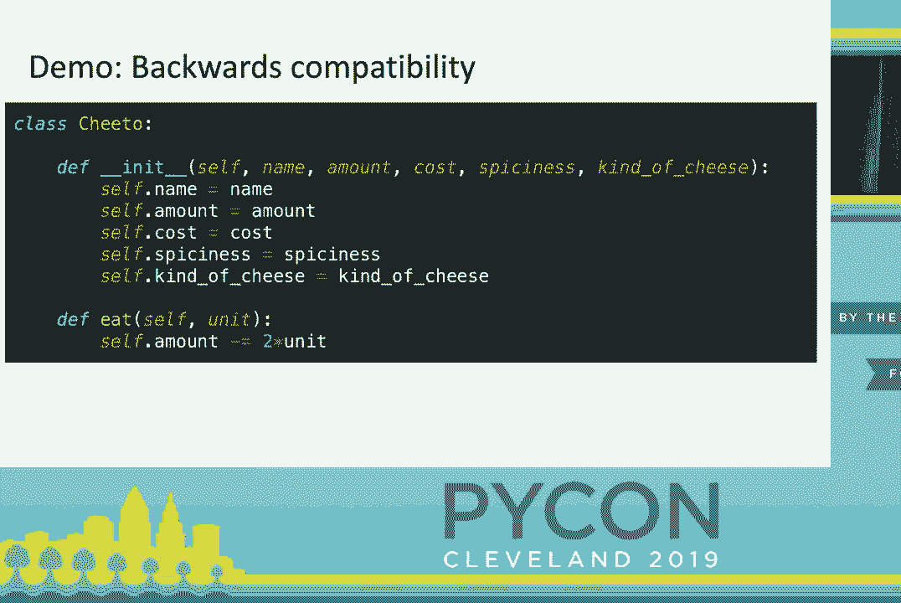

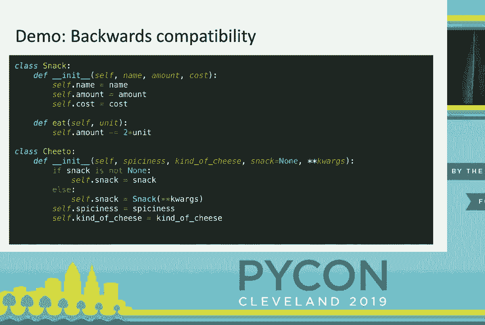

**如何安全地进行重构？**
*   **测试驱动开发**：编写测试 -> 运行测试（失败）-> 重构 -> 运行测试（通过）。
*   **扩展与收缩模式**：当需要保持向后兼容时，先并行运行新旧两套代码，逐步将调用方迁移到新接口，最后删除旧代码。

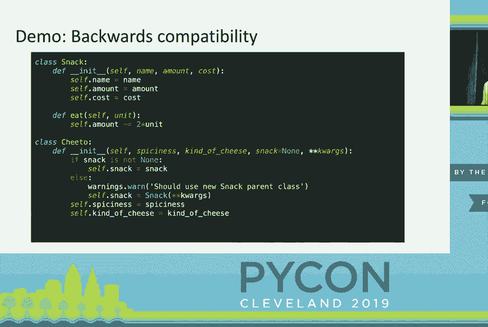

**何时应该重构？**
*   当你后悔之前没有这样做时。
*   当团队中没人能理解某段代码时。
*   当代码的坏味道让后续修改变得异常困难时。
*   当添加注释也无法清晰说明代码意图时（应将“理解”转化为“清晰的代码”）。

**何时不应该重构？**
*   如果添加清晰的注释或文档就能解决问题。
*   如果只是为了炫技或证明自己。
*   如果代码已经糟糕到需要完全重写的地步。

---

## 总结与核心建议

本节课中我们一起学习了重构的核心思想、常见代码异味的识别以及具体的重构方法。

**核心建议**：
1.  **信任你的直觉**：如果你觉得代码“有味道”，那通常值得深入查看。
2.  **牢记目标**：重构是为了**提升可理解性和可维护性**。如果结果更复杂了，那就走错了方向。
3.  **制定策略**：在动手前，想好回滚方案、测试策略以及如何保持兼容性。有计划地小步前进。
4.  **善用工具**：熟悉你的IDE的重构功能（如重命名、提取方法等），它们能极大提高安全性和效率。
5.  **保持沟通**：尤其是对团队共享代码的重构，确保他人了解你的意图和改动。

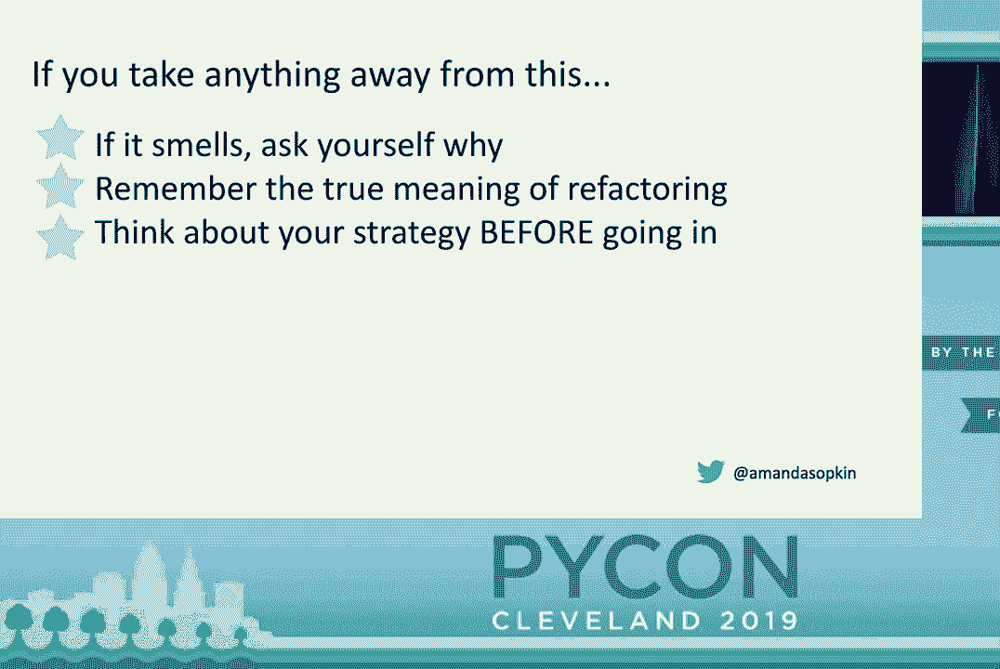

重构是一项需要持续练习的技能。从识别小处的代码异味开始，逐步培养你的“代码嗅觉”，你就能在平衡木上走得越来越稳，创造出更健壮、更优雅的软件。

---
*本教程内容主要思想来源于马丁·福勒的经典著作《重构：改善既有代码的设计》，推荐深入阅读。*